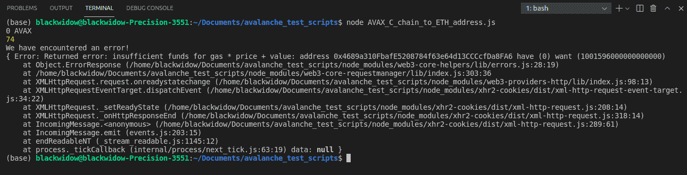
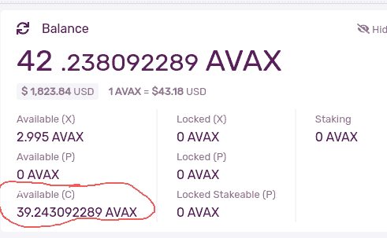
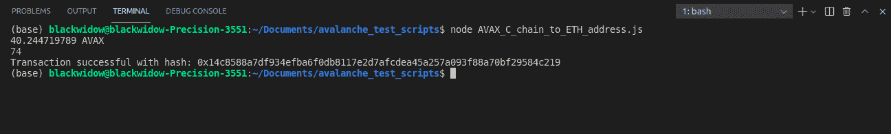

# 介绍

> 原文：<https://github.com/figment-networks/learn-tutorials/blob/master/avalanche/avax-c-chain-to-eth-address-transfer-tutorial.md>

在本教程中，我们将学习如何通过编程将本机 AVAX 令牌从 Avalanche C 链转移到 Metamask wallet。

# 先决条件

*   [打造雪崩钱包](https://wallet.avax.network/create)
*   [用富士水龙头为您的 Avalanche 钱包充值](https://docs.avax.network/build/tutorials/platform/fuji-workflow#get-a-drip-from-the-fuji-faucet)
*   [将富士 Avax 代币从 X 链转移到 C 链](https://docs.avax.network/build/tutorials/platform/transfer-avax-between-x-chain-and-c-chain)
*   拥有集成开发环境，如 [Visual Studio 代码](https://code.visualstudio.com/download)

# 要求

*   [节点 j](https://nodejs.org/en)
*   [乙醚](https://docs.ethers.io/v5/)和 [web3](https://web3js.readthedocs.io/en/v1.5.2/) ，可以用`npm install ethers web3`安装
*   在浏览器中安装[元掩码扩展](https://metamask.io/download.html)。
*   [配置您的 Metamask 以添加 Avalanche FUJI testnet](https://docs.avax.network/build/tutorials/smart-contracts/deploy-a-smart-contract-on-avalanche-using-remix-and-metamask#step-1-setting-up-metamask)

# 转移 AVAX

我们将从在项目的根目录下创建一个名为`AVAX_C_chain_to_ETH_address.js`的新文件开始。一旦您在指定的名称下创建了一个. js 文件，我们将在。

首先，我们需要导入需求中提到的 Ethers 和 Web3 库，以便与 Avalanche C 链进行交互。

```js
const Web3 = require("web3")
const { ethers } = require('ethers')
```

AVAX 钱包中的助记键需要放在下面的引号之间。这稍后用于提取 C 链钱包地址。

```js
let mnemonic = "";
```

下面的代码指向富士网络。或者，我们可以将它指向 Datahub AVAX 节点。

```js
const web3 = new Web3(new Web3.providers.HttpProvider("https://api.avax-test.network/ext/bc/C/rpc"))
```

或者，数据中心版本将如下所示:

```js
const web3 = new Web3(new Web3.providers.HttpProvider(`https://avalanche--fuji--rpc.datahub.figment.io/apikey/${process.env.DATAHUB_AVALANCHE_API_KEY}/ext/bc/C/rpc`))
```

上面的 DataHub 版本示例引用了存储在`.env`文件中的 API 键。参见[dotenv 和。env 文件](https://docs.figment.io/network-documentation/extra-guides/dotenv-and-.env)寻求帮助。注册一个 DataHub 帐户，获取一个 API 密匙，并将其存储在`.env`文件中。

稍后执行传输时需要私钥。有了前面提供的助记短语，我们就可以用下面的 colde 获得 ETH 地址格式的 AVAX 钱包的私钥。

```js
const wallet = new ethers.Wallet.fromMnemonic(mnemonic);
AVAX_privatekey = wallet.privateKey;
```

web3 软件包旨在与以太坊区块链和以太坊智能合约进行交互。web3 模块能够对 EVM 的 AVAX 实现进行操作。所以，当与 C 链交互时，使用 web3 模块。这里，`web3.eth.getBalance`获取 AVAX 余额。下面的`web3.utils.fromWei`中的`result`是账户的余额，单位为卫(乙醚的最小单位为卫，1 乙醚为卫)。`fromWei`是 web3.utils 中的一个方法，将数字从一个单位转换成另一个单位。所以，`web3.utils.fromWei(result, "ether")`在下面的代码中把平衡从魏转换为以太。由于我们正在查看 AVAX 令牌余额，我们将在最后打印 AVAX。

```js
async function main(){
    web3.eth.getBalance(wallet.address, function(err, result) {    
        if (err) {
          console.log(err)
        } else {
          console.log(web3.utils.fromWei(result, "ether") + " AVAX")
        }
    })
```

`console.log(web3.utils.fromWei(result, "ether") + " AVAX")`输出发送者钱包 C 链上的当前余额。

下面的块用于查看与钱包地址相关联的交易数量(对于从 C 链到 ETH 地址的 AVAX 传输来说不是必需的),但在您稍后想要传输 ERC20 令牌时可能会有用。

```js
    web3.eth.getTransactionCount(wallet.address)       
    .then(console.log);                                               
    const createTransaction = await web3.eth.accounts.signTransaction(           
        {
           gas: 21000,
```

`web3.eth.getTransactionCount(wallet.address).then(console.log)`是脚本的一部分，输出账户中迄今为止发生的交易数量。

继续，复制并粘贴您的元掩码钱包地址(或任何 ETH 格式地址)到下面的引号之间

```js
           to:"",
```

下面，我们需要输入有多少令牌将从您的 AVAX wallet 转出 C 链。例如，目前的金额被任意设置为 0.15 个 AVAX 代币(下面一行中为 0.15 个代币)。

```js
           value: web3.utils.toWei('0.15', 'ether'),     
        },
        AVAX_privatekey                                 
     );
     const createReceipt = await web3.eth.sendSignedTransaction(
        createTransaction.rawTransaction
     );
     console.log(
        `Transaction successful with hash: ${createReceipt.transactionHash}`
     );
  };
main().catch((err) => {
    console.log("We have encountered an error!")
    console.error(err)
})
```

此时，传输应该已经完成。`交易成功，哈希:$ { create receipt . transaction hash } `将交易哈希输出到终端。这是你的交易记录。

至此，您已经浏览了整个脚本。

完成的脚本应该如下所示:

```js
const Web3 = require("web3")
const { ethers } = require('ethers')
let mnemonic = "";
const web3 = new Web3(new Web3.providers.HttpProvider("https://api.avax-test.network/ext/bc/C/rpc"))
const wallet = new ethers.Wallet.fromMnemonic(mnemonic);
AVAX_privatekey = wallet.privateKey;

async function main(){
    web3.eth.getBalance(wallet.address, function(err, result) {    
        if (err) {
          console.log(err)
        } else {
          console.log(web3.utils.fromWei(result, "ether") + " AVAX")
        }
    })
    web3.eth.getTransactionCount(wallet.address)       
    .then(console.log);                                               
    const createTransaction = await web3.eth.accounts.signTransaction(           
        {
           gas: 21000,
           to:"",
           value: web3.utils.toWei('0.15', 'ether'),     
        },
        AVAX_privatekey                                 
     );
     const createReceipt = await web3.eth.sendSignedTransaction(
        createTransaction.rawTransaction
     );
     console.log(
        `Transaction successful with hash: ${createReceipt.transactionHash}`
     );
  };
main().catch((err) => {
    console.log("We have encountered an error!")
    console.error(err)
})
```

要运行脚本`AVAX_C_chain_to_ETH_address.js`，键入`node AVAX_C_chain_to_ETH_address.js`并在您的终端中运行它(文件名前的`node`是调用 NodeJS 运行时环境的方式)。

# 解决纷争

## 交易失败

*   检查您的 Avalanche 钱包中是否有足够的余额。

没有足够的余额会导致您的终端出现以下错误。

[](https://camo.githubusercontent.com/bb821ce53d5d54794aa9bd78b30e85f4783352f31e6eaed729226a81bf0f75c9/68747470733a2f2f692e696d6775722e636f6d2f4a68326136596c2e706e67)

确保你在 C 链上的平衡是足够的，如下所示

[](https://camo.githubusercontent.com/d32f68bf9aebac1818e652bdfaff13374a4d176b6e2104d8b9b6a4d84a11bc19/68747470733a2f2f692e696d6775722e636f6d2f643251464255302e706e67)

# 结论

本教程教你如何将 AVAX 本地令牌从 C 链转移到 ETH 钱包。此外，这也显示了雪崩区块链 C 链如何与流行的 web3.js 库兼容。这是雪崩区块链的一个强大的方面，因为它允许以太坊开发者轻松地将他们的工作移植到雪崩。

尝试通过运行此脚本来转移您的 Fuji AVAX 令牌，看看它是否有效。

当一切按预期运行时，终端中的输出应该类似于下面的内容。

[](https://camo.githubusercontent.com/42bb06f451a31037ec0d8c48c1f4d0d2e9b03efea40cfb2b9ac112e1d8dfd3a3/68747470733a2f2f692e696d6775722e636f6d2f7972366e6b746f2e706e67)

# 关于作者

本教程由 [Seongwoo Oh](https://github.com/blackwidoq) 创作。他是学生，雪崩新手。