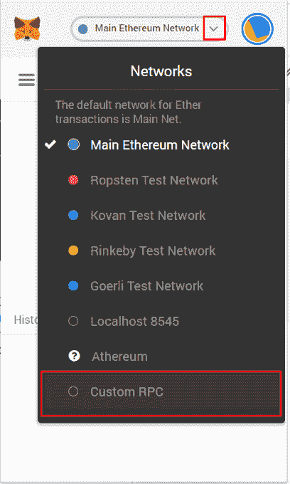
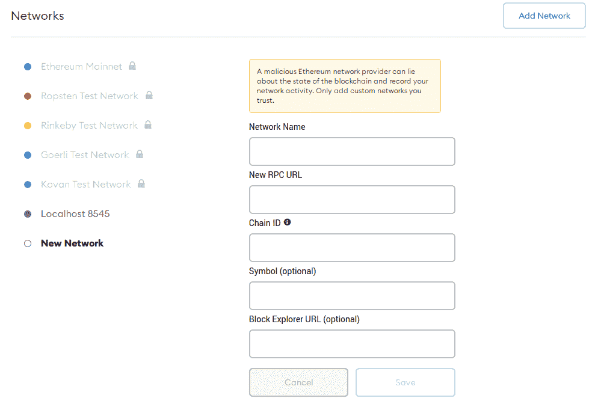
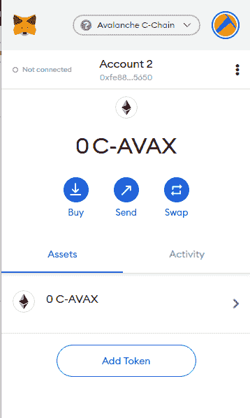

# avalanche/connect-datahub-to-metamask

> 原文：<https://github.com/figment-networks/learn-tutorials/blob/master/avalanche/connect-datahub-to-metamask.md>

[**原版教程可以在 AVA 实验室文档这里找到**](https://docs.avax.network/build/tutorials/smart-digital-assets/integrate-figment-and-metamask) 。

[https://www.youtube.com/watch?v=Q46YMR85ikc&feature = youtu . be&ab _ channel = Avalanche](https://www.youtube.com/watch?v=Q46YMR85ikc&feature=youtu.be&ab_channel=Avalanche)

# 设置

首先，[在 DataHub 上创建一个账户](https://datahub.figment.io/sign_up?service=avalanche)。您将收到一封带有验证链接的电子邮件。单击它后，您将登录到您的 DataHub 仪表板。

# DataHub Dashboard

一旦你登录到你的[数据中心仪表板](https://datahub.figment.io/)，找到`Available protocols`部分并选择 Avalanche。这将带你到雪崩仪表板。我们的 Avalanche 免费层每天有 200，000 个请求的限制。如果你想每天提出更多的请求，你可以升级到我们的[付费选项](https://datahub.figment.io/services/avalanche/prices)。

# 雪崩仪表板

在 Avalanche 仪表盘上，您将获得有关您的计划和 Avalanche APIs 使用情况的数据。

接下来，您将看到您的 API 密钥。大概会是这样的:`f81e193b9412a683af7101e964766c07`。当您调用 Avalanche API 时，这些信息用于验证您的身份。当您调用 Figment 托管的 Avalanche API 时，您必须提供它。

正如仪表盘上的表格所说，您可以在`avalanche--mainnet--rpc.datahub.figment.io`对 Avalanche 的 mainnet 进行 API 调用。您可以在`avalanche--fuji--rpc.datahub.figment.io`对 Fuji testnet 进行 API 调用。

# 尝试一下

将以下命令粘贴到您的计算机终端，以确认您可以访问 Figment 托管的 Avalanche API。这个`curl`是在富士 tesnet 上求 X 链的 blockchainID。用你在 Avalanche 仪表盘上看到的 API 键替换`APIKEYGOESHERE`。

```js
curl --location --request POST 'https://avalanche--fuji--rpc.datahub.figment.io/apikey/APIKEYGOESHERE/ext/info' \--header 'Content-Type: application/json' \--data-raw '{    "jsonrpc":"2.0",    "id"     :1,    "method" :"info.getBlockchainID",    "params": {        "alias":"X"    }}' 
```

如果您能够成功地发布到 DataHub 的完整节点，那么您应该会得到以下响应。

```js
{ 
    "jsonrpc": "2.0",
    "result": {
        "blockchainID": "2JVSBoinj9C2J33VntvzYtVJNZdN2NKiwwKjcumHUWEb5DbBrm" },    "id": 1
}
```

# 设置元掩码

让我们将 Metamask 钱包连接到 Figment 托管的 Avalanche API。打开 Metamask 并选择网络下拉菜单。然后，选择`Custom RPC`:



现在，根据您是想连接 mainnet 还是 Fuji testnet，在方框中填入以下值。同样，用 Figment 中的 API 键替换`APIKEYGOESHERE`。

# Mainnet 设置

*   **网络名称**:虚拟 C 链 Mainnet
*   **新的 RPC URL** : `https://avalanche--mainnet--rpc.datahub.figment.io/apikey/APIKEYGOESHERE/ext/bc/C/rpc`
*   **ChainID** : `0xa86a`
*   **符号** : AVAX
*   **探险家** : `https://cchain.explorer.avax.network`

# 富士设置

*   **网络名**:虚拟 C 链富士
*   **新的 RPC URL** : `https://avalanche--fuji--rpc.datahub.figment.io/apikey/APIKEYGOESHERE/ext/bc/C/rpc`
*   **ChainID** : `0xa869`
*   **符号** : AVAX
*   **探险家** : `https://cchain.explorer.avax-test.network`



设置完所有参数后，您应该会看到这个页面，它显示了您的(空)余额。



# 结论

您已经成功地将 Metamask 连接到 Avalanche DataHub，并且可以与 C 链无缝交互。

如果您在阅读本教程时有任何困难，或者只是想与我们讨论雪崩技术，您可以今天就[加入我们的社区](https://discord.gg/fszyM7K)！