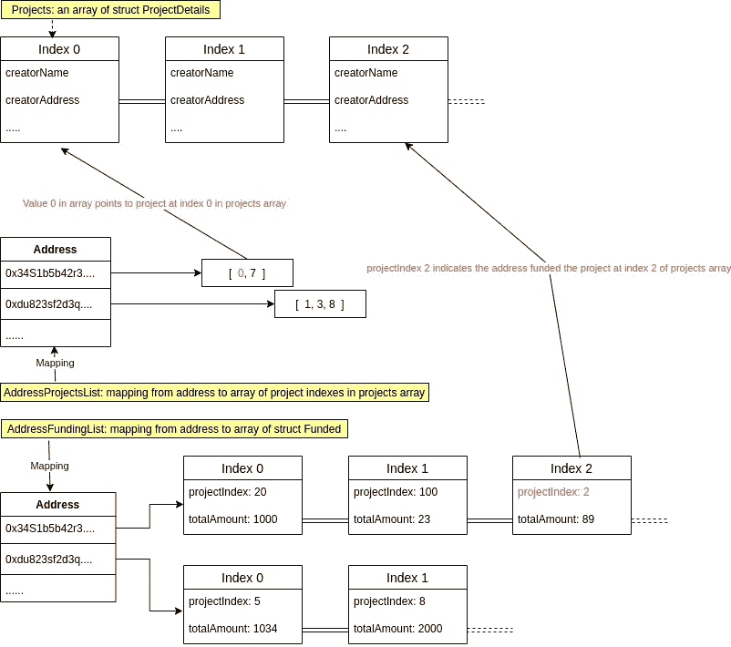
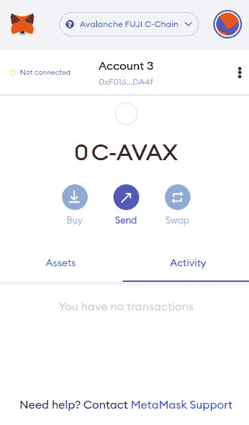

# avalanche/create-a-decentralized-kickstarter

> 原文：<https://github.com/figment-networks/learn-tutorials/blob/master/avalanche/create-a-decentralized-kickstarter.md>

在本教程中，我们将学习如何建立一个分散的 Kickstarter dApp 功能，即创建一个项目，资助一个项目，撤回资金，获得退款，如果资助不成功等。我们将在 ReactJS 的帮助下，在 Solidity 和我们的应用程序前端构建智能合约。Avalanche 是一个低成本、高速的区块链网络，我们可以在其上部署用 solidity 编写的智能合同。由于其较低的燃气费和较高的每秒交易量，Avalanche 是在其上部署 dApps 的良好平台。

# 先决条件

*   熟悉反应和可靠性。
*   应该已经完成[使用 Remix 和 MetaMask 在 Avalanche 上部署智能合约](https://learn.figment.io/tutorials/deploy-a-smart-contract-on-avalanche-using-remix-and-metamask)教程

# 要求

*   [Node.js](https://nodejs.org/en/download/releases/) v10.18.0+
*   浏览器上的[元掩码扩展](https://metamask.io/download/)

# 实施智能合同

[](https://github.com/figment-networks/learn-tutorials/raw/master/assets/create-a-decentralized-kickstarter-05.jpg)

上图显示了智能合约的架构。

现在，我们将构建应用程序的智能契约。先来做一个名为**众筹**的合同。

```js
// SPDX-License-Identifier: MIT
pragma solidity >=0.8.0 <0.9.0;

contract Crowdfunding {
}
```

让我们定义契约状态所需的结构和枚举。我们将创建两个枚举: **Category** ，它可以有四个值来表示项目所属的类别，以及 **RefundPolicy** ，它可以有两个值。

*   *可退还* :-此类项目在项目未能在期限内达到目标金额时，返还出资人资助的金额。
*   *不可归还* :-对于这种类型的项目，即使没有达到资助目标，创建者也可以索取金额。

接下来，我们声明我们的结构，我们将创建三个**项目**、**项目元数据**和**资助**。

```js
// The category values
enum Category {
    DESIGNANDTECH,
    FILM,
    ARTS,
    GAMES
}

// Refund policies 
enum RefundPolicy {
    REFUNDABLE,
    NONREFUNDABLE
}

// Structure of each project in our dApp 
struct Project {
    string projectName;             // Stores the project's name
    string projectDescription;      // Stores the project's description
    string creatorName;             // Stores the project creator name
    string projectLink;             // Stores project link if any
    string cid;                     // Stores the ipfs link to project's image
    uint256 fundingGoal;            // Stores the funding goal
    uint256 duration;               // Stores the duration of project in minutes
    uint256 creationTime;           // Stores the project creation time
    uint256 amountRaised;           // Stores the amount contributed to this project
    address creatorAddress;         // Stores the creator's address
    Category category;              // Stores the project category 
    RefundPolicy refundPolicy;      // Stores the refund policy
    address[] contributors;         // Stores the contributors of this project
    uint256[] amount;               // Stores the amount contributed by conrtibutors at corresponding index at contributors array
    bool[] refundClaimed;           // Keeps record if the contributors claimed refund at cooresponding index at contributors array
    bool claimedAmount;             // Keeps record if creator claimed raised funds
}

// Structure used to return metadata of each project
struct ProjectMetadata {
    string projectName;             // Stores the project's name
    string projectDescription;      // Stores the project's description
    string creatorName;             // Stores the project creator name
    string cid;                     // Stores Ipfs link to project's image
    uint256 fundingGoal;            // Stores the goal amount
    uint256 amountRaised;           // Stores raised funds
    uint256 totalContributors;      // Stores the length of contributors array
    uint256 creationTime;           // Stores the creation time
    uint256 duration;               // Stores duration for which project can be funded 
    Category category;              // Stores the project category
}

// Each user funding gets recorded in Funded structure
struct Funded {
	uint256 projectIndex;           // Stores the project index of project that's funded
	uint256 totalAmount;            // Stores the amount funded
}
```

我们现在定义状态变量。

```js
// Stores all the projects 
Project[] projects;

// Stores the indexes of projects created on projects list by an address
mapping(address => uint256[]) addressProjectsList;

// Stores the list of fundings  by an address
mapping(address => Funded[]) addressFundingList;
```

现在，我们定义一个修饰符，它将帮助检查传递的参数是否是项目数组中的有效索引。

```js
// Checks if an index is a valid index in projects array
modifier validIndex(uint256 _index) {
    require(_index < projects.length, "Invalid Project Id");
    _;
}
```

现在我们将定义一个创建新项目的函数。

```js
// Create a new project and updates the addressProjectsList and projects array
function createNewProject(
    string memory _name,
    string memory _desc,
    string memory _creatorName,
    string memory _projectLink,
    string memory _cid,
    uint256 _fundingGoal,
    uint256 _duration,
    Category _category,
    RefundPolicy _refundPolicy
) external {
    projects.push(Project({
        creatorAddress: msg.sender,
        projectName: _name,
        projectDescription: _desc,
        creatorName: _creatorName,
        projectLink: _projectLink,
        cid: _cid,
        fundingGoal: _fundingGoal * 10**18,
        duration: _duration * (1 minutes),
        creationTime: block.timestamp,
        category: _category,
        refundPolicy: _refundPolicy,
        amountRaised: 0,
        contributors: new address[](0),
        amount: new uint256[](0),
        claimedAmount: false,
        refundClaimed: new bool[](0)
    }));
    addressProjectsList[msg.sender].push(projects.length - 1);
}
```

我们现在将创建三个函数来检索项目细节。`getAllProjectsDetail`函数帮助检索所有项目的元数据。接下来，`getProjectsDetail`接受一个项目索引数组，并返回其索引出现在数组中的所有项目的元数据。`getProject`接受一个索引，并在**项目**数组的索引处检索项目细节。

```js
// Returns the project metadata of all entries in projects
function getAllProjectsDetail() external view returns(ProjectMetadata[] memory allProjects) {
    ProjectMetadata[] memory newList = new ProjectMetadata[](projects.length);
    for(uint256 i = 0; i < projects.length; i++){
        newList[i] = ProjectMetadata(
            projects[i].projectName,
            projects[i].projectDescription,
            projects[i].creatorName,
            projects[i].cid,
            projects[i].fundingGoal,
            projects[i].amountRaised,
            projects[i].contributors.length,
            projects[i].creationTime,
            projects[i].duration,
            projects[i].category
        );
    }
    return newList;
}

// Takes array of indexes as parameter
// Returns array of metadata of project at respective indexes 
function getProjectsDetail(uint256[] memory _indexList) external view returns(ProjectMetadata[] memory projectsList) {
    ProjectMetadata[] memory newList = new ProjectMetadata[](_indexList.length);
    for(uint256 index = 0; index < _indexList.length; index++) {
        if(_indexList[index] < projects.length) {
            uint256 i = _indexList[index]; 
            newList[index] = ProjectMetadata(
                projects[i].projectName,
                projects[i].projectDescription,
                projects[i].creatorName,
                projects[i].cid,
                projects[i].fundingGoal,
                projects[i].amountRaised,
                projects[i].contributors.length,
                projects[i].creationTime,
                projects[i].duration,
                projects[i].category
            );
        } else {
            newList[index] = ProjectMetadata(
                "Invalid Project",
                "Invalid Project",
                "Invalid Project",
                "Invalid Project",
                0,
                0,
                0,
                0,
                0,
                Category.DESIGNANDTECH
            );
        }
    }
    return newList;
}

// Returns the project at the given index
function getProject(uint256 _index) external view validIndex(_index) returns(Project memory project) {
    return projects[_index];
}
```

现在我们创建两个函数`getCreatorProjects`和`getUserFundings`。

```js
// Returns array of indexes of projects created by creator
function getCreatorProjects(address creator) external view returns(uint256[] memory createdProjects) {
    return addressProjectsList[creator];
}

// Returns array of details of fundings by the contributor
function getUserFundings(address contributor) external view returns(Funded[] memory fundedProjects) {
    return addressFundingList[contributor];
}
```

实现为项目提供资金的功能的时间。功能`addContribution`和`addToFundingList`是`fundProject`功能的辅助功能。`addContribution`检查贡献者是否已经存在并更新金额，如果不存在，则将贡献金额和贡献者添加到项目中。类似地，`addToFundingList`检查是否有先前的贡献，然后更新数量，如果没有找到，则添加新的结构`Funded`以在映射`addressFundingList`中保存贡献细节。

```js
// Helper function adds details of Funding to addressFundingList
function addToFundingList(uint256 _index) internal validIndex(_index) {
    for(uint256 i = 0; i < addressFundingList[msg.sender].length; i++) {
        if(addressFundingList[msg.sender][i].projectIndex == _index) {
            addressFundingList[msg.sender][i].totalAmount += msg.value;
            return;
        }
    }
    addressFundingList[msg.sender].push(Funded(_index, msg.value));
}

// Helper fundtion adds details of funding to the project in projects array
function addContribution(uint256 _index) internal validIndex(_index)  {
    for(uint256 i = 0; i < projects[_index].contributors.length; i++) {
        if(projects[_index].contributors[i] == msg.sender) {
            projects[_index].amount[i] += msg.value;
            addToFundingList(_index);
            return;
        }
    }
    projects[_index].contributors.push(msg.sender);
    projects[_index].amount.push(msg.value);
    if(projects[_index].refundPolicy == RefundPolicy.REFUNDABLE) {
        projects[_index].refundClaimed.push(false);
    }
    addToFundingList(_index);
}

// Funds the projects at given index
function fundProject(uint256 _index) payable external validIndex(_index)  {
    require(projects[_index].creatorAddress != msg.sender, "You are the project owner");
    require(projects[_index].duration + projects[_index].creationTime >= block.timestamp, "Project Funding Time Expired");
    addContribution(_index);
    projects[_index].amountRaised += msg.value;
}
```

`claimFund`函数在两种情况下将筹集的金额转移给项目创建者。

*   项目资助期限已过，筹集的金额超过了资助目标。
*   项目资助期限已过，募集金额未超过资助目标，但项目退款政策为**不退款**。

```js
// Helps project creator to transfer the raised funds to his address
function claimFund(uint256 _index) validIndex(_index) external {
    require(projects[_index].creatorAddress == msg.sender, "You are not Project Owner");
    require(projects[_index].duration + projects[_index].creationTime < block.timestamp, "Project Funding Time Not Expired");
    require(projects[_index].refundPolicy == RefundPolicy.NONREFUNDABLE 
    || projects[_index].amountRaised >= projects[_index].fundingGoal, "Funding goal not reached");
    require(!projects[_index].claimedAmount, "Already claimed raised funds");
    projects[_index].claimedAmount = true;
    payable(msg.sender).transfer(projects[_index].amountRaised);
}
```

当**可退款**项目无法实现其资助目标时，捐助者可以借助`claimRefund`功能获得退款。`getContributorIndex`是一个帮助器函数，用于检索**贡献者**数组中的`msg.sender`索引，如果他们已经贡献了，则返回-1。

```js
// Helper function to get the contributor index in the projects' contributor's array
function getContributorIndex(uint256 _index) validIndex(_index) internal view returns(int256) {
    int256 contributorIndex = -1;
    for(uint256 i = 0; i < projects[_index].contributors.length; i++) {
        if(msg.sender == projects[_index].contributors[i]) {
            contributorIndex = int256(i);
            break;
        }
    }
    return contributorIndex;
}

// Enables the contributors to claim refund when refundable project doesn't reach its goal
function claimRefund(uint256 _index) validIndex(_index) external {
    require(projects[_index].duration + projects[_index].creationTime < block.timestamp, "Project Funding Time Not Expired");
    require(projects[_index].refundPolicy == RefundPolicy.REFUNDABLE 
    && projects[_index].amountRaised < projects[_index].fundingGoal, "Funding goal not reached");

    int256 index = getContributorIndex(_index);
    require(index != -1, "You did not contribute to this project");

    uint256 contributorIndex = uint256(index);
    require(!projects[_index].refundClaimed[contributorIndex], "Already claimed refund amount");

    projects[_index].refundClaimed[contributorIndex] = true;
    payable(msg.sender).transfer(projects[_index].amount[contributorIndex]);
}
```

我们现在已经完成了智能合同的实现。现在我们来看一下合同部署。

# 部署智能合同

## 设置元掩码

登录到元掩码->单击网络下拉菜单->选择自定义 RPC

[](https://raw.githubusercontent.com/figment-networks/learn-tutorials/master/assets/create-an-amm-on-avalanche_metamask.png)

#### 富士测试网设置:

*   **网络名称:**雪崩富士 C 链
*   **新建 RPC 网址:**[https://API . avax-test . network/ext/BC/C/RPC](https://api.avax-test.network/ext/bc/C/rpc)
*   **ChainID:** `43113`
*   **符号:** `C-AVAX`
*   **探索者:**[https://cchain . Explorer . avax-test . network](https://cchain.explorer.avax-test.network)

从 Avalanche testnet [水龙头](https://faucet.avax-test.network/)资助你的地址。

## 使用 Remix 部署

打开[混音](https://remix.ethereum.org/) - >选择实度

[](https://raw.githubusercontent.com/figment-networks/learn-tutorials/master/assets/create-an-amm-on-avalanche_remix.png)

在 Remix 文件资源管理器中创建一个`Crowdfunding.sol`文件，并粘贴以下代码:

```js
// SPDX-License-Identifier: MIT
pragma solidity >=0.8.0 <0.9.0;

contract Crowdfunding {
    enum Category {
        DESIGNANDTECH,
        FILM,
        ARTS,
        GAMES
    }

    enum RefundPolicy {
        REFUNDABLE,
        NONREFUNDABLE
    }

    // Structure of each project in our dApp 
    struct Project {
        string projectName;
        string projectDescription;
        string creatorName;
        string projectLink;
        string cid;
        uint256 fundingGoal;
        uint256 duration;
        uint256 creationTime;
        uint256 amountRaised;
        address creatorAddress;
        Category category;
        RefundPolicy refundPolicy;
        address[] contributors;
        uint256[] amount;
        bool[] refundClaimed;
        bool claimedAmount;
    }

    // Structure used to return metadata of each project
    struct ProjectMetadata {
        string projectName;
        string projectDescription;
        string creatorName;
        string cid;
        uint256 fundingGoal;
        uint256 amountRaised;
        uint256 totalContributors;
        uint256 creationTime;
        uint256 duration;
        Category category;
    }

    // Each user funding gets recorded in Funded structure
    struct Funded {
		uint256 projectIndex;
		uint256 totalAmount;
    }

    // Stores all the projects 
    Project[] projects;

    // Stores the indexes of projects created on projects list by an address
    mapping(address => uint256[]) addressProjectsList;

    // Stores the list of fundings  by an address
    mapping(address => Funded[]) addressFundingList;

    // Checks if an index is a valid index in projects array
    modifier validIndex(uint256 _index) {
        require(_index < projects.length, "Invalid Project Id");
        _;
    }

    // Create a new project and updates the addressProjectsList and projects array
    function createNewProject(
        string memory _name,
        string memory _desc,
        string memory _creatorName,
        string memory _projectLink,
        string memory _cid,
        uint256 _fundingGoal,
        uint256 _duration,
        Category _category,
        RefundPolicy _refundPolicy
    ) external {
        projects.push(Project({
            creatorAddress: msg.sender,
            projectName: _name,
            projectDescription: _desc,
            creatorName: _creatorName,
            projectLink: _projectLink,
            cid: _cid,
            fundingGoal: _fundingGoal * 10**18,
            duration: _duration * (1 minutes),
            creationTime: block.timestamp,
            category: _category,
            refundPolicy: _refundPolicy,
            amountRaised: 0,
            contributors: new address[](0),
            amount: new uint256[](0),
            claimedAmount: false,
            refundClaimed: new bool[](0)
        }));
        addressProjectsList[msg.sender].push(projects.length - 1);
    }

    // Returns the project metadata of all entries in projects
    function getAllProjectsDetail() external view returns(ProjectMetadata[] memory allProjects) {
        ProjectMetadata[] memory newList = new ProjectMetadata[](projects.length);
        for(uint256 i = 0; i < projects.length; i++){
            newList[i] = ProjectMetadata(
                projects[i].projectName,
                projects[i].projectDescription,
                projects[i].creatorName,
                projects[i].cid,
                projects[i].fundingGoal,
                projects[i].amountRaised,
                projects[i].contributors.length,
                projects[i].creationTime,
                projects[i].duration,
                projects[i].category
            );
        }
        return newList;
    }

    // Takes array of indexes as parameter
    // Returns array of metadata of project at respective indexes 
    function getProjectsDetail(uint256[] memory _indexList) external view returns(ProjectMetadata[] memory projectsList) {
        ProjectMetadata[] memory newList = new ProjectMetadata[](_indexList.length);
        for(uint256 index = 0; index < _indexList.length; index++) {
            if(_indexList[index] < projects.length) {
                uint256 i = _indexList[index]; 
                newList[index] = ProjectMetadata(
                    projects[i].projectName,
                    projects[i].projectDescription,
                    projects[i].creatorName,
                    projects[i].cid,
                    projects[i].fundingGoal,
                    projects[i].amountRaised,
                    projects[i].contributors.length,
                    projects[i].creationTime,
                    projects[i].duration,
                    projects[i].category
                );
            } else {
                newList[index] = ProjectMetadata(
                    "Invalid Project",
                    "Invalid Project",
                    "Invalid Project",
                    "Invalid Project",
                    0,
                    0,
                    0,
                    0,
                    0,
                    Category.DESIGNANDTECH
                );
            }

        }
        return newList;
    }

    // Returns the project at the given index
    function getProject(uint256 _index) external view validIndex(_index) returns(Project memory project) {
        return projects[_index];
    }

    // Returns array of indexes of projects created by creator
    function getCreatorProjects(address creator) external view returns(uint256[] memory createdProjects) {
        return addressProjectsList[creator];
    }

    // Returns array of details of fundings by the contributor
    function getUserFundings(address contributor) external view returns(Funded[] memory fundedProjects) {
        return addressFundingList[contributor];
    }

    // Helper function adds details of Funding to addressFundingList
    function addToFundingList(uint256 _index) internal validIndex(_index) {
        for(uint256 i = 0; i < addressFundingList[msg.sender].length; i++) {
            if(addressFundingList[msg.sender][i].projectIndex == _index) {
                addressFundingList[msg.sender][i].totalAmount += msg.value;
                return;
            }
        }
        addressFundingList[msg.sender].push(Funded(_index, msg.value));
    }

    // Helper fundtion adds details of funding to the project in projects array
    function addContribution(uint256 _index) internal validIndex(_index)  {
        for(uint256 i = 0; i < projects[_index].contributors.length; i++) {
            if(projects[_index].contributors[i] == msg.sender) {
                projects[_index].amount[i] += msg.value;
                addToFundingList(_index);
                return;
            }
        }
        projects[_index].contributors.push(msg.sender);
        projects[_index].amount.push(msg.value);
        if(projects[_index].refundPolicy == RefundPolicy.REFUNDABLE) {
            projects[_index].refundClaimed.push(false);
        }
        addToFundingList(_index);
    }

    // Funds the projects at given index
    function fundProject(uint256 _index) payable external validIndex(_index)  {
        require(projects[_index].creatorAddress != msg.sender, "You are the project owner");
        require(projects[_index].duration + projects[_index].creationTime >= block.timestamp, "Project Funding Time Expired");
        addContribution(_index);
        projects[_index].amountRaised += msg.value;
    }

    // Helps project creator to transfer the raised funds to his address
    function claimFund(uint256 _index) validIndex(_index) external {
        require(projects[_index].creatorAddress == msg.sender, "You are not Project Owner");
        require(projects[_index].duration + projects[_index].creationTime < block.timestamp, "Project Funding Time Not Expired");
        require(projects[_index].refundPolicy == RefundPolicy.NONREFUNDABLE 
        || projects[_index].amountRaised >= projects[_index].fundingGoal, "Funding goal not reached");
        require(!projects[_index].claimedAmount, "Already claimed raised funds");
        projects[_index].claimedAmount = true;
        payable(msg.sender).transfer(projects[_index].amountRaised);
    }

    // Helper function to get the contributor index 
    function getContributorIndex(uint256 _index) validIndex(_index) internal view returns(int256) {
        int256 contributorIndex = -1;
        for(uint256 i = 0; i < projects[_index].contributors.length; i++) {
            if(msg.sender == projects[_index].contributors[i]) {
                contributorIndex = int256(i);
                break;
            }
        }
        return contributorIndex;
    }

    // Enables the contributors to claim refund when refundable project doesn't reach its goal
    function claimRefund(uint256 _index) validIndex(_index) external {
        require(projects[_index].duration + projects[_index].creationTime < block.timestamp, "Project Funding Time Not Expired");
        require(projects[_index].refundPolicy == RefundPolicy.REFUNDABLE 
        && projects[_index].amountRaised < projects[_index].fundingGoal, "Funding goal not reached");

        int256 index = getContributorIndex(_index);
        require(index != -1, "You did not contribute to this project");

        uint256 contributorIndex = uint256(index);
        require(!projects[_index].refundClaimed[contributorIndex], "Already claimed refund amount");

        projects[_index].refundClaimed[contributorIndex] = true;
        payable(msg.sender).transfer(projects[_index].amount[contributorIndex]);
    }
}
```

现在，导航到左侧导航栏的 solidity contract compiler 选项卡，点击蓝色按钮编译`crowdfunding.sol`合同。此外，编译完成后，记下`ABI`的位置。

确保 Remix 中使用的 Solidity 编译器版本与智能合约开头使用的版本相匹配。

导航到“部署”选项卡并打开“环境”下拉菜单。选择“注入的 Web3”(确保元掩码已加载)，然后单击“部署”按钮。

在 testnet 上部署智能合约之前，确保 Remix 中的部署环境设置为 **Injected web3** 。

在 Metamask 弹出界面上审批交易。一旦我们的合同成功部署，记下已部署的`contract address`。

# 在 React 中创建前端

现在，我们将创建一个 react 应用程序，并设置应用程序的前端。
打开终端，导航到我们将创建应用程序的目录。

```js
cd /path/to/directory 
```

现在，克隆 github 存储库，移动到新创建的`crowdfunding-platform-avalanche`目录并安装所有依赖项。

```js
git clone https://github.com/hyp3r5pace/crowdfunding-platform-avalanche.git
cd crowdfunding-platform-avalanche
npm install 
```

在我们的 React 应用程序中，我们将所有 React 组件保存在`src/components`目录中。

## 家庭组件

它呈现 dApp 的主页。主页上显示了在 dApp 上发布的各种申请资助的项目。主页有三个部分，主要是特色项目部分、推荐项目部分和最近上传部分。推荐项目板块推荐一些项目给你去看看。“最近上传”部分显示了最近上传的申请资金的项目。此外，主页顶部还显示了网站上发布的项目总数，以及迄今为止 AVAX 资助的总额和资助项目的独立用户数量。

## 创建项目组件

它呈现一个用于创建新项目的表单。该表单具有创建新项目所需的各种输入，例如项目类别、项目名称、项目描述、创建者名称、图像、项目网站链接、资助目标、资助持续时间、退款政策。提交表单后，项目详细信息将发送到智能合同。表单中提供的图像然后被上传到 IPFS，然后将项目细节发送到智能合同。因此，智能合约不包含图像本身，而是包含到图像的 IPFS 链接。

## ProjectComponent

项目组件呈现单个项目的所有细节。在顶部，它显示项目名称和图像，然后是到目前为止收到的总资金，为项目提供资金的独特人员的数量，以及一个用户使用 AVAX 为项目提供资金的按钮。之后，它显示项目描述和其他项目信息，如项目所有者姓名、项目链接、退款政策、项目类别和创建日期。在底部，呈现了一个表格，列出了到目前为止对项目做出贡献的所有贡献者以及他们贡献的金额，按照贡献金额的降序排序。

## 支付模式

该组件在点击 **back this project** 按钮时呈现支付模式。该模式有一个输入，用于输入您希望提供资金的 AVAX 的金额，还有一个 **fund** 按钮，用于将资金发送给合同。AVAX 令牌传输成功后，模式会自动关闭。

## profile 组件

该组件呈现用户的简档信息。该组件有三个部分，分别是**进行中项目**部分、**完成项目**部分和**资助项目**部分。**正在进行的项目**部分显示用户已经创建的所有项目以及尚未结束的资助期。**已完成项目**部分显示用户已经创建的所有项目以及已经结束的资助期。**资助的项目**部分显示用户提供了部分资助的所有项目。如果您访问其他用户的个人资料，则**项目资助**部分不会显示。
要访问您的个人资料，请点击导航栏右端显示的帐户地址。

## 发现组件

该组件根据所选的项目类别呈现发布在站点上的项目列表。有四个类别，即设计和技术，电影，艺术和游戏。

## 连接钱包

该组件呈现站点的第一页。它包含一个**连接到元掩码**按钮，允许您将元掩码帐户连接到 dApp。

## ScrollShowbarComponent

该组件呈现一个 carousel，其他各种组件使用它来显示项目列表。

在启动 React 应用程序之前，不要忘记更改`App.js`文件中的合同地址。

# 游戏攻略

你可以点击查看 dApp [的现场演示](https://hyp3r5pace.github.io/crowdfunding-platform-avalanche/)

## 创建项目

[](https://github.com/figment-networks/learn-tutorials/raw/master/assets/create-a-decentralized-kickstarter-01.gif)

## 基金项目

[](https://github.com/figment-networks/learn-tutorials/raw/master/assets/create-a-decentralized-kickstarter-02.gif)

## 索赔基金

[](https://github.com/figment-networks/learn-tutorials/raw/master/assets/create-a-decentralized-kickstarter-03.gif)

## 索赔退款

[](https://github.com/figment-networks/learn-tutorials/raw/master/assets/create-a-decentralized-kickstarter-04.gif)

# 结论

恭喜你！我们已经成功开发了一个工作分散的众筹应用程序，用户可以在其中创建项目，资助各种项目，甚至在可能的情况下申请退款。下一步，您可以尝试向 dApp 添加新功能，比如向 dApp 所有者提供版税，或者向项目的顶级贡献者提供 NFTs。

# 解决纷争

## 交易失败

*   在 [Fuji block-explorer](https://cchain.explorer.avax-test.network/) 检查您的账户是否有足够的余额。你可以通过雪崩测试网[的水龙头](https://faucet.avax-test.network/)来资助你的地址。

[](https://raw.githubusercontent.com/figment-networks/learn-tutorials/master/assets/create-an-amm-on-avalanche_zero_balance.jpeg)

*   如果您有多个帐户连接到该站点，请确保您在 Metamask 上选择了正确的帐户。

[](https://raw.githubusercontent.com/figment-networks/learn-tutorials/master/assets/create-an-amm-on-avalanche_multiple_accounts.jpeg)

# 关于作者

本教程由 [Soumyajit Deb](https://github.com/hyp3r5pace) 和 [Sayan Kar](https://github.com/SayanKar) 创作。你可以联系 [Soumyajit Deb](https://www.linkedin.com/in/soumyajitdeb/) 和 [Sayan Kar](https://www.linkedin.com/in/sayan-kar-/) 对教程有任何疑问。

# 参考

[使用 Remix 和 Metamask 在 Avalanche 上部署智能合约](https://docs.avax.network/build/tutorials/smart-contracts/deploy-a-smart-contract-on-avalanche-using-remix-and-metamask/)