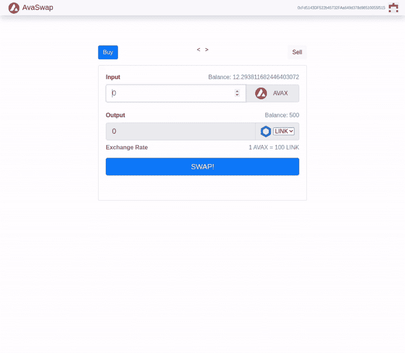

# 介绍

> 原文:[https://github . com/fig ment-networks/learn-tutorials/blob/master/avalanche/create-a-dex-with-avalanche . MD](https://github.com/figment-networks/learn-tutorials/blob/master/avalanche/create-a-dex-with-avalanche.md)

分散式交易所是一种网络，它允许任何人通过在两个令牌(如 AVAX-LINK 对)之间执行交易，在区块链上交换加密货币令牌。集中交易所(CEX)，如币安，是在线交易平台，使用订单簿来匹配买家和卖家。它们的工作方式与在线经纪账户类似，这也是它们如此受投资者欢迎的原因。分散交易所(DEX)，如 [PancakeSwap](https://pancakeswap.finance/) 或 [Uniswap](https://uniswap.org/) ，是由智能合约驱动的独立金融协议，允许加密货币交易商转换他们的持股。

集中式和分散式交易所的主要区别在于，当你在交易平台上互动时，前者保持对你资金的控制，而后者允许你在交易时保持对你现金的控制。

# 先决条件

您必须已经完成本教程[在 Avalanche](https://learn.figment.io/tutorials/create-a-local-test-network) 上创建本地测试网络，并且已经通过[在 X 链和 C 链之间转移 AVAX](https://learn.figment.io/tutorials/transfer-avax-between-the-x-chain-and-c-chain)教程执行了跨链交换，以将 AVAX 测试令牌发送到您的 C 链地址。

# 要求

*   [节点 j](https://nodejs.org/en)
*   [反应堆](https://reactjs.org/)
*   块菌，可以用`npm install -g truffle`安装
*   在浏览器中安装[元掩码扩展](https://metamask.io/download.html)。

**创建 AvaSwap 目录并安装依赖项**

Avaswap 是基于 Avalanche 协议的分散式交易所，支持点对点(P2P)加密货币交易，无需订单簿或任何集中中介即可执行。

打开一个新的终端选项卡，这样我们就可以创建一个目录并安装更多的依赖项。首先，导航到要在其中创建工作目录的目录:

```
cd /path/to/directory 
```

创建并输入一个名为`AvaSwap`的新目录:

```
mkdir AvaSwap
cd AvaSwap 
```

然后，创建一个样板 truffle 项目:

```
truffle init 
```

**更新 truffle-config.js**

`truffle-config.js`是运行`truffle init`时创建的配置文件。将以下内容添加到`truffle-config.js`以设置`HDWalletProvider`和 DataHub Avalanche RPC 连接。

```
require('dotenv').config();
const HDWalletProvider = require("@truffle/hdwallet-provider");

// Account credentials from which our contract will be deployed
const mnemonic = process.env.MNEMONIC;

// API key of your Datahub account for Avalanche Fuji test network
const APIKEY = process.env.APIKEY;

module.exports = {
  networks: {
    fuji: {
      provider: function() {
            return new HDWalletProvider({mnemonic, providerOrUrl: `https://avalanche--fuji--rpc.datahub.figment.io/apikey/${APIKEY}/ext/bc/C/rpc`, chainId: "0xa869"})
      },
      network_id: "*",
      gas: 3000000,
      gasPrice: 470000000000,
      skipDryRun: true
    }
  },
  solc: {
    optimizer: {
      enabled: true,
      runs: 200
    }
  }
}
```

请注意，如果您想要将 API 调用指向不同的雪崩节点，您可以更改`protocol`、`ip`和`port`。另外，请注意，我们正在将`gasPrice`和`gas`设置为雪崩 C 链的适当值。

# 添加 DevToken.sol

在 contracts 目录中创建`Devtoken.sol`并添加以下代码块:

```
// SPDX-License-Identifier: MIT

pragma solidity >=0.5.0;

// Define a contract named DevToken as per the ERC20 token standards
contract DevToken {
    string public name = "Dev Token";
    string public symbol = "DEV";
    uint256 public totalSupply = 1000000000000000000000000; // 1 million tokens
    uint8 public decimals = 18;

// Create an event which will be emitted when a token is tranferred 
    event Transfer(address indexed _from, address indexed _to, uint256 _value);

// Create an event which will be emitted when a token is approved 
    event Approval(
        address indexed _owner,
        address indexed _spender,
        uint256 _value
    );

    mapping(address => uint256) public balanceOf;
    mapping(address => mapping(address => uint256)) public allowance;

// Create a contructor and set `balance = totalSuppy` i.e. 1 million tokens
constructor() public {
        balanceOf[msg.sender] = totalSupply;
    }

// Create a transfer function as per the ERC20 token standards
    function transfer(address _to, uint256 _value)
        public
        returns (bool success)
    {
        require(balanceOf[msg.sender] >= _value);
        balanceOf[msg.sender] -= _value;
        balanceOf[_to] += _value;
        emit Transfer(msg.sender, _to, _value);
        return true;
    }

// Create an approve function as per the ERC20 token standards
    function approve(address _spender, uint256 _value)
        public
        returns (bool success)
    {
        allowance[msg.sender][_spender] = _value;
        emit Approval(msg.sender, _spender, _value);
        return true;
    }

// Create a transferFrom function as per the ERC20 token standards
    function transferFrom(
        address _from,
        address _to,
        uint256 _value
    ) public returns (bool success) {
        require(_value <= balanceOf[_from]);
        require(_value <= allowance[_from][msg.sender]);
        balanceOf[_from] -= _value;
        balanceOf[_to] += _value;
        allowance[_from][msg.sender] -= _value;
        emit Transfer(_from, _to, _value);
        return true;
    }
}
```

# 添加 AvaSwap.sol

在 contracts 目录中添加一个名为`AvaSwap.sol`的新文件，并添加以下代码块:

```
// SPDX-License-Identifier: MIT

pragma solidity 0.6.7;

// import the required contracts
import "@chainlink/contracts/src/v0.6/interfaces/AggregatorV3Interface.sol";
import './DevToken.sol';

// Define a contract named Avaswap
contract AvaSwap {
  string public name = "AvaSwap Network Exchange";
  DevToken public Token;
  uint public rate;
  AggregatorV3Interface internal priceFeed;

// Create event which will be emitted when a token is purchased 
  event TokenPurchase(
    address account,
    address token,
    uint amount,
    uint rate
  );

// Create event which will be emitted when a token is sold
  event TokenSold(
    address account,
    address token,
    uint amount,
    uint rate
  );

// Create a contructor and pass `DevToken _Token` as parameter
  constructor(DevToken _Token) public {
    Token = _Token;
    priceFeed = AggregatorV3Interface(0x5498BB86BC934c8D34FDA08E81D444153d0D06aD);
    rate = uint256(getLatestPrice());
  }

  // Returns the latest price from Chainlink PriceFeed Oracle
  function getLatestPrice() public view returns (int) {
    (
      uint80 roundID,
      int price,
      uint startedAt,
      uint timeStamp,
      uint80 answeredInRound
    ) = priceFeed.latestRoundData();
    // If the round is not complete yet, timestamp is 0
    require(timeStamp > 0, "Round not complete");
    return 1e18/price;
  }

// Calculate and buy token as per the token price
  function buyTokens() public payable {
    // Calculate number of tokens to buy:
    // Avax Amount * Redemption rate 
    uint tokenAmount = msg.value * rate;
    Token.transfer(msg.sender, tokenAmount);
    // Emit an event
    emit TokenPurchase(msg.sender, address(Token), tokenAmount, rate);
  }

// Calculate and sell token as per the token price
  function sellToken(uint _amount) public {
    // User can't sell more tokens than they have
    require(Token.balanceOf(msg.sender) >= _amount);
    // Calculate the amount of the avax to redeem
    uint avaxAmount =  _amount / rate;
    // Require that AvaSwap has enough avax
    require(address(this).balance >= avaxAmount);
    // Perform Sale
    Token.transferFrom(msg.sender, address(this), _amount);
    msg.sender.transfer(avaxAmount);
    // Emit an event
    emit TokenSold(msg.sender, address(Token), _amount, rate);
  }
}
```

# 添加新迁移

在`migrations`目录中创建一个名为`2_deploy_contracts.js`的新文件，并添加以下代码块。它负责将`AvaSwap`智能合同部署到区块链。

```
const AvaSwap = artifacts.require("AvaSwap");
const DevToken = artifacts.require("DevToken");
module.exports = function (deployer) {
  // Deploy DevToken
  await deployer.deploy(DevToken, '5777');
  const devToken = await DevToken.deployed();
  // Deploy AvaSwap with DevToken
  await deployer.deploy(AvaSwap, devToken.address);
  avaSwap =  await AvaSwap.deployed();
  // Mint 0.001 DevToken to AvaSwap
  await devToken.transfer(avaSwap.address, '1000000000000000000000000');
};
```

# 用块菌编合同

任何时候你对`AvaSwap.sol`做出改变，你都必须重新编辑合同。

```
truffle compile 
```

您应该看到:

```
Compiling your contracts...
===========================
> Compiling ./contracts/Migrations.sol
> Compiling ./contracts/AvaSwap.sol
> Artifacts written to /path/to/build/contracts
> Compiled successfully using:
   - solc: 0.5.16+commit.9c3226ce.Emscripten.clang 
```

# 在 C 链上创建并解锁一个帐户

当将智能合约部署到 C 链时，Truffle 将默认使用您的 C 链客户端提供的第一个可用帐户作为迁移期间使用的`from`地址。

松露有一个非常有用的控制台，我们可以用它来与区块链和我们的合同进行交互。打开控制台:

```
truffle console --network development 
```

然后，在控制台中，创建帐户:

```
truffle(development)> let account = await web3.eth.personal.newAccount() 
```

这将返回:

```
undefined 
```

打印账户:

```
truffle(development)> account 
```

这将打印帐户:

```
'0x090172CD36e9f4906Af17B2C36D662E69f162282' 
```

解锁您的帐户:

```
truffle(development)> await web3.eth.personal.unlockAccount(account) 
```

这将返回:

```
true 
```

# 运行迁移

现在，运行迁移和部署合同的一切都已就绪:

```
truffle(development)> migrate --network development 
```

您应该看到:

```
Compiling your contracts...
===========================
> Everything is up to date, there is nothing to compile.

Migrations dry-run (simulation)
===============================
> Network name:    'development-fork'
> Network id:      1
> Block gas limit: 99804786 (0x5f2e672)

1_initial_migration.js
======================

   Deploying 'Migrations'
   ----------------------
   > block number:        4
   > block timestamp:     1607734632
   > account:             0x34Cb796d4D6A3e7F41c4465C65b9056Fe2D3B8fD
   > balance:             1000.91683679
   > gas used:            176943 (0x2b32f)
   > gas price:           225 gwei
   > value sent:          0 ETH
   > total cost:          0.08316321 ETH

   -------------------------------------
   > Total cost:          0.08316321 ETH

2_deploy_contracts.js
=====================

   Deploying 'AvaSwap'
   -------------------
   > block number:        6
   > block timestamp:     1607734633
   > account:             0x34Cb796d4D6A3e7F41c4465C65b9056Fe2D3B8fD
   > balance:             1000.8587791
   > gas used:            96189 (0x177bd)
   > gas price:           225 gwei
   > value sent:          0 ETH
   > total cost:          0.04520883 ETH

   -------------------------------------
   > Total cost:          0.04520883 ETH

Summary
=======
> Total deployments:   2
> Final cost:          0.13542204 ETH 
```

如果您没有在 C 链上创建帐户，您会看到以下错误:

```
Error: Expected parameter 'from' not passed to function. 
```

如果您没有为该帐户提供资金，您会看到以下错误:

```
Error:  *** Deployment Failed ***

"Migrations" could not deploy due to insufficient funds
   * Account:  0x090172CD36e9f4906Af17B2C36D662E69f162282
   * Balance:  0 wei
   * Message:  sender doesn't have enough funds to send tx. The upfront cost is: 1410000000000000000 and the sender's account only has: 0
   * Try:
      + Using an adequately funded account 
```

如果您没有解锁帐户，您会看到以下错误:

```
Error:  *** Deployment Failed ***

"Migrations" -- Returned error: authentication needed: password or unlock. 
```

# 与智能合同的用户界面交互

为了与契约进行交互，我们将使用 [create-react-app](https://reactjs.org/docs/create-a-new-react-app.html) 创建一个 React 应用程序。

创建一个模板项目:

```
npx create-react-app my-app 
```

转到项目目录:

```
cd my-app 
```

启动示例应用程序:

```
npm start 
```

现在，您可以在浏览器中查看 AvaSwap。

```
Local: http://localhost:3000/ 
```

我们将使用`Main.js`、`BuyForm.js`、&、`SellForm.js`组件来构建 UI 和智能合约集成。

**Main.js**

在这个文件中，我们必须导入`BuyForm`和`SellForm`组件，然后渲染它们。

```
// Import required components and libraries
import React, { Component } from "react";
import BuyForm from "./BuyForm";
import SellForm from "./SellForm";

// Create a class named `Main` which inhherits `Component` imorted from `react`
class Main extends Component {
  constructor(props) {
    super(props);
    this.state = {
      currentForm: "buy",
    };
  }

// method to handle token change when tokens are switched like Link, Dai and DevToken
  handleTokenChange = (token) => {
    this.props.handleTokenChange(token);
  };

// Display the components in render method and pass the required params
  render() {
    let content;
    if (this.state.currentForm === "buy")
      content = (
        <BuyForm
          selectedToken={this.props.selectedToken}
          ethBalance={this.props.ethBalance}
          tokenBalance={this.props.tokenBalance}
          buyTokens={this.props.buyTokens}
          handleTokenChange={this.handleTokenChange}
        />
      );
    else
      content = (
        <SellForm
          selectedToken={this.props.selectedToken}
          ethBalance={this.props.ethBalance}
          tokenBalance={this.props.tokenBalance}
          sellTokens={this.props.sellTokens}
          handleTokenChange={this.handleTokenChange}
        />
      );
    return (
      <div id="content" className="mt-3">
        <div className="d-flex justify-content-between mb-3">
          <button
            className={
              this.state.currentForm === "buy"
                ? "btn btn-primary"
                : "btn btn-light"
            }
            onClick={(event) => {
              this.setState({ currentForm: "buy" });
            }}
          >
            Buy
          </button>
          <span>&lt; &nbsp; &gt;</span>
          <button
            className={
              this.state.currentForm === "sell"
                ? "btn btn-primary"
                : "btn btn-light"
            }
            onClick={(event) => {
              this.setState({ currentForm: "sell" });
            }}
          >
            Sell
          </button>
        </div>

        <div className="card mb-4">
          <div className="card-body">{content}</div>
        </div>
      </div>
    );
  }
}

export default Main;
```

**购买代币:**


在 BuyForm 组件中，导入 AVAX、Dai 和 ChainLink 令牌的徽标和 ABI。

BuyForm.js

```
// Import required components, assets and libraries
import React, { Component } from "react";
import avaxLogo from "../avax-logo.png";
import tokenLogo from "../token-logo.png";
import daiLogo from "../dai-logo.png";
import chainLinkLogo from "../chainlink-link-logo.png";

// Create a class named `BuyForm` which inhherits `Component` imorted from `React`
class BuyForm extends Component {
  constructor(props) {
    super(props);
    this.state = {
      output: "0",
      rate: 100,
      selected: props.selectedToken.name,
    };
  }

// method to handle token change when tokens are switched like Link, Dai and DevToken
  handleChange = (event) => {
    this.setState({ selected: event.target.value });
    this.props.handleTokenChange(event.target.value);
  };

// Display the form components in render method and pass the required states and props
  render() {
    let { selected, rate } = this.state;
    return (
      <form
        className="mb-5"
        onSubmit={(event) => {
          event.preventDefault();
          let avaxAmount;
          avaxAmount = this.input.value.toString();
          avaxAmount = window.web3.utils.toWei(avaxAmount, "Ether");
          this.props.buyTokens(avaxAmount);
        }}
      >
        <div>
          <label className="float-left">
            <b>Input</b>
          </label>
          <span className="float-right text-muted">
            Balance: {window.web3.utils.fromWei(this.props.ethBalance, "Ether")}
          </span>
        </div>
        <div className="input-group mb-4">
          <input
            type="text"
            onChange={(event) => {
              const avaxAmount = this.input.value.toString();
              this.setState({
                output: avaxAmount * rate,
              });
            }}
            ref={(input) => {
              this.input = input;
            }}
            placeholder="0"
            className="form-control form-control-lg"
            required
          />
          <div className="input-group-append">
            <div className="input-group-text">
              &nbsp;&nbsp;&nbsp;
              
              &nbsp;&nbsp;&nbsp; AVAX &nbsp;&nbsp;&nbsp;
            </div>
          </div>
        </div>
        <div>
          <label className="float-left">
            <b>Output</b>
          </label>
          <span className="float-right text-muted">
            Balance:{" "}
            {window.web3.utils.fromWei(this.props.tokenBalance, "Ether")}
          </span>
        </div>
        <div className="input-group mb-2">
          <input
            value={this.state.output}
            type="text"
            placeholder="0"
            className="form-control form-control-lg"
            disabled
          />
          <div className="input-group-append">
            <div className="input-group-text">
              
              &nbsp;
              <select onChange={this.handleChange}>
                <option defaultValue={selected}>LINK</option>
                <option defaultValue={selected}>DEV</option>
                <option defaultValue={selected}>DAI</option>
              </select>
            </div>
          </div>
        </div>
        <div className="mb-5">
          <span className="float-left text-muted">
            <b>Exchange Rate</b>
          </span>
          <span className="float-right text-muted">
            1 AVAX = {rate} {selected}
          </span>
        </div>
        <button type="submit" className="btn btn-primary btn-block btn-lg">
          SWAP!
        </button>
      </form>
    );
  }
}

export default BuyForm;
```

**出售代币:**


sellform . js:密封形式. js:

```
// Import required components, assets and libraries
import React, { Component } from "react";
import avaxLogo from "../avax-logo.png";
import tokenLogo from "../token-logo.png";
import daiLogo from "../dai-logo.png";
import chainLinkLogo from "../chainlink-link-logo.png";

// Create a class named `SellForm` which inhherits `Component` imorted from `react`
class SellForm extends Component {
  constructor(props) {
    super(props);
    this.state = {
      output: "0",
      selected: props.selectedToken.name,
    };
  }

// method to handle token change when tokens are switched like Link, Dai and DevToken
  handleChange = (event) => {
    this.setState({ selected: event.target.value });
    this.props.handleTokenChange(event.target.value);
  };

// Display the form components in render method and pass the required states and props
  render() {
    let { selected } = this.state;
    return (
      <form
        className="mb-5"
        onSubmit={(event) => {
          event.preventDefault();
          let tokenAmount;
          tokenAmount = this.input.value.toString();
          tokenAmount = window.web3.utils.toWei(tokenAmount, "Ether");
          this.props.sellTokens(tokenAmount);
        }}
      >
        <div>
          <label className="float-left">
            <b>Input</b>
          </label>
          <span className="float-right text-muted">
            Balance:{" "}
            {window.web3.utils.fromWei(this.props.tokenBalance, "Ether")}
          </span>
        </div>
        <div className="input-group mb-4">
          <input
            type="text"
            onChange={(event) => {
              const tokenAmount = this.input.value.toString();
              this.setState({
                output: tokenAmount / 100,
              });
            }}
            ref={(input) => {
              this.input = input;
            }}
            placeholder="0"
            className="form-control form-control-lg"
            required
          />
          <div className="input-group-append">
            <div className="input-group-text">
              
              &nbsp;
              <select onChange={this.handleChange}>
                <option selected={selected === "LINK"} defaultValue="LINK">
                  LINK
                </option>
                <option selected={selected === "DEV"} defaultValue="DEV">
                  DEV
                </option>
                <option selected={selected === "DAI"} defaultValue="DAI">
                  DAI
                </option>
              </select>
            </div>
          </div>
        </div>
        <div>
          <label className="float-left">
            <b>Output</b>
          </label>
          <span className="float-right text-muted">
            Balance: {window.web3.utils.fromWei(this.props.ethBalance, "Ether")}
          </span>
        </div>
        <div className="input-group mb-2">
          <input
            value={this.state.output}
            type="text"
            placeholder="0"
            className="form-control form-control-lg"
            disabled
          />
          <div className="input-group-append">
            <div className="input-group-text">
              &nbsp;&nbsp;&nbsp;
              
              &nbsp;&nbsp;&nbsp; AVAX &nbsp;&nbsp;&nbsp;
            </div>
          </div>
        </div>
        <div className="mb-5">
          <span className="float-left text-muted">
            <b>Exchange Rate</b>
          </span>
          <span className="float-right text-muted">
            100 {selected} = 1 AVAX
          </span>
        </div>
        <button type="submit" className="btn btn-primary btn-block btn-lg">
          SWAP!
        </button>
      </form>
    );
  }
}

export default SellForm;
```

**示例演示:**



# 结论

现在，您已经了解了如何在 Avalanche 网络上使用 Truffle suite 和 ReactJS 创建一个分散式交换(DEX)。

如果你在阅读本教程时有任何困难，或者只是想与我们讨论雪崩技术，你可以 [**加入我们的不和谐频道**](https://discord.gg/fszyM7K) ！

# 关于作者

德文德拉·亚达夫

# 参考

*   [https://learn . fig ment . io/tutorials/using-truffle-with-the-avalanche-c-chain](https://learn.figment.io/tutorials/using-truffle-with-the-avalanche-c-chain)
*   [https://github.com/OpenZeppelin/openzeppelin-contracts](https://github.com/OpenZeppelin/openzeppelin-contracts)
*   [https://github.com/makerdao/dss](https://github.com/makerdao/dss)
*   [https://github.com/smartcontractkit/LinkToken](https://github.com/smartcontractkit/LinkToken)
*   [https://github.com/devilla/Avaswap](https://github.com/devilla/Avaswap)
*   [https://trustwallet.com/blog/trading-on-cex-vs-dex](https://trustwallet.com/blog/trading-on-cex-vs-dex)