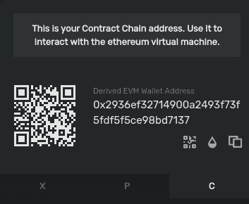

# 介绍

> 原文：<https://github.com/figment-networks/learn-tutorials/blob/master/avalanche/create-an-auction-bidding-on-avalanche-using-reactjs.md>

我们将学习如何通过拍卖来构建智能合约，用户可以在拍卖中出价，并在 Avalanche 上部署智能合约。然后，我们将能够使用 ReactJS 和毛毛雨与它们进行交互。

我们将使用`create-react-app`生成 [ReactJS](https://reactjs.org) 样板代码，我们将为我们的拍卖投标前端进行修改。由于 React 的效率和用户友好的区块链交互，它对这个任务很有用。对于提供链上功能的智能合约，使用[松露](https://www.trufflesuite.com)将[可靠性](https://docs.soliditylang.org/en/v0.8.4/)代码部署到雪崩区块链。

# 先决条件

*   [ReactJS](https://reactjs.org) 的基础知识。
*   雪崩架构和智能合约的基础知识。
*   基本熟悉 React [上下文 API](https://reactjs.org/docs/context.html) 。
*   您还需要一个在[数据中心](https://datahub.figment.io/sign_up?service=avalanche)的账户。

# 要求

*   [NodeJS](https://nodejs.org/en)>= 10.16[NPM](https://www.npmjs.com/)>= 5.6 已安装。
*   [松露](https://www.trufflesuite.com/truffle)，可以全球安装`npm install -g truffle`。
*   Metamask 钱包软件必须添加到您的浏览器中，该软件只能从 Metamask 官方网站获取: [https://metamask.io](https://metamask.io) 。**不要从非官方渠道下载 Metamask！**

# 项目设置

在开始项目工作之前，我们需要建立一个工作目录。按照以下步骤为项目创建一个目录。打开一个终端，导航到您想要存储这个应用程序的目录——通常是用户主目录。

用命令`mkdir <directory_name>`创建一个新的子目录。使用`cd <directory_name>`将当前工作目录更改为这个新创建的目录。例如:如果我们把它命名为`bid`，那么:

```
mkdir bid
cd bid 
```

## 创建 React 项目

我们可以使用`npx` ( [npm 的包运行器](https://www.npmjs.com/package/npx))创建一个新的 React 应用。典型用途是下载运行 npm 软件包所需的文件。使用`npx`来执行`create-react-app`的包二进制文件将会在指定的目录中生成一个新的 React app scaffold。

```
npx create-react-app client 
```

现在使用`cd client`切换到目录“client ”,然后使用以下命令安装所需的依赖项:

```
npm install --save dotenv web3 @truffle/contract @truffle/hdwallet-provider @drizzle/store 
```

打开`src`目录中的文件`index.js`，用以下代码替换现有代码:

```
import React from "react";
import ReactDOM from "react-dom";
import App from "./App";

import { Drizzle } from "@drizzle/store";
import drizzleOptions from "./drizzleOptions";
import { DrizzleProvider } from "./drizzleContext";

const drizzle = new Drizzle(drizzleOptions);

ReactDOM.render(
  <DrizzleProvider drizzle={drizzle}>
    <App />
  </DrizzleProvider>,
  document.getElementById("root")
);
```

接下来，打开位于`src`目录中的`App.js`文件，并用以下代码替换现有代码:

```
import Auction from "./Auction";
import { useDrizzleContext } from "./drizzleContext";

function App() {
  const { drizzleVariables } = useDrizzleContext();

  if (!drizzleVariables.initialized) {
    return "Loading...";
  } else {
    return <Auction />;
  }
}

export default App;
```

完成后，React 项目设置就完成了。我们现在准备设置松露。

## 设置松露项目

Truffle 可以用来创建项目所需的样板代码。在项目根目录中运行以下命令:

```
truffle init 
```

现在，项目的基础已经建立。坚固性代码将存储在`contracts`子目录中。用 JavaScript 写的 Truffle 部署函数会存储在`migrations`文件夹中。默认情况下，`/build/contracts`文件夹包含 JSON 格式的已编译和已部署契约的信息(如[应用程序二进制接口](https://docs.soliditylang.org/en/latest/abi-spec.html))。这些元文件通常被称为`artifacts`。

`truffle-config.js`是由`truffle init`命令创建的配置文件。这个文件包含的信息告诉 Truffle 如何部署契约，在哪个网络上部署等等。我们应该保留默认文件以供参考，我们可以使用以下命令创建该文件的副本:

```
cp truffle-config.js truffle-config-default.js 
```

现在我们有了默认配置的副本，我们可以用在 Fuji testnet 上部署智能合约所需的信息来更新`truffle-config.js`。这将有助于我们连接到 DataHub Avalanche 节点，但是我们需要 Avalanche API 密钥(来自 DataHub)以及用于在网络上部署合同的 Avalanche wallet 助记符。用以下内容替换`truffle-config.js`的现有内容:

```
require("dotenv").config();
const HDWalletProvider = require("@truffle/hdwallet-provider");

// Account credentials from which our contract will be deployed
const mnemonic = process.env.MNEMONIC;

// API key of your Datahub account for Avalanche Fuji test network
const APIKEY = process.env.APIKEY;

const DATAHUB_RPC_URL = `https://avalanche--fuji--rpc.datahub.figment.io/apikey/${process.env.APIKEY}/ext/bc/C/rpc`;

module.exports = {
  contracts_build_directory: "./client/src/build/contracts/",
  networks: {
    fuji: {
      provider: function () {
        return new HDWalletProvider({
          mnemonic,
          providerOrUrl: DATAHUB_RPC_URL,
          chainId: "0xa869",
        });
      },
      network_id: "*",
      gas: 3000000,
      gasPrice: 470000000000,
      skipDryRun: true,
    },
  },
  compilers: {
    solc: {
      version: "0.8.0",
    },
  },
};
```

这里，我们将`gas`和`gasprice`设置为雪崩 C 链的适当值。您可能会注意到,`contract_build_directory`被用来将`artifacts`的默认位置从项目根目录更改为`src`文件夹。这是因为 React 无法访问`src`文件夹外的文件。

## 接收雪崩凭证

对于智能合约的部署，我们需要注意两件事:

1.  一个连接到雪崩网络的节点和一个拥有某些 AVAX 的帐户。
2.  通过 RPC(远程过程调用)访问数据中心雪崩节点需要雪崩 API 密钥。访问 DataHub 上的 [Avalanche 服务仪表板](https://datahub.figment.io/services/avalanche)以获取 Avalanche 特定的 API 密钥。


接下来，我们需要创建一个新的 Avalanche 钱包，以便在网络上进行交易和存放资金。要创建雪崩钱包，请访问[https://wallet . avax . network](https://wallet.avax.network)并保存所有必要的信息——钱包地址和助记符种子短语。

## 补充。环境文件

在项目根文件夹中创建一个名为`.env`的新文件。如下所示，将您的 Avalanche API 密钥和 Avalanche 钱包的助记符复制到`.env`文件中。如果您在设置`.env`文件时有任何困难，请参考 [dotenv 上的 Figment 学习指南。婀](https://docs.figment.io/network-documentation/extra-guides/dotenv-and-.env)。

```
DATAHUB_API_KEY=<your-api-key>
MNEMONIC="<avalanche-wallet-mnemonic>" 
```

现在项目设置完成了！运行项目根文件夹中的命令`npm start`来启动开发服务器。这将允许我们构建具有即时视觉反馈的 React 界面。

## 创建智能招标合同

接下来，我们需要在`contracts`子目录中创建名为`Auction.sol`的主要 Solidity 智能合同文件，并添加以下内容:

```
// SPDX-License-Identifier: UNLICENSED
pragma solidity >=0.8.0;

contract AuctionManager {
	uint public uId = 0;
	uint public aId = 0;

	// Structure to store user information
	struct User {
		uint userId;
		string name;
		address publicAddress;
	}

	// Structure to store bid information
	struct Bid {
		uint userId;
		uint bidPrice;
	}

	// Structure to store auction information
	struct Auction {
		uint auctionId;
		uint userId;
		string name;
		string description;
		uint msp;
		uint auctionBidId;
	}

	// Structure to store real time analytics of each auction
	struct AuctionAnalytics {
		uint auctionId;
		uint auctionBidId;
		uint latestBid;
		uint lowestBid;
		uint highestBid;
	}

	// List of all auctions
	Auction[] public auctions;

	// Mapping for storing user info, bids and auction analytics
	mapping (uint => User) public users;
	mapping (uint => Bid[]) public bids;
	mapping (uint => AuctionAnalytics) public auctionAnalytics;

	// Public function to check the registration of users (public address)
	function isRegistered(address _publicAddress) public view returns (uint256[2] memory) {
		uint256[2] memory result = [uint256(0), uint256(0)];
		for(uint i = 0; i < uId; i++) {
			if(_publicAddress == users[i].publicAddress) {
				result[0] = 1;
				result[1] = i;
				return result;
			}
		}
		return result;
	}

	// Creating new users
	function createUser(string memory _name) public {
		require((isRegistered(msg.sender))[0] == 0, "User already registered!");
		users[uId] = User(uId, _name, msg.sender);
		uId++;
	}

	// Creating new auctions
	function createAuction(string memory _name, string memory _description, uint _msp) public {
		require((isRegistered(msg.sender))[0] == 1, "User not registered!");
		uint MAX_UINT = 2 ** 256 - 1;
		auctions.push(Auction(aId, isRegistered(msg.sender)[1], _name, _description, _msp, 0));
		auctionAnalytics[aId] = AuctionAnalytics(aId, 0, 0, MAX_UINT, 0);
		aId++;
	}

	// Private function to update auction analytics after the new bids
	function updateAucionAnalytics(uint _aId, uint _latestBid) private {
		auctionAnalytics[_aId].latestBid = _latestBid;
		auctionAnalytics[_aId].auctionBidId = auctions[_aId].auctionBidId;
		if(_latestBid < auctionAnalytics[_aId].lowestBid) {
			auctionAnalytics[_aId].lowestBid = _latestBid;
		}
		if(_latestBid > auctionAnalytics[_aId].highestBid) {
			auctionAnalytics[_aId].highestBid = _latestBid;
		}
	}

	// Creating new bids
	function createBid(uint _aId, uint _bidPrice) public {
		require((isRegistered(msg.sender))[0] == 1, "User not registered!");
		bids[_aId].push(Bid((isRegistered(msg.sender))[1], _bidPrice));
		auctions[_aId].auctionBidId++;
		updateAucionAnalytics(_aId, _bidPrice);
	}

	// Return list of all auctions
	function showAuctions() public view returns (Auction[] memory) {
		return auctions;
	}
}
```

`Auction`是一个可靠的合同，使我们能够查看拍卖的详细信息和相应的最低价格。我们将使用已部署的地址和 ABI 访问已部署的拍卖合同。每次创建新的拍卖，Solidity 代码将被部署到区块链。

# 理解合同

## 用户、投标、拍卖和分析

```
// List of all auctions
Auction[] public auctions;

// Mapping for storing user info, bids and auction analytics
mapping (uint => User) public users;
mapping (uint => Bid[]) public bids;
mapping (uint => AuctionAnalytics) public auctionAnalytics;
```

这段代码使用[可靠性映射](https://docs.soliditylang.org/en/latest/types.html#mapping-types)声明了用于存储用户信息、他们的出价、拍卖和拍卖分析的公共变量。看看这些变量中使用的结构定义:它们包含构成 User、Bid 或 AuctionAnalytics 的数据类型和字段。

## 检查注册用户的功能

```
// Public function to check the registration of users (public address)
function isRegistered(address _publicAddress) public view returns (uint256[2] memory) {
	uint256[2] memory result = [uint256(0), uint256(0)];
	for(uint i = 0; i < uId; i++) {
		if(_publicAddress == users[i].publicAddress) {
			result[0] = 1;
			result[1] = i;
			return result;
		}
	}
	return result;
}
```

该函数将公共地址作为其参数，并返回一个包含两个元素的整数数组——索引为 **0** 的 **isRegistered** 和索引为 1 的 **userId** 。如果第**个**索引为 1，则用户存在，反之亦然。第**个索引**代表用户的 **userId** 。这个函数迭代映射 **users** 来检查所需的公共地址是否存在。

## 拍卖分析

我们已经创建了一个映射，用于存储每次拍卖的最新出价、最高出价和最低出价等分析数据。这个映射将把**拍卖 Id** 映射到**拍卖分析**结构。当一个新的拍卖被创建时，我们在 **AuctionAnalytics** 映射中初始化它相应的条目。

```
// Private function to update auction analytics after the new bids
function updateAucionAnalytics(uint _aId, uint _latestBid) private {
	auctionAnalytics[_aId].latestBid = _latestBid;
	auctionAnalytics[_aId].auctionBidId = auctions[_aId].auctionBidId;
	if(_latestBid < auctionAnalytics[_aId].lowestBid) {
		auctionAnalytics[_aId].lowestBid = _latestBid;
	}
	if(_latestBid > auctionAnalytics[_aId].highestBid) {
		auctionAnalytics[_aId].highestBid = _latestBid;
	}
}
```

每次有新的出价时，拍卖分析都需要更新。每当创建出价时，都会调用此函数。它将一个 **auctionId** 和**最新的出价金额**作为它的两个参数，并更新与拍卖相对应的分析。

其余的函数是不言自明的，但是已经被很好地注释以便读者理解。

# 创造松露迁徙

在`contracts`目录中创建文件`Migration.sol`，并添加以下内容:

```
// SPDX-License-Identifier: MIT
pragma solidity >=0.4.22 <0.9.0;

contract Migrations {
	address public owner = msg.sender;
	uint public last_completed_migration;

	modifier restricted() {
		require(
			msg.sender == owner,
			"This function is restricted to the contract's owner"
		);
		_;
	}

	function setCompleted(uint completed) public restricted {
		last_completed_migration = completed;
	}
}
```

这个`Migration.sol`智能合同管理我们想要迁移到 Avalanche 的其他合同的部署。

接下来，在`migrations`目录中创建一个名为`2_deploy_contracts.js`的新文件，并添加以下代码块。它负责将`Auction`智能合同部署到区块链。

```
const AuctionManager = artifacts.require("./Auction.sol");

module.exports = function (deployer) {
  deployer.deploy(AuctionManager);
};
```

# 用松露编合同

如果我们修改了 Solidity 源文件中的代码或者制作了新的代码(比如`Auction.sol`，我们需要在终端中从项目根目录中运行`truffle compile`。

预期的输出看起来类似:

```
Compiling your contracts...
===========================
> Compiling ./contracts/Auction.sol
> Compiling ./contracts/Migrations.sol

> Artifacts written to /home/guest/blockchain/client/build/contracts
> Compiled successfully using:
	 - solc: 0.8.0+commit.c7dfd78e.Emscripten.clang 
```

编译后的智能合约以 JSON 文件的形式写在`/src/build/contracts`目录中。这些是存储的 ABI 和其他必要的元数据——工件。

 **ABI** 指的是应用程序二进制接口，它是用于与来自区块链外部的智能合同以及合同到合同交互的标准。请参考关于 ABI 规格的[坚固性文档以了解更多信息。](https://docs.soliditylang.org/en/latest/abi-spec.html)

# 在 C 链上运行迁移

在将智能合约部署到 C 链的过程中，需要部署成本。这个可以在`truffle-config.js`里面看到。HDWallet 提供商将帮助我们在 Fuji C-Chain 上部署，部署费用将由助记符存储在`.env`文件中的账户提供。因此，在我们能够部署之前，我们需要为帐户提供资金。

## 向您的帐户注入资金

我们的 C 链地址需要资金，因为 Avalanche 上的智能合约部署在 C 链(合约链)上。这个地址很容易在 [Avalanche Wallet](https://wallet.avax.network) 仪表盘上找到。雪崩网络有 3 条链:X 链、P 链和 C 链。所有这些连锁店的地址都可以通过切换分区底部的标签找到，那里有一个二维码。所以，切换到 C 链，复制地址。现在使用[富士测试网龙头](https://faucet.avax-test.network/)通过在输入框粘贴你的 C 链地址来为你的账户提供资金。请参考下图，以识别地址部分。



您至少需要向帐户发送`135422040` **nAVAX** 才能支付合同部署的成本。这里的 **nAVAX** 指的是 nano-AVAX 即一个 **AVAX** 的十亿分之一，或者简称为 1**nAVAX**=(1/100000000)**AVAX**。通过富士水龙头的资金将会给你足够的`AVAX`来在测试网上运行多个部署和事务。

## 运行迁移

运行 Truffle 迁移的一切都已就绪，现在我们可以使用以下命令轻松部署`Auction`契约:

```
truffle migrate --network fuji 
```

为了快速开发和测试，我们还可以通过使用命令 [Ganache](https://www.trufflesuite.com/ganache) (Truffle 的本地区块链模拟)在本地网络上部署我们的合同:

```
truffle migrate --network development 
```

成功执行上述命令后，我们应该会看到类似的输出:

```
Starting migrations...
======================
> Network name:    'fuji'
> Network id:      1
> Block gas limit: 8000000 (0x7a1200)

1_initial_migration.js
======================

	 Deploying 'Migrations'
	 ----------------------
	 > transaction hash:    0x094a9c0f12ff3158bcb40e266859cb4f34a274ea492707f673b93790af40e9e9
	 > Blocks: 0            Seconds: 0
	 > contract address:    0x0b1f00d0Af6d5c864f86E6b96216e0a2Da111055
	 > block number:        40
	 > block timestamp:     1620393171
	 > account:             0x80599dd7F8c5426096FD189dcC6C40f47e8e3714
	 > balance:             39.71499696
	 > gas used:            173118 (0x2a43e)
	 > gas price:           20 gwei
	 > value sent:          0 ETH
	 > total cost:          0.00346236 ETH

	 > Saving migration to chain.
	 > Saving artifacts
	 -------------------------------------
	 > Total cost:          0.00346236 ETH

2_deploy_contracts.js
=====================

	 Deploying 'AuctionManager'
	 ------------------------
	 > transaction hash:    0xbeb13fc6bbee250eea9151faf02bfe247ec497294acc84c9b8319ed609ced086
	 > Blocks: 0            Seconds: 0
	 > contract address:    0xf30D372A6911CCF6BBa1e84c3CEd51cC0F3D7769
	 > block number:        42
	 > block timestamp:     1620393172
	 > account:             0x80599dd7F8c5426096FD189dcC6C40f47e8e3714
	 > balance:             39.69235442
	 > gas used:            1090212 (0x10a2a4)
	 > gas price:           20 gwei
	 > value sent:          0 ETH
	 > total cost:          0.02180424 ETH

	 > Saving migration to chain.
	 > Saving artifacts
	 -------------------------------------
	 > Total cost:          0.02180424 ETH

Summary
=======
> Total deployments:   2
> Final cost:          0.0252666 ETH 
```

如果您尚未在 C 链上创建帐户，您将看到以下错误:

```
Error: Expected parameter 'from' not passed to function. 
```

如果您没有为该帐户注资，您会看到以下错误:

```
Error:  *** Deployment Unsuccessful***

"Migrations" could not deploy due to insufficient funds
	 * Account:  0x090172CD36e9f4906Af17B2C36D662E69f162282
	 * Balance:  0 wei
	 * Message:  sender doesn't have enough funds to send tx. The upfront cost is: 1410000000000000000 and the sender's account only has: 0
	 * Try:
			+ Using an adequately funded account 
```

已部署合同的信息和 ABI 作为`Auction.json`出现在`src/build/contracts`目录中。

# 构建用户界面

我们的区块链代码将作为该应用程序的后端，部署在区块链上，现在我们可以制作客户端来与合同进行交互。我们将使用 Trufflesuite 的**毛毛雨**库来连接我们的网络应用和区块链。毛毛雨使集成过程变得非常容易和可伸缩。它还提供了一种机制来**缓存**一个特定的契约调用，这样我们就可以实时更新区块链上的任何数据变化。

我们将使用 React 的上下文 API 来促进这种集成。上下文 API 使得在父组件中声明的变量很容易在子组件中访问。

它基于**提供者**和**消费者**的概念。**提供者**组件包含需要传递的必要逻辑和变量。然后，这个提供者组件被包装在想要访问其变量的组件周围。每个子组件都可以访问这些变量。但是为了访问它们，我们使用了一个消费者 API。该 API 将从**提供者**组件返回变量(仅当从其子组件调用时)。看看下面的代码，了解发生了什么。

在`drizzleContext.js`文件中，**trissle provider**是提供者组件， **useDrizzleContext** 是消费者函数。看看这些函数的返回语句。一个是返回上下文提供者(Provider)，另一个是返回上下文本身的值(consumer)。

## 毛毛雨选项组件

在`drizzle-auction/client/src/`目录下创建一个文件`drizzleOption.js`，并粘贴以下代码:

```
import AuctionManager from "./build/contracts/AuctionManager.json";

const drizzleOptions = {
  contracts: [AuctionManager],
};

export default drizzleOptions;
```

`drizzleOptions`常量包含我们想要部署的契约、我们的定制 web3 提供者、智能契约事件等配置。这里我们只是实例化了`AuctionManager`智能契约。

## 索引部分

在`src`目录下的文件`index.js`中，添加以下代码:

```
import React from "react";
import ReactDOM from "react-dom";
import App from "./App";

import { Drizzle } from "@drizzle/store";
import drizzleOptions from "./drizzleOptions";
import { DrizzleProvider } from "./drizzleContext";

const drizzle = new Drizzle(drizzleOptions);

ReactDOM.render(
  <DrizzleProvider drizzle={drizzle}>
    <App />
  </DrizzleProvider>,
  document.getElementById("root")
);
```

从`@drizzle/store`模块导入`Drizzle`将有助于根据我们的毛毛雨选项实例化毛毛雨。以下代码行负责此操作:

```
const drizzle = new Drizzle(drizzleOptions);
```

然后我们将`App`组件包装在`DrizzleProvider`中，这样我们就可以在`App`中使用提取的变量(参见 drizzleContext.js)。我们将`drizzle`对象传递给提供者组件，因为将需要它从中提取其他信息。

## 毛毛雨背景

使用以下代码在`drizzle-auction/client/src/`目录中创建一个文件`drizzleContext.js`:

```
import React, { createContext, useContext, useState } from "react";

const Context = createContext();

export function DrizzleProvider({ drizzle, children }) {
  const [drizzleVariables, setDrizzleVariables] = useState({
    initialized: false,
    state: null,
    web3: null,
    accounts: null,
    AuctionManager: null,
    subscriber: null,
  });
  const unsubscribe = drizzle.store.subscribe(() => {
    const drizzleState = drizzle.store.getState();
    if (drizzleState.drizzleStatus.initialized) {
      const { web3, accounts } = drizzleState;
      const AuctionManager = drizzle.contracts.AuctionManager.methods;
      const subscriber = drizzleState.contracts.AuctionManager;
      setDrizzleVariables({
        state: drizzleState,
        web3,
        accounts,
        AuctionManager,
        subscriber,
        initialized: true,
      });
    }
  });
  drizzleVariables.initialized && unsubscribe();

  return (
    <Context.Provider value={{ drizzle, drizzleVariables }}>
      {children}
    </Context.Provider>
  );
}

export function useDrizzleContext() {
  const context = useContext(Context);
  return context;
}
```

`DrizzleProvider`函数以`drizzle`为参数，提取其他信息，如毛毛雨契约是否初始化、web3 信息、账户信息、部署的契约实例等。我们需要**向毛毛雨的**商店**订阅**以获取该信息，因为数据不会立即被获取，并且因为我们不知道何时会获得数据，所以我们订阅了商店(数据驻留的地方)。一旦毛毛雨用我们的合同数据初始化，我们**从商店取消订阅**，这样它就不会无限地重新呈现了！

### 毛毛雨状态

```
const drizzleState = drizzle.store.getState();
```

这个变量保存了商店的状态。缓存调用是那些我们希望从区块链获得实时数据的约定调用。每当我们在区块链上的数据有一些变化，它就会在商店的毛毛雨状态变量中得到通知。

### 拍卖经理

```
const AuctionManager = drizzle.contracts.AuctionManager.methods;
```

`drizzle.contracts`是一个对象，包含所有已部署的合同的实例，这些实例被添加到毛毛雨(在毛毛雨选项中或手动添加)。我们只是简单地存储了这个契约实例的所有**方法**，这样每当我们想要从这个契约中调用函数或公共标识符时，我们就可以简单地使用`AuctionManager.method_name().call()`。

## 应用程序组件

现在打开`drizzle-auction/client/src/`目录中的`App.js`,添加以下代码:

```
import Auction from "./Auction";
import { useDrizzleContext } from "./drizzleContext";

function App() {
  const { drizzleVariables } = useDrizzleContext();

  if (!drizzleVariables.initialized) {
    return "Loading...";
  } else {
    return <Auction />;
  }
}

export default App;
```

`drizzleVariables.initialized`将确保，`Loading...`状态可见，直到毛毛雨准备好进行交互。

## 拍卖组件

在`drizzle-auction/client/src/`目录中创建一个文件`Auction.js`，并添加以下代码。这个组件处理我们的应用程序的入口点，所有的数据，如`userInfo`、`AuctionLists`、`AuctionDetails`等。获得生成。

```
import React, { useState, useEffect } from "react";
import { useDrizzleContext } from "./drizzleContext";
import FetchAuctions from "./AuctionList";
import CreateAuction from "./CreateAuction";

function Auction() {
  // Importing drizzle variables from drizzle context
  const { drizzleVariables } = useDrizzleContext();
  const { AuctionManager, subscriber, accounts } = drizzleVariables;

  // Setting up cache keys corresponding to cache calls
  const [cacheKeys, setCacheKey] = useState({
    uId: null,
    aId: null,
    showAuctions: null,
    isRegistered: null,
    auctionAnalytics: [null],
  });
  const [auctionAnalyticsCacheKey, setAuctionAnalyticsCacheKey] =
    useState(null);

  // Setting up cache calls for required functions
  const cacheCalls = {
    isRegistered: subscriber?.isRegistered[cacheKeys?.isRegistered]?.value,
    user: subscriber?.users[cacheKeys?.uId]?.value,
    aId: subscriber?.aId[cacheKeys?.aId]?.value,
    showAuctions: subscriber?.showAuctions[cacheKeys?.showAuctions]?.value,
    auctionAnalytics: [],
  };

  for (var i = 0; i < cacheCalls.aId; i++) {
    cacheCalls.auctionAnalytics.push(
      subscriber?.auctionAnalytics[auctionAnalyticsCacheKey[i]]?.value
    );
  }

  const [isRegistered, setIsRegistered] = useState(false);
  const [userInfo, setUserInfo] = useState({
    id: null,
    name: null,
  });

  // Initializing cache keys
  useEffect(() => {
    const _auctionCacheKey = AuctionManager?.showAuctions?.cacheCall();
    const _aIdCacheKey = AuctionManager?.aId?.cacheCall();
    const _isRegistered = AuctionManager?.isRegistered?.cacheCall(accounts[0]);
    setCacheKey({
      ...cacheKeys,
      showAuctions: _auctionCacheKey,
      aId: _aIdCacheKey,
      isRegistered: _isRegistered,
    });
  }, []);

  useEffect(() => {
    var _auctionAnalyticsCacheKey = [];
    for (var i = 0; i < cacheCalls.aId; i++) {
      _auctionAnalyticsCacheKey.push(
        AuctionManager?.auctionAnalytics?.cacheCall(i)
      );
    }
    setAuctionAnalyticsCacheKey(_auctionAnalyticsCacheKey);
  }, [cacheCalls.aId]);

  useEffect(() => {
    if (
      cacheCalls.isRegistered !== undefined &&
      cacheCalls.isRegistered[0] == 1
    ) {
      setIsRegistered(true);
      (async () => {
        const userInfo = await AuctionManager.users(
          cacheCalls.isRegistered[1]
        ).call();
        setUserInfo({
          id: userInfo.userId,
          name: userInfo.name,
        });
      })();
    } else {
      setIsRegistered(false);
    }
  }, [cacheCalls.isRegistered]);

  const createUser = async (name) => {
    await AuctionManager?.createUser(name)?.send({ from: accounts[0] });
  };

  const [userName, setUserName] = useState("");

  const handleUserNameChange = (event) => {
    setUserName(event.target.value);
  };

  const submitLogin = (event) => {
    event.preventDefault();
    createUser(userName);
  };

  const UserInfo = () => {
    return (
      <div>
        <label style={{ color: "red" }}>ID: </label> {userInfo.id}
        <label style={{ marginLeft: "50px", color: "green" }}>
          Name:{" "}
        </label> {userInfo.name} <br />
        <br />
      </div>
    );
  };

  return (
    <div>
      <h1>Auctions</h1>
      {isRegistered ? (
        <>
          <UserInfo />
          <FetchAuctions cacheCalls={cacheCalls} userInfo={userInfo} /> <br />
          <br />
          <CreateAuction />
        </>
      ) : (
        <form onSubmit={submitLogin}>
          <font color="red" font="2">
            This address is not yet registered!
          </font>
          <br />
          <br />
          <label>Address: </label>
          <input disabled value={accounts[0]} />
          <br />
          <br />
          <label>Name: </label>
          <input
            key="1"
            value={userName}
            required
            onChange={handleUserNameChange}
            placeholder="Enter your name"
          />
          <br />
          <br />
          <input type="submit" value="Register" />
        </form>
      )}
    </div>
  );
}

export default Auction;
```

为了保持区块链的数据新鲜，毛毛雨使用了缓存机制。毛毛雨代表我们记录了区块链的每一个变化。如果有任何交易涉及我们的智能合约，那么它会通知我们的 dApp。

我们需要定义要监控的呼叫。缓存一个特定的方法会给我们提供缓存键(hash)。每个缓存的方法都与一个特定的唯一散列相关联。使用这个密钥，我们可以从区块链获得实时数据。只要有新的值与此调用相关联，组件就会重新呈现。

例如，在上面的代码中，我们使用了以下缓存键

```
const [cacheKeys, setCacheKey] = useState({
  uId: null,
  aId: null,
  showAuctions: null,
  isRegistered: null,
  auctionAnalytics: [null],
});
```

假设我们想要缓存`isRegistered`方法。这可以通过以下方式实现:

```
const _isRegistered = AuctionManager?.isRegistered?.cacheCall(accounts[0]);
setCacheKey({
  isRegistered: _isRegistered,
});
```

一旦一个方法被缓存，毛毛雨`store`创建一个**键-值对**，表示散列键和与这个调用相关的实时数据。在上面的程序中，使用`subscriber`变量访问该数据:

```
const realTimeIsRegistered =
  subscriber?.isRegistered[cacheKeys?.isRegistered]?.value;
```

在这个组件中，我们创建了一个名为`cacheCall`的简单的缓存调用变量对象，它实现了上面的代码片段。`isRegistered`的缓存版本可以以`cacheCalls.isRegistered`的身份访问。

## 拍卖列表

在`drizzle-auction/client/src/`目录中创建一个文件`Auctionlist.js`，添加以下代码。该组件处理拍卖的管理，如创建新的出价、显示实时拍卖分析等。所有的数据都由它的父组件传递，即管理缓存键和调用的`Auction.js`。

```
import React, { useState } from "react";
import { useDrizzleContext } from "./drizzleContext";

function FetchAuctions({ cacheCalls, userInfo }) {
  const { drizzleVariables } = useDrizzleContext();
  const { AuctionManager, accounts } = drizzleVariables;

  const [bidPrices, setBidPrices] = useState(new Map([]));

  const createBid = async (id, bidPrice) => {
    await AuctionManager?.createBid(id, bidPrice).send({ from: accounts[0] });
    clearBidPriceInput(id);
  };

  const submitNewBid = (event, id) => {
    event.preventDefault();
    createBid(id, bidPrices.get(id));
  };

  const handleBidPriceChange = (event, id) => {
    let _bidPrices = bidPrices;
    _bidPrices.set(id, event.target.value);
    setBidPrices(_bidPrices);
  };

  const clearBidPriceInput = (id) => {
    let _bidPrices = bidPrices;
    _bidPrices[id] = "";
    setBidPrices(_bidPrices);
  };

  const getAuctionAnalytics = () => {
    var auctionAnalytics = [];
    for (var i = 0; i < cacheCalls.aId; i++) {
      auctionAnalytics.push(cacheCalls.auctionAnalytics[i]);
    }
    return auctionAnalytics;
  };

  const allAuctions = cacheCalls.showAuctions;
  const auctionAnalytics = getAuctionAnalytics();
  return (
    <table border="1" style={{ maxWidth: "800px", width: "90%" }}>
      <tr>
        <td>Auction ID</td>
        <td>Auction Details</td>
        <td>Minimum Price</td>
        <td>Bid</td>
      </tr>
      {allAuctions !== undefined &&
        allAuctions.map((auction, index) => (
          <tr>
            <td>{auction.auctionId}</td>
            <td>
              <b>
                {auction.name}{" "}
                <font size="2" color="green">
                  {auction.userId == userInfo.id && "(created by you)"}
                </font>
              </b>
              <br />
              <font size="2">{auction.description}</font>
              <br />
              <tr>
                <td>Total Bids</td>
                <td>Latest Bid</td>
                <td>Highest Bid</td>
                <td>Lowest Bid</td>
              </tr>
              <tr>
                <td>{auctionAnalytics[index]?.auctionBidId}</td>
                <td>₹{auctionAnalytics[index]?.latestBid}</td>
                <td>₹{auctionAnalytics[index]?.highestBid}</td>
                <td>
                  ₹
                  {auctionAnalytics[index]?.auctionBidId == 0
                    ? 0
                    : auctionAnalytics[index]?.lowestBid}
                </td>
              </tr>
            </td>
            <td>₹{auction.msp}</td>
            <td>
              <form
                onSubmit={(event) => submitNewBid(event, auction.auctionId)}
                style={{ margin: "10px" }}
              >
                <input
                  required
                  type="number"
                  min={auction.msp}
                  onChange={(event) =>
                    handleBidPriceChange(event, auction.auctionId)
                  }
                  placeholder="Enter your bid price"
                />
                <br />
                <br />
                <input type="submit" value="Make Bid" />
                <br />
                <br />
              </form>
            </td>
          </tr>
        ))}
    </table>
  );
}

export default FetchAuctions;
```

## 创建新招标

在`drizzle-auction/client/src/`目录中创建一个文件`CreateAuction.js`，并添加以下代码。该组件通过在网络上提交交易来处理新拍卖的创建。

```
import React, { useState } from "react";
import { useDrizzleContext } from "./drizzleContext";

function CreateAuction() {
  // Importing drizzle variables from drizzle context
  const { drizzleVariables } = useDrizzleContext();
  const { AuctionManager, accounts } = drizzleVariables;

  const createAuction = async ({ title, description, msp }) => {
    await AuctionManager?.createAuction(title, description, msp)?.send({
      from: accounts[0],
    });
    setAuctionDetails({
      title: "",
      description: "",
      msp: "",
    });
  };

  const [auctionDetails, setAuctionDetails] = useState({
    title: "",
    description: "",
    msp: "",
  });

  const handleAuctionTitleChange = (event) => {
    setAuctionDetails({
      ...auctionDetails,
      title: event.target.value,
    });
  };

  const handleAuctionDescriptionChange = (event) => {
    setAuctionDetails({
      ...auctionDetails,
      description: event.target.value,
    });
  };

  const handleAuctionMspChange = (event) => {
    setAuctionDetails({
      ...auctionDetails,
      msp: event.target.value,
    });
  };

  const submitNewAuction = (event) => {
    event.preventDefault();
    createAuction(auctionDetails);
  };

  return (
    <form
      onSubmit={submitNewAuction}
      style={{ border: "1px black solid", maxWidth: "400px", padding: "10px" }}
    >
      <label>Title: </label>
      <br />
      <input value={auctionDetails.title} onChange={handleAuctionTitleChange} />
      <br />
      <br />
      <label>Description: </label>
      <br />
      <textarea
        rows="4"
        value={auctionDetails.description}
        onChange={handleAuctionDescriptionChange}
      />
      <br />
      <br />
      <label>MSP: </label>
      <br />
      <input value={auctionDetails.msp} onChange={handleAuctionMspChange} />
      <br />
      <br />
      <input type="submit" value="Create Auction" />
    </form>
  );
}

export default CreateAuction;
```

现在转到项目根目录，即`avalanche-voting`，运行命令`npm start`。React 开发服务器将自动启动。在网页浏览器中访问 [http://localhost:3000](http://localhost:3000) 与 dApp 前端交互。

别忘了用富士测试网设置 Metamask，并且用富士 C 链测试代币资助帐户以便能够投票。在 Metamask 扩展中，通过单击扩展中心的网络下拉菜单添加一个自定义 RPC 端点。如下表所示填写详细信息。

| 信息 | 价值 |
| :-- | :-- |
| 网状名字 | 雪崩富士 |
| 新 RPC URL | [https://avalanche-fuji-rpc.datahub.figment.io/apikey/](https://avalanche--fuji--rpc.datahub.figment.io/apikey/)<YOUR _ data hub _ API _ KEY>/ext/BC/C/RPC |
| 链 ID | Forty-three thousand one hundred and thirteen |
| 货币符号 | AVAX-C |
| 阻止浏览器 URL |  |

# 结论

我们已经成功地建立了一个 dApp，通过它我们可以组织拍卖，投标并宣布结果，包括前端和智能合同。我们使用了 Trufflesuite 的毛毛雨库来集成我们的前端和区块链，并保持我们的数据实时更新。


# 后续步骤

我们的 dApp 目前有非常简约的设计。我们可以使用 Consensys 的 Rimble UI 库为每个交易添加模式，添加链接到 drip Avalanche 的测试令牌等。这可以帮助用户浏览我们的 dApp。

# 关于作者

本教程由[拉杰·兰詹](https://www.linkedin.com/in/iamrajranjan)、[拉凯什·辛格](https://github.com/iamrakeshsingh)和[纳曼·格拉](https://www.linkedin.com/in/namannimmo)创作。

如果您在学习本教程时有任何困难，或者只是想与我们讨论雪崩技术，您可以今天就 [**加入我们的社区**](https://discord.gg/fszyM7K) ！