# 介绍

> 原文：<https://github.com/figment-networks/learn-tutorials/blob/master/avalanche/create-mint-transfer-nft.md>

NFT 现在是一个有趣的术语，用更专业的术语来说，NFT 收藏品被称为 ERC721 token。请参考下面的链接来了解更多关于 [ERC-721 令牌](https://ethereum.org/en/developers/docs/standards/tokens/erc-721/)。它是一种“艺术”形式，从更广泛的角度来看，可以是图片、推文、音频等。不可替代令牌(NFT)是一种称为区块链的数字分类账中的数据单位，其中每个 NFT 代表某种独特的项目，不能互换。这实现了许多使用可互换令牌不可能实现的用例，如效用、所有权证明和唯一的资产交易历史。

# 先决条件

在准备教程时，我们需要准备一些图片来测试上传到 Avalanche wallet。有关 Avalanche wallet 的更多信息，请参见文档，[此处](https://docs.avax.network/)。

# 创建 NFT

## 创建新钱包

前往 [Avalanche Wallet](https://wallet.avax.network/) 并点击创建新钱包。

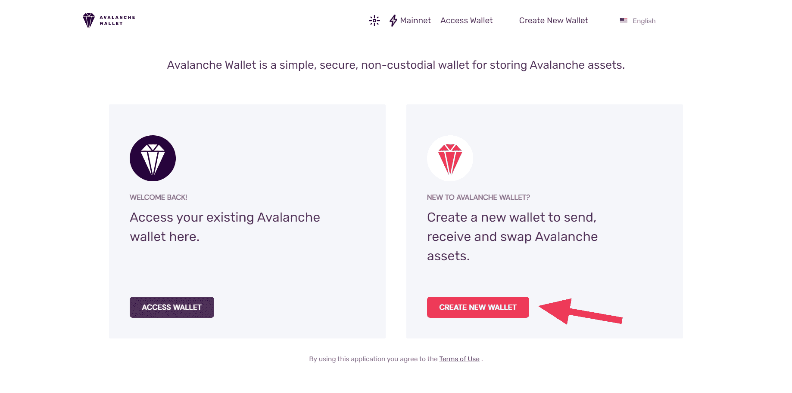

## 生成关键短语

接下来，单击“生成密钥短语”按钮，这将显示一个 24 个单词的列表，您需要将这些单词保存在一个安全的位置。此单词列表用于访问您的帐户，因此不要与任何人共享！

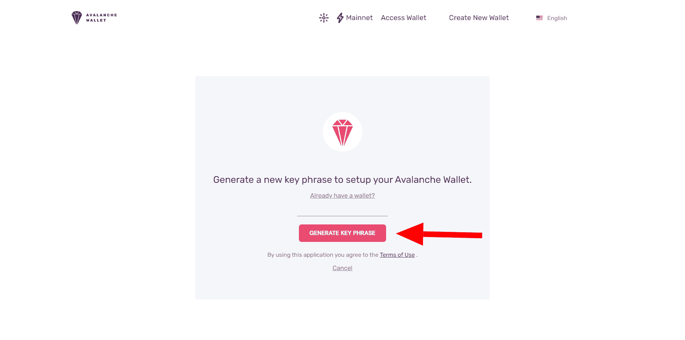

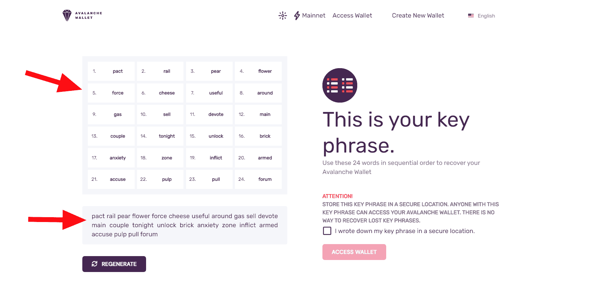

## 验证并访问钱包

在安全的位置保存或记下关键字后，单击复选框启用“访问钱包”按钮。点击此按钮显示验证助记符模式窗口。完成短语以验证您的单词是否正确。

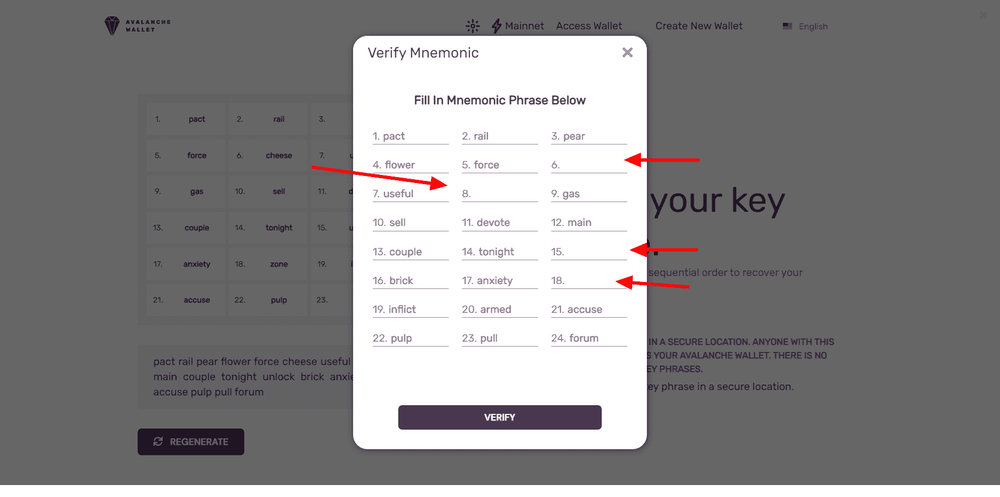

现在，您可以访问您的帐户。单击访问，您将被定向到帐户窗口。

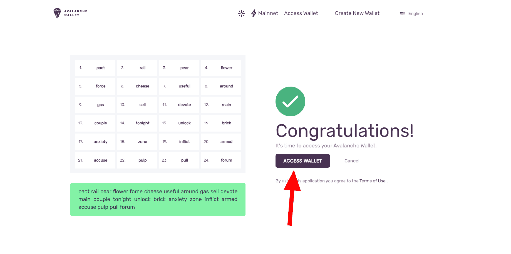

在您的 avalanche wallet 窗口中，您将看到-余额、资产、钱包地址、交易和交易历史(如图所示)。

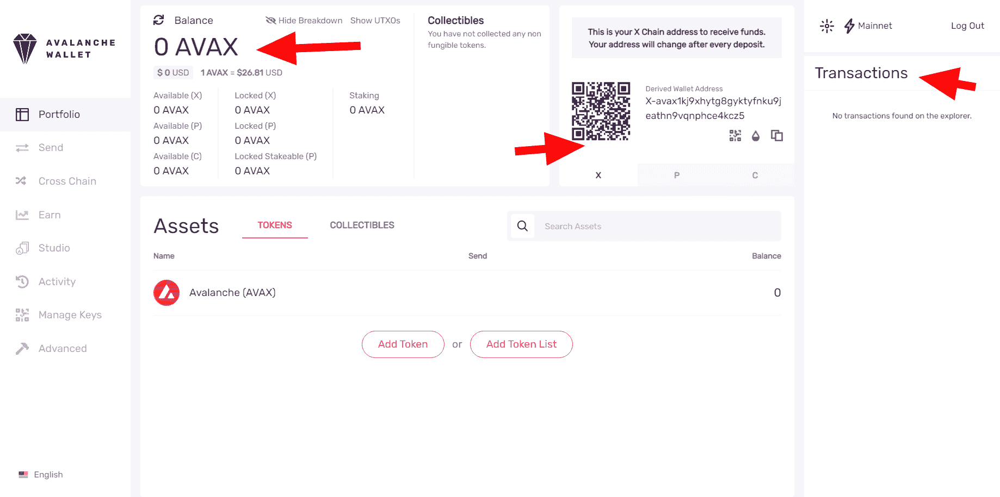

左侧栏是其他活动标签:发送，赚取，交叉链，工作室，活动，管理密钥，和高级。

## 雪崩钱包 NFT 工作室

为了让创建和交换 NFT 的实验更容易，雪崩钱包！有一个内置的 NFT 工作室，在那里你可以创建 NFT 作为资产，雪崩所谓的收藏品。收藏品可以是带有图片和描述的通用 NFT，也可以是带有包含 JSON、自定义 URL 或 UTF-8 数据的有效负载的自定义 NFT。您可以使用一个简单的点击界面来创建它们，使您能够在几分钟内从概念到向朋友发送 NFT。不需要任何技术知识。

要访问 **NFT 工作室**，请登录您的 Avalanche 钱包，并在左侧选择**工作室**:

这将打开 NFT 工作室。在那里你有两个选择:**新家族**，用于创建新的 NFT 家族，以及**造币厂收藏品**，用于在现有家族中创建新的资产。我们需要创建我们的第一个 NFT 家族，所以点击**新家族**。

# 创建一个 NFT 家庭

在那里，您将被要求输入您的收藏品系列的名称，以及一个符号(股票代码)。名称不必是唯一的。

## 就像 NFTs

铸造之前，请转到工作室选项卡。标题“收藏品”下面是两个部分，“新家庭”和“薄荷收藏品”。

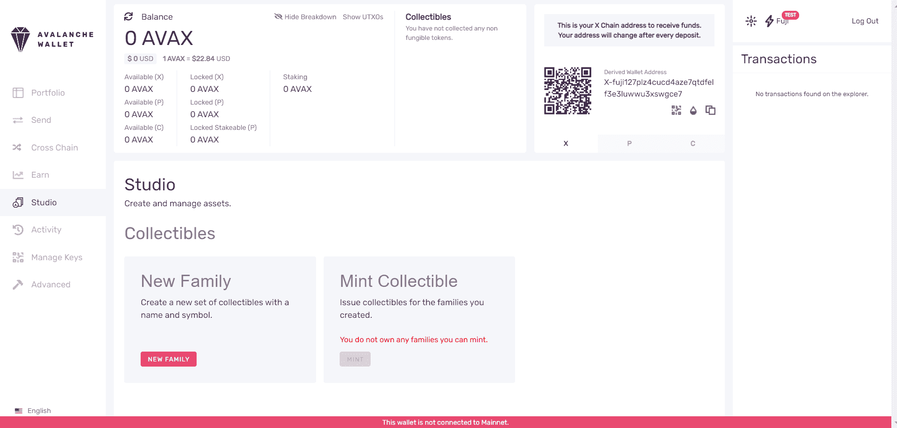

点击 Studio，在这里你可以创建一个新的收藏品系列，如果你还没有这样做的话。

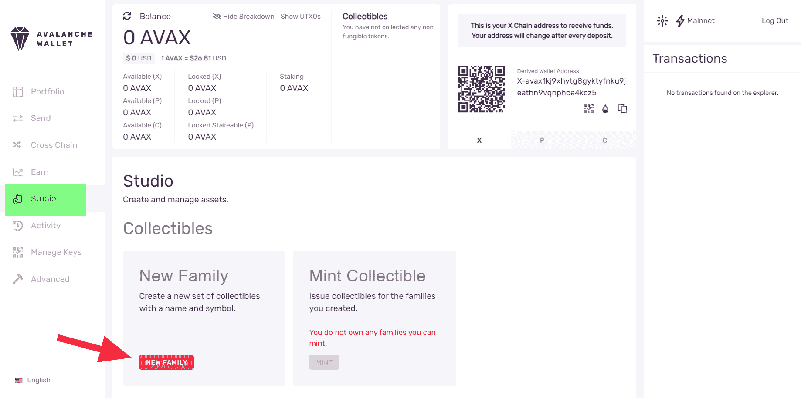

您可以使用 TxID 在 Avalanche block explorer 上查找事务。除了名字和股票代码，你还需要输入一个**组数**，这是新创建的家庭将拥有多少不同的收藏品。请谨慎选择，因为一旦创建，收藏品系列的参数就不能更改。

要创建新的铸币厂，请提供名称、代码和几个组。请注意，将从您的余额中扣除 0.1 AVAX 的费用给 mint。对于测试，您可以使用富士测试网。您需要在 Avalanche wallet UI 中切换网络。一旦你上了富士测试网，就有可能从官方水龙头得到 AVAX 进行测试。

要进行测试，请遵循以下步骤:

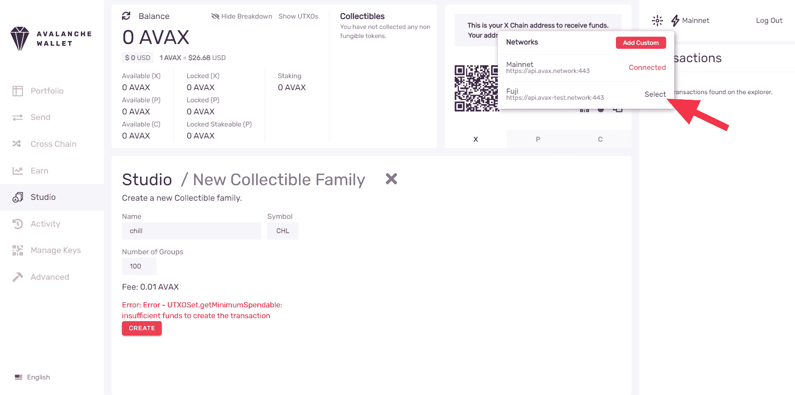

去 AVAX 水龙头在[这里](https://faucet.avax-test.network/)！

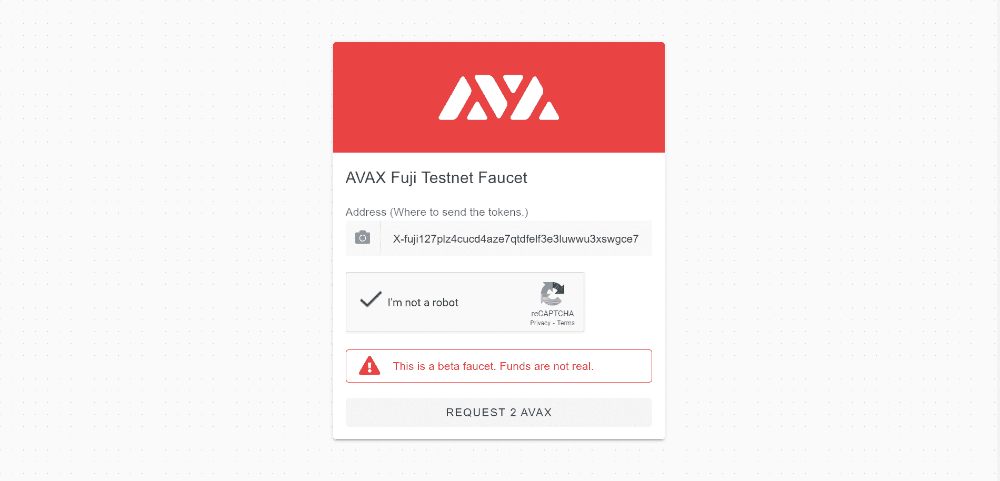

将您的钱包地址(您可以从 Avalanche wallet UI 中复制)粘贴到文本输入中，并传递验证码以接收 2 个 AVAX 令牌。

选择我们刚刚创建的族。您将看到一张表格，需要填写新收藏品的参数:

按**返回工作室**返回，我们准备好创建我们的第一批收藏品。按下**造币厂收藏品**。但是如果不支持铸造，那么您需要创建一个新的可收集系列，如下所示。

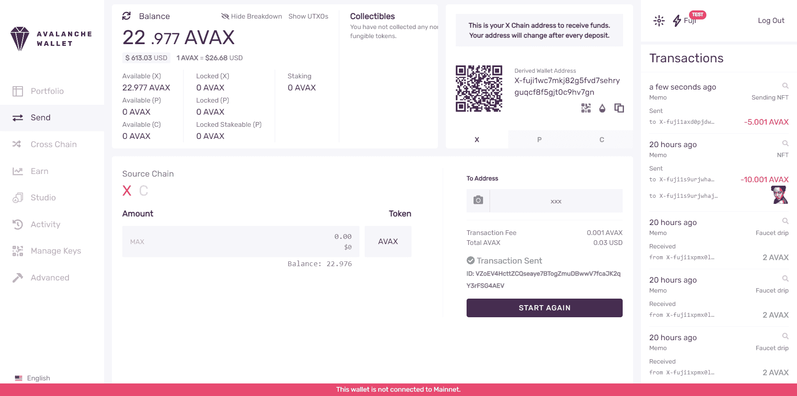

这是一个 NFT，有标题、图片的 URL 和描述。输入所需的数据和数量，这将决定将创建多少份收藏品。像以前一样，仔细输入数据-一旦收藏品被铸造，你将不能改变任何东西。你会看到一个预览的数据，你可以检查你的收藏品将如何看。

如果除了图片收藏之外，您还想要其他东西，请选择**自定义**。

一个定制的可收集文件可以包含一个 **UTF-8** 编码的字符串，一个 **URL** ，或者一个 **JSON** 有效负载。数据的大小不能超过 1024 个字符。

输入并检查数据后，按 **Mint** 创建收藏品。交易费用将从您的钱包中扣除，并将在您的钱包中放置一个新创建的收藏品。

# 查看您的收藏品

您的收藏品概览总是显示在屏幕顶部，同时还有您的余额。

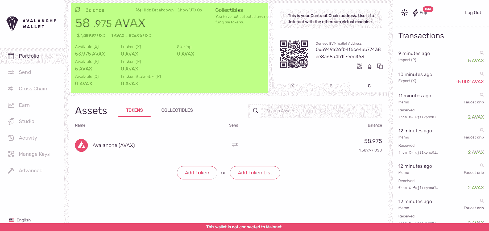

要更详细地查看您的收藏品，请从左侧菜单中选择**投资组合**。您将看到一个屏幕，显示您的所有资产，默认情况下会选择令牌。点击相应的选项卡，将选择更改为**收藏品**。

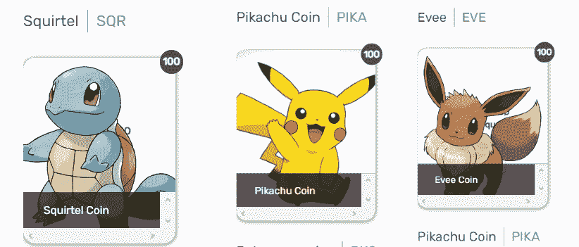

对于每一个普通收藏品，将会显示一张图片，以及标题和数字，表明你的投资组合中有多少份收藏品。将鼠标指针悬停在收藏品上方会显示详细描述:

如果你通过点击选择一个收藏品，你会看到它属于哪个组，它的数量，以及**发送**按钮。

# 转移 NFTs

要将您的收藏品发送给某人，请单击文件夹中所选收藏品上的**发送**按钮，或者导航到左侧菜单上的**发送**选项卡，然后单击**添加收藏品**:

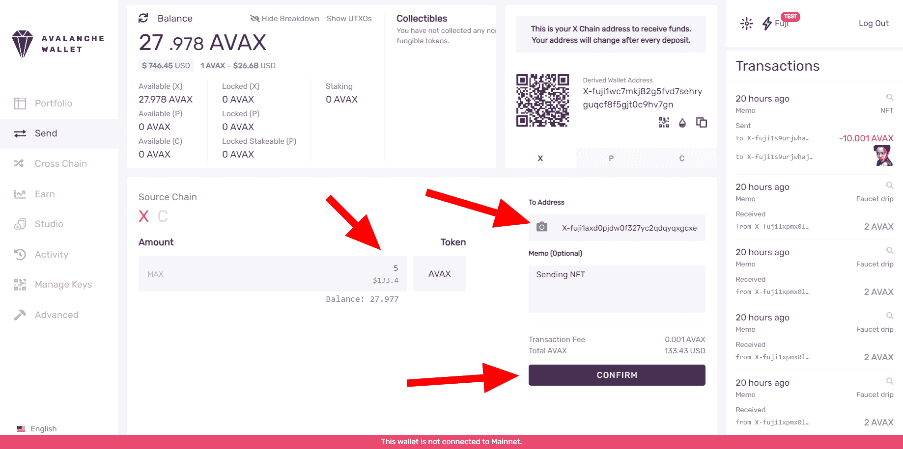

您将看到一个菜单，选择您希望发送的收藏品。

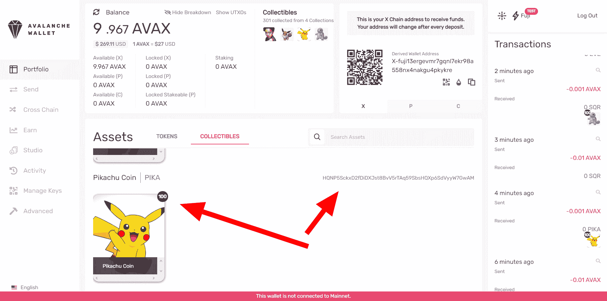

您可以在一次交易中发送多个收藏品。点击收藏品上的标签，您可以编辑想要发送的份数。您可以在一次交易中发送多个系列和可收集类型。

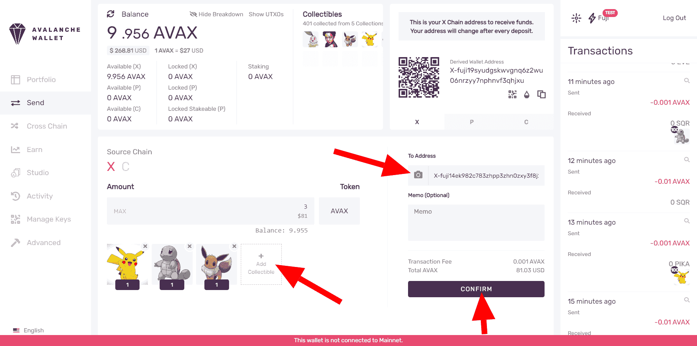

当您输入目的地地址，并可选地输入备忘录文本时，按**确认**启动交易。

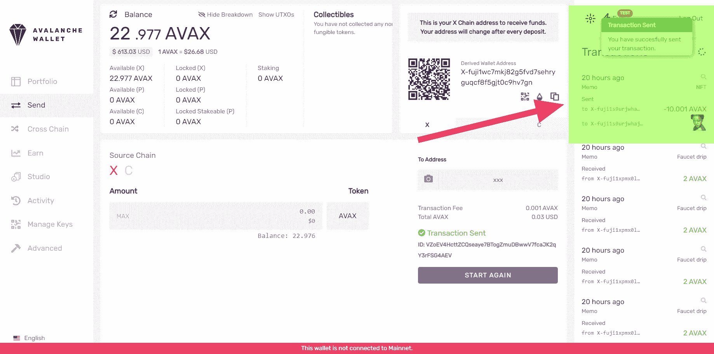

按下**发送交易**后，交易将在网络上公布，交易费用将从您的余额中扣除。收藏品将很快存入目的地地址。

# 摘要

现在，你应该知道如何创建可收藏的 NFT 系列，分组铸造 NFT，并将它们发送到其他地址。好好享受吧！如果你想知道 NFT 如何在雪崩网络上工作的技术背景，或者想使用 NFT 构建产品，请查看这个[雪崩 NFT 教程](https://learn.figment.io/tutorials/creating-an-nft-part-1)！。

如果你在阅读本教程时有任何困难，或者只是想与我们讨论雪崩技术，你可以 [**加入我们的不和谐频道**](https://discord.gg/fszyM7K) ！

# 关于作者

德文德拉·亚达夫

# 参考

本教程基于官方[雪崩文档](https://docs.avax.network/build/tutorials/smart-digital-assets/wallet-nft-studio)。