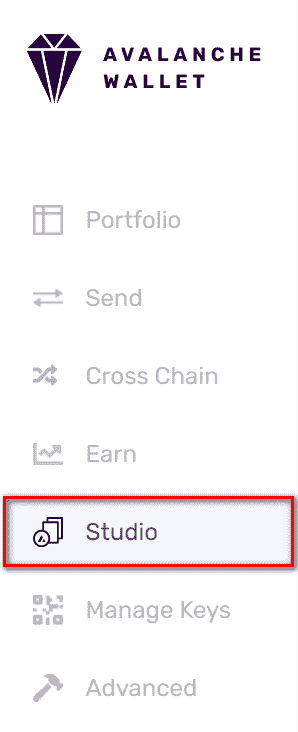
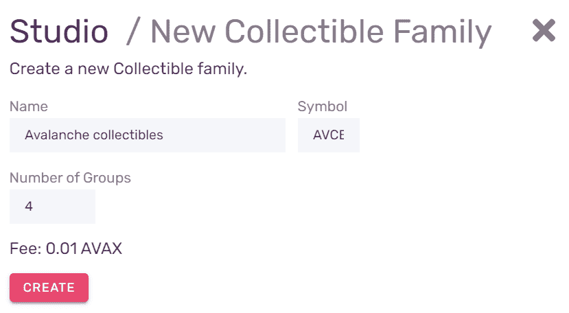
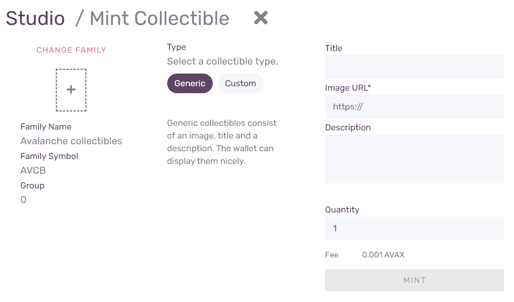
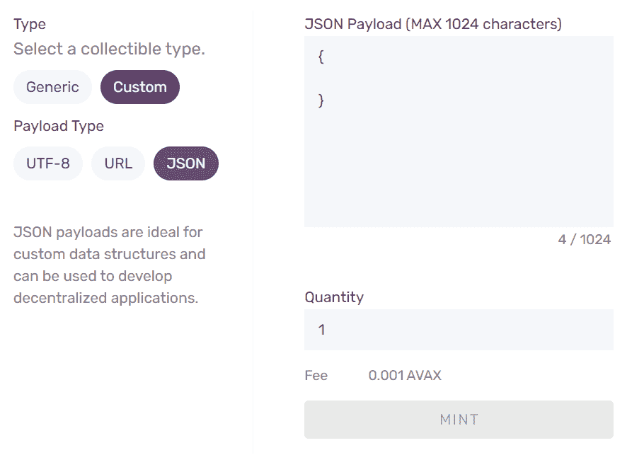
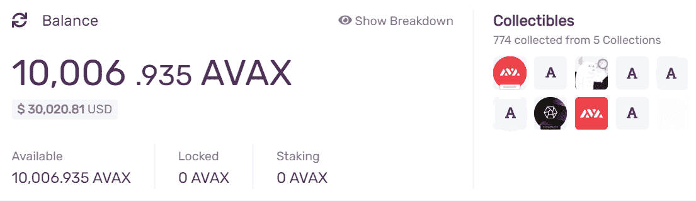
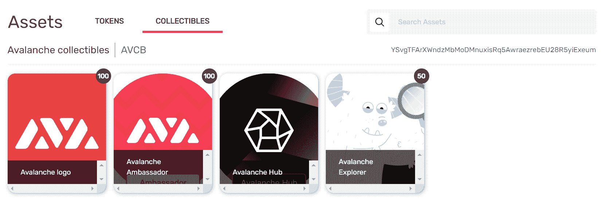
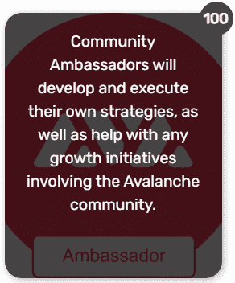
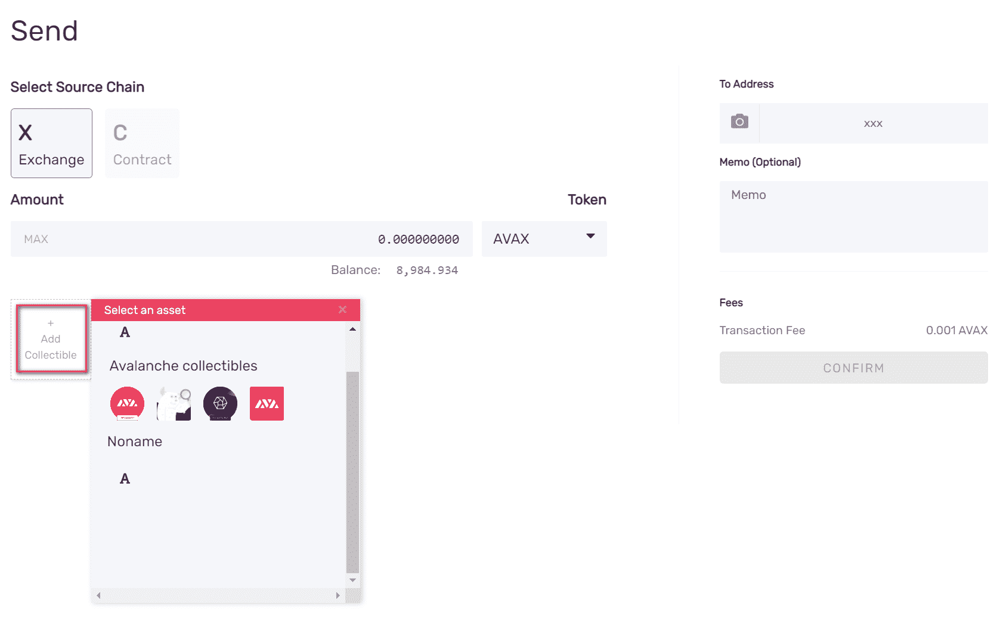
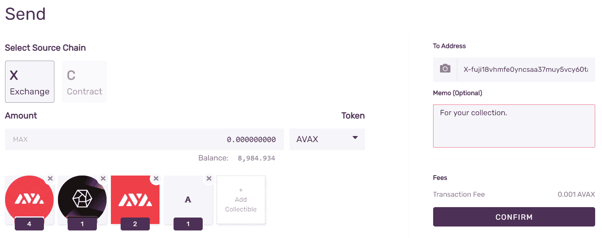
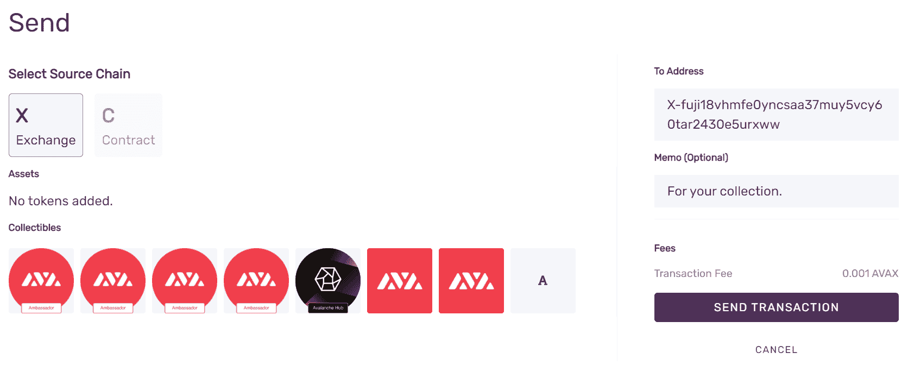

# 雪崩时不可替换的代币

> 原文：<https://github.com/figment-networks/learn-tutorials/blob/master/avalanche/create-nfts-with-the-avalanche-wallet.md>

[**原版教程可以在 AVA 实验室文档这里找到**](https://docs.avax.network/build/tutorials/smart-digital-assets/wallet-nft-studio) 。

除了本机 AVAX 令牌， [Avalanche platform](https://docs.avax.network/build/tutorials/platform) 本机支持创建其他类型的数字资产:固定资本资产、可变资本资产和不可替代令牌(NFT)。

与可互换(可替换)的常规令牌相反，这意味着每个令牌都是相同的，每个不可替换令牌在网络上都是唯一的，具有独特的 ID，使其不同于任何其他令牌。这实现了许多使用可互换令牌不可能实现的用例，例如证明独特资产的所有权。

# 雪崩钱包 NFT 工作室

为了让创建和交换 NFT 的实验更容易，我们在[雪崩钱包](https://wallet.avax.network/)中建立了 **NFT 工作室**，在那里你可以用它来创建 NFT 作为我们称之为收藏品的资产。收藏品可以是带有图片和描述的通用 NFT，也可以是带有包含 JSON、自定义 URL 或 UTF-8 数据的有效负载的自定义 NFT。你可以使用一个简单的点击界面来创建它们，让你在几分钟内就可以把 NFT 发送给你的朋友。不需要技术知识。

要访问 **NFT 工作室**，请登录您的 Avalanche 钱包，并在左侧选择**工作室**:

这将打开 NFT 工作室。在那里你有两个选择:**新家族**，用于创建新的 NFT 家族，以及**造币厂收藏品**，用于在现有家族中创建新的资产。我们需要创建我们的第一个 NFT 家族，所以点击**新家族**。

# 创建 NFT 家庭

在那里，您将被要求输入您的收藏品系列的名称，以及一个符号(股票代码)。名称不必是唯一的。

除了名称和股票代码，您还需要输入**组数**，也就是说，新创建的家庭将拥有多少不同的收藏品。请谨慎选择，因为一旦创建，可收藏系列的参数就无法更改。

当你决定了名称，股票，和组的数量，按**创建**实际上创建可收集的家庭。交易费用将从您的钱包余额中扣除。创建族后，您将看到事务 ID (TxID)以及族的参数。您可以使用 TxID 在浏览器的[中查找事务，但没有必要写下来。](https://explorer.avax.network/)

按**返回工作室**返回，我们准备好创建我们的第一批收藏品。按下**造币厂收藏品**。

# 就像 NFTs

按下**Mint collective**后，你会看到一个列表，列出所有仍有尚未创建的收藏组的收藏家族。

选择我们刚刚创建的族。您将看到一张表格，需要填写新收藏品的参数:

默认情况下，将选择一个**普通**类型的收藏品。这是一个 NFT，它有一个**标题**、图像的 **URL** 和一个**描述**。输入所需的数据，以及**数量**，这将决定将创建多少份收藏品，从而决定您能够发送多少份。像以前一样，仔细输入数据，一旦收藏品被铸造，你将不能改变任何东西。你会看到一个预览的数据，你可以检查你的收藏品会是什么样子。

如果除了图片收藏之外，您还想要其他东西，请选择**自定义**。

一个定制的可收集文件可以包含一个 **UTF-8** 编码的字符串，一个 **URL** ，或者一个 **JSON** 有效负载。数据大小不能超过 1024 个字符。

输入并检查数据后，按 **Mint** 创建收藏品。交易费用将从您的钱包中扣除，并将在您的钱包中放置一个新创建的收藏品。

# 查看您的收藏品

您的收藏品概览总是显示在屏幕顶部，同时还有您的余额。

要更详细地查看您的收藏品，请从左侧菜单中选择**投资组合**。您将看到一个屏幕，显示您的所有资产，默认情况下会选择令牌。点击相应的选项卡，将选择更改为**收藏品**。

对于每一个普通收藏品，将会显示一张图片，以及标题和数字，表明你的投资组合中有多少份收藏品。将鼠标指针悬停在收藏品上方会显示详细描述:

如果你通过点击选择一个收藏品，你会看到它属于哪个组，它的数量，以及**发送**按钮。

# 发送 NFT

要将您的收藏品发送给某人，请单击文件夹中所选收藏品上的**发送**按钮，或者导航到左侧菜单上的**发送**选项卡，然后单击**添加收藏品**:

您将看到一个菜单，选择您希望发送的收藏品。

您可以在一次交易中发送多个收藏品。点击收藏品上的标签，您可以编辑想要发送的份数。您可以在一次交易中发送多个系列和可收集类型。

当您输入目的地地址，并可选地输入备忘录文本时，按**确认**启动交易。

按下**发送交易**后，交易将在网络上公布，交易费用将从您的余额中扣除。收藏品将很快存入目的地地址。

# 摘要

现在，你应该知道如何创建 NFT 家庭，铸造 NFT 集团，并发送到其他地址。好好享受吧！如果你想知道 NFT 如何在雪崩网络上工作的技术背景，或者想使用 NFT 构建产品，请查看 [NFT 教程](https://learn.figment.io/tutorials/creating-an-nft-part-1)。

如果您在学习本教程时有任何困难，或者只是想与我们讨论雪崩技术，您可以今天就 [**加入我们的社区**](https://discord.gg/fszyM7K) ！