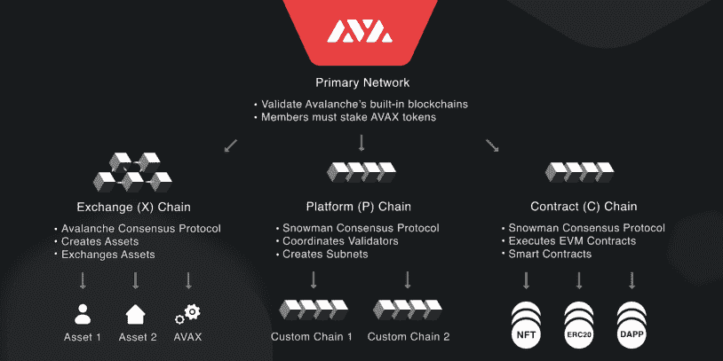
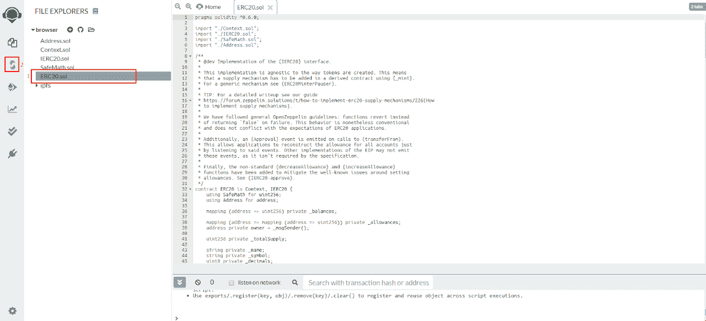
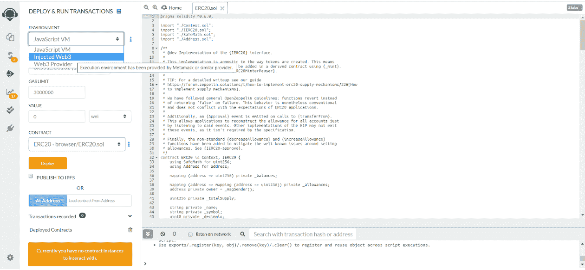
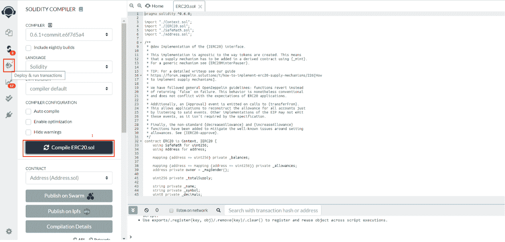
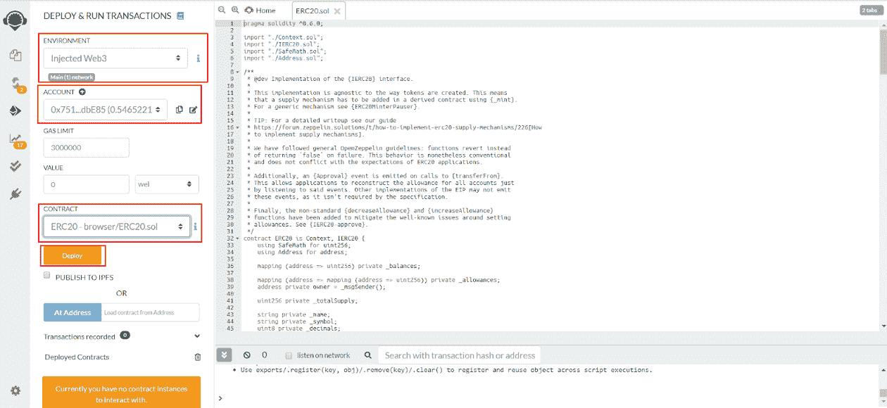
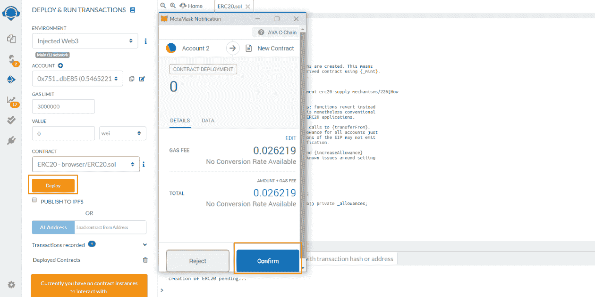
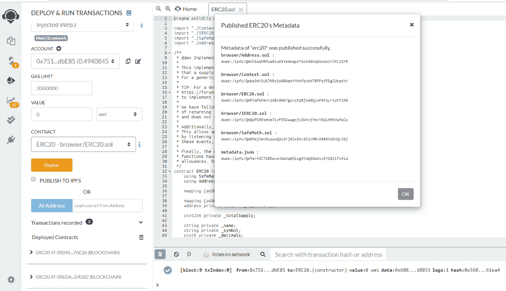
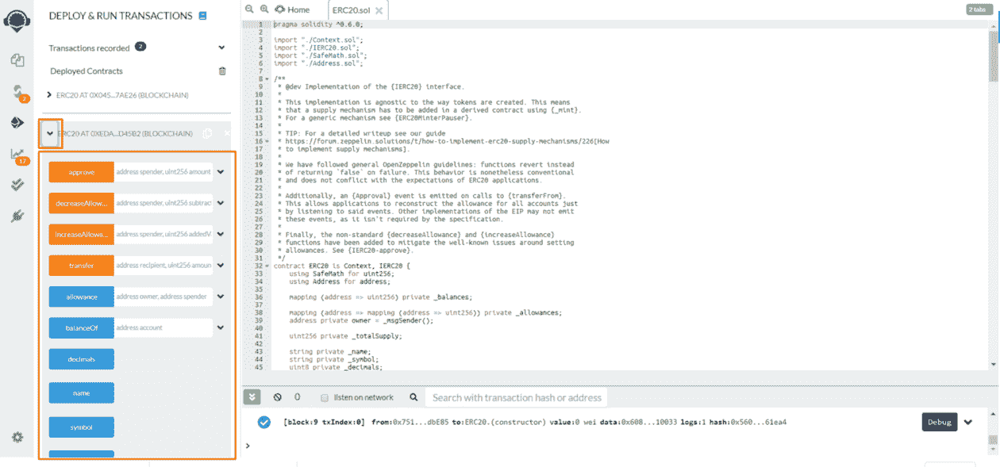
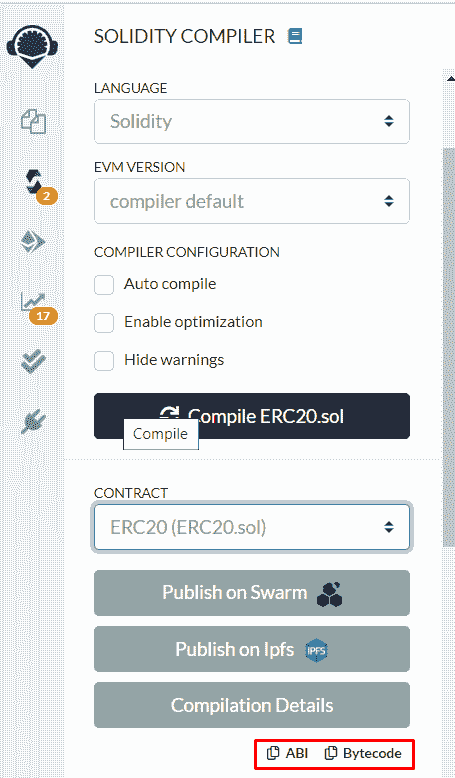

# 介绍

> 原文：<https://github.com/figment-networks/learn-tutorials/blob/master/avalanche/deploy-a-smart-contract-on-avalanche-using-remix-and-metamask.md>

[**原版教程可以在 AVA 实验室文档这里找到**](https://docs.avax.network/build/tutorials/platform/deploy-a-smart-contract-on-avalanche-using-remix-and-metamask) 。

Avalanche 的主网络是一个有三个链的子网:P 链、X 链和 C 链。C 链是以太坊虚拟机的一个实例，由 Avalanche 的雪人共识协议提供支持。通过使用以太坊标准 RPC 调用， [C 链 RPC](https://docs.figment.io/network-documentation/avalanche/rpc-and-rest-api) 可以做任何典型以太坊客户端可以做的事情。使用 C 链而不是以太坊的直接好处就是使用 Avalanche 的所有好处。这些特性可以显著提高 DApps 的性能和用户体验。

今天，我们将使用 Remix 和 MetaMask 在 Avalanche 上部署和测试智能合约。

## 第一步。设置元掩码

登录到元掩码->单击网络下拉菜单->选择自定义 RPC

**富士测试网设置:**

*   **网络名**:雪崩富士 C 链

*   **新的 RPC URL** :

    `https://avalanche--fuji--rpc.datahub.figment.io/apikey/APIKEYGOESHERE/ext/bc/C/rpc`

*   **ChainID** : `0xa869`

*   **符号** : `C-AVAX`

*   **探索者**:[https://cchain . Explorer . avax-test . network](https://cchain.explorer.avax-test.network/)

**雪崩维护网设置:**

*   **网络名称** : Avalanche Mainnet C 链

*   **新的 RPC URL** :

    `https://avalanche--mainnet--rpc.datahub.figment.io/apikey/APIKEYGOESHERE/ext/bc/C/rpc`

*   **ChainID** : `0xa86a`

*   **符号** : `C-AVAX`

*   **探索者**:[https://cchain . Explorer . avax . network/](https://cchain.explorer.avax.network/)

**本地测试网(AVASH)设置:**

*   **网络名称**:雪崩本地
*   **新建 RPC 网址**:[http://localhost:9650/ext/BC/C/RPC](http://localhost:9650/ext/bc/C/rpc)
*   **ChainID** : `0xa868`
*   **符号** : `C-AVAX`
*   **探险家**:不适用

## 第二步。资助你的 C 链地址

### **资助你在富士** 上的 C 链地址

导航到[https://水龙头. avax-test.network/](https://faucet.avax-test.network/) 并粘贴您的 C-AVAX 地址。你只需要添加一个“C-”前缀，水龙头就会从 AVAX 切换到 C-AVAX。

### 资助你在 Mainnet 上的 C 链地址

资助你在 mainnet 上的 C 链地址是通过从 X 链到 C 链的跨链交换完成的。

### 在本地测试网上资助你的 C 链地址

部署自己的水龙头。[教程](https://medium.com/avalabs/the-ava-platform-tools-pt-2-the-ava-faucet-48f28da57146)

## 第三步。Remix:连接 MetaMask 并部署智能合约。

打开[混音](https://remix.ethereum.org/) - >选择实度

使用 Remix 文件资源管理器加载或创建我们想要编译和部署的智能合约。

对于这个例子，我们将从 [OpenZeppelin](https://openzeppelin.com/contracts) 部署一个 ERC20 契约。

导航到 Deploy 选项卡->打开“环境”下拉菜单，并选择 Injected Web3(确保加载了元掩码)

一旦我们注入了 web3->返回到编译器，并编译所选的契约->导航到部署选项卡

现在，智能合同已经编译完毕，元掩码已经注入，我们已经准备好部署我们的 ERC20 了。点击“部署”

在元掩码弹出窗口上确认交易。

我们的合同已成功部署！

现在，我们可以通过从“Deployed Contracts”选项卡中选择它来扩展它，并进行测试。

契约 ABI 和字节码在编译器选项卡上可用。

如果您在学习本教程时有任何困难，或者只是想与我们讨论雪崩技术，您可以今天就 [**加入我们的社区**](https://discord.gg/fszyM7K) ！