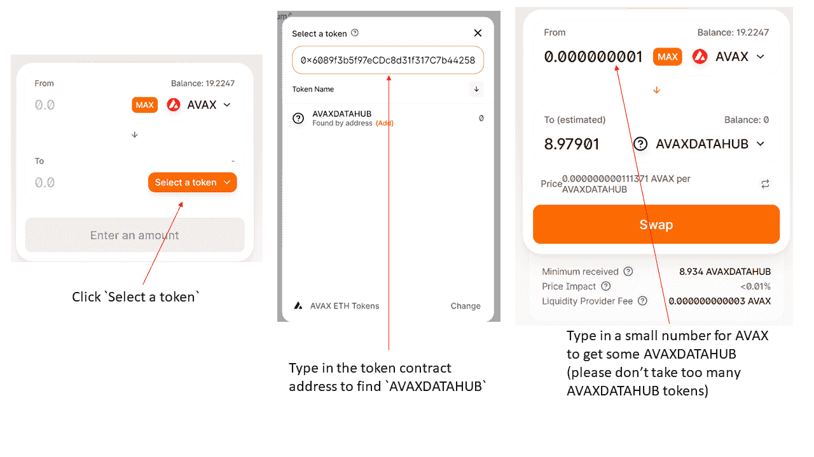
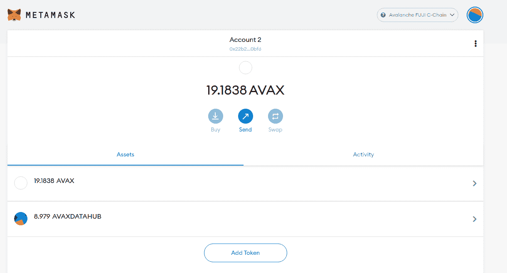
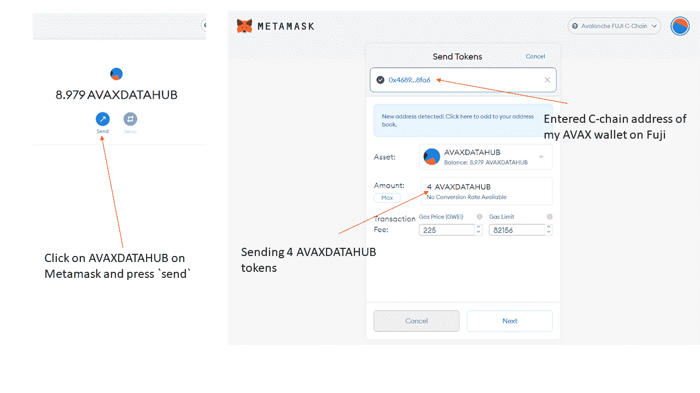
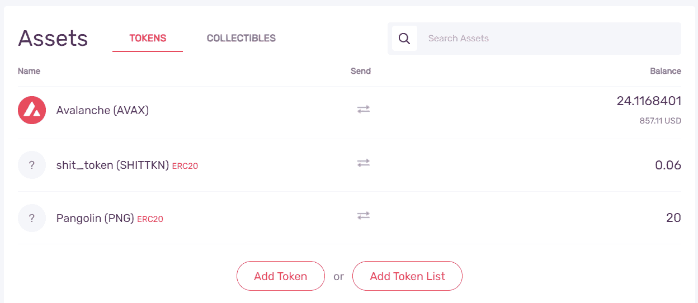
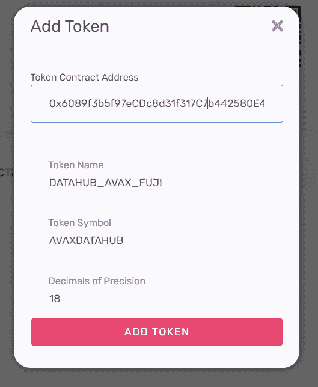
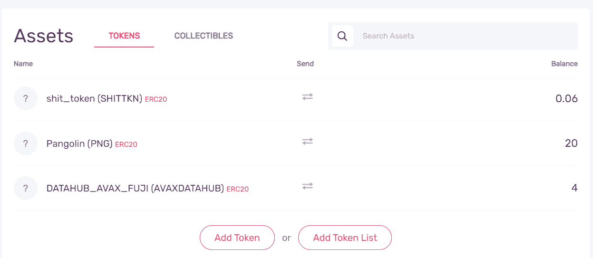
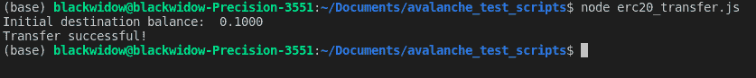
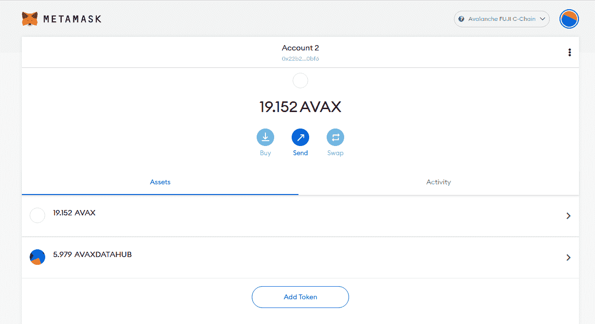
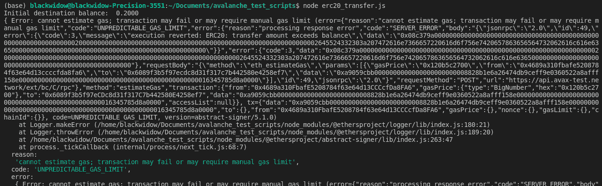

# 介绍

> 原文:[https://github . com/fig ment-networks/learn-tutorials/blob/master/avalanche/ERC 20-token-transfer-to-eth-address . MD](https://github.com/figment-networks/learn-tutorials/blob/master/avalanche/erc20-token-transfer-to-eth-address.md)

继续令牌转移的主题，在本教程中，我们将学习如何以编程方式将 ERC-20 令牌从 Avalanche C 链转移到 Metamask 钱包。

# 先决条件

*   [打造雪崩钱包](https://wallet.avax.network/create)
*   [用富士水龙头为您的 Avalanche 钱包充值](https://docs.avax.network/build/tutorials/platform/fuji-workflow#get-a-drip-from-the-fuji-faucet)
*   [将富士 Avax 代币从 X 链转移到 C 链](https://docs.avax.network/build/tutorials/platform/transfer-avax-between-x-chain-and-c-chain)
*   拥有集成开发环境，如 [Visual Studio 代码](https://code.visualstudio.com/download)
*   熟悉穿山甲等 DEX 的使用和[代币互换的概念](https://www.youtube.com/watch?v=kNQp4t03lOQ)

# 要求

*   [节点 j](https://nodejs.org/en)
*   [醚类](https://docs.ethers.io/v5/)，可以用`npm install ethers`安装
*   在浏览器中安装[元掩码扩展](https://metamask.io/download.html)。
*   [配置您的 Metamask 以添加 Avalanche FUJI testnet](https://docs.avax.network/build/tutorials/smart-contracts/deploy-a-smart-contract-on-avalanche-using-remix-and-metamask#step-1-setting-up-metamask)

# 入门指南

出于本教程的目的，我已经创建了一个名为 AVAXDATAHUB 的 ERC-20 令牌，并在富士测试网上的[穿山甲](https://app.pangolin.exchange/#/swap)上创建了一个 AVAXDATAHUB - AVAX 流动性池。Pangolin 是一个基于 Avalanche 的分散式交换平台，它也与 Fuji testnet 兼容，用于测试目的。

我们会上穿山甲，用 AVAX 换一些 AVAXDATAHUB 令牌。代币合同地址为`0x6089f3b5f97eCDc8d31f317C7b442580E4258ef7`。

继续使用[穿山甲](https://app.pangolin.exchange/#/swap)并将元蒙版上的 AVAX 换成一些 AVAXDATAHUB，如下图所示。

[](https://camo.githubusercontent.com/97e4e9861484defcd19e56afefadd24b77348a95d23ed41509e2cac199116436/68747470733a2f2f692e696d6775722e636f6d2f4343554e55357a2e706e67)

交换后，返回 Metamask，单击“Add Token”并键入合同地址，如下图所示。如果不手动添加 AVAXDATAHUB 令牌，它将不会显示在元掩码上。

[](https://camo.githubusercontent.com/b4f6620594646ff44ffe46742cdf08901e0feafaadcd99a860285d8f4f2f0458/68747470733a2f2f692e696d6775722e636f6d2f4b3859674d72592e706e67)

您从穿山甲那里获得的 AVAXDATAHUB 令牌现在应该会显示在您的 Metamask 钱包上，如下所示(8.979 个 AVAXDATAHUB 令牌)。

[](https://camo.githubusercontent.com/5dbd6852bd5586202a8c9e85d6e4ce5a09ec682f91d79c18068795c2078eb6ec/68747470733a2f2f692e696d6775722e636f6d2f6f394a45316b4a2e706e67)

出于教程的考虑，让我们将 Metamask 中的一些 AVAXDATAHUB 令牌发送到您的 Avalanche 私人钱包中。如果你不知道如何做到这一点，请参考下图。

[](https://camo.githubusercontent.com/c99c368e9b4feca16b3a6afbe7f6da6ecf09977dc7824ae8dc5707c1258d743e/68747470733a2f2f692e696d6775722e636f6d2f4e4337484471682e706e67)

在上图中，显示了 4 个 AVAXDATAHUB 令牌已被发送到 Avalanche 钱包的 C 链。

但是，当您登录 Avalanche 钱包时，您将无法看到代币。

[](https://camo.githubusercontent.com/3ea59939abf227b87db434aea9e45ed3669e70d342a3c084eed77a16fb9f2ce2/68747470733a2f2f692e696d6775722e636f6d2f4c775057496c6f2e706e67)

为了查看这些令牌，您必须添加令牌合同地址。

点击钱包硬币列表下方的“添加代币”并输入 AVAXDATAHUB 合同地址，那么剩下的信息应该会自动加载，如下图所示。

[](https://camo.githubusercontent.com/0cffb69f2e4ad92c731dbe2c38455a6dd6aee25629ff9ce857ceaba08a9367cf/68747470733a2f2f692e696d6775722e636f6d2f723861676c51392e706e67)

然后，您应该能够看到令牌显示在您的列表中，如下图所示。

[](https://camo.githubusercontent.com/45858da58f51ca39a606a70c6375c0fe2f28931fcf1bdb857e9fa45590a28f39/68747470733a2f2f692e696d6775722e636f6d2f566c4475446e382e706e67)

到目前为止，我们已经告诉您，任何 ERC-20 令牌都可以存储在您的 Avalanche 钱包的 C 链上。

## 将 ERC-20 令牌从 C 链转移到 ETH 地址

我们将在项目的根目录下创建一个名为`ERC20_fromC_to_ETH_address.js`的新文件。一旦您在指定的名称下创建了一个. js 文件，我们将在。

首先，我们需要导入`ethers`库来与 Avalanche C 链交互

```
const { ethers } = require('ethers');
```

AVAX 钱包中的助记键需要放在下面的引号之间。这稍后用于提取 C 链钱包地址。

```
const mnemonic = "";
```

下面的代码指向 AVAX mainnet。

```
const provider = new ethers.providers.JsonRpcProvider('https://api.avax-test.network/ext/bc/C/rpc');
```

使用前面提供的助记短语，我们可以提取相应的 ETH 钱包私钥。这样，我们可以解锁 Avalanche C 链钱包并签署交易，这是用下面的代码完成的。

```
const walletMnemonic = new ethers.Wallet.fromMnemonic(mnemonic);
const pvtKey  = walletMnemonic.privateKey;
const wallet = new ethers.Wallet(pvtKey, provider);
```

将代币从一个钱包转移到另一个钱包是一种交易。为了执行交易，需要提供某些信息。需要提供 ERC-20 令牌(本例中为 AVAXDATAHUB)的令牌地址(也称为契约地址)。因此，我们将在下面存储合同地址和 ticker。令牌 ticker 不是必需的，但是我们添加它是为了自己使用。Avalanche 的很多令牌合约地址可以在这里找到[。](https://github.com/pangolindex/tokenlists/blob/main/aeb.tokenlist.json)

```
const tknAddr = "0x6089f3b5f97eCDc8d31f317C7b442580E4258ef7";  
const token_name = "AVAXDATAHUB";
```

从逻辑上讲，我们还需要提供目的地地址。将目的地址放在引号之间。

```
const toAddr = "";
```

发行交易所需的另一部分是所谓的 ABI。合同应用二进制接口(ABI)是以太坊生态系统中与合同交互的标准方式。这里提供了 ABI 的格式[。](https://docs.ethers.io/v5/getting-started/#getting-started--contracts)

```
const tknAbi = [
  // Some details about the token
  "function name() view returns (string)",
  "function symbol() view returns (string)",

  // Get the account balance
  "function balanceOf(address) view returns (uint)",

  // Send some of your tokens to someone else
  "function transfer(address to, uint amount)",

  // An event triggered whenever anyone transfers to someone else
  "event Transfer(address indexed from, address indexed to, uint amount)"
  ];
```

虽然不需要打印目的钱包地址的 AVAXDATAHUB 余额来执行转账，但是我们将在这里展示如何读取某个令牌的余额。

```
const getBalance = async () => {
  // Create Contract object connected to provider
  const tknContract = new ethers.Contract(tknAddr, tknAbi, provider);

  // Get balance as BigNumber and convert to Number
  const balanceBigNum = await tknContract.balanceOf(toAddr);
  const balanceNum = Number(ethers.utils.formatEther(balanceBigNum));

  // Set precision and convert to string
  const precision = 4;
  const balanceStr = balanceNum.toFixed(precision).toString();

  return balanceStr;
}
```

现在，我们将定义`sendToken`函数，该函数将执行 1 个 AVAXDATAHUB 令牌从 Avalanche 钱包的 C 链到 ETH 目的地址的传输。

```
const sendToken = async () => {
  if (provider === null || wallet === null) {
    console.error("Encountered null object, unable to send token.");
    return;
  } 

  // Create Contract object connected to wallet
  const tknContract = new ethers.Contract(tknAddr, tknAbi, wallet);

  // Specify amount to send (e.g. 1 ERC20 token)
  const amt = ethers.utils.parseEther("1.0");

  // Send amount to destination
  const tx = tknContract.transfer(toAddr, amt);

  return tx;
}
```

既然我们已经有了读取余额和执行转账的函数，我们就可以开始实现它们了。下面的代码读取 1 个 AVAXDATAHUB 令牌转移前后的余额。

```
getBalance()
  .then(initBalance => {
    console.log("Initial destination balance: ", initBalance);

    // Send ERC20 token from AVAX wallet C-Chain to ETH address
    sendToken()
      .then(_tx => {
        console.log("Transfer successful!");
      })
      .catch(console.error);
  })
.catch(console.error);
```

至此，您已经浏览了整个脚本。

完成的脚本应该如下所示:

```
const { ethers } = require('ethers');
const mnemonic = "";
const provider = new ethers.providers.JsonRpcProvider('https://api.avax-test.network/ext/bc/C/rpc');

const walletMnemonic = new ethers.Wallet.fromMnemonic(mnemonic);
const pvtKey  = walletMnemonic.privateKey;
const wallet = new ethers.Wallet(pvtKey, provider);

const tknAddr = "0x6089f3b5f97eCDc8d31f317C7b442580E4258ef7";  
const token_name = "AVAXDATAHUB";
const toAddr = "";

const tknAbi = [
  // Some details about the token
  "function name() view returns (string)",
  "function symbol() view returns (string)",

  // Get the account balance
  "function balanceOf(address) view returns (uint)",

  // Send some of your tokens to someone else
  "function transfer(address to, uint amount)",

  // An event triggered whenever anyone transfers to someone else
  "event Transfer(address indexed from, address indexed to, uint amount)"
  ];

const getBalance = async () => {
  // Create Contract object connected to provider
  const tknContract = new ethers.Contract(tknAddr, tknAbi, provider);

  // Get balance as BigNumber and convert to Number
  const balanceBigNum = await tknContract.balanceOf(toAddr);
  const balanceNum = Number(ethers.utils.formatEther(balanceBigNum));

  // Set precision and convert to string
  const precision = 4;
  const balanceStr = balanceNum.toFixed(precision).toString();

  return balanceStr;
}

const sendToken = async () => {
  if (provider === null || wallet === null) {
    console.error("Encountered null object, unable to send token.");
    return;
  } 

  // Create Contract object connected to wallet
  const tknContract = new ethers.Contract(tknAddr, tknAbi, wallet);

  // Specify amount to send (e.g. 1 ERC20 token)
  const amt = ethers.utils.parseEther("1.0");

  // Send amount to destination
  const tx = tknContract.transfer(toAddr, amt);

  return tx;
}

getBalance()
  .then(initBalance => {
    console.log("Initial destination balance: ", initBalance);

    // Send ERC20 token from AVAX wallet C-Chain to ETH address
    sendToken()
      .then(_tx => {
        console.log("Transfer successful!");
      })
      .catch(console.error);
  })
.catch(console.error);
```

要运行脚本`ERC20_fromC_to_ETH_address.js`，键入`node ERC20_fromC_to_ETH_address.js`并在您的终端中运行它(文件名前的节点是调用 NodeJS 运行时环境的方式)。

终端中脚本的输出应该如下所示。

[](https://camo.githubusercontent.com/28a16903e182efafbd6dd6de5460c2dd354484dee8d15a77a9ebb62fb8cc63db/68747470733a2f2f692e696d6775722e636f6d2f693079734f35512e706e67)

您也可以通过查看 Metamask 上的平衡变化来确认结果。

正如你在下面的图片中看到的，平衡从 4.97 变成了 5.97。

[](https://camo.githubusercontent.com/03f4d12feddab6ccbd22ce2301e6aa3198b7edf8fb4486653bb87104cbfb9724/68747470733a2f2f692e696d6775722e636f6d2f435449413565752e706e67)

# 解决纷争

## 交易失败

如果 C 链上有足够的 AVAX，但没有足够的 AVAXDATAHUB 令牌(或您打算传输的任何 ERC20 令牌)，您可能最终会在终端中得到一个错误。这样的错误消息如下所示。

[](https://camo.githubusercontent.com/821553043dd697727e88b9f0cf9a86382c5d4e2eb11ba50105e9207ed46c7ab1/68747470733a2f2f692e696d6775722e636f6d2f654235455277682e706e67)

尽管错误消息指出了一些天然气成本估算问题，但问题是 AVAXDATAHUB 没有足够的平衡。确保您的 AVAX wallet 的 C 链上有足够的 ERC20 令牌余额。

相反，如果您有足够的 AVAXDATAHUB 余额，但没有足够的 AVAX 令牌来支付交易，则会产生相同的错误消息。同样，确保你有足够的 AVAX 余额来支付交易。

# 结论

本教程教你如何将 ERC 20 代币从 C 链转移到 Metamask 钱包。请注意，C 链使用以太坊虚拟机，并且与所有关键的以太坊工具兼容。

# 关于作者

本教程由 [Seongwoo Oh](https://github.com/blackwidoq) 创作。他是学生，雪崩新手。