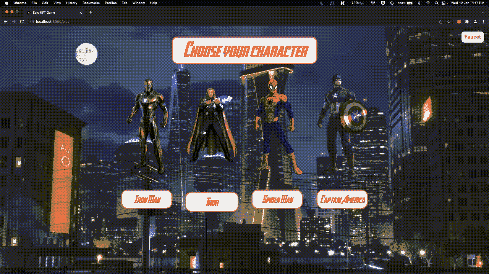
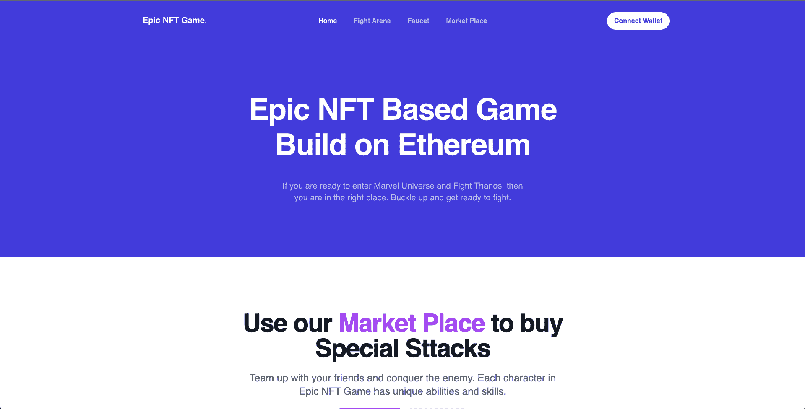
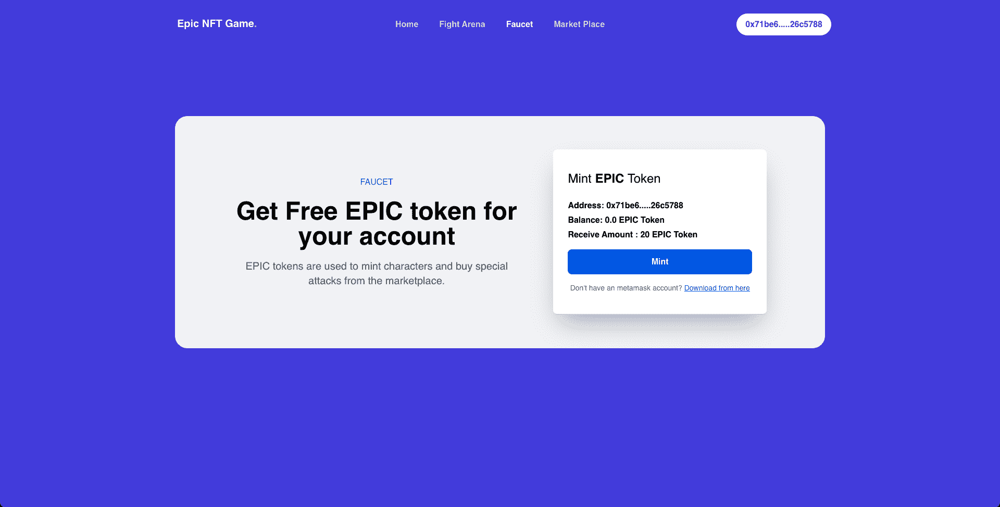
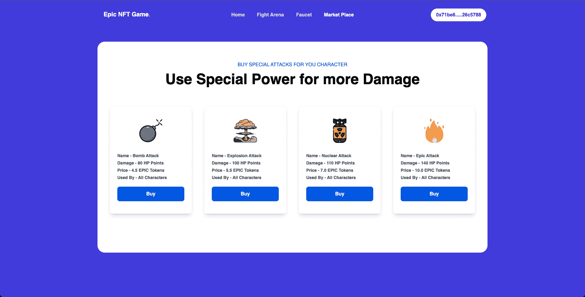
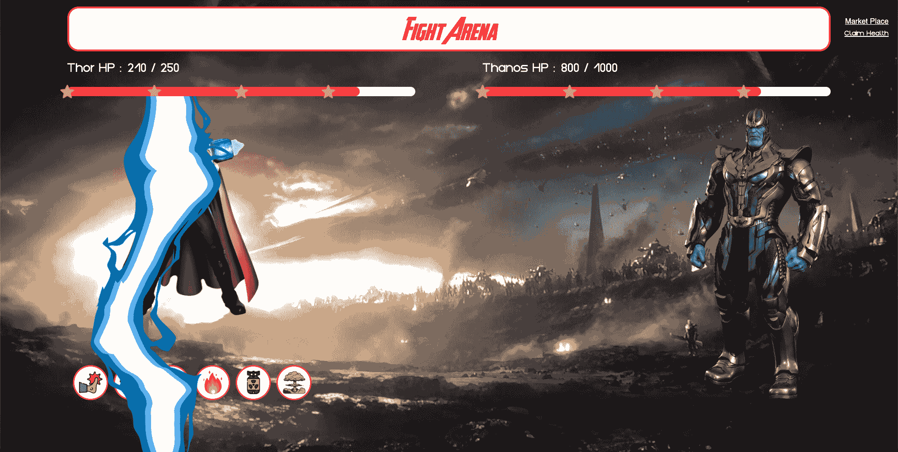
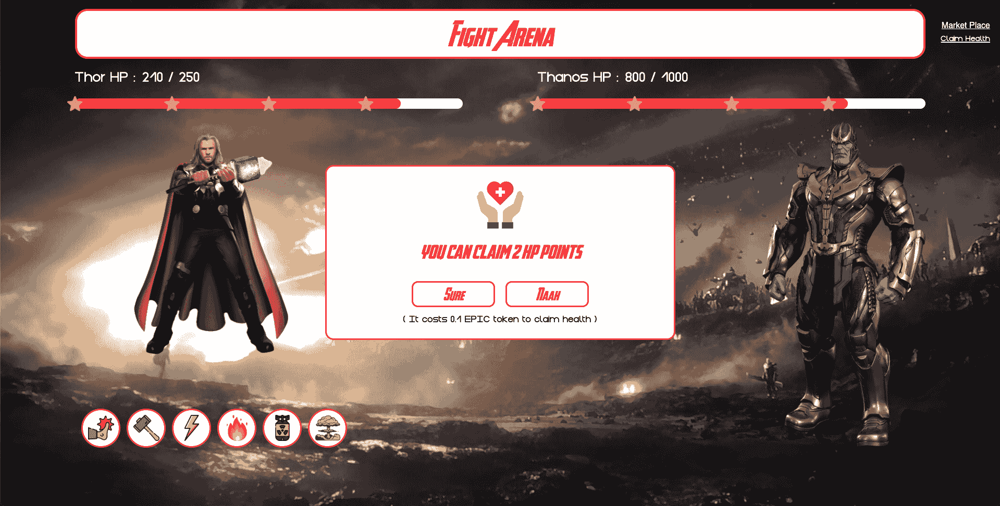
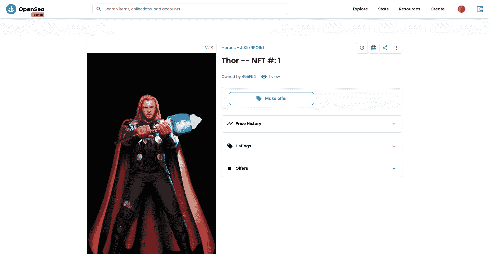

# 介绍

> 原文:[https://github . com/fig ment-networks/learn-tutorials/blob/master/avalanche/how-to-create-on-chain-NFT-game . MD](https://github.com/figment-networks/learn-tutorials/blob/master/avalanche/how-to-create-on-chain-nft-game.md)

在本教程中，我们将学习如何使用部署在 Avalanche 网络上的 Solidity smart contract 和与游戏交互的 NextJS 前端来创建 NFT 游戏。

我们将用一个 ERC20 代币创建一个复仇者主题的 NFT 游戏，它可以用来铸造游戏中的角色和从市场上购买特殊的力量。是的，我们将创造一个市场，玩家可以为他们的角色购买额外的能力。该游戏将具有以下特点-

*   每个用户可以使用 EPIC 令牌铸造一个他们选择的角色。
*   人们可以从我们将在 dApp 中创建的水龙头中获得史诗令牌。
*   一旦用户有了一个角色，他们就可以进入格斗场与老板(灭霸)战斗。
*   每个角色都有生命值、伤害值和攻击模式(踢、打等)...).
*   用户可以使用史诗令牌从市场上为他们的角色购买特殊攻击。
*   每次角色打 boss，boss 都会回击，减少玩家的 HP。
*   随着时间的推移，用户可以使用 EPIC 令牌获得更多健康。
*   如果一个角色的生命值达到 0，他们就不能玩这个游戏，直到他们获得新的生命值。
*   Boss 会有非常高的 HP，但是 boss 的 HP 不随时间增加。
*   boss 角色对所有拥有相同 HP 的玩家来说都是一样的，每个人都必须集体努力打败 boss。

听起来很有趣？这是我们将要创建的游戏的样子:

[](https://raw.githubusercontent.com/figment-networks/learn-tutorials/master/assets/nft-game-demo.gif)

# 先决条件

为了成功地跟随本教程，你需要很好地理解 [ERC721 标准](https://eips.ethereum.org/EIPS/eip-721)、[可靠性语言](https://docs.soliditylang.org/en/v0.8.11/)、[安全帽框架](https://hardhat.org/)和 [Next.js 框架](https://nextjs.org/)。

我们将使用 [ethers.js](https://docs.ethers.io/v5/) 库与前端的智能合约和 Next.js 进行交互。

# 要求

*   Hardhat 为创建和测试区块链应用程序提供了一个本地开发环境。
*   [元掩码](https://metamask.io/) -你需要在浏览器中安装一个元掩码钱包。
*   [Next.js](https://nextjs.org/) -创建用户界面的 web 框架。
*   Arweave -我们将在 Arweave 上存储与提案相关的图片。
*   一个 CSS 实用框架。

# 项目设置

我们将使用[nextjs-hard hat-tail wind-starter](https://github.com/viral-sangani/nextjs-hardhat-tailwind-starter)进行初始设置。运行以下代码，开始使用样板代码。

```
git clone https://github.com/viral-sangani/nextjs-hardhat-tailwind-starter
mv nextjs-hardhat-tailwind-starter epic-nft-game
cd epic-nft-game 
```

该入门套件附带了您开始使用 dApp 所需的所有软件包。您可以在这里看到初学者工具包[中的软件包列表。](https://github.com/viral-sangani/nextjs-hardhat-tailwind-starter/blob/main/package.json)

我们将需要更多的软件包来为我们的游戏创建令人敬畏的用户界面。运行以下代码添加其他包。

```
yarn add @headlessui/react dotenv react-lottie react-spring react-step-progress-bar react-toastify react-tooltip 
```

# 正在创建 EPIC ERC20 令牌

将`contracts/ERC20Token.sol`重命名为`EPICToken.sol`，并粘贴以下代码。

```
// SPDX-License-Identifier: UNLICENSED

pragma solidity ^0.8.0;
import "@openzeppelin/contracts/token/ERC20/ERC20.sol";

contract EPICToken is ERC20 {
    constructor(string memory name, string memory symbol) ERC20(name, symbol) {
        _mint(msg.sender, 100000 * (10**18));
    }

    function faucet(address recipient, uint256 amount) external {
        require(amount <= 20 ether, "Amount must be less than 20 ether");
        _mint(recipient, amount);
    }
}
```

在`EPICToken`契约中，我们将接受来自构造函数的令牌名称和令牌符号，并为契约所有者铸造一些令牌。

我们也有一个水龙头的方法，将空投多达 20 个史诗令牌在呼叫者的帐户。请注意，如果请求的令牌超过 20 个，方法调用将会恢复。

# 创建 NFTEpicGame 智能合同

在 contracts 文件夹中创建一个名为`NFTEpicGame.sol`的文件，并编写以下代码

[NFTEpicGame.sol](https://github.com/viral-sangani/epic-nft-game/blob/main/contracts/NFTEpicGame.sol)

我知道这很难理解，让我们来看看智能合同中发生了什么。

```
import "@openzeppelin/contracts/token/ERC721/ERC721.sol";
import "@openzeppelin/contracts/token/ERC20/IERC20.sol";
import "@openzeppelin/contracts/utils/Counters.sol";
import "@openzeppelin/contracts/utils/math/SafeMath.sol";
import "@openzeppelin/contracts/utils/Strings.sol";
import "@openzeppelin/contracts/access/Ownable.sol";
import "@openzeppelin/contracts/security/ReentrancyGuard.sol";
import "./libraries/Base64.sol";
import "hardhat/console.sol";
```

我们正在导入所有必要的 Openzeppelin 合同。我们需要 ERC721 来创建字符 NFT，需要 IERC20 来调用 EPIC 令牌上的 ERC20 方法。我们将使用一些公用事业合同，如`Counters.sol`、`SafeMath.sol`、`Strings.sol`、`Ownable.sol`、`ReentrancyGuard.sol`和`Base64.sol`。

`console.sol`由 hardhat 提供，用于在智能合约中添加一些调试语句，这些调试语句将在合约编译部署时被删除。

```
contract NFTEpicGame is ERC721, ReentrancyGuard, Ownable {
    using Counters for Counters.Counter;
    using SafeMath for uint256;

    Counters.Counter private _tokenIds;
    address epicToken;
    uint256 regenTime = 60;
}
```

我们将在 NFTEpicGame 中继承 ERC721、ReentrancyGuard 和 Ownable 契约。ERC721 用于为我们的用户铸造 NFT 字符。ReentrancyGuard 是一个修饰符，可以在某些函数中防止重入(在这里阅读更多关于 ReentrancyGuard [)。Ownable 提供了一种基本的访问控制机制，可以授予所有者帐户对特定功能的独占访问权限。](https://docs.openzeppelin.com/contracts/4.x/api/security#ReentrancyGuard)

`_tokenIds`用于跟踪所有 NFT，`epicToken`是我们的 ERC20 令牌的合同地址，`regenTime`是用户必须等待收回健康状态的时间(以秒为单位)(简要说明如下)。

```
    struct CharacterAttributes {
        uint256 characterIndex;
        string name;
        string imageURI;
        uint256 hp;
        uint256 maxHp;
        uint256[] attacks;
        uint256[] specialAttacks;
        uint256 lastRegenTime;
    }

    struct AttackType {
        uint256 attackIndex;
        string attackName;
        uint256 attackDamage;
        string attackImage;
    }

    struct SpecialAttackType {
        uint256 price;
        uint256 specialAttackIndex;
        string specialAttackName;
        uint256 specialAttackDamage;
        string specialAttackImage;
    }

    AttackType[] allAttacks;
    SpecialAttackType[] allSpecialAttacks;

    struct BigBoss {
        string name;
        string imageURI;
        uint256 hp;
        uint256 maxHp;
        uint256 attackDamage;
    }

    BigBoss public bigBoss;

    CharacterAttributes[] defaultCharacters;

    mapping(uint256 => CharacterAttributes) public nftHolderAttributes;
    mapping(address => uint256) public nftHolders;
```

*   `CharacterAttributes` struct 用于存储玩家的所有角色属性。当用户第一次铸造角色时,`CharacterAttributes`的实例被创建。
*   `CharacterAttributes`也有`lastRegenTime`，它存储了玩家最后一次请求为他们的角色恢复生命值的时间。
*   `AttackType`存储与每次攻击相关的数据。包括攻击名称，攻击伤害，游戏中显示的攻击图像。
*   `SpecialAttackType`与`AttackType`相似，但多了一个属性，即- `price`。由于玩家必须从市场上购买特殊攻击，每个特殊攻击都有标价。
*   `allAttacks`和`allSpecialAttacks`保持游戏中所有攻击和特殊攻击的轨迹。将这些保存在地图中有助于减少合同大小，因为我们不会为每个角色多次存储与攻击相关的所有数据，而是只存储攻击索引，这实际上减少了合同交易成本。
*   `BigBoss` struct 包含了 boss 字符的所有数据。
*   包含玩家可以选择的所有可铸造字符的数组。
*   `nftHolders`是保存每个地址/玩家的令牌 ID 的地图。
*   `nftHolderAttributes`为玩家创造的每个令牌 ID 保存`CharacterAttributes`结构。

```
    event CharacterNFTMinted(
        address sender,
        uint256 tokenId,
        uint256 characterIndex
    );
    event AttackComplete(uint256 newBossHp, uint256 newPlayerHp);
    event RegenCompleted(uint256 newHp);
```

`CharacterNFTMinted`是玩家铸造新角色时发出的事件。当玩家进行普通攻击或特殊攻击时发出`AttackComplete`，当用户成功调用`claimHealth`方法时发出`RegenCompleted`。

```
    constructor(
        string[] memory characterName,
        string[] memory characterImageURI,
        uint256[] memory characterMaxHp,
        uint256[][] memory characterAttacks,
        string memory bossName,
        string memory bossImageURI,
        uint256 bossHp,
        uint256 bossAttackDamage,
        address epicTokenAddress
    ) ERC721("Heroes", "HERO") {
        epicToken = epicTokenAddress;
        for (uint256 i = 0; i < characterName.length; i++) {
            CharacterAttributes memory charAttribute;
            charAttribute.characterIndex = i;
            charAttribute.name = characterName[i];
            charAttribute.imageURI = characterImageURI[i];
            charAttribute.hp = characterMaxHp[i];
            charAttribute.maxHp = characterMaxHp[i];
            charAttribute.attacks = characterAttacks[i];
            defaultCharacters.push(charAttribute);
        }
        _tokenIds.increment();
        bigBoss = BigBoss({
            name: bossName,
            imageURI: bossImageURI,
            hp: bossHp,
            maxHp: bossHp,
            attackDamage: bossAttackDamage
        });
    }
```

*   在构造函数中，我们接受了由`characterName`、`characterImageURI`、`characterMaxHp`和`characterAttacks`组成的数组。
*   我们将遍历这些数组，创建`CharacterAttributes`实例，并将它们添加到`defaultCharacters`数组中。
*   请注意，所有这些数组的大小/长度应该相同。
*   我们还接受像`bossName`、`bossImageURI`、`bossHp`、`bossAttackDamage`这样的 boss 属性，并创建一个`BigBoss`结构的实例。
*   我们递增`_tokenIds`，使其从 1 开始。
*   最后，我们需要接受 EPIC 令牌地址，以便当用户铸造 NFT 或从市场购买任何东西时，我们可以接受该令牌。
*   由于我们在`NFTEpicGame`契约中接受 EPIC 令牌地址，我们必须首先部署令牌，然后使用该地址部署`NFTEpicGame`。

```
    function addAttacks(
        // All the attacks for each character
        string[] memory attackNames,
        string[] memory attackImages,
        uint256[] memory attackDamages,
        uint256[] memory attackIndexes
    ) public onlyOwner {
        for (uint256 j = 0; j < attackIndexes.length; j++) {
            allAttacks.push(
                AttackType(
                    attackIndexes[j],
                    attackNames[j],
                    attackDamages[j],
                    attackImages[j]
                )
            );
        }
    }

    function addSpecialAttacks(
        // All the special attacks for each character
        string[] memory specialAttackNames,
        string[] memory specialAttackImages,
        uint256[] memory specialAttackDamages,
        uint256[] memory specialAttackPrices,
        uint256[] memory specialAttackIndexes
    ) public onlyOwner {
        for (uint256 j = 0; j < specialAttackIndexes.length; j++) {
            allSpecialAttacks.push(
                SpecialAttackType(
                    specialAttackPrices[j],
                    specialAttackIndexes[j],
                    specialAttackNames[j],
                    specialAttackDamages[j],
                    specialAttackImages[j]
                )
            );
        }
    }
```

*   `addAttacks`和`addSpecialAttacks`都是用来给游戏添加攻击和特殊攻击的。
*   请注意，这两种方法都有一个`onlyOwner`修饰符，这意味着只有部署地址可以调用这些方法并添加新的攻击和特殊攻击。
*   这两种方法都接受像 name、image、damage、indexes 这样的数据数组，并对它们进行循环以创建各自的 struct 实例，并将它们添加到`allAttacks`数组或`allSpecialAttacks`数组中。

```
    function mintCharacterNFT(uint256 _characterIndex) external payable {
        require(
            _characterIndex < defaultCharacters.length,
            "Character index out of bounds"
        );
        require(
            IERC20(epicToken).allowance(msg.sender, address(this)) >= 10 ether,
            "Please approve the required token transfer before minting"
        );
        IERC20(epicToken).transferFrom(msg.sender, address(this), 10 ether);
        uint256 newItemId = _tokenIds.current();
        _safeMint(msg.sender, newItemId);
        nftHolderAttributes[newItemId] = CharacterAttributes({
            characterIndex: _characterIndex,
            name: defaultCharacters[_characterIndex].name,
            imageURI: defaultCharacters[_characterIndex].imageURI,
            hp: defaultCharacters[_characterIndex].hp,
            maxHp: defaultCharacters[_characterIndex].maxHp,
            attacks: defaultCharacters[_characterIndex].attacks,
            specialAttacks: defaultCharacters[_characterIndex].specialAttacks,
            lastRegenTime: block.timestamp
        });
        nftHolders[msg.sender] = newItemId;
        _tokenIds.increment();
        emit CharacterNFTMinted(msg.sender, newItemId, _characterIndex);
    }
```

一旦玩家加入游戏，所有玩家都会叫它。在`mintCharacterNFT`中，我们已经定义了铸造一个新角色用户必须支付 10 个史诗代币。这就是在`mintCharacterNFT`方法中发生的事情

*   `mintCharacterNFT`接受玩家想要创建的字符索引，并确保该索引不越界。
*   接下来，它检查`epicToken`的`allowance`是否大于或等于 10 个 EPIC 令牌，如果不是，方法会返回一个错误消息。
*   如果合同有津贴，那么我们调用 ERC20 令牌的`transferFrom`方法，从玩家的账户转移 10 个史诗令牌到合同地址。
*   一旦所有的检查都完成了，我们就获得当前的令牌 Id，并用`msg.sender`和令牌 ID 调用`ERC721`契约的`_safeMint`方法。这个呼叫将为玩家创造一个新的 NFT。
*   在创造了一个新的 NFT 角色后，我们必须创建一个新的`CharacterAttributes`实例，并使用`defaultCharacters`获取该玩家的元数据。
*   现在我们有了一个新的`CharacterAttributes`实例，我们必须将它添加到对应于当前令牌 ID 的`nftHolderAttributes`中。
*   最后，我们可以将玩家的地址映射到`nftHolders`映射中的令牌 ID，并递增`_tokenIds`。

```
    function claimHealth() external {
        require(
            nftHolders[msg.sender] != 0,
            "You don't have a character to claim health"
        );
        require(
            IERC20(epicToken).allowance(msg.sender, address(this)) >= 0.1 ether,
            "Please approve the required token transfer before minting"
        );
        IERC20(epicToken).transferFrom(msg.sender, address(this), 0.1 ether);
        uint256 tokenId = nftHolders[msg.sender];
        CharacterAttributes memory character = nftHolderAttributes[tokenId];
        uint256 currentTime = block.timestamp;
        uint256 timeSinceLastRegen = currentTime - character.lastRegenTime;

        if (timeSinceLastRegen > regenTime) {
            uint256 newHp = character.hp + timeSinceLastRegen.div(60);
            if (newHp > character.maxHp) {
                newHp = character.maxHp;
            }
            character.hp = newHp;
            character.lastRegenTime = currentTime;
            nftHolderAttributes[tokenId] = character;
            emit RegenCompleted(newHp);
        }
    }
```

任何角色持有者都可以召唤它来为他们的玩家获得一些生命值。从玩家调用`claimHealth`方法开始，`claimHealth`每分钟提供 1 点生命值。这意味着如果玩家在 20 分钟后最后一次调用了`claimHealth`方法，那么玩家的角色将获得 20 点新的生命值。注意这些新生命值的增加不能超过该角色的`maxHp`。

每次玩家想要调用`claimHealth`方法，他们必须支付 0.1 个史诗令牌的费用。

*   在`claimHealth`中，首先，我们确保呼叫玩家有一个角色，并且玩家已经批准了合同的 0.1 史诗令牌。
*   我们要调用 ERC20 令牌的`transferFrom`方法，将玩家钱包里的 0.1 史诗令牌转移到契约地址。一旦令牌被转移，我们必须从`nftHolders`地图中检索玩家的令牌 Id。
*   使用`tokenId`，我们可以从`nftHolderAttributes`映射中获取`character`结构。`character`有`lastRegenTime`，可以用来计算玩家调用`claimHealth`方法后经过的时间。
*   如果超过了 60 秒，我们允许他们声明健康。
*   为了计算角色的新生命值，我们必须将`timeSinceLastRegen`除以 60，因为`timeSinceLastRegen`是玩家获得生命值后的秒数，然后将这个数字加到玩家当前的生命值上。
*   如果`newHp`比那个玩家的`maxHp`大，我们给那个角色`maxHp`。最后，我们必须将`lastRegenTime`更新为`currentTime`，并用当前的`character`更新`nftHolderAttributes`。

```
    function attackBoss(uint256 attackIndex) public {
        uint256 nftTokenIdOfPlayer = nftHolders[msg.sender];
        CharacterAttributes storage player = nftHolderAttributes[
            nftTokenIdOfPlayer
        ];
        require(player.hp > 0, "Error: character must have HP to attack boss.");
        require(bigBoss.hp > 0, "Error: boss is already dead");
        uint256 attackDamage = 0;
        for (uint256 i = 0; i < player.attacks.length; i++) {
            if (attackIndex == player.attacks[i]) {
                attackDamage = allAttacks[attackIndex].attackDamage;
            }
        }
        require(attackDamage > 0, "Error: attack must have damage.");
        if (bigBoss.hp < attackDamage) {
            bigBoss.hp = 0;
        } else {
            bigBoss.hp = bigBoss.hp - attackDamage;
        }

        if (player.hp < bigBoss.attackDamage) {
            player.hp = 0;
        } else {
            player.hp = player.hp - bigBoss.attackDamage;
        }
        emit AttackComplete(bigBoss.hp, player.hp);
    }
```

当玩家对 boss 使用任何普通攻击时被调用。任何玩家只有在玩家和 boss 都有 0 点以上生命值的情况下才能攻击 boss。

*   首先，我们检索当前角色实例`nftHolderAttributes`并检查所有需求。
*   `attackBoss`接受玩家想要对 boss 进行的攻击对应的`attackIndex`。
*   为了从`attackIndex`中获取`attackDamage`，我们必须循环该角色所有可用的攻击，并确保玩家已经用正确的`attackIndex`调用了该方法。
*   一旦我们有了`attackDamage`，我们必须确保`attackDamage`大于 0，否则就恢复方法调用。
*   唯一的条件`attackDamage`可以是 0 是当`attackIndex`不在所有的攻击中。
*   最终从 boss 的 HP 中减少`attackDamage`，从角色的 HP 中减少 boss 的攻击伤害。

`attackSpecialBoss`类似于`attackBoss`。唯一不同的是，我们从`allSpecialAttacks`获取，而不是从`allAttacks`获取`attackDamage`

```
    function buySpecialAttack(uint256 specialAttackIndex) public payable {
        uint256 nftTokenIdOfPlayer = nftHolders[msg.sender];
        require(
            nftTokenIdOfPlayer > 0,
            "Error: must have NFT to buy special attack."
        );

        CharacterAttributes storage player = nftHolderAttributes[
            nftTokenIdOfPlayer
        ];
        require(
            IERC20(epicToken).allowance(msg.sender, address(this)) >=
                allSpecialAttacks[specialAttackIndex].price,
            "Error: user must provide enough token to buy special attack."
        );
        IERC20(epicToken).transferFrom(
            msg.sender,
            address(this),
            allSpecialAttacks[specialAttackIndex].price
        );
        player.specialAttacks.push(specialAttackIndex);
        emit AttackComplete(bigBoss.hp, player.hp);
    }
```

是从市场上调用的方法，玩家可以在市场上为他们的角色购买特殊攻击。每一次特殊攻击都有一个价格，玩家必须同意这个价格才能购买特殊攻击。

一旦我们确认用户已经批准了特殊攻击的价格，我们就发出一个`transferFrom`调用来转移令牌，并将特殊攻击索引放入玩家角色的`specialAttacks`数组中。

```
    function checkIfUserHasNFT()
        public
        view
        returns (CharacterAttributes memory)
    {
        uint256 userNftTokenId = nftHolders[msg.sender];
        if (userNftTokenId > 0) {
            return nftHolderAttributes[userNftTokenId];
        } else {
            CharacterAttributes memory emptyStruct;
            return emptyStruct;
        }
    }

    function getAllDefaultCharacters()
        public
        view
        returns (CharacterAttributes[] memory)
    {
        return defaultCharacters;
    }

    function getAllAttacks() public view returns (AttackType[] memory) {
        return allAttacks;
    }

    function getAllSpecialAttacks()
        public
        view
        returns (SpecialAttackType[] memory)
    {
        return allSpecialAttacks;
    }

    function getBigBoss() public view returns (BigBoss memory) {
        return bigBoss;
    }
```

这些都是从契约中读取数据的辅助函数:

`checkIfUserHasNFT`检查玩家之前是否铸造过 NFT，如果是，则返回铸造的 NFT 的`CharacterAttributes`实例，否则返回空的`CharacterAttributes`实例。`getAllDefaultCharacters`方法返回用户可以创造的所有可用字符的数组。`getAllAttacks`和`getAllSpecialAttacks`分别返回`allAttacks`和`allSpecialAttacks`的数组。`getBigBoss`简单地返回`bigBoss`变量。

```
function tokenURI(uint256 _tokenId)
        public
        view
        override
        returns (string memory)
    {
        CharacterAttributes memory charAttributes = nftHolderAttributes[
            _tokenId
        ];
        string memory strHp = Strings.toString(charAttributes.hp);
        string memory strMaxHp = Strings.toString(charAttributes.maxHp);

        string memory specialAttacksStr = "";
        string memory attacksStr = "";

        for (uint256 i = 0; i < charAttributes.specialAttacks.length; i++) {
            uint256 index = charAttributes.specialAttacks[i];
            specialAttacksStr = string(
                abi.encodePacked(
                    specialAttacksStr,
                    ', {"trait_type": "Special Attack - ',
                    allSpecialAttacks[index].specialAttackName,
                    '", "value": ',
                    Strings.toString(
                        allSpecialAttacks[index].specialAttackDamage
                    ),
                    "}"
                )
            );
        }

        for (uint256 i = 0; i < charAttributes.attacks.length; i++) {
            uint256 index = charAttributes.attacks[i];
            attacksStr = string(
                abi.encodePacked(
                    attacksStr,
                    ', {"trait_type": "',
                    allAttacks[index].attackName,
                    '", "value": ',
                    Strings.toString(allAttacks[index].attackDamage),
                    "}"
                )
            );
        }

        string memory json = Base64.encode(
            bytes(
                string(
                    abi.encodePacked(
                        '{"name": "',
                        charAttributes.name,
                        " -- NFT #: ",
                        Strings.toString(_tokenId),
                        '", "description": "This is an NFT that lets people play in the Epic NFT Game!", "image": "',
                        charAttributes.imageURI,
                        '", "attributes": [{"trait_type": "Health Points", "value": ',
                        strHp,
                        ', "max_value": ',
                        strMaxHp,
                        "}",
                        specialAttacksStr,
                        attacksStr,
                        "]}"
                    )
                )
            )
        );

        string memory output = string(
            abi.encodePacked("data:application/json;base64,", json)
        );
        return output;
    }
```

NFT 上的 tokenURI 是令牌“外观”的唯一标识符。URI 可以是 HTTPS 上的 API 调用、IPFS 散列或任何其他独特的东西。会返回这样的东西-

```
{
  "name": "Spider Man -- NFT #: 1",
  "description": "This is an NFT that lets people play in the Epic NFT Game!",
  "image": "https://cdezqunbfyr4dwr4jcbtgjvgnzzo32xau4lkw52jkiz73phudu7a.arweave.net/EMmYUaEuI8HaPEiDMyambnLt6uCnFqt3SVIz_bz0HT4",
  "attributes": [
    {
      "trait_type": "Health Points",
      "value": 300,
      "max_value": 300
    },
    {
      "trait_type": "Special Attack - Bomb Attack",
      "value": 80
    },
    {
      "trait_type": "Special Attack - Explosion Attack",
      "value": 100
    },
    {
      "trait_type": "Punch",
      "value": 50
    },
    {
      "trait_type": "Spider Attack",
      "value": 55
    },
    {
      "trait_type": "Web Shooter",
      "value": 65
    }
  ]
}
```

JSON 展示了 NFT 的样子及其属性。图像部分指出了 NFT 的样子的 URI。在我们的例子中，我们将使用 Arweave 来存储所有的图像，并使用 Arweave 提供的 URI。这使得像 Opensea、Rarible 和 Mintable 这样的 NFT 市场平台很容易在其平台上呈现 NFT，并显示这些 NFT 的所有属性，因为它们都在寻找这些元数据。

在这个函数中，我们使用字符串操作魔术来创建一个 JSON 字符串，然后将其转换为 base64 并在 from 处附加`data:application/json;base64,`,这样我们的浏览器就知道如何处理 Base64 字符串。请注意，大型 NFT 市场推荐使用这种格式来呈现包含所有元数据的 NFT。

最后，我们将在 Rinkby Testnet 上快速部署这个合同，创造一个新角色，并在 Opensea marketplace 上检查 NFT。

这就是我们在`NFTEpicGame.sol`需要做的一切。现在，让我们为 hardhat 编写一个脚本，以在本地区块链部署此合同来开发前端应用程序。

# 使用 Hardhat 编译和部署

打开`scripts/run.ts`，删除所有合同，粘贴以下代码-

[run.ts](https://github.com/viral-sangani/epic-nft-game/blob/main/scripts/run.ts)

在运行中，我们将在本地区块链部署这两个合同进行开发。

```
  const epicTokenFactory = await ethers.getContractFactory("EPICToken");
  const epicToken = await epicTokenFactory.deploy("EPIC Token", "EPIC");

  const gameContractFactory = await ethers.getContractFactory("NFTEpicGame");
```

首先，我们获取`EPICToken`的契约工厂，然后调用 deploy 方法，并在构造函数中传入令牌名称和令牌符号。一旦 EPIC 令牌部署完毕，我们就可以开始`NFTEpicGame`的部署过程，因为`NFTEpicGame`需要`EPICToken`合同地址。

在`const gameContract = await gameContractFactory.deploy()`调用中，我们在`NFTEpicGame`契约的构造函数中传递所有需要的数据。如果你注意到`characterImageURI`我们正在使用`arweave.net`网址。在下一节中，我们将介绍如何在 arweave 中上传图片并获取图片的 URL。

一旦`NFTEpicGame`被部署，我们需要在任何人可以使用这个合同之前进行两次合同调用。我们需要添加攻击和特殊攻击。您可能认为我们应该在契约构造函数中接受这些数据，但是 solidity 在契约构造函数中最多只接受 15 个参数，因此我们创建了两个单独的方法来添加攻击和特殊攻击。这样做给了我们在市场上随时更新特殊攻击的灵活性。

这就是我们在`run.ts`中所做的一切，部署两个智能契约并调用`addAttacks`和`addSpecialAttacks`来设置游戏角色。

# 将图像上传到 airweave

这个游戏中用到的所有资产都可以在这里找到[。](https://github.com/viral-sangani/epic-nft-game/tree/main/assets)

我们将使用 [ArDrive](https://ardrive.io/) 在 Arweave 网络上手动上传图像，并在我们的合同中使用 ArDrive 提供的 URL。要使用 ArDrive，您需要一个 Arweave 帐户和 Arweave 密钥 json 文件。如果您没有 Arweave 帐户，请前往[faucet.arweave.net](https://faucet.arweave.net/)创建一个帐户。您必须上传`ArDrive`中的密钥才能登录并开始上传图像。

当你使用 Arweave 水龙头创建一个帐户时，你还可以获得 0.2 个 AR 令牌，这些令牌足以在 ArDrive 上上传 2000 多张图像。

登录 ArDrive，如果你是新用户，它会要求你输入用户名和密码。访问仪表板后，您可以上传仪表板中的图像，并单击预览按钮获取图像 URL。在`run.ts`中使用这些 URL 进行字符和攻击。

# 在本地运行合同

若要在本地运行协定，请运行以下命令。

```
npx hardhat node 
```

这将启动一个本地区块链，并打印出 20 个测试帐户地址及其私钥。

复制其中一个私钥，转到元掩码，点击`Import Account`按钮，粘贴私钥。确保您连接到 Metamask 中的`localhost:8454`区块链。

注意:安全帽区块链的链 id 是`31337`，元掩码中`localhost:8454`的默认链 id 是`1337`。要更改链 id，请转到设置>网络>本地主机 8454。在那里你可以把`1337`换成`31337`。

为了在 hardhat 本地区块链上部署联系人，我们需要运行`run.ts`。

```
npx hardhat run scripts/run.ts --network localhost 
```

这将部署两个合同，并在终端中打印合同地址。注意这些地址。

# 建筑前端

在我们的游戏中，我们将有四页。

`/` - `pages/index.tsx`是显示游戏特色和一些信息的主页。这里没发生什么事。`/faucet` - `pages/faucet.tsx`是玩家可以铸造新代币的龙头页面。`/market-place` - `pages/market-place.tsx`是玩家可以为角色购买新的特殊攻击的地方。`/play` - `pages/play.tsx`是游戏竞技场，如果玩家创造了角色，他们可以和老板战斗，或者创造一个新角色。

在本教程中，我们将尝试用我们的前端 UI 代码分离业务逻辑。我们将创建一个全局上下文，其中包含从`NFTEpicGame`契约中获取的所有必要数据以及所有方法调用。

## 业务逻辑

创建一个文件`contexts/DappContext.tsx`并粘贴以下代码-

[DappContext.tsx](https://github.com/viral-sangani/epic-nft-game/blob/main/contexts/DappContext.tsx)

Typescript 可能会对一些导入错误大喊大叫，但是请相信我，我们会解决所有的错误。让我们打破`DappContext`看看发生了什么-

```
  const checkIfWalletIsConnected = useCallback(async () => {
    try {
      const { ethereum } = window;
      if (!ethereum) {
        console.log("Make sure you have MetaMask!");
        setIsLoading(false);
        return;
      } else {
        console.log("We have the ethereum object", ethereum);
        const accounts = await ethereum.request({
          method: "eth_requestAccounts",
        });
        if (accounts.length !== 0) {
          const account = accounts[0];
          console.log("Found an authorized account:", account);
          setCurrentAccount(account);
        } else {
          console.log("No authorized account found");
        }
      }
      checkNetwork();
    } catch (err) {
      console.log(err);
    }
  }, []);
```

`checkIfWalletIsConnected`检查用户浏览器中是否安装了元掩码，如果安装了，则获取帐户并设置`currentAccount`状态变量。

```
  const connectWalletAction = async () => {
    try {
      const { ethereum } = window;
      if (!ethereum) {
        alert("Get MetaMask!");
        return;
      }
      const accounts = await ethereum.request({
        method: "eth_requestAccounts",
      });
      console.log("Connected", accounts[0]);
      setCurrentAccount(accounts[0]);
    } catch (err) {
      console.log(`err`, err);
    }
  };
```

当用户在网站打开时拒绝连接钱包，然后通过`Connect Wallet`按钮选择连接钱包时，使用`connectWalletAction`。

```
  const fetchBalance = async () => {
    var balance: string;
    if (tokenContract) {
      balance = await tokenContract.balanceOf(currentAccount);
    } else {
      const provider = new ethers.providers.Web3Provider(window.ethereum);
      const signer = provider.getSigner();
      const contract = new ethers.Contract(
        TOKEN_CONTRACT_ADDRESS,
        epicToken.abi,
        signer
      );
      balance = await contract.balanceOf(currentAccount);
      setTokenContract(contract);
    }
    console.log("Balance is : ", balance.toString());
    setCurrentBalance(balance.toString());
  };
```

`fetchBalance`用于获取用户的史诗令牌余额。在函数中，我们将检查令牌契约是否出现在状态变量中。如果我们找到了一个令牌契约实例，那么我们将使用它并发出一个`balanceOf`调用来获取用户的余额，否则我们将创建一个新的令牌契约实例，设置状态变量，然后获取令牌余额。一旦我们有了令牌余额，我们就可以设置`currentBalance`状态变量。

```
const fetchData = async () => {
    var data = await gameContract.checkIfUserHasNFT();
    var character = parseDefaultCharacter(data);

    if (character.name == "") {
      setHasCharacter(false);
      var allDefaultCharacters = await gameContract.getAllDefaultCharacters();
      var characterList: CharacterProps[] = [];
      allDefaultCharacters.forEach((element) => {
        characterList.push(parseDefaultCharacter(element));
      });
      setDefaultCharactersList(characterList);
    } else {
      setHasCharacter(true);
      setCurrentCharacter(parseDefaultCharacter(data));
    }

    var bossData = await gameContract.getBigBoss();
    var boss = parseBigBoss(bossData);

    setBigBoss(boss);

    // Fetch all the attacks and special attacks
    var data = await gameContract.getAllAttacks();
    var attacks = [];
    data.forEach((element) => {
      attacks.push(parseAttacks(element));
    });
    setAllAttacks(attacks);

    var data = await gameContract.getAllSpecialAttacks();

    var specialAttacks = [];
    data.forEach((element) => {
      specialAttacks.push(parseSpecialAttacks(element));
    });
    setAllSpecialAttacks(specialAttacks);
    setIsLoading(false);
  };
```

`fetchData`用于从`NFTEpicGame`合同中获取所有必要的数据。这是这里正在发生的事情-

*   对`checkIfUserHasNFT`进行约定调用，检查用户是否创造了角色 NFT。
*   如果`checkIfUserHasNFT`返回空结构，那么我们通过对`getAllDefaultCharacters`进行方法调用来获取默认字符。
*   如果我们从`checkIfUserHasNFT`得到一个有效的结构，那么我们将返回的数据发送给`parseDefaultCharacter`，它获取原始数据并返回带有`CharacterProps`类型的对象。我们这样做只是为了让 typescript 高兴。
*   接下来，通过对`getBigBoss`进行方法调用来获取 boss 的属性。
*   最后，我们通过各自的契约方法调用获取所有攻击和特殊攻击，解析对象，并设置状态变量。
*   不要担心，我们将很快编写所有的解析函数。

```
  const faucet = async () => {
    if (BigNumber.from(currentBalance).gte(ethers.utils.parseEther("20"))) {
      toast(
        `You already have ${ethers.utils.formatEther(
 BigNumber.from(currentBalance)
 )} tokens. Please use that first.`,
        {
          draggable: true,
          closeOnClick: true,
          autoClose: 3500,
          progress: undefined,
          type: "error",
        }
      );
    } else {
      const id = toast.loading("Please wait...");
      var txn = await tokenContract.faucet(
        currentAccount,
        ethers.utils.parseEther("20")
      );
      await txn.wait();

      await fetchBalance();
      toast.update(id, {
        render: "20 EPIC token added to your wallet",
        type: "success",
        isLoading: false,
        draggable: true,
        closeOnClick: true,
        autoClose: 3500,
      });
    }
  };
```

`faucet`方法用于调用 EPIC token 的`faucet`方法。在进行调用之前，我们必须确保用户钱包中的 EPIC 令牌少于 20 个，否则对契约的方法调用将返回一个错误。

这里，我们将显示一个 toast 通知，直到生成新令牌，一旦生成令牌，我们将调用`fetchBalance`，它将再次获取余额并更新状态变量。

```
const mintCharacterNFT = async (characterIndex: BigNumber) => {
    if (BigNumber.from(currentBalance) < ethers.utils.parseEther("10")) {
      toast(
        `You don't have enough tokens to mint a character. Please get more tokens.`,
        {
          draggable: true,
          closeOnClick: true,
          autoClose: 3500,
          progress: undefined,
          type: "error",
        }
      );
    } else {
      var txn = await tokenContract.approve(
        gameContract.address,
        ethers.utils.parseEther("10")
      );
      await txn.wait();
      txn = await gameContract.mintCharacterNFT(characterIndex.toNumber());
      await txn.wait();
      setIsLoading(true);
      toast(`AVENGERS....`, {
        draggable: true,
        closeOnClick: true,
        autoClose: 3000,
        progress: undefined,
        type: "success",
      });
      setTimeout(async () => {
        toast(`ASSEMBLE....`, {
          draggable: true,
          closeOnClick: true,
          autoClose: 3000,
          progress: undefined,
          type: "success",
        });
      }, 3000);
      setTimeout(async () => {
        await fetchData();
        setIsLoading(false);
      }, 6000);
    }
  };
```

*   `mintCharacterNFT`用于在`/play`页面为用户创造新角色 NFT。
*   每次用户铸造一个 NFT，他们必须支付 10 个史诗代币，因此我们验证用户的钱包中有超过 10 个史诗代币。
*   由于 EPIC 令牌是一个 ERC20 令牌，我们将不得不调用 approve 方法来获得 10 个 EPIC 令牌，这样我们的契约就可以调用`transferFrom`方法并接受这些令牌。如果你对这是如何工作的感到困惑，参考这个[视频](https://www.youtube.com/watch?v=-5j6Ho0Bkfk)。
*   在批准令牌后，我们必须从`NftEpicGame`契约中调用`mintCharacterNFT`方法，并从`defaultCharactersList`传入`characterIndex`。
*   在方法调用之后，我们已经为该用户创建了一个新的 NFT，因此我们需要调用`fetchData`来再次获取所有数据，并设置必要的状态变量，这允许我们动态地更改 UI 以获得更好的用户体验。

```
  const attackBoss = async (attackIndex: BigNumber) => {
    var txn = await gameContract.attackBoss(attackIndex.toNumber());
    txn.wait().then(async () => {
      await fetchData();
    });
  };

  const attackBossWithSpecialAttack = async (attackSpecialIndex: BigNumber) => {
    var txn = await gameContract.attackSpecialBoss(
      attackSpecialIndex.toNumber()
    );
    txn.wait().then(async () => {
      await fetchData();
    });
  };
```

`attackBoss`和`attackBossWithSpecialAttack`都接受攻击指示，分别调用`attackBoss`或`attackSpecialBoss`执行攻击动作。注意，我们正在给`fetchData`打电话，因为我们需要更新玩家角色和 boss 的生命值。

```
  const claimHealth = async () => {
    const id = toast.loading("Please wait...");
    var txn = await tokenContract.approve(
      gameContract.address,
      ethers.utils.parseEther("0.1")
    );
    await txn.wait();
    txn = await gameContract.claimHealth();
    await txn.wait();
    toast.update(id, {
      render: "Successfully Recovered Health",
      type: "success",
      isLoading: false,
      draggable: true,
      closeOnClick: true,
      autoClose: 3000,
    });
    fetchData();
  };
```

`claimHealth`方法做两件事，对 0.1 EPIC 令牌进行`approve`调用，然后从`NFTEpicGame`契约调用`claimHealth`方法调用。最后，我们需要再次调用`fetchData`，因为用户的 HP 更新了，我们必须更新 UI。

```
  const fetchSpecialAttacks = async () => {
    const data = await gameContract.getAllSpecialAttacks();
    const specialAttacks: SpecialAttackProps[] = [];
    data.forEach((element) => {
      specialAttacks.push(parseSpecialAttacks(element));
    });
    return specialAttacks;
  };

  const buySpecialAttack = async (price: BigNumber, index: BigNumber) => {
    if (BigNumber.from(currentBalance).lt(price)) {
      toast(
        `You don't have enough tokens to mint a character. Please get more tokens.`,
        {
          draggable: true,
          closeOnClick: true,
          autoClose: 3500,
          progress: undefined,
          type: "error",
        }
      );
    } else {
      const id = toast.loading("Please wait...");
      var txn = await tokenContract.approve(gameContract.address, price);
      await txn.wait();
      txn = await gameContract.buySpecialAttack(index);
      await txn.wait();
      toast.update(id, {
        render: "Successfully bought special attack",
        type: "success",
        isLoading: false,
        draggable: true,
        closeOnClick: true,
        autoClose: 3000,
      });
    }
  };
```

`fetchSpecialAttacks`和`buySpecialAttack`用于市场屏幕。

*   `fetchSpecialAttacks`调用`getAllSpecialAttacks`方法并返回解析后的数据。
*   `buySpecialAttack`接受用户希望购买的特殊攻击的价格和指数，并检查用户是否有足够的 EPIC 令牌进行购买。
*   如果用户有足够的余额，我们必须调用`approve`来获取攻击的价格，然后用`index`值调用`buySpecialAttack`来为玩家的角色添加特殊攻击。

```
  useEffect(() => {
    setIsLoading(true);
    checkIfWalletIsConnected();
  }, [checkIfWalletIsConnected]);

  useEffect(() => {
    const getGameContract = async () => {
      const provider = new ethers.providers.Web3Provider(window.ethereum);
      const signer = provider.getSigner();
      const contract = new ethers.Contract(
        GAME_CONTRACT_ADDRESS,
        nftEpicGame.abi,
        signer
      );
      setGameContract(contract);
    };

    if (currentAccount) {
      getGameContract();
      fetchBalance();
    }
  }, [currentAccount, hasCharacter]);
```

当网页加载或特定变量改变其值时，调用`useEffect`。这里的第一个`useEffect`将在页面加载时运行并调用`checkIfWalletIsConnected`。`checkIfWalletIsConnected`将从元掩码中获取用户帐户并设置状态变量。第二个`useEffect`只会在我们设置了`currentAccount`变量时运行。在这里，我们创建了一个游戏契约的实例，并获取了史诗令牌余额。

```
  useEffect(() => {
    if (gameContract) {
      fetchData();
    }
  }, [gameContract, hasCharacter]);
```

最后，这个`useEffect`只会在我们有`gameContract`或者`hasCharacter`值改变时运行。我们需要检查`hasCharacter`，因为当用户创造了一个新角色，然后`hasCharacter`改变，我们需要获取所有的新数据。

这就是我们需要的所有业务逻辑。让我们看看在我们的上下文中需要的一些助手函数和类型。

```
// /utils/helper.ts
import { BigNumber } from "ethers";
import attackAnimationOne from "../utils/attack-animation-1.json";
import attackAnimationTwo from "../utils/attack-animation-2.json";
import attackAnimationThree from "../utils/attack-animation-3.json";
import {
  AttackProps,
  BigBoss,
  CharacterProps,
  SpecialAttackProps,
} from "./contracts";

export const parseDefaultCharacter = (data: any): CharacterProps => {
  var res: CharacterProps = {
    attacks: data.attacks,
    characterIndex: data.characterIndex,
    hp: data.hp,
    imageURI: data.imageURI,
    maxHp: data.maxHp,
    name: data.name,
    specialAttacks: data.specialAttacks,
    lastRegenTime: data.lastRegenTime,
  };
  return res;
};

export const parseAttacks = (data: any): AttackProps => {
  var res: AttackProps = {
    attackDamage: data.attackDamage,
    attackIndex: data.attackIndex,
    attackImage: data.attackImage,
    attackName: data.attackName,
  };
  return res;
};

export const parseSpecialAttacks = (data: any): SpecialAttackProps => {
  var res: SpecialAttackProps = {
    price: data.price,
    specialAttackDamage: data.specialAttackDamage,
    specialAttackIndex: data.specialAttackIndex,
    specialAttackImage: data.specialAttackImage,
    specialAttackName: data.specialAttackName,
  };
  return res;
};

export const parseBigBoss = (data: any): BigBoss => {
  var res: BigBoss = {
    attackDamage: data.attackDamage,
    imageURI: data.imageURI,
    hp: data.hp,
    maxHp: data.maxHp,
    name: data.name,
  };
  return res;
};

export const getAttackAnimation = (attackIndex: BigNumber) => {
  if (attackIndex.toNumber() == 0) {
    return attackAnimationOne;
  } else if (attackIndex.toNumber() == 1) {
    return attackAnimationTwo;
  } else if (attackIndex.toNumber() == 2) {
    return attackAnimationThree;
  } else if (attackIndex.toNumber() == 3) {
    return attackAnimationOne;
  } else if (attackIndex.toNumber() == 4) {
    return attackAnimationTwo;
  } else if (attackIndex.toNumber() == 5) {
    return attackAnimationThree;
  } else if (attackIndex.toNumber() == 6) {
    return attackAnimationOne;
  } else if (attackIndex.toNumber() == 7) {
    return attackAnimationTwo;
  } else if (attackIndex.toNumber() == 8) {
    return attackAnimationThree;
  }
};
```

这里的`parseDefaultCharacter`、`parseAttacks`、`parseSpecialAttacks`、`parseBigBoss`用于将契约调用的原始数据转换为类型化对象，以便进行类型化脚本。`getAttackAnimation`用于获取用户执行任何动作时显示的洛蒂动画文件。

> Lottie 是一种开源的动画文件格式，体积小，质量高，交互性强，可以在运行时操作。

```
// /utils/contracts.ts
import { BigNumber, ethers } from "ethers";
export interface DappContextProps {
  currentAccount: string | null;
  isLoading: boolean;
  currentBalance: string;
  currentCharacter: CharacterProps;
  defaultCharactersList: CharacterProps[];
  hasCharacter: boolean;
  gameContract: ethers.Contract | null;
  allAttacks: AttackProps[];
  allSpecialAttacks: SpecialAttackProps[];
  bigBoss: BigBoss;
  connectWalletAction: () => Promise<void>;
  faucet: () => Promise<void>;
  mintCharacterNFT: (characterIndex: BigNumber) => Promise<void>;
  attackBoss: (attackIndex: BigNumber) => Promise<void>;
  attackBossWithSpecialAttack: (attackSpecialIndex: BigNumber) => Promise<void>;
  claimHealth: () => Promise<void>;
  fetchSpecialAttacks: () => Promise<SpecialAttackProps[]>;
  buySpecialAttack: (price: BigNumber, index: BigNumber) => Promise<void>;
}

export interface AttackProps {
  attackIndex: BigNumber;
  attackName: string;
  attackDamage: BigNumber;
  attackImage: string;
}

export interface SpecialAttackProps {
  price: BigNumber;
  specialAttackIndex: BigNumber;
  specialAttackName: string;
  specialAttackDamage: BigNumber;
  specialAttackImage: string;
}

export interface CharacterProps {
  characterIndex: BigNumber;
  name: string;
  imageURI: string;
  hp: BigNumber;
  maxHp: BigNumber;
  attacks: BigNumber[];
  specialAttacks: BigNumber[];
  lastRegenTime: BigNumber;
}

export interface BigBoss {
  name: string;
  imageURI: string;
  hp: BigNumber;
  maxHp: BigNumber;
  attackDamage: BigNumber;
}
```

这个文件包含了我们代码中需要的所有接口。

```
// /utils/constants.ts
// Add your smart contract address here
export const GAME_CONTRACT_ADDRESS =
  "0x6901351923a0cd5312776498CE750fe821De4fC0";
export const TOKEN_CONTRACT_ADDRESS =
  "0x870AF25D3AD800a19b03e071467b94E8a9717383";
```

这是我们储存合同地址的地方。当我们部署到本地区块链或 mainnet/testnet 时，我们必须更新该文件中的合同地址。

## 前端逻辑

在我们开始之前，我们将不得不使用我们在游戏中创建的 DappContext。打开`_app.tsx`并粘贴以下代码。

```
import type { AppProps } from "next/app";
import { useRouter } from "next/router";
import { ToastContainer } from "react-toastify";
import "react-toastify/dist/ReactToastify.css";
import { DappProvider } from "../contexts/DappContext";
import "../styles/globals.css";

function MyApp({ Component, pageProps }: AppProps) {
  var { route } = useRouter();
  if (route != "/") {
    return (
      <DappProvider>
        <ToastContainer
          position="top-right"
          autoClose={5000}
          hideProgressBar={false}
          newestOnTop={false}
          closeOnClick
          rtl={false}
          pauseOnFocusLoss
          draggable
          pauseOnHover
          limit={1}
        />
        {/* Same as */}
        <ToastContainer />
        <Component {...pageProps} />
      </DappProvider>
    );
  } else return <Component {...pageProps} />;
}

export default MyApp;
```

在`_app.tsx`中，我们用`DappProvider`包装`Component`，因为我们需要`DappContext`中的所有变量和函数。请注意，如果当前路径不是`/`，即当前页面不是主页，我们只使用`DappProvider`换行。因为我们除了在主页上显示一些关于网站的图片和数据之外什么都不做，所以我们不需要任何来自上下文的数据。

`index.tsx`

[/page/index . tsx](https://github.com/viral-sangani/epic-nft-game/blob/main/pages/index.tsx)

[](https://raw.githubusercontent.com/figment-networks/learn-tutorials/master/assets/nft-game-home-page.png)

这里没有发生什么酷的事情，只是加载一些 UI 组件。

`Navbar.tsx`

[/components/Navbar.tsx](https://github.com/viral-sangani/epic-nft-game/blob/main/components/Navbav.tsx)

这里，我们为 navbar 制作了一个通用的 UI 和一个容器来显示与网站连接的当前帐户地址。

`faucet.tsx`

[/pages/水龙头. tsx](https://github.com/viral-sangani/epic-nft-game/blob/main/pages/faucet.tsx)

[](https://raw.githubusercontent.com/figment-networks/learn-tutorials/master/assets/nft-game-faucet.png)

水龙头页面用于获取一些史诗令牌。在这个页面上，我们向用户展示了他们的 EPIC token 余额和一个请求更多的按钮。如果用户拥有的令牌少于 20 个，则只能请求新的 EPIC 令牌。通过点击 Mint 按钮，我们从`DappContext`调用`faucet`函数。

> 注意，我们从一个自定义钩子`useDapp`中获取这个函数，这个钩子是我们在`DappContext`中创建的。

`market-place.tsx`

[/pages/market-place.tsx](https://github.com/viral-sangani/epic-nft-game/blob/main/pages/market-place.tsx)

[](https://raw.githubusercontent.com/figment-networks/learn-tutorials/master/assets/nft-game-marketplace.png)

在市场上，我们只是获取所有的特殊攻击列表，呈现每个攻击的 UI，并从`useDapp`钩子发出`buySpecialAttack`调用以批准和购买特殊攻击。这里没什么特别的。

`play.tsx`

```
// pages/play.tsx
import Head from "next/head";
import React from "react";
import "react-step-progress-bar/styles.css";
import GameArena from "../components/GameArena";
import { Loader } from "../components/Loader";
import MintCharacter from "../components/MintCharacter";
import { useDapp } from "../contexts/DappContext";

function Play() {
  const { currentAccount, hasCharacter, connectWalletAction, isLoading } =
    useDapp();

  if (isLoading) {
    return <Loader />;
  }

  return (
    <>
      <Head>
        <title>Epic NFT Game</title> <meta name="description" content="Epic NFT Game" />
        <link rel="icon" href="/favicon.ico" /> </Head>
      {!currentAccount ? (
        <div className="h-screen bg-gray-800 text-center overflow-auto">
          <div className="mx-auto max-w-7xl">
            <div className="h-screen flex justify-center items-center">
              <button
                className="font-game text-6xl text-pink-600 hover:text-yellow-600"
                onClick={() => {
                  connectWalletAction();
                }}
              >
                Connect wallet to play
              </button>
 </div>
          </div>
        </div>
      ) : hasCharacter ? (
        <GameArena />
      ) : (
        <MintCharacter />
      )}
    </>
  );
}
export default Play;
```

是一个游戏竞技场，玩家可以在这里创造一个新角色并与老板对抗。在这个页面上，如果用户创造了一个角色，我们将向他们显示`GameArena`或者显示`MintCharacter`组件。

`MintCharacter.tsx`

[/components/mint character . tsx](https://github.com/viral-sangani/epic-nft-game/blob/main/components/MintCharacter.tsx)

[](https://raw.githubusercontent.com/figment-networks/learn-tutorials/master/assets/nft-game-mint-characters.png)

在这个页面上，我们有两个组件，`MintCharacter`和`CharacterItem`。`MintCharacter`只有背景和水龙头按钮的用户界面。我们获取`defaultCharactersList`，循环访问它，并呈现`CharacterItem`组件。

`CharacterItem`返回该字符的图像和名称。在这个组件中，我们还为每个字符添加了一个确认模型，它将显示该字符的价格，并允许用户调用智能合约的 mint 方法。

`MintConfirmationModal.tsx`

[/components/Modal/minconfirmationmodal . tsx](https://github.com/viral-sangani/epic-nft-game/blob/main/components/modals/MintConfirmationModal.tsx)

在`MintConfirmationModal`中，我们展示了一个铸造角色的按钮，点击这个按钮，我们从`DappContext`中调用`mintCharacterNFT`方法。

[/组件/GameArena.tsx](https://github.com/viral-sangani/epic-nft-game/blob/main/components/GameArena.tsx)

[](https://raw.githubusercontent.com/figment-networks/learn-tutorials/master/assets/nft-game-fight-arena.png)

是所有奇迹发生的主页。我们这里有四个组件- `GameArena`、`AttackAnimation`、`AttackItem`和`SpecialAttackItem`。

*   呈现背景、健康栏、标题和声明健康按钮。
*   `AttackAnimation`是攻击进行时显示的动画。
*   `AttackItem`和`SpecialAttackItem`只是攻击按钮，用户可以点击它们，进行各自的契约调用来行动。

我们来分析一下。当玩家执行一个攻击动作时，我们必须做两件事，调用一个方法来收缩，并在角色上显示动画。我们以这样的方式开发了我们的攻击方法，当一个玩家攻击老板时，老板将在同一交易中攻击该角色，以删除该额外的交易并节省交易费用。这意味着我们首先要在老板身上展示一个攻击动画，然后在玩家身上也展示。

为了处理这个动画显示逻辑，我们有三个状态变量，`attackOnBoss`、`attackOnCharacter`和`attackIndex`。

*   `attackOnBoss`和`attackOnCharacter`是布尔变量，当我们想要显示动画时会被设置。默认情况下，这两个变量都是假的。
*   当我们进行 api 调用时，我们使`attackOnBoss`为真，并且在我们的 UI 中，我们已经检查了如果`attackOnBoss`为`true`，我们将渲染洛蒂动画。
*   每个攻击可以有不同的动画。我们将使用来自我们的`helper.ts`文件的`getAttackAnimation`方法来获得该攻击的相关动画。
*   一旦合同呼叫完成，我们可以将`attackOnBoss`设置为`false`并将`attackOnCharacter`设置为`true`几秒钟。这实质上将 Lottie 动画从 boss 中移除，并显示在角色上。
*   我们也在维护`attackIndex`，它将被用来为攻击获取相关的洛蒂动画。

当一个攻击正在进行时，我们给 boss 一点震动效果，为此，我们使用`react-spring`。你可以在这里了解更多`react-spring`和小动画[。](https://blog.viralsangani.me/animations-that-matters/)

`HealthBar.tsx`

[/components/health bar . tsx](https://github.com/viral-sangani/epic-nft-game/blob/main/components/HealthBar.tsx)

简单显示人物和 boss 生命值的进度条。我们正在使用`react-step-progress-bar`来渲染酒吧。

`ClaimHealthModal.tsx`

[/components/modal/claimhealthmodal . tsx](https://github.com/viral-sangani/epic-nft-game/blob/main/components/modals/ClaimHealthModal.tsx)

[](https://raw.githubusercontent.com/figment-networks/learn-tutorials/master/assets/nft-game-claim-health.png)

`ClaimHealthModal`是一个模态，表示玩家可以获得的生命值。为了计算可索赔的 HP，我们必须用该字符的`lastRegenTime`减去当前时间戳，并将其转换为分钟。自用户声明健康状况以来经过的分钟数是可声明的 HP。一旦用户选择声明健康，我们可以进行`claimHealth`调用，这将批准 0.1 EPIC 令牌并调用我们合同的`claimHealth`方法。

我们拥有的最后一个组件是`Loader`组件。在 components 文件夹中创建一个名为`Loader.tsx`的文件，并添加以下代码。

```
// /components/Loader.tsx
import React from "react";
import Lottie from "react-lottie";
import loaderAnimation from "../utils/loader.json";

export const Loader = () => {
  const defaultOptions = {
    loop: true,
    autoplay: true,
    animationData: loaderAnimation,
    rendererSettings: {
      preserveAspectRatio: "xMidYMid slice",
    },
  };

  return (
    <>
      <div className="h-screen bg-gray-800 text-center">
        <div className="w-full h-full flex justify-center items-center">
          <Lottie options={defaultOptions} height={400} width={400} />
        </div>
      </div>
    </>
  );
};
```

在`Loader.tsx`中，我们只是在页面中央渲染一个洛蒂动画。

这总结了我们的 UI 代码。让我们在“雪崩富士 C 链”上部署我们的合同。

# 雪崩时部署合同

在`scripts`文件夹中创建一个名为`deploy.ts`的文件，并粘贴以下代码。

[/scripts/deploy.ts](https://github.com/viral-sangani/epic-nft-game/blob/main/scripts/deploy.ts)

我们已经有了一个代码几乎相同的`run.ts`脚本，但是为部署和本地开发创建一个单独的脚本总是一个更好的主意。

接下来这是添加**雪崩富士 C 链**在元蒙版。如果你在元掩码中添加网络时遇到困难，请跟随这篇[文章](https://docs.avax.network/build/tutorials/smart-contracts/deploy-a-smart-contract-on-avalanche-using-remix-and-metamask/)。

现在我们需要导出元掩码帐户的私钥。在根文件夹中创建一个名为`.env`的新文件，并粘贴私钥，如下所示。

```
ACCOUNT_PRIVATE_KEY="0x701b615......" 
```

接下来，我们需要配置`hardhat.config.ts`指向 Avalanche testnet。打开`hardhat.config.ts`，粘贴以下代码。

```
import "@nomiclabs/hardhat-waffle";
import dotenv from "dotenv";

dotenv.config({ path: ".env" });

export default {
  solidity: {
    version: "0.8.0",
    settings: {
      optimizer: {
        enabled: true,
        runs: 200,
      },
    },
  },
  networks: {
    hardhat: {
      allowUnlimitedContractSize: true,
    },
    avaxFujiTestnet: {
      allowUnlimitedContractSize: true,
      url: "https://api.avax-test.network/ext/bc/C/rpc",
      accounts: [process.env.ACCOUNT_PRIVATE_KEY],
    },
    rinkby: {
      allowUnlimitedContractSize: true,
      url: "https://rinkeby.infura.io/v3/9aa3d95b3bc440fa88ea12eaa4456161",
      accounts: [process.env.ACCOUNT_PRIVATE_KEY],
    },
  },
};
```

这里我们已经为部署配置了 Avalanche 和 Ethereum testnet。如果你想在 Opensea 上测试你的 NFTs，你可以在 Rinkby 网络上部署我们的合同，创造一个角色，然后在 Opensea 上查看 NFT 的细节。这里有一个[例子](https://testnets.opensea.io/assets/0x6901351923a0cd5312776498ce750fe821de4fc0/1)给你。

[](https://raw.githubusercontent.com/figment-networks/learn-tutorials/master/assets/nft-game-opensea.png)

> 请注意，我们添加了一个`allowUnlimitedContractSize: true`标志，因为默认情况下，hardhat 不允许我们部署这么大的合同。

要在 Avalanche testnet 上部署契约，请在终端中运行以下代码。

```
npx hardhat run scripts/deploy.ts --network avaxFujiTestnet 
```

> 确保您的钱包中有一些 AVAX 令牌来支付交易费用。由于我们部署在 testnet 上，我们可以使用 [AVAX 水龙头](https://faucet.avax-test.network/)来获得免费令牌。

这个命令将打印我们两个合同的合同地址。复制这些地址并更新`utils/constants.ts`,以便合同在所需网络中生效。

这个漫长的教程到此结束。这是我们正在进行的游戏。

{ % embed URL = "[https://www.loom.com/embed/622a6a7d42c14d0eb569256154cc1b35](https://www.loom.com/embed/622a6a7d42c14d0eb569256154cc1b35)" caption = "史诗 Nft 游戏演示" %}

你可以在这里找到游戏[的源代码。](https://github.com/viral-sangani/epic-nft-game)

# 结论

祝贺你完成了这个非常长的教程，感谢你和我一起走完了这段旅程。在本教程中，我们学习了如何创建基于 NFT 的游戏合同。如何创建一个 ERC20 令牌，如何为游戏创建一个漂亮的 UI，以及在 Avalanche testnet 上部署我们的合同。

继续在 Web3 上构建。#WAGMI

# 关于作者

我是 Viral Sangani，一个致力于区块链项目的技术爱好者&热爱 Web3 社区。请随时在 [Github](https://github.com/viral-sangani) 上与我联系。