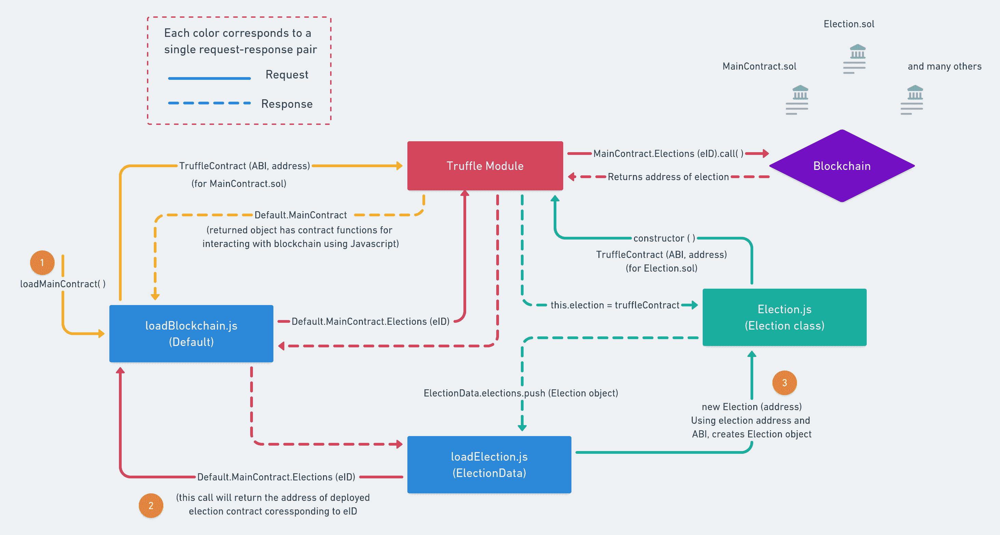
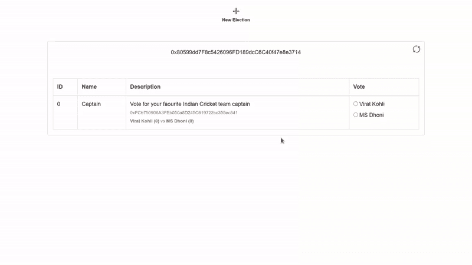

# 介绍

> 原文：<https://github.com/figment-networks/learn-tutorials/blob/master/avalanche/making-advanced-e-voting-dapp-avalanche-fuji-using-trufle.md>

在上一期关于在 Avalanche Fuji testnet 上制作电子投票 dApp 的教程中，我们学习了如何使用 Trufflesuite 在 Avalanche 的 Fuji C 链上部署智能合约。除此之外，我们还编写了客户端应用程序，以便轻松地与智能合约进行交互。

在本教程中，我们将构建一个更高级的电子投票 dApp，其中我们将与预先部署的智能合约进行交互，部署我们自己的智能合约，并使用它们的合约地址与它们进行交互。为了开发这个 dApp，我们将继续使用 Trufflesuite 框架。

供您参考， [Trufflesuite](https://www.trufflesuite.com) 是一个在兼容 EVM 的区块链上启动分散式应用程序(dApps)的工具包。使用 Truffle，您可以编写和编译智能合同，运行迁移以部署合同，并与已部署的合同进行交互。本教程演示了 Truffle 如何与 Avalanche 的 C 链一起使用，这是 EVM(以太坊虚拟机)的一个实例。

# 先决条件

本教程假设你熟悉 [Avalanche 的架构](https://docs.avax.network/learn/platform-overview)。此外，你已经按照教程[在雪崩富士测试网](https://learn.figment.io/tutorials/making-evoting-dapp-on-avalanche-c-chain-using-truffle)上进行电子投票 dApp。

# 要求

*   [NodeJS](https://nodejs.org/en) v8.9.4 或更高版本。
*   块菌，可以用`npm install -g truffle`安装
*   添加到浏览器的 Metamask 扩展，可以从 [metamask.io](https://metamask.io/download.html) 安装。
*   你需要有一个 [DataHub](https://datahub.figment.io/sign_up?service=avalanche) 账户和一个 Avalanche API 密匙。
*   `express`、`dotenv`和`@truffle/hdwallet-provider`(安装说明如下)。

# 项目设置

打开一个新的终端，这样我们就可以创建一个`advanced-evoting`目录并安装软件包依赖项。

首先，导航到您打算在其中创建您的`advanced-evoting`工作目录的目录:

```
cd /path/to/directory 
```

创建并输入一个名为`advanced-evoting`的新目录:

```
mkdir advanced-evoting
cd advanced-evoting 
```

用`npm`初始化文件夹:

```
npm init 
```

该命令将提示用户输入有关项目的详细信息，如`name`、`description`、`author`等。您可以按照指示输入详细信息并按 enter 键，或者接受默认值&按 enter 键继续。

现在使用`npm`来安装其他依赖项

```
npm install express dotenv @truffle/hdwallet-provider --save 
```

最后，创建一个样板松露项目:

```
truffle init 
```

这将设置我们的初始项目结构。智能合同将存储在`contracts`文件夹中，用于将智能合同迁移到网络的部署功能将存储在`migrations`文件夹中。和`build/contracts`文件夹将包含有关部署的合同，ABI 等信息。

**更新 truffle-config.js**

运行`truffle init`时创建的文件之一是`truffle-config.js`。用以下代码替换该文件的现有内容:

```
require('dotenv').config();
const HDWalletProvider = require("@truffle/hdwallet-provider");

//Account credentials from which our contract will be deployed
const mnemonic = process.env.MNEMONIC;

//API key of your Datahub account for Avalanche Fuji test network
const APIKEY = process.env.APIKEY;

module.exports = {
  networks: {
    development: {
      host: "127.0.0.1",
      port: 7545,
      network_id: "*"
    },
    fuji: {
      provider: function() {
        return new HDWalletProvider({mnemonic, providerOrUrl: `https://avalanche--fuji--rpc.datahub.figment.io/apikey/${APIKEY}/ext/bc/C/rpc`, chainId: "0xa869"})
      },
      network_id: "*",
      gas: 3000000,
      gasPrice: 470000000000,
      skipDryRun: true
    }
  },
  solc: {
    optimizer: {
      enabled: true,
      runs: 200
    }
  }
}
```

注意，我们将`gasPrice`和`gas`设置为雪崩 C 链的适当值。

**补充。环境文件**

*   首先，我们需要在 Avalanche network 上创建一个帐户。请访问 [Avalanche Wallet](https://wallet.avax.network/) 创建您的帐户，并将您的助记符保存在。环境文件。
*   现在，将您的数据中心的 Avalanche Fuji testnet API 密钥复制到。env 文件如下所示。
*   切勿共享或提交您的`.env`文件。它包含您的凭证，如`mnemonics`和`API`密钥。因此，建议将`.env`添加到您的`.gitignore`文件中。

```
MNEMONIC="<avalanche-wallet-mnemonic>"
APIKEY=<your-api-key> 
```

# 添加 Election.sol

> **参考文献**:本教程有少部分参考了 [Dapp 大学](https://github.com/dappuniversity/election)的内容。

在`contracts`目录中添加一个名为`Election.sol`的新文件，并添加以下代码块:

```
pragma solidity >=0.4.21 <0.6.0;
pragma experimental ABIEncoderV2;

contract Election {
  //Election details will be stored in these variables
  string public name;
  string public description;

  //Structure of candidate standing in the election
  struct Candidate {
    uint id;
    string name;
    uint voteCount;
  }

  //Storing candidates in a map
  mapping(uint => Candidate) public candidates;

  //Storing address of those voters who already voted
  mapping(address => bool) public voters;

  //Number of candidates in standing in the election
  uint public candidatesCount = 0;

  //Setting of variables and data, during the creation of election contract
  constructor (string[] memory _nda, string[] memory _candidates) public {
    require(_candidates.length > 0, "There should be atleast 1 candidate.");
    name = _nda[0];
    description = _nda[1];
    for(uint i = 0; i < _candidates.length; i++) {
      addCandidate(_candidates[i]);
    }
  }

  //Private function to add a candidate
  function addCandidate (string memory _name) private {
    candidates[candidatesCount] = Candidate(candidatesCount, _name, 0);
    candidatesCount ++;
  }

  //Public vote function for voting a candidate
  function vote (uint _candidate) public {
    require(!voters[msg.sender], "Voter has already Voted!");
    require(_candidate < candidatesCount && _candidate >= 0, "Invalid candidate to Vote!");
    voters[msg.sender] = true;
    candidates[_candidate].voteCount++;
  }
}
```

是一个 solidity 智能合同，它让我们可以查看候选人的姓名、描述，并为他们投票。在这个 DApp 中，我们将使用它们的`address`和`ABI`来访问这些运行时部署的选举智能合同。每当我们创建一个新的选举时，这个智能合同将被部署到区块链。

# 了解智能合同

Solidity 智能合约由关键字`contract`定义，这与函数签名非常相似。因此，这个智能契约的代码就是`contract Election { }`内的所有内容。

*   **关于选举**的基本细节——这段代码将存储每个`Election`合同的基本细节。详细包括`name`和`description`。

```
  //Election details will be stored in these variables
  string public name;
  string public description;
```

*   **存储候选细节** -候选细节将被存储在无符号整数到`Candidate`结构之间的映射中。`Candidate`结构将由像`id`、`name`(候选人的名字)和`voteCount`(他们被投票的次数)这样的数据组成。

```
  //Structure of candidate standing in the election
  struct Candidate {
    uint id;
    string name;
    uint voteCount;
  }

  //Storing candidates in a map
  mapping(uint => Candidate) public candidates;
```

*   **存储已经投票的投票者的详细信息和候选人的数量** - `voters`是投票者的地址和一个布尔值之间的映射。在 Solidity 中，默认的布尔值是`false`，所以如果`voters(address)`的返回值是`false`我们就可以理解为选民在这次选举中第一次投票，反之亦然`true`。

```
  //Storing address of those voters who already voted
  mapping(address => bool) public voters;

  //Number of candidates in standing in the election
  uint public candidatesCount = 0;
```

*   **构造函数调用并将候选人添加到选举中**——当智能合同部署到网络上时，首先要调用的是`constructor()`函数。无论我们想在智能契约中初始化什么，我们都在`constructor()`函数中完成。像这里一样，我们将向选举添加名称、描述和候选人。在这里，`addCandidate()`是一个私有函数，所以，它不能被公开调用。这个函数在第一个参数中将`name`和`description`作为一个名为`_nda`的数组，在第二个参数中将候选人的名字作为一个数组。

```
  //Setting of variables and data, during the creation of election contract
  constructor (string[] memory _nda, string[] memory _candidates) public {
    require(_candidates.length > 0, "There should be atleast 1 candidate.");
    name = _nda[0];
    description = _nda[1];
    for(uint i = 0; i < _candidates.length; i++) {
      addCandidate(_candidates[i]);
    }
  }

  //Private function to add a candidate
  function addCandidate (string memory _name) private {
    candidates[candidatesCount] = Candidate(candidatesCount, _name, 0);
    candidatesCount ++;
  }
```

*   **选举候选人**——我们做了一个`vote()`函数。它将`candidateId`作为一个参数，并增加各自候选人的投票。它需要两件事，即。投票人不应该在特定的选举中通过检查`voters`映射和`candidateId`应该是一个有效的布尔来投票，即`0 <= candidateId < candiatesCount`。

```
  //Public vote function for voting a candidate
  function vote (uint _candidate) public {
    require(!voters[msg.sender], "Voter has already Voted!");
    require(_candidate < candidatesCount && _candidate >= 0, "Invalid candidate to Vote!");
    voters[msg.sender] = true;
    candidates[_candidate].voteCount++;
  }
```

# 添加主合同. sol

在`contracts`目录中添加一个名为`MainContract.sol`的新文件，并添加以下代码块:

```
pragma solidity >=0.4.21 <0.6.0;
pragma experimental ABIEncoderV2;

import './Election.sol';

contract MainContract {
    uint public electionId = 0;
    mapping (uint => address) public Elections;

    function createElection (string[] memory _nda, string[] memory _candidates) public {
        Election election = new Election(_nda, _candidates);
        Elections[electionId] = address(election);
        electionId++;
    }
}
```

`MainContract.sol`是我们电子投票 DApp 的主要入口。它将维护已部署的选举合同的数量及其在网络上的地址，还将帮助部署这些合同。我们还导入了`Election.sol`合同，以便在`MainContract`中使用。

*   这里的`electionId`用于为用户创建的每个选举分配 ID，并在创建下一个选举时递增。另外，`Elections`是`electionId`和部署的选举契约的地址之间的公共映射。

```
    uint public electionId = 0;
    mapping (uint => address) public Elections;
```

*   我们创建了一个`createElection()`函数，它将用于部署我们的`Election`智能合同。这个函数在第一个参数中将`name`和`description`作为一个名为`_nda`的数组，在第二个参数中将候选人的名字作为一个数组。

```
    function createElection (string[] memory _nda, string[] memory _candidates) public {
        Election election = new Election(_nda, _candidates);
        Elections[electionId] = address(election);
        electionId++;
    }
```

在这里您可以看到，新的`Election`合同使用`new`关键字部署在网络上。和地址存储在`Elections`映射中。一旦选举契约部署成功，`electionId`就会递增。

# 添加新迁移

在`migrations`目录中创建一个名为`2_deploy_contracts.js`的新文件，并添加以下代码块。这处理将`MainContract`和`Election`智能合同部署到区块链。

```
const MainContract = artifacts.require("MainContract");
const Election = artifacts.require("Election");

module.exports = function(deployer) {
    deployer.deploy(MainContract);
};
```

在这里，您可以看到，我们只部署了`MainContract`智能契约，因为`Election`契约将由`MainContract`在运行时使用函数`createElection()`自行部署。

# 用块菌编合同

任何时候对`.sol`文件进行修改，都需要运行`truffle compile`。

```
truffle compile 
```

您应该看到:

```
Compiling your contracts...
===========================
> Compiling ./contracts/Election.sol
> Compiling ./contracts/MainContract.sol
> Compiling ./contracts/Migrations.sol

> Artifacts written to /home/guest/blockchain/advanced-evoting/build/contracts
> Compiled successfully using:
   - solc: 0.5.16+commit.9c3226ce.Emscripten.clang 
```

> 注意:安装`truffle`时，如果`pify`模块不知何故没有自动安装，可能会出现错误`Error: Cannot find module 'pify'`。所以，这个问题可以通过单独安装`pify`，使用`npm install pify --save`命令来解决

编译智能合同将在`build/contracts`目录中创建`.json`文件。它存储 ABI 和其他必要的元数据。ABI 指的是*应用程序二进制接口*，它是用于与来自区块链外部的智能合同以及合同到合同交互的标准。请参考关于 ABIs 的[可靠性文档以了解更多信息。](https://docs.soliditylang.org/en/latest/abi-spec.html)

# 为帐户提供资金，并在 C 链上运行迁移

将智能合约部署到 C 链时，将需要一些部署成本。正如您在`truffle-config.js`中看到的，HDWallet 提供商将帮助我们在 Fuji C-chain 上进行部署，部署成本将由助记符存储在`.env`文件中的帐户管理。因此，我们需要资金帐户。

**为您的账户注资**

使用水龙头链接[https://水龙头. avax-test.network/](https://faucet.avax-test.network/) 向您的帐户注入资金，并在输入字段中粘贴您的富士 C 链地址。您需要至少向客户发送`135422040` nAVAX，以支付合同部署的成本。这里的 nAVAX 指的是 nano AVAX，它是 AVAX 令牌的十亿分之一。部署所需的最低 AVAX 将因合同而异，具体取决于我们的合同所使用的变量和数据结构。尽管通过水龙头融资会给你足够的资金在网络上运行多个部署和交易。

# 运行迁移

现在，运行迁移和部署`MainContract`的一切都已就绪:

```
truffle migrate --network fuji 
```

这可能需要一段时间，取决于您的互联网连接或网络流量。

注意——出于开发目的，我们可以通过使用以下命令运行 Ganache (Truffle 的本地区块链工具)在本地网络上部署我们的合同:

```
truffle migrate --network development 
```

成功执行该命令后，您应该会看到:

```
Starting migrations...
======================
> Network name:    'fuji'
> Network id:      1
> Block gas limit: 8000000 (0x7a1200)

1_initial_migration.js
======================

   Deploying 'Migrations'
   ----------------------
   > transaction hash:    0x094a9c0f12ff3158bcb40e266859cb4f34a274ea492707f673b93790af40e9e9
   > Blocks: 0            Seconds: 0
   > contract address:    0x0b1f00d0Af6d5c864f86E6b96216e0a2Da111055
   > block number:        40
   > block timestamp:     1620393171
   > account:             0x80599dd7F8c5426096FD189dcC6C40f47e8e3714
   > balance:             39.71499696
   > gas used:            173118 (0x2a43e)
   > gas price:           20 gwei
   > value sent:          0 ETH
   > total cost:          0.00346236 ETH

   > Saving migration to chain.
   > Saving artifacts
   -------------------------------------
   > Total cost:          0.00346236 ETH

2_deploy_contracts.js
=====================

   Deploying 'MainContract'
   ------------------------
   > transaction hash:    0xbeb13fc6bbee250eea9151faf02bfe247ec497294acc84c9b8319ed609ced086
   > Blocks: 0            Seconds: 0
   > contract address:    0xf30D372A6911CCF6BBa1e84c3CEd51cC0F3D7769
   > block number:        42
   > block timestamp:     1620393172
   > account:             0x80599dd7F8c5426096FD189dcC6C40f47e8e3714
   > balance:             39.69235442
   > gas used:            1090212 (0x10a2a4)
   > gas price:           20 gwei
   > value sent:          0 ETH
   > total cost:          0.02180424 ETH

   > Saving migration to chain.
   > Saving artifacts
   -------------------------------------
   > Total cost:          0.02180424 ETH

Summary
=======
> Total deployments:   2
> Final cost:          0.0252666 ETH 
```

如果您没有在 C 链上创建帐户，您将看到以下错误:

```
Error: Expected parameter 'from' not passed to function. 
```

如果您没有为该帐户提供资金，您会看到以下错误:

```
Error:  *** Deployment Failed ***

"Migrations" could not deploy due to insufficient funds
   * Account:  0x090172CD36e9f4906Af17B2C36D662E69f162282
   * Balance:  0 wei
   * Message:  sender doesn't have enough funds to send tx. The upfront cost is: 1410000000000000000 and the sender's account only has: 0
   * Try:
      + Using an adequately funded account 
```

已部署合同的信息和 ABI 作为`Election.json`出现在`/build/contract`目录中。合同地址、网络信息等信息。可以在这里找到。

# 构建与区块链交互的用户界面

*   创建一个`src`目录，我们将保存所有与区块链交互的文件。
*   使用`cd src`进入`src`目录
*   制作一个新文件`server.js`。将以下代码放入文件中。

```
var express = require('express');
var app = express();

//JSON file for deployed contract and network information
const mainContractJSON = require('../build/contracts/MainContract.json')
const electionJSON = require('../build/contracts/Election.json')

require("dotenv").config();

app.use(express.static("./"));

app.get('/', (req, res) => {
    res.sendFile('index.html');
});

//Sending MainContract JSON file for its interaction using Truffle
app.get('/mainContractJSON', (req, res) => {
    res.send(mainContractJSON);
});

//Sending ABI object directly for Election contract, since only ABI will be used
app.get('/electionJSON', (req, res) => {
    res.send(electionJSON.abi);
});

app.listen(process.env.PORT || 3000, () => {
    console.log('Server started at 3000');
});
```

*   现在创建一个新文件`index.html`，并将下面的代码放入文件中。一切都被很好地注释，为了你的理解:

```
<!DOCTYPE html>

<html lang="en">
  <head>
    <title>Election</title>
  </head>

  <link href="https://stackpath.bootstrapcdn.com/bootstrap/4.4.1/css/bootstrap.min.css" rel="stylesheet">
  <link href="/index.css" rel="stylesheet">

  <body>
    <!-- This component will be used to create a new election -->
    <center id="newElectionButton">
      <div onclick="toggleNewElectionForm()">
        <br>

        <font size = 2>
          <b>New Election</b>
        </font>
      </div>
    </center>

    <!-- This component contains form to create election -->
    <div id="newElectionForm" class="card">
      <!-- Cross image to hide form -->
      <span>
        
      </span>

      <!-- This form will take details of new election and submit a transaction to the network -->
      <form id="formData" onsubmit="submitNewElection(); return false;">
        <font size = 2><b>Election title</b></font><br>
        <input name="details[]" placeholder="Name your election" required><br><br>

        <font size = 2><b>Election description</b></font><br>
        <input name="details[]" placeholder="Describe something about this election" required style="width: 80%;"><br><br>

        <div>
          <span>
            <font size = 2><b>1st Candidate name</b></font><br>
            <input name="candidates[]" placeholder="Candidate name" required>
          </span>

          <span>
            <font size = 2><b>2nd Candidate name</b></font><br>
            <input name="candidates[]" placeholder="Candidate name" required>
          </span>
        </div>

        <br><br>

        <input type="submit" class="btn btn-primary">
      </form>
    </div>

    <!-- List of elections on the network will appear here -->
    <div id="electionContainer" class="card">
      <!-- Account address will be rendered here -->
      <center id="account"></center>

      <!-- Loading will appear until blockchain data is loaded -->
      <center id='loader'>
        <span class="spinner-border text-primary"></span>
      </center>

      <!-- Button to synchronize the list of elections on the network -->
      <span>
        
      </span>

      <br><br>

      <!-- Election data will appear here -->
      <div id="elections" class="container">
        <table class="table table-bordered">
          <tr>
            <td><b>ID</b></td>
            <td><b>Name</b></td>
            <td><b>Description</b></td>
            <td><b>Vote</b></td>
          </tr>

          <tbody id="electionDetails">

          </tbody>
        </table>
      </div>
    </div>
  </body>

  <!--jQuery CDN-->
  <script src="https://ajax.googleapis.com/ajax/libs/jquery/1.12.4/jquery.min.js"></script>

  <!--web3 module for interacting with blockchain-->
  <script language="javascript" type="text/javascript" src="https://cdn.jsdelivr.net/gh/ethereum/web3.js@1.0.0-beta.34/dist/web3.js"></script>

  <!--Truffle Contract module for interacting with smart contract in javascript-->
  <script src="https://rajranjan0608.github.io/ethereum-electionVoting/src/contract.js"></script>

  <!--Our custom javascript code for interaction-->
  <script type="module" language="javascript" src="/loadBlockchain.js"></script>
  <script type="module" language="javascript" src="/loadElections.js"></script>
  <script type="text/javascript" language="javascript" src="/index.js"></script>
</html> 
```

*   为了给我们的基本 HTML 页面添加一些设计，我们还需要一个`index.css`样式表文件。用以下代码创建一个名为`index.css`的文件:

```
#newElectionButton {
    margin-top: 20px;
}

#newElectionButton > div {
    width: 100px;
    cursor: pointer;
}

img {
    width: 25px;
    height: 25px;
}

#formData {
    margin: 20px 20px;
}

#formData > input:nth-child(2) {
    width: 100%;
}

#formData > div {
    margin-bottom: 30px;
}

#formData > div > span {
    float: left;
}

#formData > div > span:nth-child(2) {
    margin-left: 30px;
}

#newElectionForm {
    width: 40%;
    margin: 50px auto;
    display: none;
}

#newElectionForm > span {
    position: absolute;
    top: 10px;
    right: 10px;
}

#newElectionForm > span > img {
    cursor: pointer;
}

#account {
    margin-top: 20px
}

#loader {
    margin-top: -8px;
}

#elections {
    margin-top: 15px;
}

#electionContainer {
    width: 80%;
    margin: 50px auto
}

#electionContainer > span {
    position: absolute; 
    top: 10px; 
    right: 10px;
}

#electionContainer > span > img {
    cursor: pointer;
}
```

*   为了让这个 dApp 更加结构化，我们将在一个名为`index.js`的单独文件中制作两个小的 javascript 函数。这些功能是用于显示和隐藏新选举表单的`toggleNewElectionForm()`和用于创建新选举的`submitNewElection()`。因此，创建一个名为`index.js`的文件，并在其中添加以下代码:

```
var isFormVisible = false;

function toggleNewElectionForm() {
  if(isFormVisible) {
    $('#newElectionButton').show();
    $('#newElectionForm').hide();
    isFormVisible = false;
  } else {
    $('#newElectionButton').hide();
    $('#newElectionForm').show();
    isFormVisible = true;
  }
}

async function submitNewElection() {
  var details = document.getElementsByName('details[]');
  var candidates = document.getElementsByName('candidates[]');
  toggleNewElectionForm();
  try {
    await ElectionData.createElection([details[0].value, details[1].value], [candidates[0].value, candidates[1].value]);
    document.getElementById('formData').reset();
  } catch(e) {
    document.getElementById('formData').reset();        
  }
}
```

*   我们将使用它们的 ABI 与智能合约进行交互。`MainContract`和`Election`的 ABI 将分别在`/mainContractJSON`和`/electionJSON`提供。
*   出于互动目的，将有 3 个模块:`loadBlockchain.js`、`Election.js`和`loadElection.js`。请参考下图，了解每个文件的用法。

[](https://camo.githubusercontent.com/c6cacb21e854f2f5bc28a55a91cbe6a38854bf8310cd2cb5fbb4a7c174924e59/68747470733a2f2f692e696d6775722e636f6d2f6875795a4f59422e706e67)

*   loadBlockchain.js(默认)——这将加载`web3`、`account details`和`MainContract`的 javascript 等价物。现在在`src`目录下创建一个`loadBlockchain.js`文件，并添加以下代码:

    ```
    import {ElectionData} from './loadElections.js';

    // Default would contain all the necessary functions for interaction
    export var Default = {
      loading: false,
      contracts: {},

      // Main function to be called first
      load: async () => {
        await Default.loadWeb3();
        await Default.loadAccount(); 
        await Default.loadMainContract();
        await ElectionData.get();
        await Default.render();
      },

      // Loading web3 on the browser
      loadWeb3: async () => {
        if(typeof web3 !== 'undefined') {
          web3 = new Web3(web3.currentProvider);
          Default.web3Provider = web3.currentProvider;
        } else {
          window.alert("Please connect to Metamask");
        }

        if(window.ethereum) {
          window.web3 = new Web3(ethereum);
          try {
            await ethereum.enable();
          }catch (error) {
            console.log(error);
          }
        }else if(window.web3) {
          Default.web3Provider = web3.currentProvider;
          window.web3 = new Web3(web3.currentProvider);
        }else{
          console.log('Non-Ethereum Browser detected');
        }
      },

      // This function would load account from Metamask to our dDefault
      loadAccount: async() => {
        await web3.eth.getAccounts().then((result)=>{
          Default.account = result[0];
        });
      },

      // This function would help in loading contract to Default.MainContract
      loadMainContract: async () => {
        // Static pre-deployed contracts should be handled like this
        const MainContract = await $.getJSON('/mainContractJSON');
        Default.contracts.MainContract = TruffleContract(MainContract);
        Default.contracts.MainContract.setProvider(Default.web3Provider);
        Default.MainContract = await Default.contracts.MainContract.deployed();
      },

      // This function will be called after the browser is ready for blockchain interaction
      render: async() => {
        if(Default.loading) {
          return;
        }
        Default.setLoading(true);
        $('#account').html(Default.account);
        Default.setLoading(false);
      },

      // This will facilitate loading feature according to the blockchain data
      setLoading: (boolean) => {
        Default.loading = boolean;
        const loader = $('#loader');
        const content = $('#content');
        if(boolean) {
          loader.show();
          content.hide();
        }else {
          loader.hide();
          content.show();
        }
      }
    };

    // Function to initiate the blockchain interaction
    $(() => {
      window.addEventListener('load', ()=>{
          Default.load();
      });
    });

    window.Default = Default;
    ```

*   Election.js (Election) -这将是一个`Election`类，用于维护每个选举的独立状态(对应于 electionId)。我们将通过创建一个`Election`类的对象与每个选举进行交互。它的`constructor()`函数将加载`Election`契约的 JavaScript 等价物。现在在`src`目录下创建一个`Election.js`文件，并添加以下代码:

    ```
    import {Default} from './loadBlockchain.js';
    import {ElectionData} from './loadElections.js';

    // Election class for maintaining separate states for each election contract
    export class Election {
    constructor(address) {
      this.address = address;
    }

    init = async () => {
      await this.loadElectionContract();
    }

    // Loading election contract's javascript equivalent in the this.election variable
    loadElectionContract = async () => {
      // Dynamic contracts whose address is not known should be handled like this
      var electionABI = await $.getJSON('/electionJSON');
      this.election = await new web3.eth.Contract(electionABI, this.address);
      await this.election.setProvider(web3.currentProvider);
    }

    // Get details of the election
    getDetails = async () => {
      var details = {};

      // Fetching details from blockchain and storing it in details object
      details.candidates      = [];
      details.address         = this.address;
      details.candidatesCount = await this.election.methods.candidatesCount().call()
      details.name            = await this.election.methods.name().call();
      details.description     = await this.election.methods.description().call();
      details.hasVoted        = await this.election.methods.voters(Default.account).call();

      // Fetching candidate details along with their vote count
      for(var i = 0; i < details.candidatesCount; i++) {
          var candidate = await this.election.methods.candidates(i).call()

          details.candidates.push({
              name: candidate.name,
              voteCount: candidate.voteCount
          });
      }

      return details;
    }

    // This function will call vote() on Fuji testnet
    castVote = async (candidateId) => {
      await this.election.methods.vote(candidateId).send({ from: Default.account });
      await ElectionData.get();
    }
    }
    ```

*   `loadElection.js`(election data)——这将为每个可用的已部署选举创建一个`Election`对象，并在 UI 上加载选举数据。现在在`src`目录下创建`loadBlockchain.js`文件，并添加以下代码:

    ```
    import {Default} from './loadBlockchain.js';
    import {Election} from './Election.js';

    export var ElectionData = {
      // get() is a loader function, to run loadElections() function.
      get: async () => {
          await ElectionData.loadElections();
          await ElectionData.loadElectionDetails();
      },

      // Loading deployed election contracts in Default.election array
      loadElections: async () => {
          ElectionData.elections = [];
          ElectionData.electionCount = await Default.MainContract.electionId();
          for(var i = 0; i < ElectionData.electionCount; i++) {
              var electionAddress = await Default.MainContract.Elections(i);
              var election = await new Election(electionAddress);
              await election.init();
              ElectionData.elections.push(election);
          }

      },

      // This function will update the page with election details
      loadElectionDetails: async () => {
          $('#electionDetails').html("");
          for(var i = 0; i < ElectionData.electionCount; i++) {
              var details = await ElectionData.elections[i].getDetails();
              var votingForm;
              // Showing voting forms to only non-voted elections
              if(details.hasVoted) {
                  votingForm = `<td>
     <font size = 2 color = 'green'><b>Voted</b></font>
     </td>`
              } else {
                  votingForm = `<td>
     <span>
     <input type='radio' name=${details.address} id="${details.address}0" onclick="ElectionData.elections[${i}].castVote(0)"> 
     <label for="${details.address}0"> ${details.candidates[0].name}</label>
     </span> <br>
     <span>
     <input type='radio' name=${details.address} id="${details.address}1" onclick="ElectionData.elections[${i}].castVote(1)"> 
     <label for="${details.address}1"> ${details.candidates[1].name}</label>
     </span>
     </td>`
              }
              var electionComponent = `<tr>
     <td>${i}</td>
     <td>${details.name}</td>
     <td>
     ${details.description}<br>
     <font size = 2 class='text-muted'>
     ${details.address}<br>
     <b>${details.candidates[0].name} (${details.candidates[0].voteCount})</b> vs
     <b>${details.candidates[1].name} (${details.candidates[1].voteCount})</b>
     </font>
     </td>
     ${votingForm}
     </tr>`
              $('#electionDetails').append(electionComponent);
          }
      },

      // Function to create (deploy) election on the network
      createElection: async (details, candidates) => {
          await Default.MainContract.createElection(details, candidates, {from: Default.account});
          ElectionData.get();
      }
    }  

    window.ElectionData = ElectionData;
    ```

现在运行`src`目录下的命令`node server.js`来启动服务器！

*   访问 [http://localhost:3000](http://localhost:3000) 与 dApp 互动。
*   不要忘了用`Fuji` testnet 设置 Metamask，并且用 Fuji C-Chain 测试令牌为帐户提供资金以便投票。请参考本教程中关于[将数据中枢连接到元掩码](https://learn.figment.io/tutorials/connect-datahub-to-metamask)的内容。您可以在 Metamask 钱包中换一个不同的地址，并为其提供资金，以便再次投票。



# 结论

恭喜你！您已经成功构建了一个完整的 dApp，并使用 Trufflesuite 在 Fuji testnet 上部署了智能合约。除此之外，您还构建了与网络交互的客户端应用程序。

# 后续步骤

我们在本教程中构建的 dApp 是一个电子投票应用程序，用于进行新的选举，给他们标题和描述&分别投票。

为了进一步学习，我们建议您尝试并添加一些更有趣的功能，如选举的开始和结束日期，选举结束后宣布获胜者或您能想到的任何其他功能！

# 关于作者

本教程由 [Raj Ranjan](https://www.linkedin.com/in/iamrajranjan) 创作。你可以在 [GitHub](https://github.com/rajranjan0608) 上与作者取得联系

如果您在学习本教程时有任何困难，或者只是想与我们讨论雪崩技术，您可以今天就 [**加入我们的社区**](https://discord.gg/fszyM7K) ！

# 参考

*   [在 Avalanche Fuji testnet 上制作电子投票 dApp](https://learn.figment.io/tutorials/making-evoting-dapp-on-avalanche-c-chain-using-truffle)