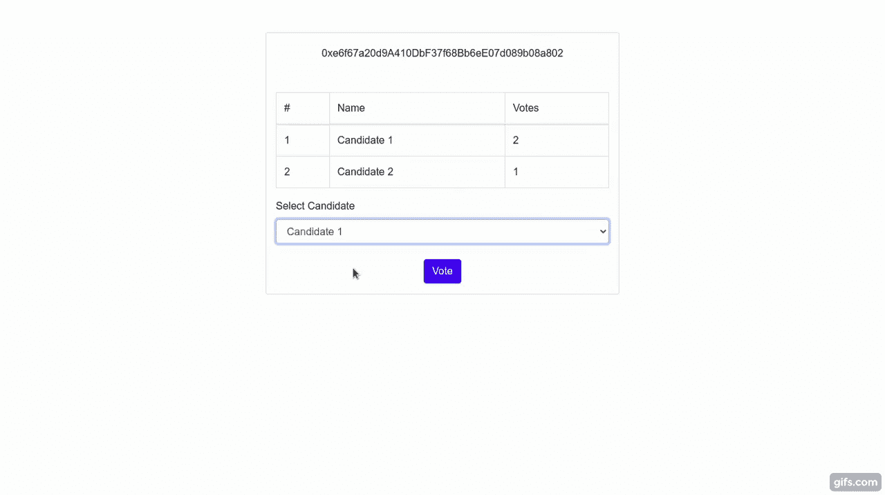

# 介绍

> 原文:[https://github . com/fig ment-networks/learn-tutorials/blob/master/avalanche/making-evoting-dapp-on-avalanche-c-chain-using-truffle . MD](https://github.com/figment-networks/learn-tutorials/blob/master/avalanche/making-evoting-dapp-on-avalanche-c-chain-using-truffle.md)

今天我们将学习如何在 Avalanche 的富士网络上从头开始编写一个分散式应用程序。这将是一个简单的应用程序，其中我们将举行候选人之间的选举。用户可以为他们选择的候选人投票。因此，为了使用浏览器方便高效地投票，我们还需要一个客户端应用程序来与区块链交互。为了开发这个项目，我们将使用 [Trufflesuite](https://www.trufflesuite.com) ，这是一个在兼容 [EVM](https://en.wikipedia.org/wiki/Ethereum#Virtual_machine) 的区块链上启动分散式应用(dApps)的工具包。使用 Truffle，您可以编写和编译智能合同，构建工件，运行迁移，并与部署的合同进行交互。本教程说明了如何松露可以用于雪崩的 C 链，这是一个 EVM 的实例。

# 先决条件

您将需要一个 [DataHub](https://datahub.figment.io/sign_up?service=avalanche) 帐户和一个用于 Avalanche 服务的 API 密钥。本教程假设你熟悉[雪崩的架构](https://docs.avax.network/learn/platform-overview)。

# 要求

*   [NodeJS](https://nodejs.org/en) v8.9.4 或更高版本。
*   块菌，可以用`npm install -g truffle`安装
*   添加到浏览器的元掩码扩展，你可以从[这里](https://metamask.io/download.html)添加
*   Express.js、dotenv 和@truffle/hdwallet-provider(安装说明如下)
*   您还需要通过 X 链和 C 链之间的[转移 AVAX 教程执行跨链交换，以将资金转移到您在富士测试网上的 C 链地址。](https://docs.avax.network/build/tutorials/platform/transfer-avax-between-x-chain-and-c-chain)

# 项目设置

打开一个新的终端选项卡，这样我们就可以创建一个`evoting`目录并安装更多的依赖项。

首先，导航到您打算在其中创建您的`evoting`工作目录的目录:

```
cd /path/to/directory 
```

创建并输入一个名为`evoting`的新目录:

```
mkdir evoting
cd evoting 
```

使用`npm`初始化你的工作目录，让你的项目更有条理。

```
npm init 
```

该命令将提示用户输入有关项目的详细信息，如`name`、`description`、`author`等。您可以按照指示输入详细信息并按 enter 键，或者直接按 enter 键前进(将采用默认值)。您可以使用命令`npm init -y`，一次跳过所有提示。

使用`npm`安装其他依赖项

```
npm install express dotenv @truffle/hdwallet-provider --save 
```

然后创建一个样板松露项目:

```
truffle init 
```

这将设置我们的初始项目结构。智能合同将存储在`contracts`文件夹中，用于将智能合同迁移到网络的部署功能将存储在`migrations`文件夹中。和`build/contracts`文件夹将包含有关部署的合同，ABI 等信息。

**更新 truffle-config.js**

运行`truffle init`时创建的文件之一是`truffle-config.js`。将其全部替换为以下内容。

```
require('dotenv').config();
const HDWalletProvider = require("@truffle/hdwallet-provider");

//Account credentials from which our contract will be deployed
const mnemonic = process.env.MNEMONIC;

//API key of your Datahub account for Avalanche Fuji test network
const APIKEY = process.env.APIKEY;

module.exports = {
  networks: {
    fuji: {
      provider: function() {
            return new HDWalletProvider({mnemonic, providerOrUrl: `https://avalanche--fuji--rpc.datahub.figment.io/apikey/${APIKEY}/ext/bc/C/rpc`, chainId: "0xa869"})
      },
      network_id: "*",
      gas: 3000000,
      gasPrice: 470000000000,
      skipDryRun: true
    }
  },
  solc: {
    optimizer: {
      enabled: true,
      runs: 200
    }
  }
}
```

注意，我们将`gasPrice`和`gas`设置为雪崩 C 链的适当值。

**补充。环境文件**

*   首先，我们需要在 Avalanche network 上创建一个帐户。请访问 [Avalanche Wallet](https://wallet.avax.network/) 创建您的帐户，并将您的助记符保存在。环境文件。
*   现在，将您的数据中心的 Avalanche Fuji testnet API 密钥复制到。env 文件如下所示。
*   切勿共享或提交您的`.env`文件！它可能包含敏感信息，如凭据和 API 密钥。因此，建议总是将`.env`添加到您的`.gitignore`文件中。

```
MNEMONIC="<avalanche-wallet-mnemonic>"
APIKEY=<your-api-key> 
```

# 添加 Election.sol

在`contracts`目录中添加一个名为`Election.sol`的新文件，并添加以下代码块:

```
pragma solidity >=0.4.21 <0.6.0;

contract Election {
  //Structure of candidate standing in the election
  struct Candidate {
    uint id;
    string name;
    uint voteCount;
  }

  //Storing candidates in a map
  mapping(uint => Candidate) public candidates;

  //Storing address of those voters who already voted
  mapping(address => bool) public voters;

  //Number of candidates in standing in the election
  uint public candidatesCount;

  //Adding 2 candidates during the deployment of contract
  constructor () public {
    addCandidate("Candidate 1");
    addCandidate("Candidate 2");
  }

  //Private function to add a candidate
  function addCandidate (string memory _name) private {
    candidatesCount ++;
    candidates[candidatesCount] = Candidate(candidatesCount, _name, 0);
  }

  //Public vote function for voting a candidate
  function vote (uint _candidate) public {
    require(!voters[msg.sender], "Voter has already Voted!");
    require(_candidate <= candidatesCount && _candidate >= 1, "Invalid candidate to Vote!");
    voters[msg.sender] = true;
    candidates[_candidate].voteCount++;
  }
}
```

是一个 solidity smart contract，它让我们可以看到参加选举的候选人并投票给他们。这是一个基本的选举合同，我们将推进到更复杂的智能合同，在其中我们甚至可以创建新的选举，添加新的候选人等。在本系列的下一篇教程中。

# 了解智能合同

*   **存储候选人**的结构——我们使用`struct`来存储候选人的详细信息，如`name`、`id`和`voteCount`。并进一步将每个候选者存储在候选者 id 和它们的结构之间的映射中。

```
  //Structure of candidate standing in the election
  struct Candidate {
    uint id;
    string name;
    uint voteCount;
  }

  //Storing candidates in a map
  mapping(uint => Candidate) public candidates;
```

*   选民详情 -在一次选举中，一名选民不应投票超过一次。因此，我们将选民的地址存储在选民的地址和一个表示他们是否投票的布尔值之间的映射中。

```
  //Storing address of those voters who already voted
  mapping(address => bool) public voters;
```

*   **添加候选人** -使用功能`addCandidate()`在选举(智能合同)中添加候选人。

```
  //Adding 2 candidates during the deployment of contract
  constructor () public {
    addCandidate("Candidate 1");
    addCandidate("Candidate 2");
  }

  //Private function to add a candidate
  function addCandidate (string memory _name) private {
    candidatesCount ++;
    candidates[candidatesCount] = Candidate(candidatesCount, _name, 0);
  }
```

*   **给候选人投票**——我们做了一个 vote()函数。它将 candidateId 作为参数，并增加相应候选人的投票。它需要两件事，即。通过检查`voters`映射中的`boolean`，`candidateId`应该是有效的，即`1 <= candidateId <= candidatesCount`，投票人不应该在特定的选举中投票。

```
  //Public vote function for voting a candidate
  function vote (uint _candidate) public {
    require(!voters[msg.sender], "Voter has already Voted!");
    require(_candidate <= candidatesCount && _candidate >= 1, "Invalid candidate to Vote!");
    voters[msg.sender] = true;
    candidates[_candidate].voteCount++;
  }
```

# 添加新迁移

在`migrations`目录中创建一个名为`2_deploy_contracts.js`的新文件，并添加以下代码块。它负责将`Election`智能合同部署到区块链。

```
const Election = artifacts.require("./Election.sol");

module.exports = function (deployer) {
  deployer.deploy(Election);
};
```

# 用块菌编合同

任何时候你对`Election.sol`做出改变，你都需要运行`truffle compile`。

```
truffle compile 
```

您应该看到:

```
Compiling your contracts...
===========================
> Compiling ./contracts/Migrations.sol
> Compiling ./contracts/Election.sol
> Artifacts written to /path/to/build/contracts
> Compiled successfully using:
   - solc: 0.5.16+commit.9c3226ce.Emscripten.clang 
```

> 注意:安装`truffle`时，如果`pify`模块不知何故没有自动安装，可能会出现错误`Error: Cannot find module 'pify'`。通过使用命令`npm install pify --save`手动安装`pify`来解决这个问题

# 为帐户提供资金，并在 C 链上运行迁移

将智能合约部署到 C 链时，将需要一些部署成本。正如您在`truffle-config.js`中看到的，HDWallet 提供商将帮助我们在 Fuji C-chain 上进行部署，部署成本将由账户管理，其助记符已存储在`.env`文件中。因此，我们需要资金帐户。

**为您的账户注资**

使用水龙头链接[https://水龙头. avax-test.network/](https://faucet.avax-test.network/) 向您的帐户注入资金，并在输入字段中粘贴您的富士 C 链地址。您需要至少向客户发送`135422040` nAVAX，以支付合同部署的成本。这里的`nAVAX`指的是 nano AVAX，是一个 AVAX 令牌的十亿分之一。部署所需的最低 AVAX 将因合同而异，具体取决于我们的合同所使用的变量和数据结构。虽然水龙头会给你足够的`AVAX`来部署和处理多次雪崩的富士网络。

# 运行迁移

现在，运行迁移和部署`Election`合同的一切都已就绪:

```
truffle migrate --network fuji 
```

这可能需要一段时间，取决于您的互联网连接或网络流量。

成功执行该命令后，您应该会看到:

```
Compiling your contracts...
===========================
> Everything is up to date, there is nothing to compile.

Migrations dry-run (simulation)
===============================
> Network name:    'development-fork'
> Network id:      1
> Block gas limit: 99804786 (0x5f2e672)

1_initial_migration.js
======================

   Deploying 'Migrations'
   ----------------------
   > block number:        4
   > block timestamp:     1607734632
   > account:             0x34Cb796d4D6A3e7F41c4465C65b9056Fe2D3B8fD
   > balance:             1000.91683679
   > gas used:            176943 (0x2b32f)
   > gas price:           470 gwei
   > value sent:          0 ETH
   > total cost:          0.08316321 ETH

   -------------------------------------
   > Total cost:          0.08316321 ETH

2_deploy_contracts.js
=====================

   Deploying 'Election'
   -------------------
   > block number:        6
   > block timestamp:     1607734633
   > account:             0x34Cb796d4D6A3e7F41c4465C65b9056Fe2D3B8fD
   > balance:             1000.8587791
   > gas used:            96189 (0x177bd)
   > gas price:           470 gwei
   > value sent:          0 ETH
   > total cost:          0.04520883 ETH

   -------------------------------------
   > Total cost:          0.04520883 ETH

Summary
=======
> Total deployments:   2
> Final cost:          0.13542204 ETH 
```

如果您没有在 C 链上创建帐户，您将看到以下错误:

```
Error: Expected parameter 'from' not passed to function. 
```

如果您没有为该帐户提供资金，您会看到以下错误:

```
Error:  *** Deployment Failed ***

"Migrations" could not deploy due to insufficient funds
   * Account:  0x090172CD36e9f4906Af17B2C36D662E69f162282
   * Balance:  0 wei
   * Message:  sender doesn't have enough funds to send tx. The upfront cost is: 1410000000000000000 and the sender's account only has: 0
   * Try:
      + Using an adequately funded account 
```

已部署合同的信息和 ABI 作为`Election.json`出现在`/build/contract`目录中。合同地址、网络信息等信息。可以在这里找到。

# 构建与区块链交互的用户界面

*   创建一个`src`目录，我们将保存所有与区块链交互的文件。
*   使用`cd src`进入`src`目录
*   制作一个新文件`server.js`。将以下代码放入文件中。

```
var express = require('express');
var app = express();

//JSON file for deployed contract and network information
const electionJSON = require('../build/contracts/Election.json')

require("dotenv").config();

app.use(express.static("./"));

app.get('/', (req,res) => {
    res.send('index.html');
});

app.get('/electionJSON', (req,res) => {
    res.send(electionJSON);
});

app.listen(process.env.PORT || 3000, () => {
    console.log('Server started at 3000');
});
```

*   现在创建新文件`index.html`，并在文件中添加以下代码:

```
<!DOCTYPE html>

<html lang="en">
  <head>
    <title>Election</title>
  </head>

  <link href="https://stackpath.bootstrapcdn.com/bootstrap/4.4.1/css/bootstrap.min.css" rel="stylesheet">

  <body>
    <div style="width: 40%; margin: 50px auto" class="card">
            <!-- Account address will be rendered here -->
            <center id="account" style="margin-top: 20px"></center>

            <!-- Loading will appear until blockchain data is loaded -->
            <center id='loader' style="margin:20px;">Loading...</center>

            <br><br>

            <!-- Blockchain data would appear here -->
            <div id="content" style="display:none" class="container" style="margin-top:30px;">
                <!-- Table for fetching election data of the candidates -->
                <table class="table table-bordered">
                    <tr>
                        <td>#</td>
                        <td>Name</td>
                        <td>Votes</td>
                    </tr>
                    <tbody id="candidateResults">

                    </tbody>
                </table>

                <!-- Form to submit vote to a candidate -->
                <form onSubmit="App.castVote(); return false;" style="display:none">
                    <div class="form-group">
                        <label>Select Candidate</label>
                        <center>
                            <select class="form-control" id="candidatesSelect">
                                <option>Select here...</option>
                            </select><br>
                            <input type="submit" class="btn btn-primary" value="Vote">
                        </center>
                    </div>
                </form>

                <!-- This would appear and form will be hidden if the address has already voted -->
                <div id="hasVoted" style="display:none; text-align: center">
                    <b>Thank you for voting !!!</b>
                </div>
            </div>
        </div>
  </body>

  <!--jQuery CDN-->
  <script src="https://ajax.googleapis.com/ajax/libs/jquery/1.12.4/jquery.min.js"></script>

  <!--web3 module for interacting with blockchain-->
  <script language="javascript" type="text/javascript" src="https://cdn.jsdelivr.net/gh/ethereum/web3.js@1.0.0-beta.34/dist/web3.js"></script>

  <!--Truffle Contract module for interacting with smart contract in javascript-->
  <script src="https://rajranjan0608.github.io/ethereum-electionVoting/src/contract.js"></script>

  <!--Our custom javascript code for interaction-->
  <script type="module" language="javascript" src="index.js"></script>
</html> 
```

*   现在创建一个新文件`index.js`，并将下面的代码放入文件中。代码被很好地注释，以便你理解。

```
// App would contain all the necessary functions for interaction
var App = {
  loading: false,
  contracts: {},

  // Main function to be called first
  load: async () => {
    await App.loadWeb3();
    await App.loadAccount(); 
    await App.loadContract();
    await App.render();
  },

  // Loading web3 on the browser
  loadWeb3: async () => {
    if(typeof web3 !== 'undefined') {
      web3 = new Web3(web3.currentProvider);
      App.web3Provider = web3.currentProvider;
    }else {
      window.alert("Please connect to Metamask");
    }

    if(window.ethereum) {
      window.web3 = new Web3(ethereum);
      try {
        await ethereum.enable();
      }catch (error) {
        console.log(error);
      }
    }else if(window.web3) {
      App.web3Provider = web3.currentProvider;
      window.web3 = new Web3(web3.currentProvider);
    }else{
      console.log('Non-Ethereum Browser detected');
    }
  },

  // This function would load account from Metamask to our dApp
  loadAccount: async() => {
    await web3.eth.getAccounts().then((result)=>{
      App.account = result[0];
      console.log(App.account);
    });
  },

  // This function would help in loading contract to App.election
  loadContract: async () => {
    // Static pre-deployed contracts should be handled like this
    const election = await $.getJSON('/electionJSON');
    App.contracts.election = TruffleContract(election);
    App.contracts.election.setProvider(App.web3Provider);
    App.election = await App.contracts.election.deployed();
  },

  // This function will be called after the browser is ready for blockchain interaction
  render: async() => {
    if(App.loading) {
      return;
    }
    App.setLoading(true);
    $('#account').html(App.account);
    App.renderCandidates();
    App.setLoading(false);
  },

  // This will render blockchain data to the frontend.
  renderCandidates: async() => {
    var candidatesCount = await App.election.candidatesCount();

    $("#candidateResults").html("");
    $("#candidatesSelect").html("");

    for(var i=1; i <= candidatesCount; i++) {
      const candidate = await App.election.candidates(i);

      const id = candidate[0];
      const name = candidate[1];
      const voteCount = candidate[2];

      var candidateTemplate1 = "<tr>"+
                                  "<td>" + id + "</td>" +
                                  "<td>" + name + "</td>" +
                                  "<td>" + voteCount + "</td>" +
                              "</tr>";      
      $("#candidateResults").append(candidateTemplate1);

      var hasVoted = await App.election.voters(App.account);
      if(!hasVoted) {
        $("form").show();
        $("#hasVoted").hide();
      }else {
        $("#hasVoted").show();
        $("form").hide();
      }

      var candidateTemplate2 = "<option value='"+i+"'>" + name + "</option>";
      $("#candidatesSelect").append(candidateTemplate2);
    }
  },

  // This function will call vote() on Fuji testnet
  castVote: async() => {
    const candidateID = $("#candidatesSelect").val();
    await App.election.vote(candidateID, { from: App.account });
    App.renderCandidates();
  },

  setLoading: (boolean) => {
    App.loading = boolean;
    const loader = $('#loader');
    const content = $('#content');
    if(boolean) {
      loader.show();
      content.hide();
    }else {
      loader.hide();
      content.show();
    }
  }
};

// Driver function to initiate the blockchain interaction
$(() => {
  window.addEventListener('load', ()=>{
    App.load();
  });
});

window.App = App;
```

现在运行`src`目录下的`node server.js`。

*   访问 [http://localhost:3000](http://localhost:3000) 与 dApp 互动。
*   不要忘了用`Fuji` testnet 设置 Metamask，并且用 Fuji C-Chain 测试令牌为帐户提供资金以便投票。请参考本教程中关于[将数据中枢连接到元掩码](https://learn.figment.io/tutorials/connect-datahub-to-metamask)的内容。您可以在 Metamask 钱包中换一个不同的地址，并为其提供资金，以便再次投票。



# 结论

恭喜你！您已经成功构建了一个完整的 dApp，并使用 Trufflesuite 在 Fuji testnet 上部署了智能合约。除此之外，您还构建了与网络交互的客户端应用程序。

# 后续步骤

我们刚刚构建的 dapp 是一个非常简单的电子投票应用程序，对于每个新的选举，我们需要更新新候选人的智能合同，并将其部署在 Avalanche 网络上。为了使它更具扩展性和复杂性，你可以添加更多的功能，如创建自定义选举，添加新的候选人，设置每次选举的开始和结束日期等等。

# 关于作者

本教程由 [Raj Ranjan](https://www.linkedin.com/in/iamrajranjan) 创作，你可以在 [GitHub](https://github.com/rajranjan0608) 上与作者取得联系

如果您在学习本教程时有任何困难，或者只是想与我们讨论雪崩技术，您可以今天就 [**加入我们的社区**](https://discord.gg/fszyM7K) ！

# 参考

本教程参考了 Dapp 大学的资料。