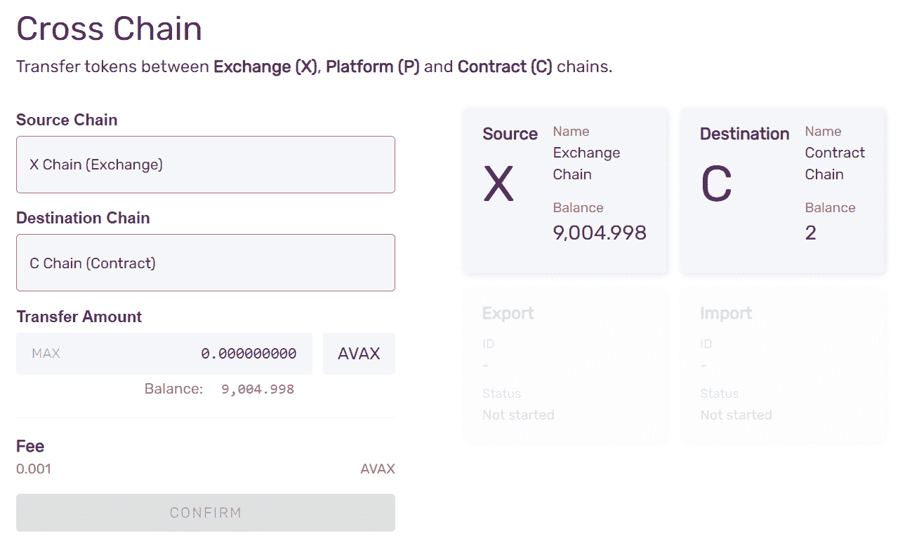
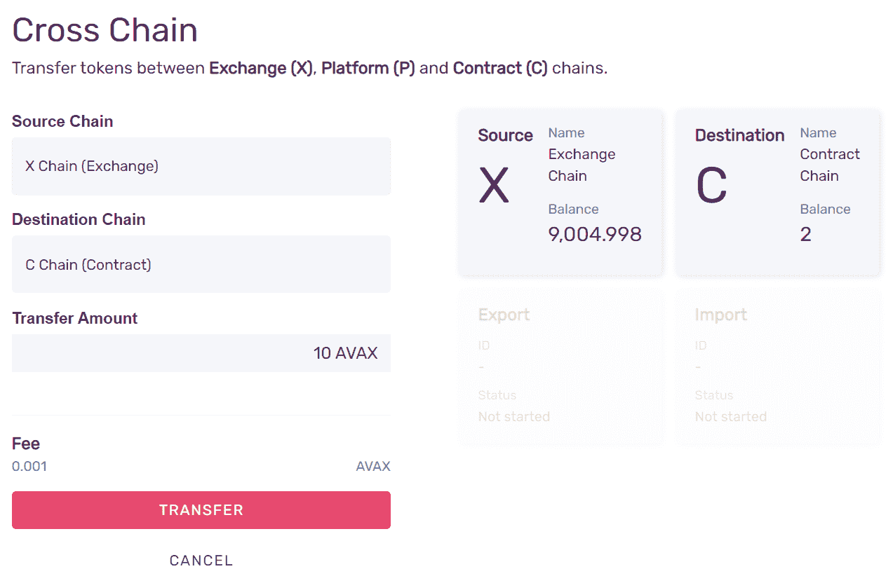
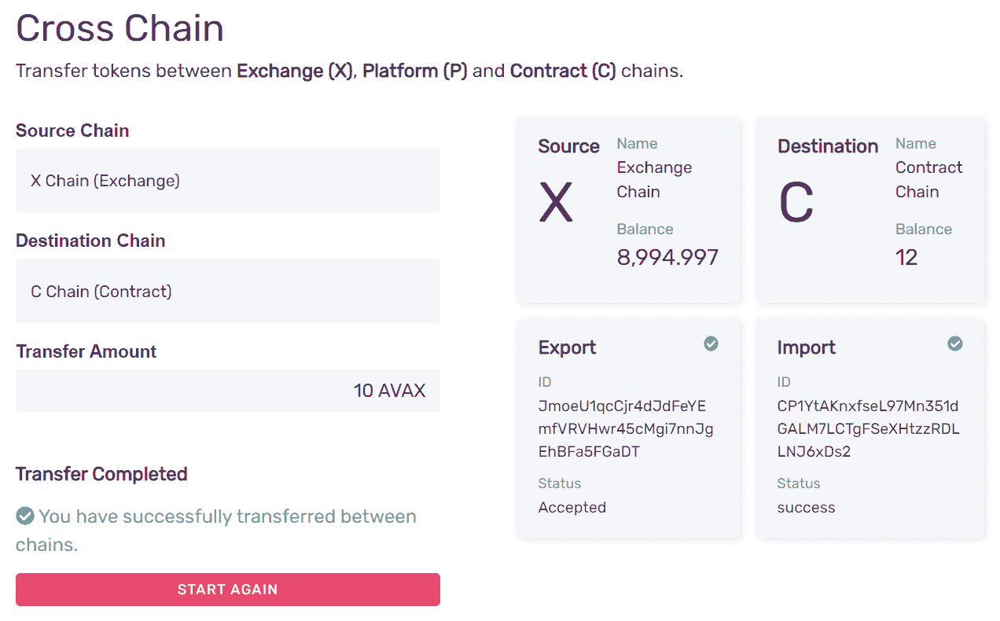

# 介绍

> 原文:[https://github . com/fig ment-networks/learn-tutorials/blob/master/avalanche/transfer-avax-between-the-x-chain-and-c-chain . MD](https://github.com/figment-networks/learn-tutorials/blob/master/avalanche/transfer-avax-between-the-x-chain-and-c-chain.md)

[**原版教程可以在 AVA 实验室文档这里找到**](https://docs.avax.network/build/tutorials/platform/transfer-avax-between-x-chain-and-c-chain) 。

AVAX 令牌存在于 X 链上，可以在 X 链上进行交易；存在于 P 链上，可以在验证主网络时作为股份提供；存在于 C 链上，可以在智能合同中使用或用于支付汽油费用。在本教程中，我们将在 X 链和 C 链之间发送 AVAX 令牌。

# 要求

您已经创建了您的 [Avalanche DataHub](https://datahub.figment.io/sign_up?service=avalanche) 账户，并且熟悉 [Avalanche 的架构](https://docs.avax.network/learn/platform-overview)。

为了发送 AVAX，你需要有一些 AVAX！你可以通过在交易所购买获得真正的 AVAX，或者你可以从 [AVAX 测试龙头](https://faucet.avax-test.network)获得 testnet AVAX，这是一种免费而简单的玩 Avalanche 的方式。

# 使用网络钱包传输 AVAX

在链之间转移 AVAX 的最简单方法是使用[Avalanche Wallet](https://wallet.avax.network/)，这是一种非托管和安全的存取和移动 AVAX 的方式。

雪崩钱包源代码可以在[这里](https://github.com/ava-labs/avalanche-wallet)找到。

### 步骤 1 -打开雪崩钱包


选择**进入钱包**进入你的钱包。要将钱包连接到主 Avalanche 网络之外的网络，选择 **Mainnet** 并选择要连接的网络。

### 第 2 步-登录您的钱包

您可以使用私钥、助记键短语、密钥库文件或 Ledger Nano 来访问您的钱包。目前尚不支持通过 Ledger 进行供应链转账。


成功登录后，您将看到您的余额、资产组合和各种其他信息。

### 步骤 3 -转到“交叉链”选项卡


用于在链之间转移令牌的功能位于**交叉链**选项卡上。

### 第 4 步-输入转账金额

您可以选择**来源链**和**目的链**。分别选择 X 链和 C 链。您将看到您的 X 和 C 余额，以及一个用于输入从源链转移到目的链的金额的输入字段。



输入您希望从 X 链转移到 C 链的金额。

### 步骤 5 -确认交易



按**确认**，然后**传送**开始传送。

### 第 6 步-完成！

跨链转移是一个两步流程:首先是从 X 链导出资金的交易，另一个是将其导入 C 链。钱包会做这两项工作，并显示其进度。



就是这样！你把 AVAX 从 X 链转移到 C 链了！现在，您可以使用它们在 C-Chain 上部署智能合约。

### 从 C 链转移到 X 链

要将 AVAX 返回到 X 链，您需要以相反的方向进行转移。

通过从**源**和**目的**下拉菜单中选择，交换源和目的链。剩下的流程都一样:输入金额，确认，转账。

# 通过 API 调用从 X 链转移到 C 链

如果您在 Avalanche 网络上构建应用程序，您可能希望以编程方式进行传输，作为一些更广泛功能的一部分。您可以通过在雪崩节点上调用适当的 API 来做到这一点。本教程的其余部分假设您有权访问 AvalancheGo 节点、X 链上的 AVAX 令牌以及创建的用户凭证[和存储在节点的密钥库中的用户凭证](/figment-networks/learn-tutorials/blob/master/avalanche)。

下面所有示例 API 调用都假设节点正在本地运行(即监听`127.0.0.1`)。该节点可以连接到主网络、测试网络或本地网络。在每种情况下，API 调用和响应应该是相同的，只是地址格式不同。该节点不必是本地的；您可以调用托管在其他地方的节点。

您可能已经注意到，在使用 Avalanche Wallet 转移 AVAX 时，跨链转移是两个交易操作:

*   从 X 链导出 AVAX
*   将 AVAX 导入 C 链

在我们进行转移之前，我们需要在 C 链上设置地址，以及控制键。

### 在 C 链上设置地址和密钥

X 链使用 [Bech32](http://support.avalabs.org/en/articles/4587392-what-is-bech32) 地址，C 链使用十六进制以太坊虚拟机(EVM)地址。没有办法将地址从一种格式转换成另一种格式，因为它们都是使用单向加密函数从私钥中导出的。

为了解决这个问题，您可以从 X 链导出一个私钥，然后将其导入 C 链。这样，您可以使用 X 链地址并将 X 前缀更改为 C 前缀，以便获得正确的 Bech32 地址用于 C 链。

首先，从 X 链导出一个私钥:

```
curl -X POST --data '{
 "jsonrpc":"2.0",
 "id"     :1,
 "method" :"avm.exportKey",
 "params" :{
 "username" :"myUsername",
 "password":"myPassword",
 "address": "X-avax1jggdngzc9l87rgurmfu0z0n0v4mxlqta0h3k6e"
 }
}' -H 'content-type:application/json;' 127.0.0.1:9650/ext/bc/X
```

回应:

```
{
    "jsonrpc":"2.0",
    "id"     :1,
    "result" :{
        "privateKey":"PrivateKey-2w4XiXxPfQK4TypYqnohRL8DRNTz9cGiGmwQ1zmgEqD9c9KWLq"
    }
}
```

现在，将相同的私钥导入 C 链:

```
curl -X POST --data '{ 
 "jsonrpc":"2.0", 
 "id"     :1, 
 "method" :"avax.importKey", 
 "params" :{ 
 "username" :"myUsername", 
 "password":"myPassword", 
 "privateKey":"PrivateKey-2w4XiXxPfQK4TypYqnohRL8DRNTz9cGiGmwQ1zmgEqD9c9KWLq" 
 } 
}' -H 'content-type:application/json;' 127.0.0.1:9650/ext/bc/C/avax
```

响应包含一个十六进制编码的 EVM 地址:

```
{
    "jsonrpc": "2.0",
    "result": {
        "address": "0x5Bf544EF123FE41B262295dBA41c5a9CFA8efDB4"
    },
    "id": 1
}
```

现在我们有了转移代币所需的一切。

### 从 X 链转移到 C 链

使用与您导出的私钥相对应的地址，并在 [`avm.exportAVAX`](/figment-networks/learn-tutorials/blob/master/avalanche) 呼叫中切换到使用 C 前缀:

```
curl -X POST --data '{ 
 "jsonrpc":"2.0", 
 "id"     :1, 
 "method" :"avm.exportAVAX", 
 "params" :{ 
 "to":"C-avax1jggdngzc9l87rgurmfu0z0n0v4mxlqta0h3k6e", 
 "destinationChain": "C", 
 "amount": 5000000, 
 "username":"myUsername", 
 "password":"myPassword" 
 } 
}' -H 'content-type:application/json;' 127.0.0.1:9650/ext/bc/X
```

因为您的 keystore 用户拥有 C 链上相应的私钥，所以您现在可以将 AVAX 导入到您选择的地址。没有必要将其导入到导出到的同一地址，因此可以将 AVAX 导入到您在 MetaMask 或其他第三方服务中拥有的地址。

```
curl -X POST --data '{
 "jsonrpc":"2.0",
 "id"     :1, 
 "method" :"avax.importAVAX", 
 "params" :{ 
 "to":"0x4b879aff6b3d24352Ac1985c1F45BA4c3493A398", 
 "sourceChain":"X", 
 "username":"myUsername", 
 "password":"myPassword" 
 } 
}' -H 'content-type:application/json;' 127.0.0.1:9650/ext/bc/C/avax
```

其中`to`是您选择的十六进制编码的 EVM 地址。

响应如下所示:

```
{   
    "jsonrpc": "2.0",   
    "result": { 
        "txID": "LWTRsiKnEUJC58y8ezAk6hhzmSMUCtemLvm3LZFw8fxDQpns3" 
    },  
    "id": 1 
}
```

注意:对 C 链的导入交易不收交易费。

一旦您的 AVAX 被转移到 C 链，您就可以使用它来部署智能合约并与之交互。

## 从 C 链转移到 X 链

现在，您可以将 AVAX 从 C 链移回 X 链。首先，我们需要导出:

```
curl -X POST --data '{ 
 "jsonrpc":"2.0", 
 "id"     :1, 
 "method" :"avax.exportAVAX",
 "params" :{ 
 "to":"X-avax1wkmfja9ve3lt3n9ye4qp3l3gj9k2mz7ep45j7q", 
 "amount": 5000000, 
 "username":"myUsername", 
 "password":"myPassword" 
 } 
}' -H 'content-type:application/json;' 127.0.0.1:9650/ext/bc/C/avax
```

其中`to`是你持有的 X 链地址的 bech32 编码地址。确保您导出的金额超过交易费，因为导出和导入交易都将收取交易费。

响应应该是这样的:

```
{   
    "jsonrpc": "2.0",   
    "result": { 
        "txID": "2ZDt3BNwzA8vm4CMP42pWD242VZy7TSWYUXEuBifkDh4BxbCvj"    
    },  
    "id": 1 
}
```

要完成传送，调用 [`avm.importAVAX`](/figment-networks/learn-tutorials/blob/master/avalanche) 。

```
curl -X POST --data '{ 
 "jsonrpc":"2.0", 
 "id"     :1, 
 "method": "avm.importAVAX", 
 "params": { 
 "username":"myUsername", 
 "password":"myPassword", 
 "sourceChain": "C", 
 "to":"X-avax1wkmfja9ve3lt3n9ye4qp3l3gj9k2mz7ep45j7q" 
 } 
}' -H 'content-type:application/json;' 127.0.0.1:9650/ext/bc/X
```

其中`to`是 bech32 编码的地址，即您在上一步中向其发送资金的 X 链地址。

响应应该是这样的:

```
{   
    "jsonrpc": "2.0",   
    "result": { 
        "txID": "2kxwWpHvZPhMsJcSTmM7a3Da7sExB8pPyF7t4cr2NSwnYqNHni"    
    },  
    "id": 1 
}
```

# 包扎

就是这样！现在，您可以在 X 链和 C 链之间来回交换 AVAX，既可以使用 Avalanche Wallet，也可以在 Avalanche 节点上调用适当的 API 调用。

如果您在学习本教程时有任何困难，或者只是想与我们讨论雪崩技术，您可以今天就 [**加入我们的社区**](https://discord.gg/fszyM7K) ！