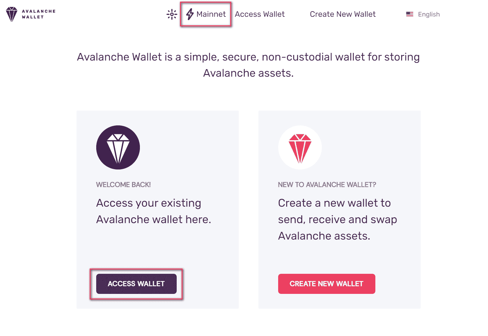
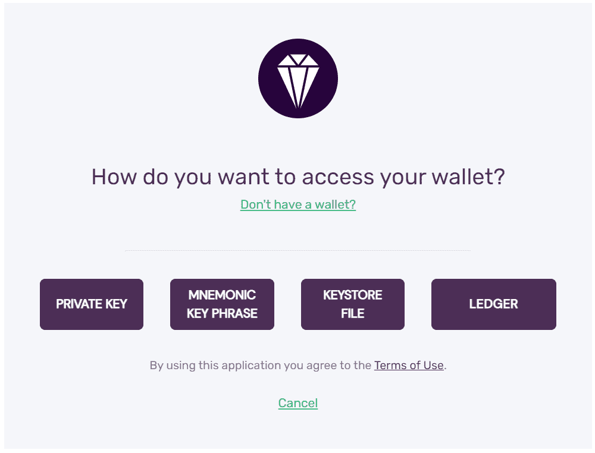
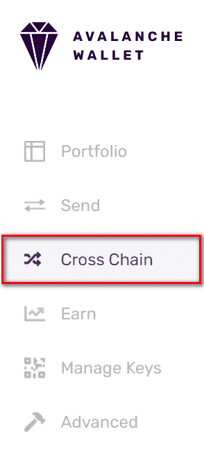
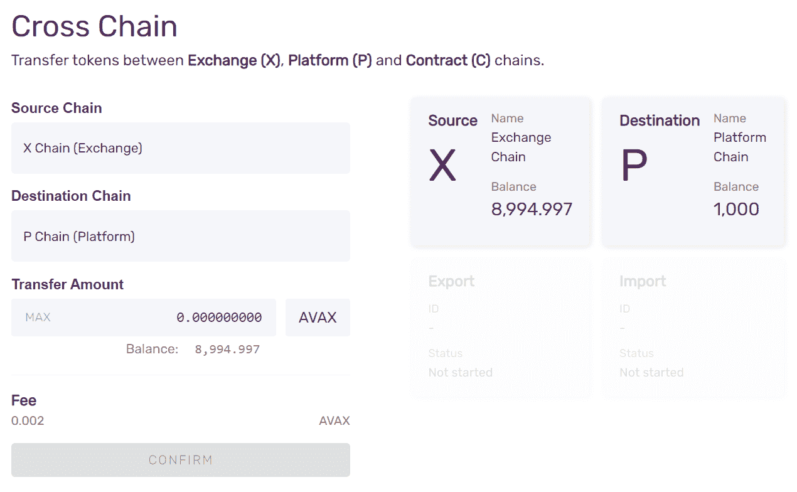
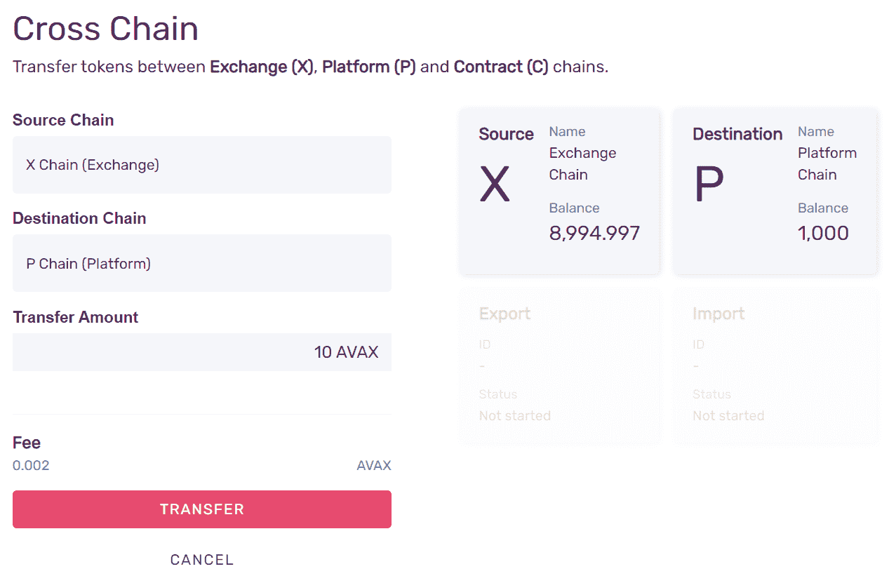
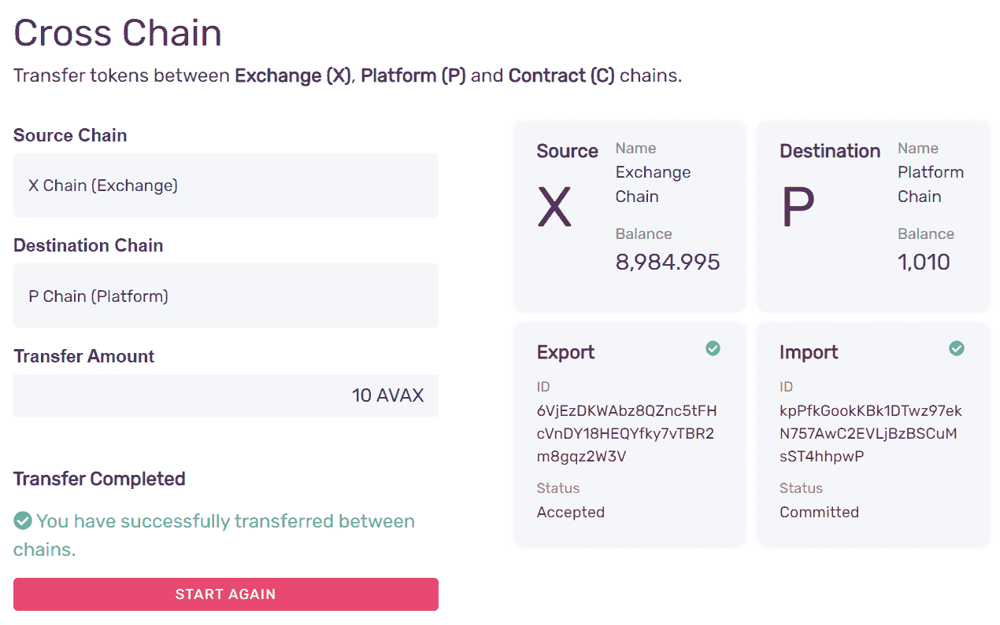

# avalanche/transfer-avax-between-the-x-chain-and-p-chain

> 原文：<https://github.com/figment-networks/learn-tutorials/blob/master/avalanche/transfer-avax-between-the-x-chain-and-p-chain.md>

[**原版教程可以在 AVA 实验室文档这里找到**](https://docs.avax.network/build/tutorials/platform/transfer-avax-between-x-chain-and-p-chain) 。

AVAX 令牌存在于 X 链上，可以在 X 链上进行交易；存在于 P 链上，可以在验证主网络时作为股份提供；存在于 C 链上，可以在智能合同中使用或用于支付汽油费用。Avalanche 支持 AVAX 在这些链之间的移动，在未来，Avalanche 将支持链之间更通用的原子交换。在本教程中，我们将在 X 链和 P 链之间发送 AVAX 令牌。

# 要求

您已经创建了您的 [Avalanche DataHub](https://datahub.figment.io/sign_up?service=avalanche) 账户，并且熟悉 [Avalanche 的架构](https://docs.avax.network/learn/platform-overview)。

为了发送 AVAX，你需要有一些 AVAX！你可以通过在交易所购买获得真正的 AVAX，或者你可以从 [AVAX 测试龙头](https://faucet.avax-test.network)获得 testnet AVAX，这是一种免费而简单的玩 Avalanche 的方式。

## 使用网络钱包传输 AVAX

在链之间转移 AVAX 的最简单方法是使用[Avalanche Wallet](https://wallet.avax.network/)，这是一种非托管和安全的存取和移动 AVAX 的方式。

雪崩钱包源代码可以在[这里](https://github.com/ava-labs/avalanche-wallet)找到。

### 步骤 1 -打开雪崩钱包



选择**进入钱包**进入你的钱包。要将钱包连接到主 Avalanche 网络之外的网络，选择 **Mainnet** 并选择要连接的网络。

### 第 2 步-登录您的钱包

您可以使用私钥、助记键短语、密钥库文件或分类帐纳米来访问您的钱包。



成功登录后，您将看到您的余额、资产组合和各种其他信息。

### 步骤 3 -转到“交叉链”选项卡



用于在链之间转移令牌的功能位于**交叉链**选项卡上。

### 第 4 步-输入转账金额

您可以选择**来源链**和**目的链**。分别选择 X 链和 P 链。您将看到您的 X 和 P 余额，以及一个用于输入从源链转移到目的链的金额的输入字段。



输入您希望从 X 链转移到 P 链的金额。

### 步骤 5 -确认交易



按**确认**，然后**传送**开始传送。

### 第 6 步-完成！

跨链转移是一个两步流程:首先是从 X 链导出资金的交易，另一步是将其导入 P 链。钱包会做这两项工作，并显示其进度。



就是这样！你把 AVAX 从 X 链转移到 P 链了！现在，您可以使用它们在 Avalanche 网络上进行验证或委托。

### 从 P 链转移到 X 链

要将 AVAX 返回到 X 链，您需要以相反的方向进行转移。

从**源**和**目的**下拉菜单中选择源链和目的链进行交换。剩下的流程都一样:输入金额，确认，转账。

## 通过 API 调用从 X 链转移到 P 链

如果您在 Avalanche 网络上构建应用程序，您可能希望以编程方式进行传输，作为一些更广泛功能的一部分。您可以通过在雪崩节点上调用适当的 API 来做到这一点。本教程的其余部分假设您有权访问 AvalancheGo 节点、X 链上的 AVAX 令牌以及创建的用户凭证[和存储在节点的密钥库中的用户凭证](https://docs.avax.network/build/avalanchego-apis/keystore-api#keystorecreateuser)。

下面所有示例 API 调用都假设节点正在本地运行(即监听`127.0.0.1`)。该节点可以连接到主网络、测试网络或本地网络。在每种情况下，API 调用和响应应该是相同的，只是地址格式不同。该节点不必是本地的；您可以调用托管在其他地方的节点。

您可能已经注意到，在使用 Avalanche Wallet 转移 AVAX 时，跨链转移是两个交易操作:

*   从 X 链导出 AVAX
*   将 AVAX 导入 P 链

### 步骤 1—从 X 链中导出 AVAX

要导出 AVAX，调用 X 链的 [`avm.exportAVAX`](/figment-networks/learn-tutorials/blob/master/avalanche) 方法。

您的呼叫应该如下所示:

```js
curl -X POST --data '{
 "jsonrpc":"2.0",
 "id"     :1,
 "method" :"avm.exportAVAX",
 "params" :{
 "to":"P-avax1wkmfja9ve3lt3n9ye4qp3l3gj9k2mz7ep45j7q",
 "destinationChain": "P",
 "amount": 5000000,
 "changeAddr": "X-avax1turszjwn05lflpewurw96rfrd3h6x8flgs5uf8",
 "username":"myUsername",
 "password":"myPassword"
 }
}' -H 'content-type:application/json;' 127.0.0.1:9650/ext/bc/X
```

其中`to`是您的用户控制的 P 链地址的地址，而`changeAddr`是发送任何更改的地址。您可以将`changeAddr`留空；如果您将其留空，更改将返回到由您的用户控制的地址(参见[此处](/figment-networks/learn-tutorials/blob/master/avalanche)了解创建新 P 链地址的说明)。

请注意，您将为导出和导入操作支付交易费。在这个例子中，我们假设交易费是`.001` AVAX。然后，上面的导出实际消耗了`.006`AVAX；`.005`转到 P 链`.001`作为交易费烧掉。

确保您发送的金额超过交易费。否则，当你在 P 链上导入 AVAX 的时候，它会消耗交易费，最后你会在 P 链上少了*个*个 AVAX。

响应应该是这样的:

```js
{
    "jsonrpc": "2.0",
    "result": {
        "txID": "MqEaeWc4rfkw9fhRMuMTN7KUTNpFmh9Fd7KSre1ZqTsTQG73h",
        "changeAddr": "X-avax1turszjwn05lflpewurw96rfrd3h6x8flgs5uf8",
    },
    "id": 1
}
```

我们可以通过调用 [`avm.getTxStatus`](/figment-networks/learn-tutorials/blob/master/avalanche) 来验证该交易是否被接受:

```js
curl -X POST --data '{
 "jsonrpc": "2.0",
 "method": "avm.getTxStatus",
 "params":{
 "txID":"MqEaeWc4rfkw9fhRMuMTN7KUTNpFmh9Fd7KSre1ZqTsTQG73h"
 },
 "id": 1
}' -H 'content-type:application/json;' 127.0.0.1:9650/ext/bc/X
```

这表明我们的交易已被接受:

```js
{
    "jsonrpc": "2.0",
    "result": {
        "status": "Accepted"
    },
    "id": 1
}
```

我们还可以调用 [`avm.getBalance`](/figment-networks/learn-tutorials/blob/master/avalanche) 来检查 AVAX 是否从我们用户持有的地址中扣除:

```js
curl -X POST --data '{
 "jsonrpc":"2.0",
 "id"     :1,
 "method" :"avm.getBalance",
 "params" :{
 "address":"X-ADDRESSGOESHERE",
 "assetID":"AVAX"
 }
}' -H 'content-type:application/json;' 127.0.0.1:9650/ext/bc/X
```

扣除的金额是导出的金额(本例中为`.005` AVAX)加上交易费。如果您的用户控制多个 X-Chain 地址，AVAX 可能是从这些地址的任意组合发送的。

### 步骤 2—将 AVAX 导入 P 链

我们的转移还没有完成。我们需要调用 P 链的 [`platform.importAVAX`](/figment-networks/learn-tutorials/blob/master/avalanche) 方法来完成转移。

您的呼叫应该如下所示:

```js
curl -X POST --data '{
 "jsonrpc": "2.0",
 "method": "platform.importAVAX",
 "params": {
 "to":"P-avax1wkmfja9ve3lt3n9ye4qp3l3gj9k2mz7ep45j7q",
 "sourceChain":"X",
 "changeAddr":"P-avax103y30cxeulkjfe3kwfnpt432ylmnxux8r73r8u",
 "username":"myUsername",
 "password":"myPassword",
 },
 "id": 1
}' -H 'content-type:application/json;' 127.0.0.1:9650/ext/bc/P
```

这将返回事务 ID:

```js
{
    "jsonrpc": "2.0",
    "result": {
        "txID": "2sxo3ySETZ4xzXqAtgsUvZ5pdkqG4SML4c7Z7NoKLZcp77YNXC",
        "changeAddr":"P-avax103y30cxeulkjfe3kwfnpt432ylmnxux8r73r8u"
    },
    "id": 1
}
```

我们可以通过以下方式检查交易是否被接受:

```js
curl -X POST --data '{
 "jsonrpc":"2.0",
 "id"     :1,
 "method" :"avm.getTxStatus",
 "params" :{
 "txID":"2sxo3ySETZ4xzXqAtgsUvZ5pdkqG4SML4c7Z7NoKLZcp77YNXC"
 }
}' -H 'content-type:application/json;' 127.0.0.1:9650/ext/bc/X
```

应该是`Committed`，表示转移完成。我们还可以通过以下方式检查地址的余额:

```js
curl -X POST --data '{
 "jsonrpc": "2.0",
 "method": "platform.getBalance",
 "params":{
 "address":"P-avax1wkmfja9ve3lt3n9ye4qp3l3gj9k2mz7ep45j7q"
 },
 "id": 1
}' -H 'content-type:application/json;' 127.0.0.1:9650/ext/bc/P
```

响应应该是这样的:

```js
{
    "jsonrpc": "2.0",
    "result": {
        "balance": "4000000",
        "utxoIDs": [
            {
                "txID": "2sxo3ySETZ4xzXqAtgsUvZ5pdkqG4SML4c7Z7NoKLZcp77YNXC",
                "outputIndex": 0
            }
        ]
    },
    "id": 1
}
```

请注意，我们看到的余额是从 X 链(`.004` AVAX)导出的金额减去交易费(本例中为`.001` AVAX)。现在，我们可以使用这个 P 链地址持有的 AVAX 来提供一个 stake，以便验证主网络。

## 以编程方式从 P 链转移到 X 链

现在，让我们将 AVAX 从 P 链移回 X 链。

与之前相同，这也是一个两个事务操作:

*   从生产链中导出
*   导入到 X 链

### 步骤 1—从 P 链中导出 AVAX

为此，调用 [`platform.exportAVAX`](/figment-networks/learn-tutorials/blob/master/avalanche) :

```js
curl -X POST --data '{
 "jsonrpc": "2.0",
 "method": "platform.exportAVAX",
 "params": {
 "to":"X-avax1fjn5rffqvny7uk3tjegjs6snwjs3hhgcpcxfax",
 "amount":3000000,
 "changeAddr":"P-avax103y30cxeulkjfe3kwfnpt432ylmnxux8r73r8u",
 "username":"myUsername",
 "password":"myPassword"
 },
 "id": 1
}' -H 'content-type:application/json;' 127.0.0.1:9650/ext/P
```

其中`to`是 AVAX 要发送到的 X 链地址。

这将返回事务 ID，我们可以通过对 [`platform.getTxStatus`](/figment-networks/learn-tutorials/blob/master/avalanche) 的另一个调用来检查事务是否被提交。同样，确保你发送的金额超过交易费。

### 步骤 2—将 AVAX 导入 X 链

要完成从 P 链到 X 链的转换，请调用 [`avm.importAVAX`](/figment-networks/learn-tutorials/blob/master/avalanche) :

```js
curl -X POST --data '{
 "jsonrpc":"2.0",
 "id"     :1,
 "method" :"avm.importAVAX",
 "params" :{
 "to":"X-avax1fjn5rffqvny7uk3tjegjs6snwjs3hhgcpcxfax",
 "sourceChain":"P",
 "changeAddr": "X-avax1turszjwn05lflpewurw96rfrd3h6x8flgs5uf8",
 "username":"myUsername",
 "password":"myPassword"
 }
}' -H 'content-type:application/json;' 127.0.0.1:9650/ext/bc/X
```

请注意，`to`与我们调用 [`platform.exportAVAX`](/figment-networks/learn-tutorials/blob/master/avalanche) 时指定的地址相同。

就像之前一样，我们可以调用 [`avm.getBalance`](/figment-networks/learn-tutorials/blob/master/avalanche) 来验证资金是否收到。余额应该增加了`.003` AVAX 减去交易费。

## 包扎

就是这样！现在，您可以在 X 链和 P 链之间来回交换 AVAX，既可以使用 Avalanche Wallet，也可以在 Avalanche 节点上调用适当的 API 调用。

如果您在学习本教程时有任何困难，或者只是想与我们讨论雪崩技术，您可以今天就 [**加入我们的社区**](https://discord.gg/fszyM7K) ！