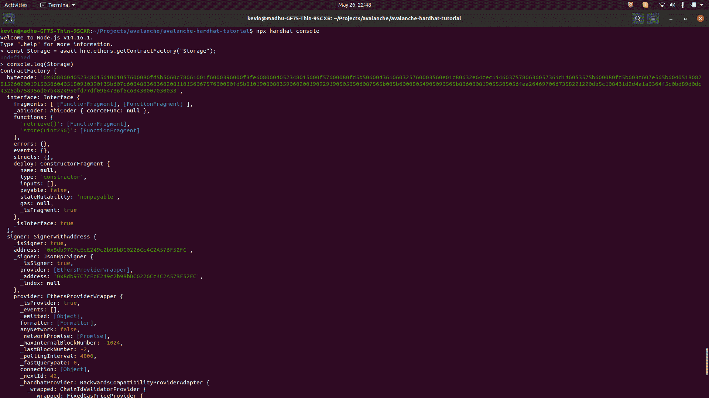

# 介绍

> 原文:[https://github . com/fig ment-networks/learn-tutorials/blob/master/avalanche/using-hard hat-with-the-avalanche-c-chain . MD](https://github.com/figment-networks/learn-tutorials/blob/master/avalanche/using-hardhat-with-the-avalanche-c-chain.md)

Hardhat 是一套工具，共同为我们提供了一个开发环境，帮助开发人员轻松管理和自动化构建智能合约和 dApps 的常见任务。Hardhat 可用于编译、部署、测试和调试智能合约。在这方面，它与[松露](https://www.trufflesuite.com/)非常相似。

Hardhat 与 Truffle 的区别在于，它为开发人员提供了一种无缝的体验，在插件的帮助下使用和调试复杂的 Solidity smart contracts，这些插件提供了强大的可扩展性。

在本教程中，我们将学习如何使用雪崩 C 链的安全帽。C 链是 EVM 的一个实例([以太坊虚拟机](https://ethereum.org/en/developers/docs/evm/))。作为 EVM 的一个实例，Avalanche C 链非常有吸引力，因为它可以运行 Solidity 中已经编写的智能合同项目。

# 先决条件

请确保您已经完成了教程:

*   [Avash 安装](https://learn.figment.io/tutorials/local-avalanche-network-using-avash)

# 要求

为了顺利完成本教程，我们需要在您的系统上安装以下软件:

*   [NodeJS](https://nodejs.org/) (12.x+)

# 创建安全帽项目

第一步是为您的项目创建一个目录，您将在其中初始化我们新的 Hardhat 项目。您可以使用以下命令来完成此操作:

```
mkdir avalanche-hardhat-tutorial && cd avalanche-hardhat-tutorial
npm init -y 
```

您应该看到一个新创建的名为`avalanche-hardhat-tutorial`的目录，其中有一个文件`package.json`:

```
{
  "name": "avalanche-hardhat-tutorial",
  "version": "1.0.0",
  "description": "",
  "main": "index.js",
  "scripts": {
    "test": "echo \"Error: no test specified\" && exit 1"
  },
  "keywords": [],
  "author": "",
  "license": "ISC"
}
```

现在，我们继续使用以下命令安装 Hardhat 作为我们的项目依赖项之一:

```
npm install --save-dev hardhat
```

安装完成后，键入以下命令，使当前目录成为一个 Hardhat 项目:

```
npx hardhat
```

Hardhat 应该会提示您:

```
888    888                      888 888               888
888    888                      888 888               888
888    888                      888 888               888
8888888888  8888b.  888d888 .d88888 88888b.   8888b.  888888
888    888     "88b 888P"  d88" 888 888 "88b     "88b 888
888    888 .d888888 888    888  888 888  888 .d888888 888
888    888 888  888 888    Y88b 888 888  888 888  888 Y88b.
888    888 "Y888888 888     "Y88888 888  888 "Y888888  "Y888

Welcome to Hardhat v2.2.1

? What do you want to do? …
Create a sample project
▸ Create an empty hardhat.config.js
Quit 
```

选择创建一个空的`hardhat.config.js`，这样你就有了，你当前的目录现在是一个 Hardhat 项目！

# 将 Avash 网络配置添加到 Hardhat

现在，为了让我们的 Hardhat 项目与 Avash 启动的本地雪崩网络通信，我们需要为 Hardhat 提供适当的网络配置。为此，向`hardhat.config.js`的 module.exports 块添加以下属性:

```
defaultNetwork: "avash",
networks: {
  avash: {
    url: 'http://localhost:9650/ext/bc/C/rpc',
    gasPrice: 225000000000,
    chainId: 43112,
    accounts: [
      "0x56289e99c94b6912bfc12adc093c9b51124f0dc54ac7a766b2bc5ccf558d8027",
      "0x7b4198529994b0dc604278c99d153cfd069d594753d471171a1d102a10438e07",
      "0x15614556be13730e9e8d6eacc1603143e7b96987429df8726384c2ec4502ef6e",
      "0x31b571bf6894a248831ff937bb49f7754509fe93bbd2517c9c73c4144c0e97dc",
      "0x6934bef917e01692b789da754a0eae31a8536eb465e7bff752ea291dad88c675",
      "0xe700bdbdbc279b808b1ec45f8c2370e4616d3a02c336e68d85d4668e08f53cff",
      "0xbbc2865b76ba28016bc2255c7504d000e046ae01934b04c694592a6276988630",
      "0xcdbfd34f687ced8c6968854f8a99ae47712c4f4183b78dcc4a903d1bfe8cbf60",
      "0x86f78c5416151fe3546dece84fda4b4b1e36089f2dbc48496faf3a950f16157c",
      "0x750839e9dbbd2a0910efe40f50b2f3b2f2f59f5580bb4b83bd8c1201cf9a010a"
    ]
  },
},
```

*   我们提供的网络 url 指向本地主机和 RPC 端点，这是由 Avash 启动的测试网络。
*   `225000000000`的气价是网络的当前气价——低于此价，交易将失败，表明交易定价过低。
*   `43112`是 Avash 创建的链的 id。这个值在 Avash 中是硬编码的。
*   我们上面提供的帐户列表是网络上随机生成的地址。当谈到 Avash 时，不像 Avalanche mainnet 和 Fuji testnet，这些开发者的地址都有很多 AVAX，所以我们不需要从水龙头中为他们提供资金。每次创建新的 Avash 网络时，都会重置余额。

# 添加和编译智能合同

Hardhat 在`contracts`目录中寻找要编译的契约。因此，让我们继续创建这个目录:

```
mkdir contracts
```

在我们刚刚创建的`contracts`目录中，创建一个名为`Storage.sol`的新文件，并向其中添加以下 solidity 代码:

```
// SPDX-License-Identifier: MIT
pragma solidity >=0.4.22 <0.8.0;

/**
* @title Storage
* @dev Store & retrieve the value in a variable
*/
contract Storage {

  uint256 number;

  /**
 * @dev Store value in variable
 * @param num value to store
 */
  function store(uint256 num) public {
    number = num;
  }

  /**
 * @dev Return value
 * @return value of 'number'
 */
  function retrieve() public view returns (uint256){
    return number;
  }
}
```

`Storage`是一个 solidity smart 契约，它让我们通过`store`函数向区块链写一个数字，然后通过`retrieve`函数从区块链读回这个数字。

要编译我们刚刚添加到项目中的 Storage.sol 智能协定，请使用以下命令:

```
npx hardhat compile
```

成功执行命令后，现在应该可以编译智能契约了！

# 使用安全帽控制台

对于本教程的其余部分，我们将使用 Hardhat 控制台来部署我们的智能合约并与之交互。为了成功地使用安全帽控制台，我们需要安装几个安全帽插件，即 [`hardhat-ethers`](https://www.npmjs.com/package/@nomiclabs/hardhat-ethers) 和 [`hardhat-waffle`](https://www.npmjs.com/package/@nomiclabs/hardhat-waffle) 。使用以下命令安装它们:

```
npm install --save-dev @nomiclabs/hardhat-ethers 'ethers@^5.0.0'
npm install --save-dev @nomiclabs/hardhat-waffle 'ethereum-waffle@^3.0.0' @nomiclabs/hardhat-ethers 'ethers@^5.0.0' 
```

安装这些插件后，我们需要通过在我们之前创建的 Hardhat 配置文件的开头要求`hardhat-waffle`来告诉 Hardhat 使用它们:

```
require("@nomiclabs/hardhat-waffle");
```

现在，该文件应该如下所示:

```
require("@nomiclabs/hardhat-waffle");

/**
* @type import('hardhat/config').HardhatUserConfig
*/
module.exports = {
  solidity: "0.7.3",
  defaultNetwork: "avash",
    networks: {
      avash: {
        url: 'http://localhost:9650/ext/bc/C/rpc',
        gasPrice: 225000000000,
        chainId: 43112,
        accounts: [
          "0x56289e99c94b6912bfc12adc093c9b51124f0dc54ac7a766b2bc5ccf558d8027",
          "0x7b4198529994b0dc604278c99d153cfd069d594753d471171a1d102a10438e07",
          "0x15614556be13730e9e8d6eacc1603143e7b96987429df8726384c2ec4502ef6e",
          "0x31b571bf6894a248831ff937bb49f7754509fe93bbd2517c9c73c4144c0e97dc",
          "0x6934bef917e01692b789da754a0eae31a8536eb465e7bff752ea291dad88c675",
          "0xe700bdbdbc279b808b1ec45f8c2370e4616d3a02c336e68d85d4668e08f53cff",
          "0xbbc2865b76ba28016bc2255c7504d000e046ae01934b04c694592a6276988630",
          "0xcdbfd34f687ced8c6968854f8a99ae47712c4f4183b78dcc4a903d1bfe8cbf60",
          "0x86f78c5416151fe3546dece84fda4b4b1e36089f2dbc48496faf3a950f16157c",
          "0x750839e9dbbd2a0910efe40f50b2f3b2f2f59f5580bb4b83bd8c1201cf9a010a"
        ]
    },
  },
};
```

我们现在已经准备好部署我们的智能合约并与之交互！

# 使用 Hardhat 控制台部署智能合同

为了部署我们的智能合约并与之交互，我们将使用由 Hardhat 提供的交互式 JavaScript 控制台，称为 Hardhat 控制台。Hardhat 控制台更适合于为我们提供快速的本地开发和测试环境，而不是编写脚本来做同样的事情。

> 确保`Setup a local Avalanche network using Avash`教程中概述的本地雪崩网络运行正常。按照其他教程完成，但是，不要在运行 Lua 脚本后退出 Avash 控制台。让它在一个单独的终端窗口中运行&,按照以下说明操作。

要启动安全帽控制台，我们使用:

```
npx hardhat console 
```

我们将看到一个交互式控制台环境，如下所示:

```
Welcome to Node.js v14.16.1.
Type ".help" for more information.
> 
```

现在，我们继续键入以下代码片段，以部署我们的存储智能合同并与之交互。输入每一行代码后，按“Enter”执行相同的操作。

为了使用 Hardhat 获得`Storage.sol`契约的实例，我们使用了来自`hre`的`getContractFactory`函数，Hardhat 运行时环境:

```
const Storage = await hre.ethers.getContractFactory("Storage");
```

这将返回`undefined`！

这里，`undefined`不代表我们执行的指令失败了。取而代之的是`undefined`,因为我们将返回值存储在存储常量中，没有任何东西可以输出到控制台。我们可以通过用以下命令记录存储常量的内容来验证命令是否成功执行:

```
console.log(Storage)
```

> 您在下面看到的是编译后的智能契约的 Javascript 表示——您不需要理解您在记录的输出中看到的所有内容。我们将它打印出来，以证明该指令执行成功。



现在，我们继续部署我们刚刚检索到的存储合同，使用:

```
const storage = await Storage.deploy();
```

同样，这将返回`undefined`！

在我们开始与智能合约交互之前，我们需要等待合约成功部署，使用:

```
await storage.deployed();
```

这将返回大量输出，这是 JavaScript 中智能契约的内部表示。
以下示例已被截断:

```
Contract {
  interface: Interface {
    fragments: [ [FunctionFragment], [FunctionFragment] ],
    _abiCoder: AbiCoder { coerceFunc: null },
    functions: {
      'retrieve()': [FunctionFragment],
      'store(uint256)': [FunctionFragment]
    },
    errors: {},
    events: {},
    structs: {},
    deploy: ConstructorFragment {
      name: null,
      type: 'constructor',
      inputs: [],
      payable: false,
      stateMutability: 'nonpayable',
      gas: null,
      _isFragment: true
    },
    _isInterface: true
  },
```

# 使用 Hardhat 控制台与智能合同交互

为了将我们最喜欢的神奇数字存储到区块链中，我们调用部署契约的存储函数:

```
await storage.store(333);
```

这将输出事务细节的 Javascript 表示:

```
{
  hash: '0xaae491304254fce18fc3ff77f5891feef69035d05eb93c6b542823f948426ac4',
  type: 0,
  accessList: null,
  blockHash: null,
  blockNumber: null,
  transactionIndex: null,
  confirmations: 0,
  from: '0x8db97C7cEcE249c2b98bDC0226Cc4C2A57BF52FC',
  gasPrice: BigNumber { _hex: '0x34630b8a00', _isBigNumber: true },
  gasLimit: BigNumber { _hex: '0xaa26', _isBigNumber: true },
  to: '0x4Ac1d98D9cEF99EC6546dEd4Bd550b0b287aaD6D',
  value: BigNumber { _hex: '0x00', _isBigNumber: true },
  nonce: 5,
  data: '0x6057361d000000000000000000000000000000000000000000000000000000000000014d',
  r: '0x2be3e63b57eb1dd045361317e5380af910527a03b8e00cbde6226350d908d698',
  s: '0x6c45b5adabfd6cabde520a8f4a649b639f59e1e9fe3234713bb8152515bcf9d0',
  v: 86259,
  creates: null,
  chainId: 43112,
  wait: [Function (anonymous)]
}
```

现在，我们已经准备好读取刚才存储在合同中的数字，并使用以下命令将其打印出来:

```
let i = await storage.retrieve();
console.log(i.toNumber());
```

再次运行代码，您现在应该看到输出`333`打印到控制台。

# 结论

在本教程中，我们已经成功地创建了一个新的安全帽项目。在 Hardhat 项目中，我们添加了一个新的智能契约，然后使用 Hardhat 对其进行编译。最后，我们部署了契约，并使用 Hardhat 控制台与之交互。

祝贺您完成了本教程的最后一课！

> “没有什么伟大的事物是突然产生的，就像一串葡萄或一个无花果一样。如果你告诉我你想要一个无花果，我回答说一定有时间。让它先开花，再结果，再成熟。”
> 
> 爱比克泰德

所以，继续学习，继续建设，我相信你正在建设一些伟大的东西！祝你好运！

如果您在学习本教程时有任何困难，或者只是想与我们讨论雪崩技术，您可以今天就加入我们的社区[！](https://discord.gg/fszyM7K)