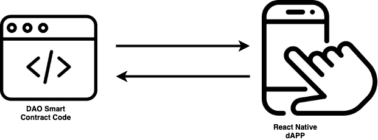
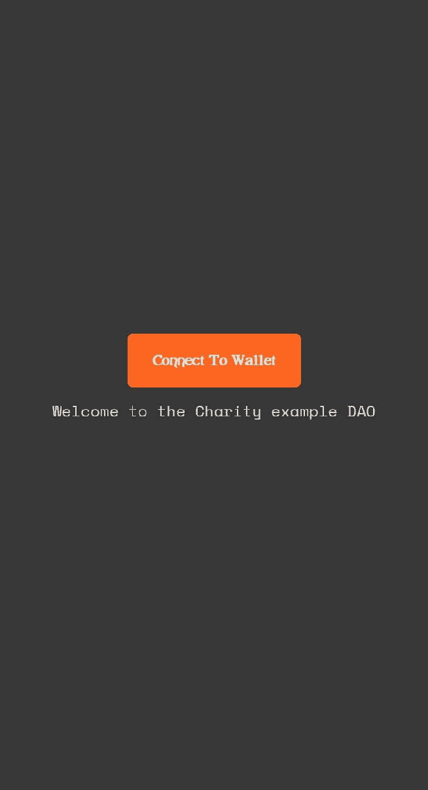
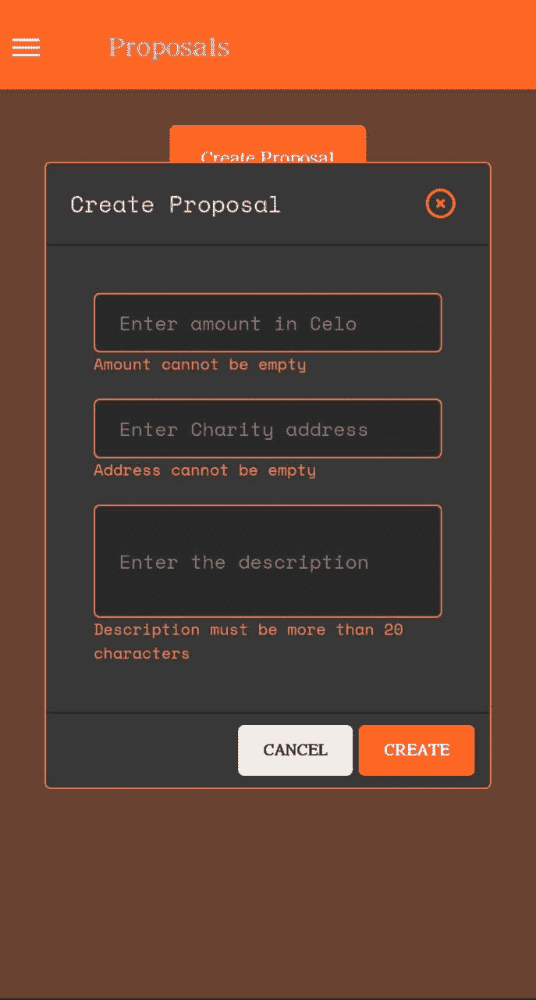
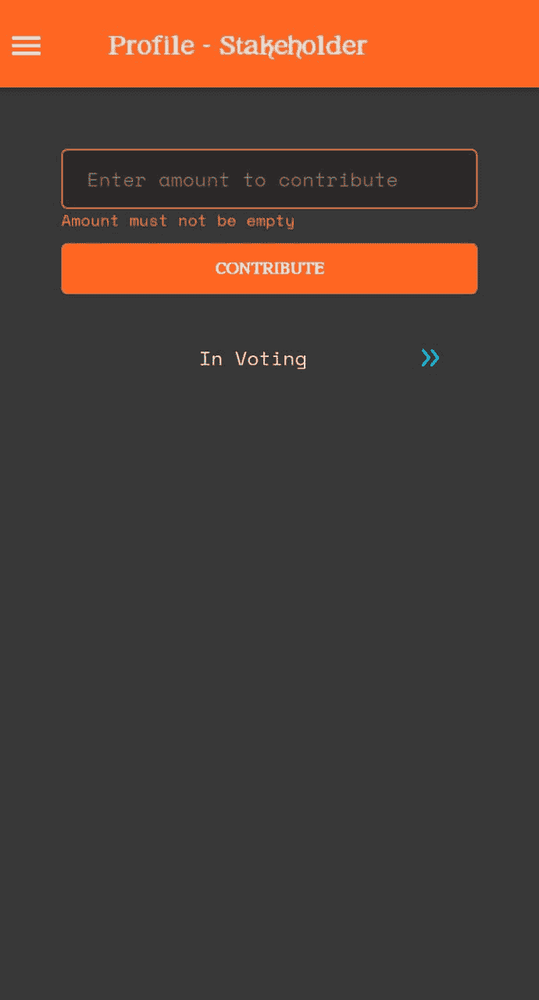
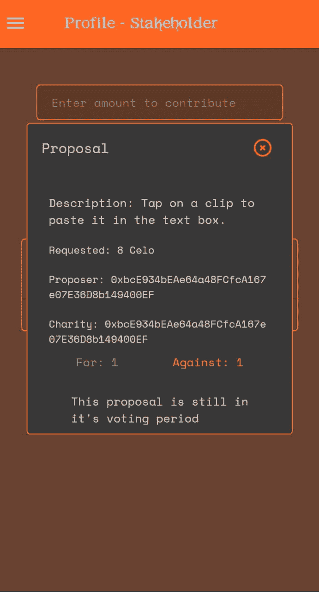

# 介绍

> 原文：<https://github.com/figment-networks/learn-tutorials/blob/master/celo/build-a-dao-on-celo.md>

在本教程中，我们将通过首先编写将部署在 Celo 网络上的 Solidity 智能合约代码，然后构建一个 React 本机应用程序来与智能合约交互，来构建一个功能性 DAO(分布式自治组织)。

[维基百科](https://en.wikipedia.org/wiki/Decentralized_autonomous_organization)将 DAO(去中心化自治组织)定义为一个以编码为计算机程序的规则表示的组织，它是透明的，由组织成员控制，不受中央政府的影响。它决定哪个决策将由一个分散的组织做出。

用非技术术语来说:Dao 是一种与全球志同道合者合作的有效且安全的方式。

可以把 Dao 想象成一个由成员集体拥有和管理的互联网原生企业。它们有内置的金库，未经集团批准，任何人都无权动用。决策由提案和投票管理，以确保组织中的每个人都有发言权。

没有首席执行官可以根据自己的奇思妙想批准支出，也没有狡猾的首席财务官操纵账目的机会。一切都是公开的，关于消费的规则通过代码嵌入到 DAO 中。

点击阅读更多[。](https://ethereum.org/en/dao/)

在本教程中，你将学习如何建立一个功能的慈善道。智能合同代码部署在 Celo 网络的 Alfajores 测试网上。该契约允许其成员为 DAO 做出贡献。成员可以发起慈善提案，利益相关者必须在指定的时间内投票表决。这段时间过后，DAO 合同将支付集合资金。

# 先决条件

这些教程假设你已经掌握了 Solidity、JavaScript/TypeScript 的基础知识，以及如何使用 [expo](https://expo.io/) 启动 React 原生应用。我们还假设您已经阅读了世博会文档，并对 Celo 钱包有基本的了解。

*   Expo 是一个通用 React 应用的框架和平台。
*   了解 Celo [手机钱包](https://docs.celo.org/getting-started/alfajores-testnet/using-the-mobile-wallet)。
*   使用 [expo](https://docs.expo.io/) 进行本地反应。
*   Celo dAppKit [文档](https://docs.celo.org/developer-guide/dappkit/setup)也会很有用。
*   也了解一下 [Redux](https://redux.js.org/introduction/getting-started) 吧。

# 要求

对于本教程，需要安装以下软件:

*   反应自然
*   NodeJS v12 及以上版本
*   [松露](https://www.trufflesuite.com/)
*   Alfajores 钱包，需要使用[水龙头](https://celo.org/developers/faucet)进行融资

我们将把这个项目分为三个部分:

*   Celo 上的可靠智能合约
*   创建 React 本机应用程序
*   将它与 Redux 结合在一起

我们将首先概述 dApp 的可视化表示、它的特性以及在与智能合约交互时使用的各种屏幕。



# 特征

dApp 的功能包括:

*   用户连接他们的 Celo 钱包加入慈善道。
*   用户向 DAO 发送 Celo 令牌来成为贡献者。
*   捐款总额达到或超过 200 英镑的捐款人将自动成为股东。
*   只有"一体行动"的利益攸关方可对提案进行表决。
*   贡献者和/或利益相关者可以创建新的提案。
*   新创建的提案有一个结束日期，投票将在该日期结束。
*   利益相关者可以投票赞成或否决提案。
*   一旦提案的截止日期过去，利益相关者就向指定的慈善机构支付所要求的金额。

在 Solidity 中编写 DAO 智能契约，在这里我们将讨论所使用的方法。

构建 React 原生应用，我们将向您展示如何快速构建移动应用界面。

使用 Redux 将 React 原生应用连接到智能合约，这将所有这些整合在一起，并允许我们的移动 dApp 高效地利用 Celo。

# 扎实写好“道”智能合约

在本教程中，我们将通过编写智能契约来构建功能性 DAO 的基础。

智能合同是使用 [Solidity 编程语言](https://docs.soliditylang.org/en/v0.8.7/)编写的。Solidity 用于以太坊以及其他以太坊虚拟机(EVM)兼容的区块链，如 Celo。

## 初始设置

第一个任务是使用 Truffle 初始化一个基本的 Solidity 项目。通常，用户主目录下的一个空目录是创建项目文件的好地方。在空目录中运行命令`truffle init`将会安装项目的默认文件。

来自`truffle init`的终端输出(项目文件将被复制到您运行命令的目录中):

```js
Starting init...
================

> Copying project files to /Users/username/CeloDao

Init successful, sweet!

Try our scaffold commands to get started:
  $ truffle create contract YourContractName # scaffold a contract
  $ truffle create test YourTestName         # scaffold a test

http://trufflesuite.com/docs 
```

## 概观

这里是 DAO 契约的完整代码，我们将在下面查看不同的函数，看看它们做什么以及为什么需要它们。

```js
// SPDX-License-Identifier: MIT
pragma solidity ^0.8.0;

import "@openzeppelin/contracts/access/AccessControl.sol";
import "@openzeppelin/contracts/security/ReentrancyGuard.sol";

contract CharloDAO is ReentrancyGuard, AccessControl {
    bytes32 public constant CONTRIBUTOR_ROLE = keccak256("CONTRIBUTOR");
    bytes32 public constant STAKEHOLDER_ROLE = keccak256("STAKEHOLDER");
    uint32 constant minimumVotingPeriod = 1 weeks;
    uint256 numOfProposals;

    struct CharityProposal {
        uint256 id;
        uint256 amount;
        uint256 livePeriod;
        uint256 votesFor;
        uint256 votesAgainst;
        string description;
        bool votingPassed;
        bool paid;
        address payable charityAddress;
        address proposer;
        address paidBy;
    }

    mapping(uint256 => CharityProposal) private charityProposals;
    mapping(address => uint256[]) private stakeholderVotes;
    mapping(address => uint256) private contributors;
    mapping(address => uint256) private stakeholders;

    event ContributionReceived(address indexed fromAddress, uint256 amount);
    event NewCharityProposal(address indexed proposer, uint256 amount);
    event PaymentTransfered(
        address indexed stakeholder,
        address indexed charityAddress,
        uint256 amount
    );

    modifier onlyStakeholder(string memory message) {
        require(hasRole(STAKEHOLDER_ROLE, msg.sender), message);
        _;
    }

    modifier onlyContributor(string memory message) {
        require(hasRole(CONTRIBUTOR_ROLE, msg.sender), message);
        _;
    }

    function createProposal(
        string calldata description,
        address charityAddress,
        uint256 amount
    )
        external
        onlyStakeholder("Only stakeholders are allowed to create proposals")
    {
        uint256 proposalId = numOfProposals++;
        CharityProposal storage proposal = charityProposals[proposalId];
        proposal.id = proposalId;
        proposal.proposer = payable(msg.sender);
        proposal.description = description;
        proposal.charityAddress = payable(charityAddress);
        proposal.amount = amount;
        proposal.livePeriod = block.timestamp + minimumVotingPeriod;

        emit NewCharityProposal(msg.sender, amount);
    }

    function vote(uint256 proposalId, bool supportProposal)
        external
        onlyStakeholder("Only stakeholders are allowed to vote")
    {
        CharityProposal storage charityProposal = charityProposals[proposalId];

        votable(charityProposal);

        if (supportProposal) charityProposal.votesFor++;
        else charityProposal.votesAgainst++;

        stakeholderVotes[msg.sender].push(charityProposal.id);
    }

    function votable(CharityProposal storage charityProposal) private {
        if (
            charityProposal.votingPassed ||
            charityProposal.livePeriod <= block.timestamp
        ) {
            charityProposal.votingPassed = true;
            revert("Voting period has passed on this proposal");
        }

        uint256[] memory tempVotes = stakeholderVotes[msg.sender];
        for (uint256 votes = 0; votes < tempVotes.length; votes++) {
            if (charityProposal.id == tempVotes[votes])
                revert("This stakeholder already voted on this proposal");
        }
    }

    function payCharity(uint256 proposalId)
        external
        onlyStakeholder("Only stakeholders are allowed to make payments")
    {
        CharityProposal storage charityProposal = charityProposals[proposalId];

        if (charityProposal.paid)
            revert("Payment has been made to this charity");

        if (charityProposal.votesFor <= charityProposal.votesAgainst)
            revert(
                "The proposal does not have the required amount of votes to pass"
            );

        charityProposal.paid = true;
        charityProposal.paidBy = msg.sender;

        emit PaymentTransfered(
            msg.sender,
            charityProposal.charityAddress,
            charityProposal.amount
        );

        return charityProposal.charityAddress.transfer(charityProposal.amount);
    }

    receive() external payable {
        emit ContributionReceived(msg.sender, msg.value);
    }

    function makeStakeholder(uint256 amount) external {
        address account = msg.sender;
        uint256 amountContributed = amount;
        if (!hasRole(STAKEHOLDER_ROLE, account)) {
            uint256 totalContributed =
                contributors[account] + amountContributed;
            if (totalContributed >= 5 ether) {
                stakeholders[account] = totalContributed;
                contributors[account] += amountContributed;
                _setupRole(STAKEHOLDER_ROLE, account);
                _setupRole(CONTRIBUTOR_ROLE, account);
            } else {
                contributors[account] += amountContributed;
                _setupRole(CONTRIBUTOR_ROLE, account);
            }
        } else {
            contributors[account] += amountContributed;
            stakeholders[account] += amountContributed;
        }
    }

    function getProposals()
        public
        view
        returns (CharityProposal[] memory props)
    {
        props = new CharityProposal[](numOfProposals);

        for (uint256 index = 0; index < numOfProposals; index++) {
            props[index] = charityProposals[index];
        }
    }

    function getProposal(uint256 proposalId)
        public
        view
        returns (CharityProposal memory)
    {
        return charityProposals[proposalId];
    }

    function getStakeholderVotes()
        public
        view
        onlyStakeholder("User is not a stakeholder")
        returns (uint256[] memory)
    {
        return stakeholderVotes[msg.sender];
    }

    function getStakeholderBalance()
        public
        view
        onlyStakeholder("User is not a stakeholder")
        returns (uint256)
    {
        return stakeholders[msg.sender];
    }

    function isStakeholder() public view returns (bool) {
        return stakeholders[msg.sender] > 0;
    }

    function getContributorBalance()
        public
        view
        onlyContributor("User is not a contributor")
        returns (uint256)
    {
        return contributors[msg.sender];
    }

    function isContributor() public view returns (bool) {
        return contributors[msg.sender] > 0;
    }
}
```

让我们继续分析 Solidity smart 合同的不同部分。

```js
// SPDX-License-Identifier: MIT
pragma solidity ^0.8.0;
```

Solidity 文件的第一行应该包含相关开源许可的 [SPDX 许可](https://spdx.org/licenses/)标识符——通常是 MIT 或者 Unlicense。下一行将使用`pragma` [编译器指令](https://docs.soliditylang.org/en/v0.5.8/layout-of-source-files.html#version-pragma)指定编译合同所需的可靠性版本。注意[语义版本](https://semver.org/)。

```js
import "@openzeppelin/contracts/access/AccessControl.sol";
import "@openzeppelin/contracts/security/ReentrancyGuard.sol";
```

我们将依赖于 [OpenZepellin 的](https://openzeppelin.com/) ReentrancyGuard 和 AccessControl，所以我们应该继续导入它们。这些都是重要的安全特性，不应该被忽视。

```js
bytes32 public constant CONTRIBUTOR_ROLE = keccak256("CONTRIBUTOR");
bytes32 public constant STAKEHOLDER_ROLE = keccak256("STAKEHOLDER");
```

“一体行动”的用户有两种类型——贡献者和利益相关者。这里需要声明两个常量，分别是单词本身的 [keccak256 hash](https://docs.soliditylang.org/en/v0.8.6/units-and-global-variables.html#mathematical-and-cryptographic-functions) 。这些常量将在以后用于注册和区分用户。

```js
uint32 constant minimumVotingPeriod = 1 weeks;
```

`minimumVotingPeriod`变量保存一个提案在 UNIX 时间内可以被投票的天数。[时间单位](https://docs.soliditylang.org/en/v0.8.6/units-and-global-variables.html#time-units)周是由 Solidity 提供的后缀，这里的 1 周翻译成从现在起一周的 [UNIX 时间](https://en.wikipedia.org/wiki/Unix_time)的总秒数。在 Linux 中，可以使用命令`date +%s.%N`显示 UNIX 时间的值。macOS 用户需要运行`brew install coreutils`来启用微秒显示，转而使用命令`gdate +%s.%N`。

```js
uint256 numOfProposals;
```

每次添加新的慈善提案时,`numOfProposals`都会增加。这让我们可以遍历映射数据类型中的 charity proposals，因为 Solidity 没有提供遍历映射的方法。

```js
struct CharityProposal {
    uint256 id;
    uint256 amount;
    uint256 livePeriod;
    uint256 votesFor;
    uint256 votesAgainst;
    string description;
    bool votingPassed;
    bool paid;
    address payable charityAddress;
    address proposer;
    address paidBy;
}
```

`CharityProposal` struct 定义保存组成每个建议对象的必要数据。

```js
mapping(uint256 => CharityProposal) private charityProposals;
mapping(address => uint256[]) private stakeholderVotes;
mapping(address => uint256) private contributors;
mapping(address => uint256) private stakeholders;
```

使用了四种映射:

*   `charityProposals`将一个 uint256 值和一个 CharityProposal 分别映射为键和值。这包含了 DAO 中的提案列表。它使用提议的 id 作为键，提议本身作为值。
*   `stakeholderVotes`将利益相关者的`address`映射到地址已投票的提案列表。
*   `contributors`映射贡献者地址和他们发送到 DAO 国库的金额。
*   `stakeholders`绘制利益相关者的地址和平衡图。

```js
event ContributionReceived(address indexed fromAddress, uint256 amount);
event NewCharityProposal(address indexed proposer, uint256 amount);
event PaymentTransfered(
    address indexed stakeholder,
    address indexed charityAddress,
    uint256 amount
);
```

对于每个新的提议、新的贡献和新的支付转移，都会发出这些事件。这是为了记录日志，并使过滤这些事件更简单。索引属性使得相应的参数被视为日志主题，而不是数据。

```js
modifier onlyStakeholder(string memory message) {
    require(hasRole(STAKEHOLDER_ROLE, msg.sender), message);
    _;
}

modifier onlyContributor(string memory message) {
    require(hasRole(CONTRIBUTOR_ROLE, msg.sender), message);
    _;
}
```

这两个修饰符将用于控制对特定功能的访问。

```js
function createProposal(
    string calldata description,
    address charityAddress,
    uint256 amount
)
    external
    onlyStakeholder("Only stakeholders are allowed to create proposals")
{
    uint256 proposalId = numOfProposals++;
    CharityProposal storage proposal = charityProposals[proposalId];
    proposal.id = proposalId;
    proposal.proposer = payable(msg.sender);
    proposal.description = description;
    proposal.charityAddress = payable(charityAddress);
    proposal.amount = amount;
    proposal.livePeriod = block.timestamp + minimumVotingPeriod;
    emit NewCharityProposal(msg.sender, amount);
}
```

`createProposal`是一个与区块链状态交互的函数，我们可以在 dApp 中调用它来添加一个新的提议，它接受三个参数:`description`、`charityAddress`和`amount`。

功能可见性被指定为气体经济性的外部，这也是为什么描述将包含在`calldata`中。就使用的气体而言，内存分配是昂贵的，而从 calldata 读取则不是。还要注意这里使用的`onlyStakeholder`修饰符，只有被列为涉众的帐户才能成功调用这个函数。

首先设置一个新的标识符——`proposalId`,它将是现有的建议数加 1。接下来，我们使用 storage 关键字声明 CharityProposal 类型的建议变量，以确保维护状态变量，然后将其引用分配给`charityProposals`映射中的一个桶。该函数的其余部分将必要的值分配给 CharityProposal 对象中的对应值。payable()通过[将地址文字](https://docs.soliditylang.org/en/v0.8.6/080-breaking-changes.html?highlight=payable#new-restrictions)转换成可支付地址来帮助我们。

最后，发出`NewCharityProposal`事件。

```js
function vote(uint256 proposalId, bool supportProposal)
    external
    onlyStakeholder("Only stakeholders are allowed to vote")
{
    CharityProposal storage charityProposal = charityProposals[proposalId];

    votable(charityProposal);

    if (supportProposal) charityProposal.votesFor++;
    else charityProposal.votesAgainst++;

    stakeholderVotes[msg.sender].push(charityProposal.id);
}
```

`vote()`函数是一个外部函数，当使用提案的 id 和第二个真/假参数(取决于投票是支持还是反对提案)调用时，该函数允许对提案进行投票。

```js
function votable(CharityProposal storage charityProposal) private {
    if (
        charityProposal.votingPassed ||
        charityProposal.livePeriod <= block.timestamp
    ) {
        charityProposal.votingPassed = true;
        revert("Voting period has passed on this proposal");
    }

    uint256[] memory tempVotes = stakeholderVotes[msg.sender];
    for (uint256 votes = 0; votes < tempVotes.length; votes++) {
        if (charityProposal.id == tempVotes[votes])
            revert("This stakeholder already voted on this proposal");
    }
}
```

`votable()`在`vote()`函数中被调用。它用于验证提案是否可以投票表决。

```js
function payCharity(uint256 proposalId)
    external
    onlyStakeholder("Only stakeholders are allowed to make payments")
{
    CharityProposal storage charityProposal = charityProposals[proposalId];
    if (charityProposal.paid)
        revert("Payment has been made to this charity");
    if (charityProposal.votesFor <= charityProposal.votesAgainst)
        revert(
            "The proposal does not have the required amount of votes to pass"
        );
    charityProposal.paid = true;
    charityProposal.paidBy = msg.sender;
    emit PaymentTransfered(
        msg.sender,
        charityProposal.charityAddress,
        charityProposal.amount
    );
    return charityProposal.charityAddress.transfer(charityProposal.amount);
}
```

`payCharity`在提案投票期结束后，处理到指定地址的付款。它将 proposalId 作为一个参数，并从映射中检索该建议。我们检查慈善机构是否已经得到了资助，或者支持的票数是否少于反对的票数。如果这些条件中的任何一个为真，则事务将被恢复，并显示一条错误消息。如果不是，则建议的 paid 属性被设置为 true，进行支付的涉众的地址被设置，最后发出 PaymentTransfered 事件用于日志记录，并将支付转移到慈善机构的地址。

```js
receive() external payable {
        emit ContributionReceived(msg.sender, msg.value);
}
```

这是必需的，这样契约就可以接收贡献而不抛出错误。该函数发出先前在上部作用域中声明的 ContributionReceived 事件。

```js
function makeStakeholder(uint256 amount) external {
    address account = msg.sender;
    uint256 amountContributed = amount;
    if (!hasRole(STAKEHOLDER_ROLE, account)) {
        uint256 totalContributed =
            contributors[account] + amountContributed;
        if (totalContributed >= 5 ether) {
            stakeholders[account] = totalContributed;
            contributors[account] += amountContributed;
            _setupRole(STAKEHOLDER_ROLE, account);
            _setupRole(CONTRIBUTOR_ROLE, account);
        } else {
            contributors[account] += amountContributed;
            _setupRole(CONTRIBUTOR_ROLE, account);
        }
    } else {
        contributors[account] += amountContributed;
        stakeholders[account] += amountContributed;
    }
}
```

如果用户的总贡献大于或等于 5 Celo，此函数将向 DAO 添加一个新的利益相关者。如果总贡献小于 5，则用户改为成为贡献者。

```js
function getProposals() public view returns (CharityProposal[] memory props) {
    props = new CharityProposal[](numOfProposals);

    for (uint256 index = 0; index < numOfProposals; index++) {
     props[index] = charityProposals[index];
    }
}
```

我们在这里返回 DAO 中所有建议的列表。Solidity 没有映射类型的迭代器，所以我们声明一个固定大小的数组，使用`numOfProposals`变量作为循环的上限。对于每次迭代，我们将当前索引处的建议分配给固定大小数组中的索引，然后返回数组。本质上，这将获取我们的建议并以数组的形式返回它们。

```js
function getProposal(uint256 proposalId)
        public
        view
        returns (CharityProposal memory)
{
    return charityProposals[proposalId];
}
```

`getProposal()`函数将建议 id 作为参数，从映射中获取建议，然后返回建议。

```js
function getStakeholderVotes()
        public
        view
        onlyStakeholder("User is not a stakeholder")
        returns (uint256[] memory)
{
    return stakeholderVotes[msg.sender];
}
```

`getStakeholderVotes()`获取并返回一个列表，其中包含一个特定的涉众已经投票的所有提案的 id。

```js
function getStakeholderBalance()
        public
        view
        onlyStakeholder("User is not a stakeholder")
        returns (uint256)
{
    return stakeholders[msg.sender];
}
```

顾名思义，`getStakeholderBalance()`函数返回利益相关方对 DAO 的贡献总额。

```js
function isStakeholder() public view returns (bool) {
    return stakeholders[msg.sender] > 0;
}
```

`isStakeholder()`函数根据调用者是否是利益相关者返回真/假

```js
function getContributorBalance()
        public
        view
        onlyContributor("User is not a contributor")
        returns (uint256)
{
    return contributors[msg.sender];
}
```

顾名思义，这个函数返回一个贡献者的总余额。

```js
function isContributor() public view returns (bool) {
    return contributors[msg.sender] > 0;
}
```

根据调用者是否是贡献者，`isContributor()`函数返回真/假。

## 后续步骤

现在我们已经编写了智能合约代码，下一步是构建 React 本机应用程序！

# 构建 React 本机应用程序

注意:如果你以前从未使用 React Native 构建过连接 Celo 钱包的应用程序，你可以遵循这里的指南。

在本教程中，我们将通过制作一个 React 原生应用程序来与 Celo 上的 Solidity smart contract 进行通信，从而继续构建一个功能性 DAO。我们将利用 [UI Kitten](https://akveo.github.io/react-native-ui-kitten/) 库来设计 dApp 的样式。

这是构成 dApp 的页面和组件的概要。Redux 的下一部分将深入探讨如何将 dApp 连接到智能合约。

首先，我们将概述 UI，然后写出构建每个视图的代码:

*   欢迎屏幕(连接钱包)
*   侧面菜单导航
*   所有建议屏幕
*   可投票的提案[列表]
*   创建建议[模式，形式]
*   查看建议[模式]
*   upvote[按钮]
*   向下投票[按钮]
*   个人资料屏幕
*   有助于道[模态，形式]
*   对[列表]中的提案进行表决
*   查看建议[模式]
*   应付建议[列表]
*   查看建议[模式]
*   付款[按钮]
*   付费建议书[列表]
*   查看建议[模式]
*   关于

在制作 dApp 的这个阶段，我们将概述智能合约的动作是如何通过与 dApp 的连接来执行的。首先，让我们为所有屏幕编写代码。此时，屏幕尚未与智能合约交互。

## 初始化 dApp

本节假设您已经知道如何初始化和启动 React 本机应用程序。这将作为如何启动 React 本机应用程序的高级概述。

## 设置 UI Kitten

UI Kitten 是一个基于 Eva 设计系统规范的可定制的 React 本机 UI 库，它是一个 UI 组件框架，可以很容易地添加到 React 本机应用程序中。
使用`expo init`命令和空白的管理工作流作为选择的模板初始化应用程序，为我们设置了一个基本的@ui-kitten/components 配置。如果这对您不起作用，请使用以下命令安装 UI Kitten:

```js
yarn add @ui-kitten/components @eva-design/eva react-native-svg 
```

一旦安装过程完成，您就可以使用 UI Kitten 库中的任何可用组件。首先，我们必须在应用程序的根目录下配置 UI Kitten 库，然后才能在 dApp 中的任何地方调用它的组件。

打开`App.js`文件，将项目包装在 UI Kitten 的`ApplicationProvider`模块中，并添加`IconRegistry`模块，这样我们就可以使用@ui-kitten/eva-icons 图标。

```js
// App.js
import './global';
import * as eva from '@eva-design/eva';
import { ApplicationProvider, IconRegistry } from '@ui-kitten/components';
import { EvaIconsPack } from '@ui-kitten/eva-icons';
import { StatusBar } from 'expo-status-bar';
import React from 'react';
import { Navigation } from './navigation'

export default function App() {
  const isLoadingComplete = useCachedResources();
  const colorScheme = useColorScheme();

  if (!isLoadingComplete) {
    return null;
  } else {
    return (      
        <ApplicationProvider
          {...eva}
          theme={{...eva.dark, ...theme}}
          customMapping={mapping}>
          <IconRegistry icons={EvaIconsPack} />
          <Navigation coloScheme={colorScheme} />
          <StatusBar />
        </ApplicationProvider>
    );
  }
}
```

我们正在使用 eva 黑暗主题，并且我们已经配置了`IconRegistry`来使用`EvaIconsPack`。现在我们已经设置了 UI Kitten，我们可以在构建时对 dApp 进行样式化。现在，让我们继续构建屏幕！

## 屏幕

### 欢迎屏幕

用户在加载 dApp 时首先看到的是欢迎屏幕。UI 只是一个按钮，用户必须单击它才能连接到 DAO。由于我们的应用程序正在使用 Celo 协议，我们必须连接到 Alfajores/Valora 钱包。



下面是创建**欢迎**屏幕所需的代码:

```js
 export const WelcomePage = ({navigation}) => {

 return (
   <Layout style={styles.container}>
     <Button
       raised='true'
       accessoryLeft={profile.loading ? loadingIndicator : ""}
     >Connect To Wallet</Button>
     <Text style={styles.text}>
       Welcome to the Charity DAO example
     </Text>
   </Layout>
 );
};

const styles = StyleSheet.create({
  container: {
    flex: 1,
    alignItems: 'center',
    justifyContent: 'center',
    padding: 20,
  },
  text: {
    paddingTop: 10,
  },
  indicator: {
    justifyContent: 'center',
    alignItems: 'center',
  },
});
```

> 注意到少了什么吗？不要担心，我们将在 Redux 教程中添加将该屏幕连接到钱包并执行用户操作的功能。

### 侧面菜单导航

这是基于 React 导航的抽屉导航。要使用 React 抽屉导航，您必须按照[文档](https://reactnavigation.org/docs/getting-started)中的说明安装和设置 React 导航。设计抽屉导航的说明可以在[这里](https://reactnavigation.org/docs/drawer-based-navigation)找到。


### 所有建议屏幕

所有建议屏幕包含已创建的所有 DAO 建议。UI 是顶部的一个按钮，它将打开一个模式窗口，其中包含一个由创建提案的用户填写的表单。


这是创建所有建议屏幕的代码:

```js
export const ProposalsPage = ({ navigation }) => {
  const theme = useTheme();
  const chaFooter = (props, info) => {
    return(
      <View {...props} style={{...props.style, flexDirection: 'row', justifyContent: 'space-evenly', padding: 8}}>
        <Text style={{color: theme['color-info-default']}}>For: {info.for}</Text>
        <Text style={{color: theme['color-danger-default']}}>Against: {info.against}</Text>
      </View>
    );
  };
  const cardItem = (info) => {
    return(
      <Card
        style={{borderColor: theme['color-primary-default'], marginVertical: 4}}
        footer={props => chaFooter(props, {for: 10, against: 3})}
        >

        <Text category='s2' numberOfLines={4} ellipsizeMode='tail'>{info.item.desc}</Text>
      </Card>
    );
  };

  return (
    <SafeAreaView style={{ flex: 1 }}>
      <Layout style={{ flex: 1, padding: 16 }}>
        <Card
          disabled='true'
          style={{borderColor: theme['color-primary-default'], margin: 8, padding: 8}}>
          <Button size='medium'>Create Proposal</Button>
        </Card>
        <List
          contentContainerStyle={{paddingHorizontal: 8, paddingVertical: 4}}
          renderItem={cardItem}/>
      </Layout>
    </SafeAreaView>
  );
};
```

### 创建建议模型

“创建建议”模式组件被导入到“建议”页面中，并在单击“创建建议”按钮时显示。



下面是创建模式的代码片段:

```js
export const CreateProposalModal = ({setVisible, visible,}) => {
  const theme = useTheme();
  const cardHeader = (props) => {
    return(
      <View {...props} style={{...props.style, flex: 1, flexDirection: 'row', justifyContent: 'space-between'}}>
        <Text style={{margin: 16}} category='h6'>Create Proposal</Text>
        <Button
          size='large'
          onPress={() => setVisible(false)}
          appearance='ghost'
          accessoryLeft={closeIcon}/>     
      </View>
    );
  };
  const cardFooter = (props) => {
    return(
      <View {...props} style={{...props.style, flexDirection: 'row', justifyContent: 'flex-end', padding: 8}}>
        <Button
          style={{marginHorizontal: 2}}
          size='small'
          status='basic'
          onPress={() => setVisible(false)}>
          CANCEL
        </Button>
        <Button
          style={{marginHorizontal: 2}}
          size='small'
          >
          CREATE
        </Button>
      </View>
    );
  };

  return(
    <Modal
      visible={visible}
      backdropStyle={{backgroundColor: theme['color-primary-transparent-300']}}
      onBackdropPress={() => setVisible(false)}
      >
      <Card
        disabled='true'
        style={{flex: 1, borderColor: theme['color-primary-default'], margin: 2}}
        header={cardHeader}
        footer={cardFooter}>
        <Layout style={{flex: 1, padding: 8, width: 250}}>
          <Input
            size='medium'
            style={{marginVertical: 8}}
            status='primary'
            keyboardType='numeric'
            placeholder='Enter amount'
            />
          <Input
            size='medium'
            style={{marginVertical: 8}}
            status='primary'
            placeholder='Enter Charity address'
            />
          <Input
            multiline={true}
            textStyle={{minHeight: 64}}
            style={{marginVertical: 8}}
            status='primary'
            placeholder='Enter the description'
            />
        </Layout>    
      </Card>
  </Modal>
  );
};

const closeIcon = (props) => {
  return(
    <Icon {...props} name='close-circle-outline'/>
  );
};
```

在转到 Create Proposal 屏幕之前，我们可以为表单上的输入字段添加数据输入和验证逻辑。

在`useTheme()`后添加以下代码片段；

```js
const descriptionInput = useInputState('Description');
const charityAddressInput = useInputState('Address');
const amountInput = useInputState('Amount');
const addItem = () => {
  if (amountInput.value == ''
      || descriptionInput.value.length < 20
      || charityAddressInput.value == '') {
      return;
    }
    let newData = [...data];
    newData.push({
      amount: amountInput.value,
      desc: descriptionInput.value,
      chaAdd: charityAddressInput.value
    });
    amountInput.setValue('');
    descriptionInput.setValue('');
    charityAddressInput.setValue('');
    setData(newData);
    setVisible(false);
  };
```

在 Create 按钮上，我们可以调用按钮的`onPress`属性中的`addItem`函数来添加一个项目。

```js
<Button onPress={addItem}>CREATE</Button>
```

在输入字段上，使用[扩展语法](https://developer.mozilla.org/en-US/docs/Web/JavaScript/Reference/Operators/Spread_syntax)传递相关变量以设置输入项:

```js
<Input
     ...            
     placeholder='Enter amount'
 {...amountInput}/>
<
 ...
 placeholder='Enter Charity address'
 {...charityAddressInput}/>
 <Input
 ...
 placeholder='Enter the description'
      {...descriptionInput}/>
```

分配给输入字段的`useInputState()`方法用于数据验证。在返回块结束之后，在`closeIcon()`函数之前添加以下代码:

```js
const useInputState = (name, initialValue = '') => {
  const [value, setValue] = React.useState(initialValue);

  let caption;
  if (value === '') {
    caption = `${name} cannot be empty`;
  }

  if (name === 'Description' && value.length < 20) {
    caption = `${name} must be more than 20 characters`
  }

  return {value, onChangeText: setValue, caption, setValue};
};
```

创建模式后，我们可以将它导入 Create Proposal 屏幕，并通过添加状态在`“visible”`和`“hidden”`之间切换来建立模式的状态。以下是方法:

首先将`CreateProposal`模块导入提案页面:

```js
import { CreateProposalModal, ViewProposalModal } from '../components';
```

使用 React 的 [useState 钩子](https://reactjs.org/docs/hooks-state.html)，当它被点击时，创建模式的状态可以被设置为可见。

```js
const [createVisible, setCreateVisible] = React.useState(false);
```

在`Layout`内的 return 语句中添加 CreateProposalModal 组件并设置该组件的状态。

```js
<CreateProposalModal
  setVisible={setCreateVisible}
  visible={createVisible}
/>
```

### 个人资料屏幕

个人资料屏幕包含一个输入字段，用户可以通过该字段贡献一些 Celo 令牌(至少 5 个 Celo)来成为贡献者。以下是个人资料屏幕的静态元素。我们将在前面的 Redux 教程中添加用户动作。



个人资料屏幕是完全风格化的，并在不同部分使用卡片。检查下面的代码:

```js
import * as React from 'react';
import { View, SafeAreaView } from 'react-native';
import { Button, Card, Input, Layout, List, useTheme, Text, Spinner, ViewPager, Icon } from '@ui-kitten/components';

export const ProfilePage = ({ navigation }) => {  
  const theme = useTheme();
  const cardItem = (info) => {
    return(
      <Card
        style={{borderColor: theme['color-primary-default'], marginVertical: 4}}
        footer={props => cardFooter(props, {for: info.item[3], against: info.item[4]})}
        onPress={() => getProposal(info.item[0])}>
        <Text category='s2' numberOfLines={4} ellipsizeMode='tail'>{info.item[5]}</Text>
      </Card>
    );
  };

  const cardFooter = (props, info) => {
    return(
      <View {...props} style={{...props.style, flexDirection: 'row', justifyContent: 'space-evenly', padding: 8}}>
        <Text style={{color: theme['color-info-default']}}>For: {info.for}</Text>
        <Text style={{color: theme['color-danger-default']}}>Against: {info.against}</Text>
      </View>
    );
  };

  const page = () => {
    return(
      <>
        <Layout style={{flexDirection: 'row', justifyContent: 'space-around'}}>
          <Button
            appearance='ghost'
            status='info'
            accessoryLeft={leftIcon}
            onPress={handleLeftClick}
            />
          <Text style={{alignSelf: 'center', marginVertical: 16}}>{selectedIndex == 0 ? 'In Voting' : selectedIndex == 1 ? 'Payable Proposals' : 'Paid Proposals'}</Text>
          <Button
            appearance='ghost'
            status='info'
            accessoryRight={rightIcon}
            onPress={handleRightClick}
            />
        </Layout>
        {
          (profile.loading || !profile.isStakeholder) ?
          <Text style={{backgroundColor: theme['color-basic-800']}}>{selectedIndex == 0 ? 'The list of "in voting" proposal is empty' : selectedIndex == 1 ? 'The list of "payable" proposal is empty' : 'The list of "paid" proposal is empty'}</Text> :
          <List
          style={{backgroundColor: theme['color-basic-800']}}
          contentContainerStyle={{paddingHorizontal: 8, paddingVertical: 4}}
          data={selectedIndex == 0 ? inVotingVotes : selectedIndex == 1 ? payableVotes : paidVotes}
          renderItem={cardItem}/>
        }
      </>
    );
  };

  const rightIcon = (props) => {
    if (selectedIndex != 2) {
      return(
        <Icon
          {...props}
          name='arrowhead-right-outline'/>
      );
    }

    return(null);
  };

  const leftIcon = (props) => {
    if (selectedIndex != 0) {
      return(
        <Icon
          {...props}
          name='arrowhead-left-outline'/>
      );
    }

    return(null);
  };

  return (
    <SafeAreaView style={{ flex: 1 }}>
      <Layout style={{ flex: 1, padding: 16 }}>
        <Card style={{flexDirection: 'column', justifyContent: 'space-between', borderColor: theme['color-basic-800']}}>
          <Input
            style={{marginVertical: 8}}
            size='medium'
            status='primary'
            keyboardType='numeric'
            placeholder='Enter amount to contribute'
            {...amountInput}/>

          <Button
            size='small'
            onPress={contribute}
            accessoryLeft={profile.loading ? loadingIndicator : ''}
            >
            CONTRIBUTE
          </Button>
        </Card>

        <ViewPager style={{height: 480}}
          selectedIndex={selectedIndex}
          shouldLoadComponent={shouldLoadComponent}
          onSelect={setSelectedIndex}>

            <Layout level='2'>
              {page()}
            </Layout>

            <Layout level='2'>
              {page()}
            </Layout>

            <Layout level='2'>
              {page()}
            </Layout>
          </ViewPager>

      </Layout>
    </SafeAreaView>
  );
};
```

### 查看建议模式

“查看建议”模式组件被导入到配置文件页面中，并在单击建议卡时显示。



下面是创建模式的代码片段:

```js
import * as React from 'react';
import { View } from 'react-native';
import { Button, Card, Icon, Input, Layout, Modal, Text, useTheme, Spinner } from '@ui-kitten/components';

export const ViewProposalModal = ({setVisible, visible }) => {
  const theme = useTheme();
  const cardHeader = (props) => {
    return(
      <View {...props} style={{...props.style, flex: 1, flexDirection: 'row', justifyContent: 'space-between'}}>
        <Text style={{margin: 16}} category='h6'>Proposal</Text>
        <Button
          size='large'
          onPress={() => setVisible(false)}
          appearance='ghost'
          accessoryLeft={closeIcon}/>
      </View>
    );
  };

  const cardFooter = (props) => {
          return(
            <View {...props} style={{...props.style, flexDirection: 'row', justifyContent: 'space-around', padding: 8}}>
              <Button
                style={{marginHorizontal: 2}}
                size='small'
                status='success'
                >
                UPVOTE
              </Button>
              <Button
                style={{marginHorizontal: 2}}
                size='small'
                status='warning'>
                DOWNVOTE
              </Button>
            </View>
          );
  };

  return(
    <Modal
      visible={visible}
      backdropStyle={{backgroundColor: theme['color-primary-transparent-300']}}
      onBackdropPress={() => setVisible(false)}>
      <Card
        disabled='true'
        style={{flex: 1, borderColor: theme['color-primary-default'], margin: 2}}
        header={cardHeader}
        footer={cardFooter}> 
            <>
              <Layout style={{flex: 1, width: 250}}>
                <Text style={{marginVertical: 8}}>Description: </Text>
                <Text style={{marginVertical: 8}} category='p2'>Requested:  Celo</Text>
                <Text style={{marginVertical: 8}} category='p2'>Proposer: </Text>
                <Text style={{marginVertical: 8}} category='p2'>Charity: </Text>
              </Layout>
              <Layout style={{flex: 1, flexDirection: 'row', justifyContent: 'space-around'}}>
                <Text style={{color: theme['color-success-default']}}>For: </Text>
                <Text style={{color: theme['color-danger-default']}}>Against: </Text>
              </Layout>
            </>
      </Card>
    </Modal>
  );
};

const closeIcon = (props) => {
  return(
    <Icon {...props} name='close-circle-outline'/>
  );
};
```

## 后续步骤

我们所有的应用程序页面现在都已完成！

为了能够与 Celo 上的智能合约进行交互，我们将使用 Redux 动作和 reducers 来连接智能合约中的函数。下一篇教程将介绍 Redux，以及如何在用户执行的操作和智能合约功能之间建立联系。

# 将它与 Redux 结合在一起

在本教程中，我们将完成我们的 DAO 及其 dApp 接口，编写 Redux 代码将我们的 React 本机应用程序连接到 Celo 上的智能合约。我们将研究如何将移动应用程序连接到 Celo 网络上的智能合约。这一部分包含 Redux 动作创建器，用于连接到契约、贡献给 DAO 等等。

如果你不熟悉 Redux，请阅读他们的[入门](https://redux.js.org/introduction/getting-started)指南。

下面是动作创建者向 dApp 贡献一定量的 Celo:

```js
function contribute(amount) {
  return async (dispatch) => {
    dispatch(request());

    try {
      const goldToken = await kit.contracts.getGoldToken();
      const contractAddress = await (await contractInstance).options.address
      const requestedAmount = web3.utils.toWei(amount, 'ether');
      const txObject = goldToken.transfer(contractAddress, requestedAmount).txo;

      const requestId = 'contribution';
      const dappName = 'Charlo';
      const callback = Linking.makeUrl('ProfilePage');

      requestTxSig(
        kit,
        [
          {
            tx: txObject,
            from: kit.defaultAccount,
            to: goldToken.contract.options.address,
            feeCurrency: FeeCurrency.cUSD
          }
        ],
        { requestId, dappName, callback }
      );

      const response = await waitForSignedTxs(requestId);
      const rawTx = response.rawTxs[0];

      const tx = await kit.connection.sendSignedTransaction(rawTx);
      const receipt = await tx.waitReceipt();

      receipt.daoBalance = web3.utils.fromWei((await goldToken.balanceOf(contractAddress)).toString(), 'ether');
      receipt.userBalance = web3.utils.fromWei((await goldToken.balanceOf(kit.defaultAccount)).toString(), 'ether');

      dispatch(success(receipt));
      dispatch(alertActions.success("Contribution successful"));
    } catch (err) {
      dispatch(alertActions.error(err.toString()));
      dispatch(failed());
    }
  };

  function request() { return { type: profileConstants.CONTRIBUTION_REQUEST } };
  function success(res) { return { type: profileConstants.CONTRIBUTION_SUCCESS, res } };
  function failed() { return { type: profileConstants.CONTRIBUTION_FAILED } };
}
```

这是一个由多个子操作组成的异步操作。这是因为我们必须发出一个 http 请求，并在完成之前等待响应。异步操作通常在执行异步任务(例如，http 请求)之前调度请求操作，然后基于异步任务的结果调度成功或错误操作。

例如，`contribute()`动作创建者执行以下步骤:

*   用`dispatch(request());`分派一个`CONTRIBUTION_REQUEST`动作
*   连接必要的调用来设置事务
*   通过对`sendSignedTransaction(rawTx)`的异步调用发送事务
*   如果投稿成功，用`dispatch(success(receipt));`调度一个`CONTRIBUTION_SUCCESS`动作，如果登录失败，用`dispatch(failed());`调度一个`CONTRIBUTION_FAILED`动作。

为了保持代码整洁，子动作创建器嵌套在每个异步动作创建器函数中。
例如`contribute()`函数包含 3 个嵌套的动作创建器函数，分别用于`request()`、`success()`和`failure()`，分别返回动作`CONTRIBUTION_REQUEST`、`CONTRIBUTION_SUCCESS`和`CONTRIBUTION_FAILURE`。
将子操作创建者放入嵌套函数中，还允许我们给它们起标准的名字，如请求、成功和失败，而不会与其他函数名冲突，因为它们只存在于父函数的范围内。

这个项目的所有其他动作创建者遵循与上面解释的过程相同的过程。

## 将动作创建者与 UI 连接起来

一行中的三个点`...`本身表明存在其他代码，我们为了显示的目的对这些代码进行了剪裁。

```js
import * as React from 'react';
...
import { profileActions } from '../store/actions';
...

export const ProfilePage = ({ navigation }) => {
...
  const dispatch = useDispatch();
  const profile = useSelector(state => state.profile);
...

  const contribute = async () => {
    const contributed = amountInput.value;
    if (contributed === '') {
      return;
    }

    await dispatch(profileActions.contribute(contributed));
...

  };

...
  return (
    ...

          <Button
            size='small'
            onPress={contribute}
            accessoryLeft={profile.loading ? loadingIndicator : ''}
            >
            CONTRIBUTE
          </Button>
...

  );
}
```

# 结论

在本教程中，你学习了如何建立一个完整的慈善道。我们使用 Solidity 编程语言介绍了完整的智能合约代码。我们使用 React Native 搭建了应用程序，然后使用 Redux 将这些操作联系在一起！

智能合同代码部署在 Alfajores 测试网上。该契约允许成员为 DAO 做出贡献。

该应用可在 Github 上的开源代码库中获得。鼓励你把它叉出来，作为自己刀的起点。

祝贺您完成这些教程。使用我们讨论过的工具和技术，您可以构建无限的东西。

# 关于作者

本教程由[塞贡·奥贡迪佩](https://github.com/Segun-Ogundipe)和[伊曼纽尔·奥艾赫南](https://github.com/emmaodia)创作。