# 在 Celo 中构建众筹智能合约

> 原文:[https://github . com/fig ment-networks/learn-tutorials/blob/master/celo/celo-crowd-funding-project . MD](https://github.com/figment-networks/learn-tutorials/blob/master/celo/celo-crowd-funding-project.md)

本教程有三个部分:

1.  在 Celo 中构建众筹智能合约
2.  在 Celo 中部署众筹智能合约
3.  与众筹智能合约互动

我们将在 Solidity 中用 172 行代码编写一个智能合同，它可以促进 Celo 上的众筹(如 GoFundMe、Kickstarter 和 Indiegogo)。

我们的合同将能够创建筹资者，让人们向他们捐款，并向项目创建者支付筹集的资金。这一切都将在 cUSD(Celo stable coin)中完成。

通常的做法可能包括 Plaid(银行)、Stripe(支付)、数据库(用于存储数据)和 AWS(用于托管):

[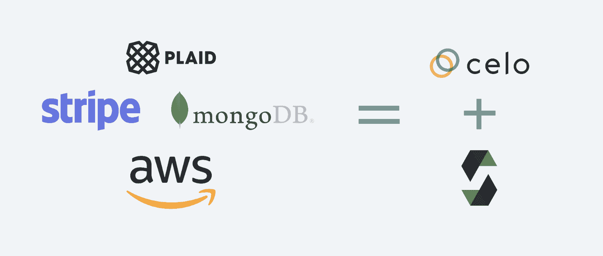](https://camo.githubusercontent.com/7f940f5b0fb1f352df703a54d1bde998fc7972cd0037117af2b1ad6742841bb6/68747470733a2f2f692e696d6775722e636f6d2f335071456a61462e706e67)

Solidity 和 Celo 使构建后端变得容易！更不用说，<g-emoji class="g-emoji" alias="earth_americas" fallback-src="https://github.githubassets.cimg/icons/emoji/unicode/1f30e.png">🌎</g-emoji>从第一天开始。

这个由三部分组成的教程系列将带我们完成智能契约的编写、部署以及使用 Javascript 与之交互。

## 先决条件

点击下图，观看 Youtube 视频“在 Celo 中建立众筹智能合约”。

{ % embed URL = "[https://youtu.be/uOso0av9gj4](https://youtu.be/uOso0av9gj4)" caption = "在 Celo 中构建众筹智能合约" %}

本教程面向中级 Web 3 开发人员。它假设您有一些 Javascript 和 Solidity 编程经验，并且理解基本的以太坊和面向对象编程概念。

在我们继续之前，确保你已经安装了松露。如果没有，请在您的终端中运行以下代码行:

`npm install -g truffle@5.3.12`

**注:**本教程使用节点 v14.16.1

## 项目设置

首先，打开终端并创建一个新的项目文件夹。我们称之为 celo-众筹:

```
mkdir celo-crowdfunding && cd celo-crowdfunding 
```

接下来，让我们用节点包管理器`npm`初始化项目目录:

```
npm init -y 
```

初始化之后，我们需要安装一些额外的包，以便在下一个教程中与智能合约交互:

*   ContractKit 是由 Celo 团队创建的一个包，用于帮助开发
*   [dotenv](https://www.npmjs.com/package/dotenv) 用于读取我们代码中的环境变量
*   web3.js 是一个方便我们与区块链互动的库
*   OpenZeppelin contracts 是一个经过良好测试的 Solidity 代码库，我们将重用它

使用`npm`安装上述所有组件:

```
npm install -—save @celo/contractkit dotenv web3@1.3.6 @openzeppelin/contracts 
```

安装完所有的`npm`包后，在终端中运行`truffle init`来初始化 Truffle。

下面是成功运行的`truffle init`的样子:

[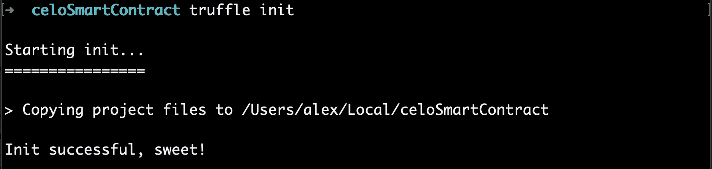](https://camo.githubusercontent.com/96639b87ce3a287a678cff74b466d840f84b83a42403fae9b23287163e275cee/68747470733a2f2f692e696d6775722e636f6d2f4a46367a646f542e706e67)

## 写合同

首先，在您最喜欢的代码编辑器中打开新创建的项目，并在您的`contracts/`文件夹中创建一个名为 **CeloCrowdfund.sol** 的文件。

在文件的顶部，添加 Solidity 版本，并从 OpenZeppelin 导入 SafeMath 契约和 [ERC-20](https://ethereum.org/en/developers/docs/standards/tokens/erc-20/) 接口:

```
pragma solidity >=0.4.22 <0.9.0;

// Importing OpenZeppelin's SafeMath Implementation
import "@openzeppelin/contracts/utils/math/SafeMath.sol";

// IERC-20 contract 
import "@openzeppelin/contracts/token/ERC20/IERC20.sol";
```

SafeMath 是 Solidity 中`uint256`的包装器。我们使用 SafeMath 是因为 Solidity 中的整数容易出现溢出错误，这会给我们的智能合约带来重大问题。

我们还导入了`ERC-20`契约接口，因为它实现了基本的`ERC-20`功能，而 cUSD 使用 ERC-20 标准。

接下来，我们将初始化我们的契约:

```
contract CeloCrowdfund {
  // SafeMath for safe integer operations
  using SafeMath for uint256;

  // List of all the projects
  Project[] private projects;
}
```

这是 CeloCrowdfund 合同的开始。它包括一行使用 SafeMath 的代码和一个`Project`类型的数组。接下来，我们将创建一个名为`Project`的契约，它将处理用户创建的每个项目。

在与`CeloCrowdfund`契约相同的文件中，创建一个`Project`契约和一个名为`ProjectState`的`enum`:

```
contract CeloCrowdfund {
  // SafeMath for safe integer operations
  using SafeMath for uint256;

  // List of all the projects
  Project[] private projects;
}

contract Project {
  using SafeMath for uint256;

  enum ProjectState {
    Fundraising,
    Expired,
    Successful
  }
  IERC20 private cUSDToken;
}
```

我们使用名为`ProjectState`的`enum`来跟踪项目的当前状态。项目可以处于筹资、到期或成功状态。我们使用`enum`，因为它为`ProjectState`创建了一个定制类型。

我们还创建了一个名为`cUSDToken`的私有变量，它的类型是`IERC20`。这是我们将用来与 cUSD 标记交互的变量。

## 扩大项目合同

接下来，我们将添加一些描述`Project`的公共变量。Solidity 中的公共变量可以被任何其他契约或 dApp 访问。我们在合同中公开这些变量，因为我们在与合同交互时需要它们来获得关于`Project`的细节。更多关于实度变量类型的信息，请务必查看[本指南](https://www.bitdegree.org/learn/solidity-variables#control-variable-visibility)。

它应该是这样的:

```
contract Project {
  using SafeMath for uint256;

  enum ProjectState {
    Fundraising,
    Expired,
    Successful
  }

  IERC20 private cUSDToken;

  // Initialize public variables
  address payable public creator;
  uint public goalAmount;
  uint public completeAt;
  uint256 public currentBalance;
  uint public raisingDeadline;
  string public title;
  string public description;
  string public imageLink;

  // Initialize state at fundraising
  ProjectState public state = ProjectState.Fundraising;  

  mapping (address => uint) public contributions;
}
```

初始化变量后，我们创建一个`state`变量，在初始化`Project`契约时作为筹款状态开始。接下来，我们创建一个从用户地址到他们捐赠金额的[映射](https://docs.soliditylang.org/en/latest/types.html#mapping-types),作为一个`uint`,来跟踪对`Project`的捐赠。在 Solidity 中，映射就像哈希表或字典。

现在，我们将添加一些[事件](https://docs.soliditylang.org/en/latest/contracts.html#events)和一个`mapping`后的`modifier`:

```
  // Event when funding is received
  event ReceivedFunding(address contributor, uint amount, uint currentTotal);

  // Event for when the project creator has received their funds
  event CreatorPaid(address recipient);

  modifier theState(ProjectState _state) {
    require(state == _state);
   _;
  }
```

我们将在稍后的合同中使用`ReceivedFunding`和`CreatorPaid`事件在区块链上存储事务日志。这有助于记录时间戳和我们的合同所做的交易。

我们还在契约中使用一个[函数修饰符](https://docs.soliditylang.org/en/latest/contracts.html#function-modifiers)来检查项目的状态是否总是类型`state`。修改器是在 Solidity 中执行功能之前检查条件的一种可重复使用的方法。稍后，我们将在智能契约的几个函数中使用修饰符。

接下来，我们将在修饰符后为`Project`契约添加一个构造函数:

```
constructor
(
  IERC20 token,
  address payable projectCreator,
  string memory projectTitle, 
  string memory projectDescription,
  string memory projectImageLink,
  uint fundRaisingDeadline,
  uint projectGoalAmount
) {
  cUSDToken = token;
  creator = projectCreator;
  title = projectTitle; 
  description = projectDescription; 
  imageLink = projectImageLink; 
  goalAmount = projectGoalAmount;
  raisingDeadline = fundRaisingDeadline;
  currentBalance = 0;
}
```

如果你过去做过一些面向对象的编程，你应该对构造函数很熟悉。它们本质上是我们创建一个`Project`对象所需的参数。

**contribute()函数**

接下来，让我们在`Project`契约中创建一个向项目捐款的函数:

```
// Fund a project
function contribute(uint256 amount) external theState(ProjectState.Fundraising) payable {
  cUSDToken.transferFrom(msg.sender, address(this), amount);

  contributions[msg.sender] = contributions[msg.sender].add(amount);
  currentBalance = currentBalance.add(amount);
  emit ReceivedFunding(msg.sender, amount, currentBalance);

  checkIfFundingExpired();
}
```

`contribute()`函数是一个外部函数。这意味着它只能从其他智能合约或交易中调用。

`contribute()`函数做的第一件事是使用 IERC20 `transferFrom()`函数将参数中传递的金额从`msg.sender`(调用者)发送到`address(this)`(合同):

`cUSDToken.transferFrom(msg.sender, address(this), amount);`

接下来，它将用户的地址添加到映射`contributions`中，将用户的地址作为键，资金金额作为值:

`contributions[msg.sender] = contributions[msg.sender].add(amount);`

然后，该函数更新项目的当前余额并发出一个`ReceivedFunding()`事件:

```
currentBalance = currentBalance.add(amount);

emit ReceivedFunding(msg.sender, amount, currentBalance);
```

**函数**

在`contribute()`的底部，函数调用还不存在的`checkIfFundingCompleteOrExpired();`。让我们现在就开始创造吧！

在`Project`契约中编写以下函数:

```
// check project state
function checkIfFundingExpired() public {
  if (block.timestamp > raisingDeadline) {
    state = ProjectState.Expired;
  }
}
```

该函数检查截止时间是否超过了`block.timestamp`(最近块的当前时间)。如果项目已到期，则状态会更新。

接下来，我们来制作`payOut()`函数。

**支付()功能**

在`checkIfFundingCompleteOrExpired()`功能下，为`payOut()`添加以下内容:

```
function payOut() external returns (bool result) {
  require(msg.sender == creator);

  uint256 totalRaised = currentBalance;
  currentBalance =  0;

  if (cUSDToken.transfer(msg.sender, totalRaised)) {
    emit CreatorPaid(creator);
    state = ProjectState.Successful;
    return  true;
  } 
  else {
    currentBalance = totalRaised;
    state = ProjectState.Successful;
  }

  return  false;
}
```

`payOut()`函数做的第一件事是通过使用`require()`检查调用该函数的地址是否与项目创建者相同。我们这样做是为了确保只有项目创建者可以撤回他们的资金。

接下来，`payOut()`函数会将项目筹集的全部金额发送回项目创建者。它通过从`IERC20`接口调用`tranfer()`函数来实现这一点。

`transfer()`返回一个布尔值。如果有效，那么就发出`CreatorPaid()`事件，并更新状态。如果没有，我们重置`currentBalance`变量并更新状态。

**get details()函数**

最后，我们将在我们的`Project`契约中添加最后一个函数，即`getDetails()`函数。

```
function  getDetails() public  view  returns
(
  address payable projectCreator,
  string memory projectTitle,
  string memory projectDescription,
  string memory projectImageLink,
  uint fundRaisingDeadline,
  ProjectState currentState, 
  uint256 projectGoalAmount, 
  uint256 currentAmount
) {
  projectCreator = creator;
  projectTitle = title;
  projectDescription = description;
  projectImageLink = imageLink;
  fundRaisingDeadline = raisingDeadline;
  currentState = state;
  projectGoalAmount = goalAmount;
  currentAmount = currentBalance;
}
```

这个函数通过返回我们在`Project`契约开始时设置的公共变量来返回关于项目的信息。

`Project`合同到此为止！

## 回到众筹合同

[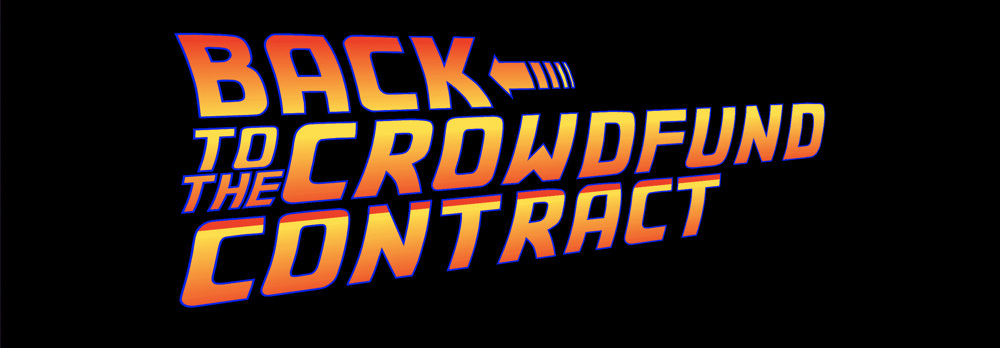](https://camo.githubusercontent.com/75e90561f65531d7d94bd44c6fa0f38acba6768c772482675082a6676cccaf0c/68747470733a2f2f692e696d6775722e636f6d2f5546714a42307a2e706e67)

既然我们已经完成了`Project`合同，是时候回到`CeloCrowdfund`合同了。向上滚动到你的`CeloCrowdfund`合同所在的文件顶部。

我们将从添加一个`event`开始，表示项目开始的时间:

```
contract CeloCrowdfund {
  // SafeMath for safe integer operations
  using SafeMath for uint256;

  // List of all the projects
  Project[] private projects;

  // event for when new project starts
  event ProjectStarted(
    address contractAddress,
    address projectCreator,
    string title,
    string description,
    string imageLink,
    uint256 fundRaisingDeadline,
    uint256 goalAmount
  );
}
```

到目前为止，我们已经在合同的几个地方使用了`events`。当一个项目被创建到区块链时，我们将使用这个`event`来记录。它将获取包含我们用来创建新的`Project`的所有`Project`数据的参数。

接下来，让我们用`startProject()`函数启动一个项目:

```
function startProject(
  IERC20 cUSDToken,
  string calldata title, 
  string calldata description,
  string calldata imageLink,
  uint durationInDays,
  uint amountToRaise
) external {
  uint raiseUntil = block.timestamp.add(durationInDays.mul(1 days));

  Project newProject = new Project(cUSDToken, payable(msg.sender), title, description, imageLink, raiseUntil, amountToRaise);
  projects.push(newProject);

  emit ProjectStarted(
    address(newProject),
    msg.sender,
    title,
    description,
    imageLink,
    raiseUntil,
    amountToRaise
  );
}
```

`startProject()`函数接收创建项目的一些基本信息，如`title`、`description`、`imageLink`、`duration`、`amount`等。

然后，它通过将`durationInDays`乘以`1 days`来计算`raiseUntil`变量的使用天数。这将`durationInDays`变量从`uint`变为`block.timestamp`可以接受的东西。

接下来，我们的`startProject()`函数创建了一个`Project`类型的`newProject`(来自我们的`Project`契约)，带有`Project`契约构造函数的参数。

最后，该函数发出一个`ProjectStarted()`日志。

关于我们的`CeloCrowdfund`契约的最后一件事:我们将添加一个函数来返回所创建的`Projects`的列表:

```
function returnProjects() external view returns(Project[] memory) {
  return projects;
} 
```

这就是我们的两份合同！

## 结论

就这样，我们创建了两个智能合同，允许在 Celo 中进行众筹。

希望创建这个智能合同已经让你意识到什么是可能的。没有太多的麻烦和基础设施设置，我们能够使用这个合同来接受付款，并帮助用户协调为他们想要支持的项目筹集资金。从各方面考虑，对于整个项目后端来说，这并不太长也不复杂。

在下一节中，我们将讨论向 Celo 网络部署我们编写的合同！

**注**:本教程和智能合约是基于本教程作者开发的 app co eracha 的[合约。如果你想在移动应用中看到这些合同，你可以在这里](https://github.com/Alex-Neo-Projects/Coperacha-contracts)看到一个[的例子。](https://github.com/Alex-Neo-Projects/Coperacha-app)

# 在 Celo 中部署众筹智能合约

如果你已经完成了本教程系列的第 1 部分，你就有了一份用 Solidity 编写的众筹合同。现在我们已经有了一个众筹合同，我们需要将它部署到 Celo 测试网络，以便与之进行交互。让我们现在就做吧！

## 先决条件

本教程假设您已经遵循并完成了第 1 部分(在 Celo 中构建众筹智能契约)。如果您还没有，请先返回并遵循该教程。

点击下图，观看 YouTube 视频“在 Celo 中部署众筹智能合约”。

{ % embed URL = "[https://youtu.be/HShFGDvBgNk](https://youtu.be/HShFGDvBgNk)" }

## 部署设置

首先打开终端，`cd`进入 Celo 众筹项目文件夹。

`cd celo-crowdfunding`

## 迁移文件夹

如果文件夹中已经有`1_initial_migration.js`文件，删除它。

接下来，创建一个名为`1_celo_crowdfund.js`的新文件，并编写以下内容:

```
const CeloCrowdfund = artifacts.require("CeloCrowdfund");

module.exports = function (deployer) {
  deployer.deploy(CeloCrowdfund);
};
```

Truffle 中的迁移本质上是部署脚本。我们所写的是一个非常简单的部署脚本，它接受我们的契约(`CeloCrowdfund`)并部署它。

## 连接到测试网络节点

我们将使用 DataHub 连接到 Celo 测试网络。如果您没有帐户，请在 [DataHub](https://datahub.figment.io) 网站上注册，一旦您有了 Celo API 密钥，就可以继续学习本教程。

现在我们有了一个用于数据中心节点的 API 密钥，我们想要保护它。获得您的 API 密钥的任何人都可以使用您的 DataHub 帐户的节点。为了保护它，让我们在`celoSmartContract`文件夹的**根目录**中创建一个`.env`文件。`.env`文件用于环境机密，这意味着它是存储 DataHub API 密匙的最佳位置。

要创建这个`.env`文件，导航到项目的根目录，并在终端中键入以下命令:

`touch .env`

接下来，在文本编辑器中打开`.env`文件，并添加以下变量，确保在`/`之间输入 API 键:

`REST_URL=https://celo-alfajores--rpc.datahub.figment.io/apikey/<YOUR API KEY>/`

**注意:**在 URL 的末尾需要有一个尾随的`/`它才能工作！

**注意:**如果计划将这个回购协议提交到 Github 中，您不需要上传`.env`文件的内容。要让 Git 忽略`.env`文件，从终端创建一个`.gitignore`文件，如下所示:

`touch .gitignore`

在`.gitignore`中，将以下内容放入新的一行:

```
.env 
```

就是这样！Git 现在会忽略`.env`文件。

## 获得 Celo 帐户

接下来，我们需要一个 Celo 帐户进行部署。部署时我们需要三样东西:

*   Celo 帐户地址
*   Celo 帐户私钥
*   装有测试网资金的 Celo 账户

首先，让我们获得一个帐户和一个私钥。在项目文件夹中创建一个名为 **getAccount.js** 的文件。在该文件中，编写以下内容:

```
const ContractKit = require('@celo/contractkit');

const Web3 = require('web3');

require('dotenv').config();

const main = async() =>  {
  const web3 = new Web3(process.env.REST_URL);
  const client = ContractKit.newKitFromWeb3(web3);

  const account = web3.eth.accounts.create();

  console.log('address: ', account.address);
  console.log('privateKey: ', account.privateKey);
};

main().catch((err)  =>  {
  console.error(err);
});
```

我们来分析一下。

首先，脚本导入`ContractKit`、`Web3`和`dotenv`。接下来，它使用下面的代码行通过`.env`文件中的 REST_URL 连接到 Celo 网络:

```
const web3 = new Web3(process.env.REST_URL);
```

然后，它在同一个 testnet 连接上创建一个帐户，代码如下:

```
const account = web3.eth.accounts.create();
```

之后，我们只需打印出地址和私钥以备将来使用。

**注:**以上代码来自 [#2。创建您的第一个 Celo 账户](https://learn.figment.io/network-documentation/celo/tutorial/intro-pathway-celo-basics/2.account)，因此如果您需要评论，请随意回放。

接下来，在终端中用命令`node getAccount.js`运行脚本。

输出应该打印出您的新 Celo 帐户的地址和私钥。它看起来会像这样:

[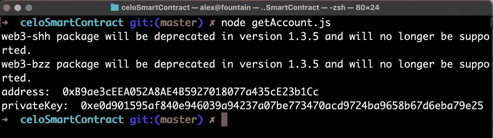](https://camo.githubusercontent.com/85e62204e4c406103e375245afef4c7ee1fb83998bf2b08e168044c4863fd42b/68747470733a2f2f692e696d6775722e636f6d2f7571314c5854662e706e67)

**注意:**确保您的私钥安全非常重要！不管是谁拿到了它，他都可以访问你在 Celo 上的所有资金。

通过添加带有`PRIVATE_KEY=YOUR-PRIVATE-KEY`的一行将私钥复制到`.env`文件中，其中 **YOUR-PRIVATE-KEY** 是您从脚本输出中获得的私钥。

现在您已经有了一个 Celo 帐户，获取地址并将其粘贴到 [Celo developer 水龙头](https://celo.org/developers/faucet)中。这将为您提供 testnet 资金，您可以使用这些资金来部署智能合同。填好表格，等几秒钟，你的账户就应该加载完毕了。

[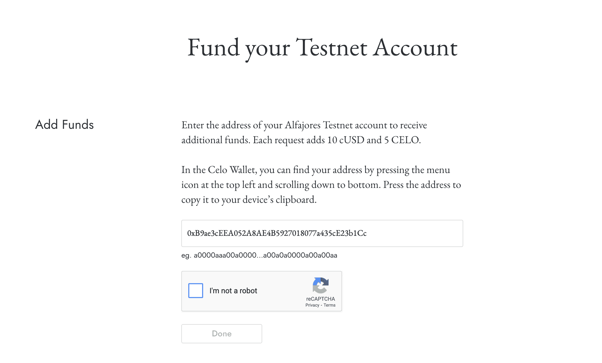](https://camo.githubusercontent.com/0c74bcb5251da3397bae2c6901c25218a6ff73befb825a53c546181e95e0db06/68747470733a2f2f692e696d6775722e636f6d2f7a5074575748572e706e67)

## 块菌配置

使用 **truffle-config.js** 是为了告诉 truffle 您希望如何部署合同。

出于我们的目的，我们需要将以下代码添加到 truffle-config 项目文件中:

```
const ContractKit = require('@celo/contractkit');
const Web3 = require('web3');

require('dotenv').config({path: '.env'});

// Create connection to DataHub Celo Network node
const web3 = new Web3(process.env.REST_URL);

const client = ContractKit.newKitFromWeb3(web3);

// Initialize account from our private key
const account = web3.eth.accounts.privateKeyToAccount(process.env.PRIVATE_KEY);

// We need to add private key to ContractKit in order to sign transactions
client.addAccount(account.privateKey);

module.exports = {
  compilers: {
    solc: {
      version: "0.8.0",    // Fetch exact version from solc-bin (default: truffle's version)
    }
  },
  networks: {
    test: {
      host: "127.0.0.1",
      port: 7545,
      network_id: "*"
    },
    alfajores: {
      provider: client.connection.web3.currentProvider, // CeloProvider
      network_id: 44787  // latest Alfajores network id
    }
  }
};
```

首先，配置文件像`getAccounts.js`文件一样导入`ContractKit`、`Web3`和`dotenv`。

它通过从`.env`获取`REST_URL`来连接到我们的 Celo 节点:

```
const web3 = new Web3(process.env.REST_URL);
```

然后，它从`.env`文件中的私钥获取帐户，以便从您的帐户进行部署:

```
const account = web3.eth.accounts.privateKeyToAccount(process.env.PRIVATE_KEY);
```

我们还将私钥添加到`ContractKit`中，以便与以下用户签署交易:

```
client.addAccount(account.privateKey);
```

最后，在`module.exports`函数中，我们在`compilers: {`下设置我们想要使用的 Solidity 版本，在`networks: {`下设置我们想要部署的网络。

下面的代码块告诉 truffle 部署到 Alfajores (Celo 的 testnet):

```
alfajores: {
    provider: client.connection.web3.currentProvider, // CeloProvider
    network_id: 44787  // latest Alfajores network id
}
```

## 部署

我们快到了！运行`truffle compile`来检查你做的一切都是正确的。如果一切正常，您应该会看到以下输出:

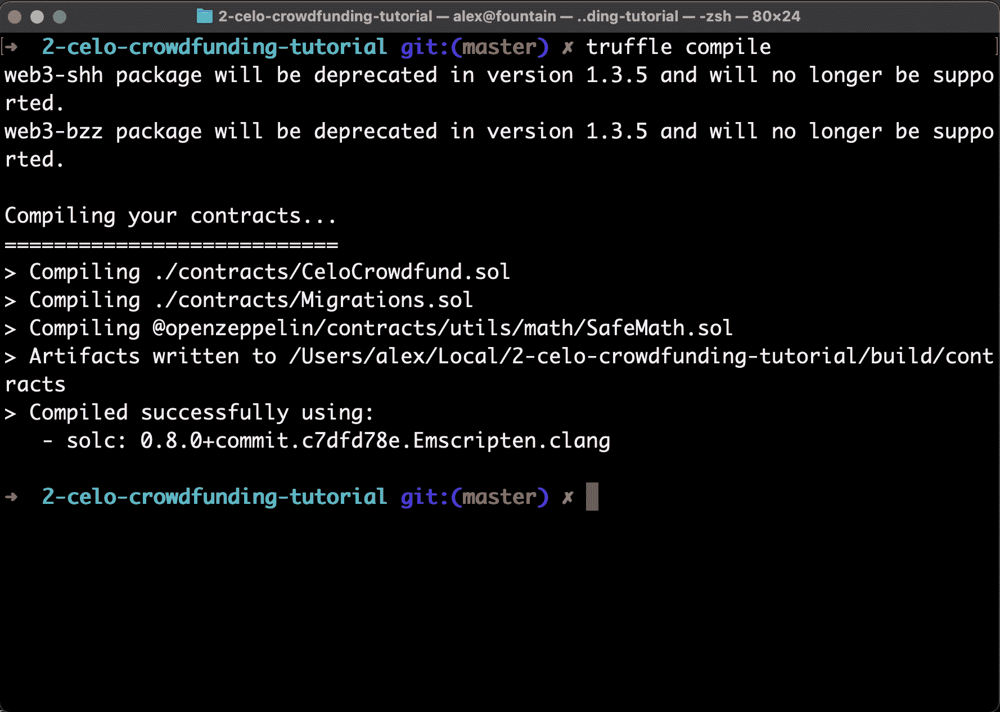

既然我们已经编译了智能合约，最后一步就是部署它。运行以下命令以部署到 Alfajores testnet:

```
truffle migrate --network alfajores 
```

您应该会看到以下部署输出:

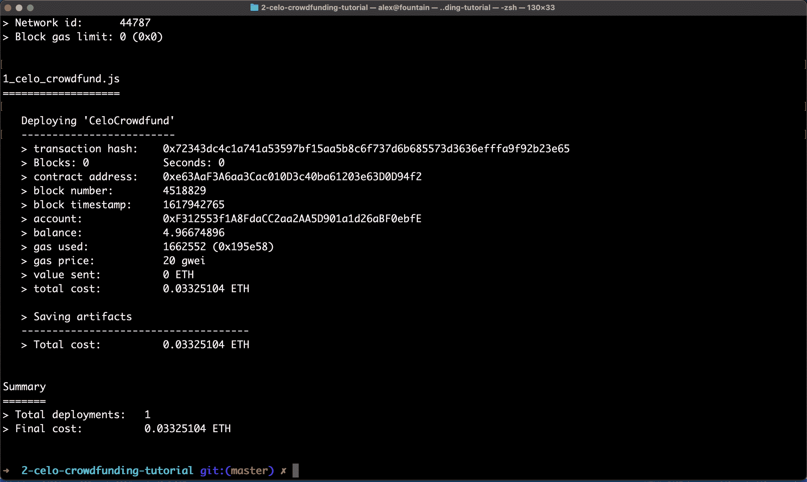

如果您看到类似上面的内容，代码就工作了！要查看 Celo 网络上的智能合同，请打开 [Alfajores 块浏览器](https://alfajores-blockscout.celo-testnet.org/) &从块菌输出中粘贴合同地址行上的地址:

`> contract address: YOUR-CELO-ADDRESS`

您应该在块资源管理器中的该地址看到一个成功的合同部署:

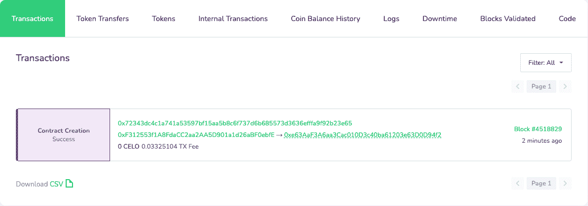

## 后续步骤

现在，我们已经在 Celo 上部署了 Celo 众筹智能合同，我们可以继续与它进行交互。在下一个教程中，我们将通过创建新的众筹项目并向它们捐款来与我们的智能合同进行交互。

## 潜在错误和解决方案

如果你遇到任何问题，请随时询问[figument Learn Discord](https://discord.gg/f5YuEsQTAx)。也可以在 GitHub 上查看源代码[。无论如何，这里有一些你可能会遇到的常见错误。](https://github.com/alexreyes/Celo-Crowdfunding-Tutorial-2)

如果出现以下错误:

`Error: Invalid JSON RPC response: {"message":"no Route matched with those values"}`

[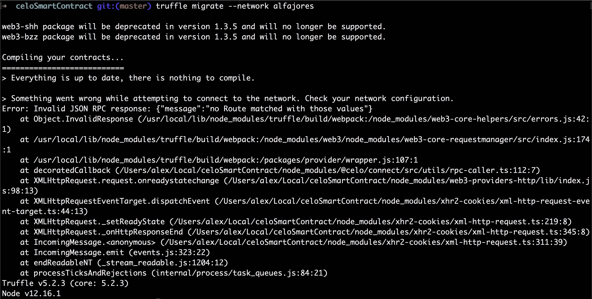](https://camo.githubusercontent.com/b10c13fb11358a60891ccd1e3191e40ffe54d19ffef9b3f0b127e3e567eed1b6/68747470733a2f2f692e696d6775722e636f6d2f42384c657272552e706e67)

然后是**中的 **REST_URL** 有问题。env** 文件。

确保 URL 末尾有一个结尾 **/** ！它应该是这样的:

`REST_URL = https://celo-alfajores--rpc.datahub.figment.io/apikey/YOUR-API-KEY/`

如果合同没有部署到测试网络，输出可能如下所示:

[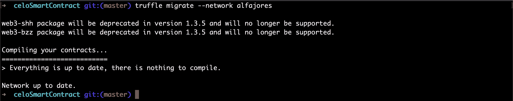](https://camo.githubusercontent.com/a59c20e99081c85f182da44f68a167aec86a58da7c690367b4dbe35f57673943/68747470733a2f2f692e696d6775722e636f6d2f703637645a444d2e706e67)

合同是在哪里编译的，但它没有给出部署的地址。

要解决这个问题，请确保你的账户已经从水龙头中注入了 [testnet 资金。](https://celo.org/developers/faucet)

如果您想再次检查您的账户是否收到了资金，请进入 [Alfajores block explorer](https://alfajores-blockscout.celo-testnet.org/) 并搜索您的账户地址。

确保你的账户不是像这个一样空的！

[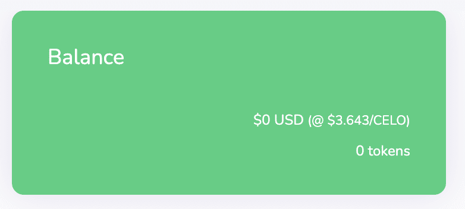](https://camo.githubusercontent.com/60a2da1b381d2d9f9c21ade38e54f3793ead7bf2162d4eb7ccb8297733494cbc/68747470733a2f2f692e696d6775722e636f6d2f795055594353442e706e67)

# 与众筹智能合约互动

欢迎来到这个三部分系列的最后一个教程，在 Celo 上创建众筹智能合同。在最后一部分中，我们将编写 Javascript 代码，以便与我们在前两部分中编写和部署的智能契约进行交互。

现在我们在 Celo 测试网络上有了我们的智能合约，是时候使用它了！

## 先决条件

您将需要我们在第 1 部分中编写的智能契约，以及您在第 2 部分中进行的部署。因此，要使本教程中的代码正常工作，您需要完成前面的两个教程。

点击下图，观看 YouTube 视频“与众筹智能合约互动”。

{ % embed URL = "[https://youtu.be/C24prS3bk_I](https://youtu.be/C24prS3bk_I)" caption = "与众筹智能合约互动" %}

## 设置

第一步是创建一个 Javascript 文件来编写我们的智能合约交互。在`celo-crowdfunding`文件夹的根目录下，创建一个名为`interact.js`的文件。

我们将使用在第一节教程中通过 NPM 安装的包。我们还需要一个额外的模块 BigNumber，以便处理塞洛区块链使用的大数。

在终端中，运行`npm install bignumber.js`。这一步的设置就到此为止！

[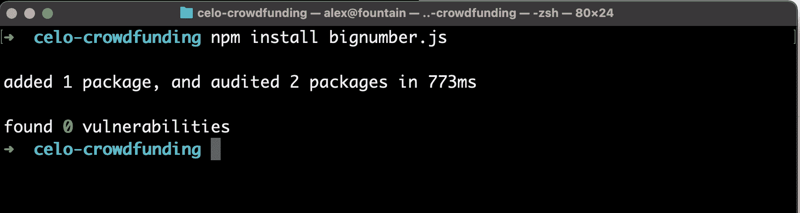](https://camo.githubusercontent.com/3213a0c04a5f729999eba97fe70f94418bb36fc9c8dae52595428d29afd52480/68747470733a2f2f692e696d6775722e636f6d2f546e377a396f7a2e706e67)

## 导入我们的模块

与我们的智能合约进行交互的第一步是导入脚本所需的模块。

在`interact.js`文件的顶部，写下以下内容:

```
const Web3 = require('web3');
const ContractKit = require('@celo/contractkit');
const web3 = new Web3('https://alfajores-forno.celo-testnet.org');
const kit = ContractKit.newKitFromWeb3(web3);
const CeloCrowdfund = require('./build/contracts/CeloCrowdfund.json');
const Project = require('./build/contracts/Project.json');
const BigNumber = require('bignumber.js');

require('dotenv').config({path:  '.env'});
```

我们稍后将使用所有这些模块，以便与我们之前制定的众筹合同进行交互。

## 拿到我们的合同

接下来，我们希望将智能合约作为一个变量来使用。我们还需要获得我们的 Celo 帐户，因为我们将向网络发送交易。

导入后，编写以下内容:

```
// Get Celo account info

let account = web3.eth.accounts.privateKeyToAccount(process.env.PRIVATE_KEY);
kit.connection.addAccount(account.privateKey)
```

上面的代码从`.env`文件中导入我们在第二个教程中设置的私钥，并将其放入 account 变量中。它还将 Celo 帐户添加到 contractKit。

接下来，让我们创建一个异步函数，我们将在其中编写与智能合约的交互:

```
async function interact()  {
  // Check the Celo network ID
  const networkId = await web3.eth.net.getId();

  // Get the contract associated with the current network
  const deployedNetwork = CeloCrowdfund.networks[networkId];

  // Create a new contract instance from the celo crowdfund contract
  let celoCrowdfundContract = new kit.web3.eth.Contract(CeloCrowdfund.abi, deployedNetwork && deployedNetwork.address);

  console.log("Account address: ", account.address);
  console.log(celoCrowdfundContract);
}

interact();
```

让我们运行这个。在终端中，键入:`node interact.js`。结果应该如下所示:

[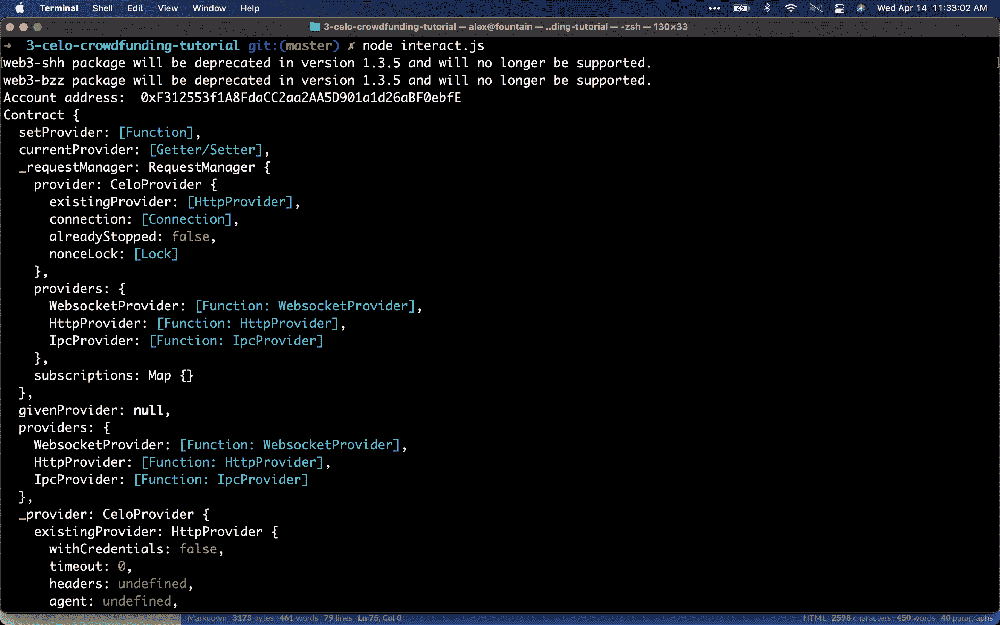](https://camo.githubusercontent.com/816271634c24ea7082e5ac86c65d0ec40218d6c5ba07a21046dfea1fab36c0ac/68747470733a2f2f692e696d6775722e636f6d2f6d7470304463332e706e67)

如果一切顺利，输出应该显示帐户地址和我们创建的合同。合同输出看起来不同于常规的可靠性代码，因为它是一个[合同 ABI](https://docs.soliditylang.org/en/v0.5.3/abi-spec.html) 。

太好了！因此，我们已经验证了合同被正确导入，并且我们的帐户正常工作。

接下来，注释掉`celoCrowdfundContract`变量的`console.log`，因为我们不再使用它。

下一步是创建一个新的`Project`。在`interact()`之外创建一个名为`createProject()`的新函数:

```
async function createProject(celoCrowdfundContract, stableToken, gasPrice)  {
  var projectGoal = BigNumber(1E18);
  await celoCrowdfundContract.methods.startProject(stableToken.address, 'Test project', 'We are testing the create project function', 'https://i.imgur.com/Flfo4hJ.png',  5, projectGoal).send({from: account.address, feeCurrency: stableToken.address, gasPrice: gasPrice});
  console.log("Created new project");
}
```

该函数将`celoCrowdfunding`、`stableToken`和`gasPrice`作为参数。然后它使用`BigNumber`创建一个`projectGoal`。

我们创建一个大小为 1，000，000，000，000，000 或 1^18 的数字，因为 cUSD 有 18 位小数。Solidity 不支持浮点数，所以解决方法是生成非常大的数。1^18 cUSD 等于 1 美元 cUSD。

接下来，我们调用众筹合同中的`startProject()`方法，并传入它需要的参数。如果我们回到`CeloCrowdfund.sol`契约，我们会看到`createProject()`方法接受如下内容:

```
function startProject(
  IERC20 cUSDToken,
  string calldata title,
  string calldata description,
  string calldata imageLink,
  uint durationInDays,
  uint amountToRaise
)
```

这些是我们调用函数时提供的参数。

现在我们有了它，我们将创建一个 stableToken 变量，它使用`ContractKit` stabletoken 包装器来获取对 cUSD 硬币的引用。

我们还会将汽油价格传递到我们的函数中。为了更快地确认我们的交易，我们将把汽油价格设置得高于推荐的最低价格。想要了解 Celo 的汽油费，请随意查看这篇文章。

得到这两个变量后，我们将调用`interact()`中的`createProject()`辅助函数。我们还将使用我们的`CeloCrowdfund`合同中的`returnProjects()`函数返回我们合同中的所有项目，以验证它是否工作:

```
  // Print wallet address so we can check it on the block explorer
  console.log("Account address: ", account.address);

  // Get the cUSD ContractKit wrapper
  var stableToken = await kit.contracts.getStableToken();

  // Get the gas price minimum and set the new gas price to be double
  const gasPriceMinimumContract = await kit.contracts.getGasPriceMinimum()
  const gasPriceMinimum = await gasPriceMinimumContract.getGasPriceMinimum(stableToken.address)
  const gasPrice = Math.ceil(gasPriceMinimum * 2) // This should be much higher than the current average, so the transaction will confirm faster

  await createProject(celoCrowdfundContract, stableToken, gasPrice);

  // Return projects inside the celo crowdfund contract
  var result = await celoCrowdfundContract.methods.returnProjects().call();

  console.log("List of addressses for each of the projects created:", result);
```

运行代码后，您应该会看到创建的新项目。

## 向项目汇款

现在我们已经创建了一个项目，我们需要给它寄一些钱。

就像我们如何创建一个名为`celoCrowdfundContract`的变量来访问我们的`CeloCrowdfund`契约一样，我们需要创建一个变量来访问`Project`契约。

为此，我们可以编写以下代码:

```
var projectInstanceContract = new web3.eth.Contract(
  Project.abi,
  deployedNetwork && result[result.length - 1] // Get the most recently deployed Project
);
```

这将创建一个变量，从由`returnProjects()`函数返回的数组中访问最近创建的项目合同实例。

现在我们可以访问我们的项目了，为了将 cUSD 发送到合同，我们需要做两件事。由于 cUSD 遵循 [ERC-20](https://ethereum.org/en/developers/docs/standards/tokens/erc-20/) 标准，我们需要在汇款前批准将 cUSD 发送给合同。批准后，我们可以发送 cUSD 到我们的合同。

作为一个例子，我们将在合同中批准一大笔货款。要批准发送 500 cUSD，请填写以下内容:

```
  // Approve the project to spend up to 500 cUSD from wallet
  var approveAmount = BigNumber(500E18);
  await stableToken.approve(projectInstanceContract._address, approveAmount).sendAndWaitForReceipt({from: account.address});
```

太好了！现在我们已经批准了接受 500 美元的合同。下一步是实际发送一些钱。

在`interact()`函数之外，创建一个名为`contribute()`的新函数:

```
async function contribute(stableToken, projectInstanceContract, gasPrice)  {
  var sendAmount = BigNumber(2E18);

  // Call contribute() function with 2 cUSD
  await projectInstanceContract.methods.contribute(sendAmount).send({from: account.address, feeCurrency: stableToken.address, gasPrice: gasPrice});

  console.log("Contributed to the project\n");
}
```

在`contribute()`函数中，我们创建了一个名为`sendAmount`的变量，它被设置为 2E18。这相当于 2 cUSD。接下来，我们使用我们的`projectInstanceContract`变量来调用我们的`Project()`契约中的`contribute()`函数。

回到我们的`interact()`函数，让我们调用我们创建的`contribute()`助手函数:

```
  await contribute(stableToken, projectInstanceContract, gasPrice);
```

## 显示我们的余额

现在我们关心两个 cUSD 余额:我们的 Celo 钱包的余额，以及我们的项目的余额,`contribute()`函数将 2 个 cUSD 发送到这个项目。

在`interact()`函数之外，创建一个名为`createBalances()`的助手函数来打印所有内容:

```
async function printBalances(stableToken, projectInstanceContract)  {

  var balanceOfUser = (await stableToken.balanceOf(account.address)).toString();

  console.log("User's address: ", account.address);
  console.log("User's cUSD balance: ", balanceOfUser/1E18, " cUSD\n");

  var balanceOfContract = (await stableToken.balanceOf(projectInstanceContract._address)).toString();

  console.log("Contract address: ", projectInstanceContract._address);
  console.log("Contract cUSD balance: ", balanceOfContract/1E18,  " cUSD\n");
}
```

`printBalances()`函数使用`stableToken`变量的`balanceOf()`函数来获取我们的 Celo 钱包的 cUSD 余额。然后我们使用同样的`balanceOf()`函数来获得合同的余额，然后我们把它全部打印出来。

接下来，在`interact()`函数中，在`contribute()`之后调用`printBalances()`函数:

```
await printBalances(stableToken, projectInstanceContract);
```

## 从我们的项目合同中支付

到目前为止，我们能够创建一个项目，并为其提供资金。最后一步是支付我们的合同！

在`interact()`函数之外，创建一个名为`payOut()`的助手函数:

```
async function payOut(stableToken, projectInstanceContract, gasPrice)  {
  var payOut = await projectInstanceContract.methods.payOut().send({from: account.address, feeCurrency: stableToken.address, gasPrice: gasPrice});
  console.log("Paying out from project");
}
```

`payOut()`函数调用我们的`Project`智能契约中的`payOut()`函数。这将把所有资金退回给项目创建者。

最后，让我们在`interact()`函数中调用`payOut()`助手函数:

```
  await contribute(stableToken, projectInstanceContract, gasPrice);
  await printBalances(stableToken, projectInstanceContract);

  await payOut(stableToken, projectInstanceContract, gasPrice);

  console.log("After pay out: ");
  await printBalances(stableToken, projectInstanceContract);
```

我们希望在打印前等待 5 秒钟，以确保`payOut()`交易已经在区块链上确认。

现在让我们运行代码！在您的终端中，键入:`node interact.js`

输出应该如下所示:

[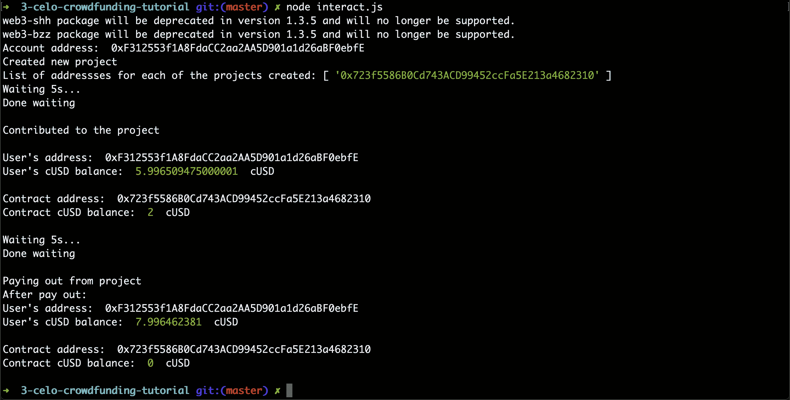](https://camo.githubusercontent.com/fce61eef5911a837e1f921d3d318485719430aefe250acc73aa84d6fa0f90762/68747470733a2f2f692e696d6775722e636f6d2f5032757965764e2e706e67)

厉害！正如我们从终端输出中看到的，我们的脚本创建了一个新项目，向它贡献了 2 cUSD，等待 5 秒，然后从项目中支付。我们可以看到 2 cUSD 从 Celo 钱包->合同->回到钱包的流程。

有用！

## 结论

这个由三部分组成的系列向您展示了如何为 Celo 编写一个智能契约，部署它，然后与我们创建的智能契约进行交互。

您可以使用第三个教程作为起点，与使用 Javascript 创建的任何智能契约进行交互。无论您是创建 web dApp 还是移动 dApp，您都可以使用此代码来与您的合同进行交互。

如果你遇到任何问题，请随时询问[figument Learn Discord](https://discord.gg/f5YuEsQTAx)。你也可以在这里查看源代码

# 关于作者

书面教程是由亚历克斯·雷耶斯创作的。Alex 是一名学生(计算机科学学士),同时也是一名加密爱好者，他每天都在学习有关 web3 世界的知识，并积极为 Web3 社区做出贡献。他之前在脸书和微软完成了实习。

这些视频由 [Neo Cho](https://www.linkedin.com/in/neocho/) 制作。Neo 是中佛罗里达大学的学生(计算机科学学士)。他喜欢学习加密，并对 web3 的未来感到兴奋。