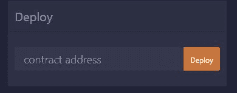
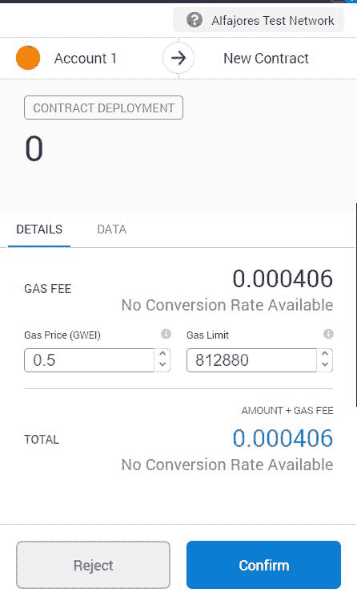
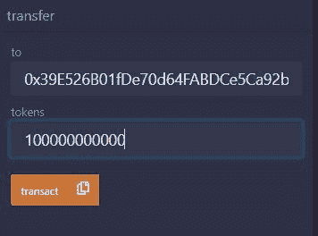
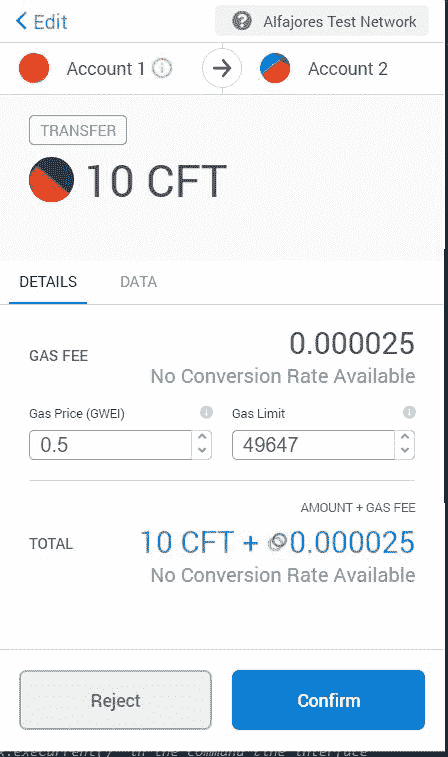
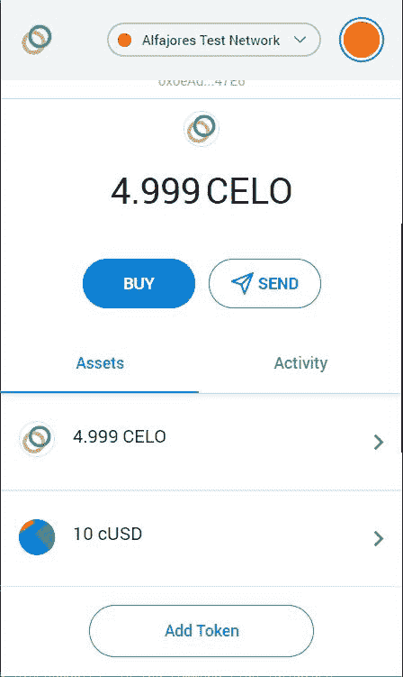
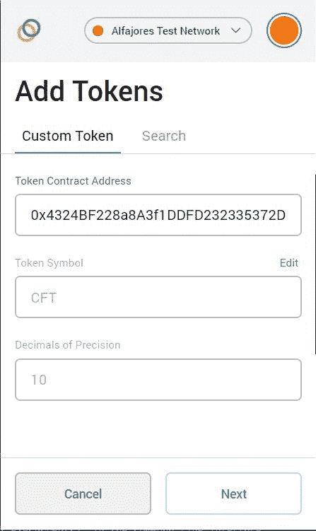

# 介绍

> 原文:[https://github . com/fig ment-networks/learn-tutorials/blob/master/celo/celo-ERC 20-token-on-remix . MD](https://github.com/figment-networks/learn-tutorials/blob/master/celo/celo-erc20-token-on-remix.md)

了解可以在 Celo 这样的区块链上交易或出售的不同类型的代币非常重要。区块链令牌有许多用例，开发人员一直在想出新的用例。本教程将向你展示如何使用 Solidity 智能契约语言在 Celo 上创建你自己的**可替换的**令牌。

# 先决条件

1.  混合的 Celo 环境设置，教程可以在[这里](https://learn.figment.io/tutorials/celo-for-remix)找到
2.  [固体](https://https://solidity-by-example.org/)和[混合 IDE](https://remix.ethereum.org) 的基本知识

# 什么是代币？

代币是一种度量单位，其中一些可以在虚拟世界中使用。令牌可以表示创建者希望它具有的任何值。一些例子:

*   公司的股份
*   网络游戏中的玩家货币
*   DeFi 项目治理中的一个影响单位
*   一件艺术品或媒体

# 令牌的类型

概括地说，这些数字令牌可以分为两类:

## a.可替换令牌:

可替代性意味着**可以被另一个相同的项目替代**。简单地说，代币具有相等的价值并且可以互换。这可以理解为与法定货币相同的方式——某种面额的美元钞票。除了在非常特殊的情况下，任何一张五元钞票都可以被任何一张五元钞票所取代之外，每一张五元钞票都是等价的。加密货币令牌的确切价值可能会发生变化，但一个可替代令牌可以提供与同一链上合同发行的任何其他可替代令牌相同的功能。

## b.不可替换令牌(NFT):

正如您所猜测的，这些与可替换令牌正好相反:它们是不可替换的。每个不可替换的令牌都是唯一的，因此不能互换。例子可以是数字艺术或歌曲。

在这个例子中，我们将学习如何铸造**可替换的**代币。我们将使用在区块链**以太坊**上非常流行的可替换代币的标准接口，并学习如何在 **Celo** 上构建类似的代币。

# ERC-20 标准

ERC-20 是以太坊上用于构建可替换令牌的标准接口。名称中的“ERC”部分指的是“以太坊请求评论”,是以太坊基金会以及许多主要在以太坊上开发的项目所采用的标准。

因为 Solidity 语言可以被任何与 EVM 兼容的区块链使用，所以整个标准可以在 Celo 上复制，几乎不需要额外的工作。

该界面包含一些**功能**:

```
// Optional
function name() public view returns (string)
function symbol() public view returns (string)
function decimals() public view returns (uint)
// Required
function totalSupply() public view returns (uint)
function balanceOf(address tokenOwner) public view returns (uint balance)
function allowance(address tokenOwner, address spender) public view returns (uint remaining)
function transfer(address to, uint tokens) public returns (bool success)
function approve(address spender, uint tokens) public returns (bool success)
function transferFrom(address from, address to, uint tokens) public returns (bool success)
```

以及一些**事件**:

```
event Transfer(address indexed from, address indexed to, uint tokens)
event Approval(address indexed tokenOwner, address indexed spender, uint tokens)
```

在区块链上部署我们的智能合约之前，需要对这些进行定义。

在本教程中，我们将创建一个 ERC-20(可替换)代币的极简版本。

# 定义功能和事件

我们将我们的合同命名为`CeloFungibleToken`,实现如下所示。在 Remix 上创建一个名为`erc20.sol`的新文件，并复制下面的代码:

```
// WARNING: This contract should not be used in production

pragma solidity ^0.5.0;

contract ERC20Interface {
    function totalSupply() public view returns (uint);
    function balanceOf(address tokenOwner) public view returns (uint balance);
    function allowance(address tokenOwner, address spender) public view returns (uint remaining);
    function transfer(address to, uint tokens) public returns (bool success);
    function approve(address spender, uint tokens) public returns (bool success);
    function transferFrom(address from, address to, uint tokens) public returns (bool success);

    event Transfer(address indexed from, address indexed to, uint tokens);
    event Approval(address indexed tokenOwner, address indexed spender, uint tokens);
}

contract CeloFungibleToken is ERC20Interface{
    string public name;                          // name of the token
    string public symbol;                        // symbol of token
    uint8 public decimals;                       // divisibility of token
    uint256 public _totalSupply;                 // total number of tokens in existence

    mapping(address => uint) balances;
    mapping(address => mapping(address => uint)) allowed;

    constructor() public {
        name = "CeloFungibleToken";
        symbol = "CFT";
        decimals = 10; 
        _totalSupply = 10000000000000; // total tokens would equal (_totalSupply/10**decimals)=1000

        /** 
 * decimals means the unit of divisibility we want for our tokens,
 * For example if we want a divisibility of 10^(-3) and total supply of 1000 tokens then
 * decimals = 3 and _totalSupply = 1000000
 **/

        balances[msg.sender] = _totalSupply;
        emit Transfer(address(0), msg.sender, _totalSupply);
    }

    function totalSupply() public view returns (uint) {
        return _totalSupply  - balances[address(0)];
    }

    function balanceOf(address tokenOwner) public view returns (uint balance) {
        return balances[tokenOwner];
    }

    // This function allows an address to give an allowance to another address (spender) 
    // to be able to retrieve tokens from it. 

    function allowance(address tokenOwner, address spender) public view returns (uint remaining) {
        return allowed[tokenOwner][spender];
    }

    function approve(address spender, uint tokens) public returns (bool success) {
        allowed[msg.sender][spender] = tokens;
        emit Approval(msg.sender, spender, tokens);
        return true;
    }

    function transfer(address to, uint tokens) public returns (bool success) {
        balances[msg.sender] = balances[msg.sender]- tokens;
        balances[to] = balances[to] +  tokens;
        emit Transfer(msg.sender, to, tokens);
        return true;
    }

     // This function moves the amount of tokens from sender to recipient and the given amount is 
     // then deducted from the caller’s allowance. 

    function transferFrom(address from, address to, uint tokens) public returns (bool success) {
        balances[from] = balances[from] -  tokens;
        allowed[from][msg.sender] = allowed[from][msg.sender] -  tokens;
        balances[to] = balances[to] + tokens;
        emit Transfer(from, to, tokens);
        return true;
    }
}
```

我们的合同现在应该可以编译了。

# 部署

我们将在 Celo 的 Alfajores 测试网上部署我们的合同。我们需要确保我们的 testnet 账户有足够的余额。我们可以从 Celo 开发者水龙头获得免费的 testnet 余额。

# 程序

a.在 Celo Wallet 上选择我们要部署智能合约的帐户。确保选择 Alfajores testnet 上的帐户！

b.点击**部署**按钮。
T3

c.使用 celo wallet 支付`transaction fee`并签署交易。

[](https://raw.githubusercontent.com/figment-networks/learn-tutorials/master/assets/signing-transaction-celo.JPG)

**恭喜你！**我们已经在 Celo 区块链上部署了我们自己的可替换令牌。通常需要大约 5 秒钟来完成我们的交易。一旦我们的交易被确认，让我们去[看看所有的细节。](https://alfajores-blockscout.celo-testnet.org/)

[这里的](https://alfajores-blockscout.celo-testnet.org/address/0x4324bf228a8a3f1ddfd232335372d5cbaae38cd1/transactions)是本例中显示的智能合约部署的详细信息。

# 转移代币

现在，我们的合同已经部署，我们拥有 Celo Blockchain 上存在的所有 CFT 令牌。有许多方法可以将令牌从一个地址转移到另一个地址。我们将讨论几种方法。

**1。智能合同交互**:

a.选择在 Celo extension wallet 上拥有 1000 CFT 的帐户，例如`0x0eAd666A5B65ED614990fD582693039ed49847E6`(您可以使用上面给出的链接在 Blockscout 上验证)。

b.在“transfer”选项卡中，我们需要输入我们要向其转移代币的账户的 **Alfajores Testnet 地址**，以及要转移的代币金额。对于本教程，我们将使用`0x39E526B01fDe70d64FABDCe5Ca92b47789AA231D`并发送 10 个 CFT 代币(注意我们在合同中定义的小数)。

[](https://github.com/figment-networks/learn-tutorials/raw/master/assets/transfer-tab-celo-extension.JPG)

c.点击`Transact`

[](https://github.com/figment-networks/learn-tutorials/raw/master/assets/sending-token-celo-remix.JPG)

d.支付`transaction fee`

至此，我们已经了解了如何将您的可替换代币转移到其他地址。但仍有一个问题，我们无法在我们的 Celo 钱包上看到我们的代币。要显示令牌，我们需要:

*   选择 Celo wallet 上的**添加令牌**按钮，如图所示。

[](https://github.com/figment-networks/learn-tutorials/raw/master/assets/celo-extension-wallet.JPG)

*   在**令牌合同地址**中输入合同地址，点击`Next`。

[](https://github.com/figment-networks/learn-tutorials/raw/master/assets/token-address-celo-wallet.JPG)

*   点击`Add token`

现在我们可以看到我们的代币余额了！

[](https://github.com/figment-networks/learn-tutorials/raw/master/assets/celo-wallet-after-token-addition.JPG)

**2\. Celo Wallet**

将令牌地址添加到我们的钱包后，只需点击发送按钮并输入收件人的地址。代币将在签署交易并支付交易费用后转移。

# 结论

在本教程中，我们学习了:

1.  可替换令牌的一些不同用例
2.  有不同标准的不同类型的令牌
3.  如何在 Celo 区块链上部署自定义可替换令牌
4.  如何通过 Celo 发送代币！

我们迫不及待地想看看你创造了什么！