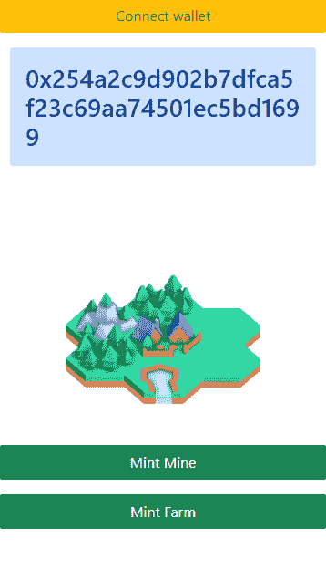
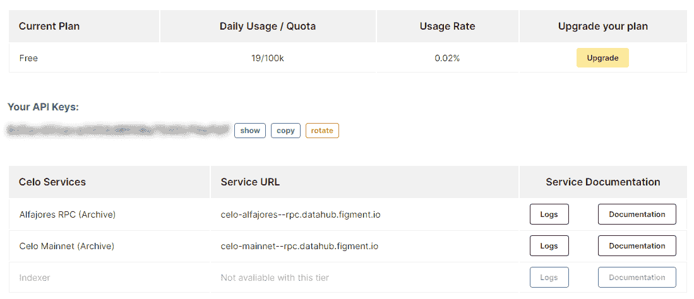
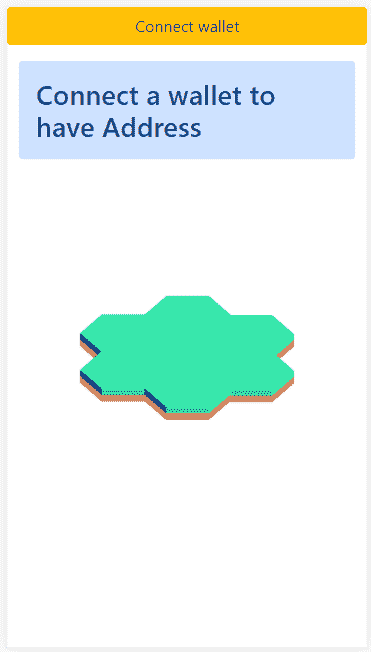
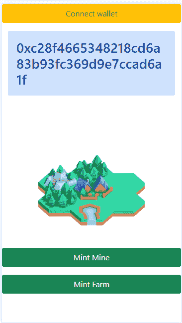
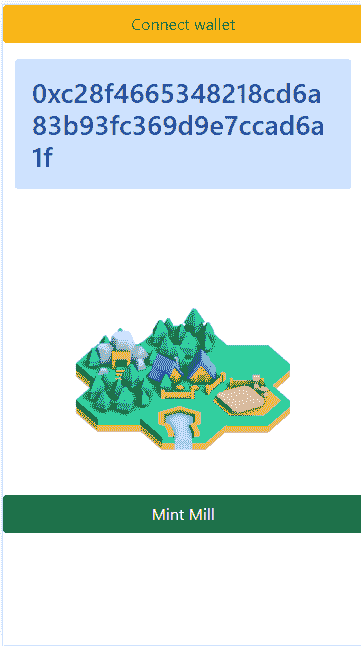

# celo/celo-hardhat-deploy-and-nft-app

> 原文：<https://github.com/figment-networks/learn-tutorials/blob/master/celo/celo-hardhat-deploy-and-nft-app.md>

在本教程中，我们将使用 Solidity 语言和 Openzeppelin 库为 ERC1155 令牌编写一个智能合约。使用 nodejs 和 [Hardhat](/figment-networks/learn-tutorials/blob/master/celo) 我们将编译智能合同代码，并在部署之前测试合同。部署合同后，我们将在 Hardhat 中创建一个自定义任务，以创建一个 Celo 帐户，并使用[数据中心](https://datahub.figment.io)将合同部署到 Celo 网络。最后，我们将使用一个 React 应用程序，该应用程序将连接到 Celo wallet 帐户，并与部署的智能合约进行交互。

[](https://user-images.githubusercontent.com/52639395/114646091-01e71d00-9cb1-11eb-8acc-214c255d2d4c.png)

# 先决条件

*   我们必须安装 NodeJS >= v12.0，最好是最新版本或 LTS 版本。
*   了解 JavaScript、Solidity 和 React 是有益的。

# 安装安全帽

Hardhat 是一个开发环境，它编译、部署、测试并帮助您调试以太坊智能合约。Hardhat 也可以用于部署到 Celo 网络，因为 Celo 也运行 EVM(以太坊虚拟机)。这意味着适用于以太坊的智能合约也适用于 Celo。出于本教程的目的，我们将假设读者了解如何用包管理器(`npm`或`yarn`)初始化一个新的节点项目。我们现在将讨论如何安装和配置 Hardhat。

```js
npm install --save-dev Hardhat
npm install --save-dev @nomiclabs/Hardhat-waffle ethereum-waffle chai @nomiclabs/Hardhat-ethers ethers web3 @celo/contractkit 
```

# 创建新的安全帽项目

从项目目录中，运行:

```js
npx hardhat 
```

选择“创建一个示例项目”将允许 Hardhat 在当前目录下开始安装过程。它将创建子目录，并将所有必需的文件放在适当的位置，以增强您的项目。

```js
888    888                      888 888               888
888    888                      888 888               888
888    888                      888 888               888
8888888888  8888b.  888d888 .d88888 88888b.   8888b.  888888
888    888     "88b 888P"  d88" 888 888 "88b     "88b 888
888    888 .d888888 888    888  888 888  888 .d888888 888
888    888 888  888 888    Y88b 888 888  888 888  888 Y88b.
888    888 "Y888888 888     "Y88888 888  888 "Y888888  "Y888
Welcome to Hardhat v2.1.2
? What do you want to do? ...
> Create a sample project
  Create an empty Hardhat.config.js
  Quit 
```

# OpenZeppelin ERC1155 库

ERC1155 是一种新颖的令牌标准，旨在从以前的标准中吸取精华，创建一种不可知可替换性且高效的令牌契约。ERC1155 汲取了所有 ERC20、ERC721 和 ERC777 的理念。ERC1155s 通常用于 NFT 收藏品项目中，尽管它们通常不被视为“艺术品”。出于此目的使用这种象征性标准并非不合理。我们将研究一个令牌的用例，这个令牌专门用于我们的小村庄。

# 安装 OpenZeppelin 合同

这将在本地安装 OpenZeppelin 合同。第二个命令将在`contracts`目录中创建一个名为`TinyVillage.sol`的新文件。在 Linux 和 macOS 上可以使用 touch 命令。Windows 用户应该使用`type nul > contracts\TinyVillage.sol`来创建一个空文件。

```js
npm install @openzeppelin/contracts
touch contracts/TinyVillage.sol 
```

# 撰写您的智能合同

您需要在您的代码中添加一个许可证，并在文件顶部添加一条注释:`// SPDX License Identifier: MIT`，智能合约的源代码将在区块链上可见，如果第三方使用您的代码，最好为您的代码添加一个许可证，以避免出现问题。

用`pragma solidity ^0.8.0;`你将设置一个编译器版本。你的代码和库的编译器版本必须兼容，`import "@openzeppelin/contracts/token/ERC1155/ERC1155.sol`将在`node_modules`获得 ERC1155.sol 文件和 ERC1155 需要编译的其他 solidity 文件。使用`contract TinyVillage is ERC1155`创建您的合同，给出合同的名称，并告诉它使用来自 Solidity 的`is`关键字来使用 ERC1155 库。

如果您使用的是 Remix IDE，请从 GitHub 上靠近文件顶部的 OpenZeppelin 存储库中导入 ERC1155 模块:

```js
import "https://github.com/OpenZeppelin/openzeppelin-contracts/blob/master/contracts/token/ERC1155/ERC1155.sol"; 
```

到目前为止，你的可靠性合同应该是这样的:

```js
// SPDX-License-Identifier: MIT
pragma solidity ^0.8.0;
import "@openzeppelin/contracts/token/ERC1155/ERC1155.sol";
contract TinyVillage is ERC1155 {
  // TODO
}
```

# 撰写智能合同的 NFT 部分

在`contract TinyVillage is ERC1155`中，用`uint256 public constant VILLAGE`创建 NFT 的标识符。用我们的 NFTs 创建列表

```js
 uint256 public constant VILLAGE = 0;
 uint256 public constant MINE = 1;
 uint256 public constant FARM = 2;
 uint256 public constant MILL = 3;
 uint256 public constant CASTLE = 4;
```

名称对于记住 id 很有用，可以只传递数字而不保存在变量中。

```js
 uint256 public constant VILLAGE = 0;
 _mint(msg.sender,VILLAGE,1,"0x000");
//The code are the same 
 _mint(msg.sender,0,1,"0x000");
```

构造函数代码在契约创建时执行一次，用于初始化契约状态。`ERC1155`中的参数是一个 URI，它可以包含客户端必须用实际令牌 id 替换的字符串{id}。

```js
 constructor() ERC1155("https://gateway.pinata.cloud/ipfs/QmTN32qBKYqnyvatqfnU8ra6cYUGNxpYziSddCatEmopLR/metadata/api/item/{id}.json") {
  }
```

对于令牌 ID 1 和 uri `https://gateway.pinata.cloud/ipfs/QmTN32qBKYqnyvatqfnU8ra6cYUGNxpYziSddCatEmopLR/metadata/api/item/{id}.json`，客户端会将 ***{id}*** 替换为 ***1*** 以检索位于[https://gateway . pinata . cloud/ipfs/qmtn 32 qbkyqnyvatqfnu 8 ra 6 cyugnxpyzisddcatemoplr/metadata/API/item/1 . JSON](https://gateway.pinata.cloud/ipfs/QmTN32qBKYqnyvatqfnU8ra6cYUGNxpYziSddCatEmopLR/metadata/api/item/1.json)的 JSON。令牌 ID 1 的 JSON 文档可能类似于:

```js
{
  "name": "Mine",
  "description": "Mine inseda a tiny mount",
  "image": "https://gateway.pinata.cloud/ipfs/QmPoFKTD8U2Mg6kgMheyv9K4rtPRnKv78orRHjaYaTVqimg/mine.png"
}
```

# 编写创建 NFT 的函数

我们的函数有两个部分， ***要求*** 得到平衡，如果合同的用户还没有 Nft，合同 vai 让 mint 用 ***_mint*** 函数得到一个 NFT，mint 所做的是创建 token 类型 id 的数量 token，并将它们分配到帐户。

```js
// If you do not have any village the contract will let you buy one
function mintVillage() public{
 require(balanceOf(msg.sender,VILLAGE) == 0,"you already have a Village ");
 _mint(msg.sender,VILLAGE,1,"0x000");
}

// If you do not have any Mine and have Village the contract will let you buy the Mine
function mintMine() public{
 require(balanceOf(msg.sender,VILLAGE) > 0,"you need have a Village");
 require(balanceOf(msg.sender,MINE) == 0,"you already have a Mine");
 _mint(msg.sender,MINE,1,"0x000");
}

// If you do not have any Farm and have Village the contract will let you buy the Farm
function mintFarm() public{
 require(balanceOf(msg.sender,VILLAGE) > 0,"you need have a Village");
 require(balanceOf(msg.sender,FARM) == 0,"you already have a Farm");
 _mint(msg.sender,FARM,1,"0x000");
}

// If you do not have any Mill and have Village and Farm the contract will let you buy the Mill
function mintMill() public{
 require(balanceOf(msg.sender,VILLAGE) > 0,"you need have a Village");
 require(balanceOf(msg.sender,FARM) > 0,"you need have a Farm");
 require(balanceOf(msg.sender,MILL) == 0,"you already have a Mill");
 _mint(msg.sender,MILL,1,"0x000");
}

// If you do not have any Castle and have all others NFt the contract will let you buy the Mill
function mintCastle() public{
 require(balanceOf(msg.sender,MINE) > 0,"you need have a Mine");
 require(balanceOf(msg.sender,MILL) > 0,"you need have a Mill");
 require(balanceOf(msg.sender,CASTLE) == 0,"you already have a Castle");
 _mint(msg.sender,CASTLE,1,"0x000");
}
```

参见完整的 [TinyVillage.sol](https://github.com/lucasespinosa28/Celo-Tutorial/blob/main/demo/contracts/TinyVillage.sol) 。

# 使用 HardHat 编译

为了将我们的 Solidity 代码转换成一个有效的智能契约，我们必须编译它。编译后，我们将在`artifacts\contracts\TinyVillage.sol\TinyVillage.json`中获得字节码和其他关于契约的信息。工件是编译结果的一部分。

要用 HardHat 编译，首先删除`contracts/Greeter.sol`和`test/sample-test.js`。打开`Hardhat.config.js`文件，设置你在 **TinyVillage.sol** 智能合约中使用的相同版本。

```js
module.exports = {
  solidity: "0.8.0",
};
```

要编译您的智能合约，只需使用以下命令:

```js
npx hardhat compile 
```

如果您没有删除`contracts/Greeter.sol`文件，它将给出一个错误，因为该契约没有指定相同的编译器版本。

# 测试和部署

验证代码是否在`artifacts\contracts\TinyVillage.sol\TinyVillage.json`中正确编译，这个 JSON 文件包含部署智能合同所需的所有信息。

# 使用 Hardhat 测试智能合同

最佳实践是在部署之前在您的计算机上测试智能合约。在`test/tineyVillageTest.js`中创建测试文件。安全帽文档有更多关于使用其他库进行测试的信息。

从 [Chai](https://www.chaijs.com/) Chai 导入`expect`模块是一个测试库，它是在本教程的第一部分安装的)。

```js
const { expect } = require("chai");
```

最基本的测试只是部署合同和铸造村庄。如果村庄被铸造，契约将通过。

```js
describe("TinyVillage Test", function() {
    it("Should mint village", async function() {

    const accounts = await ethers.getSigners();

    const TinyVillage = await ethers.getContractFactory("TinyVillage");
    const tinyVillage = await TinyVillage.deploy();

    await tinyVillage.mintVillage();
    const balance = await tinyVillage.balanceOf(accounts[0].address,0)
    expect(1).to.equal(Number(balance.toString()));
});
```

测试城堡的铸造需要我们铸造所有其他类型的 NFT，但是出于本教程的目的，我们将缩短它，不包括测试所有的铸造功能:

```js
    it("Should mint castle",async function () {
        const accounts = await ethers.getSigners();

        const TinyVillage = await ethers.getContractFactory("TinyVillage");
        const tinyVillage = await TinyVillage.deploy();

        await tinyVillage.mintVillage();
        await tinyVillage.mintMine();
        await tinyVillage.mintFarm();
        await tinyVillage.mintMill();
        await tinyVillage.mintCastle();
        const balance = await tinyVillage.balanceOf(accounts[0].address, 4)
        expect(1).to.equal(Number(balance.toString()));
    });
});
```

现在，我们将使用 Hardhat 运行测试，根据您的机器，测试时间可能会有所不同。如果所有测试都已通过，您的智能合约就可以部署了。

```js
npx Hardhat test

---
 TinyVillage Test
    √ Should mint village (5832ms)
    √ Should mint castle (2321ms)
  2 passing (8s) 
```

参见 [tineyVillageTest.js](https://github.com/lucasespinosa28/Celo-Tutorial/blob/main/demo/test/tineyVillageTest.js) 的完整代码

# 用 Hardhat 创建一个 Celo 帐户

要在 Celo Testnet 上部署您的合同，需要创建一个帐户并保存 privateKey 以获取发送 Celo 测试币的地址，在主文件夹中创建一个文件`celo_account.js`，我们不会使用默认帐户，因为我们需要保存帐户以供以后使用。

```js
const Web3 = require('web3')
const fs = require('fs')
const path = require('path')
const web3 = new Web3()
const privateKeyFile = path.join(__dirname, './.secret')

// Function getAccount will return the address of your account
const getAccount = () => {
    const secret = fs.readFileSync(privateKeyFile);
    const account = web3.eth.accounts.privateKeyToAccount(secret.toString())
    return account;
}

// Function setAccount will crate new account and save the privateKey in .secret file 
const setAccount = () => {
    const newAccount = web3.eth.accounts.create()
    fs.writeFileSync(privateKeyFile, newAccount.privateKey, (err) => {
        if (err) {
            console.log(err);
        }
    })
    console.log(`Address ${newAccount.address}`)
}
module.exports = {
    getAccount,
    setAccount
}
```

在`hardhat.config.js`中，我们将导入必要的模块来读取。秘密文件和 ***的代号 celo_account.js*** 。

```js
const fs = require('fs')
const path = require('path')
const privateKeyFile = path.join(__dirname, './.secret')
const Account = require('./celo_account');
```

添加一个新任务，如果。机密文件不存在。如果。该任务将使用私钥来获取地址。

```js
task("celo-account", "Prints account address or create a new", async () => {
    fs.existsSync(privateKeyFile) ? console.log(`Address ${Account.getAccount().address}`) : Account.setAccount();
});
```

运行`npx hardhat celo-account`时，新账户被创建，私钥将被保存到。秘密文件。重要的是保存地址，并前往 [Celo 开发者龙头](https://celo.org/developers/faucets)获取支付部署费用所需的硬币。

# 部署

如果您的代码已经过编译和测试，那么是时候部署您的智能合约了。你需要连接到塞洛区块链。为此，您需要一台运行 Celo 网络的服务器。要连接 Celo 网络和许多其他区块链网络，最简单的方法之一是使用 Figment 的 DataHub 服务:进入 [datahub.figment.io](https://datahub.figment.io/) 并从可用协议列表中选择 Celo。 [](https://user-images.githubusercontent.com/52639395/114647928-46c08300-9cb4-11eb-90a4-5a8600c7696d.png) 。

# 创建部署任务

创建`celo_deploy.js`并添加下面的代码。`@celo/contractkit`是一个帮助开发者和验证者与 celo 区块链交互的库。`TinyVillage()`是用于部署 TinyVillage 合同的函数，`/artifacts/contracts/TinyVillage.sol/TinyVillage.json`是包含我们编译的合同的所有信息的文件。

```js
const Web3 = require('web3')
const ContractKit = require('@celo/contractkit')

const web3 = new Web3('https://celo-alfajores--rpc.datahub.figment.io/apikey/<your API key here>/')
const kit = ContractKit.newKitFromWeb3(web3)
const data = require('./artifacts/contracts/TinyVillage.sol/TinyVillage.json')
const Account = require('./celo_account');

async function TinyVillage() {
    const account = Account.getAccount()
    kit.connection.addAccount(account.privateKey) 
    let tx = await kit.connection.sendTransaction({
        from: account.address,
        data: data.bytecode
    })
     return tx.waitReceipt()
}
module.exports = {
    TinyVillage
}
```

与您在`task("celo-account")`中所做的一样，创建一个要部署的任务:

```js
const Deploy = require('./celo_deploy');

task("celo-deploy", "Prints account address or create a new", async () => {
    const tx = await Deploy.TinyVillage();
    console.log(tx);
    console.log(`save the contract address ${tx.contractAddress}`)
});
```

运行任务`npx hardhat celo-deploy`进行部署。然后保存合同地址，以便在 React 应用程序中使用，从而与智能合同进行交互。运行 deploy 任务后，如果一切顺利，结果应该是这样的(但是有不同的地址和散列)。

```js
npx hardhat celo-deploy

{
  blockHash: '0x7b653ecce5042d1424cd66a5ce36112c8ece51de50317851aa887ab7582d0cd3',
  blockNumber: 4729795,
  contractAddress: '0x47A424A0975924C3d177470C519C8DBA37e16Ec9',
  cumulativeGasUsed: 2856692,
  from: '0x69e5ba06aa6176854ad01cf4fe6fb88119c9e378',
  gasUsed: 2856692,
  logs: [],
  logsBloom: '0x00000000000000000000000000000000000000000000000000000000000000000000000000000000000000000000000000000000000000000000000000000000000000000000000000000000000000000000000000000000000000000000000000000000000000000000000000000000000000000000000000000000000000000000000000000000000000000000000000000000000000000000000000000000000000000000000000000000000000000000000000000000000000000000000000000000000000000000000000000000000000000000000000000000000000000000000000000000000000000000000000000000000000000000000000000000',
  status: true,
  to: null,
  transactionHash: '0x92bf51162e35ec0ebe984a67914f208720f5d73091978af346c413f2715c3601',
  transactionIndex: 0
} 
```

记得保存合同地址:在这个例子中是 0 x47a 424 a 0975924 c 3d 177470 c 519 c 8 DBA 37 e 16 EC 9，但是你的地址会不同。

# 与已部署的合同进行交互

像 [OpenSea](https://opensea.io/) 这样的市场网站还没有在 Celo 上显示 NFTs。为了能够在 Celo 上查看 NFS，我们可以构建一个 React 应用程序。在 [github](https://github.com/lucasespinosa28/Celo-Tutorial/tree/main/demo/start) 上有一个示例项目。完整的应用程序可在 [github](https://github.com/lucasespinosa28/Celo-Tutorial/tree/main/demo/final) 上获得

# 显示图像

打开文件`src/Images.js`并在注释指示的位置编写代码，图像已经保存在应用程序中。

```js
// Access a the contract
const contract = new kit.web3.eth.Contract(data.abi, "0x47A424A0975924C3d177470C519C8DBA37e16Ec9")
// Array with address NFT's owner 
const ownerAddress = [address, address, address, address, address]
// Array with NFT's id 
const ownerIds = [0, 1, 2, 3, 4]
// Function that will return the NFT that you have
async function getBalance() {
 const balances = await contract.methods.balanceOfBatch(ownerAddress, ownerIds).call();
 setBalanceArray(balances);
 }
```

此代码使用`kit.web3.eth.Contract...`访问智能合约，代码有 2 个数组，一个包含用户地址，另一个包含列表 NFTs id，当调用合约中的函数 ***balance Of Batch*** 将返回一个包含用户拥有的每个 NFT 的数组，根据余额，代码将显示每个数组组合的特定图像，例如:如果 balance Of Batch 返回***【1，0，0，0】***，代码将显示此图像 [](https://user-images.githubusercontent.com/52639395/115546874-ee711e80-a27b-11eb-90e5-2febf733aabc.jpg)

# 创建一个按钮来铸造 NFT

打开文件`src/MintNFT.js`，这段代码的作用类似于获取平衡，就像 ***Images.js*** 组件一样。

```js
// Access a the contract
const contract = new kit.web3.eth.Contract(data.abi, "0x47A424A0975924C3d177470C519C8DBA37e16Ec9")
// Array with address NFT's owner 
const ownerAddress = [address, address, address, address, address]
// Array with NFT's id 
const ownerIds = [0, 1, 2, 3, 4]
// Function that will return the NFT that you have
async function getBalance() {
    const data = await contract.methods.balanceOfBatch(ownerAddress, ownerIds).call();
    setBalanceArray(data);
}
// Run the code above 
getBalance();
// This function will mint NFT depending on the name you give 
async function Mint(name) {
    console.log(balanceArray);
    contract.methods.[name]().send({ from: address })
        .on('transactionHash', function (hash) {
            console.log(hash);
        })
        .on('receipt', function (receipt) {
            console.log(receipt);
        })
        .on('error', function (error, receipt) {
            console.log(error);
            console.log(receipt);
        });
}
```

如果不为 mintVillage、mintFarm、mintMine 等创建函数，同一函数将使用其在智能合约中的函数名称来创建 NFT，例如:

```js
async function Mint("mintVillage") {
 contract.methods.["mintVillage"]().send(...
}
Mint("mintVillage")}
....
// If not using this method
contract.methods.mintVillage().send({ from: address })
contract.methods.mintCastle().send({ from: address })
....
```

如果代码有任何错误，记得测试应用程序。

```js
npm start 
```

[ ](https://user-images.githubusercontent.com/52639395/115549890-94725800-a27f-11eb-9993-c9ddc794eb12.png) [](https://user-images.githubusercontent.com/52639395/115549907-99370c00-a27f-11eb-9b41-230732ca3155.png) 连接到帐户后，进入 [Celo 水龙头](https://celo.org/developers/faucets)并发送测试硬币到购买 NFT 的地址，首先，你需要购买一个村庄，然后，你需要购买一个农场和矿井才能进入下一关。【T8[](https://user-images.githubusercontent.com/52639395/115550456-43169880-a280-11eb-94e3-e101d18722eb.png)

# 结论

我们学习了如何编写 [ERC1155](https://docs.openzeppelin.com/contracts/3.x/erc1155) 合同，使用 [HardHat](https://hardhat.org/) 创建定制任务，以及 [Celo 的 ContractKit](https://github.com/celo-tools/use-contractkit) 与 Celo 合同交互。

# 关于作者

本教程由 C#/Solidity 开发人员 Lucas Espinosa 撰写。你可以在 GitHub 上联系卢卡斯