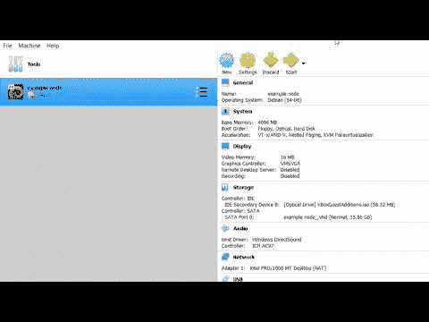
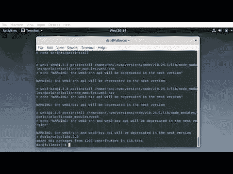
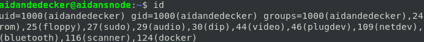
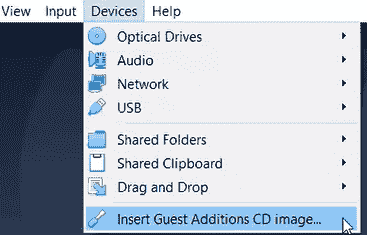
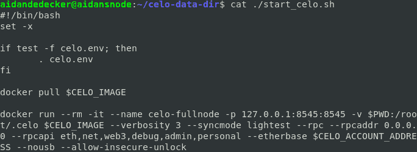
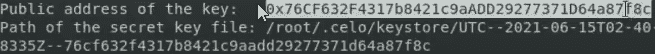
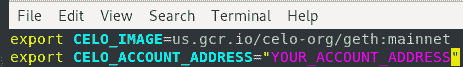
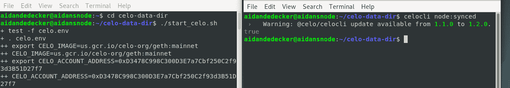
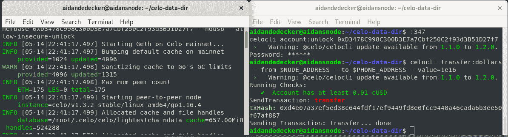

# celo/celo-node-video-tutorial

> 原文：<https://github.com/figment-networks/learn-tutorials/blob/master/celo/celo-node-video-tutorial.md>

在虚拟机中运行 Celo 完整节点

完整节点是塞洛区块链的主要部分。完整节点是一个帮助编写和验证网络中新变化的程序。多个完整节点协同工作，以分散的方式验证区块链。该虚拟机的任务是创建一个完整的节点，并运行一个监控网络的轻型客户端。

观看视频并按照书面教程进行操作。

#### 右键单击图像查看视频:

#### 视频 1，创建虚拟机

[](http://www.youtube.com/watch?v=Cdqwzf-zfug)

#### 视频 2，构建完整节点

[](http://www.youtube.com/watch?v=l8qAISLJZq8)

# 先决条件

*   对虚拟机(VM)和 Linux 终端有基本的了解。

*   在 iOS 或 Android 上安装 Valora 应用:[https://valoraapp.com/](https://valoraapp.com/)

*   下载最新的 Debian 10.x 64 位 ISO:[https://www.debian.org/](https://www.debian.org/)

*   下载 VirtualBox，甲骨文虚拟机主机:[https://www.virtualbox.org/](https://www.virtualbox.org/)

*   iOS 或 Android 下载信号:[https://www.signal.org/](https://www.signal.org/)

# 创建虚拟机

*   点击 VirtualBox 中的“新建”
*   选择动态分配的虚拟硬盘
*   启动虚拟机
*   创建新用户
*   选择“使用整个磁盘”，然后将更改写入磁盘
*   选择复选框:Debian 桌面环境、SSH 服务器、标准系统实用程序
*   将 Grub 引导程序安装到虚拟硬盘上

Debian 的安装已经完成，VM 已经准备好了。

## 在虚拟机上获得 sudo

在 Linux 上，命令`sudo`代表“替代用户 do”。一旦用户帐户被添加到`sudo`组，它将能够在虚拟机上以管理员或“root”权限进行操作。

在虚拟机终端中输入以下命令:

`su -`

*   输入虚拟机的 root 密码。

`usermod -aG sudo $YOURUSERNAME`

*   $YOURUSERNAME =当前登录用户的用户名。

*   重新启动虚拟机

`id`

*   在组列表中查找(sudo):

[](https://user-images.githubusercontent.com/80616939/120870817-2f38a480-c557-11eb-9fd0-5be9e710af8d.png)

## 安装依赖项

Curl 将用于在终端中插入 GitHub 脚本。

Docker 是一个将运行轻客户端的服务。

Vim 是一个用于在终端中编辑文件的工具。[点击这里](https://www.linux.com/training-tutorials/vim-101-beginners-guide-vim/)阅读 Vim 初学者指南。

`sudo apt update && sudo apt upgrade`

`sudo apt install docker.io`

`sudo apt install curl`

`sudo apt install vim`

## 启用双向复制/粘贴，并提高分辨率

运行名为 VBoxLinuxAdditions 的外部程序，该程序支持在虚拟机和主机之间进行复制/粘贴。

*   将光标放在左上角的设备上，然后选择:插入来宾附件 CD 映像

[](https://user-images.githubusercontent.com/80616939/118760448-0ebadb80-b830-11eb-88fa-51e672a41d83.png)

`cd /media/cdrom`

`ls`

`sudo sh VBoxLinuxAdditions.run`

*   重新启动虚拟机

*   在共享剪贴板中的设备下选择双向复制/粘贴

Linux 头文件提供了许多重要的功能，而不需要安装不必要的文件。而 VBoxLinuxAdditions 提供动态屏幕分辨率。

`sudo apt install build-essential linux-headers-`uname -r``

*   重新启动虚拟机

*   选择视图下的调整窗口大小。

## 创建环境，加入 Docker，并安装 Celo 客户机

插入此文件以添加 node.js 的功能，并安装 nvm。添加文件后在文件中进行编译。

`curl -o- https://raw.githubusercontent.com/nvm-sh/nvm/v0.37.2/install.sh | bash`

`source ~/.bashrc`

安装/使用 node.js 版本 10，然后在这个客户机上安装 celo 应用程序。

`nvm install 10`

`nvm use 10`

`npm install -g @celo/celocli`

接下来加入 Docker 组。

`sudo usermod -aG docker $YOURUSERNAME`

*   重新启动虚拟机

`id`

*   检查(码头工人)

运行轻型客户端需要 Docker。

解释器指令“#！”叫做“舍邦”。路径“/bin/bash”设置终端在 bash 中进行解释。

`#!/bin/bash`

`set -x`

以下参数确保“celo.env”文件将被加载到终端中。

```js
 if test -f celo.env; then 
          . celo.env
    fi
   +test -f celo.env 
```

*   关闭这个终端

## 使用 Curl 创建 2 个新文件

了解一下”。env "文件查看本[指南](https://learn.figment.io/network-documentation/extra-guides/dotenv-and-.env)。

Curl 使用原始的 github 代码，并立即创建新文件。

*   这个”。env”文件用于存储和访问敏感的环境变量。它将保存公钥的变量。

```js
curl -o celo.env https://gist.githubusercontent.com/alchemydc/ce712f6f3caa7ec79f15f930ed5904ed/raw/385c65b1d3f760854258bfd6dd8cbd135710b78f/celo.env 

source celo.env 
```

如果您想自己创建“celo.env ”,下面是该文件的内容:

```js
export CELO_IMAGE=us.gcr.io/celo-org/geth:mainnet
export CELO_ACCOUNT_ADDRESS="YOUR_ACCOUNT_ADDRESS" 
```

*   第二个文件运行轻型客户端，并包含有关节点的信息。这个文件需要 Docker。

```js
curl -o start_celo.sh https://gist.githubusercontent.com/alchemydc/e28945f5059acd70969b39a50fd0f80a/raw/0d15cceb89ea86ca46df94441c06ecd88a4e6635/start_celo.sh 

source start_celo.sh 
```

[](https://user-images.githubusercontent.com/80616939/120844824-33e86300-c52d-11eb-8b1f-db5e66ec76bb.png)

## 将这些文件移动到新目录中；celo 数据目录

*   该目录将被称为“celo-data-dir”。

*   “mkdir”创建一个新目录。

*   " cd "选择目录。

*   “mv”将文件移动到目录中。

```js
mkdir celo-data-dir && cd celo-data-dir

mv ../celo.env . 
mv ../start_celo.sh .

source celo.env && source start_celo.sh 
```

*   更改后文件中的源代码

## 在 celo-data-dir 中创建节点

`docker run -v $PWD:/root/.celo --rm -it $CELO_IMAGE account new`

*   复制随新节点帐户提供的公共地址密钥:

[](https://user-images.githubusercontent.com/80616939/122334208-96ab0880-cef6-11eb-9204-d1279da300a8.png)

`vim celo.env`

[](https://user-images.githubusercontent.com/80616939/118758843-044b1280-b82d-11eb-88df-e83e5fb813f4.png)

*   在 vim 中，按“I”进入插入模式。

*   用退格键删除您的帐户地址。

*   用“移位插入”粘贴地址。

*   按“:”退出 vim，然后键入“wq”“enter”。

`source celo.env`

## 运行轻型客户端

`chmod u+x ./start_celo.sh`，允许用户启动轻型客户端。

`./start_celo.sh`，启动轻客户端。

`cat ./start_celo.sh`，显示节点信息。

`docker stop geth`，停止轻客户端。

*   使用 2 个端子凸耳。一个用于启动轻型客户端，另一个用于所有其他命令。

`./start_celo.sh`

`celocli node:synced`

*   如果为真，则节点已连接。

`celocli account:balance NODE_ADDRESS`

`docker stop geth`

[](https://user-images.githubusercontent.com/80616939/118338503-8eb11080-b4d3-11eb-99a3-11417cf79b32.png)

## 向节点发送 Celo 和从节点发送 Celo

*   向您的节点地址发送 CUSD 和 CELO 本地令牌。

*   打开两个终端窗口。一个用于运行轻型客户端，另一个用于输入命令。

*   确保两个终端都在 celo-data-dir 中。

`cat ./start_celo.sh`

`docker exec -it geth geth attach`

`exit`

`celocli account:unlock $PUBLIC_ADDRESS`

*   输入口令

`source celo.env`

`celocli transfer:dollars --from $NODE_ADDRESS --to $PHONE_ADDRESS --value=1e16`

理解这个计量单位:1e16 = 0.01CUSD，1e15 = 0.1CUSD，1e14 = 1.0CUSD。

[](https://user-images.githubusercontent.com/80616939/118338915-9c1aca80-b4d4-11eb-87b6-7970949923aa.png)

# 结论

fullnode 和轻型客户端现在应该可以运行了。请记住，本教程不是设置完整节点的唯一方法。这个节点现在在你的控制之下，所以记住密钥和密码，以避免损失任何金钱。请尝试此设置并进行个性化设置。start_celo.sh 和 celo.env 文件都很容易定制。

### 关于作者

本教程是由艾丹·德德克整理的。这是我的 git hub 页面:[https://github.com/Aidandedecker/Aidandedecker](https://github.com/Aidandedecker/Aidandedecker)。