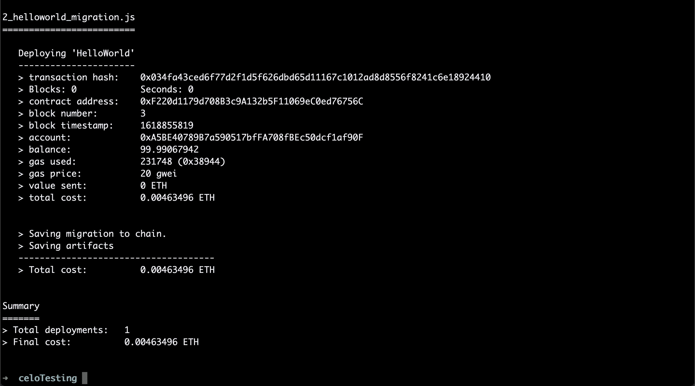
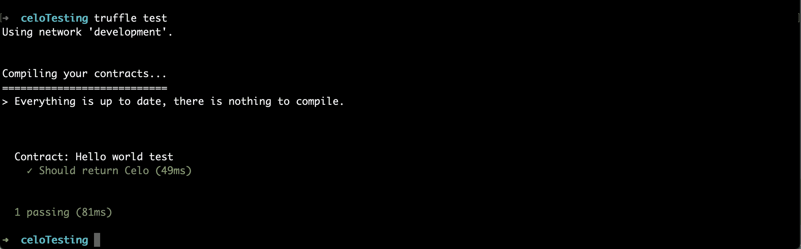
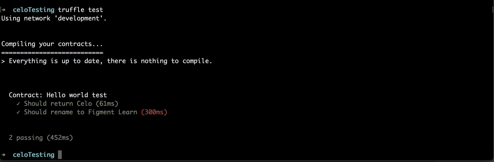
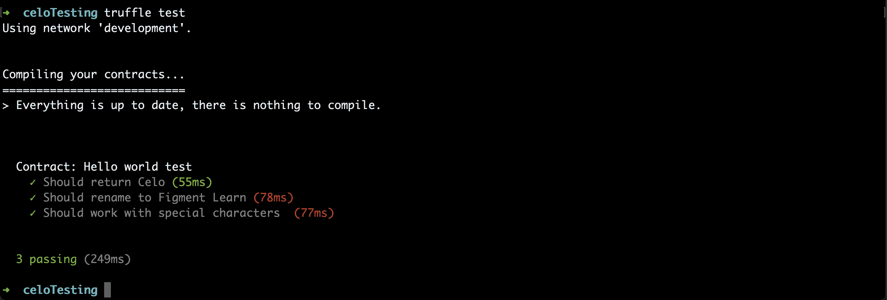

# 介绍

> 原文:[https://github . com/fig ment-networks/learn-tutorials/blob/master/celo/celo-testing-truffle . MD](https://github.com/figment-networks/learn-tutorials/blob/master/celo/celo-testing-truffle.md)

在本教程中，我们将为 Celo 智能合约编写测试。

编写测试是智能合约开发的一个重要部分，因为智能合约漏洞可能会对现实世界产生影响，比如损失用户资金！减少漏洞的最好方法是编写大量的单元测试，以便测试我们合同功能的每一部分。

这是一个初学者友好的教程。继续阅读，了解测试！

# 先决条件

对于本教程，你需要安装松露和 Ganache。Truffle 是一套智能合同开发工具，而 Ganache 是一个创建本地区块链的工具。

在控制台中，运行以下命令:

`npm install -g truffle`

然后运行:

`npm install -g ganache-cli`

太好了！这就是我们智能合约测试所需的全部内容。

# 项目设置

接下来，我们将设置我们的项目。让我们创建一个名为`celoTesting`的文件夹，并将`cd`放入该文件夹:

`mkdir celoTesting && cd celoTesting`

现在让我们初始化 Truffle:

`truffle init`

现在您的`celoTesting`目录中应该有一些文件和文件夹了。让我们用您最喜欢的文本编辑器打开`celoTesting`并继续。

# 撰写智能合同

由于本教程关注的是智能契约测试，我们将使用一个非常简单的可靠性契约来理清思路。

在名为`HelloWorld.sol`的`contracts/`文件夹中创建一个新的智能合同，并编写以下内容:

```
pragma solidity >=0.5.0 <0.7.0;

contract HelloWorld {
  string name = 'Celo';

  function getName() public view returns (string memory) {
    return name;
  }

  function setName(string calldata newName) external {
    name = newName;
  }
} 
```

太好了！这只是一个简单的智能契约，要么通过调用`getName()`获得`name`变量，要么通过调用`setName()`更新`name`变量。当契约第一次运行时，`name`将是“Celo”。

# 部署

现在我们有了一个智能合同，让我们部署它以确保它能够工作。我们将在 Ganache CLI 上部署它，这是一个用于创建本地区块链的命令行工具。Ganache 将创建一个本地以太坊区块链供我们测试。由于 Celo 是以太坊的一个分支，所以他们使用相同的环境。

要启动本地区块链，请在新的终端窗口中运行:

`ganache-cli --port 8545`

我们使用一个新的终端窗口，因为我们希望在开发过程中保持 Ganache 运行。

接下来，用以下内容替换现有的`truffle.config`内容:

```
module.exports = {
  networks: {
    // Truffle uses this by default
    development: {
      host: "127.0.0.1",
      port: 8545,
      network_id: "*",
    },
  }
}; 
```

每当我们部署或测试我们的契约时，这将简单地使用 Ganache 环境。我们的 Ganache 环境运行在`localhost` (127.0.0.1)上，使用端口 8545。

我们还想为我们的智能合约创建一个`migrations`文件，以便从中进行部署。在`migrations/`文件夹中创建一个名为`2_helloworld_migration.js`的文件，并编写如下内容:

```
const HelloWorld = artifacts.require("HelloWorld");

module.exports = function (deployer) {
  deployer.deploy(HelloWorld);
}; 
```

完成所有这些之后，我们可以在终端中运行`truffle migrate`来部署我们的合同。

结果应该是这样的:

[](https://camo.githubusercontent.com/38fab3f927bb90cc395f9105cd587b82e1cc403baed72ce98f955c75177eb41c/68747470733a2f2f692e696d6775722e636f6d2f7949454247536b2e706e67)

# 测试

Truffle 允许我们使用 Javascript 或 Solidity 来测试我们的智能合约。对于本教程，我们将使用 Javascript 编写测试。

对于 Javascript 测试，Truffle 使用了 Javascript 开发中常用的两个测试库。默认情况下，这是用于断言的[摩卡](https://mochajs.org/)测试框架和[柴](https://www.chaijs.com/)。关于 truffle 的一个伟大的事情是，我们可以自由地使用我们想要的任何测试框架，但是对于我们的目的来说，这工作得很好。

关于 Truffle 中的测试，需要注意的一件重要事情是，每当我们运行测试时，Truffle 都会创建一个新的契约部署。这意味着无论何时我们运行测试，我们都会有一个新的开始，我们的合同也会被重置。

继续开发，在`test/`文件夹中创建一个名为`helloworld.js`的新文件。

我们将编写的第一行将获取我们的智能合约实例:

`const HelloWorld = artifacts.require("HelloWorld");`

接下来，让我们设置测试文件:

```
contract("Hello world test", async => {

} 
```

在我们编写测试之前，让我们回顾一下编写单元测试的目标。单元测试应该:

*   测试一种方法
*   为该方法提供一些特定参数
*   测试结果是否符合预期

让我们测试一下我们的契约从我们的`HelloWorld`契约中的`getName()`返回“Celo”。如果您还记得的话，`getName()`会返回`name`变量中的字符串。默认情况下，我们在创建合同时将名称设置为`Celo`。

```
const HelloWorld = artifacts.require("HelloWorld");

contract("Hello world test", async => {
  it("Should return Celo", async () => {
    const instance = await HelloWorld.deployed();
    const name = await instance.getName.call();
    assert.equal(name, 'Celo');
  });
} 
```

在这个测试中，我们创建了一个`HelloWorld`契约部署的`instance`，并在其上调用了`getName()`函数。这里的语法简单来说就是`instance.getName.call()`调用从区块链中读取的函数。

接下来，我们测试`asserts`从`getName()`返回的值等于字符串‘Celo’。

让我们运行这个！在终端窗口中(运行 ganache)，键入:

`truffle test`

这将运行我们所有的测试。我们的测试通过了！

[](https://camo.githubusercontent.com/7cc150788db2ee950d2fc2da5fd5c17e3a74823155341e173042ddc178e63532/68747470733a2f2f692e696d6775722e636f6d2f54657a5333536b2e706e67)

现在我们有了测试`getName()`函数的第一个测试，让我们编写一个测试来检查`setName()`:

```
it("Should rename to Figment Learn", async () => {
  const instance = await HelloWorld.deployed();
  await instance.setName('Figment Learn');
  const name = await instance.getName.call();
  assert.equal(name, 'Figment Learn');
}); 
```

对于第二个测试，我们使用`setName()`将名称变量改为“Figment Learn ”,然后调用`getName()`检查变量是否更新。

在这个测试中，我们再次检索了一个`HelloWorld`契约的实例，但是这次我们像这样调用它的`setName()`函数:

`await instance.setName('Figment Learn');`

不像`getName()`，我们不用`.call()`。每当我们调用*写*给区块链的函数时，我们不需要使用`.call()`。

让我们再次运行`truffle test`:

[](https://camo.githubusercontent.com/b88089465836468aca190c72a22706569c384af94d8ba00848287cf591f86388/68747470733a2f2f692e696d6775722e636f6d2f776f32533657632e706e67)

太好了！这个管用。该测试确实比第一个测试花费了更多的时间，因为它调用了两个函数并等待它们各自完成。

单元测试的很大一部分是测试可能破坏代码的边缘情况。一个例子是在我们的`setName()`函数中使用像表情符号这样的特殊字符。让我们编写一个测试来确保这一点:

```
it("Should work with special characters ", async () =>  {
  const instance = await HelloWorld.deployed();
  await instance.setName('I ❤️ emojis 🎉');
  const name = await instance.getName.call();
  assert.equal(name, 'I ❤️ emojis 🎉');
}); 
```

最后，让我们进行最后一项测试:

[](https://camo.githubusercontent.com/ecb1e2d59f073627ebccce8ed0fb0023b0df16e88f5de5f09626fbda3bdcca8f/68747470733a2f2f692e696d6775722e636f6d2f4a686e303977622e706e67)

呜哇！我们所有的测试都通过了。

# 结论

现在我们知道如何为我们的智能合约编写测试。每当您处理一个智能合同并需要验证所有功能都正常工作时，这种技能就会派上用场。尽管我们的测试相对简单，但它们应该足以让您开始测试之旅。

祝你好运！和往常一样，如果你遇到任何问题，请随时提问。

# 进一步阅读

学习完本教程后，您应该有了为智能合约编写测试的基础。单元测试是整个开发的一部分，围绕它有很多讨论。如果你想了解更多，这里有一些额外的资源:

*   编写自动化智能合同测试(来自 OpenZeppelin 的教程)
*   单元测试最佳实践——这并不局限于可靠性，但是编写优秀的单元测试是一个可以扩展到所有编程开发的概念。
*   单元测试新手，如何编写优秀的测试？——一个栈溢出问题，有一些关于编写伟大测试的伟大答案。
*   测试已部署的智能合同——如果你试图测试一个已经部署到 Celo mainnet 的合同，这个教程可能会派上用场。

# 关于作者

本教程由亚历克斯·雷耶斯创作。Alex 是一名学生(计算机科学学士),同时也是一名加密爱好者，他每天都在学习有关 web3 世界的知识，并积极为 Web3 社区做出贡献。他之前在脸书和微软完成了实习。