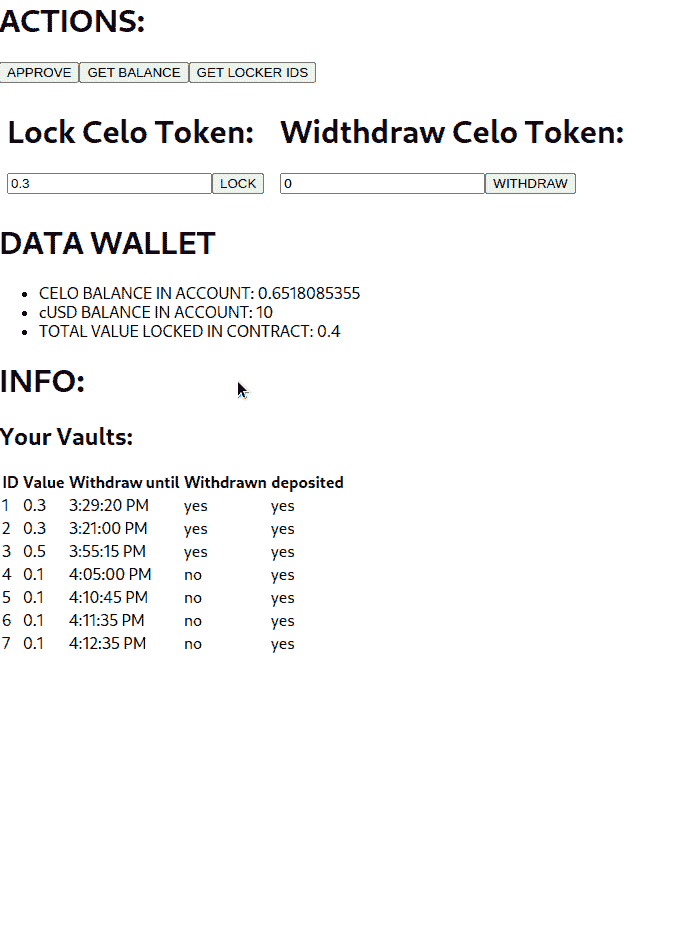

# 介绍

> 原文：<https://github.com/figment-networks/learn-tutorials/blob/master/celo/create-vault-smart-contract.md>

在本教程中，我们将在 Celo 生态系统上创建、部署我们的第一个 Vault 智能合约，并与之进行交互。

什么是 Vault 智能合同，以及部署和交互？本教程中定义的保险库证明您投入的资金通过不可侵犯的智能合约锁定。

本教程有 3 部分，如下所述-

*   首先，我们将创建一个新帐户，并配置连接到 Alfajores 的基本内容。
*   第二，我们将使用 DataHub 和 Truffle 向 Alfajores Testnet 部署一个 Vault 智能合约。
*   第三，我们将与已部署的 Vault 智能合约对接，并使用 React 和 Web3 的前端演示其功能。

# 先决条件

*   通过 [DataHub](https://datahub.figment.io/services/celo) 连接到 Celo 的 Alfajores testnet，当你有了 Celo API 密匙后再回来，这是本教程接下来的步骤所需要的。
*   请确保您已完成教程:
    *   [用数据中枢](https://learn.figment.io/tutorials/connect-to-celo)连接到 Celo
    *   [在 Celo 上查询账户余额](https://learn.figment.io/tutorials/get-the-celo-balance)
    *   [转移 CELO 代币](https://learn.figment.io/tutorials/transfer-celo-token)
    *   [部署您的第一份 Celo 智能合同](https://learn.figment.io/tutorials/deploy-celo-contract)

# 创建项目(中央基础)

由于 Celo 运行以太坊虚拟机，我们可以使用 Truffle 来编译我们的智能合约。但是为了把事情做好，让我们首先初始化一个节点项目(静默地...).

```
$ mkdir vault-dapp
$ cd vault dapp
$ npm init -y --silent 
```

添加我们的依赖项(暂时):

```
$ npm install --save @openzeppelin/contracts truffle @celo/contractkit dotenv web3 
```

通过运行以下命令，初始化一个基本的 truffle 项目。

```
$ npx truffle init 
```

将(datahub url + api-key，请参见 api-key 的先决条件)设置为环境变量。为此创建一个名为`./.env`的文件

```
DATAHUB_NODE_URL=https://celo-alfajores--rpc.datahub.figment.io/apikey/<YOUR API KEY>/ 
```

确保我们的`./.env`不会被误按(我们的钥匙在里面)。为此，创建一个名为`./.gitignore`的新文件

```
node_modules
.env 
```

最后，初始化 git。

```
$ git init 
```

好的，我很高兴祝贺你，我们刚刚初始化了一个节点和一个块菌项目。我们还添加了 git 并像专家一样保护我们的密钥。您的目录树应该如下所示:

```
04/17/2021  05:03 AM    <DIR>          .
04/17/2021  05:03 AM    <DIR>          ..
04/17/2021  05:03 AM    <DIR>          contracts
04/17/2021  05:03 AM    <DIR>          migrations
04/17/2021  05:00 AM    <DIR>          node_modules
04/17/2021  05:00 AM           678,735 package-lock.json
04/17/2021  05:00 AM               395 package.json
04/17/2021  05:03 AM    <DIR>          test
10/26/1985  04:15 AM             4,598 truffle-config.
04/17/2021  05:00 AM               395 .env
               3 File(s)        683,728 bytes
               6 Dir(s)  231,304,970,240 bytes free 
```

# 获取帐户和资金

我们的下一步是从 Celo Alfajores 网络获得一个帐户(地址/私钥)。我们要用松露控制台很快得到一个。

将以下内容复制并粘贴到由 Truffle 生成的`./truffle-config.js`中:

```
// LOAD ENV VAR
require("dotenv").config();

// INIT PROVIDER USING CONTRACT KIT
const Kit = require("@celo/contractkit");
const kit = Kit.newKit(process.env.DATAHUB_NODE_URL);

// AWAIT WRAPPER FOR ASYNC FUNC
async function awaitWrapper() {
  let account = kit.connection.addAccount(process.env.PRIVATE_KEY); // ADDING ACCOUNT HERE
}

awaitWrapper();

// TRUFFLE CONFIG OBJECT
module.exports = {
  networks: {
    alfajores: {
      provider: kit.connection.web3.currentProvider, // CeloProvider
      network_id: 44787, // latest Alfajores network id
    },
  },
  // Configure your compilers
  compilers: {
    solc: {
      version: "0.8.3", // Fetch exact version from solc-bin (default: truffle's version)
    },
  },
  db: {
    enabled: false,
  },
};
```

这里，我们使用环境变量`DATAHUB_NODE_URL`初始化了一个提供者。

# 用控制台连接到 Alfajores

现在我们可以使用`truffle console`连接到 Alfajores。在您的控制台上运行以下命令。

```
$ npx truffle console --network alfajores 
```

连接后，初始化并打印一个帐户，如下所示:

```
let account = web3.eth.accounts.create();
console.log(account);
```

这是我的输出:

```
$ truffle console --network alfajores
web3-shh package will be deprecated in version 1.3.5 and will no longer be supported.
web3-bzz package will be deprecated in version 1.3.5 and will no longer be supported.
truffle(alfajores)> let account = web3.eth.accounts.create()
undefined
truffle(alfajores)> console.log(account)
{
  address: '0x7cdf6c19E5491EA23aB14132f8a76Ff1C74ccAFC',
  privateKey: '0x167ed276fb95a17de53c6b0fa4737fc2f590f3e6c5b9de0793d9bcdf63140650',
  signTransaction: [Function: signTransaction],
  sign: [Function: sign],
  encrypt: [Function: encrypt]
} 
```

您可以使用`ctrl+C`或`ctrl+D`退出控制台。

从这里我们需要地址，还有我提到的。

成功！我们得到了一个帐户，在我们忘记之前，让我们把它保存到我们的`.env`中，因为我们以后会用到它。你的`.env`应该是这样的。

```
DATAHUB_NODE_URL=https://celo-alfajores--rpc.datahub.figment.io/apikey/<YOUR API KEY>/
ADDRESS=0x7cdf6c19E5491EA23aB14132f8a76Ff1C74ccAFC # your address
PRIVATE_KEY=0x167ed276fb95a17de53c6b0fa4737fc2f590f3e6c5b9de0793d9bcdf63140650 # your private key 
```

# 为账户提供资金

让我们添加资金到我们的帐户使用 Alfajores 水龙头，去那里与您的地址。(除了 Mainnet，你是否也想拥有一个):点击这里-> [Alfajores 水龙头](https://celo.org/developers/faucet)，你将获得:

```
cGLD => 5
cUSD => 10
cEUR => 10 
```

你可以在[阿尔法约斯街区侦察兵](https://alfajores-blockscout.celo-testnet.org/)搜索你`address`来验证你的余额。

我们终于完成了这一部分。我们越来越接近了。

# 部署 Vault 智能合约

现在我们有了一个帐户和资金，让我们为松露项目添加一个智能合同。从控制台中，运行以下命令:

```
npx truffle create contract Vault 
```

以上命令将在以下位置创建新的智能合约:

```
ls -la vault-dapp/contracts # Listing directory: vault-dapp/contracts:

Mode                 LastWriteTime         Length Name
----                 -------------         ------ ----
-a---           4/17/2021  6:12 AM            114 Vault.sol
```

保险库智能合约的代码已经为我们准备好了。复制、粘贴、读取:

```
// SPDX-License-Identifier: MIT

pragma solidity ^0.8.0;

import "@openzeppelin/contracts/token/ERC20/IERC20.sol";
import "@openzeppelin/contracts/token/ERC20/utils/SafeERC20.sol";
import "@openzeppelin/contracts/utils/math/SafeMath.sol";
import "@openzeppelin/contracts/access/Ownable.sol";

contract Vault is Ownable {
    using SafeMath for uint256;
    using SafeERC20 for IERC20;

    struct Items {
        IERC20 token;
        address withdrawer;
        uint256 amount;
        uint256 unlockTimestamp;
        bool withdrawn;
        bool deposited;
    }

    uint256 public depositsCount;
    mapping (address => uint256[]) public depositsByTokenAddress;
    mapping (address => uint256[]) public depositsByWithdrawers;
    mapping (uint256 => Items) public lockedToken;
    mapping (address => mapping(address => uint256)) public walletTokenBalance;

    address public helpiMarketingAddress;

    event Withdraw(address withdrawer, uint256 amount);

    constructor() {

    }

    function lockTokens(IERC20 _token, address _withdrawer, uint256 _amount, uint256 _unlockTimestamp) external returns (uint256 _id) {
        require(_amount > 500, 'Token amount too low!');
        require(_unlockTimestamp < 10000000000, 'Unlock timestamp is not in seconds!');
        require(_unlockTimestamp > block.timestamp, 'Unlock timestamp is not in the future!');
        require(_token.allowance(msg.sender, address(this)) >= _amount, 'Approve tokens first!');
        _token.safeTransferFrom(msg.sender, address(this), _amount);

        walletTokenBalance[address(_token)][msg.sender] = walletTokenBalance[address(_token)][msg.sender].add(_amount);

        _id = ++depositsCount;
        lockedToken[_id].token = _token;
        lockedToken[_id].withdrawer = _withdrawer;
        lockedToken[_id].amount = _amount;
        lockedToken[_id].unlockTimestamp = _unlockTimestamp;
        lockedToken[_id].withdrawn = false;
        lockedToken[_id].deposited = true;

        depositsByTokenAddress[address(_token)].push(_id);
        depositsByWithdrawers[_withdrawer].push(_id);
        return _id;
    }

    function withdrawTokens(uint256 _id) external {
        require(block.timestamp >= lockedToken[_id].unlockTimestamp, 'Tokens are still locked!');
        require(msg.sender == lockedToken[_id].withdrawer, 'You are not the withdrawer!');
        require(lockedToken[_id].deposited, 'Tokens are not yet deposited!');
        require(!lockedToken[_id].withdrawn, 'Tokens are already withdrawn!');

        lockedToken[_id].withdrawn = true;

        walletTokenBalance[address(lockedToken[_id].token)][msg.sender] = walletTokenBalance[address(lockedToken[_id].token)][msg.sender].sub(lockedToken[_id].amount);

        emit Withdraw(msg.sender, lockedToken[_id].amount);
        lockedToken[_id].token.safeTransfer(msg.sender, lockedToken[_id].amount);
    }

    function getDepositsByTokenAddress(address _id) view external returns (uint256[] memory) {
        return depositsByTokenAddress[_id];
    }

    function getDepositsByWithdrawer(address _token, address _withdrawer) view external returns (uint256) {
        return walletTokenBalance[_token][_withdrawer];
    }

    function getVaultsByWithdrawer(address _withdrawer) view external returns (uint256[] memory) {
        return depositsByWithdrawers[_withdrawer];
    }

    function getVaultById(uint256 _id) view external returns (Items memory) {
        return lockedToken[_id];
    }

    function getTokenTotalLockedBalance(address _token) view external returns (uint256) {
       return IERC20(_token).balanceOf(address(this));
    }
}
```

让我们看一下我们的 Vault Smart 合同的主要部分:

存放存款的结构:

```
struct Items {
        IERC20 token;
        address withdrawer;
        uint256 amount;
        uint256 unlockTimestamp;
        bool withdrawn;
        bool deposited;
    }
```

`lockTokens`函数被调用时接受以下参数:

```
lockTokens(IERC20, address, amount, time)
```

并且它将在任意时间内锁定合同中一定数量的 ERC20 令牌。

```
IERC20 _token, => An ERC20 Token.
address _withdrawer => The Address which can withdraw (usually same as deposing address).
uint256 _amount => Amount the ERC20 Token.
uint256 _unlockTimestamp => When to unlock deposit. 
```

`withdrawTokens`函数接受一个地址，并检查它是否作为`_withdrawer`存在于我们的结构中。该函数还检查资金是否超过了`_unlockTimestamp`。

```
withdrawTokens(address)
```

```
address _withdrawer => The address which was registered in our contract when the deposit was made _withdrawer 
```

# 编制合同

我们现在准备使用 Truffle 编译我们的 solidity 代码。从您的终端运行以下命令:

```
npx truffle compile 
```

这是我的输出，如果你的匹配，一切都很好:

```
web3-shh package will be deprecated in version 1.3.5 and will no longer be supported.
web3-bzz package will be deprecated in version 1.3.5 and will no longer be supported.

Compiling your contracts...
===========================
> Compiling @openzeppelin/contracts/access/Ownable.sol
> Compiling @openzeppelin/contracts/token/ERC20/IERC20.sol
> Compiling @openzeppelin/contracts/token/ERC20/utils/SafeERC20.sol
> Compiling @openzeppelin/contracts/utils/math/SafeMath.sol
> Compiling @openzeppelin/contracts/token/ERC20/IERC20.sol
> Compiling @openzeppelin/contracts/utils/Address.sol
> Compiling @openzeppelin/contracts/utils/Context.sol
> Compiling ./contracts/Migrations.sol
> Compiling ./contracts/Vault.sol
> Artifacts written to vault-dapp/build/contracts
> Compiled successfully using:
   - solc: 0.8.3+commit.8d00100c.Emscripten.clang 
```

Truffle 自动将我们的 Vault 智能合约字节码和 ABI 放在下面的 json 文件中。一定要看得见！

```
$ ls -la  vault-dapp/build/contracts # Directory Listing: vault-dapp/build/contracts

Mode                 LastWriteTime         Length Name
----                 -------------         ------ ----
-a---           4/17/2021  7:12 AM         870362 Vault.json
```

我希望你已经为部署做好了准备，因为那是下一步！

# 部署合同

最后一步，需要进行新的迁移来部署 Vault 契约，创建文件`migrations/2_vault_deployment.js`来实现这一点

```
const Vault = artifacts.require("Vault");

module.exports = function (deployer) {
  deployer.deploy(Vault);
};
```

有了这个，我们就可以运行`npx truffle migrate --network alfajores`，这将有望把我们的 Vault Smart Contract 部署到 Celo Alfajores 网络。在您的控制台运行。

```
npx truffle migrate --network alfajores 
```

成功的部署如下所示:

```
Starting migrations...
======================
> Network name:    'alfajores'
> Network id:      44787
> Block gas limit: 0 (0x0)

1_initial_migration.js
======================

   Deploying 'Migrations'
   ----------------------
   > transaction hash:    0x9223481ec81ab8efe26c325a61bf87369fa451210f2be6a08237df769952af45
   > Blocks: 0            Seconds: 0
   > contract address:    0xC58c6144761DBBE7dd7633edA98a981cb73169Df
   > block number:        4661754
   > block timestamp:     1618659322
   > account:             0x7cdf6c19E5491EA23aB14132f8a76Ff1C74ccAFC
   > balance:             4.93890836
   > gas used:            246292 (0x3c214)
   > gas price:           20 gwei
   > value sent:          0 ETH
   > total cost:          0.00492584 ETH

   > Saving migration to chain.
   > Saving artifacts
   -------------------------------------
   > Total cost:          0.00492584 ETH

2_vault_deployment.js
=====================

   Deploying 'Vault'
   -----------------
   > transaction hash:    0x8b112defb0ed43eee6009445f452269e18718094cbd949e6ff7f51ef078abd84
   > Blocks: 0            Seconds: 0
   > contract address:    0xB017aD96e31B43AFB670dAB020561dA8E2154C5B
   > block number:        4661756
   > block timestamp:     1618659332
   > account:             0x7cdf6c19E5491EA23aB14132f8a76Ff1C74ccAFC # save this address to next steps
   > balance:             4.89973486
   > gas used:            1916762 (0x1d3f5a)
   > gas price:           20 gwei
   > value sent:          0 ETH
   > total cost:          0.03833524 ETH

   > Saving migration to chain.
   > Saving artifacts
   -------------------------------------
   > Total cost:          0.03833524 ETH

Summary
=======
> Total deployments:   2
> Final cost:          0.04326108 ETH 
```

厉害！，我们的 Vault Smart 合约现在在 Alfajores 中，我们可以将资金存入其中，锁定它们，并提取它们。接下来，让我们在 React 中为我们的 Vault 智能合约构建一个界面。

## 休息一下！

在本节中，我们学习了如何创建我们的第一个 Celo Vault 契约，编译并部署到 Alfajores，也是 Solidity 的一些语言构造器。恭喜你走到这一步！休息一下，站起来伸展一下，喝点水，然后回来看 React 大结局！

# 创建 React dApp

现在我们有了保险库契约，让我们用一个接口连接这些方法。

## 与 Vault 智能合约的接口

首先，让我们初始化我们的 react 应用程序，我们可以在我们一直在做的 node/truffle 项目目录中完成这项工作:

一件重要的事情，确保你已经安装了最新版本的`create-react-app`。如果你已经安装了它并且遇到了任何错误，请看[这篇文章寻求帮助](https://reactgo.com/react-app-no-src-folder/)。

```
npx create-react-app my-vault-interface
cd my-vault-interface 
```

我们需要向新的 react 项目添加以下依赖项:

```
npm install @celo/contractkit web3 dotenv 
```

让我们也把我们的。env 文件转移到这个新项目，并进行快速修复:

```
REACT_APP_DATAHUB_NODE_URL=https://alfajores-forno.celo-testnet.org
REACT_APP_ADDRESS=0x7cdf6c19E5491EA23aB14132f8a76Ff1C74ccAFC # your recently created account address
REACT_APP_PRIVATE_KEY=0x167ed276fb95a17de53c6b0fa4737fc2f590f3e6c5b9de0793d9bcdf63140650 # your recently created account private key
REACT_APP_VAULT_ADDRESS=0xB017aD96e31B43AFB670dAB020561dA8E2154C5B # the recently created address of the vault contract (see 2_vault_deployment.js deploy output above)
```

这是我的看起来的样子，正如你所看到的，我们仍然有相同的变量，只是增加了前缀`REACT_APP`。

接下来，让我们传输合同字节码和 ABI 所在的 json 文件(VAULT.json 文件)，并粘贴到新的 React 项目的根目录下，如下所示:

```
Original Location (Truffle Compile)
Directory: vault-dapp/build/contracts/Vault.json

Mode                 LastWriteTime         Length Name
----                 -------------         ------ ----
-a---           4/17/2021  7:35 AM         870803 Vault.json

React App Location
Directory: vault-dapp/my-vault-interface/src/contract/Vault.json

Mode                 LastWriteTime         Length Name
----                 -------------         ------ ----
-a---           4/17/2021  7:35 AM         870803 Vault.json 
```

这样我们就完成了前端的需求，概括一下，React 项目目录树看起来是这样的:

```
 Directory: vault-dapp/my-vault-interface

Mode                 LastWriteTime         Length Name
----                 -------------         ------ ----
d----           4/17/2021  9:03 AM                node_modules
d----           4/17/2021  7:51 AM                public
d----           4/17/2021  9:46 AM                src
-a---           4/17/2021  9:59 AM            287 .env
-a---           4/17/2021  7:51 AM            310 .gitignore
-a---           4/17/2021  9:03 AM         766889 package-lock.json
-a---           4/17/2021  9:03 AM            903 package.json
-a---           4/17/2021  7:51 AM           3362 README.md
-a---           4/17/2021  7:51 AM         507434 yarn.lock 
```

```
 Directory: vault-dapp/my-vault-interface/src

Mode                 LastWriteTime         Length Name
----                 -------------         ------ ----
d----           4/17/2021  9:46 AM                contract
-a---           4/17/2021  7:51 AM            564 App.css
-a---           4/17/2021 10:01 AM           1520 App.js
-a---           4/17/2021  7:51 AM            246 App.test.js
-a---           4/17/2021  7:51 AM            366 index.css
-a---           4/17/2021  7:51 AM            500 index.js
-a---           4/17/2021  7:51 AM           2632 logo.svg
-a---           4/17/2021  7:51 AM            362 reportWebVitals.js
-a---           4/17/2021  7:51 AM            241 setupTests.js 
```

```
 Directory: vault-dapp/my-vault-interface/src/contract

Mode                 LastWriteTime         Length Name
----                 -------------         ------ ----
-a---           4/17/2021  7:35 AM         870803 Vault.json 
```

## 填充我们的主应用程序

我们的下一步是将一些代码复制并粘贴到 App React 组件`App.js`中。

```
import React, { useState, useEffect } from "react";
import { newKit } from "@celo/contractkit";
import dotenv from "dotenv";
import Vault from "./contract/Vault.json";

// LOAD ENV VAR
dotenv.config();

const kit = newKit(process.env.REACT_APP_DATAHUB_NODE_URL);
const connectAccount = kit.addAccount(process.env.REACT_APP_PRIVATE_KEY);
// CONTRACT INSTANCE
const VaultO = new kit.web3.eth.Contract(
  Vault.abi,
  process.env.REACT_APP_VAULT_ADDRESS
);

function App() {
  const [balances, setBalances] = useState({ CELO: 0, cUSD: 0, Vault: 0 });
  const [info, setInfo] = useState("");
  const [lockAmount, setLockAmount] = useState("0.3");
  const [idVault, setIdVault] = useState("0");
  const [listOfVaults, setListOfVaults] = useState([]);

  const update = () => {
    getBalanceHandle();
    getLockerIdsInfo();
  };

  const getBalanceHandle = async () => {
    const goldtoken = await kit._web3Contracts.getGoldToken();
    const totalLockedBalance = await VaultO.methods
      .getTokenTotalLockedBalance(goldtoken._address)
      .call();
    const totalBalance = await kit.getTotalBalance(
      process.env.REACT_APP_ADDRESS
    );

    const { CELO, cUSD } = totalBalance;
    setBalances({
      CELO: kit.web3.utils.fromWei(CELO.toString()),
      cUSD: kit.web3.utils.fromWei(cUSD.toString()),
      Vault: kit.web3.utils.fromWei(totalLockedBalance.toString()),
    });
  };

  const approve = async () => {
    setInfo("");
    // MAX ALLOWANCE
    const allowance = kit.web3.utils.toWei("1000000", "ether");
    // GAS ESTIMATOR
    const gasEstimate = kit.gasEstimate;
    // ASSET TO ALLOW
    const goldtoken = await kit._web3Contracts.getGoldToken();
    // TX OBJECT AND SEND
    try {
      const approveTxo = await goldtoken.methods.approve(
        process.env.REACT_APP_VAULT_ADDRESS,
        allowance
      );
      const approveTx = await kit.sendTransactionObject(approveTxo, {
        from: process.env.REACT_APP_ADDRESS,
        gasPrice: gasEstimate,
      });
      const receipt = await approveTx.waitReceipt();
      // PRINT TX RESULT
      console.log(receipt);
      setInfo("Approved!!");
    } catch (err) {
      console.log(err);
      setInfo(err.toString());
    }
  };

  const lock = async () => {
    setInfo("");
    try {
      // TIMESTAMP
      const lastBlock = await kit.web3.eth.getBlockNumber();
      let { timestamp } = await kit.web3.eth.getBlock(lastBlock);
      var timestampObj = new Date(timestamp * 1000);
      // TIME TO LOCK + 10 MINS
      var unlockTime =
        timestampObj.setMinutes(timestampObj.getMinutes() + 10) / 1000; // 10 minutes by default
      // AMOUNT TO LOCK
      const amount = kit.web3.utils.toWei(lockAmount + "", "ether");
      // ERC20 TO LOCK
      const goldtoken = await kit._web3Contracts.getGoldToken();
      // TX OBJECT AND SEND
      const txo = await VaultO.methods.lockTokens(
        goldtoken._address,
        process.env.REACT_APP_ADDRESS,
        amount,
        unlockTime
      );
      const tx = await kit.sendTransactionObject(txo, {
        from: process.env.REACT_APP_ADDRESS,
      });
      // PRINT TX RESULT
      const receipt = await tx.waitReceipt();
      update();
      setInfo("Celo locked!");
      console.log(receipt);
    } catch (err) {
      console.log(err);
      setInfo(err.toString());
    }
  };

  const withdraw = async () => {
    setInfo("");
    try {
      const txo = await VaultO.methods.withdrawTokens(idVault);
      const tx = await kit.sendTransactionObject(txo, {
        from: process.env.REACT_APP_ADDRESS,
      });
      const receipt = await tx.waitReceipt();
      update();
      console.log(receipt);
      setInfo("Celo unlocked!");
    } catch (err) {
      console.log(err);
      setInfo(err.toString());
    }
  };

  const getLockerIdsInfo = async () => {
    setInfo("");
    try {
      const ids = await VaultO.methods
        .getVaultsByWithdrawer(process.env.REACT_APP_ADDRESS)
        .call();
      let vaults = [];
      for (let id of ids)
        vaults.push([id, ...(await VaultO.methods.getVaultById(id).call())]);
      console.log("IDS:", vaults);
      setListOfVaults(vaults);
    } catch (err) {
      console.log(err);
      setInfo(err.toString());
    }
  };

  useEffect(update, []);

  return (
    <div>
      <h1>ACTIONS:</h1>
      <button onClick={approve}>APPROVE</button>
      <button onClick={getBalanceHandle}>GET BALANCE</button>
      <button onClick={getLockerIdsInfo}>GET LOCKER IDS</button>
      <div style={{ display: "flex" }}>
        <div style={{ margin: "0.5rem" }}>
          <h1>Lock Celo Token:</h1>
          <input
            type="number"
            value={lockAmount}
            min="0"
            onChange={(e) => setLockAmount(e.target.value)}
          />
          <button onClick={lock}>LOCK</button>
        </div>
        <div style={{ margin: "0.5rem" }}>
          <h1>Withdraw Celo Token:</h1>
          <input
            type="number"
            value={idVault}
            min="0"
            onChange={(e) => setIdVault(e.target.value)}
          />
          <button onClick={withdraw}>WITHDRAW</button>
        </div>
      </div>
      <h1>DATA WALLET</h1>
      <ul>
        <li>CELO BALANCE IN ACCOUNT: {balances.CELO}</li>
        <li>cUSD BALANCE IN ACCOUNT: {balances.cUSD}</li>
        <li>TOTAL VALUE LOCKED IN CONTRACT: {balances.Vault}</li>
      </ul>
      <h1>INFO:</h1>
      <h2 style={{ color: "red" }}>{info}</h2>
      <h2>Your Vaults:</h2>
      <table>
        <thead>
          <th>ID</th>
          <th>Value</th>
          <th>Withdraw until</th>
          <th>Withdrawn</th>
          <th>deposited</th>
        </thead>
        <tbody>
          {listOfVaults.map((item) => (
            <tr>
              <td>{item[0]}</td>
              <td>{kit.web3.utils.fromWei(item[3].toString())}</td>
              <td>{new Date(item[4] * 1000).toLocaleTimeString()}</td>
              <td>{item[5] ? "yes" : "no"}</td>
              <td>{item[6] ? "yes" : "no"}</td>
            </tr>
          ))}
        </tbody>
      </table>
    </div>
  );
}

export default App;
```

让我们来看看我们的应用程序组件，我保证会很有趣...

`contractKit`将帮助我们在引擎盖下使用 web3 有效且高效地与 Celo 区块链进行交互。环境变量的出现是为了使用常量信息，参见`dotenv`的使用。最后，我们导入代表契约的 json(最近我学习了字节码的 json，ABI 称之为契约/松露工件)

```
import React, { useState } from "react";
import { newKit } from "@celo/contractkit";
import dotenv from "dotenv";
import Vault from "./contract/Vault.json";

// LOAD ENV VAR
dotenv.config();
```

接下来，我们使用我们的 DataHub 节点 URL 初始化我们的实例`contractKit`，我们还使用它的私钥将我们的测试帐户添加到工具包中。最后，契约对象被实例化以备后用。

```
const kit = newKit(process.env.REACT_APP_DATAHUB_NODE_URL);
const connectAccount = kit.addAccount(process.env.REACT_APP_PRIVATE_KEY);

// CONTRACT INSTANCE
const VaultO = new kit.web3.eth.Contract(
  Vault.abi,
  process.env.REACT_APP_VAULT_ADDRESS
);
```

我们将使用`useState`来保存、修改和显示我们的余额(钱包和金库合同)、存款、用于提取的金库 ID 和合同列表。

```
const [balances, setBalances] = useState({ CELO: 0, cUSD: 0, Vault: 0 });
const [info, setInfo] = useState("");
const [lockAmount, setLockAmount] = useState("0.3");
const [idVault, setIdVault] = useState("0");
const [listOfVaults, setListOfVaults] = useState([]);
```

在我们可以与我们的新 Vault 智能合约交互之前，我们需要批准我们的钱包使用该智能合约，并设置默认的`allowance`。approve 函数创建并发送一个`Transaction Object`,表示我们正在批准，同时还设置了这个智能合同的最大允许使用量。我们`console.log`收条后

```
const approve = async () => {
  setInfo("");
  // MAX ALLOWANCE
  const allowance = kit.web3.utils.toWei("1000000", "ether");
  // GAS ESTIMATOR
  const gasEstimate = kit.gasEstimate;
  // ASSET TO ALLOW
  const goldtoken = await kit._web3Contracts.getGoldToken();
  // TX OBJECT AND SEND
  try {
    const approveTxo = await goldtoken.methods.approve(
      process.env.REACT_APP_VAULT_ADDRESS,
      allowance
    );
    const approveTx = await kit.sendTransactionObject(approveTxo, {
      from: process.env.REACT_APP_ADDRESS,
      gasPrice: gasEstimate,
    });
    const receipt = await approveTx.waitReceipt();
    // PRINT TX RESULT
    console.log(receipt);
    setInfo("Approved!!");
  } catch (err) {
    console.log(err);
    setInfo(err.toString());
  }
};
```

让我们看看下面的`lock`函数。在这里，我们获得解锁时间戳(发送事务后 10 分钟)，我们估计 gas，指定我们将锁定 1 celo，使用它的 abi 和地址实例化我们的契约对象。我们的事务对象(txo)将使用我们的合同对象中可用的`lockTokens`方法，并传递我们收集的/必需的参数(令牌地址、帐户地址，当然还有要锁定的数量以及表示它将被锁定多少次的时间戳)。最后，事务对象将被包含在一个新的事务(tx)中。

之后，我们等待我们的收据，并把它拿走。

```
const lock = async () => {
  setInfo("");
  try {
    // TIMESTAMP
    const lastBlock = await kit.web3.eth.getBlockNumber();
    let { timestamp } = await kit.web3.eth.getBlock(lastBlock);
    var timestampObj = new Date(timestamp * 1000);
    // TIME TO LOCK + 10 MINS
    var unlockTime =
      timestampObj.setMinutes(timestampObj.getMinutes() + 10) / 1000; // 10 minutes by default
    // AMOUNT TO LOCK
    const amount = kit.web3.utils.toWei(lockAmount + "", "ether");
    // ERC20 TO LOCK
    const goldtoken = await kit._web3Contracts.getGoldToken();
    // TX OBJECT AND SEND
    const txo = await VaultO.methods.lockTokens(
      goldtoken._address,
      process.env.REACT_APP_ADDRESS,
      amount,
      unlockTime
    );
    const tx = await kit.sendTransactionObject(txo, {
      from: process.env.REACT_APP_ADDRESS,
    });
    // PRINT TX RESULT
    const receipt = await tx.waitReceipt();
    update();
    setInfo("Celo locked!");
    console.log(receipt);
  } catch (err) {
    console.log(err);
    setInfo(err.toString());
  }
};
```

我们的下一站是`withdraw`函数，它使用契约中的`withdrawTokens`方法，并需要您想要提取的保险库的 ID，您可以在生成的表中看到这些 ID

```
const withdraw = async () => {
  setInfo("");
  try {
    const txo = await VaultO.methods.withdrawTokens(idVault);
    const tx = await kit.sendTransactionObject(txo, {
      from: process.env.REACT_APP_ADDRESS,
    });
    const receipt = await tx.waitReceipt();
    update();
    console.log(receipt);
    setInfo("Celo unlocked!");
  } catch (err) {
    console.log(err);
    setInfo(err.toString());
  }
};
```

`getLockerIdsInfo`获取当前账户在合同中的金库/储物柜列表。它使用契约的`getVaultsByWithdrawer`方法返回一个 userfull 信息数组:

```
const getLockerIdsInfo = async () => {
  setInfo("");
  try {
    const ids = await VaultO.methods
      .getVaultsByWithdrawer(process.env.REACT_APP_ADDRESS)
      .call();
    let vaults = [];
    for (let id of ids)
      vaults.push([id, ...(await VaultO.methods.getVaultById(id).call())]);
    console.log("IDS:", vaults);
    setListOfVaults(vaults);
  } catch (err) {
    console.log(err);
    setInfo(err.toString());
  }
};
```

最后是定义按钮和标签的标记，定义 3 个按钮用于批准合同的使用，获得账户中的当前余额，并获得合同中的金库的 id；还有两个输入，用于存取一定数量的 Celos。一些标签显示 CELO，经常账户中的 cUSD 和合同中的 TVL(总价值锁定)。最后是当前用户合同中的保管库表。

您可以与界面进行交互，并查看合同行为:



您可以验证合同的约束条件是否被保留，如最小时间锁定、不存在的 id、已经取出的储物柜等。

重要的是要看到，我们总是使用`try/catch`子句来验证反向条件和其他可能发生的错误。

代码库在这里:[链接](https://github.com/helpicelo/vault-dapp)

# 结论

本教程的目的是在 Celo 生态系统中提供一个 dApp 的基本实现。我们介绍了 Vault 智能合约的开发和部署，以及 React 应用程序的引导，以与其基本功能(批准、锁定、撤销)进行交互。我们希望继续扩展这个文档。

该教程是 Celo Helpi 的团队成果。

如果您在阅读本教程时有任何困难，或者只是想与我们讨论 Celo 和 DataHub 技术，您可以今天就[加入我们的社区](https://discord.gg/Chhuv5zHy3)！