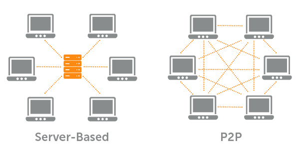
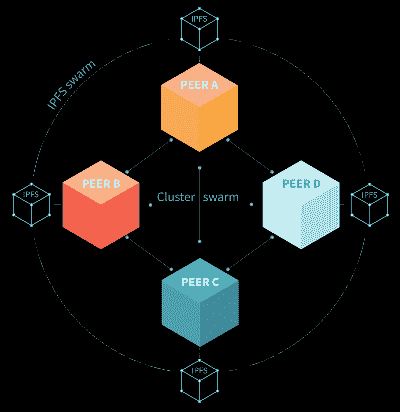
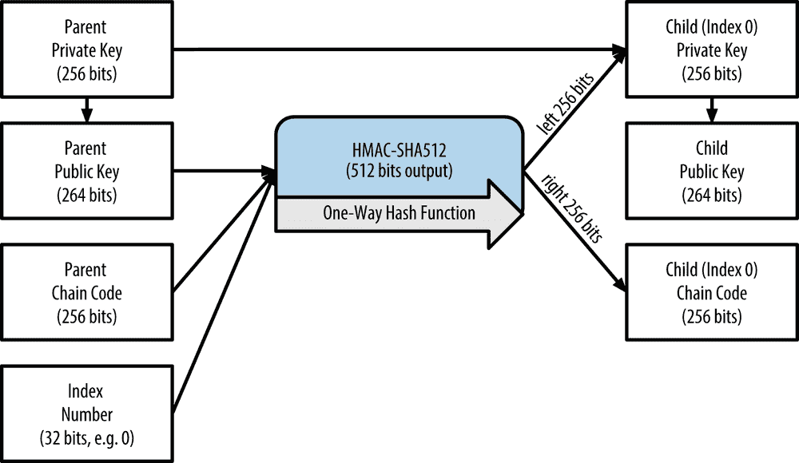
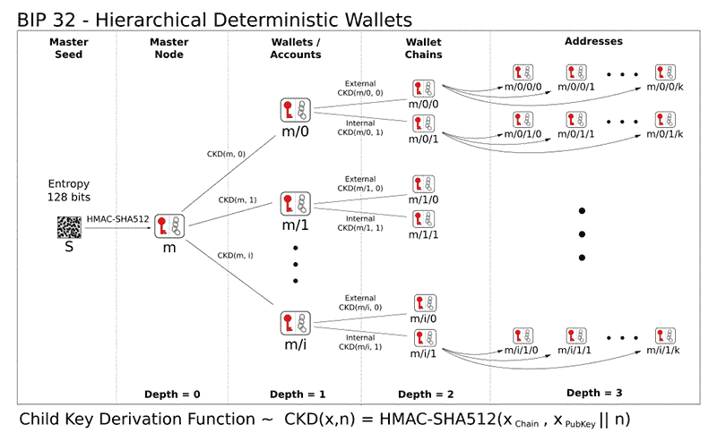
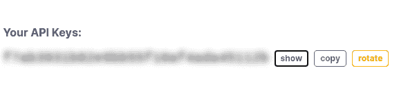
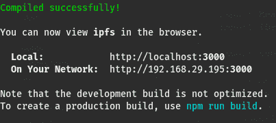
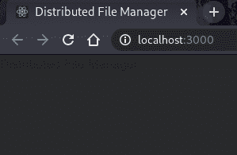
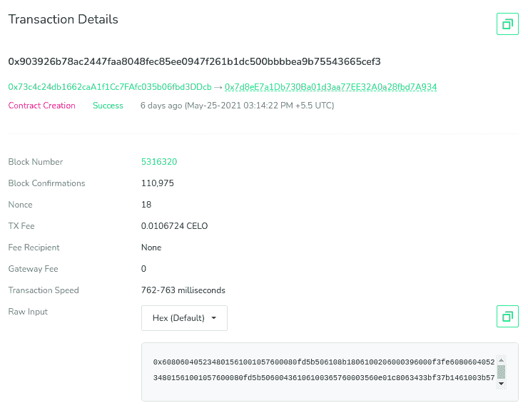
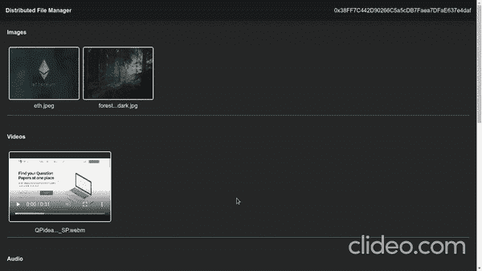

# 介绍

> 原文：<https://github.com/figment-networks/learn-tutorials/blob/master/celo/distributed-file-manager-using-ipfs-celo-reactjs.md>

在本教程中，我们将制作一个**分布式文件管理器**，使用 **IPFS** 协议存储我们的文件， **Celo** 网络存储每个地址的文件引用到他们上传的文件， **ReactJS** 用于前端代码。为了编译和部署我们的智能合同，我们将使用 **Truffle Suite** 。

供您参考， [Truffle Suite](https://www.trufflesuite.com) 是一个在 EVM 上启动分散式应用程序 dApps 的工具包。使用 Truffle，您可以编写和编译智能合同，构建工件，运行迁移，并与部署的合同进行交互。本教程演示了如何将 Truffle 用于 Celo 网络，这是 EVM 的一个实例。

# 先决条件

*   您已经在[数据中心](https://datahub.figment.io/sign_up?service=celo)上创建了一个帐户
*   基本熟悉 [Celo 的架构](https://docs.celo.org/)和智能合同。
*   基本熟悉[反应堆](https://reactjs.org)

# 要求

*   [NodeJS](https://nodejs.org/en) 。你需要在你的机器上安装 Node > = 10.16 和 npm > = 5.6。
*   [松露](https://www.trufflesuite.com/truffle)，可以用`npm install -g truffle`安装
*   [添加到浏览器的 Metamask](https://metamask.io) 扩展，必须从 Metamask 官方网站获取: [https://metamask.io](https://metamask.io) 。不要从非官方来源下载元掩码。

# 了解项目

从标题来看，**分布式文件管理器**，你会有一个想法，它是关于制作一个 dApp，允许我们以所谓的**分布式**的方式上传和管理文件。但是你可能想知道， **IPFS** 是什么，我们的文件将如何分发！！！没什么好担心的，只要通读课文，你所有的疑惑都会迎刃而解。

## 解读 IPFS，它有什么不同？

**IPFS** 是代表**I**I**P**I**F**I**S**系统的首字母缩写。它是一种用于存储和共享数据的通信协议和网络。从理论上讲，它的目标是在某一天制造一个可以在行星间交流的文件共享系统。查看[棒极了的 IPFS](https://awesome.ipfs.io/) 了解更多关于在 IPFS 建设的项目。

目前，我们被遵循 **HTTP** 又名**超文本传输协议**的**客户端-服务器**通信模式所主导。这意味着，在两个设备之间的通信中，一个必须是服务器(它将提供数据或用数据作出响应)，另一个应该是客户端(它将接收或请求数据)。这种客户机-服务器模型的主要问题是，客户机必须向远离它的服务器请求数据，即使相同的数据先前已经被它的邻居接收到或者在更近的地方可以得到。这将导致高延迟(接收数据的延迟)和低带宽(数据传输的速度)。



IPFS 是一个相对较新的协议，旨在解决这些问题。它遵循**对等**通信模型，在这种模型中，可以有任意数量的服务器向客户端提供所需的数据。一旦客户机有了数据(甚至只是一些其他数据)，它就可以充当服务器。如果安装了所需的软件，连接到网络的每个节点都可以充当服务器。从多个服务器发送数据可能看起来效率很低，但是，协议就是这样设计的。数据被散列并分成可以单独传输和存储的片段，但是如果有足够的信息，可以在以后重新连接。一旦所有的部分都就位，它就构成了整个文件。



**IPFS** 就是一大群这样的节点，它们选择提供数据服务。我们需要 IPFS 客户端连接到这些节点并上传数据。我们还可以使用可用的 javascript 客户端库(如`ipfs-http-client`)连接到网络。有几个提供者，像 **Infura** ，它提供一个 HTTP 门户来查看 IPFS 上的文件。更多的技术细节在前面的教程中提供。

# 初始化工作目录

我们的应用程序的客户端是使用 **ReactJS** 构建的。智能合同将使用 **Solidity** 语言制定，并将部署在 **Celo** 网络和 **Trufflesuite** 上。因此，我们需要根据 ReactJS 和 Trufflesuite 来设置我们的工作目录，以使我们的开发过程更加顺利。

打开终端并导航到我们将创建应用程序的目录。通常，这将是在我们的用户主目录，但可以位于任何可行的地方。在大多数 Linux 发行版中，这将变成/home/。在 macOS 上，它将是/Users/。在 Windows 上，用户目录位于 C:\Users 中。

```js
cd ~
```

## 设置 ReactJS 项目

使用 npx 创建新的 react 应用程序。npx 是 npm 包运行程序(x 代表执行)。典型的用途是临时下载并运行一个包或进行试用。你可以在这里了解更多关于 npx [的信息。](https://www.npmjs.com/package/npx)

```js
npx create-react-app dfm-celo-react
```

移动到新创建的目录并安装基本的依赖项。

```js
cd dfm-celo-react
npm install --save web3 ethers @truffle/contract @celo/contractkit
```

打开`public`目录中的文件`index.html`，用以下 HTML 替换现有代码:

```js
<!DOCTYPE html>
<html lang="en">
  <head>
    <meta charset="utf-8" />
    <meta name="viewport" content="width=device-width, initial-scale=1" />
    <title>Distributed File Manager</title>
    <link
      rel="stylesheet"
      href="https://cdn.jsdelivr.net/npm/bootstrap@4.6.0/dist/css/bootstrap.min.css"
    />
  </head>

  <body>
    <div id="root"></div>
  </body>
</html> 
```

打开`src`目录中的文件`App.js`，用以下代码替换现有代码:

```js
import React from "react";

// 1\. Importing other modules

class App extends React.Component {
  constructor(props) {
    super(props);
    this.state = {
      web3: null,
      account: null,
      contract: null,
    };
  }

  componentDidMount() {
    this.init();
  }

  async init() {
    // 2\. Load web3
    // 3\. Load Account
    // 4\. Load Smart-Contract instance
  }

  render() {
    return (
      <div>
        <font color="white">Distributed File Manager</font>
        {/* 5\. Navbar */}

        {/* 6\. IPFS Viewer component */}

        {/* 7\. IPFS Uploader component */}
      </div>
    );
  }
}
export default App;
```

这个`App`组件将维护与`Metamask`提供者的`web3`实例的状态，用于与 Celo 网络、`account`地址和已部署智能契约的实例进行交互。

打开`src`目录中的文件`index.js`，用以下代码替换现有代码:

```js
import React from "react";
import ReactDOM from "react-dom";
import App from "./App";

ReactDOM.render(
  <React.StrictMode>
    <App />
  </React.StrictMode>,
  document.getElementById("root")
);
```

React 项目设置现在已经完成。

## 建立松露项目

在根目录下运行下面的命令，为`Truffle`项目创建一个样板文件。

```js
truffle init
```

这将建立 Truffle 的初始项目结构。智能合同将存储在`contracts`文件夹中，用于将智能合同迁移到网络的部署功能将存储在`migrations`文件夹中。默认情况下，`/build/contracts`文件夹包含`.json`格式的已编译部署的合同、ABI 等信息，这些文件被称为`artifacts`。

上面命令创建的还有 1 个 **config** 文件， **truffle-config.js** 。在这个文件中，有许多关于如何部署契约、如何选择部署它们的网络以及许多其他信息。因此，我们应该保存这个文件以供参考。因此，使用下面的命令复制这个文件。这将创建一个名为`truffle-config-default.js`的副本。

```js
cp truffle-config.js truffle-config-default.js
```

现在我们可以用下面的代码更新`truffle-config.js`文件，在 Celo 的 Alfajores 测试网络上部署智能合约。这个文件是我们定义到 Alfajores 网络的连接的地方。需要具有有效助记符的 Celo 帐户才能将合同部署到网络。

```js
const Web3 = require("web3");
const ethers = require("ethers");
const ContractKit = require("@celo/contractkit");
require("dotenv").config();

const MNEMONIC = process.env.MNEMONIC;
const DATAHUB_CELO_API = process.env.DATAHUB_CELO_API;

const DATAHUB_API_URL = `https://celo-alfajores--rpc.datahub.figment.io/apikey/${DATAHUB_CELO_API}/`;

const web3 = new Web3(DATAHUB_API_URL);
const kit = ContractKit.newKitFromWeb3(web3);

async function awaitWrapper() {
  let account = ethers.Wallet.fromMnemonic(MNEMONIC, "m/44'/52752'/0'/0/0");
  let celoToken = await kit.contracts.getGoldToken();

  let celoBalance = await celoToken.balanceOf(account.address);
  console.log("Account address: ", account.address);
  console.log(`CELO Balance: ${celoBalance / 10 ** 18}`);

  if (celoBalance / 10 ** 18 < 0.4) {
    console.log("Balance too low to deploy contracts. Please fund your account here at https://celo.org/developers/faucet\n");
  }
  kit.connection.addAccount(account.privateKey);
}

awaitWrapper();

module.exports = {
  contracts_build_directory: "./src/build/contracts",
  networks: {
    development: {
      host: "127.0.0.1",
      port: 7545,
      network_id: "*",
    },
    alfajores: {
      provider: kit.connection.web3.currentProvider,
      network_id: 44787,
    },
  },
  compilers: {
    solc: {
      version: "0.8.0"
    }
  }
};
```

在这里，你可以看到我们已经使用`contracts_build_directory`将`artifacts`的默认位置从项目根目录更改为`src`文件夹。这是因为 React 无法访问位于`src`文件夹之外的文件。

在 Truffle 配置文件中，您可能已经注意到了许多术语，如钱包、助记符、地址和字符串“m/44'/527”...”，所有这些都在同一行中。让我们更详细地理解这行代码。

```js
let account = ethers.Wallet.fromMnemonic(MNEMONIC, "m/44'/52752'/0'/0/0");
```

在**钱包**或者更具体地说**分级确定性(HD)钱包**的概念出现之前，有独立的私有-公共密钥对。另一方面，HD 钱包是这些密钥对的树，其中一个密钥对可以生成多个子密钥对。

在高清钱包中，首先会生成一个随机的 128 - 256 位数，也称为**熵**或**根种子**或**私钥**。这个熵随后被附加上几个比特的校验和，使得熵的比特数是 11 的倍数。然后这个比特序列被分成每个 11 比特的部分。每个部分代表 2048 个单词的列表中的一个单词的索引。这个单词序列代表了我们钱包的**助记符**。

 Checksum 是数据哈希的几个位，用于检测传输或存储过程中可能引入的错误。通过散列实际数据并将其与附加的校验和进行比较来验证错误。如果校验和与散列数据匹配，则没有错误。

然后根种子被传递给单向散列函数以生成 512 位种子。左边的 256 位将成为主私钥，右边的 256 位将成为主链码。链码用于在子密钥中引入随机性。高清钱包使用**子密钥导出(CKD)** 功能从父密钥导出子密钥。子密钥派生函数基于单向哈希函数，该函数结合了:

*   父私钥或公钥
*   称为链码(256 位)的种子
*   索引号(32 位)


索引号的范围可以从 0 到 2^32 - 1。因此，使用具有给定私钥和链码的父密钥，我们可以生成 2^32 或大约 40 亿个子密钥对。在正常推导中，我们使用父公钥和链码来生成子密钥。但是这可能容易受到安全威胁，因此我们可以通过使用父母的私钥而不是 CKD 的公钥来使推导变得困难。这个过程被称为**硬化子密钥派生**。为了区别于正常的推导，我们使用不同的指数。对于正常衍生指数是从 0 到 2^31 - 1，对于硬化衍生指数是从 2^31 到 2^32 - 1。硬化索引号从 20 亿开始，这使得难以读取，因此我们使用 I’来表示索引 2^31 + i，其中 0 < = i < = 2^32 - 1。



主密钥和主链代码可以创建子密钥，子密钥可以进一步创建孙密钥等等。每一代被称为一个树级。使用**路径**命名约定来识别 HD wallet 中的密钥，树的每一级由斜杠(/)字符分隔。从主私钥导出的私钥以 **m** 开始。从主公钥导出的公钥以 **M** 开始。HD 路径`m/0`表示从主密钥导出的第 0 个或第一个子私钥。类似地，`m/3'/1`表示从主密钥导出的第 4 个或第(2^31 + 3)个硬化子密钥的第 2 个子私钥。



有各种比特币改进提案(BIP)提出了派生路径的标准方式。BIP0044(第 44 个提案)指定该结构由五个预定义的树级别组成:

`m / purpose' / coin_type' / account' / change / address_index`

*   **目的** -始终设置为 44’。
*   **coin_type** -指定加密货币硬币的类型，允许多货币高清钱包，其中每种货币在第二层下都有其子树。
*   **账户** -允许用户将他们的钱包细分为独立的逻辑子账户，用于会计或组织目的。
*   **change** -它有两个子树，一个是正常的接收地址，另一个用于接收当您提供的交易费用超过要求的交易费用时被还原的变更令牌。
*   我们可以使用所有的 40 亿个子密钥作为我们的地址，但是这个索引将设置我们钱包的主地址。

像 **celowallet.app** 这样的 Celo 钱包使用路径`m/44'/52752'/0'/0/0`进行密钥派生，因为 Celo 的硬币类型是 **52752** 。不同加密硬币的列表及其类型可以在[这里](https://github.com/satoshilabs/slips/blob/master/slip-0044.md)找到。硬币类型与区块链建筑无关，是随机选择的。默认情况下，`ethers.Wallet.fromMnemonic()`函数使用以太坊的默认路径，其硬币类型为 **60** 。这就是为什么我们需要在这个函数中手动设置路径。使用不同的路径将给出从相同助记符导出的不同地址。所以，如果我们想使用我们的手动路径，我们应该记住它们，否则，没有路径我们就不能导出地址。

我建议您在 [O'Reilly](https://www.oreilly.com/library/view/mastering-bitcoin/9781491902639/ch04.html) 上阅读更多关于这些钥匙、地址和钱包的信息。

## 获取 Celo 凭据

要部署智能合约，我们需要两样东西:一个连接到 **Celo** 网络的节点和一个拥有少量 **CELO** 令牌的账户。 **Datahub** 提供了一个 Celo 远程节点，为了连接到 Datahub 节点，我们需要一个 API key。访问 Datahub 上的 [Celo 服务仪表板](https://datahub.figment.io/services/celo)以获取 Celo 特定的 API 密钥。



现在我们需要一个钱包来存放我们的资金，用于网络上的所有交易。访问 [Celo 钱包](https://celowallet.app/)并创建一个账户。创建您的帐户时，您将看到您的公共地址和助记符。这个公共地址将被要求转移资金。将**助记符**保存在安全的地方，我们以后会用到。添加资金的说明将在本教程的后面提供。

## 补充。环境文件

在项目根文件夹中创建一个`.env`文件。请注意点号(。)是`.env`文件名所必需的。现在复制你的 Celo 钱包的助记符。env 文件如下所示。在。env 文件，**助记符**应该用双引号(" ")括起来。如果您在设置时遇到任何困难。然后请参考**附加指南**上的 [dotenv 和。env](https://docs.figment.io/network-documentation/extra-guides/dotenv-and-.env) 。

```js
DATAHUB_CELO_API=<your_datahub_api>
MNEMONIC="<celo-wallet-mnemonic>"
```

切勿共享或提交您的`.env`文件。它包含您的凭证，如`mnemonics`。因此，建议将`.env`添加到您的`.gitignore`文件中。

我们的项目设置现在已经完成。

要确认我们在同一页上，请在项目根文件夹中运行以下命令。

```js
npm start
```

这可能需要几秒钟的时间，显示如下图所示的输出。



在 web 浏览器中，访问 URL[http://localhost:3000](http://localhost:3000)。如果 npm start 没有遇到任何错误，我们将在页面顶部看到文本“分布式文件管理器”,如下图所示:



## 创建文件管理器合同

在`contracts`目录下创建文件`FileManager.sol` ( `.sol`代表坚固性)并粘贴以下代码:

```js
// SPDX-License-Identifier: UNLICENSED
pragma solidity >=0.8.0;

contract FileManager {
  // Structure of each File
  struct File {
    string fileName;
    string fileType;
    string cid;
  }

  // Mapping of each user's address with the array of files they are storing
  mapping(address => File[]) files;

  function addFile(string[] memory _fileInfo, string  memory _cid) public {
    files[msg.sender].push(File(_fileInfo[0], _fileInfo[1], _cid));
  }

  function getFiles(address _account) public  view  returns (File[] memory) {
    return files[_account];
  }
} 
```

是一个 solidity 智能合同，让我们存储和查看我们上传到 IPFS 网络上的文件的元细节。IPFS 使用内容寻址而不是位置寻址。为了识别网络上的文件，IPFS 对每个文件使用一个加密散列。这个散列被称为内容标识符或 cid。无论文件大小如何，这个散列的长度都是相同的，并且足以唯一地标识每个文件。将文件上传到 IPFS 后，我们会得到一个 cid，作为网络上该文件的参考，并将这个 cid 存储在 Celo 区块链上。

现在，IPFS 生成了一个唯一的内容标识符“cid ”,它可以用来在网络上引用这个文件。cid 看起来类似于`QmVwyUH96NeQPwLN5jDkgNxM41xGCB1EVjnBYX7NoWWmKH`，一长串大小写字母和数字。这是内容的散列表示。关于 IPFS 内容标识符的更多信息可以在 [IPFS 文档](https://docs.ipfs.io/concepts/content-addressing/#content-addressing-and-cids)中找到。

**让我们来理解这个智能合约**

智能合约的代码是`contract FileManager { }`内的所有内容。

**关于文件的基本结构** - `File`是一个 struct，是存储每个文件细节的骨架。我们有每个文件的三个属性:`fileName`、`fileType`，即它是图像、音频、视频还是应用程序，最后是`cid`。这里，`files`是文件的所有者(地址)和他们上传的那些`File`结构的数组之间的映射。

```js
// Structure of each File
struct File {
  string fileName;
  string fileType;
  string cid;
}

// Mapping of each user's address with the array of files they are storing
mapping(address => File[]) files; 
```

**添加文件** - `addFile()`函数用于将文件的细节添加到每个地址对应的`File`结构数组中。`files[msg.sender]`是指文件结构的数组，属于该函数的调用者，即地址`msg.sender`。函数的参数是由两个参数(分别是文件名和文件类型)组成的数组`_fileInfo[]`，第二个参数是上传文件的内容 id`cid`。

```js
function addFile(string[] memory _fileInfo, string  memory _cid) public {
  files[msg.sender].push(File(_fileInfo[0], _fileInfo[1], _cid));
} 
```

**查看存储文件** - `getFiles()`是返回账户地址对应的文件结构数组的函数。它以数组的形式返回所有文件的详细信息，这些文件是通过 IPFS 网络上的地址(在此函数的参数中传递)上传的。

```js
function getFiles(address _account) public  view  returns (File[] memory) {
  return files[_account];
} 
```

**为迁移智能合同创建新文件**

在`migrations`目录中创建一个名为`2_deploy_contracts.js`的新文件，并添加以下代码块。它负责将`FileManager`智能合同部署到区块链。

```js
const FileManager = artifacts.require("FileManager");

module.exports = function (deployer) {
  deployer.deploy(FileManager);
};
```

## 用块菌编合同

如果我们修改了 Solidity 源文件中的代码或者制作了新的代码(比如`FileManager.sol`，我们需要在终端中从项目根目录中运行`truffle compile`。

```js
truffle compile
```

您应该看到:

```js
Compiling your contracts...
===========================
> Compiling ./contracts/FileManager.sol
> Artifacts written to /home/guest/blockchain/dfm-celo-react/src/build/contracts
> Compiled successfully using:
   - solc: 0.8.0+commit.c7dfd78e.Emscripten.clang
```

如果在安装`truffle`时没有自动安装`pify`模块，可能会出现错误`Error: Cannot find module 'pify'`。因此，这个问题可以通过使用以下命令单独安装`pify`来解决

```js
npm install pify --save 
```

编译智能合同将在`src/build/contracts`目录中创建`.json`文件。它存储了`ABI`和其他必要的元数据。

 `ABI`是指应用程序二进制接口，它是用于从区块链外部与智能合同交互以及合同到合同交互的标准。请参考 Solidity 关于 about】这里的文档了解更多。

**为帐户提供资金，并在 Celo 的 Alfjores 测试网络上运行迁移。**

将智能合约部署到 Celo 网络时，将需要一些部署成本。正如您在`truffle-config.js`中看到的，`@celo/contractkit`将帮助我们在 Celo 上部署，部署成本将由一个帐户管理，该帐户的助记符已存储在`.env`文件中。因此，我们需要资金帐户。

**为您的账户注资**

使用水龙头链接【https://celo.org/developers/faucet T2】和粘贴你的 Celo 的钱包地址在输入字段资金你的帐户。您至少需要发送`0.4 CELO`。部署所需的最低 CELO 将因合同而异，这取决于我们的合同所使用的变量和数据结构。尽管通过水龙头融资会给你足够的资金在网络上运行多个部署和交易。

## 运行迁移

现在，运行迁移和部署`FileManager`的一切都已就绪:

```js
truffle migrate --network alfajores
```

这可能需要一段时间，取决于您的互联网连接或 CELO 网络的流量。

注意——出于开发目的，我们可以通过运行 Ganache (Truffle 的本地区块链模拟)并使用命令，在本地网络上部署我们的合同

```js
truffle migrate --network development
```

成功执行该命令后，您应该会看到:

```js
Compiling your contracts...
===========================
> Everything is up to date, there is nothing to compile.

Account address:  0x73c4c24db1662caA1f1Cc7FAfc035b06fbd3DDcb
CELO Balance: 4.11118206

Starting migrations...
======================
> Network name:    'alfajores'
> Network id:      44787
> Block gas limit: 0 (0x0)

1_initial_migration.js
======================

   Replacing 'Migrations'
   ----------------------
   > transaction hash:    0x77b8e8c431e9de6a6880921a7edcf4c686ed15d5d6db39ef81402f0363c32c88
   > Blocks: 0            Seconds: 0
   > contract address:    0x13fE0e50a923E237E14148CfcdbeAcDBbB35c7CB
   > block number:        5316318
   > block timestamp:     1621935852
   > account:             0x73c4c24db1662caA1f1Cc7FAfc035b06fbd3DDcb
   > balance:             4.10812426
   > gas used:            152890 (0x2553a)
   > gas price:           20 gwei
   > value sent:          0 ETH
   > total cost:          0.0030578 ETH

   > Saving migration to chain.
   > Saving artifacts
   -------------------------------------
   > Total cost:           0.0030578 ETH

2_deploy_contracts.js
=====================

   Replacing 'FileManager'
   -----------------------
   > transaction hash:    0x903926b78ac2447faa8048fec85ee0947f261b1dc500bbbbea9b75543665cef3
   > Blocks: 0            Seconds: 0
   > contract address:    0x7d8eE7a1Db730Ba01d3aa77EE32A0a28fbd7A934
   > block number:        5316320
   > block timestamp:     1621935862
   > account:             0x73c4c24db1662caA1f1Cc7FAfc035b06fbd3DDcb
   > balance:             4.09661876
   > gas used:            533620 (0x82474)
   > gas price:           20 gwei
   > value sent:          0 ETH
   > total cost:          0.0106724 ETH

   > Saving migration to chain.
   > Saving artifacts
   -------------------------------------
   > Total cost:           0.0106724 ETH

Summary
=======
> Total deployments:   2
> Final cost:          0.0137302 ETH
```

部署智能合约是区块链网络上的一项事务。因此，在上面的输出中，您可以看到一个以`0x`开头的**事务散列**。使用此交易散列，您可以在 Celo 的 Alfajores 网络上验证您的交易，使用他们的区块链浏览器[在这里](https://alfajores-blockscout.celo-testnet.org/)通过搜索您的交易散列。您会看到类似下图的内容。



您还可以使用上面的`truffle migrate`输出中提供的合同地址来查看您部署的智能合同。

## 可能的错误和故障排除

如果您尚未在`CELO`上创建帐户，您会看到以下错误:

```js
Error: Expected parameter 'from' not passed to function.
```

如果您没有为该帐户注资，您会看到以下错误:

```js
Compiling your contracts...
===========================
> Everything is up to date, there is nothing to compile.

Account address:  0xE23cBDb396b7BE479Dd3eD417B22D038DeB84E83
CELO Balance: 0
Balance too low to deploy contracts. Please fund your account here at https://celo.org/developers/faucet

Starting migrations...
======================
> Network name:    'alfajores'
> Network id:      44787
> Block gas limit: 0 (0x0)

1_initial_migration.js
======================

   Replacing 'Migrations'
   ----------------------

Error:  *** Deployment Failed ***

"Migrations" could not deploy due to insufficient funds
   * Account:  0xE23cBDb396b7BE479Dd3eD417B22D038DeB84E83
   * Balance:  0 wei
   * Message:  insufficient funds for gas * price + value + gatewayFee
   * Try:
      + Using an adequately funded account
      + If you are using a local Geth node, verify that your node is synced.
```

已部署合同的合同地址和 ABI 等信息在`src/build/contract`目录中显示为`FileManager.json`。

# 构建用户界面

我们已经建立了我们的 React 项目目录。与 Celo 区块链交互的客户端文件位于`src`文件夹中。首先，我们将制作一个包含几个函数的 ReactJS 组件，将我们的浏览器与 Avalanche 网络连接起来。这些函数将保存在一个名为`BlockchainUtil.js`的单独文件中。

## BlockchainUtils 组件

在项目`src`目录中创建文件`BlockchainUtil.js`，并粘贴以下代码:

```js
import React from "react";
import Web3 from "web3";
import TruffleContract from "@truffle/contract";

// For connecting our web application with Metamask Web3 Provider
export class GetWeb3 extends React.Component {
  async getWeb3() {
    let web3 = window.web3;
    if (typeof web3 !== "undefined") {
      // Setup Web3 Provider
      this.web3Provider = web3.currentProvider;
      this.web3 = new Web3(web3.currentProvider);
      return this.web3;
    } else {
      this.isWeb3 = false;
    }
  }
}

// For getting our Smart-Contract's instance to interact with it using javascript
export class GetContract extends React.Component {
  async getContract(web3, contractJson) {
    // Setup Contract
    this.contract = await TruffleContract(contractJson);
    this.contract.setProvider(web3.currentProvider);
    return await this.contract.deployed();
  }
}

// For getting our account address from the Metamask
export class GetAccount extends React.Component {
  async getAccount(web3) {
    return await web3.eth.getAccounts();
  }
}
```

**更新 App.js** - `App.js`是任何 React 应用的切入点。因此，我们需要定期更新`App.js`中我们希望在应用程序中显示的组件。随着我们更进一步，构建所有组件，我们最终也会更新`App.js`。

## IPFSUploader 组件

现在让我们制作一个组件，将文件从我们的系统上传到 IPFS 网络。因此，在`src`目录中创建一个名为`IPFSUploader.js`的文件，并在其中粘贴以下代码。

```js
import React from "react";
import Compressor from "compressorjs";
import { Loader } from "rimble-ui";

const { create } = require("ipfs-http-client");
const ipfs = create({ host: "ipfs.infura.io", port: 5001, protocol: "https" });

class IPFSUploader extends React.Component {
  constructor(props) {
    super(props);
    this.state = {
      buffer: null,
      fileName: null,
      fileType: null,
      cid: null,
      account: this.props.state.account,
      loading: false,
      loadingReason: "",
    };
  }

  captureFile = (event) => {
    event.preventDefault();
    const file = event.target.files[0];
    var type = file.type.split("/");

    if (type[0] === "image") {
      new Compressor(file, {
        quality: 0.2,
        success: (compressedResult) => {
          const reader = new window.FileReader();
          reader.readAsArrayBuffer(compressedResult);
          reader.onloadend = () => {
            this.setState({
              buffer: Buffer(reader.result),
              fileName: file.name,
              fileType: file.type,
            });
          };
        },
      });
    } else {
      const reader = new window.FileReader();
      reader.readAsArrayBuffer(file);
      reader.onloadend = () => {
        this.setState({
          buffer: Buffer(reader.result),
          fileName: file.name,
          fileType: file.type,
        });
      };
    }
  };

  onSubmit = async (event) => {
    event.preventDefault();

    this.setState({ loading: true, loadingReason: "Uploading to IPFS" });
    const { cid } = await ipfs.add(this.state.buffer);
    this.setState({ cid: cid.string, loadingReason: "Waiting for approval" });

    try {
      await this.props.state.contract.addFile(
        [this.state.fileName, this.state.fileType],
        this.state.cid,
        { from: this.props.state.account, gas: 20000000 }
      );
    } catch (e) {
      console.log("Transaction failed");
    }

    this.setState({ loading: false });
  };

  render() {
    return (
      <div>
        <center style={{ margin: "50px auto" }}>
          <form onSubmit={this.onSubmit}>
            <input
              className="text-light bg-dark"
              type="file"
              onChange={this.captureFile}
            />
            <br />
            <br />

            {this.state.loading ? (
              <center>
                <Loader size="40px" color="white" />
                <br />
                <font size="2" color="white" style={{ marginTop: "-10px" }}>
                  {this.state.loadingReason}
                </font>
              </center>
            ) : (
              <input className="btn btn-dark" type="submit" />
            )}
          </form>
        </center>
      </div>
    );
  }
}

export default IPFSUploader;
```

让我们一块一块地来理解这个组件。

**IPFS 客户端**——首先我们需要使用`ipfs-http-client`模块连接到 IPFS 客户端。这必须由像`Infura`这样的 IPFS 提供商来完成。因此，下面的代码行将创建一个 IPFS 客户端-

```js
const  ipfs = create({ host:  'ipfs.infura.io', port:  5001, protocol:  'https' })
```

**状态** - **IPFSUploader** 组件会维护一个文件属性的状态，如每个文件的`fileName`、`fileType`、`buffer`、上传文件的`account`地址、`cid`。每当文件类型的输入字段发生变化时，这些状态变量将被更新。

**captureFile()** -每当输入字段中出现`onChange`事件时，就会调用该函数。这将使用必要的文件信息更新状态。在这个函数中，我们将有一个`Compressor`实例来压缩`image`类型的文件。

当用户提交包含文件的表单作为输入时，这个函数将被调用。该函数将首先调用 IPFS 客户端的`add()`函数，并上传该文件的`buffer`，该文件先前存储在该组件的`state`中。文件一旦上传，就会返回一个`cid`。之后，我们将使用`addFile()`合同功能将此文件信息与`cid`一起添加到智能合同中。

由于我们使用了以前没有安装的新库，如`compressorjs`、`ipfs-http-client`和`rimble-ui`，因此请使用下面的命令安装这些库。

```js
npm install --save ipfs-http-client compressorjs rimble-ui --force
```

 Rimble UI 库附带了一个对等依赖项`react@16.9.0`，它不是我们正在使用的 React 的最新版本，即`react@17.0.2`。运行没有`--force`标签的`npm install`命令会导致`unable to resolve dependency tree`冲突。因此，`--force`标签用于覆盖任何类型的冲突，并继续安装。解决这种冲突的另一种方法是使用`--legacy-peer-deps`标签，但是这会忽略我们不需要的所有对等依赖，因为冲突只发生在`react`和`rimble-ui`之间。

## IPFSViewer 组件

现在创建一个名为`IPFSViewer.js`的新文件。该组件将用于从部署的智能合同中获取文件信息，并将其显示在网站上。在其中添加以下代码。

```js
import React from "react";
import App from "./App";
import IPFSViewerCSS from "./IPFSViewerCSS.css";

class IPFSViewer extends React.Component {
  constructor(props) {
    super(props);
    this.state = {
      imageFiles: [],
      videoFiles: [],
      applicationFiles: [],
      audioFiles: [],
      otherFiles: [],
    };
  }

  app = null;

  async componentDidMount() {
    this.app = new App();
    await this.app.init();
    await this.loadFiles();
  }

  loadFiles = async () => {
    const files = await this.app.contract.getFiles(this.app.account[0]);
    var imageFiles = [], videoFiles = [], audioFiles = [], applicationFiles = [], otherFiles = [];

    files.forEach((file) => {
      var type = file[2].split("/");
      if (type[0] === "image") {
        imageFiles.push(file);
      } else if (type[0] === "video") {
        videoFiles.push(file);
      } else if (type[0] === "audio") {
        audioFiles.push(file);
      } else if (type[0] === "application") {
        applicationFiles.push(file);
      } else {
        otherFiles.push(file);
      }
    });

    this.setState({
      imageFiles,
      videoFiles,
      audioFiles,
      applicationFiles,
      otherFiles,
    });
  };

  showImageFiles = () => {
    var fileComponent = [];

    this.state.imageFiles.forEach((file) => {
      var fileName;
      if (file[1].length < 12) {
        fileName = file[1];
      } else {
        fileName = file[1].substring(0, 6) + "..." + file[1].substring(file[1].length - 8, file[1].length);
      }

      fileComponent.push(
        <a href={`https://ipfs.infura.io/ipfs/${file[3]}`}>
          
          <center>{fileName}</center>
        </a>
      );
    });
    return fileComponent;
  };

  showVideoFiles = () => {
    var fileComponent = [];
    this.state.videoFiles.forEach((file) => {
      var fileName;
      if (file[1].length < 12) {
        fileName = file[1];
      } else {
        fileName = file[1].substring(0, 6) + "..." + file[1].substring(file[1].length - 8, file[1].length);
      }
      fileComponent.push(
        <div>
          <video
            src={`https://ipfs.infura.io/ipfs/${file[3]}#t=0.1`}
            controls
            style={{
              margin: "5px",
              width: "290px",
              height: "200px",
              border: "solid white 2px",
              borderRadius: "5px",
            }}
          />
          <center>{fileName}</center>
        </div>
      );
    });
    return fileComponent;
  };

  showAudioFiles = () => {
    var fileComponent = [];
    this.state.audioFiles.forEach((file) => {
      var fileName;
      if (file[1].length < 12) {
        fileName = file[1];
      } else {
        fileName = file[1].substring(0, 6) + "..." + file[1].substring(file[1].length - 8, file[1].length);
      }
      fileComponent.push(
        <div>
          <audio
            src={`https://ipfs.infura.io/ipfs/${file[3]}#t=0.1`}
            controls
            style={{ margin: "10px" }}
          />
          <center>{fileName}</center>
        </div>
      );
    });
    return fileComponent;
  };

  showApplicationFiles = () => {
    var fileComponent = [];
    this.state.applicationFiles.forEach((file) => {
      var fileName;
      if (file[1].length < 12) {
        fileName = file[1];
      } else {
        fileName = file[1].substring(0, 6) + "..." + file[1].substring(file[1].length - 8, file[1].length);
      }
      fileComponent.push(
        <div style={{ width: "120px" }}>
          <center
            style={{ cursor: "pointer" }}
            onClick={() => {
              window.location.href = `https://ipfs.infura.io/ipfs/${file[3]}`;
            }}
          >
            <a href={`https://ipfs.infura.io/ipfs/${file[3]}`}>
              
              <br />
              {fileName}
            </a>
          </center>
        </div>
      );
    });
    return fileComponent;
  };

  showOtherFiles = () => {
    var fileComponent = [];
    this.state.otherFiles.forEach((file) => {
      var fileName;
      if (file[1].length < 12) {
        fileName = file[1];
      } else {
        fileName =
          file[1].substring(0, 6) +
          "..." +
          file[1].substring(file[1].length - 8, file[1].length);
      }
      fileComponent.push(
        <div style={{ width: "120px" }}>
          <center style={{ cursor: "pointer" }}>
            <a href={`https://ipfs.infura.io/ipfs/${file[3]}`}>
              
              <br />
              {fileName}
            </a>
          </center>
        </div>
      );
    });
    return fileComponent;
  };

  render() {
    var imageFiles = this.showImageFiles(), videoFiles = this.showVideoFiles(), audioFiles = this.showAudioFiles(), applicationFiles = this.showApplicationFiles(), otherFiles = this.showOtherFiles();

    return (
      <div style={{ margin: "20px" }}>
        <b style={{ color: "white" }}>Images</b> <br /><br />

        <div
          className={"imageViewer"}
          style={{
            color: "white",
            height: "200px",
            display: "flex",
            overflowX: "scroll",
          }}
        >
          {imageFiles.length === 0 ? "No files to show" : imageFiles}
        </div> <br /><br />

        <b style={{ color: "white" }}>Videos</b> <br /><br />
        <div
          className={"imageViewer"}
          style={{
            color: "white",
            height: "250px",
            display: "flex",
            overflowX: "scroll",
          }}
        >
          {videoFiles.length === 0 ? "No files to show" : videoFiles}
        </div> <br /><br />

        <b style={{ color: "white" }}>Audio</b> <br /><br />

        <div
          className={"imageViewer"}
          style={{
            color: "white",
            height: "250px",
            display: "flex",
            overflowX: "scroll",
          }}
        >
          {audioFiles.length === 0 ? "No files to show" : audioFiles}
        </div> <br /><br />

        <b style={{ color: "white" }}>Applications</b> <br /><br />

        <div
          className={"imageViewer"}
          style={{
            color: "white",
            height: "150px",
            display: "flex",
            overflowX: "scroll",
          }}
        >
          {applicationFiles.length === 0 ? "No files to show" : applicationFiles}
        </div> <br /><br />

        <b style={{ color: "white" }}>Others</b> <br /><br />

        <div
          className={"imageViewer"}
          style={{
            color: "white",
            height: "150px",
            display: "flex",
            overflowX: "scroll",
          }}
        >
          {otherFiles.length === 0 ? "No files to show" : otherFiles}
        </div>
      </div>
    );
  }
}

export default IPFSViewer;
```

我们来分块理解一下上面的组件。

**状态**——该组件的状态将包含一系列不同类型的文件，如`imageFiles`、`audioFiles`等。

**loadFiles()** -该函数将在组件安装后被调用，并将使用智能合约的`getFiles()`函数加载帐户地址上传的所有文件的状态，它可以很容易地从区块链获取所有文件信息。它将分离不同类型的文件，如图像，视频，音频等。并相应地更新状态。

**showImageFiles()** -这个函数将把所有图像文件组成的组件作为一个数组返回给这个函数的调用者。

同样，每种文件类型都有不同的功能。

## IPFSViewer 样式表

`IPFSViewerCSS.css`文件已被导入，为页面添加了一些设计，如减小滚动条的宽度、颜色变化等。因此，创建一个名为`IPFSViewerCSS.css`的新文件，并在其中添加以下代码。

```js
.imageViewer::-webkit-scrollbar {
  height: 2px;
}

.imageViewer::-webkit-scrollbar-track {
  box-shadow: inset 0 0 5px rgb(94, 94, 94);
  border-radius: 50px;
}

.imageViewer::-webkit-scrollbar-thumb {
  background: rgb(0, 0, 0);
  border-radius: 50px;
}

a {
  color: white;
}
```

现在我们需要更新我们的`App.js`文件，包含我们到目前为止制作的所有组件。

**导入模块**——首先通过在`//1 Importing...`部分添加以下代码，将所有模块和组件导入到`App.js`文件中。

```js
// 1\. Importing other modules
import {GetWeb3, GetContract, GetAccount} from './BlockchainUtil';
import IPFSUploader from './IPFSUploader';
import IPFSViewer from './IPFSViewer';

import contractJson from './build/contracts/FileManager.json';
```

**加载 web 3**——现在将下面的代码放到`//2\. Load web3...`部分。这将设置 web3 实例的状态。

```js
// 2\. Load web3
const Web3 = new GetWeb3();
this.web3 = await Web3.getWeb3();
this.setState({web3: this.web3});
```

**加载账户**——将以下代码放在`//3\. Load Account...`部分下。这将使用 Metamask wallet 的第一个连接地址设置状态。

```js
// 3\. Load Account
const Account = new GetAccount();
this.account = await Account.getAccount(this.web3);
this.setState({account: this.account[0]});
```

**加载智能合同**——将以下代码放在`//4\. Load smart...`部分下。这将使用 Javascript 为契约的交互设置已部署智能契约实例的状态。

```js
// 4\. Load Contract
const Contract = new GetContract();
this.contract = await Contract.getContract(this.web3, contractJson);
this.setState({contract: this.contract});
```

**加载组件**——在`return()`函数的`<div>`标签内，用以下组件的代码替换现有的样本文本`Distributed File Manager`。

```js
{/* 5\. Navbar */}
<nav className="navbar navbar-dark shadow" style={{backgroundColor: "#1b2021", height: "60px", color: "white"}}>
  <b>Distributed File Manager</b>
  <span style={{float: "right"}}>{this.state.account}</span>
</nav>

{/* 6\. IPFS Viewer com  ponent */}
<IPFSViewer state = {this.state} />

{/* 7\. IPFS Uploader component */}
<IPFSUploader state = {this.state} />
```

现在转到项目的项目根目录，即`dfm-celo-react`目录，运行命令`npm start`。ReactJS 服务器将自动启动。访问 [http://localhost:3000](http://localhost:3000) 与搭建好的 dApp 互动。

不要忘记用`Celo` Alfajores testnet 设置 Metamask，并且用 Alfajores 测试令牌为帐户提供资金以上传文件。

在 Metamask 扩展中，通过单击扩展中心的 network 下拉菜单添加一个自定义 RPC。如下图所示填写详细信息。将特定于 Celo 的 Datahub 的 API 键放在**新的 RPC URL** 字段中，代替`YOUR_API_KEY`。


| 信息 | 价值 |
| :-- | :-- |
| 网状名字 | 嫉妒裁缝师 |
| 新 RPC URL | [https://celo-alfajores-rpc.datahub.figment.io/apikey/YOUR_API_KEY/](https://celo-alfajores--rpc.datahub.figment.io/apikey/YOUR_API_KEY/) |
| 链 ID | Forty-four thousand seven hundred and eighty-seven |
| 货币符号 | 克利奥 |

如果您发现在设置项目时有任何困难，那么可以随意克隆这个库[https://github.com/rajranjan0608/dfm](https://github.com/rajranjan0608/dfm)，并按照这个 repo 的`README.md`文件中的步骤来运行应用程序。



# 结论

恭喜你！通过使用 **Trufflesuite** 在 **Celo** Alfajores 测试网络上部署智能合约，并连接使用 **ReactJS** 制作的客户端，您已经成功构建了一个分布式文件管理器。最有趣的部分是我们使用了 IPFS 协议在分布式网络上上传我们的文件。

# 后续步骤

我们已经建立了一个分布式文件管理器，具有基本的上传和查看功能。我想鼓励你通过添加一些更多的功能来制作一个更加可扩展和复杂的应用程序，比如在上传之前使用接收者的公钥或他们的帐户地址来加密文件。或者，如果您想自己保存该文件，可以使用您的帐户地址加密该文件。点击此处了解更多关于如何在将文件上传到 IPFS 之前加密文件的信息[。](https://mycoralhealth.medium.com/learn-to-securely-share-files-on-the-blockchain-with-ipfs-219ee47df54c)

# 关于作者

本教程由 [Raj Ranjan](https://www.linkedin.com/in/iamrajranjan) 创作，你可以在 [GitHub](https://github.com/rajranjan0608) 上与作者取得联系

如果你在阅读本教程时有任何困难，或者只是想与我们讨论 Celo 的技术，你可以 [**今天就加入我们的社区**](https://discord.gg/fszyM7K) ！