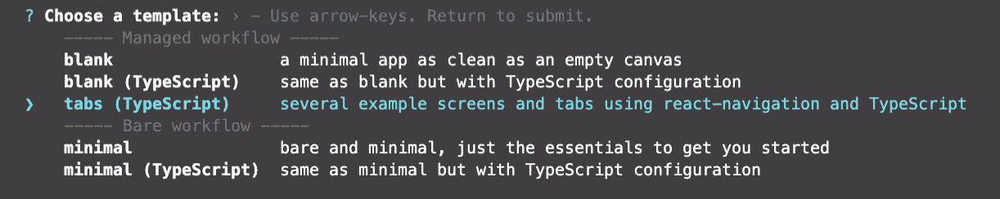
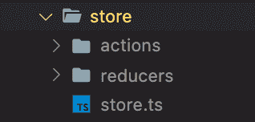
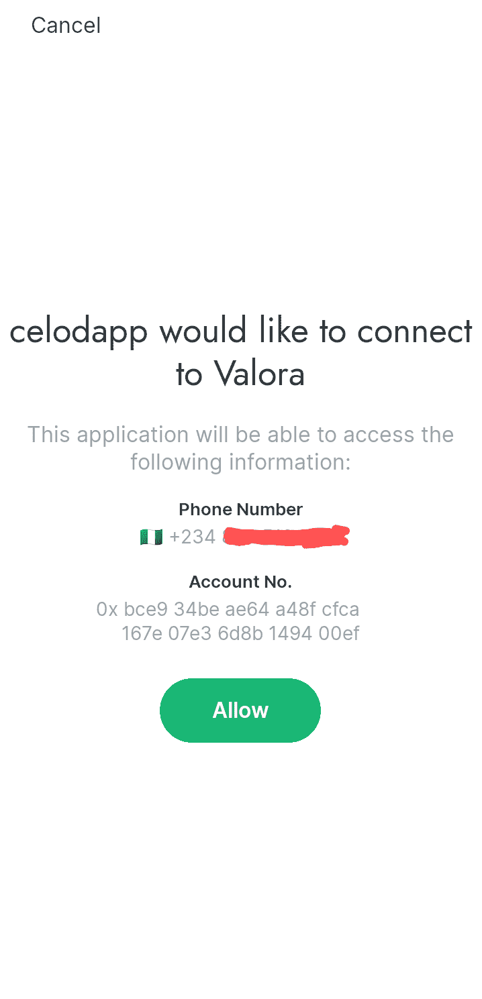
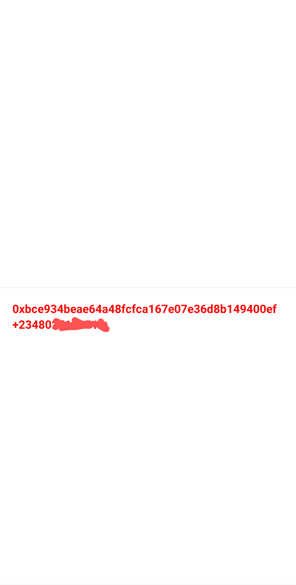
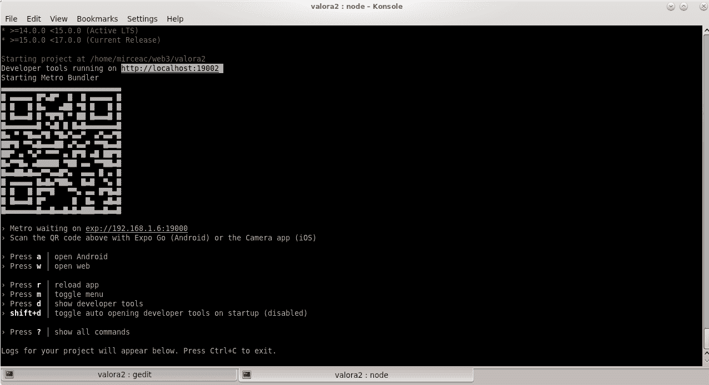
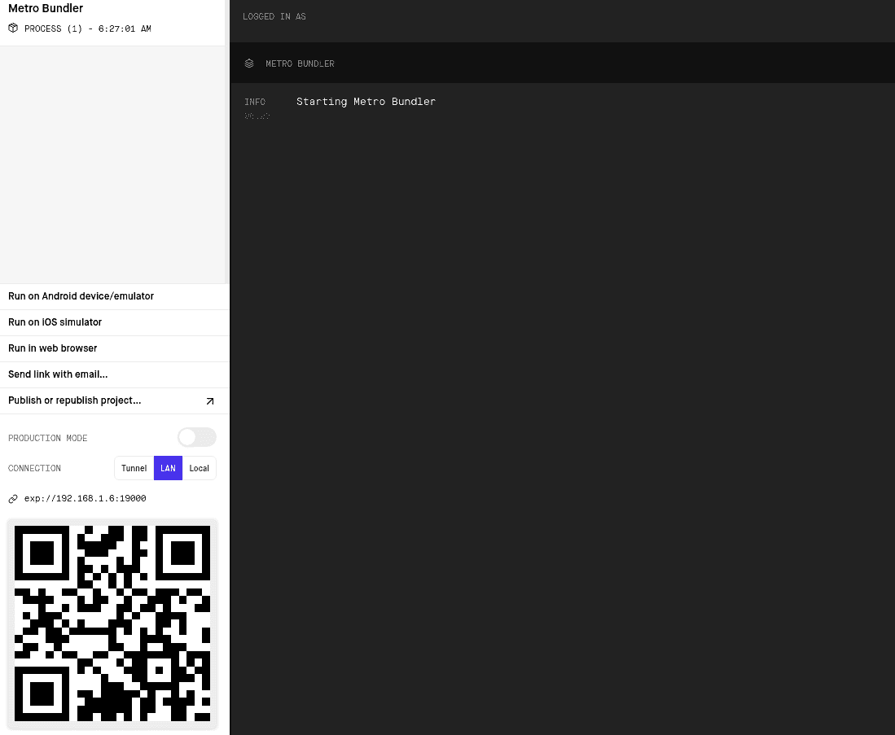
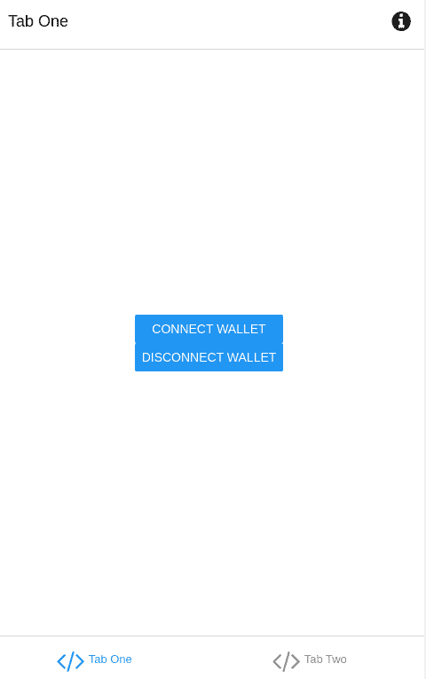
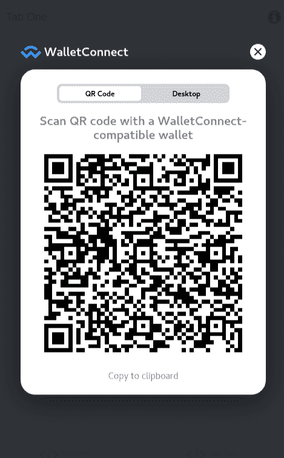
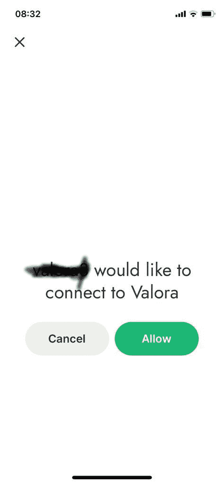
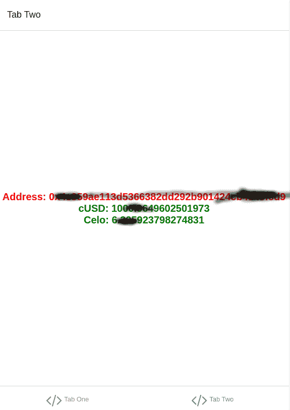

# celo/how-to-successfully-connect-to-a-celo-wallet-with-a-react-native-dapp

> 原文：<https://github.com/figment-networks/learn-tutorials/blob/master/celo/how-to-successfully-connect-to-a-celo-wallet-with-a-react-native-dapp.md>

在本教程中，您将学习如何成功连接 React 本机应用程序以使用 Celo 钱包，并从 Alfajores 钱包返回钱包地址。

*要在 Celo 网络上进行交易，您必须连接您的钱包才能进行交易。当您开始使用 React Native 构建 dApp 时，您将需要本指南来演示如何安装所需的库来启动和运行您的 dAPP。*

# 先决条件

本文假设您对 JavaScript (TypeScript)以及如何使用 expo 启动 React Native 应用程序有基本的了解。我们还假设您已经阅读了世博会文档，并对 Celo 钱包有基本的了解。

1.  [Celo Wallet](https://docs.celo.org/getting-started/alfajores-testnet/using-the-mobile-wallet)
2.  [使用 expo 反应本地](https://docs.expo.io/)
3.  [DappKit](https://docs.celo.org/developer-guide/dappkit/setup)

# 项目设置

您将需要节点版本`^10.13.0`
打开 Celo 文档并遵循设置说明:

`expo init $YOUR_APP_NAME`
我们将使用`TypeScript Template >> Tabs`



要使用 Celo DappKit，请使用:`yarn add @celo/dappkit`
安装 DappKit 的依赖项需要一点调整才能使用 vanilla Expo。首先是许多预期的 Node.js 模块。您可以通过使用以下模块获得这些信息:`yarn add node-libs-react-native vm-browserify`

**重要提示！**

expo 包安装的默认 React 原生库会导致你的应用程序崩溃。要解决这个问题，请转到`package.json`文件，在编写本教程时将`react-native`版本值替换为这个:`^0.63.4`。您始终可以使用 React Native 的最新版本。

**已安装软件包的注释**

*node-libs-react-native* :这个包提供了 react 本地兼容的节点核心模块的实现，比如 stream 和 http。这是 node-libs-browser 的一个分支，交换了一些包以兼容 React Native。

*vm-browserify* 用于为浏览器模拟节点的 vm 模块。

**需要注意的几点:**

*metro . config . js 文件*

```js
const crypto = require.resolve('crypto-browserify');
const url = require.resolve('url/');
module.exports = {
  resolver: {
    extraNodeModules: {
      crypto,
      url,
      fs: require.resolve('expo-file-system'),
      http: require.resolve('stream-http'),
      https: require.resolve('https-browserify'),
      net: require.resolve('react-native-tcp'),
      os: require.resolve('os-browserify/browser.js'),
      path: require.resolve('path-browserify'),
      stream: require.resolve('readable-stream'),
      vm: require.resolve('vm-browserify'),
    },
  },
};
```

这应该允许您构建项目，但是一些依赖项可能期望全局环境中的某些不变量。为此，您应该创建一个包含以下内容的文件`global.ts`:

```js
export interface Global {
  btoa: any
  self: any
  Buffer: any
  process: any
  location: any
}

declare var global: Global
if (typeof global.self === 'undefined') {
  global.self = global
}

if (typeof btoa === 'undefined') {
  global.btoa = function (str: string) {
    return new Buffer(str, 'binary').toString('base64')
  }
}

global.Buffer = require('buffer').Buffer
global.process = require('process')
global.location = {
  protocol: 'https',
}
```

然后在你的`App.js/tsx`文件的顶部添加`import './global'`

**设置 Redux**

使用以下命令安装 Redux 库:

```js
yarn add redux redux-thunk redux-logger react-redux 
```

为了让 TypeScript 在本地运行 redux logger 而不出现任何错误，您必须使用以下命令将库`@types/redux-logger`添加到 devDependencies:

```js
yarn add @types/redux-logger --dev 
```

使用命令`expo start`运行应用程序。

# 密码

在安装了所需的库之后，我们可以在 React Native 应用程序中构建两个简单的屏幕。第一个屏幕将有一个按钮。该按钮将用于让用户登录 dApp。第二个屏幕将是证明用户已经成功认证的屏幕。

第二个屏幕将返回用户的钱包地址。

**让我们来制作屏幕**:

```js
export default function LoginScreen() {
  return (
    <View style={styles.container}>
      <Button>Connect Wallet</Button>
    </View>
  );
}
```

[](https://github.com/figment-networks/learn-tutorials/raw/master/assets/loginscreen.png)

```js
export default function HomeScreen() {
  return (
    <View>
      <Text>wallet address</Text>
      <Text>wallet phone</Text>
    </View>
  );
}
```

**让我们实现连接到钱包的逻辑**:

我们将使用 Redux 来管理应用程序状态，我们必须设置 Redux 操作来调用 Celo Wallet 并返回结果，然后将结果保存在应用程序全局状态中。为了让您的目录保持整洁，请打开一个目录来保存 Redux 逻辑的文件:



您可以将名为`constants.js`的文件添加到 Redux Store 目录中。通过将常量作为被调度的动作类型，常量将被用于跟踪钱包连接过程，然后使用 reducer 相应地更新状态。

```js
export const walletConstants = {
  CONNECT_REQUEST: 'WALLET_CONNECT_REQUEST',
  CONNECT_SUCCESS: 'WALLET_CONNECT_SUCCESS',
  CONNECT_FAILURE: 'WALLET_CONNECT_FAILURE',
};
```

在动作文件夹中创建一个`walletsAction.ts`文件

```js
/*
 The export statement is used to export the only function in the file so that the function can be called using `walletsActions.connect()`
 */
export const walletActions = {
  connect,
};

/*
This function is a simple method provided by Celo to connect to the Valora or Alfajores (for testing) wallet. The `dispatch()` is a redux function which is used to emit actions which we can then listen for in the reducer and update the state accordingly.
*/
function connect() {
  return (dispatch: any) => {
    // This dispatch calls a function that is declared later on in the code.
    dispatch(request('Connecting to wallet'));

    // These variables are needed to connect to the wallet
    // requestId is used to identify the request so we can listen for the same request using the waitForAccoutAuth() function
    // dappName holds the name of the App the wallet will expose as requesting for the detaila
    // callback is the screen we want to send the user to after a successfull connection is made
    const requestId = 'dapplogin';
    const dappName = 'celodapp';
    const callback = Linking.makeUrl('two');

    // This is from the Celo DappKit library, it fires up the wallet and gets the neccessary information
    requestAccountAddress({
      requestId,
      dappName,
      callback,
    });

    //This function listens for the request above and fire up an action to be handled by a reducer.
    waitForAccountAuth(requestId)
      .then((res) => {
        dispatch(success(res));
      })
      .catch((err) => {
        dispatch(failure(err));
        dispatch(alertActions.error(err.toString()));
      });
  };

  // These are the function calls which are dispatched when the user makes a request. The state of the app changes with the status of the request response.
  function request(message: string) {
    return { type: walletConstants.CONNECT_REQUEST, message };
  }
  function success(res: object) {
    return { type: walletConstants.CONNECT_SUCCESS, res };
  }
  function failure(error: any) {
    return { type: walletConstants.CONNECT_FAILURE, error };
  }
}
```

上面的文件是`walletAction.ts`,它包含连接到钱包的逻辑，并将响应保存在全局 redux 状态中，代码库的任何部分都可以访问该状态。接下来要做的是编写 reducer 逻辑来处理应用程序状态修改。

在 reducers 文件夹中创建一个`walletReducer.ts`文件，并添加以下代码:

```js
// The initial state of the wallet
const initialState = {
  failed: true,
  connecting: false,
  message: '',
  address: '',
  phone: '',
};

// This is the wallet reducer which takes the state and action as parameters.
// It modifies the state accordingly based on the type of action that it receives from the dispatch calls in the `walletAction.ts` file
export function wallet(state = initialState, action: any) {
  switch (action.type) {
    case walletConstants.CONNECT_REQUEST:
      return {
        connecting: true,
        message: action.message,
      };
    case walletConstants.CONNECT_SUCCESS:
      return {
        failed: false,
        address: action.res.address,
        phone: action.res.phoneNumber,
      };
    case walletConstants.CONNECT_FAILURE:
      return {
        error: action.error,
      };
    default:
      return state;
  }
}
```

在存储文件夹中创建一个`store.ts`文件:

```js
// This is where the store is setup. This is where redux updates the state of the store based on the user actions.
import { createStore, applyMiddleware } from 'redux';
import thunkMiddleware from 'redux-thunk';
import { createLogger } from 'redux-logger';

import { rootReducer } from './reducers';

const loggerMiddleware = createLogger();

export const store = createStore(rootReducer, applyMiddleware(thunkMiddleware, loggerMiddleware));
```

让我们用 Redux Provider 更新`App.tsx`文件:

```js
// The Redux Provider wraps around the entire application
export default function App() {
  return (
    <Provider store={store}>
    ...
    </Provider>
  );
}
```

使用 Redux 操作更新登录屏幕和主屏幕的时间到了:

```js
// The useDispatch is a React Redux Hook to dispatch an action creator.
export default function HomeScreen() {
  const dispatch = useDispatch();

  // This function calls up the connect function from the walletAction Action
  const login = () => {
    dispatch(walletActions.connect());
  };

  return (
    <View style={styles.container}>
      <Button onPress={login}>Connect Wallet</Button>
    </View>
  );
}
```

还要更新主屏幕和具有 Redux 操作的主屏幕:

```js
// Here, we connect to the global state with useSelector hook
export default function HomeScreen() {
  const wallet = useSelector((state: any) => state.wallet);

  // We make sure to handle instances where a user tries to navigate to this page without connecting the app to their wallet by making sure to navigate back to the loginscreen if a connection to the wallet hasn't been made yet
  React.useEffect(() => {
    if (wallet.failed) {
      navigation.navigate('Root');
    }
  }, []);

  return (
    <View>
      <Text>{wallet.address}</Text>
      <Text>{wallet.phone}</Text>
    </View>
  );
}
```

运行您的应用程序并登录，查看返回到主屏幕的钱包和电话号码。

[](https://github.com/figment-networks/learn-tutorials/raw/master/assets/walletscreen.png)

[](https://github.com/figment-networks/learn-tutorials/raw/master/assets/homescreen.png)

# WalletConnect v1 备选方案

现在推荐使用 WalletConnect，而不是使用 celo DappKit api:

[Valora + WalletConnect v1](https://docs.celo.org/developer-resources/walkthroughs/valora-wc-v1)

本章解释了如何使用节点版本`^v17.3.0` WalletConnect 而不是 DappKit 升级应用程序。此外，还检索并显示了断开功能和余额信息(添加了新的示例图片)。此外，我们将解释如何在 web 浏览器模式下运行应用程序。

1.  确保您安装了 nvm。这有助于您根据项目需求非常容易地在节点版本之间切换

```js
curl -o- https://raw.githubusercontent.com/nvm-sh/nvm/v0.37.2/install.sh | bash 
```

2.  通过`nvm`[node . js 版本管理器](https://github.com/nvm-sh/nvm#intro)安装并使用 node v17.3.0

```js
nvm install v17.3.0
nvm use 17.3.0 
```

3.  要使用 WalletConnect v1，请使用以下方式安装:

```js
yarn add @celo/contractkit
yarn add @walletconnect/web3-provider
yarn add react-native-tcp
yarn add web3 
```

在运行应用程序之前，您可能需要执行一些 Linux 系统(CentOS 7)所需的`export NODE_OPTIONS=--openssl-legacy-provider`

使用`expo start`运行应用程序，您应该会看到以下内容:

[](https://raw.githubusercontent.com/figment-networks/learn-tutorials/master/assets/START_APP.png?raw=true)

根据上图，将您的网络浏览器指向: [http://localhost:19002](http://localhost:19002) 。在下面的屏幕中，选择“在网络浏览器中运行”,您的应用程序将在新的网页中启动。

[](https://raw.githubusercontent.com/figment-networks/learn-tutorials/master/assets/RUN_WEB_BROWSER.png?raw=true)

## 代码更改

1.  在`constants.js`中添加新的常量:

```js
DISCONNECT_REQUEST: 'WALLET_DISCONNECT_REQUEST'
```

2.  从`walletsAction.ts`中移除 DappKit 逻辑，更改 WalletConnect 支持的连接功能的逻辑。添加`disconnect`功能

```js
  export const walletActions = {
    connect, disconnect,
  };

  /*
 Provider configuration to enable wallet connection
 */
  const provider = new WalletConnectProvider({
    rpc: {
      44787: "https://alfajores-forno.celo-testnet.org",
      42220: "https://forno.celo.org",
    },
  });

function connect(navigation) {
  return (dispatch: any) => {
    // This dispatch calls a function that is declared later on in the code.
    let asyncConnect = async() => {
      await provider.enable();
      const web3 = new Web3(provider);
      let kit = newKitFromWeb3(web3)
      kit.defaultAccount = provider.accounts[0]
      let asyncGetData = async() => {
        const stableToken = await kit.contracts.getStableToken();
        const goldToken = await kit.contracts.getGoldToken();
        const cUsdBalanceObj = await stableToken.balanceOf(kit.defaultAccount);
        const goldBalanceObj = await goldToken.balanceOf(kit.defaultAccount);
        const res = {address:kit.defaultAccount, cUsd:cUsdBalanceObj/10**18, celo:goldBalanceObj/10**18};
        dispatch(success(res));
        navigation.navigate('TabTwo');
      }
      provider.on("accountsChanged", (accounts) => {
        asyncGetData();
      });
    }
    dispatch(request('Connecting to wallet'));
    asyncConnect();
  };
  ...
 }
 /* Disconnect from wallet function
 */
 function disconnect() {
  return (dispatch: any) => {
    // This dispatch calls a function that is declared later on in the code.
    let asyncDisconnect = async() => {
        await provider.disconnect();
    }
    dispatch(requestDisconnect('Disconnecting from wallet'));
    asyncDisconnect();
    };
    function requestDisconnect(message: string) {
      return { type: walletConstants.DISCONNECT_REQUEST, message };

    }
  }
```

3.  将`cUsd`和`celo`字段添加到`walletReducer.ts`中的 app 状态

```js
  const initialState = {
    failed: true,
    connecting: false,
    message: '',
    address: '',
    cUsd: '',
    celo:''
  };

  export function wallet(state = initialState, action: any) {
    switch (action.type) {
      ...
      case walletConstants.CONNECT_SUCCESS:
        return {
          failed: false,
          address: action.res.address,
          cUsd: action.res.cUsd,
          celo: action.res.celo
        };
     ...
    }
  }
```

4.  在 LoginScreen 中添加 logout 功能，并在`connect`中注入 tab two 导航对象(正如您注意到的，我们移除了 DappKit 回调使用的 Linking.makeUrl，具有 react 原生导航支持，不会刷新整个页面来显示钱包地址/余额。这是不需要的，因为 react 使用`state`以响应的异步方式显示更新的页面。

```js
export default function LoginScreen({ navigation }) {
  const dispatch = useDispatch();

  // This function calls up the connect function from the walletAction Action
  const login = () => {
    dispatch(walletActions.connect(navigation));
  };

  const logout = () => {
    dispatch(walletActions.disconnect());
  };

  return (
    <View style={styles.container}>

        <Button onPress={login} title="Connect Wallet"></Button>
        <Button onPress={logout} title="Disconnect Wallet"></Button>

    </View>
  );
}
```

这是登录页面现在应该看起来的样子，新的断开按钮被添加了 [](https://raw.githubusercontent.com/figment-networks/learn-tutorials/master/assets/TAB_ONE.png?raw=true)

5.  更改主屏幕，除了显示地址外，还显示余额

```js
export default function HomeScreen({ navigation }) {
  ...
  return (
    <View style={styles.container}>
      <Text style={styles.title}>Address: {wallet.address}</Text>
      <Text style={styles.title1}>cUSD: {wallet.cUsd}</Text>
      <Text style={styles.title1}>Celo: {wallet.celo}</Text>
    </View>
  );
}
```

## 应用程序工作流程

运行您的应用程序并登录，查看返回到主屏幕的钱包地址和余额。

1.  首先，用连接按钮按下后显示的 WalletConnect 屏幕扫描你的 valora 移动应用程序(下面的第一张图)

2.  您需要允许从您的 Valora 移动应用程序访问，以便在主屏幕上查看数据(下图第二张图片)

3.  获得许可后，第二个选项卡(主屏幕)会自动显示地址和余额信息(下面第三张图片)

[](https://raw.githubusercontent.com/figment-networks/learn-tutorials/master/assets/VALORA_QR.png?raw=true)

[](https://raw.githubusercontent.com/figment-networks/learn-tutorials/master/assets/VALORA_CONNECT_F.jpeg?raw=true)

[](https://raw.githubusercontent.com/figment-networks/learn-tutorials/master/assets/VALORA_TAB2_F.png?raw=true)

# 结论

在本教程中，我们学习了:如何成功连接您的基于 Redux 的 React 本机应用程序，以使用 Celo 钱包并从 Valora/Alfajores 钱包返回钱包地址。最后一章(WalletConnect v1 替代方案)解释了如何将 valora 支持的新连接 api 与您的移动安装的 valora 应用([https://valoraapp.com/](https://valoraapp.com/))一起使用。

# 关于作者

本教程由[塞贡·奥贡迪佩](https://www.linkedin.com/in/segun-ogundipe)和[伊曼纽尔·奥艾赫南](https://github.com/emmaodia)创作。

WalletConnect v1 替代章节由 [Mircea Carasel](https://ro.linkedin.com/in/mirceac) 创作。此外，WalletConnect 方法的完整代码可以在这里找到:【https://github.com/mirceac/valora2