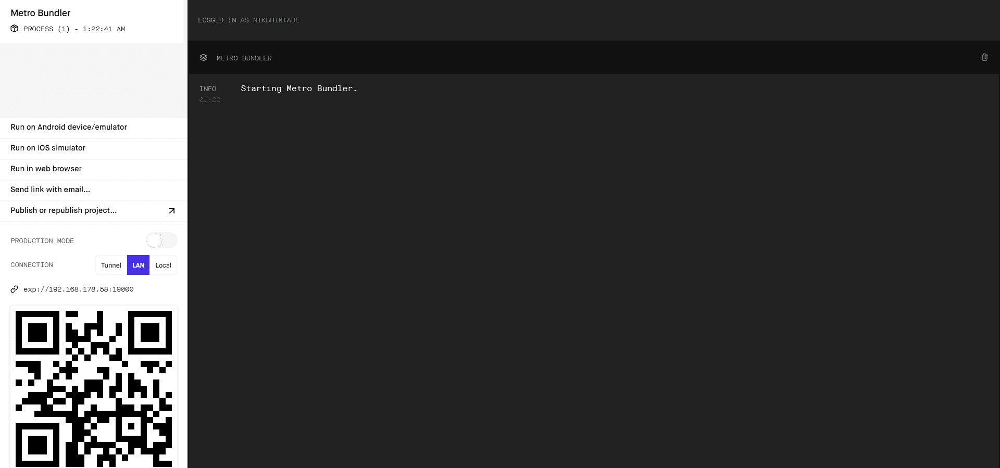
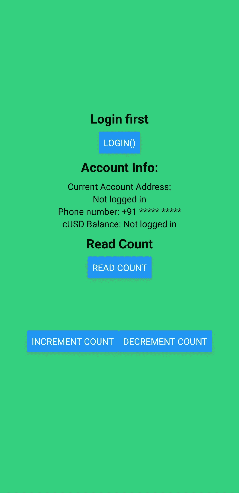
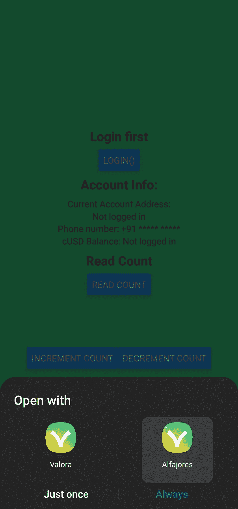
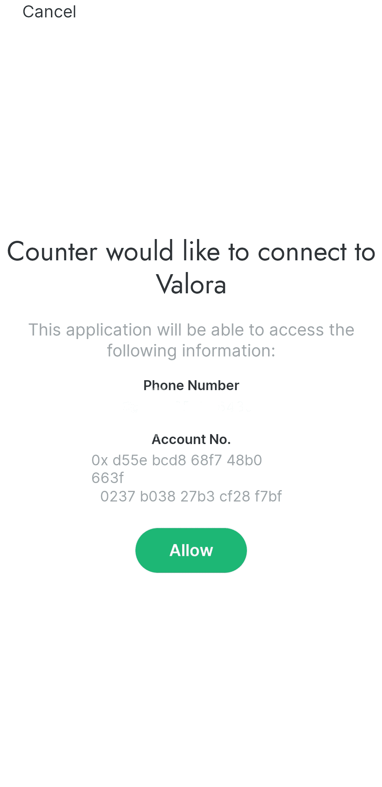
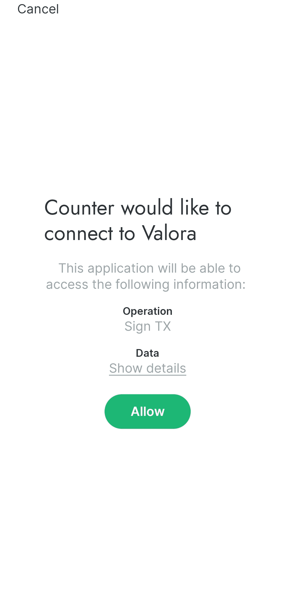
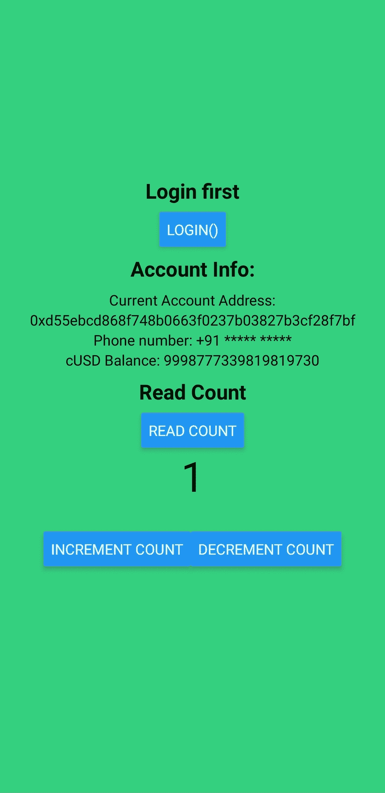

# 介绍

> 原文：<https://github.com/figment-networks/learn-tutorials/blob/master/celo/introduction-to-dappkit.md>

Celo 提供移动友好的开发环境，包括 mainnet 和 testnet 钱包，移动 SDK。在本教程中，我们将使用 expo (react native)制作 counter dapp。这个 dapp 将能够做以下事情:

*   从手机钱包中获取帐户和电话号码
*   创建交易记录
*   签署交易

# 先决条件

你应该对 javascript，react，solidity 有一些基础知识。此外，安装以下要求:

*   节点. js
*   纱线包装经理
*   松露
*   世博(电脑上的 [cli](https://docs.expo.io/get-started/installation/#1-expo-cli) 和手机上的[世博客户端](https://docs.expo.io/get-started/installation/#2-expo-go-app-for-ios-and)
*   Celo 手机钱包(Alfajores)

由于我们将使用移动应用程序，您应该安装 expo 移动客户端和 alfajores(移动设备的 celo testnet 钱包)。确保你的钱包里有水龙头。

# 设置

为了设置我们的开发环境，创建一个新文件夹，并在该文件夹中运行以下命令:

```js
truffle unbox critesjosh/celo-dappkit
```

这将下载由 celo 团队创建的松露盒。你可以在这里看一下[。](https://github.com/critesjosh/celo-dappkit)

现在，我们需要安装智能合约和移动应用程序的所有依赖项。

```js
yarn // installs dependencies for truffle
cd client
yarn // isntalls dependencies for expo
```

# 智能合同

将以下智能合约代码复制到`contracts`文件夹下的`HelloWorld.sol`文件中，然后将该文件重命名为`Counter.sol`。在本教程中，我们不会涉及编写智能合同或 Solidity 语言。 [Solidity 文档](https://docs.soliditylang.org/)可作为资源开始使用。

```js
//SPDX-License-Identifier: MIT

pragma solidity >=0.5.0;
// Above statement specifies the compatible compiler versions
// Learn more about Solidity here: https://docs.soliditylang.org/en/v0.8.3/

// Declare a contract called HelloWorld
contract Counter {

  // Define a unsigned integer called name, initialize it to 'Celo'
  uint256 count = 0;

// Declare a function called getCount.
// The 'public' label means the function can be called internally, by transactions or other contracts.
// The 'view' label indicates that the function does not change the state of the contract.
// The function returns the value of count variable which is of type uint256
  function getCount() 
  public 
  view returns (uint256) {
    return count;
  }

// Declare a function called incrementCount
// The function increments value of count by 1.
// The 'external' label means the function can only be called from an external source
  function incrementCount() 
  external {
      count += 1;
  }

// Declare a function called decrementCount
// The function decrements value of count by 1.
// The 'external' label means the function can only be called from an external source
  function decrementCount() 
  external {
      require(count > 0, "Count is zero");
      count -= 1;
  }
}
```

# 部署智能合同

对于部署，我们需要为柜台智能合同创建一个迁移。在`migrations`文件夹中，转到`2_deploy_contracts.js`并将每个`HelloWorld`更改为`Counter`。

在终端中运行以下命令:

```js
yarn account
```

这将显示我们将从中部署 Solidity smart contract 的帐户地址。

```js
xQc@RecycleBin MINGW64 ~/Documents/blockchain/celoDappCounter
$ yarn account
yarn run v1.22.4
$ node utils/createAccount.js
Account address: 0xbF0eC2F761F2C3303AE5f9695eE79d2EECdb2579
Done in 2.78s.
```

为了能够支付部署成本，有必要访问 [Celo developers 水龙头](https://celo.org/developers/faucet)并请求一些令牌。

我们需要在`truffle-config.js`再做一个改动。将文件`web3`更改为以下内容:

```js
const web3 = new Web3('https://celo-alfajores--rpc.datahub.figment.io/apikey/<YOUR_API_KEY>/')
```

现在，我们可以运行 Truffle 来将智能合约部署到 Celo。

```js
truffle migrate --network alfajores
```

部署完成后，您将在终端中看到类似的输出:

```js
xQc@RecycleBin MINGW64 ~/Documents/blockchain/celoDappCounter
$ truffle migrate --network alfajores

Compiling your contracts...
===========================
Account address: 0xbF0eC2F761F2C3303AE5f9695eE79d2EECdb2579
> Compiling .\contracts\HelloWorld.sol
> Compiling .\contracts\Migrations.sol
> Artifacts written to C:\Users\xQc\Documents\blockchain\celoDappCounter\client\contracts
> Compiled successfully using:
   - solc: 0.5.16+commit.9c3226ce.Emscripten.clang    

Starting migrations...
======================
> Network name:    'alfajores'
> Network id:      44787
> Block gas limit: 0 (0x0)

1_initial_migration.js
======================

   Deploying 'Migrations'
   ----------------------
   > transaction hash:    0x0e801fb8dd2178d5affe2a149282d2b2501a4a31b01c9abd2d2582e3154972e1
   > Blocks: 1            Seconds: 5
   > contract address:    0x9be45eb8F9d51F52a79368429A250C64E553a04E
   > block number:        4607994
   > block timestamp:     1618390036
   > account:             0xbF0eC2F761F2C3303AE5f9695eE79d2EECdb2579
   > balance:             9.9874644
   > gas used:            163575 (0x27ef7)
   > gas price:           20 gwei
   > value sent:          0 ETH
   > total cost:          0.0032715 ETH

   > Saving migration to chain.
   > Saving artifacts
   -------------------------------------
   > Total cost:           0.0032715 ETH

2_deploy_contracts.js
=====================

   Deploying 'Counter'
   ----------------------
   > transaction hash:    0x02bda4034198353421bc141d89e7b4437e4ac7d0eb2590b1887bb169e3af707d
   > Blocks: 1            Seconds: 5
   > contract address:    0xCb218976Ec0Dd771d69a559AffDb3FeEfE095ADa
   > block number:        4607997
   > block timestamp:     1618390051
   > account:             0xbF0eC2F761F2C3303AE5f9695eE79d2EECdb2579
   > balance:             9.98410176
   > gas used:            126391 (0x1edb7)
   > gas price:           20 gwei
   > value sent:          0 ETH
   > total cost:          0.00252782 ETH

   > Saving migration to chain.
   > Saving artifacts
   -------------------------------------
   > Total cost:          0.00252782 ETH

Summary
=======
> Total deployments:   2
> Final cost:          0.00579932 ETH
```

现在应该有两个附加文件，在`client`的`contracts`子目录中:`Counter.json`和`Migrations.json`。

# 移动 Dapp

由于我们已经完成了教程中的智能合约部分，我们可以继续创建移动 dapp。

奔跑

```js
cd client
```

在开始我们的 dapp 的 UI 之前，我们需要更改一些文件。

删除`client`中的`assets`文件夹，从`app.json`中删除`icon`和`splash`字段

转到`root.js`并更改`provide`以包含有效的 DataHub API 键和 RPC 端点 URL。确保 URL 在插入 API 键后包含尾随的正斜杠

```js
export const provider = "https://celo-alfajores--rpc.datahub.figment.io/apikey/<YOUR_API_KEY>/"
```

我们将检查代码的 React 本机部分，但首先您需要清除`App.js`的内容，并用以下内容替换它:

```js
import React from 'react'
import './global'
import { web3, kit } from './root'
import { StyleSheet, Text, Button, View } from 'react-native'
import {
  requestTxSig,
  waitForSignedTxs,
  requestAccountAddress,
  waitForAccountAuth,
  FeeCurrency
} from '@celo/dappkit'
import { toTxResult } from "@celo/connect"
import * as Linking from 'expo-linking'
import CounterContract from './contracts/Counter.json'

export default class App extends React.Component {

  // Set the defaults for the state
  state = {
    address: 'Not logged in',
    phoneNumber: 'Not logged in',
    cUSDBalance: 'Not logged in',
    CounterContract: {},
    count: ''
  }

  // This function is called when the page successfully renders
  componentDidMount = async () => {

    // Check the Celo network ID
    const networkId = await web3.eth.net.getId();

    // Get the deployed HelloWorld contract info for the appropriate network ID
    const deployedNetwork = CounterContract.networks[networkId];

    // Create a new contract instance with the HelloWorld contract info
    const instance = new web3.eth.Contract(
      CounterContract.abi,
      deployedNetwork && deployedNetwork.address
    );
    // Save the contract instance
    this.setState({ CounterContract: instance })
  }

  login = async () => {

    // A string you can pass to DAppKit, that you can use to listen to the response for that request
    const requestId = 'login'

    // A string that will be displayed to the user, indicating the DApp requesting access/signature
    const dappName = 'Counter'

    // The deeplink that the Celo Wallet will use to redirect the user back to the DApp with the appropriate payload.
    const callback = Linking.makeUrl('/my/path')

    // Ask the Celo Alfajores Wallet for user info
    requestAccountAddress({
      requestId,
      dappName,
      callback,
    })

    // Wait for the Celo Wallet response
    const dappkitResponse = await waitForAccountAuth(requestId)

    // Set the default account to the account returned from the wallet
    kit.defaultAccount = dappkitResponse.address

    // Get the stabel token contract
    const stableToken = await kit.contracts.getStableToken()

    // Get the user account balance (cUSD)
    const cUSDBalanceBig = await stableToken.balanceOf(kit.defaultAccount)

    // Convert from a big number to a string
    let cUSDBalance = cUSDBalanceBig.toString()

    // Update state
    this.setState({
      cUSDBalance,
      isLoadingBalance: false,
      address: dappkitResponse.address,
      phoneNumber: dappkitResponse.phoneNumber
    })
  }

  getCount = async () => {

    // Read the count stored in the Counter contract
    let _count = await this.state.CounterContract.methods.getCount().call()

    // Update state
    this.setState({ count: _count })
  }

  increment = async () => {
    const requestId = 'increment_count'
    const dappName = 'Counter'
    const callback = Linking.makeUrl('/my/path')

    // Create a transaction object to increment count
    const txObject = await this.state.CounterContract.methods.incrementCount()

    // Send a request to the Celo wallet to send an update transaction to the Counter contract
    requestTxSig(
      kit,
      [
        {
          from: this.state.address,
          to: this.state.CounterContract.options.address,
          tx: txObject,
          feeCurrency: FeeCurrency.cUSD
        }
      ],
      { requestId, dappName, callback }
    )

    // Get the response from the Celo wallet
    const dappkitResponse = await waitForSignedTxs(requestId)
    const tx = dappkitResponse.rawTxs[0]

    // Get the transaction result, once it has been included in the Celo blockchain
    let result = await toTxResult(kit.web3.eth.sendSignedTransaction(tx)).waitReceipt()

    console.log(`Counter contract increment count transaction receipt: `, result)

    // Update count on UI
    await this.getCount();
  }

  decrement = async () => {
    const requestId = 'increment_count'
    const dappName = 'Counter'
    const callback = Linking.makeUrl('/my/path')

    // Create a transaction object to decrement the count
    const txObject = await this.state.CounterContract.methods.decrementCount()

    // Send a request to the Celo wallet to send an update transaction to the Counter contract
    requestTxSig(
      kit,
      [
        {
          from: this.state.address,
          to: this.state.CounterContract.options.address,
          tx: txObject,
          feeCurrency: FeeCurrency.cUSD
        }
      ],
      { requestId, dappName, callback }
    )

    // Get the response from the Celo wallet
    const dappkitResponse = await waitForSignedTxs(requestId)
    const tx = dappkitResponse.rawTxs[0]

    // Get the transaction result, once it has been included in the Celo blockchain
    let result = await toTxResult(kit.web3.eth.sendSignedTransaction(tx)).waitReceipt()

    console.log(`Counter contract decrement count transaction receipt: `, result)

    // Update count on UI
    await this.getCount();
  }

  render() {
    return (
      <View style={styles.container}>
        <Text style={styles.title}>Login first</Text>
        <Button title="login()"
          onPress={() => this.login()} />
        <Text style={styles.title}>Account Info:</Text>
        <Text>Current Account Address:</Text>
        <Text>{this.state.address}</Text>
        <Text>Phone number: +91 ***** *****</Text>
        <Text>cUSD Balance: {this.state.cUSDBalance}</Text>

        <Text style={styles.title}>Get Count</Text>
        <Button title="Get Count"
          onPress={() => this.getCount()} />
        <Text style={styles.count}>{this.state.count}</Text>
        <View style={styles.buttonContainer}>
          <Button style={styles.button} title="Increment count"
            onPress={() => this.increment()} />
          <Button style={styles.button} title="Decrement count"
            onPress={() => this.decrement()} />
        </View>
      </View>
    );
  }
}

const styles = StyleSheet.create({
  container: {
    flex: 1,
    backgroundColor: '#35d07f',
    alignItems: 'center',
    justifyContent: 'center',
  },
  title: {
    marginVertical: 8,
    fontSize: 20,
    fontWeight: 'bold'
  },
  buttonContainer: {
    flexDirection: 'row',
    paddingVertical: 30,
    alignItems: 'center',
    justifyContent: 'center',
  },
  count: {
    fontSize: 40
  }
});
```

我们将逐个方法地检查代码。

这里我们使用 react 的类组件。这些类有我们可以存储数据的状态。

在`App`类的`state`变量中，我们存储我们的数据。

然后`componentDidMount`方法正在创建契约实例，以便我们可以调用智能契约的方法。创建智能契约实例后，我们将它存储在状态变量`CounterContract`中。

现在，我们将看看 dapp kit 在我们的`App`类的`login`方法中给出的方法。

这里我们设置了 3 个变量`requestId`、`dappName`和`callback`。

*   `requestId`:用于监听我们请求的响应
*   `dappName`:获得用户许可时，将显示姓名
*   `callback`:将用于将用户重定向回 dapp 的 deeplink

在调用`requestAccountAddress`时，我们传递 3 个以上的参数。

现在，用户将被重定向到 celo wallet 以获取帐户详细信息，我们将使用这些信息在 dapp 中执行其他操作。

从 celo wallet 获取帐户详细信息后，我们将在状态变量中设置这些信息。

当我们创建计数器时，我们需要得到计数。`getCount`方法确实如此。它调用我们的契约的`getCount`方法并在状态中存储计数。

现在，我们将使用`incrementCount`方法增加计数。为此，我们需要设置相同的三个变量`requestId`、`dappName`和`callback`。

为了增加计数，我们将创建事务。但是首先我们需要创建交易对象`txObject`，然后使用`requestTxSig`将它传递给 celo wallet。

`requestTxSig`方法需要三个参数:

*   套件:合同套件例程
*   txParams:交易所需的参数
*   meta:用于与 celo wallet 连接的 dappkit 的对象

该方法将创建一个事务来增加 count 的值。生成的事务哈希将被记录到控制台。

在此之后，我们等待交易完成，然后我们更新计数值。

`decrementCount`方法类似于`incrementCount`方法，但是我们不是调用智能合同的`incrementCount`函数，而是调用`decrementCount`函数。

剩下的方法是负责 UI 的`render`。此外，我们有 end 的`style`常量，用于我们组件的样式。

现在，剩下唯一要做的就是在我们的移动设备上使用 expo 客户端运行我们的移动应用程序。

奔跑

```js
yarn start
```

这将打开浏览器窗口，就像你在这里看到的

[](https://camo.githubusercontent.com/9746ee1eb014957f94c84abf8a1f482479c8d79ce2f3c4624de632663eb390d3/68747470733a2f2f692e696d6775722e636f6d2f6d496377344c462e6a706567253230)

您可以在左下角看到二维码，用二维码扫描仪从移动设备中的世博会客户端扫描它。

这将打开我们的 dapp。它应该是这样的



现在我们可以完成递增计数器的过程。按登录按钮首次登录。它会给我们选择钱包的权利



选择 Alfajores 钱包。

选择钱包后，它会将我们重定向到实际的钱包并请求许可。



点击“允许”按钮，向我们的 dapp 提供信息。

现在我们已经可以访问了，我们将再次被重定向到我们的 dapp，在这里，帐户信息将代替`Not logged in`文本显示。


我们现在应该增加计数，这将把我们重定向到钱包以签署交易。



点击允许。到达 dapp 屏幕后，我们可以看到计数增加了 1！



祝贺您完成本教程，DappKit 简介！我们现在已经在 Celo testnet 上创建了一个可运行的移动 dapp。同样的方法也可以应用于 Celo mainnet，以生成功能性的分布式应用程序。

# 结论

在本教程中，我们介绍了 DappKit 的一些部分，它如何与 Celo 移动钱包连接，我们如何将我们的 dapp 与移动钱包连接，以及如何进行一些基本操作，如获取帐户地址、帐户余额、Celo 移动钱包连接的电话号码以及签署交易。

感谢您跟随本教程，现在带着这些知识在 Celo 上构建令人惊奇的东西吧！

# 关于作者

本教程由 [Nikhil Bhintade](https://www.linkedin.com/in/nikbhintade) 创作。Nikhil 是一名学生(BE、电气)和加密爱好者，他正在学习 web3 的所有知识，并希望记录他所学到的知识。