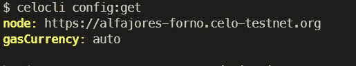
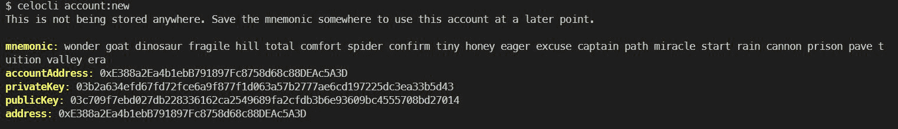

# 介绍

> 原文：<https://github.com/figment-networks/learn-tutorials/blob/master/celo/redeploy-dapps-on-celo.md>

本教程是为以前在以太坊上部署过 dapps，现在想学习如何在 Celo 区块链上做同样的事情的开发者设计的。

使用 celo 的最大优势之一是它是 EVM 兼容的，这意味着您可以轻松地将您的 dapps 从以太坊区块链重新部署到 Celo，只需对代码进行一些更改(如果需要的话)，只需更改配置文件。在本教程中，我们将学习做同样的事情。

我们将重新部署著名的**宠物店** dApp。宠物店的完整漫游超出了本教程的范围，但是你可以在这里找到它[。当前的教程不仅仅局限于这个例子，还可以作为将任何其他以太坊智能合约重新部署到 Celo 的指南。](https://www.trufflesuite.com/tutorials/pet-shop)

# 入门指南

首先克隆以下存储库

```js
git clone https://github.com/trufflesuite/pet-shop-tutorial 
```

在克隆了存储库之后，我们拥有了部署**宠物店** Dapp 所需的所有合同。

让我们使用以下命令安装 dapp 的所有依赖项

```js
npm install 
```

现在我们有了所有的工具来开始你的旅程。

# 使用 Celo CLI

首先，我们需要找到一种与塞洛·区块链互动的方式。对于本教程，我们将使用`Celo CLI`来做同样的事情。

```js
npm install -g @celo/celocli 
```

CeloCLI 使得与 Celo 区块链的交互变得极其容易。对于所有的 celo 开发者来说，这是一个非常方便的工具。更多关于 CeloCLI 的信息可以在[这里](https://docs.celo.org/celo-owner-guide/quick-start)找到。

安装后，我们需要确保它指向正确的端点。让我们检查一下

```js
celocli config:get 
```



我们的节点应该指向**节点:**【https://alfajores-forno.celo-testnet.org】T2

如果您的端点是别的东西，您可以使用

```js
celocli config:set --node https://alfajores-forno.celo-testnet.org 
```

现在我们的 celocli 连上了`Alfajores Testnet`。我们需要一个合作账户。让我们用 celocli 来做这个。使用以下命令在 testnet 上获得一个新帐户。

```js
celocli account:new 
```

我们的终端应该看起来像这样。(每个人都有不同的价值观！)

 因为我们不希望任何人看到我们的私钥，所以开发人员普遍接受使用`. env '文件来设置环境变量。在将我们的项目上传到任何开源平台的过程中，我们通过将这些文件添加到` . gitignore '来隐藏它们。在同一个目录中创建一个. env 文件，并添加以下行

```js
PRIVATE_KEY=<YOUR_PRIVATE_KEY> 
```

我们将在本教程的后面使用这个私钥。现在我们有了一个可以使用的帐户，让我们为在区块链上签署交易获得一些资金。使用 Alfajores testnet 水龙头，可在此处找到[。要检查我们是否收到了资金，请使用](https://celo.org/developers/faucet)

```js
celocli account:balance <YOUR_PUBLIC_ADDRESS> 
```


# 更改 truffle-config.js

为了将我们的 dapp 部署到 Celo 区块链，我们现在需要做的就是更改`truffle-config.js`，以便它可以与 Celo 区块链一起工作。我们将借助 Celo 制造的`ContractKit`和`Wallet-local`。我们还需要安装`dotenv`来使用我们的私钥。

要安装所有这些，请使用

```js
npm i --save @celo/contractkit @celo/wallet-local dotenv 
```

是一个帮助开发者和验证者与 celo-区块链交互的库，非常适合寻找一种简单的方法将 Celo 智能合同集成到他们的应用程序中的开发者。`Wallet-Local`提供一个本地 wallet 实例来连接 contractKit。`dotenv`文件将用于导入我们添加到**的私钥。env** 将上面的文件转换成 truffle-config，但不进行硬编码。

将以下代码粘贴到我们的`truffle-config.js`文件中:

```js
// dotenv is used to import all the environment variables into the .env file
require("dotenv").config();
const ContractKit = require("@celo/contractkit");
const { LocalWallet } = require("@celo/wallet-local");

const PRIVATE_KEY = process.env.PRIVATE_KEY;
const testnetURL = "https://alfajores-forno.celo-testnet.org";
const localWallet = new LocalWallet();

/*
ContractKit is used to access web3 object to interact with node's Json RPC API.
It takes two arguments, first being a network URL such as the testnet URL and secondly, a wallet instance for signing transactions.
*/

const kit = ContractKit.newKit(testnetURL, localWallet);

async function setConfig() {
  kit.addAccount(PRIVATE_KEY);
  kit.defaultAccount = localWallet.getAccounts()[0];
}
setConfig();
module.exports = {
  networks: {
    testnet: {
      provider: kit.connection.web3.currentProvider, // to connect with Alfajores testnet
      network_id: 44787,
    },
  },
};
```

现在，我们的配置文件已全部设置为与 Celo 区块链一起工作。

让我们使用以下代码编译我们的智能合同

```js
truffle compile 
```

编译完成后，让我们将智能合约迁移到 Celo。

```js
truffle migrate --network testnet 
```

恭喜你！因此，我们已经将以太坊 DApp 部署到了 Celo。

现在，我们可以使用相同的过程来部署任何我们想要 Celo 的 DApp。不要让任何事情阻止你，尝试在以太坊上克隆任何项目，并部署在 Celo 上。Celo 拥有新项目的绝佳机会。加入我们的社区 [Discord](https://figment.io/devchat) 与其他开发者一起讨论。