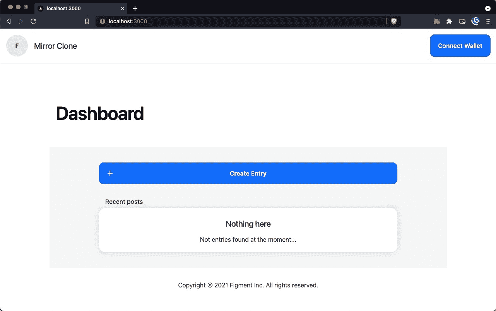

# 实施🧩

> 原文：<https://github.com/figment-networks/learn-tutorials/blob/master/mirror/02-connect-wallet.md>

任何 dApp 的第一步都是建立一种连接到用户钱包的方式。这允许 dApp 在不使用传统密码的情况下认证用户。更重要的是，这将允许 dApp 获取用户的 onchain 数据，因此我们可以构建用户特定的 dApp 体验。

加密钱包是用户与区块链协议交互的网关。钱包在本地存储由密码加密的用户私钥，并允许用户签署交易，以无信任的方式证明对账户密钥的控制。开发人员可以利用这项技术对用户进行身份验证，并构建应用程序，让用户以可移植的方式控制自己的数据。要更深入地了解钱包，请查看[索拉纳钱包](https://learn.figment.io/tutorials/solana-wallet-intro)教程。

在这种情况下，我们将使用一个名为 [ethers.js](https://docs.ethers.io/) 的 JavaScript 库来与用户的浏览器扩展钱包(如 MetaMask)进行交互。这将允许我们检测是否安装了钱包，并访问用户帐户的 API 以获取其数据并利用其功能。

执行任何区块链操作的第一步通常是实例化一个连接。这可以通过 ethers.js 中的 **Providers** 类来实现。Web 3 provider 对象包含从协议中读取的功能。

如果您熟悉 React 开发，您可能会猜到我们需要一种方法来在连接到 wallet 后保存应用程序状态。这样，我们就不必在每次呈现页面时让用户重新连接他们的钱包。为此，我们将使用 React 的[上下文](https://reactjs.org/docs/context.html)。

有几种方法可以实现这一点，但是在我们的例子中，我们将使用一个上下文提供者(不要与 Web 3 提供者混淆！)我们在`context/web3Context.tsx`中内置了我们的模板。

如果我们看一下 Web3Provider 函数，请注意我们使用了 ethers.js **Web3Provider** 的简单实现:

```
const provider =
    typeof window == 'undefined' || !window.ethereum
      ? null
      : new ethers.providers.Web3Provider(window.ethereum);
```

关注最后一行，注意我们正在基于`window.ethereum`实例化一个提供者。这个对象是由元掩码提供的[，所以我们可以把它作为参数传入来实例化我们的 Web 3 provider 对象。剩下的代码只是检查元掩码扩展是否存在，所以即使没有，dApp 仍然会运行。](https://docs.metamask.io/guide/ethereum-provider.html)

一旦我们有了一个 Web 3 提供者，我们就可以使用提供者的`send`方法来请求与我们想要连接的钱包相关联的账户(了解一下[分层确定性钱包](https://docs.ethers.io/v5/api/utils/hdnode/)是如何工作的是很好的)。然后我们可以实例化一个**签名者**对象，它将允许我们访问允许我们改变区块链状态的函数。

在我们的例子中，我们有一个`connect`函数，它首先检查提供者是否存在，然后应该获取我们用户的公共地址，并使用一个 React 钩子:`setAddress`将其设置为 app 状态。我们包含了对 chainId 的检查，以确保用户连接到 Mumbai testnet——每个区块链网络都使用一个唯一的链标识符，以防止一个区块链的事务在另一个上重放。此外，如果用户没有安装元掩码，它应该提醒他们安装它。

我们可以用四行简单的代码来完成这个功能。首先，我们需要请求元掩码提供程序中可用的帐户。然后，我们需要实例化一个签名者，它将为我们提供获取用户当前地址和 chainId 的方法。

```
await provider.send('eth_requestAccounts', []);
const signer = provider.getSigner();
const currentAddress = await signer.getAddress();
const chainId = await signer.getChainId();
```

深入研究以太坊虚拟机超出了本教程的范围，但是如果您想更好地了解您正在构建的后端，这个问题是至关重要的。我们不是连接到特定的服务器并从数据库中读取，而是从分布式状态机中读取。它之所以是分布式的，是因为世界上有很多节点拥有相同的状态。它是一个状态机，因为它在任何时候都处于一个状态。我们与它交互，并与使用它的其他人竞争来更新它的状态片段，这些片段将在下一个状态更新周期之前被记录。不要混淆 EVM 的状态和 React 应用的状态，它们是相似的概念，但不是一回事！

将这四行与我们的`connect`功能放在一起，并了解我们的自定义挂钩已经在使用中，我们的用户现在应该能够通过点击右上角的**连接钱包**按钮进行连接。

[](https://raw.githubusercontent.com/figment-networks/learn-tutorials/master/mirror/assets/wallet.gif)

忘记登录，现在我们的用户可以用他们的钱包连接到我们的应用程序！

##### *清单 2.1:连接钱包的代码*

```
const connect = useCallback(async () => {
  if (provider) {
    await provider.send('eth_requestAccounts', []);
    const signer = provider.getSigner();
    const currentAddress = await signer.getAddress();
    const chainId = await signer.getChainId();

    if (chainId != (80001 as number)) {
      alert('Please connect to the Polygon Mumbai testnet in MetaMask!')
    }

    setAddress(currentAddress);
  } else {
    alert('Please install MetaMask at https://metamask.io');
  }
}, [provider]);
```

# 挑战<g-emoji class="g-emoji" alias="weight_lifting" fallback-src="https://github.githubassets.cimg/icons/emoji/unicode/1f3cb.png">🏋️</g-emoji>

在代码编辑器中导航到`context/web3Context.tsx`，按照注释中包含的步骤完成`Web3Provider`函数的编写。我们提供了一个描述，以及一个链接，链接到您为了实现每一行而需要查看的文档。相关的代码块也包含在下面的**清单 2.2** 中。

##### *清单 2.2:连接钱包的说明*

```
const connect = useCallback(async () => {
  if (provider) {
    // Request accounts, get signer, signers address & chainId
    // More information can be found at https://docs.ethers.io/v5/getting-started/#getting-started--connecting

    const currentAddress = '';
    const chainId = 0;

    if (chainId != (80001 as number)) {
      alert('Please connect to the Polygon Mumbai testnet in MetaMask!')
    }

    // Read more about React hooks: https://reactjs.org/docs/hooks-intro.html
    // The setAddress React hook sets the value of address in the app state
    setAddress(currentAddress);
  } else {
    alert('Please install MetaMask at https://metamask.io');
  }
}, [provider]);
```

完成代码后，您会想要尝试通过点击屏幕右上角的**连接钱包**按钮来连接您的 MetaMask 钱包:

[](https://raw.githubusercontent.com/figment-networks/learn-tutorials/master/mirror/assets/connect.jpg)