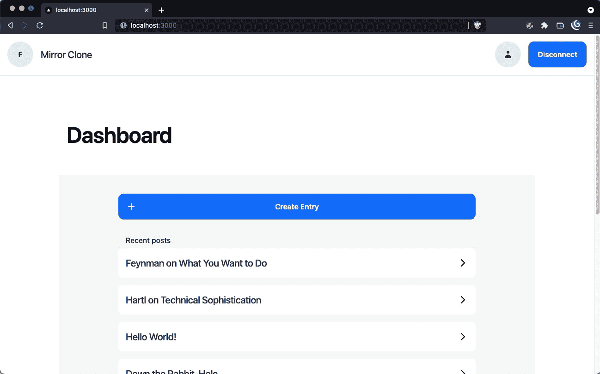

# mirror/03-create-entry

> 原文：<https://github.com/figment-networks/learn-tutorials/blob/master/mirror/03-create-entry.md>

传统博客使用数据库来保存条目。作者可能会编写一些内容并发布它，这将在服务器上触发一个将数据写入数据库的创建操作。数据库会有定义数据结构的模式。例如，我们可能有一个包含条目 id、内容和作者 id 的**条目**表。

然而，区块链有点不同，因为它是分散的。我们将利用一个不受中央机构控制的分布式系统，而不是写入一个特定的数据库。

Arweave 是一种分散式网络，允许拥有额外存储空间的用户向网络提供存储空间，以换取经济奖励。希望以分散、安全、抗审查的方式存储数据的用户可以利用网络来实现这一目的。实际上，Arweave 是 dApps 堆栈的存储部分。

Arweave 使用一种叫做“blockweaves”的技术来实现这一点。与跨块连接主链中的事务的区块链类似，块编织是包含数据的连接块。一个主要的区别是，块编织更像图，而不是将块连接成一个单链表。

该系统需要一个强健且可持续的经济结构，以确保存储提供商有动力以合理的成本为用户永久复制信息。基本上，用户预先支付少量费用来永久存储数据。这笔费用被视为本金，随着时间的推移，会给存储提供商带来利息。

实现这一切的架构超出了本教程的范围，但是如果您有兴趣深入了解，我们建议查看一下 [Arweave 黄皮书](https://www.arweave.org/yellow-paper.pdf)。

[](https://raw.githubusercontent.com/figment-networks/learn-tutorials/master/mirror/assets/storage.jpeg)

像这样但分散...

# 实施 <g-emoji class="g-emoji" alias="jigsaw" fallback-src="https://github.githubassets.cimg/icons/emoji/unicode/1f9e9.png">🧩</g-emoji>

有几种方法可以与 Arweave 交互。在我们的例子中，我们将使用 Arweave 的水龙头程序，它允许我们创建一个 Arweave 钱包，并用足够的代币为它提供资金，让我们继续前进。

水龙头是一种智能合约，它将有限数量的令牌转移给用户用于测试目的。大多数协议都实现了水龙头，以方便开发人员的测试和构建工作。

# Arweave 钱包<g-emoji class="g-emoji" alias="handbag" fallback-src="https://github.githubassets.cimg/icons/emoji/unicode/1f45c.png">👜</g-emoji>

进入 [Arweave mainnet 水龙头](https://faucet.arweave.net/)，按照指示创建一个钱包。确保在过程结束时下载 JSON 文件。将该文件重新命名为`arweave-wallet.json`，并保存在项目的根目录下。你会注意到我们在`.gitignore`中包含了这一点，以防止暴露任何私人信息。

将 JSON 文件保存到根目录后，我们应该在终端中停止本地服务器(在运行服务器的终端窗口中按 CTRL+C)。然后我们可以在命令行中初始化`ARWEAVE_WALLET`环境变量，并再次运行本地服务器:

```js
$ ARWEAVE_WALLET=$(cat arweave-wallet.json) yarn dev 
```

# 发布到 Arweave <g-emoji class="g-emoji" alias="incoming_envelope" fallback-src="https://github.githubassets.cimg/icons/emoji/unicode/1f4e8.png">📨</g-emoji>

有了 Arweave 钱包，我们现在可以开发一个端点来创建条目。在`pages/api/arweave/entry.ts`中，我们有一个框架端点来添加 Arweave 写逻辑。您会注意到我们传入了包含数据和地址字段的`req.body`。在这种情况下，数据将是条目的文本，地址将是作者的公共地址。在`routes.ts`文件中，你可以看到路线是如何定义的。

首先，我们需要使用`JSON.parse`初始化钱包:

```js
const wallet = JSON.parse(process.env.ARWEAVE_WALLET as string);
```

我们还应该通过利用 Arweave 的 JavaScript 库并传入数据和钱包来实例化一个事务。

```js
const transaction = await arweave.createTransaction({data: data}, wallet);
```

接下来，我们将添加标签作为元数据，将数据与我们的 dApp 和作者相关联。我们还应该包含一个标记，将数据表示为“application/json”。

```js
transaction.addTag('App-Name', process.env.APP_NAME as string);
transaction.addTag('Content-Type', 'application/json');
transaction.addTag('Address', address);
```

然后，我们要签署交易并将其发送到 Arweave:

```js
await arweave.transactions.sign(transaction, wallet);
await arweave.transactions.post(transaction);
```

你会注意到 Arweave 的语法非常简单。这个工作流唯一的新方面是签名部分，这是验证交易是否有效所必需的。

为了结束端点，我们希望将事务 id 作为响应的一部分返回:

```js
res.status(200).json(transaction.id);
```

# 完成表格<g-emoji class="g-emoji" alias="memo" fallback-src="https://github.githubassets.cimg/icons/emoji/unicode/1f4dd.png">📝</g-emoji>

现在我们需要利用我们的入口端点。为此，我们需要转到`components/CreateEntryForm/CreateEntryForm.tsx`并完成`handleSubmit`函数。

为了提交创建条目的 Arweave 事务，我们可以使用 [axios](https://axios-http.com/docs/intro) 来调用我们上面写的`entry`端点。我们应该将数据和地址作为请求体的一部分传入，还应该将返回值——事务 id——存储在一个变量中。当我们将 NFT 功能合并到我们的 dApp 中时，我们将需要事务 id。

```js
const response = await axios.post(routes.api.arweave.post, {
  data,
  address,
});
const transactionId = response.data;
console.log('transactionId: ', transactionId);
```

完成后，我们的用户就可以创建永久保存在 Arweave 区块链上的作品了！您可以自己创建一个条目，并确认`transactionId`是否打印在控制台中。

但是有一个问题。即使我们可以创建一个条目，我们也无法在 dApp 中看到它。我们将很快解决这个问题，但是首先我们需要一个端点来获取条目。我们将在步骤 4 中处理下一个问题。

##### *清单 3.1:创建入口端点的代码*

```js
export default async function (
  req: NextApiRequest,
  res: NextApiResponse<string>,
): Promise<any> {
  try {
    const {data, address} = req.body;

    const wallet = JSON.parse(process.env.ARWEAVE_WALLET as string);
    const transaction = await arweave.createTransaction({data: data}, wallet);

    transaction.addTag('App-Name', process.env.APP_NAME as string);
    transaction.addTag('Content-Type', 'application/json');
    transaction.addTag('Address', address);

    await arweave.transactions.sign(transaction, wallet);
    await arweave.transactions.post(transaction);
    res.status(200).json(transaction.id);
  }
  ...
}
```

##### *清单 3.2:处理条目提交的代码*

```js
if (provider && contract) {
  const data = createJsonMetaData(values);

  const response = await axios.post(routes.api.arweave.post, {
    data,
    address,
  });
  const transactionId = response.data;
  console.log('transactionId: ', transactionId);
}
```

# 挑战<g-emoji class="g-emoji" alias="weight_lifting" fallback-src="https://github.githubassets.cimg/icons/emoji/unicode/1f3cb.png">🏋️</g-emoji>

在您的代码编辑器中导航到`pages/api/arweave/entry.ts`和`components/CreateEntryForm/CreateEntryForm.tsx`，并按照注释中包含的步骤完成创建条目功能的编写。我们提供了一个描述，以及一个链接，链接到您为了实现每一行而需要查看的文档。相关代码块也包含在下面的**清单 3.3** 和**清单 3.4** 中。

##### *清单 3.3:创建入口端点的指令*

```js
export default async function (
  req: NextApiRequest,
  res: NextApiResponse<string>,
): Promise<any> {
  try {
    const {data, address} = req.body;

    // Initialize wallet using ARWEAVE_WALLET environmental variable (Tip: Use JSON.parse)

    // Create Arweave transaction passing in data. Documentation can be found here: https://github.com/ArweaveTeam/arweave-js

    // Add tags:
    // - App-Name - APP_NAME environmental variable
    // - Content-Type - Should be application/json
    // - Address - Address of a user
    // Documentation can be found here: https://github.com/ArweaveTeam/arweave-js

    // Sign Arweave transaction with your wallet. Documentation can be found here: https://github.com/ArweaveTeam/arweave-js

    // Post Arweave transaction. Documentation can be found here: https://github.com/ArweaveTeam/arweave-js

    // Return transaction id
  }
  ...
}
```

##### *清单 3.4:处理参赛作品提交的说明*

```js
if (provider && contract) {
  const data = createJsonMetaData(values);
  // Submit Arweave transaction
  // Use axios to post data and address to api/arweave/entry endpoint.
  // This request should return transactionId

  // Stop here when you complete Step 3 ^^^^
  ...
}
```

一旦您完成了代码，您将想要尝试通过点击仪表板上的**创建条目**按钮来创建一个条目，然后输入一个标题和一些文本。

[](https://raw.githubusercontent.com/figment-networks/learn-tutorials/master/mirror/assets/entries.jpg)