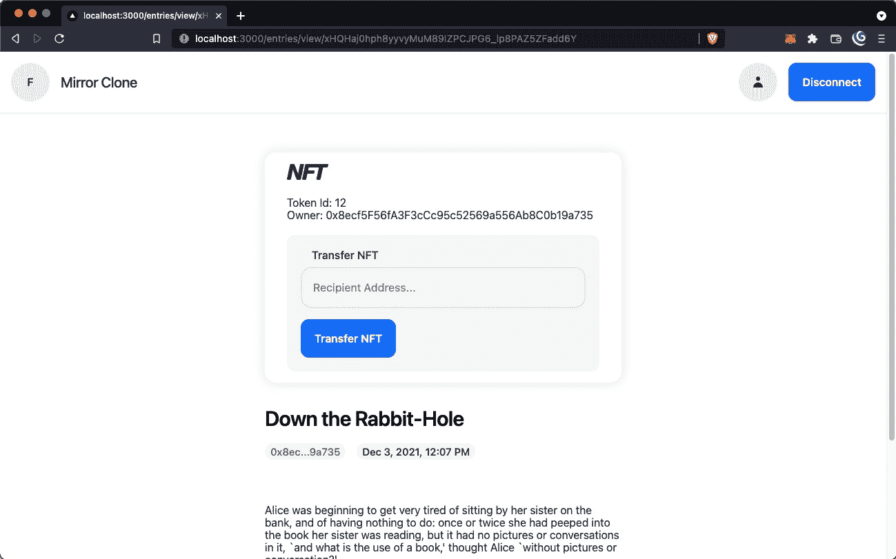

# mirror/06-mint-nft

> 原文：<https://github.com/figment-networks/learn-tutorials/blob/master/mirror/06-mint-nft.md>

不可替代令牌(NFT)是一项迷人的技术，由区块链协议的分类帐功能提供支持。它们允许我们通过提供分散且易于验证的所有权记录来证明数字资产的所有权。

在我们的例子中，我们将利用被称为 [ERC-721](https://ethereum.org/en/developers/docs/standards/tokens/erc-721/) 的标准，它定义了 NFT 的基本功能。更重要的是，我们可以使用标准的智能合约实现来最小化我们的工作，并确保我们创建的令牌的安全性。

智能合约是运行在特定区块链协议上的计算机程序，可以被执行以在区块链上执行操作。它们是确定性的，具有特定的、有限的功能，旨在对具有某些可预测状态变化的输入做出反应。一个常见的物理类比是自动售货机。你投入预先设定好的钱，机器就会把一份点心放进投币口，让你去取。请注意，与 crypto 中的许多标签一样，术语“智能合同”可能会有点令人困惑，因为它们在这个词的智能意义上并不智能，而且它们肯定不是合法的合同。

我们将利用 [OpenZeppelin](https://openzeppelin.com/) ，这是一个标准智能合同库，已经过安全审计，完全可组合。与您以前可能使用过的任何库或包一样，这允许我们从现成的功能中受益，并在我们需要任何定制时扩展它。

Hardhat 是另一个重要的工具，我们将利用它作为开发环境。它将允许我们编译 [Solidity](https://docs.soliditylang.org/) ，这是我们将用来编写智能合同的编程语言。此外，它将为我们提供一个单元测试的测试框架，并且当我们准备好的时候，将有助于部署到[多边形](https://polygon.technology/)。

# 实施 <g-emoji class="g-emoji" alias="jigsaw" fallback-src="https://github.githubassets.cimg/icons/emoji/unicode/1f9e9.png">🧩</g-emoji>

如果您导航到`web3/contracts/MirrorClone.sol`，您会注意到我们已经为您搭建了一份智能合同。在深入我们需要编写的`createToken`函数之前，让我们先熟悉一下代码的一般结构。

# 智能合同审查 <g-emoji class="g-emoji" alias="monocle_face" fallback-src="https://github.githubassets.cimg/icons/emoji/unicode/1f9d0.png">🧐</g-emoji>

使用`pragma`关键字，坚固性程序必须总是从顶部的坚固性版本开始。这告诉 Solidity 编译器使用哪个版本。较新版本的`solc`编译器通常在一定程度上是向后兼容的，但是保持最新版本并且不使用较旧版本的编译器是一个很好的实践，除非有很好的理由这样做。

我们还从`MirrorClone.sol`中的 OpenZeppelin 库导入了一些预构建的契约。我们的合同将继承 ERC-721 令牌 T2 的基本功能。这将使我们能够专注于我们想要添加的功能，而不是从头开始编写。

您可以将智能协定视为一个具有构造函数、属性和方法的类。这与后续的代码行非常接近，包括定义智能契约的属性(例如，名为`tokenURIToTokenId`的映射)，设置一个接受名称和符号的构造函数，并添加函数来扩展继承的功能。

# 创建令牌<g-emoji class="g-emoji" alias="factory" fallback-src="https://github.githubassets.cimg/icons/emoji/unicode/1f3ed.png">🏭</g-emoji>

关注`createToken`函数，第一条指令告诉我们需要确保在创建令牌之前传递一个`tokenURI`。在这个上下文中，令牌 URI 将是来自 Arweave 的事务 id，也称为事务散列。

我们需要利用 Solidity 的`require`函数来检查所提供的`tokenURI`的长度是否大于零。如果需求失败，我们应该返回一个简单的、描述性的错误消息。

```js
require(bytes(_tokenURI).length > 0, "Empty tokenURI");
```

接下来我们应该增加`tokenIds`的计数器，这样我们就可以为每个条目分配一个惟一的令牌 ID。

```js
_tokenIds.increment();
uint256 newItemId = _tokenIds.current();
```

然后我们可以利用从 **ERC721.sol 契约**继承的`_safeMint`函数为条目的作者创建一个令牌。其目的是当作者点击发布时，dApp 立即铸造一个条目的 NFT。

一旦生成，我们应该设置令牌的 URI，使用 Arweave 事务散列将它链接到条目。我们还应该将这个关系添加到我们的映射跟踪器`tokenURIToTokenId`中，这样我们以后就可以通过它们的令牌 URI 来查询 NFT。

最后，在函数完成并返回令牌 ID 之前，我们应该发出一个包含作者地址、令牌 ID 和令牌 URI 的`TokenMinted`事件。

```js
_safeMint(msg.sender, newItemId);
_setTokenURI(newItemId, _tokenURI);
tokenURIToTokenId[_tokenURI] = newItemId;

emit TokenMinted(msg.sender, newItemId, _tokenURI);

return newItemId;
```

# 测试智能合约 <g-emoji class="g-emoji" alias="test_tube" fallback-src="https://github.githubassets.cimg/icons/emoji/unicode/1f9ea.png">🧪</g-emoji>

智能合约与我们编写的任何其他程序没有什么不同，因此我们应该编写全面的测试，以确保我们正在构建健壮的代码，并为整个开发过程中的变化提供安全网。我们已经为您编写了 3 个测试，您可以通过运行来确认它们是否通过:

```js
$ yarn web3:compile
$ yarn web3:test 
```

只要我们实现了上面的代码，这三个测试都应该通过了。只是为了检查一下，我们可以注释掉刚刚编写的`createToken`函数的代码。如果我们再次运行测试，请注意它们将会失败:

```js
$ yarn web3:test
yarn run v1.22.11
$ npx hardhat test
.
.
.
MirrorClone
    methods
      createToken
        1) reverts when empty tokenURI passed
        2) mints new token
        3) emits TokenMinted event
0 passing
3 failing 
```

如果你再次取消代码的注释，一切都会变得很好。

[](https://raw.githubusercontent.com/figment-networks/learn-tutorials/master/mirror/assets/green.jpeg)

漂亮又环保，正是我们喜欢的方式。

让我们为智能合约再编写一个测试。在 Solidity 中，当一个键没有被赋值时，映射返回 0。换句话说，所有键的默认值都是 0。我们可以编写一个测试来确保任何不存在的`tokenURI`返回 0。

将以下测试添加到`web3/test/index.test.ts`:

```js
describe('tokenURIToTokenId', () => {
  it('returns 0 if tokenURI does not exist', async () => {
    expect(await contract.tokenURIToTokenId('ar://does-not-exist')).to.eq(
      0,
    );
  });
});
```

再次运行测试应该可以确认所有四个测试都通过了。

# 部署智能合同<g-emoji class="g-emoji" alias="rocket" fallback-src="https://github.githubassets.cimg/icons/emoji/unicode/1f680.png">🚀</g-emoji>

现在我们已经有了一个功能性的智能合约，可以按预期工作了，我们准备好部署它了。我们将使用多边形网络来避免以太坊高昂的煤气费。出于我们的目的，Polygon 的工作方式完全相同，并且与以太坊虚拟机完全兼容。

此外，我们将部署到 Polygon 的 Mumbai testnet，因此您不必使用有价值的令牌来完成此 dApp。事实上，如果您正在为生产开发它，您应该首先将它部署到 testnet，以便在将它部署到 mainnet 之前测试它的功能。大多数生产项目都这样做，以确保 mainnet 部署已经过实战测试，并且不太可能被错误代码所削弱。

如果您不熟悉各种网络的概念，您可以将其视为 Web 2 中应用程序的不同环境(例如，开发、测试、生产等)。大多数协议都有一个用于具有实际经济价值的生产部署的主网区块链，以及一个用于实验的测试网。测试网在功能上与主网相当，但不管理经济价值。

为了部署合同，我们将使用`web3/scripts/deploy.ts`文件，其中模板为我们提供了一个利用**乙醚**和**安全帽**的地方。我们可以引用`getContractFactory`来加载我们刚刚编写的 **MirrorClone** 智能契约。然后我们可以使用`deploy`方法，按照`constructor`的要求传入名称和符号。

我们还可以包含一个 console.log 语句来打印智能契约公共地址，稍后我们需要将它添加为环境变量。

```js
const MirrorClone = await ethers.getContractFactory('MirrorClone');
const mirrorClone = await MirrorClone.deploy('Mirror Clone', 'MRM');

await mirrorClone.deployed();

console.log('MirrorClone deployed to:', mirrorClone.address);
```

现在，我们可以转到命令行并部署契约。请注意，这有时会因为连接问题而失败。如果有，就再试一次。还要确保您的私钥保存在`.env.local`中，这样部署事务可以从您的 testnet MATIC 余额中支付。

```js
$ yarn web3:deploy:testnet 
```

我们的部署脚本将契约公共地址记录到控制台中。让我们复制并替换`.env.development`中默认的零作为`NEXT_PUBLIC_CONTRACT_ADDRESS`环境变量的值。dApp 将在发布条目时利用这一点来为它们分配 NFT。

我们需要重新启动本地服务器，以使更改后的变量生效。在正在运行的终端窗口中按 CTRL+C 停止正在运行的服务器。使用以下命令再次启动服务器:

```js
$ ARWEAVE_WALLET=$(cat arweave-wallet.json) yarn dev 
```

我们还想验证合同，这允许链探索者像 [Polygonscan](https://polygonscan.com/) 和 [Etherscan](https://etherscan.io/) 确认部署的合同与源代码匹配，并显示源代码供开发人员和用户查看。

请注意，您应该将下面命令中的`INSERT_CONTRACT_ADDRESS_HERE`替换为您的智能合约公共地址。传递在合约部署期间使用的相同构造函数参数也非常重要——确保“镜像克隆”和“MRM”参数使用与传递给`MirrorClone.deploy()`的参数相同的大小写和间距。

```js
$ yarn web3:verify:testnet INSERT_CONTRACT_ADDRESS_HERE 'Mirror Clone' 'MRM' 
```

如果验证失败，错误消息通常会很有帮助，但是请再次检查您的`PRIVATE_KEY`和`POLYGONSCAN_API_KEY`。

*如果您逐字部署智能合约*，您将在验证期间在终端中看到以下错误:

```js
Error in plugin @nomiclabs/hardhat-etherscan: 
The Etherscan API responded with a failure status.
The verification may still succeed but should be checked manually.
Reason: Already Verified 
```

没什么好担心的！这仅仅意味着您部署的智能契约的确切字节码已经在不同的地址进行了验证。对智能契约源代码的任何更改，包括额外的换行符、添加或删除的注释，甚至不同的缩进，都会改变编译后的字节码，因此不会从契约验证插件触发此错误。

如果您访问 [Polygonscan 的 testnet explorer](https://mumbai.polygonscan.com/) ，您可以从命令行将合同地址复制粘贴到搜索框中，并确认合同在区块链上。

[](https://raw.githubusercontent.com/figment-networks/learn-tutorials/master/mirror/assets/fireworks.jpeg)

如果合同部署不是 fireworks 的理由，我不知道还有什么理由。

# 为条目生成 NFTs】🍬

回想一下第 3 步，我们编写了一个在 Arweave 中创建条目的函数。我们现在需要将 NFT 铸造功能整合到工作流程中。如果我们返回到`CreateEntryForm.tsx`，我们会注意到在`handleSubmit`中 try 块的底部有生成 NFT 的指令。

我们需要实例化一个签名者，并将契约连接到签名者。然后我们需要利用我们刚刚编写的`createToken`函数来铸造 NFT。

```js
const signer = provider.getSigner();
const contractWithSigner = contract.connect(signer);

const resp = await contractWithSigner.createToken(transactionId);
const rec = await resp.wait();
```

如果您现在尝试创建一个条目，您的 MetaMask 钱包将要求您签署一项交易，以铸造 NFT。在 Arweave 确认进入后，你将能够导航到入口并看到 NFT！

但是如果能把那个 NFT 转让给别人不是很好吗？也许有人想从您这里购买该条目，或者您想将该条目的所有权赠送给朋友。我们将在步骤 7 中处理下一个问题。

##### *清单 6.1:智能合约的代码*

```js
function createToken(string memory _tokenURI) public returns (uint) {
    // require statement to check if _tokenURI is not empty
    require(bytes(_tokenURI).length > 0, "Empty tokenURI");

    // Increment counter so it starts with 0
    _tokenIds.increment();
    uint256 newItemId = _tokenIds.current();

    // Mint token
    _safeMint(msg.sender, newItemId);

    // Set token URI
    _setTokenURI(newItemId, _tokenURI);

    // Set tokenURIToTokenId
    tokenURIToTokenId[_tokenURI] = newItemId;

    // Emit TokemMinted event
    emit TokenMinted(msg.sender, newItemId, _tokenURI);

    // Return new tokenId
    return newItemId;
}
```

##### *清单 6.2:tokenURIToTokenId 测试代码*

```js
describe('tokenURIToTokenId', () => {
  it('returns 0 if tokenURI does not exist', async () => {
    expect(await contract.tokenURIToTokenId('ar://does-not-exist')).to.eq(
      0,
    );
  });
});
```

##### *清单 6.3:部署代码*

```js
async function main() {
  const MirrorClone = await ethers.getContractFactory('MirrorClone');
  const mirrorClone = await MirrorClone.deploy('Mirror Clone', 'MRM');

  await mirrorClone.deployed();

  console.log('MirrorClone deployed to:', mirrorClone.address);
}
```

##### *清单 6.4:发布帖子*时生成 NFT 的代码

```js
const handleSubmit = useCallback(
.
.
.
    try {
      .
      .
      .
      if (provider && contract) {
        .
        .
        .
        // Mint NFT
        const signer = provider.getSigner();
        const contractWithSigner = contract.connect(signer);

        const resp = await contractWithSigner.createToken(transactionId);
        const rec = await resp.wait();

        alert('Entry created successfully');
      }
    .
    .
    .
```

# 挑战<g-emoji class="g-emoji" alias="weight_lifting" fallback-src="https://github.githubassets.cimg/icons/emoji/unicode/1f3cb.png">🏋️</g-emoji>

在您的编辑器中打开`web3/contracts/MirrorClone.sol`、`web3/test/index.test.ts`、`web3/scripts/deploy.ts`和`components/CreateEntryForm/CreateEntryForm.tsx`，并按照注释中包含的步骤完成智能合同、其测试、部署脚本和 NFT 造币功能的编写。我们提供了一个描述，以及一个链接，链接到您为了实现每一行而需要查看的文档。相关的代码块也包含在下面的清单中。

##### *清单 6.5:智能合约说明*

```js
function createToken(string memory _tokenURI) public returns (uint) {
    // require statement to check if _tokenURI is not empty

    // Increment counter so it starts with 0

    // Mint token

    // Set token URI

    // Set tokenURIToTokenId

    // Emit TokenMinted event

    // Return new tokenId
}
```

##### *清单 6.2:tokenURIToTokenId 测试代码*

```js
// Write a describe block that tests for a 0 return when a token URI doesn't exist in the tokenURIToTokenId mapping
```

##### *清单 6.3:部署代码*

```js
async function main() {
  // Deploy MirrorClone smart contract
  // More information can be found here: https://hardhat.org/guides/deploying.html

  console.log('MirrorClone deployed to:', '<CONTRACT ADDRESS>');
}
```

##### *清单 6.4:发布帖子*时生成 NFT 的代码

```js
const handleSubmit = useCallback(
.
.
.
    try {
      .
      .
      .
      if (provider && contract) {
        .
        .
        .
        // Mint NFT
        // Get signer and connect it to smart contract
        // More information can be found here: https://docs.ethers.io/v5/getting-started/#getting-started--writing

        // Call `createToken` method passing in transactionId
      }
    .
    .
    .
```

完成代码后，创建一个条目会自动将其作为 NFT(在 MetaMask 中确认事务后):

[](https://raw.githubusercontent.com/figment-networks/learn-tutorials/master/mirror/assets/nft.jpg)