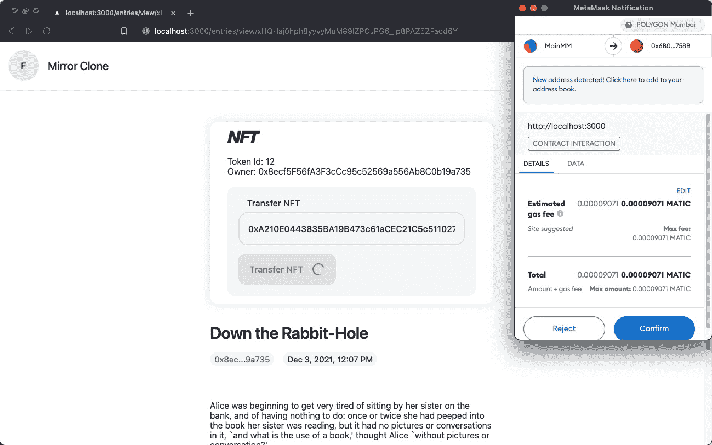

# mirror/07-transfer-nft

> 原文：<https://github.com/figment-networks/learn-tutorials/blob/master/mirror/07-transfer-nft.md>

Web 3 的关键原则之一是可组合性，因此您可以将这一步视为更高级的博客入口市场的先驱。也许你或其他人想要建立一个 dApp，允许人们买卖博客条目所有权。

因为 Web 3 堆栈是去中心化的，这意味着数据不再生活在一个有围墙的花园里，在那里应用程序所有者控制访问并拥有数据。在 Web 3 中，用户不仅保留了对数据的所有权，还保留了将数据移植到其他 ui 的能力，这些 ui 可以直接从区块链访问数据。

[](https://raw.githubusercontent.com/figment-networks/learn-tutorials/master/mirror/assets/free.jpeg)

万岁！不再有围墙花园存放数据

为了使每个条目的 NFT 可以转移，我们需要编写一个函数来激活每个条目页面上显示的蓝色**转移 NFT** 按钮。如果我们转到`TransferNFTForm.tsx`组件，我们会看到一个`handleSubmit`按钮，上面有一些简单的指令，将智能合同连接到一个签名者，并在智能合同上调用`transferFrom`。

回想一下第 6 步，我们可以通过在`provider`上调用`getSigner`来实例化一个签名者。还记得我们也可以将`signer`连接到`contract`，所以我们可以使用这里的代码来连接智能契约和位于`handleSubmit`顶部的签名者:

```js
const signer = provider.getSigner();
const contractWithSigner = contract.connect(signer);
```

# 传输非功能性测试 <g-emoji class="g-emoji" alias="recycle" fallback-src="https://github.githubassets.cimg/icons/emoji/unicode/267b.png">♻️</g-emoji>

现在剩下的就是调用契约中的`transferFrom`函数。您可能想知道这个函数在哪里，因为当我们完成`MirrorClone.sol`契约时，我们没有在步骤 6 中编写它。

`transferFrom`函数其实来自于 ERC721 标准。我们从 OpenZeppelin ERC721 契约中继承了该函数，这意味着我们可以随时调用它，即使我们没有在契约中显式地编写它。如果打开`node_modules/@openzeppelin/contracts/token/ERC721/ERC721.sol`，在第 152 行可以看到函数需要一个 from 地址、一个 to 地址和一个 tokenId。

请注意，在许多情况下，最好使用`safeTransferFrom`方法，因为否则可能会向不知道 ERC721 协议的地址发送 NFT，因此无法保证能够正确处理 NFT。这是一个高级主题，因此对于本教程来说，`transferFrom`就足够了。

我们可以通过调用`contractWithSigner`上的`transferFrom`来完成`handleSubmit`功能:

```js
const resp = await contractWithSigner.transferFrom(
  address,
  recipient,
  tokenId,
);
const rec = await resp.wait();

console.log(rec);
```

有了它，我们现在可以通过转移 NFT 来测试它。你应该在你的 MetaMask 钱包里创建另一个账户，点击右上角的彩色大按钮，然后点击“创建账户”。

一旦你这样做了，你将拥有另一个由你的私钥控制的公共地址。复制该地址并将其粘贴到**收件人地址**字段。然后回到你原来的账户，点击**转移 NFT** 。

接受 MetaMask 上的交易后，您的第二个帐户将拥有该条目(一旦交易被确认)！

##### *清单 7.1:转移 NFT 的代码*

```js
const handleSubmit = useCallback(
  .
  .
  .
  // Connect smart contract to signer
  const signer = provider.getSigner();
  const contractWithSigner = contract.connect(signer);

  // Call `transferFrom` method of smart contract
  const resp = await contractWithSigner.transferFrom(
    address,
    recipient,
    tokenId,
  );
  const rec = await resp.wait();

  console.log(rec);
  .
  .
  .
);
```

# 挑战<g-emoji class="g-emoji" alias="weight_lifting" fallback-src="https://github.githubassets.cimg/icons/emoji/unicode/1f3cb.png">🏋️</g-emoji>

在代码编辑器中导航到`components/TransferNFTForm/TransferNFTForm.tsx`，按照注释中包含的步骤完成编写用于传输 NFT 的`handleSubmit`函数。我们提供了一个描述，以及一个链接，链接到您为了实现每一行而需要查看的文档。相关代码块也包含在下面的**清单 7.2** 中。

##### *清单 7.2:转移 NFT 的说明*

```js
const handleSubmit = useCallback(
  .
  .
  .
  // Connect smart contract to signer
  // Call `transferFrom` method of smart contract
  .
  .
  .
);
```

一旦你完成了代码，你可以通过将你想要转移 NFT 的账户地址粘贴到文本输入中，然后点击**转移 NFT** 并在 MetaMask 中确认交易，来尝试转移一个 NFT 条目:

[](https://raw.githubusercontent.com/figment-networks/learn-tutorials/master/mirror/assets/transfer.jpg)