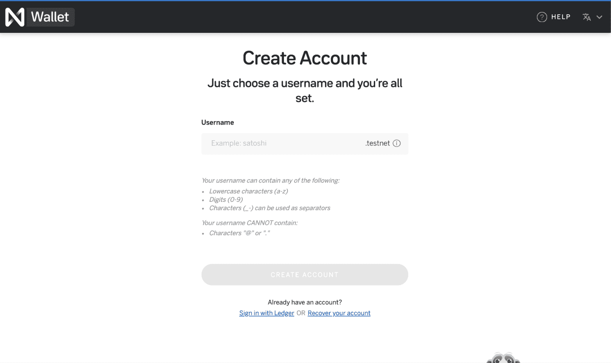
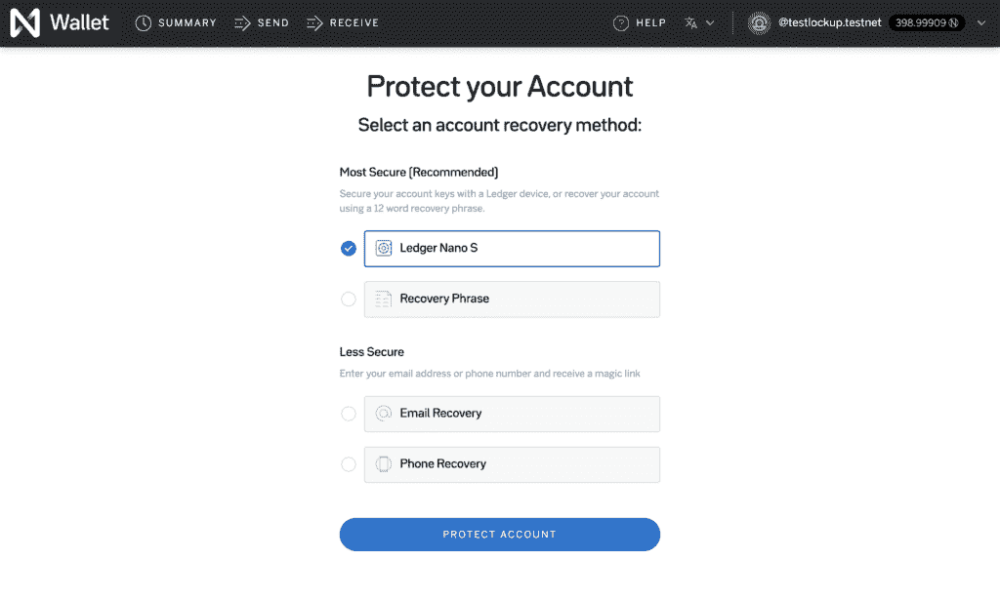
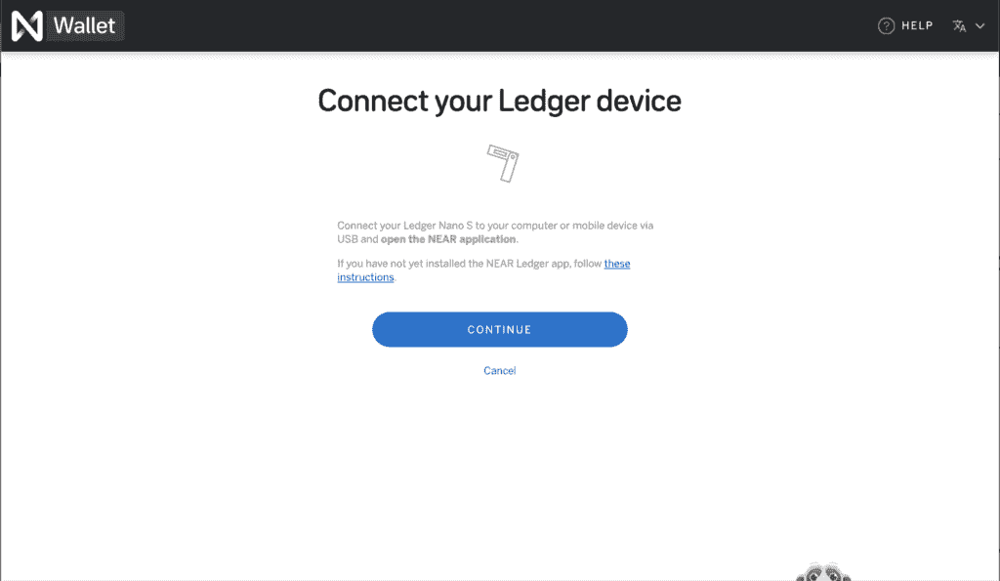
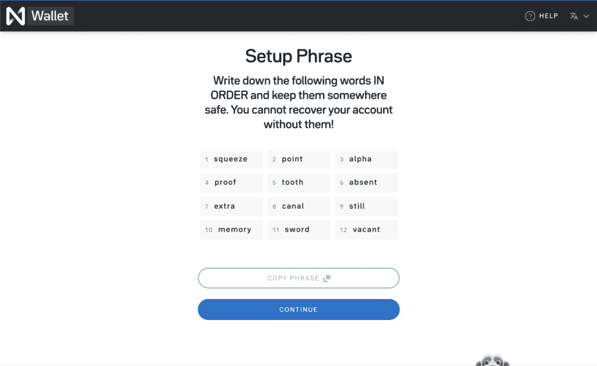
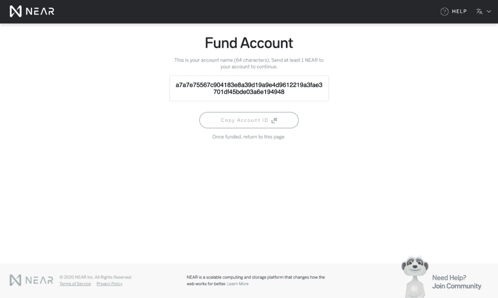
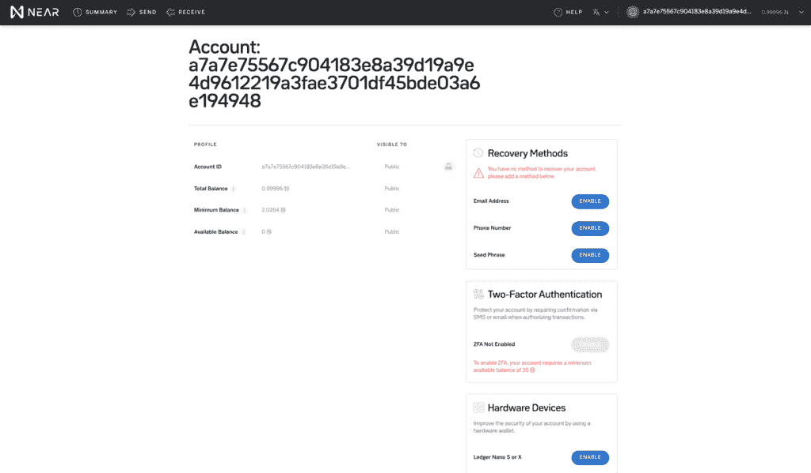
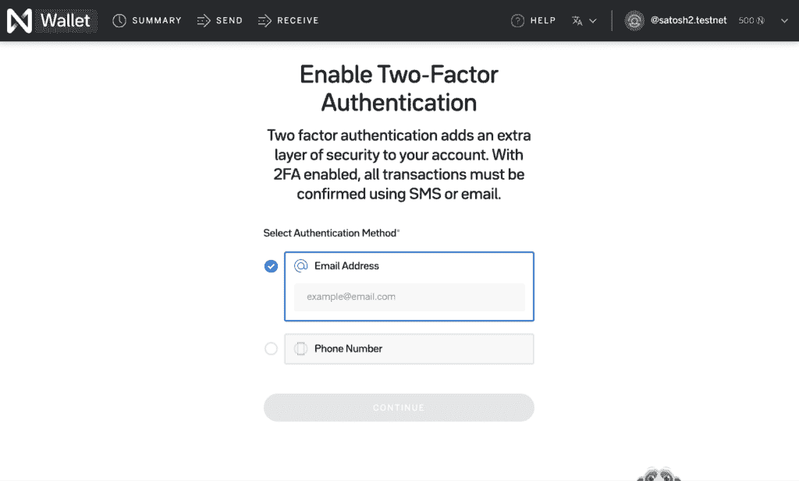
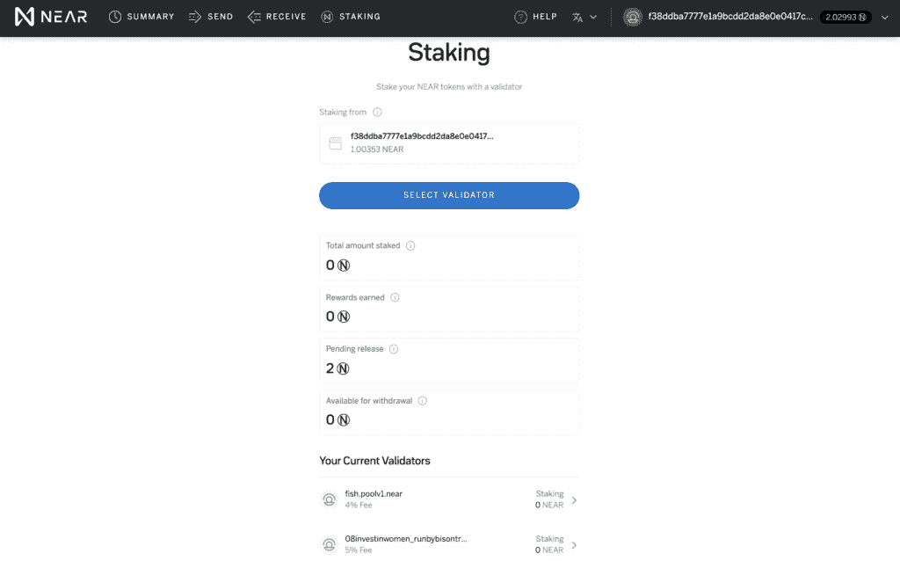
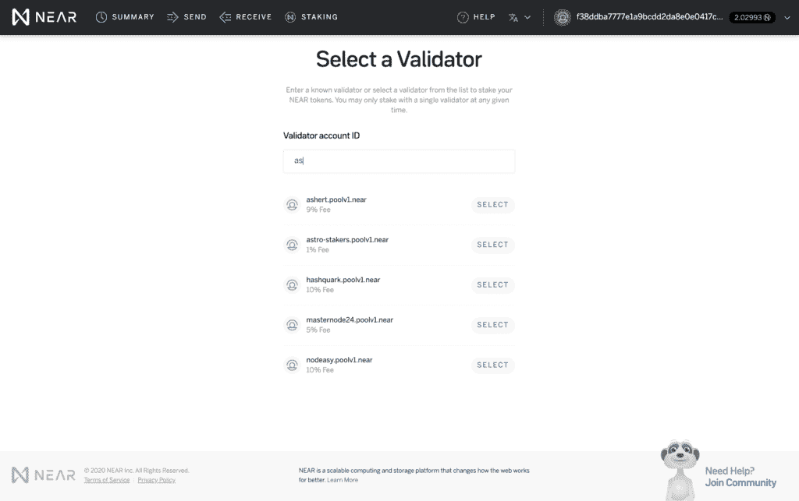
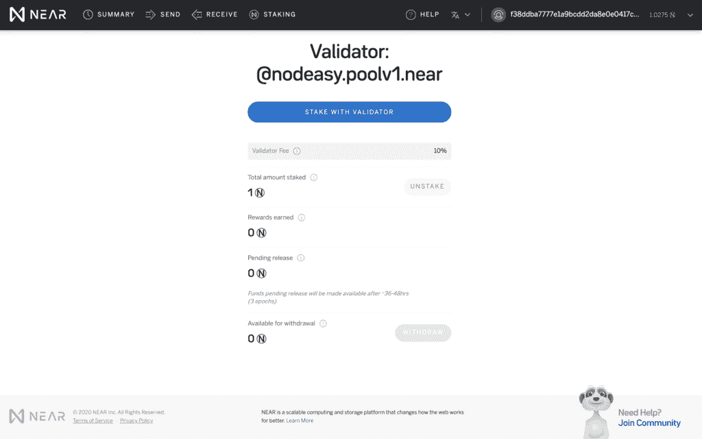

# near/near-wallet

> 原文：<https://github.com/figment-networks/learn-tutorials/blob/master/near/near-wallet.md>

| 描述 |
| --- |
| 了解如何设置您的 NEAR wallet 并存储您的代币 |

## 近距离钱包入门

[**原帖可以在这里找到**](https://near.org/blog/getting-started-with-the-near-wallet/) 。

[**附近钱包**](https://wallet.near.org/) 是一个非托管的、基于网络的钱包，用于附近的区块链。

钱包现已面向所有人开放！首先，进入[**https://wallet.near.org**](https://wallet.near.org/)，点击“创建账户”。

## 创建帐户

首先，选择您的帐户名称。在 NEAR Wallet 中创建的每个帐户都附加有`.near`，它是帐户名称的一部分。例如，选择`satoshi`将创建`satoshi.near`帐户名。

## 选择访问方法

接下来，您将选择您的帐户访问方法。近钱包是完全非托管的，这意味着帐户访问是你的责任。我们目前提供四种帐户访问方法。创建帐户后，您可以选择启用多种方法。

### 分类帐硬件钱包

如果你有莱杰 Nano S 或 X，我们**强烈**推荐使用它！这可以确保您的私钥永远不会离开您的分类帐，从而在使用 NEAR Wallet 时提供最高级别的安全性。

### 恢复(种子)短语

写下一个 12 个单词的恢复短语。如果你没有分类账，这是下一个最好的选择。

**重要提示**:seed 短语的安全性取决于您对它的存储！如果你想保留对你账户的访问，你**必须**按顺序写下你的种子词，并安全地保存它们。如果您丢失了您的种子词，您将永远失去您的帐户。

### 

### 电子邮件/电话

这是最不安全的选择。我们仅建议小额用户使用此选项，因为安全性取决于您的移动运营商或电子邮件提供商。

我们将向您发送带有验证码和恢复链接的一次性电子邮件或短信。我们不会存储此信息，因此您必须妥善保管此邮件，以便恢复您的帐户。

**重要提示**:我们只能在您访问您的帐户时重新发送恢复邮件，或更新您选择的电子邮件或电话号码。您必须确保保留对此邮件的访问权限，否则，您将无法恢复您的帐户。

## 为您的帐户提供资金

接下来，你需要用 NEAR 为你的账户注资。

要使用 NEAR 钱包进行任何操作，您至少需要 2 个 NEAR。有几种方法可以获得 NEAR，包括从币安和火币这样的热门交易所获得。

要完成此步骤，请将 NEAR(最少 2 NEAR)转换为 64 个字符的帐户 ID(您的临时 ID)，然后返回此页面。

向您的帐户注资后，您将看到“索赔帐户”按钮。

只需点击按钮，您的帐户就可以使用了！您将被重定向到您的“个人资料”页面，并可以查看您的帐户详情。

## 管理您的帐户

在“Profile”页面上，您将看到您的帐户余额明细、可用的恢复选项(不包括第一步中的种子短语)，以及添加分类帐硬件设备或设置双因素身份验证的选项。

### 双因素认证

如果您没有分类帐，我们强烈建议启用双因素身份认证。

NEAR Wallet 中的双因素身份验证为您的帐户部署了多签名合同，并要求所有交易都由第二个设备确认。

我们目前提供基于电子邮件或短信的双重身份认证。

**注意**:如果您设置了分类帐，您将看不到 2FA 屏幕。我们最终会支持将分类帐作为一种身份验证方法，但目前还不能在钱包中使用。

#### 

## 红星

使用附近代币的最好方法之一就是用木桩来支撑它们！下注有助于保护 NEAR 网络，并将为您的 NEAR 代币带来回报。基于目前的总赌注(2.5 亿美元的近赌注)，你可以赚取超过 15%的近令牌年回报率。如果总股份增加，这个比率就会下降，如果减少，就会上升。

要下注您的近端代币，请单击导航栏中的“下注”。

在 NEAR wallet 中，您可以选择用验证器来标记您的令牌。这些验证器运行为 NEAR 网络提供动力的基础设施，并将代表您完成工作以在您的 NEAR 上产生回报。对于这项工作，大多数会收取费用，只收取你的报酬(而不是你的总股份)。

点按“选择验证器”，然后从列表中选取一个(或者如果您有合适的验证器，请搜索一个)。在[https://near-staking.com](https://near-staking.com)上可以找到每个验证器的详细完整列表。

一旦你确定了一个你想下注的验证者，点击他们名字旁边的“下注”,然后输入要下注的金额。

下注后，您将返回到控制面板。在这里，您可以查看您的赌注头寸、无人认领的奖励以及任何正在取消赌注或准备提取的代币的摘要。向下滚动以查看您正在积极下注的所有验证器的列表，以及与它们下注的接近程度。

### 拆垛

要取消堆叠，请从“当前验证器”中选择要取消堆叠的验证器。这将把您带到验证器摘要页面。单击“拆分”启动拆分过程。取消堆叠需要 36-48 小时(3 个完整时期)，在此期间，您的令牌仍然不可用(它们将显示为“待定释放”)。

一旦 3 个时期完成，你会看到他们在“准备撤回”的仪表板。再次选择验证者的名称，然后单击“撤回”按钮将您的令牌从验证者的帐户撤回到您自己的帐户。

# 后续步骤

恭喜你，你已经建立了一个近帐户，并为其注资，还成功下注了你的近帐户！我们将发布更多的教程，因为我们增加了更多的钱包功能。