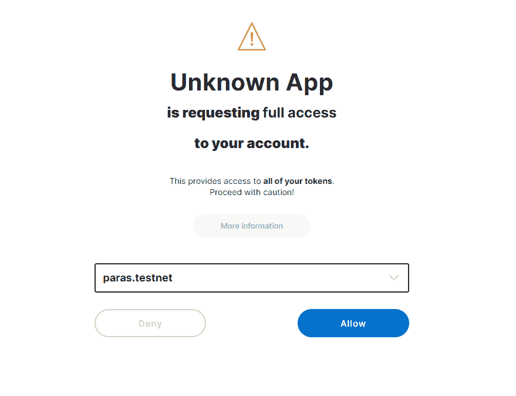
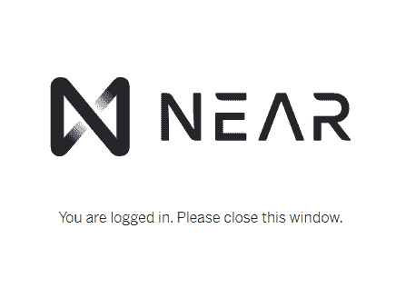

# near/nft-marketplace-in-assemblyscript

> 原文：<https://github.com/figment-networks/learn-tutorials/blob/master/near/nft-marketplace-in-assemblyscript.md>

[NFT](https://en.wikipedia.org/wiki/Non-fungible_token)是在区块链上具有可证明所有权的唯一数字项目。目前 NFTs 最受欢迎的一个用例是数字艺术。以太坊上的项目，如 [SuperRare](https://superrare.co) 利用区块链的力量来创造具有数字稀缺性和真正所有权的数字艺术，从而为艺术家和收藏家在数字空间创造了一个全新的市场。

建立在 NEAR， [Paras: Digital Art Card](https://paras.id) 是一个已经可以使用的 NFT 市场。它提供了比以太坊更便宜的 NFT 铸造费，使艺术家能够创作而不受高昂的链上费用的限制。

在本教程中，我们将为一个简单的 NFT 市场创建智能合同，类似于[段落](https://paras.id)和[超级稀有](https://superrare.co)在那里艺术家可以铸造他们的数字艺术并直接出售给收藏家。我们将使用基于以太坊 [ERC721](https://eips.ethereum.org/EIPS/eip-721) 标准的 [NEP-4](https://github.com/near/NEPs/pull/4) NFT 标准。

# 先决条件:

本教程要求:

*   安装 Node.js 和 NPM
*   在 CLI 附近安装
*   完成 101 路径附近的
*   在附近完成对 NFTs 的[介绍](https://learn.figment.io/tutorials/write-nft-contracts-in-rust)

不需要但仍然有价值的参考资料可以在附近的文档[汇编脚本介绍](https://docs.near.org/docs/develop/contracts/as/intro)以及[数据存储](https://docs.near.org/docs/concepts/data-storage)页面中找到。

# 安装纱线

如果你还没有，我们需要安装`yarn`包管理器。我们正在使用的示例代码使用`yarn`作为它的构建工具。运行该命令，使用 Node.js 的捆绑包管理器`npm`将`yarn`安装为全局包:

```js
npm i -g yarn
```

如果成功了，你就可以在 AssemblyScript 和 Rust 中开发智能合约了。如果您在安装过程中遇到任何错误或问题，您可以查看论坛或 Discord 寻求帮助。

# 克隆近 NFT 回购协议

在本教程中，我们将使用 Github 上分叉附近的 NFT 示例代码。运行以下命令来克隆该存储库并安装其要求:

```js
git clone https://github.com/figment-networks/NFT
cd NFT
yarn install
```

该报告包含 AssemblyScript 和 Rust 中的 NFT 示例，以及支持文件和文档。出于本教程的目的，我们将在 AssemblyScript 而不是 Rust 中构建。智能合同所需的所有文件都在子目录`contracts/assemblyscript`中

# 运行和测试

我们也可以用这个命令运行所有包含的单元测试:

```js
yarn test:unit:as
```

注意，`test:unit:as`用 yarn 触发的一系列命令是在 package.json 文件中定义的。您可以使用它来定制您自己的命令，但是这超出了本教程的范围。需要知道的重要一点是，您可以在您的`package.json`文件中看到和修改这些命令！如果您在运行`yarn test:unit:as`时遇到任何错误，您必须在继续之前解决它们。

```js
"scripts": {
    ...
    "test:unit:as": "asp --verbose --nologo -c contracts/assemblyscript/as-pect.config.js -f unit.spec",
    ...
  },
```

单元测试输出可能会很混乱，但是最后您应该会看到结果的摘要:

```js
[Result]: ✔ PASS
[Files]: 1 total
[Groups]: 8 count, 8 pass
[Tests]: 13 pass, 0 fail, 13 total 
```

如果所有的测试都通过了，那么你就可以继续了！

# 了解 NEP-4 合同

我们的市场将基于 NEP-4 合同。NEP 代表 NEAR Enhancement Proposal，它包含各种公共接口和 API，由智能合约开发者在 NEAR 协议之上使用。NEP-4 是区块链附近用于不可替代令牌(NFT)资产的标准，该标准允许区块链附近的许多 NFT 合同之间的互操作性，如所有权和转让。我们需要做的第一件事是理解基础合同，并将其扩展到市场。我们将修改的智能合同位于`contracts/assemblyscript/NEP-4-basic/main.ts`。打开文件，我们将一起运行代码。

## 数据类型和存储

有许多内置的数据存储可以在附近使用。

```js
/**************************/
/* DATA TYPES AND STORAGE */
/**************************/

type AccountId = string
type TokenId = u64

// Note that MAX_SUPPLY is implemented here as a simple constant
// It is exported only to facilitate unit testing
export const MAX_SUPPLY = u64(10)

// The strings used to index variables in storage can be any string
// Let's set them to single characters to save storage space
const tokenToOwner = new PersistentMap<TokenId, AccountId>('a')

// Note that with this implementation, an account can only set one escrow at a
// time. You could make values an array of AccountIds if you need to, but this
// complicates the code and costs more in storage rent.
const escrowAccess = new PersistentMap<AccountId, AccountId>('b')

// This is a key in storage used to track the current minted supply
const TOTAL_SUPPLY = 'c'
```

## 改变方法

这些改变的方法是改变区块链国家的方法。代码本身类似于以太坊的`ERC721`标准。需要注意的一点是`grant_access`功能，它允许其他账户(包括智能合约)访问你的账户。这通常与前端代码结合使用，代表您传输令牌。

```js
/******************/
/* CHANGE METHODS */
/******************/

// Grant access to the given `accountId` for all tokens the caller has
export function grant_access(escrow_account_id: string): void {
    escrowAccess.set(context.predecessor, escrow_account_id)
}

// Revoke access to the given `accountId` for all tokens the caller has
export function revoke_access(escrow_account_id: string): void {
    escrowAccess.delete(context.predecessor)
}

// Transfer the given `token_id` to the given `new_owner_id`. Account `new_owner_id` becomes the new owner.
// Requirements:
// * The caller of the function (`predecessor`) should have access to the token.
export function transfer_from(
    owner_id: string,
    new_owner_id: string,
    token_id: TokenId
): void {
    const predecessor = context.predecessor

    // fetch token owner and escrow; assert access
    const owner = tokenToOwner.getSome(token_id)
    assert(owner == owner_id, ERROR_OWNER_ID_DOES_NOT_MATCH_EXPECTATION)
    const escrow = escrowAccess.get(owner)
    assert(
        [owner, escrow].includes(predecessor),
        ERROR_CALLER_ID_DOES_NOT_MATCH_EXPECTATION
    )

    // assign new owner to token
    tokenToOwner.set(token_id, new_owner_id)
}

// Transfer the given `token_id` to the given `new_owner_id`. Account `new_owner_id` becomes the new owner.
// Requirements:
// * The caller of the function (`predecessor`) should be the owner of the token. Callers who have
// escrow access should use transfer_from.
export function transfer(new_owner_id: string, token_id: TokenId): void {
    const predecessor = context.predecessor

    // fetch token owner and escrow; assert access
    const owner = tokenToOwner.getSome(token_id)
    assert(owner == predecessor, ERROR_TOKEN_NOT_OWNED_BY_CALLER)

    // assign new owner to token
    tokenToOwner.set(token_id, new_owner_id)
}
```

## 查看方法

视图方法具有 GET 功能。打电话不需要任何油费，但他们不能改变区块链州。

```js
/****************/
/* VIEW METHODS */
/****************/

// Returns `true` or `false` based on caller of the function (`predecessor`) having access to account_id's tokens
export function check_access(account_id: string): boolean {
    const caller = context.predecessor

    // throw error if someone tries to check if they have escrow access to their own account;
    // not part of the spec, but an edge case that deserves thoughtful handling
    assert(caller != account_id, ERROR_CALLER_ID_DOES_NOT_MATCH_EXPECTATION)

    // if we haven't set an escrow yet, then caller does not have access to account_id
    if (!escrowAccess.contains(account_id)) {
        return false
    }

    const escrow = escrowAccess.getSome(account_id)
    return escrow == caller
}

// Get an individual owner by given `tokenId`
export function get_token_owner(token_id: TokenId): string {
    return tokenToOwner.getSome(token_id)
}
```

## 铸造

在这个例子中，NFT 本身只是一个简单的拥有者 ID。图像、视频或音频等元数据通常离线存储在 [IPFS](https://ipfs.io/) 、 [Sia](https://siasky.net/) 甚至是 [AWS S3](https://aws.amazon.com/s3) 等集中式文件存储上。与以太坊区块链相比，在 NEAR 上存储数据相当便宜；您实际上可以在 chain 上存储整个元数据，但这超出了本教程的范围。你可以在 testnet 上免费试用它！

[Paras](https://paras.id) 不在链上存储任何元数据，相反，Paras 使用一个 [IPFS CID](https://docs.ipfs.io/concepts/content-addressing/) 作为令牌 ID。在构建 NFT 时，您可以尝试许多设计。

```js
export function mint_to(owner_id: AccountId): u64 {
    // Fetch the next tokenId, using a simple indexing strategy that matches IDs
    // to current supply, defaulting the first token to ID=1
    //
    // * If your implementation allows deleting tokens, this strategy will not work!
    // * To verify uniqueness, you could make IDs hashes of the data that makes tokens
    //   special; see https://twitter.com/DennisonBertram/status/1264198473936764935
    const tokenId = storage.getPrimitive<u64>(TOTAL_SUPPLY, 1)

    // enforce token limits – not part of the spec but important!
    assert(tokenId <= MAX_SUPPLY, ERROR_MAXIMUM_TOKEN_LIMIT_REACHED)

    // assign ownership
    tokenToOwner.set(tokenId, owner_id)

    // increment and store the next tokenId
    storage.set<u64>(TOTAL_SUPPLY, tokenId + 1)

    // return the tokenId – while typical change methods cannot return data, this
    // is handy for unit tests
    return tokenId
}
```

# 市场

我们已经完成了基本的 NFT 合同；用户现在可以铸造他们的 NFT。下一步，我们将创建一个市场，NFT 的所有者可以列出 NFT，指出它们的价格，并使它们可以被 NEAR 上的任何用户购买。我们将在我们构建的每个功能/特性之后添加单元测试，以确保在部署到 NEAR 之前它能按预期工作。

# 单元测试

单元测试可以在**测试**文件夹中找到。包`as-pect`用于 AssemblyScript 中的单元测试。您可以使用`VMContext`在近运行时模拟各种项目来测试功能，如合同调用程序、附加存款等。

您可以使用以下工具运行测试:

```js
yarn test:unit:as
```

我们将在我们的基本 NFT 契约中一个接一个地添加更多的特性，并为我们创建的每个函数运行单元测试。

# 数据类型和存储

我们需要创建一个新的`PersistentUnorderedMap`来存储所有者列出的所有代币的价格。我们使用`u128`作为`Price`的数据类型，因为 NEAR 令牌也在`u128`中。我们使用`PersistentUnorderedMap`,因为我们想要创建一个`key-value`存储，它也可以作为一个列表被检索。

首先，让我们从`near-sdk-as`中导入`u128`和`PersistentUnorderedMap`。更新`main.ts`顶部的以下行:

```js
import {
    PersistentMap,
    storage,
    context,
    u128,
    PersistentUnorderedMap,
} from 'near-sdk-as'
```

然后我们可以使用导入的`PersistentUnorderedMap`作为我们市场的数据结构。在`main.ts`中导入部分之后的`DATA TYPES AND STORAGE`部分中编写以下代码:

```js
type Price = u128

const market = new PersistentUnorderedMap<TokenId, Price>('m')
```

# 将代币添加到市场

接下来，我们创建一个名为`internal_add_to_market`的私有函数，作为向市场添加代币及其价格的主函数。公共函数`add_to_market`基本上是`internal_add_to_market`的包装器，用户可以调用它向市场列出他们的令牌并进行验证。

在文件`main.ts`底部的`NON-SPEC METHODS`部分添加以下内容:

```js
export function add_to_market(token_id: TokenId, price: Price): boolean {
    const caller = context.predecessor

    // validate token owner
    const owner = tokenToOwner.getSome(token_id)
    assert(owner == caller, ERROR_TOKEN_NOT_OWNED_BY_CALLER)

    // set the price for sale
    internal_add_to_market(token_id, price)

    return true
}

function internal_add_to_market(token_id: TokenId, price: Price): void {
    market.set(token_id, price)
}
```

如前所述，我们将在为智能合约添加新功能后添加一个测试。首先让我们更新文件顶部的导入语句(`__tests__/main.unit.spec.ts`)。

```js
import { u128, VMContext } from 'near-sdk-as'
```

您可以在当前单元测试文件`__tests__/main.unit.spec.ts`的末尾添加以下代码。评论本身已经不言自明了。

```js
describe('add_to_market', () => {
    it('should add nft to market and return true', () => {
        VMContext.setPredecessor_account_id(alice)
        // mint new token that return its id
        const tokenId = nonSpec.mint_to(alice)
        // 1 NEAR
        const price = u128.from('1000000000000000000000000')

        expect(nonSpec.add_to_market(tokenId, price)).toBe(true)
    })

    it('should throw error if called by non owner', () => {
        expect(() => {
            VMContext.setPredecessor_account_id(alice)
            // mint new token that return its id
            const tokenId = nonSpec.mint_to(alice)
            // 1 NEAR
            const price = u128.from('1000000000000000000000000')

            VMContext.setPredecessor_account_id(bob)
            nonSpec.add_to_market(tokenId, price)
        }).toThrow(nonSpec.ERROR_TOKEN_NOT_OWNED_BY_CALLER)
    })
})
```

创建市场后，我们需要一个函数来获取价格。让我们创建一个简单的 get 函数`get_market_price`，它接受`token_id`并返回它的价格。

```js
export function get_market_price(token_id: TokenId): Price {
    return market.getSome(token_id)
}
```

同样，我们需要为我们的函数创建一个单元测试，以确保它按预期工作。

```js
describe('get_market_price', () => {
    it('return market price for a token', () => {
        VMContext.setPredecessor_account_id(alice)
        // mint new token that return its id
        const tokenId = nonSpec.mint_to(alice)
        // set price to be 1 NEAR
        const price = u128.from('1000000000000000000000000')
        nonSpec.add_to_market(tokenId, price)
        // get the market price of tokenId
        expect(nonSpec.get_market_price(tokenId)).toBe(price)
    })
})
```

现在让我们使用以下代码运行测试:

```js
yarn test:unit:as
```

它应该会返回如下内容:

```js
...
 [Success]: ✔ should add nft to market and return true
 [Success]: ✔ should throw error if called by non owner

 Success]: ✔ return market price for a token
...
```

# 从市场中移除代币

从市场中删除令牌的代码与添加令牌的代码非常相似。我们创建一个私有的`internal_remove_from_market`来从市场中删除令牌列表，并创建一个公共的`remove_from_market`来验证令牌所有权以及令牌是否在市场中。让我们更新我们的`main.ts`,并在文件末尾添加以下代码。

```js
export function remove_from_market(token_id: TokenId): boolean {
    const caller = context.predecessor

    // validate token owner
    const owner = tokenToOwner.getSome(token_id)
    const escrow = escrowAccess.get(owner)
    assert(
        [owner, escrow].includes(caller),
        ERROR_CALLER_ID_DOES_NOT_MATCH_EXPECTATION
    )

    assert(market.getSome(token_id), ERROR_TOKEN_NOT_IN_MARKET)

    // remove token from market
    internal_remove_from_market(token_id)

    return true
}

function internal_remove_from_market(token_id: TokenId): void {
    market.delete(token_id)
}
```

我们在试图移除代币之前检查代币是否存在于市场中。如果令牌不存在，我们返回错误`ERROR_TOKEN_NOT_IN_MARKET`。让我们将这个新的错误类型添加到`main.ts`顶部的`ERROR MESSAGES`部分:

```js
export const ERROR_TOKEN_NOT_IN_MARKET = 'Token is not available in market.'
```

这是我们为`remove_from_market`创建的测试用例，你可以把它放在测试文件`__tests__/main.unit.spec.ts`的末尾:

```js
describe('remove_from_market', () => {
    it('should remove nft from market and return true', () => {
        VMContext.setPredecessor_account_id(alice)
        // mint new token that return its id
        const tokenId = nonSpec.mint_to(alice)
        // 1 NEAR
        const price = u128.from('1000000000000000000000000')
        // add token to market
        expect(nonSpec.add_to_market(tokenId, price)).toBe(true)
        // remove token from market
        expect(nonSpec.remove_from_market(tokenId)).toBe(true)
    })

    it('should throw error for nft available in market', () => {
        expect(() => {
            VMContext.setPredecessor_account_id(alice)
            // mint new token that return its id
            const tokenId = nonSpec.mint_to(alice)
            // throw error when try to remove token id that was not listed
            nonSpec.remove_from_market(tokenId)
        }).toThrow(nonSpec.ERROR_TOKEN_NOT_IN_MARKET)
    })
})
```

现在让我们使用以下代码运行测试:

```js
yarn test:unit:as
```

它应该会返回如下内容:

```js
...
 [Success]: ✔ should remove nft from market and return true
 [Success]: ✔ should throw error for nft available in market
...
```

# 购买功能

这是市场的主要功能，用户可以在市场上购买列出的 NFT。买家可以附加一些近作为付款，合同将自动发送付款给卖家，并更新令牌所有权给买家。我们还将为智能合约开发人员创建一个简单的交易费或佣金，在本例中，我们将从通过智能合约完成的每笔销售中抽取 5%的佣金。

首先，让我们为佣金设置一个常数。你可以把这个常数写在`DATA TYPES AND STORAGE`段的`main.ts`顶部。

```js
const COMMISSION = 5
```

如果存款金额和当前 NFT 价格不相等，我们返回错误`ERROR_DEPOSIT_NOT_MATCH`。让我们将它添加到`main.ts`顶部的`ERROR MESSAGES`部分:

```js
export const ERROR_DEPOSIT_NOT_MATCH = 'Deposit does not match the market price'
```

让我们开始编写购买函数的代码。要检索智能合约中的支付金额，我们可以使用`context.attachedDeposit`。之后，我们需要验证存款金额和当前的 NFT 价格。将以下内容添加到`main.ts`中的`NON-SPEC METHODS`:

```js
export function buy(token_id: TokenId): TokenId {
    const caller = context.predecessor

    const amount = context.attachedDeposit
    const price = market.getSome(token_id)

    // check if the amount deposited match with the price
    assert(amount == price, ERROR_DEPOSIT_NOT_MATCH)

    // 1\. Calculate commission & transfer payment

    // 2\. Remove from market & update token ownership
}
```

## 计算佣金和转账付款

我们可以使用`ContractPromiseBatch`将款项转到账户。我们将使用承诺批次`ContractPromiseBatch.create(accountId).transfer(amount)`。第一个承诺`.create`，是创建收款人账户，随后`.transfer`将付款转移到收款人账户。

首先，我们需要通过更新`main.ts`的顶部来导入`ContractPromiseBatch`:

```js
import {
    PersistentMap,
    storage,
    context,
    u128,
    PersistentUnorderedMap,
    ContractPromiseBatch,
} from 'near-sdk-as'
```

我们还需要更新我们的购买功能，以自动将存款金额转移到接收方和智能合同(交易费)。更新注释`// 1\. Calculate commission & transfer payment`下的`main.ts`文件中的 buy 函数，添加以下代码片段:

```js
// calculate commission for the smart contract
const owner = tokenToOwner.getSome(token_id)
const forOwner: u128 = u128.div(
    u128.mul(amount, u128.from(100 - COMMISSION)),
    u128.from(100)
)
const contract = context.contractName
const forContract: u128 = u128.sub(amount, forOwner)

// tranfer the deposit to token owner and smart contract
ContractPromiseBatch.create(owner).transfer(forOwner)
ContractPromiseBatch.create(contract).transfer(forContract)
```

## 从市场中删除并更新令牌所有权

付款后，我们需要从市场上删除令牌，并将令牌的所有权更新给买家。我们在函数结束时返回`token_id`。在`main.ts`文件中的`// 2\. Remove from market & update token ownership`注释下添加以下代码片段:

```js
// remove the token from the market
internal_remove_from_market(token_id)

// update the token owner
tokenToOwner.set(token_id, caller)

return token_id
```

如您所见，我们调用 private `internal_remove_from_market`函数从市场中删除令牌，而不进行任何验证。

我们现在可以通过更新我们的`main.unit.spec.ts`的结尾，使用下面的单元测试来测试我们的`buy`函数:

```js
describe('buy', () => {
    it('transfer token and remove it from market', () => {
        VMContext.setPredecessor_account_id(alice)
        // mint new token that return its id
        const tokenId = nonSpec.mint_to(alice)
        // set price to be 1 NEAR
        const price = u128.from('1000000000000000000000000')
        nonSpec.add_to_market(tokenId, price)
        // mock the Buyer id & the deposit amount
        VMContext.setPredecessor_account_id(bob)
        VMContext.setAttached_deposit(price)
        // Buyer (bob) will call this buy function
        nonSpec.buy(tokenId)
        // after successful purchase the owner of the NFT must be bob
        expect(get_token_owner(tokenId)).toBe(bob)
    })
})
```

现在让我们使用以下代码运行测试:

```js
yarn test:unit:as
```

它应该会返回如下内容:

```js
...
 [Success]: ✔ transfer token and remove it from market
...
```

# 获取市场代币

首先，我们需要创建 struct `TokenDetail`并添加 decorator `nearBindgen`以在 NEAR 运行时序列化/反序列化该 struct(将其视为每个 struct 在 NEAR 协议上运行所需的语法)。

我们将创建函数`get_market`，该函数将返回包含`tokenId`及其`price`的`TokenDetail`列表。对于实现，我们使用来自`PersistentUnorderedMap`的`.entries()`，它从我们的列表中获取开始和结束索引(我们可以在以后构建前端应用程序时使用它进行分页)。

在`main.ts`的末尾添加以下代码:

```js
@nearBindgen
export class TokenDetail {
    tokenId: TokenId
    price: Price

    constructor(tokenId: TokenId, price: Price) {
        this.tokenId = tokenId
        this.price = price
    }
}

export function get_market(start: i32, end: i32): TokenDetail[] {
    const results: TokenDetail[] = []

    const tokenList = market.entries(start, end)
    for (let i = 0; i < tokenList.length; i++) {
        results.push(new TokenDetail(tokenList[i].key, tokenList[i].value))
    }

    return results
}
```

让我们编写测试，看看它是否像预期的那样工作。我们将铸造 3 个新的 NFT，并将它们全部添加到市场中，然后期望看到 3 个上市的 NFT。打开我们的`main.unit.spec.ts`文件，并在文件末尾添加以下代码。

```js
describe('get_market', () => {
    it('return market price for a token', () => {
        VMContext.setPredecessor_account_id(alice)

        const price = u128.from('1000000000000000000000000')
        // mint new token that return its id
        const tokenId_1 = nonSpec.mint_to(alice)
        nonSpec.add_to_market(tokenId_1, price)

        const tokenId_2 = nonSpec.mint_to(alice)
        nonSpec.add_to_market(tokenId_2, price)

        const tokenId_3 = nonSpec.mint_to(alice)
        nonSpec.add_to_market(tokenId_3, price)
        // set price to be 1 NEAR
        // get the first 5 NFTs listed on the market
        expect(nonSpec.get_market(0, 5)).toHaveLength(3)
    })
})
```

现在让我们使用以下代码运行测试:

```js
yarn test:unit:as
```

它应该会返回如下内容:

```js
...
 [Success]: ✔ return market price for a token
...
```

# 建立合同

在构建契约之前，让我们测试一下新添加的代码，看看是否一切顺利。

```js
yarn test:unit:as
```

如果它返回这样的结果，那么我们就可以开始了。如果没有，确保你没有任何打字错误，并且你使用的是最新的`near-sdk-as`。

```js
[Result]: ✔ PASS
[Files]: 1 total
[Groups]: 13 count, 13 pass
[]Tests]: 20 pass, 0 fail, 20 total
```

要将我们的契约构建到 WebAssembly 中，我们只需使用下面的命令:

```js
yarn build:as
```

如果你看到任何错误，编译器会给你一个详细的解释。既然你已经复制并粘贴了本教程中的所有内容，那么很可能只是打字错误。

本教程的完整代码可以在 Github 上找到。

# 部署和使用合同

我们可以使用 NEAR CLI 来部署这个契约，并测试它的工作情况。运行此命令以部署您刚刚构建的契约:

```js
near dev-deploy out/main.wasm
```

输出将显示部署事务的详细信息，以及 CLI 自动为您生成的 test NEAR 帐户的 ID。它应该是这样的:

```js
Starting deployment. Account id: dev-1610108148519-8579413, node: https://rpc.testnet.near.org, helper: https://helper.testnet.near.org, file: out/main.wasm
Transaction Id HiGAnagXLY7TaCzmLRBCSzgDPWjSFifaLTQsfARmj1Qy
To see the transaction in the transaction explorer, please open this url in your browser
https://explorer.testnet.near.org/transactions/HiGAnagXLY7TaCzmLRBCSzgDPWjSFifaLTQsfARmj1Qy
Done deploying to dev-1610108148519-8579413
```

在 NEAR 中，您需要将合同部署到某个帐户中。使用`dev-deploy`将创建一个测试帐户，并立即将合同部署到该帐户中。测试账户看起来有点像`dev-xxxxxxxxxxx-xxxxx`。如果您来自以太坊，情况就大不相同了，在以太坊中，每次部署都会为智能合约创建新的地址和存储。

从上面的命令中，我们了解到我们创建了一个 ID 为`dev-1610108148519-8579413`的帐户，我们刚刚在其中部署了智能合约。智能合同 ID 基本上是账户 ID，即`dev-1610108148519-8579413`。您将拥有一个不同的 ID，因此在执行以下命令时，请记住用您的 ID 替换这些合同 ID。

# 与附近的测试网互动

我们可以使用 NEAR CLI 与区块链进行交互。有两个主要命令:`call`和`view`。`call`用于变异区块链状态，`view`仅用于从区块链获取数据。

首先，我们需要在 NEAR CLI 中验证一些帐户。转到`https://wallet.testnet.near.org/`并创建 2 个账户，你可以给他们起任何你想要的名字，但在本教程中我们将称他们为`artist`和`collector`。之后，回到您的终端并使用以下命令:

```js
near login
```

它将返回类似这样的内容，并打开您的默认浏览器。如果您的浏览器没有自动打开，您可以按照说明操作。

```js
Please authorize NEAR CLI on at least one of your accounts.

If your browser doesnt automatically open, please visit this URL                                                                   https://wallet.testnet.near.org/login/?title=NEAR+CLI&public_key=ed25519%3AAZCY2SeK6FQe6DFWfNjgxnAfF9TprTirwdduiksLEgBa&success_url=http%3A%2F%2F127.0.0.1%3A5000                                                                                                       Please authorize at least one account at the URL above.
```

选择您刚刚创建的帐户之一，在我们的终端中进行身份验证。

[](https://user-images.githubusercontent.com/9144402/105279194-a5a4bd80-5bd9-11eb-991f-ddd6928eb255.png)

单击“允许”,然后在确认页面中输入您的帐户 id。只需键入您选择的帐户 id(在本例中，我们需要键入`paras.testnet`)

[](https://user-images.githubusercontent.com/9144402/105279309-dc7ad380-5bd9-11eb-8266-3ce21d043e7e.png)

如果一切顺利，你会重定向到这个页面。

[](https://user-images.githubusercontent.com/9144402/105279415-11872600-5bda-11eb-8dad-7e219fc2bea5.png)

这样做两次，以便您的两个新帐户在 NEAR CLI 上得到验证。我们可以使用以下命令检查这些帐户是否在我们的计算机上进行了身份验证:

```js
ls ~/.near-credentials/default/
```

如果您看到至少 2 个带有`[account_id].json`的文件，那么我们就可以开始了。事不宜迟，让我们试试之前用这些新帐户创建的一些功能。

# 就像 NFT！

我们需要使用`call`方法铸造一个新的 NFT，因为它会改变区块链国家。我们将使用函数`mint_to`铸造一个新的 NFT，并将其所有权分配给某人。您可以使用下面的命令:

```js
near call --accountId [ARTIST_ID] [DEV_ID] mint_to '{"owner_id": "[ARTIST_ID]"}'
```

确保将`[ARTIST-ID]`更改为您之前在浏览器中创建的帐户之一，并使用我们在部署智能合同时创建的帐户 id`[DEV-ID]`。运行以上命令将返回新创建的 NFT 的 tokenId:

```js
'1' 
```

# 添加到市场

我们可以把我们新铸造的 NFT 加入市场，看看是否有收藏家有兴趣把它加入他们的收藏。我们可以使用函数`add_to_market`来做这件事，它以`token_id`和`price`为参数。价格必须以约克敦年(10^24)为单位，在这种情况下，我们以 1 N - > 100000000000000000000 约克敦年出售我们的 NFT。确保将参数`[TOKEN_ID]`更改为您拥有的任何 NFT ID/mint。

```js
near call --accountId [ARTIST_ID] [DEV_ID] add_to_market '{"token_id": "[TOKEN_ID]", "price": "1000000000000000000000000"}'
```

如果一切顺利，这个调用函数应该返回 true。

我们可以使用以`token_id`为参数的视图函数`get_market_price`来验证我们的 NFT 是否如预期的那样列在市场上。

```js
near view --accountId [ARTIST-ID] [DEV_ID] get_market_price '{"token_id": "[TOKEN_ID]"}'
```

它应该返回我们之前使用`add_to_market`设置的价格，即 1 N。

# 买一辆 NFT

这一次，我们将使用您创建的另一个帐户，让我们称这个帐户为 collector `COLLECTOR_ID`。收集者可以通过调用需要`[TOKEN_ID]`作为参数的函数`buy`来购买列出的 NFT。这一次，我们添加`--amount`来购买 NFT，并附加 1 N，因为这是购买 NFT 所需的标价。

在我们购买 NFT 之前，让我们使用下面的 NEAR CLI 命令来记录艺术家和收藏家之间的当前平衡:

```js
near state [ACCOUNT_ID]
```

你可以用`[ARTIST_ID]`或`[COLLECTOR_ID]`替换`[ACCOUNT_ID]`，它会返回如下结果:

```js
{
    "amount": "88126613751512027823390000",
    "locked": "0",
    "code_hash": "11111111111111111111111111111111",
    "storage_usage": 2844,
    "storage_paid_at": 0,
    "block_height": 32018936,
    "block_hash": "Ffc1kw56xpCV1fPJVHNEtfbDbfPF4wkhQNbvbUbXpH5M",
    "formattedAmount": "88.12661375151202782339"
}
```

`formattedAmount`是账户的当前余额，所以只需记下这个值，以便在购买完成后可以将其与`formattedAmount`进行比较。我们用`[COLLECTOR_ID]`调用`buy`函数:

```js
near call --accountId [COLLECTOR_ID] [DEV_ID] buy '{"token_id": "[TOKEN_ID]"}' --amount 1
```

如果一切顺利，我们可以验证所有权和平衡变更。

```js
near view --accountId [COLLECTOR_ID] [DEV_ID] get_token_owner '{"token_id": "[TOKEN_ID]"}'
```

我们可以打电话给`near state [ACCOUNT_ID]`检查卖家/艺术家是否已经收到付款，并从买家的余额中扣除。

# 结论

恭喜你！我们已经在 AssemblyScript 中部署了修改后的 NFT 智能合同，并在 NEAR Testnet 上提供了市场功能。现在，您可以通过调用其他函数(如`delete_from_market`和其他函数)继续进行试验。您还可以将这个契约与 javascript sdk `near-api-js`连接起来，为您的市场创建前端应用程序。

请记住，此代码不是为生产而设计的:如果您想要将它部署到 mainnet，还有一些其他事情需要考虑，例如，如果令牌在市场上列出，则禁用传输方法等等。

该项目的完整代码可以在 [Github](https://github.com/figment-networks/tutorials/near/7_NFT_marketplace/) 上找到。