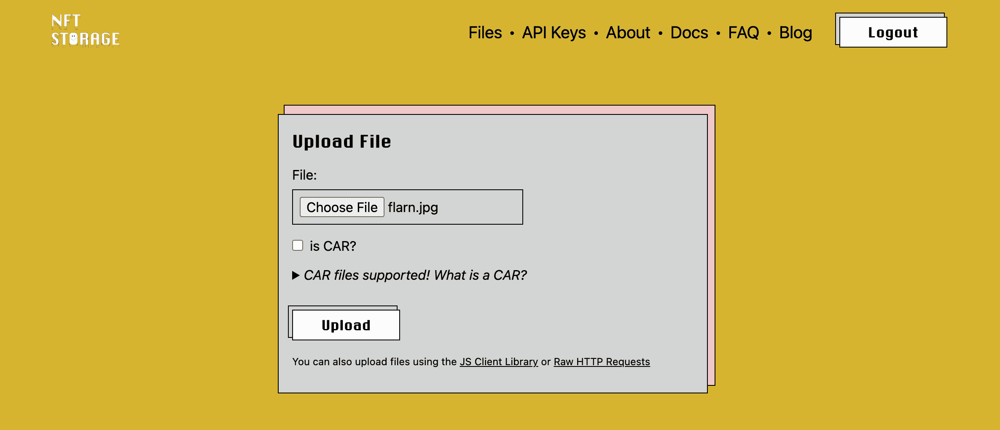
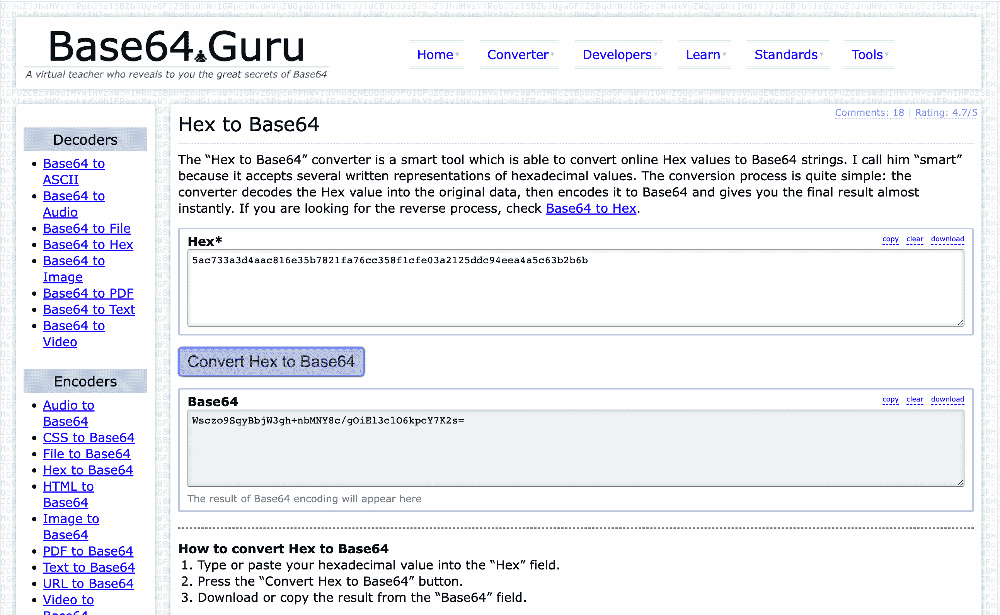
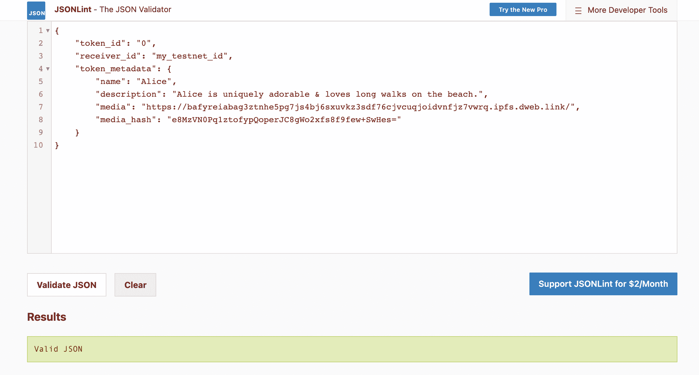
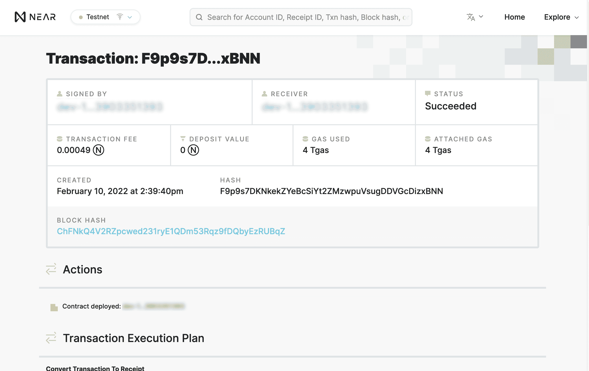

# 介绍

> 原文：<https://github.com/figment-networks/learn-tutorials/blob/master/near/write-nft-contracts-in-rust-nep171.md>

[不可替代代币](https://en.wikipedia.org/wiki/Non-fungible_token)是区块链上所有权的唯一记录。通常 NFT 与一些有趣和稀有的东西联系在一起，比如一件艺术品、一张音乐会门票、一只可收藏的猫、一个域名或一个真实的实物。NFT 可以买卖，赠送，甚至可以铸造或销毁，这取决于合同的规则。 [Cryptokitties](https://www.cryptokitties.co/) 、 [SuperRare](https://superrare.co/) 和 [Bored Ape 游艇俱乐部](https://boredapeyachtclub.com/)只是一些受欢迎的基于以太坊的 NFT 项目的例子。我们可以在 NEAR 上同样容易地实现 NFTs。

在本教程中，我们将创建一个简单的可收藏的 NFT 艺术品称为 Flarn，由名称，描述和 JPEG 图像组成。我们的智能合同将允许在区块链附近创建、收集和交易弗兰恩。

# 先决条件

*   [近 101 通路](https://learn.figment.io/protocols/near)
*   [如何在 Rust 中编写和部署智能合同](https://learn.figment.io/tutorials/write-and-deploy-a-smart-contract-on-near)

# 要求

*   [安装 Node.js 和 npm](https://docs.npmjs.com/downloading-and-installing-node-js-and-npm)
*   [使用 npm 安装 NEAR CLI](https://www.npmjs.com/package/near-cli)
*   [在附近的测试网上创建钱包](https://nearhelp.zendesk.com/hc/en-us/articles/1500002248242-Creating-a-NEAR-Wallet-account)
*   [安装防锈器和防锈器](https://www.rust-lang.org/tools/install)

**M1 MAC 用户注意**:本教程使用的 NFT 示例回购程序目前无法在采用 M1 芯片的苹果产品上编译。如果你没有基于英特尔的 Mac，你可以在 **GitPod** 上做这个教程。[在单独的标签](https://gitpod.io/#https://github.com/near-examples/NFT)中打开这个链接，然后跳到下一部分:**了解 NFT 合同**。

# 关于 NFT 标准

NFTs 有很多标准！然而，目前使用最广泛的是以太坊的 [ERC721](https://eips.ethereum.org/EIPS/eip-721) 标准，该标准定义了如何创建和传输 NFT 以及其他内容。这个标准运行良好，但是像所有的 ERC 标准一样，它只是为以太坊区块链定义的。最近以太坊的高油价激发了人们对更实惠的替代品的兴趣，比如 NEAR。

为了支持 NEAR 上的 NFT 开发，核心开发者和市场利益相关者已经提出了新的 NEP-171 标准。NEP-171 试图处理与 ERC721 相同的所有 NFT 用例，以及对 NFT 市场的许多高级功能的可选支持。例如，NEP-171 NFT 可以同时在多个市场上出售，而且复杂的版税分配是固定的。此外，NFTs 可以直接附加到智能合约调用中，作为一种支付形式或更复杂的交易项目的一部分。

# 设置项目

**使用 rustup** 安装 WebAssembly 目标:

NEAR 使用 WebAssembly 作为其虚拟机。许多语言可以编译成 WebAssembly，但是 NEAR core 开发人员建议所有金融智能合约都用 Rust 语言编写。在开始处理 Rust 契约之前，我们需要安装交叉编译工具，使用 Rustup 将 Rust 智能契约编译到 WebAssembly 中。运行以下命令:

```
rustup target add wasm32-unknown-unknown 
```

示例输出:

```
**info:** downloading component 'rust-std' for 'wasm32-unknown-unknown'
**info:** installing component 'rust-std' for 'wasm32-unknown-unknown'
15.6 MiB /  15.6 MiB (100 %) 8.7 MiB/s in  1s ETA:  0s 
```

# 克隆 NFT 附近的回购协议

在本教程中，我们将从 Github 上的 NEAR 库修改 NEAR 的 NFT-171 示例代码。在 Linux、Unix 或 macOS 上，在`bash`(或`zsh` ) shell 中运行这些命令来克隆该存储库并安装其需求:

```
git clone https://github.com/near-examples/NFT 
```

示例输出:

```
Cloning into 'NFT'...
remote: Enumerating objects: 1334, done.
remote: Counting objects: 100% (456/456), done.
remote: Compressing objects: 100% (90/90), done.
remote: Total 1334 (delta 397), reused 398 (delta 363), pack-reused 878
Receiving objects: 100% (1334/1334), 1.41 MiB | 2.40 MiB/s, done.
Resolving deltas: 100% (642/642), done. 
```

要构建该示例，请在 shell 中输入以下命令:

```
cd NFT
./build.sh 
```

因为这是我们的第一次构建，Cargo 和 Rust 将下载并构建所有的依赖项。可能需要一些时间。完成后，您应该会在输出的末尾看到类似这样的内容:

```
Compiling near-sdk v3.1.0
Compiling near-contract-standards v3.2.0
Compiling approval-receiver v0.0.1 (/Users/mykle/Documents/near/flarns2.0/NFT/test-approval-receiver)
Compiling token-receiver v0.0.1 (/Users/mykle/Documents/near/flarns2.0/NFT/test-token-receiver)
Compiling non-fungible-token v1.1.0 (/Users/mykle/Documents/near/flarns2.0/NFT/nft)
Finished release [optimized] target(s) in 2m 07s 
```

我们也可以用这个命令运行所有包含的单元测试:

```
cargo test -- --nocapture 
```

单元测试的输出是杂乱的，但是在最后你应该会看到结果的总结。

```
test result: ok. 10 passed; 0 failed; 0 ignored; 0 measured; 0 filtered out 
```

如果你看到`test result: ok`，一切都好。

**注意:在撰写本文时，这些测试在基于 M1 的 MAC 上失败了，出现了一个关于`get_fault_info`的错误。我们建议 M1 用户使用 Gitpod 来完成本教程。**

# 了解 NFT 合同

我们将修改的 Rust smart 合同位于`nft/src/lib.rs`。在编辑器中打开该文件。我们会做一些简单的改变。

如果你浏览这个契约，你会发现它只实现了三个方法:`new`和`new_default_meta`用于初始化一个新的契约，`nft_mint`用于创建一个新的 NFT。但是该合同还从一组相关的包中引入了符号、方法和其他特征，这些包一起提供了 NEP-171 标准的所有核心和可选特征。还要注意，大量的单元测试占据了合同文件的一半以上。在导入的模块中也有很多测试。我们将在修改合同后运行所有的测试，以确保我们没有破坏任何东西。

## 定制合同

NEP-171 要求我们的合同有一个人可读的名称和一个缩写符号，供市场和钱包使用。这些在从第 52 行开始的`new_default_meta`函数中定义。

让我们修改这个函数，使用我们自己的名字和符号。将名称改为“CryptoFlarns”，符号改为“FLARN”。(还要更改“base_uri”字段，如图所示；我们稍后会解释原因。)完成后，该方法应该如下所示:

```
	/// Initializes the contract owned by `owner_id` with
	/// default metadata (for example purposes only).
	#[init]
	pub fn new_default_meta(owner_id: ValidAccountId) ->  Self {
		Self::new(
			owner_id,
			NFTContractMetadata {
				spec: NFT_METADATA_SPEC.to_string(),
				name: "CryptoFlarns".to_string(),
				symbol: "FLARN".to_string(),
				icon: Some(DATA_IMAGE_SVG_NEAR_ICON.to_string()),
				base_uri: Some("https://nft.storage/".to_string()),
				reference: None,
				reference_hash: None,
			},
		)
	}
```

NEP-171 合同也可以有一个可选的图标，显示在附近的钱包中，供市场和其他 NFT 应用程序使用。您的契约不需要有图标，但是因为这个示例契约定义了一个图标，所以让我们把它改成更多彩的。

NEP-171 建议`icon`字段应该以[数据-URI 格式](https://en.wikipedia.org/wiki/Data_URI_scheme)编码，以最大限度地兼容网络浏览器。示例合同中的图标是一个简单的 SVG 文件，根据珍妮·克努特的指南[进行了数据 URI 编码。其他图像文件格式，如 GIF 和 PNG 也可以进行数据 URI 编码，但 SVG 很好，因为它们非常小。](https://bl.ocks.org/jennyknuth/222825e315d45a738ed9d6e04c7a88d0)

下面是我们非常简单的例子图标: [](https://raw.githubusercontent.com/figment-networks/learn-tutorials/master/assets/nep171/cryptoflarns_icon.svg)

在示例合同的第 39 行，图标被定义为一个长文本字符串。在编辑器中，将很长的一行改为更长的一行:

```
const DATA_IMAGE_SVG_NEAR_ICON: &str  =  "data:image/svg+xml,%3Csvg%20xmlns%3D%27http%3A%2F%2Fwww.w3.org%2F2000%2Fsvg%27%20width%3D%2764%27%20height%3D%2764%27%20xml%3Aspace%3D%27preserve%27%3E%3Crect%20width%3D%27100%25%27%20height%3D%27100%25%27%20fill%3D%27transparent%27%2F%3E%3Crect%20style%3D%27stroke%3Anone%3Bstroke-width%3A1%3Bstroke-dasharray%3Anone%3Bstroke-linecap%3Abutt%3Bstroke-dashoffset%3A0%3Bstroke-linejoin%3Amiter%3Bstroke-miterlimit%3A4%3Bfill%3A%23ffec20%3Bfill-rule%3Anonzero%3Bopacity%3A1%27%20vector-effect%3D%27non-scaling-stroke%27%20x%3D%27-32%27%20y%3D%27-32%27%20rx%3D%270%27%20ry%3D%270%27%20width%3D%2764%27%20height%3D%2764%27%20transform%3D%27translate%2832%2032%29%27%2F%3E%3Ccircle%20style%3D%27stroke%3A%23000%3Bstroke-width%3A0%3Bstroke-dasharray%3Anone%3Bstroke-linecap%3Abutt%3Bstroke-dashoffset%3A0%3Bstroke-linejoin%3Amiter%3Bstroke-miterlimit%3A4%3Bfill%3A%2370ff10%3Bfill-rule%3Anonzero%3Bopacity%3A1%27%20vector-effect%3D%27non-scaling-stroke%27%20r%3D%2735%27%20transform%3D%27matrix%28.37%200%200%20.37%2032%2032%29%27%2F%3E%3C%2Fsvg%3E";
```

现在再次构建和测试契约，以确认没有输入错误:

```
./build.sh
cargo test -- --nocapture 
```

在构建之后寻找`Finished`，在测试之后寻找`test result: ok`。

# 设计我们的第一个 NFT

对于这个例子，让我们创建一种新的可收藏的数字 NFT 艺术品，称为 Flarn。每个 NEP-171 Flarn 都有一个唯一的令牌 ID、一个记录所有权的所有者 ID 和三个元数据:一个名称、一个描述和一个 JPEG 图像。

## 定义 NFT 元数据

NEP-171 实际上根本不要求 NFTs 有任何元数据；如果你喜欢的话，你仍然可以铸造和交易完全空白的所有权记录。但是如果没有元数据，NFTs 会很无聊！以下是该标准支持的 NFT 元数据类型:

*   `title`:该特定令牌的名称。
*   `description`:令牌的更长描述。
*   `media`:关联媒体的 URL。
*   `media_hash`:`media`字段引用的 base64 编码的 sha256 内容哈希。这是为了防止链外篡改。
*   这个特定令牌有多少个副本
*   `issued_at`:令牌发行或铸造时的时间戳
*   `expires_at`:令牌过期时的时间戳
*   `starts_at`:令牌开始有效时的时间戳
*   `updated_at`:令牌上次更新时的时间戳
*   NFT 想在连锁店里储存的任何额外商品。可以是字符串化的 JSON。
*   `reference`:包含更多信息的离线 JSON 文件的 URL。
*   `reference_hash`:来自引用字段的 JSON 的 Base64 编码的 sha256 哈希。如果包含`reference`则需要。

对于我们的例子，我们将使用`title`、`description`和`media`，忽略其余的。因为我们使用`media`，所以我们也需要使用`media_hash`。我们可以将`copies`留空，说我们的鞭笞是独一无二的；如果没有指定，默认为`1`。

NEP-171 的内置元数据字段旨在满足大多数 NFT 项目的主要需求。如果将来某个 NFT 项目需要这个列表之外的其他元数据字段，NEP-171 会给你两个选择。您可以在`extra`字段中将其编码为 JSON 字符串，或者将其置于链外并在`reference`字段中存储指向它的链接。(但是如果您使用`reference`，您还需要在`reference_hash`字段中存储数据的散列，以防止篡改。)

## 创造你的杰作

此时，您可以发明自己的元数据，也可以使用以下示例数据:

*   爱丽丝
*   爱丽丝非常可爱&喜欢在沙滩上漫步。
*   `media` : [](https://raw.githubusercontent.com/figment-networks/learn-tutorials/master/assets/nep171/flarn.jpg)

## 包括链外数据

由于以太坊存储的高成本，大多数数字媒体的以太坊 NFT 不在区块链上存储媒体。链上存储在 NEAR 上要便宜得多，但是因为媒体文件很大，所以把我们的 Flarn 映像存储在其他地方还是很节俭的。我们的链上记录的`media`字段将保存一个指向我们的链外图像的 URL。我们可以把图片放在我们选择的网络上的任何地方，但是把它放在一个总是在线的、分散的、免费的地方会更好。

## 将图像上传到 NFT 存储器

对于这个例子，我们将使用免费的 [NFT。存储](https://nft.storage/#getting-started)服务专为存储离线 NFT 数据而构建。NFT。存储为 [IPFS](https://ipfs.io/) 和 [Filecoin](https://filecoin.io/) 上的 NFTs 提供免费的分散存储和带宽。

**步骤**:

1.  [注册账户](https://nft.storage/login/)并登录 [nft.storage](https://nft.storage/login/) 。

2.  进入[文件](https://nft.storage/files/)部分，点击[上传](https://nft.storage/new-file/)按钮上传你的 Flarn 镜像。

[](https://raw.githubusercontent.com/figment-networks/learn-tutorials/master/assets/nep171/uploading_to_nft_storage_1.png)

3.  上传文件后，选择`Actions -> View URL`在新的浏览器标签中查看上传内容。然后从该选项卡中复制 URL。这是基于 IPFS Content-ID 字符串的内容的 URL。它应该是这样的:

```
https://ipfs.io/ipfs/bafkreic2y4z2hvfkzalogw3yeh5hntbvr4op4a5ccjo5zfhouss4mozlnm 
```

[](https://raw.githubusercontent.com/figment-networks/learn-tutorials/master/assets/nep171/uploading_to_nft_storage_2.png)

4.  NEP-171 要求合同的`base_uri`字段指向一个能够可靠访问`media`和`reference`字段中的 URL 的网站。这就是为什么我们在定制合同时将`base_uri`设置为`https://nft.storage/`。因为我们的媒体存放在 NFT。存储，我们可以将它们的 URL 用于此字段。

## 生成媒体哈希

存储在`media_hash`字段中的媒体文件的校验和必须是原始数据的 Base64 编码的 SHA256 哈希，以证明文件没有被篡改。NEP-171 要求哈希采用 Base64 编码，以便在平台之间实现最大的可移植性。然而，大多数在线和命令行 SHA256 工具生成十六进制+Unicode 的散列，所以我们也需要将其转换为 Base64。

有几种不同的方法可以做到这一点。在基于 UNIX 的系统上，使用以下命令:

```
cat flarn.jpg | shasum -a 256 | xxd -r -p | base64 
```

在 web 上，您可以分两步生成媒体哈希。
1:将你的文件上传到[这个在线 SHA256 计算器](https://emn178.github.io/online-tools/sha256_checksum.html)，生成一个十六进制格式的 SHA256 哈希。 [](/figment-networks/learn-tutorials/blob/master/https:/raw.githubusercontent.com/figment-networks/learn-tutorials/master/assets/nep171/sha256.png) 2:从那个工具中复制十六进制字符串，粘贴到[这个在线的 Hex-Base64 转换器](https://base64.guru/converter/encode/hex) : [ ](https://raw.githubusercontent.com/figment-networks/learn-tutorials/master/assets/nep171/hex_to_base64.png)

**注意**:不要上传敏感或私人数据到这些网络服务！如果隐私很重要，请使用上面的 UNIX 命令。

如果您使用了我们的示例 Flarn 图像，字符串应该与屏幕截图相匹配。如果你使用你自己的图像，字符串会有所不同。

# 组装零件

既然我们已经选择了元数据，存储了离线存储的媒体，并生成了媒体 URL 和媒体散列，我们就可以构造我们的 NFT 令牌记录了。使用您的编辑器在当前目录中创建一个名为`token.json`的文件，其中包含一个 JSON 元数据对象。您可以从粘贴以下文本开始:

```
{
	"title": "Alice",
	"description": "Alice is uniquely adorable & loves long walks on the beach.",
	"media": "https://bafyreiabag3ztnhe5pg7js4bj6sxuvkz3sdf76cjvcuqjoidvnfjz7vwrq.ipfs.dweb.link/",
	"media_hash": "e8MzVN0Pq1ztofypQoperJC8gWo2xfs8f9few+SwHes="
}
```

现在编辑以下值:

*   使用从 NFT.storage 获得的 URL 作为“media”的值。
*   如果您使用的图像文件不同于我们的示例，请使用您为“media_hash”生成的 base64 sha256 哈希。
*   使用您自己的 NEAR testnet id 作为“receiver_id ”,这样您将拥有新创建的 NFT。
*   把`title`和`description`改成你喜欢的，或者保持原样。

保存文件，然后在 [JSONLint](https://jsonlint.com/) 处验证。

[](https://raw.githubusercontent.com/figment-networks/learn-tutorials/master/assets/nep171/jsonlint.png)

# 部署和使用合同

我们可以使用 NEAR CLI 来部署这个契约，并测试它的工作情况。如果您在教程 1 和 2 中配置了您的环境，CLI 将连接到 DataHub 的高可用性 testnet。如果您没有 DataHub 访问权限，您仍然可以使用其默认值运行 CLI，但是默认的 testnet 节点可能会响应较慢。

## 登录

通过在终端中运行以下命令，使用`near-cli`登录到您的 testnet 帐户。

```
near login 
```

这将在 web 浏览器中打开您的 testnet NEAR wallet，因此您可以使用您的 testnet 帐户授权 NEAR CLI。完成后，您应该会在终端中看到类似这样的输出:

```
Logged in as [ **accountname.testnet** ] with public key [ **ed25519:BDGh7Q...** ] successfully 
```

为了使本教程更容易复制/粘贴，我们将使用您的 testnet 帐户 ID 设置一个环境变量。运行下面的命令，用由`near login`输出的帐户 ID 字段替换`accountname.testnet`

```
export ID=accountname.testnet 
```

通过运行以下命令测试环境变量设置是否正确:

```
echo $ID 
```

验证终端中是否打印了正确的帐户 ID。如果一切正常，您现在可以部署您的合同。

# 部署合同

运行此命令以在您的 testnet 帐户中部署协定:

```
near deploy --wasmFile res/non_fungible_token.wasm --accountId $ID 
```

如果您之前在此帐户上部署了合同，系统会询问您是否要替换它。在这里回答`y`:

```
This account already has a deployed contract [G6TEwD4VXXYaUjgMmTw7y41R4x2DyDjcbXdX4xkESnXX]. Do you want to proceed? (y/n) 
```

示例输出:

```
Starting deployment. Account id: accountname.testnet, node: https://rpc.testnet.near.org, helper: https://helper.testnet.near.org, file: res/non_fungible_token.wasm
Transaction Id F9p9s7DKNkekZYeBcSiYt2ZMzwpuVsugDDVGcDizxBNN
To see the transaction in the transaction explorer, please open this url in your browser
https://explorer.testnet.near.org/transactions/F9p9s7DKNkekZYeBcSiYt2ZMzwpuVsugDDVGcDizxBNN
Done deploying to accountname.testnet 
```

所提供的链接将在附近的浏览器中为您提供关于部署的完整详细信息。

[](https://raw.githubusercontent.com/figment-networks/learn-tutorials/master/assets/nep171/contract_deployed.png)

# 初始化合同

智能协定可以定义一个初始化方法，用于设置协定的初始状态。这个 NFT 示例契约必须在使用前初始化。运行此命令，使用默认元数据对其进行初始化，并将所有者设置为您的 dev 帐户:

```
near call $ID new_default_meta '{"owner_id": "'$ID'"}' --accountId $ID 
```

然后，您可以通过运行下面的`view`调用来查看合同元数据:

```
near view $ID nft_metadata 
```

示例响应:

```
View call: accountname.testnet.nft_metadata()
{
	spec: 'nft-1.0.0',
	name: 'CryptoFlarns',
	symbol: 'FLARN',
	icon: "data:image/svg+xml,%3Csvg xmlns='http://www.w3.org/2000/svg' viewBox='0 0 288 288'%3E%3Cg id='l' data-name='l'%3E%3Cpath d='M187.58,79.81l-30.1,44.69a3.2,3.2,0,0,0,4.75,4.2L191.86,103a1.2,1.2,0,0,1,2,.91v80.46a1.2,1.2,0,0,1-2.12.77L102.18,77.93A15.35,15.35,0,0,0,90.47,72.5H87.34A15.34,15.34,0,0,0,72,87.84V201.16A15.34,15.34,0,0,0,87.34,216.5h0a15.35,15.35,0,0,0,13.08-7.31l30.1-44.69a3.2,3.2,0,0,0-4.75-4.2L96.14,186a1.2,1.2,0,0,1-2-.91V104.61a1.2,1.2,0,0,1,2.12-.77l89.55,107.23a15.35,15.35,0,0,0,11.71,5.43h3.13A15.34,15.34,0,0,0,216,201.16V87.84A15.34,15.34,0,0,0,200.66,72.5h0A15.35,15.35,0,0,0,187.58,79.81Z'/%3E%3C/g%3E%3C/svg%3E",
	base_uri: null,
	reference: null,
	reference_hash: null
} 
```

# 就像 NFT！

现在让我们铸造我们的第一枚代币！运行以下命令，使用`token.json`中的元数据创建 NFT 的一个副本:

```
near call $ID nft_mint '{"token_id": "0", "receiver_id": "'$ID'", "token_metadata": '"`cat token.json`}" --accountId $ID --deposit 0.1 
```

示例响应:

```
Scheduling a call: accountname.testnet.nft_mint({"token_id": "2", "receiver_id": "accountname.testnet", "token_metadata": {
			"title": "Alice",
			"description": "Alice is uniquely adorable & loves long walks on the beach.",
			"media": "https://bafyreiabag3ztnhe5pg7js4bj6sxuvkz3sdf76cjvcuqjoidvnfjz7vwrq.ipfs.dweb.link/",
			"media_hash": "e8MzVN0Pq1ztofypQoperJC8gWo2xfs8f9few+SwHes="
}}) with attached 0.1 NEAR
Doing account.functionCall()
Transaction Id HQtMD9M4WnjJ4bJ8xz2A82pBMDNgMthkaegbNb4GsP7f
To see the transaction in the transaction explorer, please open this url in your browser
https://explorer.testnet.near.org/transactions/HQtMD9M4WnjJ4bJ8xz2A82pBMDNgMthkaegbNb4GsP7f
{
	token_id: '2',
	owner_id: 'accountname.testnet',
	metadata: {
		title: 'Alice',
		description: 'Alice is uniquely adorable & loves long walks on the beach.',
		media: 'https://bafyreiabag3ztnhe5pg7js4bj6sxuvkz3sdf76cjvcuqjoidvnfjz7vwrq.ipfs.dweb.link/',
		media_hash: 'e8MzVN0Pq1ztofypQoperJC8gWo2xfs8f9few+SwHes=',
		copies: null,
		issued_at: null,
		expires_at: null,
		starts_at: null,
		updated_at: null,
		extra: null,
		reference: null,
		reference_hash: null
	},
	approved_account_ids: {}
} 
```

这份合同造就了我们的 NFT。合约调用的返回值是 NFT 记录本身。这与我们发送的数据非常相似，显示为存储在区块链上。

*   注意`receiver_id`变成了`owner_id`。
*   我们没有指定的所有可选元数据字段都被设置为`null`。
*   `approved_account_ids`字段将列出被授权操作这个 NFT 的任何其他附近的用户，但是我们没有授权任何人，所以这个列表是空的。

要查看你拥有的所有连枷，你可以用下面的`near-cli`命令调用 NFT 契约:

```
near view $ID nft_tokens_for_owner '{"account_id": "'$ID'"}' 
```

因为这是您目前为止唯一的 flarn，所以结果将是一个 JSON 数组，只包含您已经看到的那个 NFT:

```
[
  {
    token_id: '0',
	owner_id: 'accountname.testnet',
	metadata: {
		title: 'Alice',
		description: 'Alice is uniquely adorable & loves long walks on the beach.',
		media: 'https://bafyreiabag3ztnhe5pg7js4bj6sxuvkz3sdf76cjvcuqjoidvnfjz7vwrq.ipfs.dweb.link/',
		media_hash: 'e8MzVN0Pq1ztofypQoperJC8gWo2xfs8f9few+SwHes=',
		copies: null,
		issued_at: null,
		expires_at: null,
		starts_at: null,
		updated_at: null,
		extra: null,
		reference: null,
		reference_hash: null
	},
	approved_account_ids: {}
  }
] 
```

此外，NEAR Wallet 会自动检查整个网络中你拥有的 NFT，这样你就可以在你的钱包中看到你的新 Flarn，在 Collectables 标签下: [Flarn NFT 在钱包中](https://raw.githubusercontent.com/figment-networks/learn-tutorials/master/assets/nep171/flarn_in_wallet.png)

# 结论

你现在已经在 NEAR testnet 上部署了一个 NFT-171 智能合同，并且铸造了一个 NFT。从这里开始，您可以使用 CLI 或类似的 Javascript SDK 来转移该令牌的所有权，或者铸造更多的令牌。如果您的下一个 NFT 项目需要更复杂的元数据，您已经看到了如何添加。

当您准备公开您的新 NFT 合同时，您可以轻松地[指向 mainnet](https://docs.near.org/docs/tools/near-cli#network-selection) 的 CLI 附近，并使用相同的步骤进行部署。

本教程的完整代码可以在 Github 上找到。

# 后续步骤

从这里，您可以实现一个 web 接口来展示您的 NFT，使用 [near-api-js](https://docs.near.org/docs/api/javascript-library) 来获取您的契约中的 NFT 的元数据。然后，您可以探索 NEP-171 的其他可选子标准，例如允许您授权市场代表您交易 NFT 的[批准管理](https://nomicon.io/Standards/NonFungibleToken/ApprovalManagement)标准(NEP-178)，或者允许您指定如何分配 NFT 销售收益的[版税和支出](https://nomicon.io/Standards/NonFungibleToken/Payout)标准(NEP-199)。

# 关于作者

这个教程是由 [Mykle Hansen](https://github.com/myklemykle) 创建的，他是 [Plantary](https://github.com/myklemykle/plantary) 项目的贡献者，该项目允许用户在附近种植和收获植物 NFT。