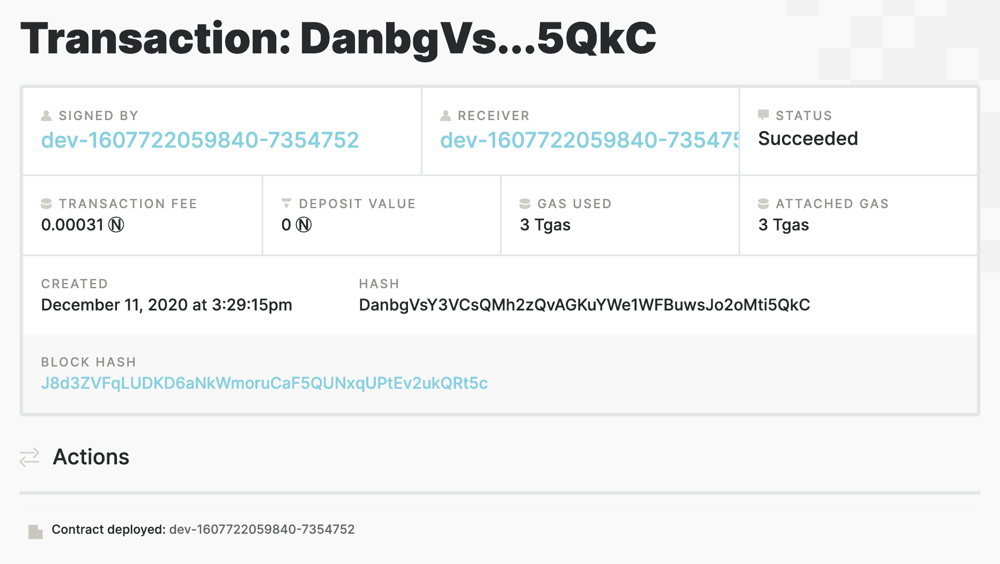

# near/write-nft-contracts-in-rust

> 原文：<https://github.com/figment-networks/learn-tutorials/blob/master/near/write-nft-contracts-in-rust.md>

[不可替代代币](https://en.wikipedia.org/wiki/Non-fungible_token)是区块链上所有权的唯一记录。通常 NFT 与一些有趣和稀有的东西联系在一起，比如一件艺术品、一张音乐会门票、一只可收藏的猫、一个域名或一个真实的实物。NFT 可以买卖，赠送，甚至可以铸造或销毁，这取决于合同的规则。 [Cryptokitties](https://www.cryptokitties.co/) 和 [SuperRare](https://superrare.co/) 是两个基于以太坊的 NFT 的流行例子。我们可以在 NEAR 上同样容易地实现 NFTs。

在本教程中，我们将发布 NFT 的一个新物种:隐花藻(CryptoFlarn)，一种具有独特 DNA 的单细胞生物。我们的智能合同将允许在区块链附近创建、收集和交易弗兰恩。

## 关于 NFT 标准

NFTs 有很多标准！然而到目前为止最广泛支持的是 ERC721 标准，它定义了如何创建和传输 NFT。这个标准运行良好，但是像所有的 ERC 标准一样，它只是为以太坊区块链定义的。一旦 EVM 附近的[仿真可用，ERC721 可能会被移植到 NEAR，但目前，NEAR 团队已经创建了一个使用不同 NFT 标准的 NFT 参考实现:](https://near.org/blog/running-ethereum-applications-on-near/) [NEP-4](https://github.com/nearprotocol/NEPs/pull/4) ，它是以与语言无关的方式定义的，与 NEAR 更兼容。

NEP-4 是一个非常简单的标准，它提供了支持 NFTs 所有权和转让所需的最低要求，但它包括将权限委托给其他用户或其他智能合同的可能性。这是一个强大的功能，因为这意味着未来的增强可能会通过与另一个更智能的契约的交叉契约调用来添加，而不是必须升级我们今天编写的契约。NEAR 上的其他 NFT 项目已经开始支持 NEP-4，所以这是一个很好的短期选择。

## 关于铁锈

在 NEAR Pathway 中，智能合同是用 AssemblyScript 编写的，然后编译成 WebAssembly (WASM)在区块链运行。然而，接近智能的合同也可以用 Rust T1 编写，这是一种类似 C 语言的服务器应用程序，因其内置的安全检查功能而广受欢迎，有助于避免错误。Rust 还具有强大的测试基础设施、丰富的在线文档和编译器，编译器会尽力帮助您修复它发现的任何错误。

NEAR 团队建议对任何金融性质的智能合约使用 Rust，他们的 NEP-4 NFT 的参考实现是用 Rust 编写的。因此，我们将从参考实现开始，并添加一些有用的功能。

# 先决条件

如果你已经完成了近路径，你应该已经照顾到这些先决条件。对于本教程，您必须:

*   安装 Node.js 和 npm，并设置您的 DataHub 环境
*   在 NEAR Testnet 上创建一个帐户
*   安装 NEAR CLI

# 安装工具链

在我们开始处理 Rust 合同之前，我们需要再安装一些工具。

[rustup.rs](https://rustup.rs/) 为 Unix 和 Windows 平台提供 Rust 安装程序。如果您使用的是 Unix，运行以下命令来安装 Rust 元安装程序`rustup`:

```js
curl --proto '=https' --tlsv1.2 -sSf https://sh.rustup.rs | sh 
```

这也将下载并安装 Rust 编译器`rustc`和 Rust 包管理器`cargo`。安装程序还会将`$HOME/.cargo/bin`添加到您的`PATH`环境变量中。

(如果你使用的是 Windows，从 [rustup.rs](https://rustup.rs/) 下载并运行可执行的 Rust 安装程序。本教程的其余部分是为 Unix 环境编写的，但是在 Windows 下，步骤基本上是相同的。)

接下来，我们需要告诉 Rust 为附近的虚拟机编译 WebAssembly 输出(WASM)。如果您的`rust`工具链缺少 WASM 组件，编译器将会报告一个类似如下的错误:

```js
error[E0463]: can't find crate for `core`
  |
  = note: the `wasm32-unknown-unknown` target may not be installed 
```

运行此命令，将 WASM 目标添加到 Rust 工具链:

```js
rustup target add wasm32-unknown-unknown 
```

## 故事

如果你还没有，我们需要安装`yarn`包管理器。我们正在使用的示例代码使用`yarn`作为它的构建工具。运行该命令安装`yarn`:

```js
npm i -g yarn 
```

如果这些都有效，您就可以在 Rust 中开发智能合约了。

## 克隆近 NFT 回购协议

在本教程中，我们将从 Github 上的 NEAR 库修改 NEAR 的 NFT 示例代码。在 Unix 上，在`bash` shell 中运行这些命令来克隆该存储库并安装其需求:

```js
git clone https://github.com/near-examples/NFT
cd NFT
yarn install 
```

该报告包含 AssemblyScript 和 Rust 中的 NFT 示例，以及支持文件和文档。智能合同所需的所有文件都在子目录`contracts/rust`中

## 在货物中添加防锈包装

Rust 包括一个广泛的支持库生态系统(称为 [Crates](https://crates.io/) )，以及一个名为 Cargo 的包管理器来帮助你使用它们。为了创建我们的 NFT Flarns，我们将在这个回购的货物清单中添加几个板条箱。

编辑文件`contracts/rust/Cargo.toml`，并用以下内容替换全部内容:

```js
[package]
name = "nep4-rs"
version = "0.1.0"
authors = ["NEAR Inc <hello@near.org>"]
edition = "2018"

[lib]
crate-type = ["cdylib", "rlib"]

[dependencies]
serde = { version = "1.0", features = ["derive"] }
serde_json = "1.0.60"
near-sdk = "2.0.0"
borsh = "0.7.1"
wee_alloc = "0.4.5"
rand = "=0.7.3"
rand_chacha = "=0.2.2"
rand_seeder = "=0.2.1"

[profile.release]
codegen-units = 1

opt-level = "z"
lto = true
debug = false
panic = "abort"
overflow-checks = true
```

> `opt-level = "z"`告诉`rustc`针对小代码进行优化。
> 
> `overflow-checks = true`根据[https://stackoverflow.com/a/64136471/249801](https://stackoverflow.com/a/64136471/249801)选择对算术运算进行额外的安全检查

我们只对原始文件做了一处修改:在`[dependencies]`部分，我们添加了`rand`、`rand_chacha`和`rand_seeder`板条箱。它们将一起提供一个随机数生成器，我们将使用它来生成我们的 Flarns 的独特 DNA。

## 测试编译器

每次 rust 编译器运行时，它都会检查`Cargo.toml`最近的变化。如果找到了，Cargo 会自动下载这些板条箱，建造它们，并保存起来以备将来使用。

现在让我们手动运行`cargo`,以确保我们没有在清单中犯任何错误。在命令行中键入以下内容:

```js
cargo verify-project --manifest-path contracts/rust/Cargo.toml 
```

如果文件中没有错误，您应该会看到 JSON 格式的结果:

```js
{"success":"true"}
```

Cargo 是 Rust 的强大而重要的伙伴，`cargo`命令有许多选项。但是这个回购协议带有预先设定的构建目标，允许我们使用`yarn`作为构建工具，而`yarn`将在幕后使用`cargo`。所以这是我们最后一次直接运行`cargo`。相反，在我们修改之前，让我们使用`yarn`来确保这个回购中的合同正在工作。要构建该示例，请在 shell 中输入以下命令:

```js
yarn build:rs 
```

因为这是我们的第一次构建，Cargo 和 Rust 将下载并构建所有的依赖项。可能需要一些时间。完成后，您应该会在输出的末尾看到类似这样的内容:

```js
/Users/alice/NFT/contracts/rust
   Compiling nep4-rs v0.1.0 (/Users/alice/NFT/contracts/rust)
    Finished release [optimized] target(s) in 6.10s
✨  Done in 6.42s. 
```

我们也可以用这个命令运行所有包含的单元测试:

```js
yarn test:unit:rs 
```

单元测试的输出是杂乱的，但是在最后你应该会看到结果的总结。

```js
test result: ok. 10 passed; 0 failed; 0 ignored; 0 measured; 0 filtered out 
```

如果你看到`test result: ok`，一切都好。

# 了解一份生锈的合同

我们将修改的 Rust smart 合同位于`contracts/rust/src/lib.rs`。在编辑器中打开该文件。我们将访问所有部分，并做一些重要的补充。

## 序文

第一部分是一些样板文件，导入有用的特性并配置 Rust 编译器。

```js
#![deny(warnings)]

use borsh::{BorshDeserialize, BorshSerialize};
use near_sdk::collections::UnorderedMap;
use near_sdk::collections::UnorderedSet;
use near_sdk::{env, near_bindgen, AccountId};

#[global_allocator]
static ALLOC: wee_alloc::WeeAlloc = wee_alloc::WeeAlloc::INIT;
```

## NEP-4 接口

接下来是一个标记为`pub trait NEP4`的块。这定义了我们能够用来与智能合约交互的 API。Rust 中的一个特性类似于 Java 或 C++中的一个接口:它定义了一个 API，但并不实现它。这里的 API 是 NEP-4 标准中定义的用于 NFTs 的 API。这 6 个 API 方法允许客户端

*   查找令牌的所有者，
*   在所有者之间转移代币，
*   向其他用户分配或撤销令牌转移权限

```js
/// This trait provides the baseline of functions as described at:
/// https://github.com/nearprotocol/NEPs/blob/nep-4/specs/Standards/Tokens/NonFungibleToken.md
pub trait NEP4 {
    // Grant the access to the given `accountId` for the given `tokenId`.
    // Requirements:
    // * The caller of the function (`predecessor_id`) should have access to the token.
    fn grant_access(&mut self, escrow_account_id: AccountId);

    // Revoke the access to the given `accountId` for the given `tokenId`.
    // Requirements:
    // * The caller of the function (`predecessor_id`) should have access to the token.
    fn revoke_access(&mut self, escrow_account_id: AccountId);

    // Transfer the given `tokenId` to the given `accountId`. Account `accountId` becomes the new owner.
    // Requirements:
    // * The caller of the function (`predecessor_id`) should have access to the token.
    fn transfer_from(&mut self, owner_id: AccountId, new_owner_id: AccountId, token_id: TokenId);

    // Transfer the given `tokenId` to the given `accountId`. Account `accountId` becomes the new owner.
    // Requirements:
    // * The caller of the function (`predecessor_id`) should be the owner of the token. Callers who have
    // escrow access should use transfer_from.
    fn transfer(&mut self, new_owner_id: AccountId, token_id: TokenId);

    // Returns `true` or `false` based on caller of the function (`predecessor_id) having access to the token
    fn check_access(&self, account_id: AccountId) -> bool;

    // Get an individual owner by given `tokenId`.
    fn get_token_owner(&self, token_id: TokenId) -> String;
}

/// The token ID type is also defined in the NEP
pub type TokenId = u64;
pub type AccountIdHash = Vec<u8>;
```

## 区块链存储

在`trait`定义之后是契约主数据结构的声明，`NonFungibleTokenBasic`。NEP-4 特性中的每一种方法都将在该结构中实现。它使用两个`UnorderedMap`来管理我们的 NFT 的所有权:`token_to_account`记住每个令牌的所有者，`account_gives_access`记住谁被谁授予了传输访问权。
`near_sdk::collections::UnorderedMap`是 NEAR SDK 的一个定制 hashmap 实现，在链上运行比 Rust 提供的标准 hashmap 更便宜、更高效，但其他方面是相同的。类似的结构，但是更简单:它只是一组键，不允许重复。

```js
// Begin implementation
#[near_bindgen]
#[derive(BorshDeserialize, BorshSerialize)]
pub struct NonFungibleTokenBasic {
    pub token_to_account: UnorderedMap<TokenId, AccountId>,
    pub account_gives_access: UnorderedMap<AccountIdHash, UnorderedSet<AccountIdHash>>, // Vec<u8> is sha256 of account, makes it safer and is how fungible token also works
    pub owner_id: AccountId,
}
```

## 自定义元数据

从技术上讲，这就是我们的合同管理一组不可替换的令牌 id 的所有权所需的一切。但是到目前为止，这些令牌 id 除了它们自己之外，什么都不指。他们没有元数据！

每种类型的 NFT 都需要定义一些元数据，以描述被跟踪的单个有趣的事物:CryptoKitty 的名称、艺术品的标题和作者、虚拟售票事件的日期，或者 NFT 代表的任何其他东西。事实上，大多数 NFT 主要是元数据，元数据在大多数情况下主要是指图像、视频或 gif，它们存储在链外，比如云存储服务(如 AWS S3)或最好是分散的文件存储服务(如 IPFS、Sia)。也就是说，让我们继续改进这个契约，以存储每个唯一 Flarn 的元数据。

在注释`// Begin implementation`的正下方添加以下几行 Rust 代码:

```js
// Begin implementation
use near_sdk::serde::Serialize;
#[derive(Serialize, BorshDeserialize, BorshSerialize)]
pub struct Flarn {
    pub dna: u64,
}
```

这个`Flarn`结构为每个 CryptoFlarn 定义了一个最小的元数据:可以用一个唯一的随机值初始化的单个`dna`记录。这是一个非常简单的例子，但考虑到我们在个体 CryptoKitties 之间看到的所有变化都来自于一个类似的随机数据块，也称为`dna`！

(`#[derive]`属性为我们的 Flarn 提供了`BorschSerialize`特征，它让契约将 Flarn 转换为原始字节流，以便在 NEAR 上存储和检索。注意，我们不需要在那里实现任何东西，我们只需要让编译器为我们计算出来。[衍生特征](https://doc.rust-lang.org/rust-by-example/trait/derive.html)是铁锈的一个便利特征！我们还使用了一个相关的特征，`Serialize`，它允许契约通过网络发送 Flarns。)

接下来，我们将更新`NonFungibleTokenBasic`的定义，增加一行 Rust。我们将添加一个名为`token_to_flarn`的`UnorderedMap`，它将保存我们的智能合约中的所有 Flarn 记录。

```js
#[near_bindgen]
#[derive(BorshDeserialize, BorshSerialize)]
pub struct NonFungibleTokenBasic {
    pub token_to_account: UnorderedMap<TokenId, AccountId>,
    pub account_gives_access: UnorderedMap<AccountIdHash, UnorderedSet<AccountIdHash>>, // Vec<u8> is sha256 of account, makes it safer and is how fungible token also works
    pub owner_id: AccountId,
    pub token_to_flarn: UnorderedMap<TokenId, Flarn>,  // <-- ADD THIS LINE
}
```

最后，在`NonFungibleTokenBasic`的初始化器中添加一行 Rust，这样当智能契约被部署到区块链时，我们的 flarns 将被初始化:

```js
#[near_bindgen]
impl NonFungibleTokenBasic {
    #[init]
    pub fn new(owner_id: AccountId) -> Self {
        assert!(env::is_valid_account_id(owner_id.as_bytes()), "Owner's account ID is invalid.");
        assert!(!env::state_exists(), "Already initialized");
        Self {
            token_to_account: UnorderedMap::new(b"token-belongs-to".to_vec()),
            account_gives_access: UnorderedMap::new(b"gives-access".to_vec()),
            owner_id,
            token_to_flarn: UnorderedMap::new(b"gives-flarn".to_vec()),  // <-- ADD THIS LINE 
        }
    }
}
```

## 浏览其余部分

在`NonFungibleTokenBasic`的初始化器之后，是组成 NEP4 特征的六个 API 方法的实现。这是一大块代码。如果你是 Rust 新手，这一切都没有意义，但是它的某些部分可能与你所知道的其他编程语言相似。

幸运的是，我们不需要在这一部分做任何修改。如果你浏览它，你可能会注意到:

*   `impl`块中的方法通过一个名为`self`的参数访问它们的私有实例`NonFungibleTokenBasic`，类似于 Javascript 中的`this`。
*   Rust 有一个不寻常的`Some` / `None`构造来处理异常。
*   可变变量用关键字`mut`声明；没有`mut`的变量默认是不可变的。
*   每个方法末尾只有一两行真正修改了我们的数据。这段代码的大部分处理访问控制。
*   导入的全局变量`env`包含调用契约的附近用户的 ID，以及其他各种有用的信息。

```js
#[near_bindgen]
impl NEP4 for NonFungibleTokenBasic {
    fn grant_access(&mut self, escrow_account_id: AccountId) {
        let escrow_hash = env::sha256(escrow_account_id.as_bytes());
        let predecessor = env::predecessor_account_id();
        let predecessor_hash = env::sha256(predecessor.as_bytes());

        let mut access_set = match self.account_gives_access.get(&predecessor_hash) {
            Some(existing_set) => {
                existing_set
            },
            None => {
                UnorderedSet::new(b"new-access-set".to_vec())
            }
        };
        access_set.insert(&escrow_hash);
        self.account_gives_access.insert(&predecessor_hash, &access_set);
    }

    fn revoke_access(&mut self, escrow_account_id: AccountId) {
        let predecessor = env::predecessor_account_id();
        let predecessor_hash = env::sha256(predecessor.as_bytes());
        let mut existing_set = match self.account_gives_access.get(&predecessor_hash) {
            Some(existing_set) => existing_set,
            None => env::panic(b"Access does not exist.")
        };
        let escrow_hash = env::sha256(escrow_account_id.as_bytes());
        if existing_set.contains(&escrow_hash) {
            existing_set.remove(&escrow_hash);
            self.account_gives_access.insert(&predecessor_hash, &existing_set);
            env::log(b"Successfully removed access.")
        } else {
            env::panic(b"Did not find access for escrow ID.")
        }
    }

    fn transfer(&mut self, new_owner_id: AccountId, token_id: TokenId) {
        let token_owner_account_id = self.get_token_owner(token_id);
        let predecessor = env::predecessor_account_id();
        if predecessor != token_owner_account_id {
            env::panic(b"Attempt to call transfer on tokens belonging to another account.")
        }
        self.token_to_account.insert(&token_id, &new_owner_id);
    }

    fn transfer_from(&mut self, owner_id: AccountId, new_owner_id: AccountId, token_id: TokenId) {
        let token_owner_account_id = self.get_token_owner(token_id);
        if owner_id != token_owner_account_id {
            env::panic(b"Attempt to transfer a token from a different owner.")
        }

        if !self.check_access(token_owner_account_id) {
            env::panic(b"Attempt to transfer a token with no access.")
        }
        self.token_to_account.insert(&token_id, &new_owner_id);
    }

    fn check_access(&self, account_id: AccountId) -> bool {
        let account_hash = env::sha256(account_id.as_bytes());
        let predecessor = env::predecessor_account_id();
        if predecessor == account_id {
            return true;
        }
        match self.account_gives_access.get(&account_hash) {
            Some(access) => {
                let predecessor = env::predecessor_account_id();
                let predecessor_hash = env::sha256(predecessor.as_bytes());
                access.contains(&predecessor_hash)
            },
            None => false
        }
    }

    fn get_token_owner(&self, token_id: TokenId) -> String {
        match self.token_to_account.get(&token_id) {
            Some(owner_id) => owner_id,
            None => env::panic(b"No owner of the token ID specified")
        }
    }
}
```

## 使 NFT 可铸造

在这些 NEP4 方法之后，还有一些方法被添加到`NonFungibleTokenBasic`中，它们不是 NEP4 标准的一部分。例如，因为 NEP4 没有说明如何创建 NFT，所以这个例子包含了一个可以按需创建 NFT 的`mint_token()`方法。`mint_token()`有两个参数:令牌 ID 和所有者 ID。

让我们修改`mint_token()`来铸造我们的火焰。我们将导入之前添加到清单中的随机数生成器，并使用它用随机的 64 位值初始化每个新 flarn 的 DNA。

用以下代码替换`/// Methods not in the strict scope of the NFT spec`下面的整个块:

```js
/// Methods not in the strict scope of the NFT spec (NEP4)
#[near_bindgen]
impl NonFungibleTokenBasic {
    /// Creates a token for owner_id, doesn't use autoincrement, fails if id is taken
    pub fn mint_token(&mut self, owner_id: String, token_id: TokenId) {
        // make sure that only the owner can call this funtion
        self.only_owner();
        // Since Map doesn't have `contains` we use match
        let token_check = self.token_to_account.get(&token_id);
        if token_check.is_some() {
            env::panic(b"Token ID already exists.")
        }
        // No token with that ID exists, mint and add token to data structures
        self.token_to_account.insert(&token_id, &owner_id);

        // Generate random Flarn DNA:
        use rand::prelude::*;
        use rand_chacha::ChaCha8Rng;
        use rand_seeder::{Seeder};
        let mut rng: ChaCha8Rng = Seeder::from(env::random_seed()).make_rng();
        let new_flarn = Flarn {dna: rng.gen()};
        self.token_to_flarn.insert(&token_id, &new_flarn);
    }

    /// helper function determining contract ownership
    fn only_owner(&mut self) {
        assert_eq!(env::predecessor_account_id(), self.owner_id, "Only contract owner can call this method.");
    }

    /// Added method: get the metadata for a token
    pub fn get_token_meta(&self, token_id: TokenId) -> Flarn {
        match self.token_to_flarn.get(&token_id) {
            Some(flarn) => flarn,
            None => env::panic(b"Missing metadata.")
        }
    }
}
```

我们改变了两件事:

*   我们在`mint_token()`中添加了代码来创建一个新的 Flarn 元数据记录，用随机数据填充它的 dna，并将其保存到我们的元数据散列中
*   我们添加了一个新的契约方法`token_to_meta()`,当我们传递令牌的 ID 时，它会返回令牌的元数据

智能合约到此结束。该文件中的其余代码是单元测试。

## 添加测试

在 Rust 中，单元测试通常与被测试的代码存在于同一个文件中，包装在一个`mod tests`块中，并用`#[test]`属性修饰，这些属性向编译器显示在哪里可以找到每个测试。为我们添加的每个新特性编写至少一个测试是一个好的实践。让我们为新的`token_to_meta()`方法添加一个测试。

滚动到`lib.rs`的底部。文件的最后一行只有一个右括号。用以下代码块(包括最后一个括号)替换整行代码(包括最后一个括号):

```js
    #[test]
    fn token_to_meta() {
        // Make an instance of the contract, and set up a test context
        let context = get_context(robert(), 0);
        testing_env!(context);
        let mut contract = NonFungibleTokenBasic::new(robert());
        // Mint a token
        contract.mint_token(mike(), 19u64);
        // Get the token's metadata
        let metadata = contract.get_token_meta(19u64);
        // check that the DNA contains a value:
        assert!(metadata.dna != 0, "DNA not set.");
    }
}
```

## 检查我们的工作

现在我们已经添加了一些代码，让我们再次尝试构建和测试，看看我们是否破坏了什么。像以前一样，键入以下命令来构建项目:

```js
yarn build:rs 
```

如果你犯了什么错误，编译器会给你一个详细的解释。既然你已经复制并粘贴了本教程中的所有内容，那么很可能只是打字错误。但是如果你不能在编译器的帮助下修复它，用 [this version](https://github.com/figment-networks/tutorials/tree/main/near/6_NFT/contracts/rust/src/lib.rs) 替换整个 lib.rs 文件，它包含了我们到目前为止所做的所有更改。

一旦构建正确，尝试运行单元测试:

```js
yarn test:unit:rs 
```

您将看到现在有 11 个单元测试正在运行，它们应该都通过了。

(在运行单元测试之后，Yarn 将尝试运行文档测试——但是这里没有。这就是为什么你会看到一些关于`running 0 tests`的输出。你可以忽略这部分。)

```js
(output) 
```

# 部署和使用合同

我们可以使用 NEAR CLI 来部署这个契约，并测试它的工作情况。如果您在教程 1 和 2 中配置了您的环境，CLI 将连接到 DataHub 的高可用性 testnet。如果您没有 DataHub 访问权限，您仍然可以使用其默认值运行 CLI，尽管默认的 testnet 节点可能会响应较慢。运行此命令以部署您刚刚构建的契约:

```js
near dev-deploy out/nep4_rs.wasm 
```

输出将显示部署事务的详细信息，以及 CLI 自动为您生成的 test NEAR 帐户的 ID。它应该是这样的:

```js
Starting deployment. Account id: dev-1607722059840-7354752, node: https://near-testnet--rpc.datahub.figment.io/apikey/xxxxxxxxxxxxxxxxxxxxxxxxxxxxxxxx, helper: https://helper.testnet.near.org, file: out/nep4_rs.wasm
Transaction Id DanbgVsY3VCsQMh2zQvAGKuYWe1WFBuwsJo2oMti5QkC
To see the transaction in the transaction explorer, please open this url in your browser
https://explorer.testnet.near.org/transactions/DanbgVsY3VCsQMh2zQvAGKuYWe1WFBuwsJo2oMti5QkC
Done deploying to dev-1607722059840-7354752 
```

所提供的链接将在附近的浏览器中为您提供关于部署的完整详细信息。



在此步骤中，CLI 在 testnet 上创建了一个新的用户帐户，并在该帐户中部署了合同。记下这个新的帐户 ID，它看起来有点像`dev-nnnnnnnnn-nnnnn`，其中的`n`由数字代替。

## 初始化合同

我们的 NFT 智能合同现已在 NEAR 上部署！让我们使用 CLI 来测试这个接口。

## 合同争论

首先，我们需要调用合同的`new()`方法来初始化区块链数据存储。如果我们在此之前调用任何其他方法，我们将得到一个错误。“new”方法采用一个参数`owner_id`，即允许从该契约中创建新 Flarns 的用户的 accountID。

## CLI 参数

要从 CLI 调用`new()`方法，运行这个命令，用您在上一步中获得测试帐户 ID 替换`CALLER-ID`、`RECEIVER-ID`和`OWNER-ID`。(这里，`CALLER-ID`是 CLI 将用来进行调用的帐户，`RECEIVER-ID`是部署合同的帐户，`OWNER-ID`是合同将授权给 mint Flarns 的帐户。在这个测试中，我们将在所有三个角色中使用同一个帐户。)

```js
near call --accountId CALLER-ID RECEIVER-ID new '{"owner_id": "OWNER-ID"}' 
```

输出应该返回一个事务 ID 和一个到附近浏览器的链接:

```js
Scheduling a call: dev-1607722059840-7354752.new({"owner_id": "dev-1607722059840-7354752"})
Transaction Id 9PZZFWJUco7f33vJEjTbcjzsGhiigtYiSSyNh5FmJdNb
To see the transaction in the transaction explorer, please open this url in your browser
https://explorer.testnet.near.org/transactions/9PZZFWJUco7f33vJEjTbcjzsGhiigtYiSSyNh5FmJdNb 
```

# 就像 NFT！

现在我们给`mint_token()`打个电话。我们需要一个 JSON 块，包含该方法的两个参数:令牌的 ID，可以是任意整数，以及令牌第一个所有者的帐户 ID。我们将使用与之前相同的测试帐户 ID，并将`1234`作为令牌 ID。

在命令行中运行这个命令，再次替换`CALLER-ID`和`RECEIVER-ID`:

```js
near call --accountId CALLER-ID RECEIVER-ID mint_token '{ "token_id":1234, "owner_id": "CALLER-ID"}' 
```

输出看起来非常类似于`new()`方法的输出。这两种方法都不返回任何数据。但是新的事务 ID 和浏览器链接应该向我们确认令牌是伪造的。

尽管如此，我们可以更加确定。让我们获取新生成的令牌的元数据并查看一下。运行该命令，再次替换`ACCOUNT-ID`和`CONTRACT-ID`:

```js
near view --accountId ACCOUNT-ID CONTRACT-ID get_token_meta '{"token_id":1234}' 
```

输出是相似的，但是最后一行包含 JSON 中的返回值:

```js
{ dna: 9932525801968679000 } 
```

你看到的实际数字会和这个不一样，如果随机数生成器善于生成随机数的话。但这是我们的 NFT 元数据，存储在区块链附近。

# 结论

你现在已经在 NEAR testnet 上部署了一个 NFT 智能合约，并且铸造了一个 NFT。从这里开始，您可以使用 CLI 或类似的 Javascript SDK 来转移该令牌的所有权，或者制作更多令牌。NFT 市场已经在开发中；当他们支持 NEP-4 时，你可以在那里交易这些代币。如果您的下一个 NFT 项目需要更复杂的元数据，您已经看到了如何添加。

本教程的完整代码可以在 Github 上找到。

# 关于作者

这个教程是由 [Mykle Hansen](https://github.com/myklemykle) 创建的，他是 [Plantary](https://github.com/myklemykle/plantary) 项目的贡献者，该项目允许用户在附近种植和收获植物 NFT。