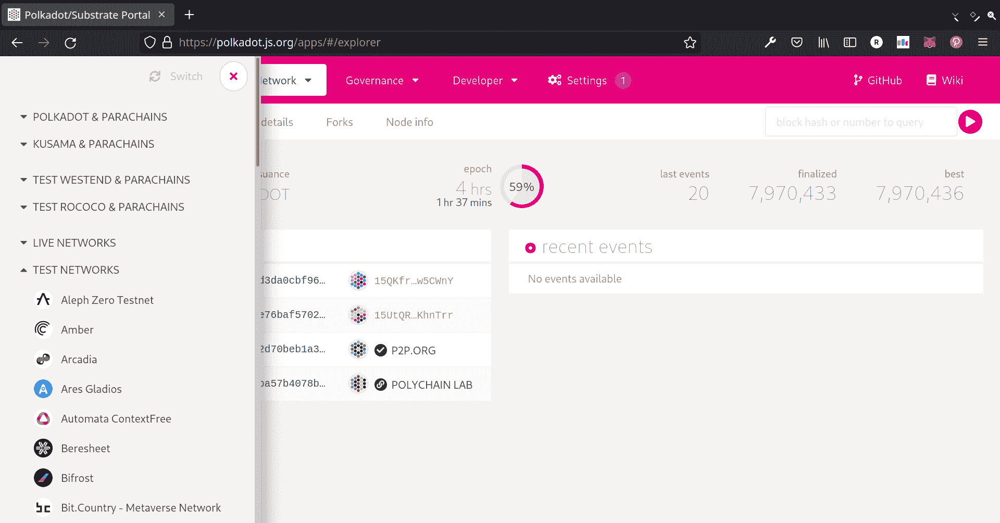
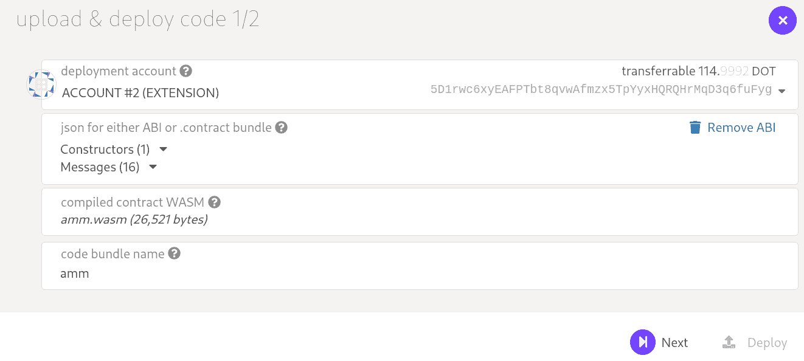
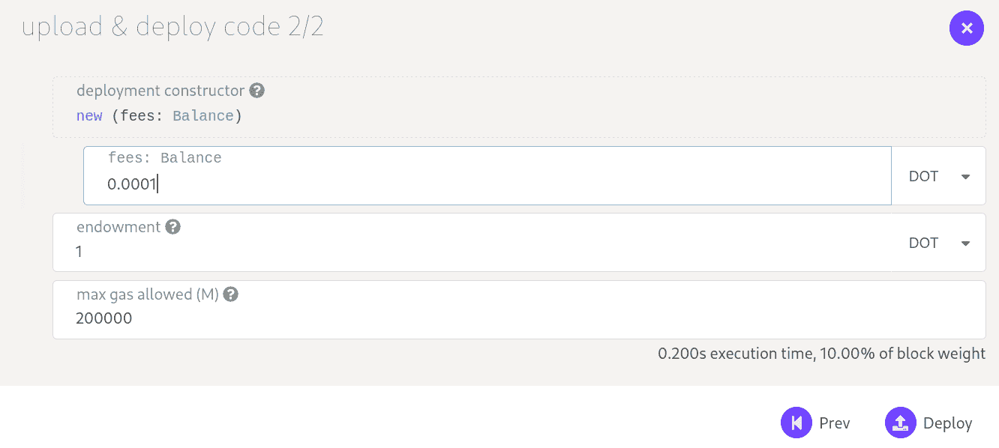
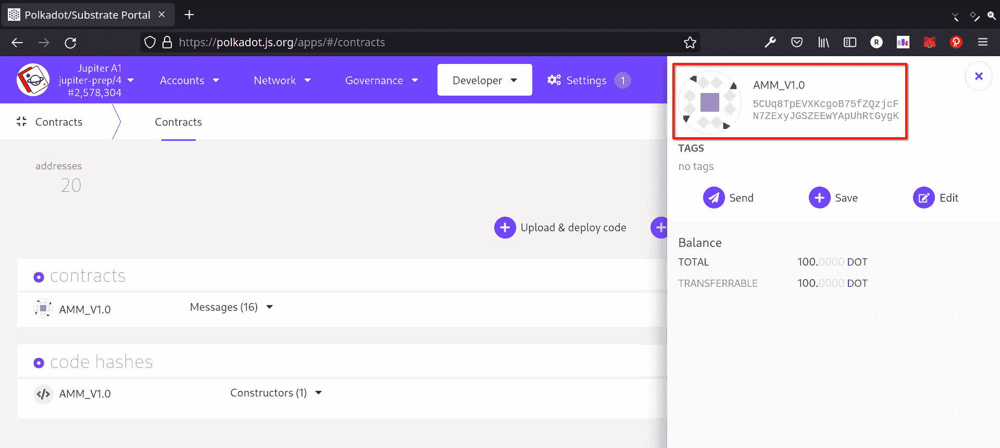
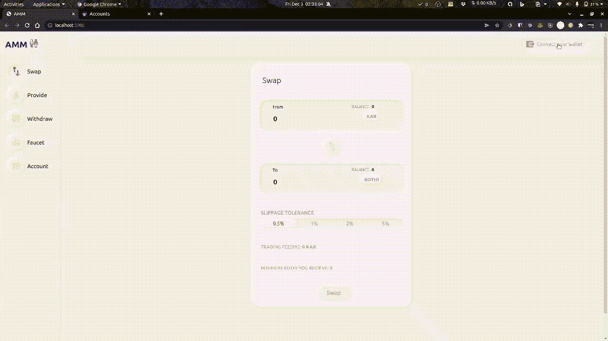
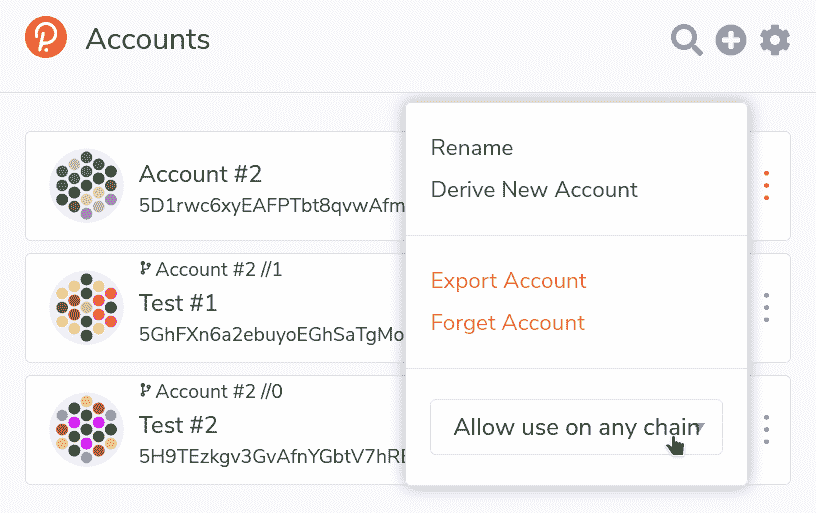

# 介绍

> 原文:[https://github . com/fig ment-networks/learn-tutorials/blob/master/polkadot/create-an-AMM-on-polkadot-using-ink . MD](https://github.com/figment-networks/learn-tutorials/blob/master/polkadot/create-an-amm-on-polkadot-using-ink.md)

在本教程中，我们将学习如何建立一个 AMM，提供交易费用和滑点容忍度的功能。我们将用墨水创建智能合同！，一种基于 Rust 的嵌入式领域特定语言(eDSL ),然后看看如何在公共 testnet 上部署它。最后，我们将在 ReactJS 中创建智能合约的前端。

# 先决条件

*   你应该熟悉铁锈和反应堆
*   如果你已经完成了[墨迹，跟随这个教程会容易得多！初学者指南](https://docs.substrate.io/tutorials/v3/ink-workshop/pt1/)

# 要求

*   [Node.js](https://nodejs.org/en/download/releases/) v10.18.0+
*   [波尔卡多。浏览器上的 js}扩展名](https://polkadot.js.org/extension/)
*   [墨迹！v3 设置](https://paritytech.github.io/ink-docs/getting-started/setup)

# 什么是 AMM？

自动做市商(AMM)是一种分散式交易所，它基于一个数学公式对资产进行定价。它允许数字资产在没有任何许可的情况下自动交易，通过使用流动性池而不是任何传统的买方和卖方，后者使用传统交易所中使用的订单簿，在这里资产根据定价算法定价。

例如，Uniswap 使用 p * q = k，其中 p 是流动性池中一个令牌的数量，q 是另一个令牌的数量。这里的“k”是一个固定常数，这意味着资金池的总流动性必须保持不变。为了进一步解释，让我们举一个例子，如果 AMM 有硬币 A 和硬币 B，两种不稳定的资产，每次 A 被购买，A 的价格上升，因为池中的 A 比购买前少。相反，当池中有更多的 B 时，B 的价格下降。该池保持恒定平衡，其中池中 A 的总价值将总是等于池中 B 的总价值。只有当新的流动性提供者加入资金池时，规模才会扩大。

# 实施智能合同

移动到您想要创建墨迹的目录！项目，并在终端运行以下命令，这将创建一个模板墨水！给你的项目。

```
cargo contract new amm 
```

移动到`amm`文件夹中，用下面的代码替换`lib.rs`文件的内容。我们将实现分为 10 个部分。

```
#![cfg_attr(not(feature = "std"), no_std)]
#![allow(non_snake_case)]

use ink_lang as ink;
const PRECISION: u128 = 1_000_000; // Precision of 6 digits

#[ink::contract]
mod amm {
    use ink_storage::collections::HashMap;

    // Part 1\. Define Error enum 

    // Part 2\. Define storage struct 

    // Part 3\. Helper functions 

    impl Amm {
        // Part 4\. Constructor

        // Part 5\. Faucet

        // Part 6\. Read current state

        // Part 7\. Provide

        // Part 8\. Withdraw

        // Part 9\. Swap
    }

    // Part 10\. Unit Testing
}
```

## 第一部分。定义错误枚举

枚举将包含我们的契约抛出的所有错误值。墨水！要求返回值具有某些特征。所以我们用`#[derive(...)]`属性为我们的自定义枚举类型派生它们。

```
#[derive(Debug, PartialEq, Eq, scale::Encode, scale::Decode)]
#[cfg_attr(feature = "std", derive(scale_info::TypeInfo))]
pub enum Error {
    /// Zero Liquidity
    ZeroLiquidity,
    /// Amount cannot be zero!
    ZeroAmount,
    /// Insufficient amount
    InsufficientAmount,
    /// Equivalent value of tokens not provided
    NonEquivalentValue,
    /// Asset value less than threshold for contribution!
    ThresholdNotReached,
    /// Share should be less than totalShare
    InvalidShare,
    /// Insufficient pool balance
    InsufficientLiquidity,
    /// Slippage tolerance exceeded
    SlippageExceeded,
}
```

## 第二部分。定义存储结构

接下来，我们定义操作 AMM 所需的状态变量。我们将使用 Uniswap 使用的相同数学公式来确定资产价格(K = totalToken1 * totalToken2)。为了简单起见，我们维护自己的内部平衡映射(token1Balance & token2Balance ),而不是处理外部令牌。Rust 中的`HashMap`的工作方式类似于 Solidity 语言中的映射，存储一个键值对。还要记住，在 Rust 中，数据必须有一个关联的类型——这就是为什么您会看到与股份数量相关联的类型`Balance`。

```
#[derive(Default)]
#[ink(storage)]
pub struct Amm {
    totalShares: Balance, // Stores the total amount of share issued for the pool
    totalToken1: Balance, // Stores the amount of Token1 locked in the pool
    totalToken2: Balance, // Stores the amount of Token2 locked in the pool
    shares: HashMap<AccountId, Balance>, // Stores the share holding of each provider
    token1Balance: HashMap<AccountId, Balance>, // Stores the token1 balance of each user
    token2Balance: HashMap<AccountId, Balance>, // Stores the token2 balance of each user
    fees: Balance,        // Percent of trading fees charged on trade
}
```

## 第三部分。助手功能

我们将在单独的实现块中定义私有函数，以保持代码结构的整洁，并且我们需要添加`#[ink(impl)]`属性来制作 ink！意识到了。以下函数将用于检查传递给函数的参数的有效性，并在池为空时限制某些活动。

```
#[ink(impl)]
impl Amm {
    // Ensures that the _qty is non-zero and the user has enough balance
    fn validAmountCheck(
        &self,
        _balance: &HashMap<AccountId, Balance>,
        _qty: Balance,
    ) -> Result<(), Error> {
        let caller = self.env().caller();
        let my_balance = *_balance.get(&caller).unwrap_or(&0);

        match _qty {
            0 => Err(Error::ZeroAmount),
            _ if _qty > my_balance => Err(Error::InsufficientAmount),
            _ => Ok(()),
        }
    }

    // Returns the liquidity constant of the pool
    fn getK(&self) -> Balance {
        self.totalToken1 * self.totalToken2
    }

    // Used to restrict withdraw & swap feature till liquidity is added to the pool
    fn activePool(&self) -> Result<(), Error> {
        match self.getK() {
            0 => Err(Error::ZeroLiquidity),
            _ => Ok(()),
        }
    }
}
```

## 第四部分。构造器

我们的构造函数将`_fees`作为一个参数，它决定了用户在执行交换操作时要支付的费用百分比。`_fees`的值应该在 0 到 1000 之间(不含 0 和 1000 ),这样任何交换操作都将收取存款金额的**费用/1000** 百分比。

```
/// Constructs a new AMM instance
/// @param _fees: valid interval -> [0,1000)
#[ink(constructor)]
pub fn new(_fees: Balance) -> Self {
    // Sets fees to zero if not in valid range
    Self {
        fees: if _fees >= 1000 { 0 } else { _fees },
        ..Default::default()
    }
}
```

## 第五部分。水龙头

出于本教程的目的，我们不使用任何外部令牌，而是我们自己维护一个余额记录。我们需要一种方法来为新用户分配令牌，以便他们可以与 dApp 进行交互。用户可以调用这个水龙头函数来获得一些代币来玩！

```
/// Sends free token(s) to the invoker
#[ink(message)]
pub fn faucet(&mut self, _amountToken1: Balance, _amountToken2: Balance) {
    let caller = self.env().caller();
    let token1 = *self.token1Balance.get(&caller).unwrap_or(&0);
    let token2 = *self.token2Balance.get(&caller).unwrap_or(&0);

    self.token1Balance.insert(caller, token1 + _amountToken1);
    self.token2Balance.insert(caller, token2 + _amountToken2);
}
```

## 第六部分。读取当前状态

以下函数用于获取智能合约的当前状态。

```
/// Returns the balance of the user
#[ink(message)]
pub fn getMyHoldings(&self) -> (Balance, Balance, Balance) {
    let caller = self.env().caller();
    let token1 = *self.token1Balance.get(&caller).unwrap_or(&0);
    let token2 = *self.token2Balance.get(&caller).unwrap_or(&0);
    let myShares = *self.shares.get(&caller).unwrap_or(&0);
    (token1, token2, myShares)
}

/// Returns the amount of tokens locked in the pool,total shares issued & trading fee param
#[ink(message)]
pub fn getPoolDetails(&self) -> (Balance, Balance, Balance, Balance) {
    (
        self.totalToken1,
        self.totalToken2,
        self.totalShares,
        self.fees,
    )
}
```

## 第七部分。提供

`provide`函数有两个参数——令牌 1 的数量&—用户希望在池中锁定的令牌 2 的数量。如果资金池最初是空的，那么等价率被设置为**_ amounttoken 1:_ amounttoken 2**，并且用户被发行 100 股。否则，检查用户提供的两个数量是否具有相等的值。这是通过检查这两个金额是否与它们各自锁定在池中的令牌总数成相等的比例来完成的，即**_ amount token 1:total token 1::_ amount token 2:total token 2**应该持有。

```
/// Adding new liquidity in the pool
/// Returns the amount of share issued for locking given assets
#[ink(message)]
pub fn provide(
    &mut self,
    _amountToken1: Balance,
    _amountToken2: Balance,
) -> Result<Balance, Error> {
    self.validAmountCheck(&self.token1Balance, _amountToken1)?;
    self.validAmountCheck(&self.token2Balance, _amountToken2)?;

    let share;
    if self.totalShares == 0 {
        // Genesis liquidity is issued 100 Shares
        share = 100 * super::PRECISION;
    } else {
        let share1 = self.totalShares * _amountToken1 / self.totalToken1;
        let share2 = self.totalShares * _amountToken2 / self.totalToken2;

        if share1 != share2 {
            return Err(Error::NonEquivalentValue);
        }
        share = share1;
    }

    if share == 0 {
        return Err(Error::ThresholdNotReached);
    }

    let caller = self.env().caller();
    let token1 = *self.token1Balance.get(&caller).unwrap();
    let token2 = *self.token2Balance.get(&caller).unwrap();
    self.token1Balance.insert(caller, token1 - _amountToken1);
    self.token2Balance.insert(caller, token2 - _amountToken2);

    self.totalToken1 += _amountToken1;
    self.totalToken2 += _amountToken2;
    self.totalShares += share;
    self.shares
        .entry(caller)
        .and_modify(|val| *val += share)
        .or_insert(share);

    Ok(share)
}
```

这些估计函数帮助用户了解在给定的令牌数量下他们需要锁定的令牌数量。这里，我们再次使用比例**_ amount Token1:total token 1::_ amount Token2:total token 2**来确定如果我们希望锁定给定数量的 token 2 所需的 token 1 的数量，反之亦然。

```
/// Returns amount of Token1 required when providing liquidity with _amountToken2 quantity of Token2
#[ink(message)]
pub fn getEquivalentToken1Estimate(
    &self,
    _amountToken2: Balance,
) -> Result<Balance, Error> {
    self.activePool()?;
    Ok(self.totalToken1 * _amountToken2 / self.totalToken2)
}

/// Returns amount of Token2 required when providing liquidity with _amountToken1 quantity of Token1
#[ink(message)]
pub fn getEquivalentToken2Estimate(
    &self,
    _amountToken1: Balance,
) -> Result<Balance, Error> {
    self.activePool()?;
    Ok(self.totalToken2 * _amountToken1 / self.totalToken1)
}
```

## 第八部分。撤退

当用户希望燃烧给定数量的份额以取回他们的令牌时，使用撤回。令牌 1 和令牌 2 从池中释放，与已发行的总份额中消耗的份额成比例，即**share:total share::amountTokenX:total tokenx**。

```
/// Returns the estimate of Token1 & Token2 that will be released on burning given _share
#[ink(message)]
pub fn getWithdrawEstimate(&self, _share: Balance) -> Result<(Balance, Balance), Error> {
    self.activePool()?;
    if _share > self.totalShares {
        return Err(Error::InvalidShare);
    }

    let amountToken1 = _share * self.totalToken1 / self.totalShares;
    let amountToken2 = _share * self.totalToken2 / self.totalShares;
    Ok((amountToken1, amountToken2))
}

/// Removes liquidity from the pool and releases corresponding Token1 & Token2 to the withdrawer
#[ink(message)]
pub fn withdraw(&mut self, _share: Balance) -> Result<(Balance, Balance), Error> {
    let caller = self.env().caller();
    self.validAmountCheck(&self.shares, _share)?;

    let (amountToken1, amountToken2) = self.getWithdrawEstimate(_share)?;
    self.shares.entry(caller).and_modify(|val| *val -= _share);
    self.totalShares -= _share;

    self.totalToken1 -= amountToken1;
    self.totalToken2 -= amountToken2;

    self.token1Balance
        .entry(caller)
        .and_modify(|val| *val += amountToken1);
    self.token2Balance
        .entry(caller)
        .and_modify(|val| *val += amountToken2);

    Ok((amountToken1, amountToken2))
}
```

## 第九部分。互换

为了从令牌 1 交换到令牌 2，我们将实现四个函数- `getSwapToken1EstimateGivenToken1`、`getSwapToken1EstimateGivenToken2`、`swapToken1GivenToken1`、&、`swapToken1GivenToken2`。前两个函数仅为估算目的确定 swap 值，后两个函数执行实际转换。

`getSwapToken1EstimateGivenToken1`返回用户在存入给定数量的令牌 1 时将获得的令牌 2 的数量。token2 的金额由等式**K = total token 1 * total token 2**和**K =(total token 1+delta * amount token 1)*(total token 2-amount token 2)**得出，其中 **delta** 为 **(1000 -费用)/1000** 。因此 **delta * amountToken1** 是调整后的 token1Amount，用于计算 Token2 的结果金额，token1Amount 的剩余部分作为交易费用进入池中。我们通过求解上面的等式得到值 **amountToken2** 。

```
/// Returns the amount of Token2 that the user will get when swapping a given amount of Token1 for Token2
#[ink(message)]
pub fn getSwapToken1EstimateGivenToken1(
    &self,
    _amountToken1: Balance,
) -> Result<Balance, Error> {
    self.activePool()?;
    let _amountToken1 = (1000 - self.fees) * _amountToken1 / 1000; // Adjusting the fees charged

    let token1After = self.totalToken1 + _amountToken1;
    let token2After = self.getK() / token1After;
    let mut amountToken2 = self.totalToken2 - token2After;

    // To ensure that Token2's pool is not completely depleted leading to inf:0 ratio
    if amountToken2 == self.totalToken2 {
        amountToken2 -= 1;
    }
    Ok(amountToken2)
}
```

`getSwapToken1EstimateGivenToken2`返回用户为获得给定数量的令牌 2 而应存入的令牌 1 的数量。对于**数量令牌 1** ，通过求解以下等式 **K =(总量令牌 1+δ*数量令牌 1) *(总量令牌 2 -数量令牌 2)** 类似地获得数量令牌 1。

```
/// Returns the amount of Token1 that the user should swap to get _amountToken2 in return
#[ink(message)]
pub fn getSwapToken1EstimateGivenToken2(
    &self,
    _amountToken2: Balance,
) -> Result<Balance, Error> {
    self.activePool()?;
    if _amountToken2 >= self.totalToken2 {
        return Err(Error::InsufficientLiquidity);
    }

    let token2After = self.totalToken2 - _amountToken2;
    let token1After = self.getK() / token2After;
    let amountToken1 = (token1After - self.totalToken1) * 1000 / (1000 - self.fees);
    Ok(amountToken1)
}
```

`swapToken1GivenToken1`取需要与某个 Token2 交换的 Token1 的数量。为了处理滑点，我们输入用户想要成功交易的最小令牌 2。如果预期的令牌 2 小于阈值，则 Tx 被恢复。

```
/// Swaps given amount of Token1 to Token2 using algorithmic price determination
/// Swap fails if Token2 amount is less than _minToken2
#[ink(message)]
pub fn swapToken1GivenToken1(
    &mut self,
    _amountToken1: Balance,
    _minToken2: Balance,
) -> Result<Balance, Error> {
    let caller = self.env().caller();
    self.validAmountCheck(&self.token1Balance, _amountToken1)?;

    let amountToken2 = self.getSwapToken1EstimateGivenToken1(_amountToken1)?;
    if amountToken2 < _minToken2 {
        return Err(Error::SlippageExceeded);
    }
    self.token1Balance
        .entry(caller)
        .and_modify(|val| *val -= _amountToken1);

    self.totalToken1 += _amountToken1;
    self.totalToken2 -= amountToken2;

    self.token2Balance
        .entry(caller)
        .and_modify(|val| *val += amountToken2);
    Ok(amountToken2)
}
```

`swapToken1GivenToken2`获取用户希望收到的令牌 2 的数量，并指定她愿意交换的令牌 1 的最大数量。如果令牌 1 的所需数量超过限制，则交换将被取消。

```
/// Swaps given amount of Token1 to Token2 using algorithmic price determination
/// Swap fails if amount of Token1 required to obtain _amountToken2 exceeds _maxToken1
#[ink(message)]
pub fn swapToken1GivenToken2(
    &mut self,
    _amountToken2: Balance,
    _maxToken1: Balance,
) -> Result<Balance, Error> {
    let caller = self.env().caller();
    let amountToken1 = self.getSwapToken1EstimateGivenToken2(_amountToken2)?;
    if amountToken1 > _maxToken1 {
        return Err(Error::SlippageExceeded);
    }
    self.validAmountCheck(&self.token1Balance, amountToken1)?;

    self.token1Balance
        .entry(caller)
        .and_modify(|val| *val -= amountToken1);

    self.totalToken1 += amountToken1;
    self.totalToken2 -= _amountToken2;

    self.token2Balance
        .entry(caller)
        .and_modify(|val| *val += _amountToken2);
    Ok(amountToken1)
}
```

同样，对于令牌 2 到令牌 1 的交换，我们需要实现四个函数- `getSwapToken2EstimateGivenToken2`、`getSwapToken2EstimateGivenToken1`、`swapToken2GivenToken2`、&、`swapToken2GivenToken1`。这是留给您去实现的一个练习:)

恭喜你。要完成智能合约的实现，需要经历大量的代码。完整的代码可以在[这里](https://github.com/realnimish/polkadot-amm/blob/main/contract/lib.rs)找到。

## 第十部分。单元测试

现在让我们编写一些单元测试来确保我们的程序按预期运行。标记有`#[cfg(test)]`属性的模块告诉 rust 在执行`cargo test`命令时运行以下代码。当我们需要墨迹时，测试函数用属性`#[ink::test]`标记！在契约调用期间注入类似`caller`的环境变量。

```
#[cfg(test)]
mod tests {
    use super::*;
    use ink_lang as ink;

    #[ink::test]
    fn new_works() {
        let contract = Amm::new(0);
        assert_eq!(contract.getMyHoldings(), (0, 0, 0));
        assert_eq!(contract.getPoolDetails(), (0, 0, 0, 0));
    }

    #[ink::test]
    fn faucet_works() {
        let mut contract = Amm::new(0);
        contract.faucet(100, 200);
        assert_eq!(contract.getMyHoldings(), (100, 200, 0));
    }

    #[ink::test]
    fn zero_liquidity_test() {
        let contract = Amm::new(0);
        let res = contract.getEquivalentToken1Estimate(5);
        assert_eq!(res, Err(Error::ZeroLiquidity));
    }

    #[ink::test]
    fn provide_works() {
        let mut contract = Amm::new(0);
        contract.faucet(100, 200);
        let share = contract.provide(10, 20).unwrap();
        assert_eq!(share, 100_000_000);
        assert_eq!(contract.getPoolDetails(), (10, 20, share, 0));
        assert_eq!(contract.getMyHoldings(), (90, 180, share));
    }

    #[ink::test]
    fn withdraw_works() {
        let mut contract = Amm::new(0);
        contract.faucet(100, 200);
        let share = contract.provide(10, 20).unwrap();
        assert_eq!(contract.withdraw(share / 5).unwrap(), (2, 4));
        assert_eq!(contract.getMyHoldings(), (92, 184, 4 * share / 5));
        assert_eq!(contract.getPoolDetails(), (8, 16, 4 * share / 5, 0));
    }

    #[ink::test]
    fn swap_works() {
        let mut contract = Amm::new(0);
        contract.faucet(100, 200);
        let share = contract.provide(50, 100).unwrap();
        let amountToken2 = contract.swapToken1GivenToken1(50, 50).unwrap();
        assert_eq!(amountToken2, 50);
        assert_eq!(contract.getMyHoldings(), (0, 150, share));
        assert_eq!(contract.getPoolDetails(), (100, 50, share, 0));
    }

    #[ink::test]
    fn slippage_works() {
        let mut contract = Amm::new(0);
        contract.faucet(100, 200);
        let share = contract.provide(50, 100).unwrap();
        let amountToken2 = contract.swapToken1GivenToken1(50, 51);
        assert_eq!(amountToken2, Err(Error::SlippageExceeded));
        assert_eq!(contract.getMyHoldings(), (50, 100, share));
        assert_eq!(contract.getPoolDetails(), (50, 100, share, 0));
    }

    #[ink::test]
    fn trading_fees_works() {
        let mut contract = Amm::new(100);
        contract.faucet(100, 200);
        contract.provide(50, 100).unwrap();
        let amountToken2 = contract.getSwapToken1EstimateGivenToken1(50).unwrap();
        assert_eq!(amountToken2, 48);
    }
}
```

从你的墨水里！项目目录在终端中运行以下命令来运行测试模块:

```
cargo +nightly contract test 
```

接下来，我们将学习如何在公共测试网上部署契约。

# 部署智能合同

我们将部署我们的油墨！Patract 的 Jupiter A1 测试网上的智能合同([更多关于 Jupiter 测试网的信息](https://docs.patract.io/en/jupiter/network))。首先，我们需要建立我们的墨水！项目来获取必要的工件。从你的墨水里！项目目录在终端中运行以下命令:

```
cargo +nightly contract build --release 
```

这将在`./target/ink`生成工件。我们将使用`amm.wasm`和`metadata.json`文件来部署我们的智能合同。`amm.wasm`文件是编译后的智能合约，采用 WebAssembly 格式。`metadata.json`是我们合同的 ABI，当我们与 dApp 的前端集成时将需要它。

接下来，我们需要资助我们的地址与网络进行交互。前往[龙头](https://patrastore.io/#/jupiter-a1/system/accounts)获取一些 testnet 代币。

现在访问[https://polkadot.js.org/apps](https://polkadot.js.org/apps)并切换到木星测试网。您可以通过单击导航栏左上角的链状图标来完成此操作，您将看到可用网络的列表。移至*“测试网络”*部分，搜索名为**木星**的网络。选择它并滚动回顶部，点击*开关*。

[](https://raw.githubusercontent.com/figment-networks/learn-tutorials/master/assets/polkadot-amm/polkadot-js.png?raw=true)

切换网络后，点击导航栏中*开发者*标签下的*合同*选项。点击*上传&部署代码*并选择您希望部署的账户，并在*字段中输入“ABI 或。合同包"*上传`metadata.json`文件。接下来，一个新的字段- *“已编译的合同 WASM”*将会出现，您需要上传您的 WASM 文件，即本例中的`amm.wasm`。它看起来会像这样-

[](https://raw.githubusercontent.com/figment-networks/learn-tutorials/master/assets/polkadot-amm/deploy1.png?raw=true)

现在点击*下一个*。因为我们在合同中只有一个构造函数，所以默认情况下会选择它，否则会出现一个下拉选项来从多个构造函数中选择。因为我们的构造函数`new()`接受一个名为`fees`的参数。我们需要将*费用*字段设置为正数。

请注意，默认单位被设置为*点*，它将输入乘以一个 10^4.因子因此，如果我们希望传递一个值，比如说 10(对应于 1%的交易费，10/1000 的分数，在我们的合同中)，那么我们需要写 0.0001 点。


将*禀赋*设置为 1 点，1 点转移到仓储租金合同。最后设置*最大允许气体(M)* 为 200000。它看起来会像这样-

[](https://raw.githubusercontent.com/figment-networks/learn-tutorials/master/assets/polkadot-amm/deploy2.png?raw=true)

点击*部署*，然后点击*签名并提交*。等待 Tx 被挖掘，几秒钟后，您可以看到更新的合同页面，其中列出了您已部署的合同。单击您的合同名称以查看合同地址，并记下它，因为在与前端集成时将需要它。

[](https://raw.githubusercontent.com/figment-networks/learn-tutorials/master/assets/polkadot-amm/contract-address.png?raw=true)

# 如何与波尔卡多互动？{js}

在这一节中，我们将看到如何使用 polkadot 与我们的智能合约进行交互。{js}。安装所需的软件包

```
npm install @polkadot/api @polkadot/api-contract @polkadot/extension-dapp 
```

让我们看看下面的代码块，并理解它是如何工作的

```
// Imports
import { ApiPromise, WsProvider } from "@polkadot/api";
import {
  web3Accounts,
  web3Enable,
  web3FromSource,
} from "@polkadot/extension-dapp";
import { ContractPromise } from "@polkadot/api-contract";

// Store your contract's ABI
const CONTRACT_ABI = { ... };
// Store contract address
const CONTRACT_ADDRESS = "5EyPH...gXA9g5";

// Create a new instance of contract
const wsProvider = new WsProvider("ws://127.0.0.1:9944");
const api = await ApiPromise.create({ provider: wsProvider });
const contract = new ContractPromise(api, CONTRACT_ABI, CONTRACT_ADDRESS);

// Get available accounts on Polkadot.{js} 
const extensions = await web3Enable("local canvas");
const allAccounts = await web3Accounts();
const selectedAccount = allAccounts[0];

// Create a signer 
const accountSigner = await web3FromSource(selectedAccount.meta.source).then(
  (res) => res.signer
);

// Fetch account holdings and display details (makes a query)
const getAccountHoldings = async () => {
  let holdings = await contract.query
    .getMyHoldings(selectedAccount.address, { value: 0, gasLimit: -1 })
    .then((res) => {
      if (!res?.result?.toHuman()?.Err) return res.output.toHuman();
    });
  console.log("Account Holdings ", holdings);
};

// Fund the account with given amount (makes a transaction)
const faucet = async (amountKAR, amountKOTHI) => {
    await contract.tx
    .faucet({ value: 0, gasLimit: -1 }, amountKAR, amountKOTHI)
    .signAndSend(
      selectedAccount.address,
      { signer: accountSigner },
      (res) => {
        if (res.status.isFinalized) {
          getAccountHoldings();
        }
      }
    );
}
```

在上面的 javascript 代码中，我们演示了如何对我们的 AMM 智能合同进行查询和交易。现在让我们来理解上面代码的每一行。

以上代码只是关于如何与智能合约交互的参考。

```
// Creates a provider
const wsProvider = new WsProvider("ws://127.0.0.1:9944");

// Creates a API instance
const api = await ApiPromise.create({ provider: wsProvider });

// Attach to an existing contract with a known ABI and address.
const contract = new ContractPromise(api, CONTRACT_ABI, CONTRACT_ADDRESS);
```

为了与智能契约进行交互，我们需要创建一个契约实例。为此，我们首先需要创建一个 API 实例，任何 API 都需要一个提供者，看看上面的代码片段，我们用 **WsProvider** 创建了一个。接下来，通过 **ApiPromise.create** 接口创建 API。如果提供者没有被传递给 **ApiPromise.create** ，它将构造一个默认的 WsProvider 实例来连接到`ws://127.0.0.1:9944`。

最后，我们将通过在 **ContractPromise** 接口的帮助下创建一个新的实例来与已部署的契约进行交互，它允许我们管理链上的契约，进行读取调用，并在契约上执行事务。

```
// Retrieves the list of all injected extensions/providers
const extensions = await web3Enable("demo");

// Returns a list of all the injected accounts, accross all extensions 
const allAccounts = await web3Accounts();

// We select the first account in the list
const selectedAccount = allAccounts[0];
```

现在，我们需要选择一个要使用的帐户。我们可以用 **web3Enable** 得到所有注入扩展的列表。为了获得所有可用账户的列表，我们使用了 **web3Accounts** 的帮助。在上面的代码片段中，我们将第一个帐户存储在变量 **selectedAccount** 中。

```
// Retrieves the signer interface from this account
// web3FromSource returns an InjectedExtension type
const accountSigner = await web3FromSource(selectedAccount.meta.source).then(
  (res) => res.signer
);
```

为了进行交易，我们需要从帐户中检索签名者。现在，我们已经准备好与智能合约进行交互。

```
// Fetch account holdings and display details (makes a query)
const getAccountHoldings = async () => {
  let holdings = await contract.query
    .getMyHoldings(selectedAccount.address, { value: 0, gasLimit: -1 })
    .then((res) => {
      if (!res?.result?.toHuman()?.Err) return res.output.toHuman();
    });
  console.log("Account Holdings ", holdings);
};
```

我们已经创建了一个函数 **getAccountHoldings** ，它对我们的智能契约的 **getMyHoldings** 方法进行查询。我们将帐户地址作为第一个参数传递，第二个参数是一个带有两个键的对象，**值**只对可支付的消息有用， **gasLimit** 设置我们的查询可以使用的最大 gas。我们已经将 **gasLimit** 设置为 **-1** ，这表示限制是无界的，并且可以使用可用的最大值。

```
// Fund the account with given amount (makes a transaction)
const faucet = async (amountKAR, amountKOTHI) => {
    await contract.tx
    .faucet({ value: 0, gasLimit: -1 }, amountKAR, amountKOTHI)
    .signAndSend(
      selectedAccount.address,
      { signer: accountSigner },
      (res) => {
        if (res.status.isFinalized) {
          getAccountHoldings();
        }
      }
    );
}
```

函数水龙头对我们智能合约的**水龙头**方法进行交易。我们传递带有**值**和 **gasLimit** 键的对象作为第一个参数，然后我们传递**水龙头**方法、 **amountKAR** 和 **amountKOTHI** 所需的其他参数。然后，我们使用 **signAndSend** 方法签署并发送事务。我们将账户地址作为第一个参数传递给该方法，将包含签名者的对象作为第二个参数传递给该方法，并传递一个回调函数，该函数在事务完成时调用 **getAccountHoldings** 函数。

# 在 React 中创建前端

现在，我们将创建一个 react 应用程序，并设置应用程序的前端。在前端，我们将 token1 和 token2 分别表示为 KAR 和 KOTHI。

打开终端并导航到我们将创建应用程序的目录。

```
cd /path/to/directory 
```

现在克隆 GitHub 库，移动到新的`polkadot-amm`目录并安装所有的依赖项。

```
git clone https://github.com/realnimish/polkadot-amm.git
cd polkadot-amm
npm install 
```

在我们的 react 应用程序中，我们将所有 React 组件保存在`src/components`目录中。

*   **BoxTemplate** :呈现包含输入字段、表头的框，以及框右边的元素，可以是令牌名账户余额、按钮，或者为空。

*   **FaucetComponent** :将 token1 (KAR)和 token2 (KOTHI)的金额作为输入，并用该金额资助用户地址。

*   **ProvideComponent** :获取一个代币(KAR 或 KOTHI)的金额，填充另一个代币的估计金额，并帮助向池提供流动性。

*   **SwapComponent** :帮助将令牌交换给另一个令牌。它从中获取输入字段*中的令牌量，并估计输入字段*到*中的令牌量，反之亦然，并在交换时帮助设置滑动公差。*

*   **提现组件**:帮助提现自己拥有的份额。也使他们能够最大限度地撤回自己。

*   **账户**:显示池明细和账户明细。它允许在应用程序中的帐户之间切换。

*   **ContainerComponent** :这个组件呈现了我们应用程序的主体，它包含了中间的框，以及在五个组件之间切换的选项卡:交换、提供、龙头、撤回、帐户。

`App.js`呈现`ContainerComponent`并将应用程序连接到`polkadot.{js}`。

`constants.js`文件存储合同 **ABI** 和**合同 _ 地址**。不要忘记在各自的变量中存储您的合同地址和 ABI。

 ABI 可以从您的墨水中获得！位于`/target/ink/metadata.json` 的项目文件夹

现在是时候运行我们的 React 应用程序了。使用以下命令启动 React 应用程序。

```
npm start 
```

# 游戏攻略

[](https://raw.githubusercontent.com/figment-networks/learn-tutorials/master/assets/polkadot-amm/demo.gif?raw=true)

# 结论

恭喜你！我们已经成功开发了一个工作的 AMM 模型，用户可以交换令牌，提供和提取流动性。下一步，您可以尝试价格公式、集成 ERC20 标准等等...

# 解决纷争

**账户不显示**

确保您已经在 polkadot { }上添加了帐户。js}扩展名，并且帐户可见性被设置为“允许在任何链上使用”或“Jupiter A1”。你可以通过打开波尔卡多特找到它。js}扩展名并点击相应账号的汉堡菜单。

[](https://raw.githubusercontent.com/figment-networks/learn-tutorials/master/assets/polkadot-amm/chain-visibility.png?raw=true)

**墨迹！项目未建**

墨水！项目正在积极开发中，因此我们当前的实现可能会与未来的版本不兼容。在这种情况下，您可以尝试修改合同或转换到 ink v3.0.0-rc7。

**提供的 JSON ABI 结构无效，应为最新的元数据版本**

尝试构建墨水！使用最新版本的合同。如果契约不是在最新版本的基础上构建的，请尝试在本地节点上部署。

**部署合同时出现外部失败错误**

确保您为交易提供了足够的天然气量，并且已经建立了部署部分中提到的带有`--release`标志的合同。

# 关于作者

该教程由[萨扬·卡尔](https://github.com/SayanKar)和[尼米什·阿格拉瓦尔](https://github.com/realnimish)创作。你可以联系他们询问关于教程的任何问题。

# 参考

*   【Uniswap 如何工作

*   [如何在雪崩上建造 AMM](https://learn.figment.io/tutorials/create-an-amm-on-avalanche)

*   [恒产品做市商](https://github.com/runtimeverification/verified-smart-contracts/blob/uniswap/uniswap/x-y-k.pdf)

*   [如何将子状态合同与前端集成](https://github.com/polk4-net/flipper-app)