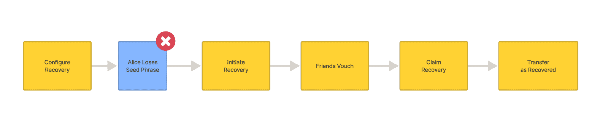
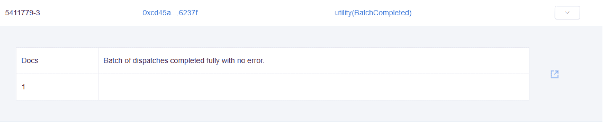
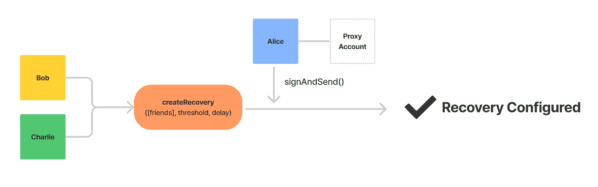
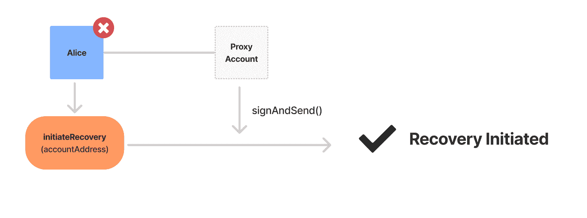
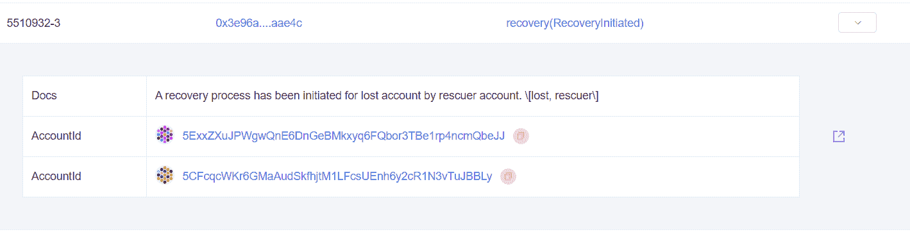
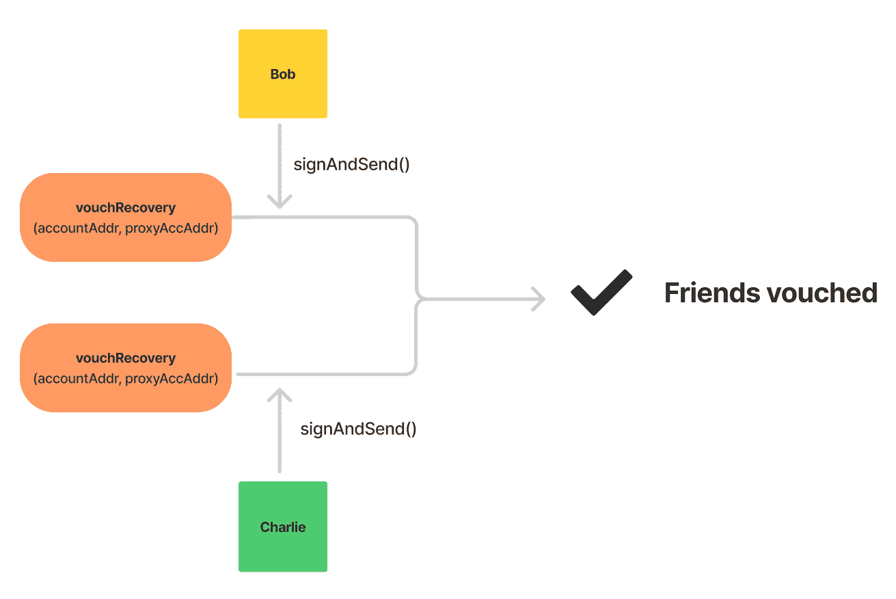
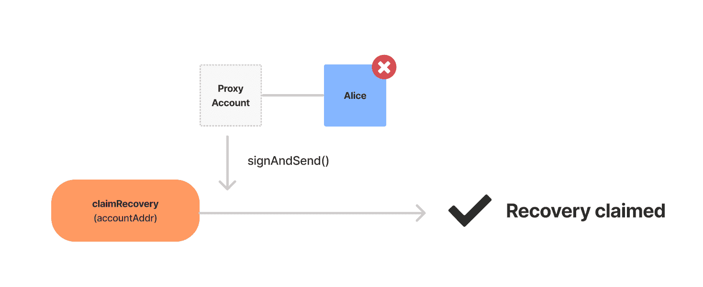
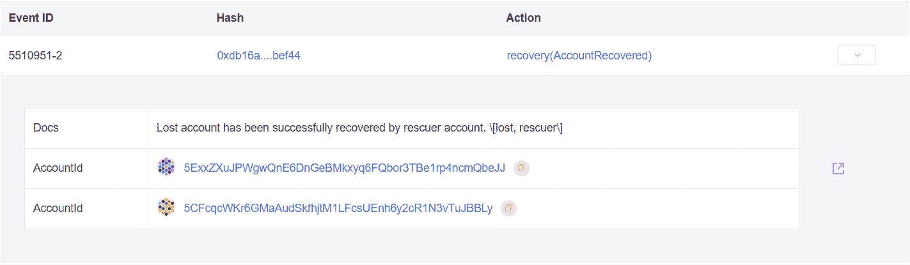
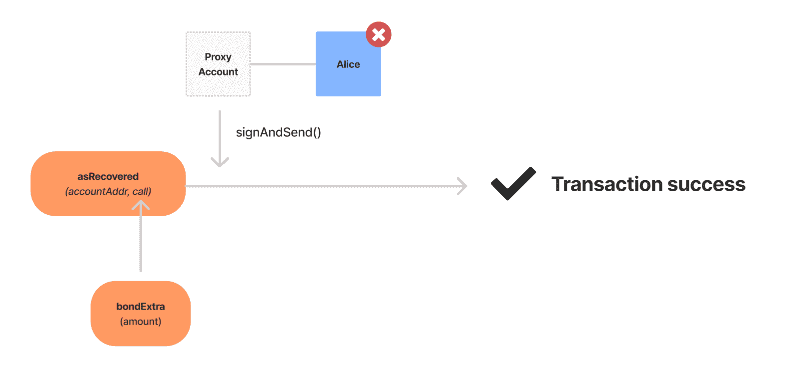
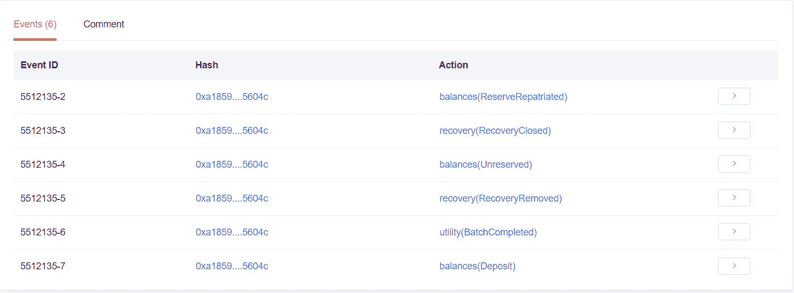

# polkadot/implement-social-recovery-on-polkadot

> 原文：<https://github.com/figment-networks/learn-tutorials/blob/master/polkadot/implement-social-recovery-on-polkadot.md>

在本教程中，我们将介绍如何设置和利用 Polkadot 代理帐户的社会恢复。本教程假设读者具备 JavaScript 和 Node JS 的工作知识。虽然不是必需的，但它将有助于了解引入 Polkadot JS API 的 Polkadot 途径。

社会恢复并不能取代丢失的私钥或种子短语(保护它们总是很重要的)。该特征将仅允许账户所有者代表丢失的账户提交交易，对于该丢失的账户，私钥和种子短语是不可用的-可能是由于丢失，或者甚至是暂时不能访问该账户。

因为这是一种获取你的资金的方式，所以恰当地选择你的社会康复联系人是非常重要的。

*   确保你选择的任何一个社会恢复联系人都是*值得信赖的*并且有可能*在你需要他们帮助找回丢失账户的时候*出现。
*   明确定义期望，即当您要求他们启动凭证交易时，他们能够在合理的时间内执行此任务，并在完成后进行反馈。
*   社交恢复联系人应始终受到尊重，因为他们最终决定了我们在需要使用该功能时访问帐户的能力。
*   社会康复联系人不应相互认识 ***或*** 知道总共有多少人组成康复名单，以避免任何串通的风险——至少，名单上的任何人都需要知道他们的角色是什么，以及在被要求时如何履行。

出于本教程的目的，我们将承担所有相关方的角色，作为演示相关代码的一种方式。开发人员有责任以负责任的方式将这些知识转移到生产环境中，同时牢记最佳实践和最终用户安全。

> 在本教程中，当`...`出现在一个输出块中时，它表示文本已经被剪裁以提高可读性。此外，本地运行代码的终端输出会与示例略有不同，所以如果它们不匹配，不要过分担心。

# 设置

为了遵循教程的目的而执行这些设置步骤不应该被解释为实现社会恢复的唯一方式。这仅仅是为了让读者能够接触到最简单可行的产品，涉及到所有相关的交易类型。本教程有两个依赖项:

*   [dotenv](https://www.npmjs.com/package/dotenv)
*   [@polkadot/api](https://www.npmjs.com/package/@polkadot/api)

当我们将所有这四个命令复制并粘贴到终端中时，前三个命令将按顺序执行。`npm init -y`将默认`package.json`的内容输出到终端。`npm install`将出现在命令行上，但是我们仍然必须**按 enter** 来开始安装过程。

```js
mkdir polkadot_sr
cd polkadot_sr
npm init -y
npm install --save dotenv @polkadot/api 
```

一旦安装过程完成，在工作目录
( `/polkadot_sr`)下创建一个`.env`文件。为了方便起见，复制并粘贴下面的模板。在我们方便的[快速参考指南](/figment-networks/learn-tutorials/blob/extra-guides/dotenv-and-.env.md)中阅读更多关于`dotenv`的信息。此外，记得用来自 [Polkadot 服务仪表板](https://datahub.figment.io/services/polkadot)的有效 DataHub API 键替换`API_KEY`。

```js
DATAHUB_URL=http://polkadot-westend--rpc.datahub.figment.io/apikey/API_KEY

ALICE_ADDRESS=
ALICE_MNEMONIC= 

PROXY_ADDRESS=
PROXY_MNEMONIC=

BOB_ADDRESS=
BOB_MNEMONIC=

CHARLIE_ADDRESS= 
CHARLIE_MNEMONIC= 
```

## 创建 4 个帐户

创建一个名为`create_account.js`的文件，并粘贴以下代码:

```js
const { ApiPromise, Keyring } = require('@polkadot/api');
const { HttpProvider } = require('@polkadot/rpc-provider');
const { mnemonicGenerate } = require('@polkadot/util-crypto');
require("dotenv").config()

const main = async () => {
  const httpProvider = new HttpProvider(process.env.DATAHUB_URL);
  const api = await ApiPromise.create({ provider: httpProvider });
  const keyring = new Keyring({type: 'sr25519'});

  const mnemonic = mnemonicGenerate();
  const newAccount = await keyring.addFromUri(mnemonic);
  console.log(`Address: ${newAccount.address}`);
  console.log(`Mnemonic: ${mnemonic}`);
};

main().catch((err) => {console.error(err)}).finally(() => process.exit());
```

在终端窗口中，运行`node create_account.js`4(*4*次)以生成我们需要的数据。将每个新账户的助记符&地址复制/粘贴到提供的`.env`模板中。

*   `Alice`:我们将“失去”访问权限的账户。
*   `AliceProxy`:用于代表“丢失”的爱丽丝账户进行交易。
*   `Bob` & `Charlie`:这些账户代表将为我们的爱丽丝账户所有权提供担保的个人。

通过访问[https://水龙头. figment.io](https://faucet.figment.io) 并输入我们生成的第一个地址，为 Alice 获得一些资金来支付存款费用。由于我们将需要在教程中支付交易，这也将是必要的转移到其他帐户的一些令牌。我们将继续讨论这个问题。



# 为 Alice 添加代理帐户

创建一个名为`create_proxy.js`的文件，并粘贴以下代码:

```js
const { ApiPromise, Keyring } = require('@polkadot/api');
const { HttpProvider } = require('@polkadot/rpc-provider');
const { formatBalance } = require('@polkadot/util/format')
require("dotenv").config()

const main = async () => {
  const httpProvider = new HttpProvider(process.env.DATAHUB_URL);
  const api = await ApiPromise.create({ provider: httpProvider });
  const keyring = new Keyring({type: 'sr25519'});

  // 1\. Use formatBalance() to make amounts readable
  formatBalance.setDefaults({
    unit: 'WND',
    decimals: 12,
  })

  // 2\. Define relevant constants
  const DELAY_PERIOD = 0;
  const PROXY_TYPE = 'Staking';
  const AMOUNT_TO_SEND = 5200000000000; // 5.2000 WND
  const DEPOSIT_BASE = api.consts.proxy.proxyDepositBase.toString();     // 1,000,400,000,000 = 1.00040 WND
  const DEPOSIT_FACTOR = api.consts.proxy.proxyDepositFactor.toString(); //     1,650,000,000 = 0.00165 WND
  const CHECKSUM = parseInt(DEPOSIT_BASE) + parseInt(DEPOSIT_FACTOR);    // 1,002,050,000,000 = 1.00200 WND

  // 3\. Initialize accounts
  const Alice = keyring.addFromUri(process.env.ALICE_MNEMONIC);
  const AliceProxy = keyring.addFromUri(process.env.PROXY_MNEMONIC);

  // 4\. Send 1 WND to new staking proxy
  const txTransferHash = await api.tx.balances
    .transfer(AliceProxy.address, AMOUNT_TO_SEND)
    .signAndSend(Alice, {tip: 10000000000});
  console.log(`Required values  : .transfer(destination, amount)`);     
  console.log(`Submitted values : .transfer(${AliceProxy.address}, ${formatBalance(AMOUNT_TO_SEND)})`); // 1.0000 WND
  console.log(`transfer() tx: https://westend.subscan.io/extrinsic/${txTransferHash}`); 

  // 5\. Create a new staking proxy
  const txAddHash = await api.tx.proxy
    .addProxy(AliceProxy.address, PROXY_TYPE, DELAY_PERIOD)
    .signAndSend(Alice, {tip: 10000000000});
  console.log(`\nproxyDepositBase \+ ( proxyDepositFactor * number of proxies )\n : ${formatBalance(DEPOSIT_BASE)} \+ ${formatBalance(DEPOSIT_FACTOR)} \= ${formatBalance(parseInt(DEPOSIT_BASE)+parseInt(DEPOSIT_FACTOR))}\n`);
  console.log(`Required values  : .addProxy(address, type, delay)`);     
  console.log(`Submitted values : .addProxy(${AliceProxy.address}, ${PROXY_TYPE}, ${DELAY_PERIOD})`);
  console.log(`addProxy() tx: https://westend.subscan.io/extrinsic/${txAddHash}\n`);  
}

main().catch((err) => { console.error(err) }).finally(() => process.exit());
```

*   `DELAY`是初始代理请求所需的公告期。这通常为零。

*   `PROXY_TYPE`将是**赌注**，因为其他类型的代理不足以满足我们的目的。在 [Polkadot Wiki](https://wiki.polkadot.network/docs/en/learn-accounts) 上了解更多关于账户结构和各种代理类型的信息。

*   `AMOUNT_TO_SEND`等于代表金额的完整的 12 位小数。

*   `addProxy()`要求以本国货币(即 WND 或 DOT)支付保证金，以支付必要的链上存储空间。`api.consts.proxy.proxyDepositBase`是创建代理名单时必须预留的货币基础金额。对于添加到列表中的每一个额外的代理，也会保留由`api.consts.proxy.proxyDepositFactor`定义的数量。

*   `transfer()`接收目的地地址和金额——我们将向代理帐户发送足够的 WND，以便它能够支付保证金来启动恢复尝试。当发送多个非批处理事务时，我们向验证器添加一个`tip`。这是为了避免其中一个被赋予太低的优先级而无法执行。

用`node create_proxy.js`运行代码。预期输出将类似于以下示例:

```js
Required values  : .transfer(destination, amount)
Submitted values : .transfer(5FsyYpFCETZpmexY3FZuD5oxK3viQwcDenHa5hiHsVyaqvYA, 2.0000 WND)
transfer() tx: https://westend.subscan.io/extrinsic/...

proxyDepositBase + proxyDepositFactor = 1.0004 WND + 1.6500 mWND = 1.0020 WND

Required values  : .addProxy(address, type, delay)
Submitted values : .addProxy(5FsyYpFCETZpmexY3FZuD5oxK3viQwcDenHa5hiHsVyaqvYA, Staking, 0)
addProxy() tx: https://westend.subscan.io/extrinsic/... 
```

> **关于金额**:
> 
> 细心的读者会注意到存款因子显示为`1.6500 mWND`——这是因为`formatBalance()`会自动添加一个金额限定符，并将显示截断到四位小数。mWND 代表微 WND，有 10 位小数，而 WND 令牌的最小单位是 pWND 或皮-WND，有 12 位小数。

```js
formatBalance.setDefaults({
  unit: 'WND',
  decimals: 12,
})
```

`formatBalance.setDefaults()`调用指定每个货币单位的符号和支持的小数位数。我们可以看到，为一个传递函数提供一个`AMOUNT_TO_SEND`可以很好地工作，但是向用户显示这个数字，或者要求用户输入 12 位额外数字的金额将会非常麻烦。这就是`formatBalance()`存在的原因。像这样想象十二位小数:

```js
// 1,000,400,000,000 = 1.00040 WND
//     1,650,000,000 = 0.00165 WND
// 1,002,050,000,000 = 1.00200 WND
// 5,000,000,000,000 = 5.00000 WND
//             1,337 = 0.0000000001337 WND (1337 pWND)
```

# 资助鲍勃和查理

创建一个名为`fund_friends.js`的文件，并粘贴以下代码:

```js
const { ApiPromise, Keyring } = require('@polkadot/api');
const { HttpProvider } = require('@polkadot/rpc-provider');
const { formatBalance } = require('@polkadot/util/format')
require("dotenv").config()

const main = async () => {
  const httpProvider = new HttpProvider(process.env.DATAHUB_URL);
  const api = await ApiPromise.create({ provider: httpProvider });
  const keyring = new Keyring({type: 'sr25519'});

  // 1\. Use formatBalance to make the amount readable
  formatBalance.setDefaults({
    unit: 'WND',
    decimals: 12,
  })   

  // 2\. Define relevant constants
  const AMOUNT_TO_SEND = 500000000000;
  const displayAmount = formatBalance(AMOUNT_TO_SEND); // 0.5000 WND

  // 3\. Initialize accounts
  const Alice = keyring.addFromUri(process.env.ALICE_MNEMONIC);
  const Bob = keyring.addFromUri(process.env.BOB_MNEMONIC);
  const Charlie = keyring.addFromUri(process.env.CHARLIE_MNEMONIC);

   // 4\. Define an array of transactions
  const transactions = [
    api.tx.balances.transfer(Bob.address, AMOUNT_TO_SEND),
    api.tx.balances.transfer(Charlie.address, AMOUNT_TO_SEND),
  ];

  // 5\. Send batch transaction
  const txHash = await api.tx.utility
    .batch(transactions)
    .signAndSend(Alice);
  console.log(`Sending ${displayAmount} to ${Bob.address} & ${Charlie.address}`);     
  console.log(`Required values  : .batch([transactions])`);     
  console.log(`Submitted values : .batch(${JSON.stringify(transactions, null, 2)})`);
  console.log(`batch() tx: https://westend.subscan.io/extrinsic/${txHash}`);
};

main().catch((err) => { console.error(err) }).finally(() => process.exit());
```

这是一个用 PolkadotJS 批量处理事务是多么简单的例子。我们在这里所做的就是定义一个传输数组，然后只需调用几个方法就可以自动处理、签名并发送到网络。继续使用`node fund_friends.js`在终端中运行代码。输出将类似于以下示例(为了便于显示，删除了一些内容) :

```js
Required values  : .batch([transactions])
Submitted values : .batch([
  "0xac040400004c5f5c983eaa1a5ce7cf4462b4f527f69c3b9cb284e2ae941d1b8b3a85a...",
  "0xac04040000ee43c4203c16f4f9f2577a7fb85136788c9aefd0f0666d678078d784c86..."
])
Sending 500.0000 mWND to 5DnqpngDQQ4pNpHgmGyhyzrpCaXawGHRiHRoPvdigLpHSQ8K & 
5HT7PFajmKLC7RvLHKNBicuf9xYhMH6tpUzbJDi5EMYFRhQs
batch() tx: https://westend.subscan.io/extrinsic/... 
```

提交的值是我们在`transactions`数组中设置的传递函数的散列数据，它将由`batch()`函数处理。检查 SubScan 的链接，查看成功的交易。



此时，我们已经设置好了，应该有一个预留余额略超过 1 WND 的资金主账户、一个正常运行的代理账户和两个各有 0.5 WND 的独立账户。下一步是创建恢复配置。

# 创建恢复配置

> **注意:**此步骤必须在 之前完成 ***一个种子短语丢失！***



在存储中创建恢复配置需要支付押金。基本金额是固定的，额外的存款费用基于我们设置为社会恢复联系人的朋友数量。

创建一个名为`create_recovery.js`的文件，并粘贴以下代码:

```js
const { ApiPromise, Keyring } = require('@polkadot/api');
const { HttpProvider } = require('@polkadot/rpc-provider');
const { formatBalance } = require('@polkadot/util/format')
require("dotenv").config()

const main = async () => {
  const httpProvider = new HttpProvider(process.env.DATAHUB_URL);
  const api = await ApiPromise.create({ provider: httpProvider });
  const keyring = new Keyring({type: 'sr25519'});

  // 1\. Use formatBalance() to make amounts readable
  formatBalance.setDefaults({
    unit: 'WND',
    decimals: 12,
  })

  // 2\. Define relevant constants
  const THRESHOLD = 2;
  const DELAY_PERIOD = 0;
  const DEPOSIT_BASE = api.consts.recovery.configDepositBase.toString();     // 5,000,000,000,000 = 5.00000 WND
  const DEPOSIT_FACTOR = api.consts.recovery.friendDepositFactor.toString(); //   500,000,000,000 = 0.50000 WND

  // 3\. Initialize accounts
  const Alice = keyring.addFromUri(process.env.ALICE_MNEMONIC);
  const Bob = keyring.addFromUri(process.env.BOB_MNEMONIC);
  const Charlie = keyring.addFromUri(process.env.CHARLIE_MNEMONIC);
  const friends = [
    Bob.address,
    Charlie.address,
  ].sort(); 

  // 4\. Create Recovery configuration
  const txHash = await api.tx.recovery
    .createRecovery(friends, THRESHOLD, DELAY_PERIOD)
    .signAndSend(Alice);
  console.log(`\nconfigDepositBase \+ ( friendDepositFactor * number of friends )\n : ${formatBalance(DEPOSIT_BASE)} \+ ${formatBalance(DEPOSIT_FACTOR * friends.length)} \= ${formatBalance(parseInt(DEPOSIT_BASE)+parseInt(DEPOSIT_FACTOR*friends.length))}\n`);
  console.log(`Required values : .createRecovery(friends, threshold, delayPeriod)`);     
  console.log(`Submitted values : .createRecovery(${JSON.stringify(friends, null, 2)}, ${THRESHOLD}, ${DELAY_PERIOD})`);     
  console.log(`createRecovery tx: https://westend.subscan.io/extrinsic/${txHash}`);
};

main().catch((err) => { console.error(err) }).finally(() => process.exit());
```

*   `THRESHOLD`是触发社会回收所需的单个凭证交易的数量。

*   `DELAY_PERIOD`是在恢复尝试开始后，在恢复配置可以被要求之前，需要通过的块数。

*   `DEPOSIT_BASE`和`DEPOSIT_FACTOR`是来自`api.consts.recovery`的值，通知我们要设置为保留余额的金额。恢复配置需要以本地货币
    (即 WND 或 DOT)存款才能创建。需要存放，因为我们要将数据添加到链上的存储空间，这些数据必须在网络中的每个对等点上复制。

*   是一个数组，包含我们的社会康复联系人的地址。需要对它们进行排序，并且该数组不能包含任何重复项。有一个`api.consts.recovery.maxFriends`限制了地址的数量——它被设置为 9。

在终端中使用命令`node create_recovery.js`运行代码:

```js
configDepositBase + ( friendDepositFactor * number of friends ) 
 : 5.0000 WND + 1.0000 WND = 6.0000 WND

Required values : .createRecovery(friends, threshold, delayPeriod)
Submitted values : .createRecovery([
  "5DnqpngDQQ4pNpHcmGyhyzrpCaXawGHRiHRoPvdigLpHSQ8K",
  "5HT7PFajmKLC7RvGHKNBicuf9xYhMH6tpUzbJDi5EMYFRhQs"
], 2, 0)
createRecovery tx: https://westend.subscan.io/extrinsic/... 
```

请注意，如果 Alice 账户中没有足够的余额来支付押金和网络费用，我们可能会遇到`Error: 1010: Invalid Transaction`。我们需要最少约 6 WND 可用余额，这应该是我们在安装期间访问水龙头后。

> 在波尔卡多特上`configDepositBase`是 20.008 而`friendDepositFactor`是 0.033。
> 因此，Polkadot 上新的社会恢复配置所需的存款金额等于(用点表示):`20.008 + (0.033 * num_friends)`

此时，我们可以选择删除恢复存储以通过`removeRecovery()`重新获得存款金额，或者通过调用`initiateRecovery()`开始恢复过程。

# 从代理帐户启动恢复



创建一个名为`initiate_recovery.js`的文件，并粘贴以下代码:

```js
const { ApiPromise, Keyring } = require('@polkadot/api');
const { HttpProvider } = require('@polkadot/rpc-provider');
const { formatBalance } = require('@polkadot/util/format')
require("dotenv").config()

const main = async () => {
  const httpProvider = new HttpProvider(process.env.DATAHUB_URL);
  const api = await ApiPromise.create({ provider: httpProvider });
  const keyring = new Keyring({type: 'sr25519'});

   // 1\. Use formatBalance to make the amount readable
  formatBalance.setDefaults({
    unit: 'WND',
    decimals: 12,
  })

  // 2\. Initialize account from the mnemonic
  const Alice = keyring.addFromUri(process.env.ALICE_MNEMONIC);
  const AliceProxy = keyring.addFromUri(process.env.PROXY_MNEMONIC);

  // 3\. Initiate the social recovery process
  const txHash = await api.tx.recovery
    .initiateRecovery(Alice.address)
    .signAndSend(AliceProxy);
  console.log(`Recovery deposit: ${formatBalance(api.consts.recovery.recoveryDeposit.toString())}`); // 5.0000 WND
  console.log(`initiateRecovery() tx: https://westend.subscan.io/extrinsic/${txHash}`);

};

main().catch((err) => { console.error(err) }).finally(() => process.exit());
```

*   `initiateRecovery()`在仓库中创建一个活动的回收请求，然后需要由我们的社会回收联系人担保。

*   将从 AliceProxy 帐户的可用余额中自动预留`api.consts.recovery.recoveryDeposit`金额——这就是为什么我们在设置期间将 5.2 WND 转移到 AliceProxy。如果代理上没有`recoveryDeposit`金额，该步骤将失败。如果在这个阶段调用了`closeRecovery()`，则主动恢复请求将被移除，同时将`recoveryDeposit`退款到可恢复账户 Alice。

*   调用`initiateRecovery()`后，可以使用`closeRecovery()`提前结束恢复过程，而不完成它。一旦在所有活动恢复配置上调用了`closeRecovery()`，就可以调用`removeRecovery()`——这将从存储中删除恢复配置。这在需要更改社会康复联系人列表的情况下非常有用，因为没有更新列表的方法。

运行`node initiate_recovery.js`:

```js
Recovery deposit: 5.0000 WND
initiateRecovery() tx: https://westend.subscan.io/extrinsic/... 
```

确保它成功完成的方法是跟踪到 SubScan 块资源管理器的链接，并查看我们刚刚发送的事务的事件包括一个成功的[recovery(recovery initiated)](https://westend.subscan.io/event?module=recovery&event=recoveryinitiated)操作，如下例所示:



# 担保康复



创建一个名为`vouch_recovery.js`的文件，并粘贴以下代码:

```js
const { ApiPromise, Keyring } = require('@polkadot/api');
const { HttpProvider } = require('@polkadot/rpc-provider');
const { formatBalance } = require('@polkadot/util/format')
require("dotenv").config()

const main = async () => {
  const httpProvider = new HttpProvider(process.env.DATAHUB_URL);
  const api = await ApiPromise.create({ provider: httpProvider });
  const keyring = new Keyring({type: 'sr25519'});

  // 1\. Initialize account(s)
  const Alice = keyring.addFromUri(process.env.ALICE_MNEMONIC);
  const AliceProxy = keyring.addFromUri(process.env.PROXY_MNEMONIC);
  const Bob = keyring.addFromUri(process.env.BOB_MNEMONIC);
  const Charlie = keyring.addFromUri(process.env.CHARLIE_MNEMONIC);

  // Friend 1 vouches for our recovery process
  const txHash1 = await api.tx.recovery
    .vouchRecovery(Alice.address, AliceProxy.address)
    .signAndSend(Bob);
  console.log(`Bob vouch tx: https://westend.subscan.io/extrinsic/${txHash1}`);

  // Friend 2 vouches for our recovery process
  const txHash2 = await api.tx.recovery
    .vouchRecovery(Alice.address, AliceProxy.address)
    .signAndSend(Charlie);
  console.log(`Charlie vouch tx: https://westend.subscan.io/extrinsic/${txHash2}`);
};

main().catch((err) => { console.error(err) }).finally(() => process.exit());
```

一旦这些交易成功，AliceProxy 帐户将能够从存储中要求恢复配置，存储授权代表 Alice 签名。没有这个过程的这一部分，社会恢复是不可能的。这就是为什么与我们选择的社会康复联系人保持良好关系至关重要。

运行`node vouch_recovery.js`:

```js
Bob vouch tx: https://westend.subscan.io/extrinsic/...
Charlie vouch tx: https://westend.subscan.io/extrinsic/... 
```

在涉及具有实际值的账户(用点代替 WND)的真实场景中，这些函数将由不同的个人在不同的时间调用。因此，最好(尽管不是完全必要)与我们的社会康复联系人*实时沟通*以协调这一过程。

# 申请恢复配置



创建一个名为`claim_recovery.js`的文件，并粘贴以下代码:

```js
const { ApiPromise, Keyring } = require('@polkadot/api');
const { HttpProvider } = require('@polkadot/rpc-provider');
const { formatBalance } = require('@polkadot/util/format')
require("dotenv").config()

const main = async () => {
  const httpProvider = new HttpProvider(process.env.DATAHUB_URL);
  const api = await ApiPromise.create({ provider: httpProvider });
  const keyring = new Keyring({type: 'sr25519'});

  // 1\. Initialize accounts
  const Alice = keyring.addFromUri(process.env.ALICE_MNEMONIC);
  const AliceProxy = keyring.addFromUri(process.env.PROXY_MNEMONIC);

  // 2\. Claim lost account
  const txHash = await api.tx.recovery
    .claimRecovery(Alice.address)
    .signAndSend(AliceProxy);
  console.log(`claimRecovery tx: https://westend.subscan.io/extrinsic/${txHash}`);
};

main().catch((err) => { console.error(err) }).finally(() => process.exit());
```

需要注意的是，如果在`vouchRecovery()`函数的`THRESHOLD`成功之前调用`claimRecovery()`，它将会失败。我们必须等待我们的社会恢复联系人确认他们已经尽了自己的职责，然后才能继续申请恢复配置。

一旦我们意识到凭证交易已经完成，运行`node claim_recovery.js`:

```js
claimRecovery tx: https://westend.subscan.io/extrinsic/... 
```

按照终端输出中的链接检查 AliceProxy 是否已成功声明恢复尝试。我们正在寻找类似于此示例的[恢复(AccountRecovered)](https://westend.subscan.io/event?module=recovery&event=accountrecovered) 操作:



# 将交易记录作为恢复的帐户发送



创建一个名为`use_recovery.js`的文件，并粘贴以下代码:

```js
const { ApiPromise, Keyring } = require('@polkadot/api');
const { HttpProvider } = require('@polkadot/rpc-provider');
const { formatBalance } = require('@polkadot/util/format')
require("dotenv").config()

const main = async () => {
  const httpProvider = new HttpProvider(process.env.DATAHUB_URL);
  const api = await ApiPromise.create({ provider: httpProvider });
  const keyring = new Keyring({type: 'sr25519'});

  // 1\. Use formatBalance to make the amount readable
  formatBalance.setDefaults({
    unit: 'WND',
    decimals: 12,
  })

  // 2\. Define relevant constants
  const AMOUNT_TO_SEND = 1000000000000;
  const displayAmount = formatBalance(AMOUNT_TO_SEND); // 1.0000 WND
  const figmentFaucet = '5Fbm5fa1W9FhoCLBu8Tak7SWJHmbj4tRNyJrPifmLAq8PGp6';

  // 3\. Initialize accounts
  const Alice = keyring.addFromUri(process.env.ALICE_MNEMONIC);
  const AliceProxy = keyring.addFromUri(process.env.PROXY_MNEMONIC);

  // 4\. Use asRecovered to bond 0.1 WND for our lost proxy account
  const call = await api.tx.balances.transfer(figmentFaucet, AMOUNT_TO_SEND);
  const txHash = await api.tx.recovery
    .asRecovered(Alice.address, call)
    .signAndSend(AliceProxy);
  console.log(`Required values  : asRecovered(address, function)`);     
  console.log(`Submitted values : asRecovered(${Alice.address}, ${JSON.stringify(call, null, 2)})`); 
  console.log(`asRecovered tx: https://westend.subscan.io/extrinsic/${txHash}`);
};

main().catch((err) => { console.error(err) }).finally(() => process.exit());
```

在要求恢复配置后，我们能够使用`asRecovered()`代表我们丢失的帐户发送函数调用。这为有限的一组功能授予了权限，其中包括转移。
还有一个`cancelRecovered()`功能，取消注册代理账户使用`asRecovered()`的能力，以及一个`setRecovered()`功能，允许根账户绕过恢复过程，直接授予`asRecovered()`权限。对于真正喜欢冒险的人来说，可以在 Polkadot API 的定义文件中找到关于这些函数的更多信息。

运行`node use_recovery.js`:

```js
Required values  : asRecovered(address, function)
Submitted values : asRecovered(
    5CwJrhV9DaLncybk2vHbvt62SfwDfqMmPHVbo83u3iPkSDkc,
    "0xa804040000...")
asRecovered tx: https://westend.subscan.io/extrinsic/... 
```

# 用 removeRecovery()清理

创建一个名为`remove_recovery.js`的文件，并粘贴以下代码:

```js
const { ApiPromise, Keyring } = require('@polkadot/api');
const { HttpProvider } = require('@polkadot/rpc-provider');
const { formatBalance } = require('@polkadot/util/format');
require("dotenv").config()

const main = async () => {
  const httpProvider = new HttpProvider(process.env.DATAHUB_URL);
  const api = await ApiPromise.create({ provider: httpProvider });
  const keyring = new Keyring({type: 'sr25519'});

  // 1\. Use formatBalance to make the amount readable
  formatBalance.setDefaults({
    unit: 'WND',
    decimals: 12,
  })

  // 2\. Define relevant constants 
  const AMOUNT_TO_SEND = 12000000000000; // 12 WND
  const figmentFaucet = '5Fbm5fa1W9FhoCLBu8Tak7SWJHmbj4tRNyJrPifmLAq8PGp6';

  // 3\. Initialize accounts
  const Alice = keyring.addFromUri(process.env.ALICE_MNEMONIC);
  const AliceProxy = keyring.addFromUri(process.env.PROXY_MNEMONIC);

  // 4\. Define an array of transactions
  const transactions = [
    api.tx.recovery.closeRecovery(AliceProxy.address),
    api.tx.recovery.removeRecovery(),
  ];

  // 5\. Close & Remove recovery config
  const closeHash = await api.tx.utility
    .batch(transactions)
    .signAndSend(Alice, { nonce: -1 } );
  console.log(`Required values  : .batch([transactions])`);     
  console.log(`Submitted values : .batch(${JSON.stringify(transactions, null, 2)})`);
  console.log(`batch() tx: https://westend.subscan.io/extrinsic/${closeHash}`);  

  // 6\. Refund the Faucet
  const txHash = await api.tx.balances
    .transfer(figmentFaucet, AMOUNT_TO_SEND)
    .signAndSend(Alice, { nonce: -1 });
  console.log(`transfer() tx: https://westend.subscan.io/extrinsic/${txHash}`);

};

main().catch((err) => { console.error(err) }).finally(() => process.exit());
```

我们将通过首先调用`closeRecovery()`然后调用`removeRecovery()`来清理恢复配置。这将退还我们之前给 Alice 的押金，然后将 WND 代币送回 Figment 水龙头，这样我们就不会不必要地占用代币。必须理解的是，`removeRecovery()`只能被调用一次`closeRecovery()` **已经在任何活动的恢复请求*上被调用。*
关于`signAndSend(Alice, { nonce: -1 })`，当发送同一个账号签名的多个 API 调用时，我们必须直接设置 nonce，避免出现关于事务优先级的错误。

> ***在运行这段代码之前:***
> 
> 在 SubScan 上检查 Alice 帐户的可用余额。在收回`recoveryDeposit`和恢复配置存款后，应该有大约 11-12 WND 可用于返回水龙头。如果 Alice 的保留余额高于代理账户所需的 1 WND，则其他存款没有被处理。因此，我们需要修改`AMOUNT-TO-SEND`,以便传输成功。
> 
> 当我们完成教程时，我们只需要从我们的 Alice 帐户返回可用余额。如果需要进一步测试社会恢复，不要进行这一步。

运行`node remove_recovery.js`:

```js
Required values  : .batch([transactions])
Submitted values : .batch([
  "0x8c041206a806dbe17a11f61c09bff38ef9a78cdd1fde311ff8ee09ef241a95052903be66",
  "0x0c041207"
])
batch() tx: https://westend.subscan.io/extrinsic/...
transfer() tx: https://westend.subscan.io/extrinsic/... 
```

成功删除恢复配置并将押金退还给 Alice 帐户的事件将与 SubScan 上的类似:



# 结论

恭喜你！在本教程中，我们学习了如何在 Polkadot 上使用类似`createRecovery()`的功能配置社会恢复，以及转移相关的存款费用。我们学习了如何使用`formatBalance()`助手函数来显示可读的数量。我们讲述了如何创建一个 Staking 类型的代理帐户，以及如何批处理多个事务。

我们现在被授权保护波尔卡多特上的重要资产，增加了一层安全措施，包括我们的朋友。