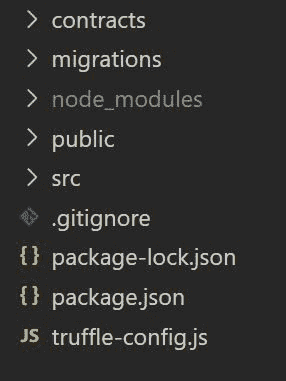
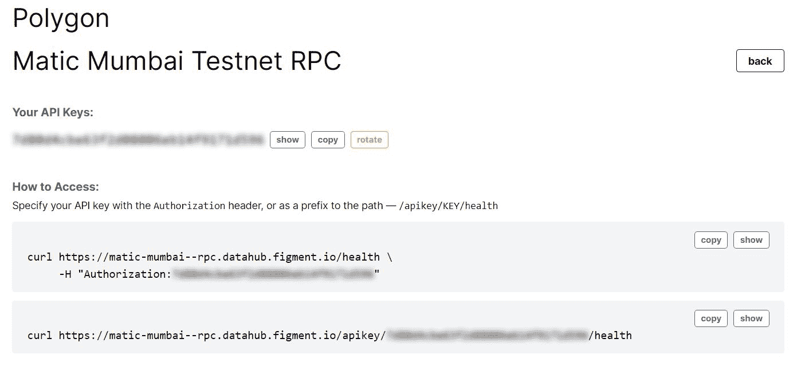

# 介绍

> 原文：<https://github.com/figment-networks/learn-tutorials/blob/master/polygon/Blockchain-Based-Skill-Verification-System.md>

在本教程中，您将学习如何使用区块链从头开始构建一个技能验证系统，并将其部署在 Polygon Mumbai 测试网络上。在进入构建部分之前，让我们先看看为什么我们需要一个使用区块链的技能验证系统。

# 先决条件

本教程假设您对 Solidity、web3.js、React.js 有一些初级编程知识，并且了解基本的区块链原理。

# 要求

我们需要在你的电脑上安装以下东西来开始这个教程，其余的我们会在需要的时候告诉你。

*   [节点和 npm](https://nodejs.org/en/)
*   [加纳切](https://www.trufflesuite.com/ganache)
*   [松露](https://www.trufflesuite.com/truffle)
*   [Metamask](https://metamask.io/)
*   IDE(如 VSCode、Atom 等..)

**注意:**如果您想了解有关这些要求的更多信息，请查看本文档末尾的参考资料部分。

# 问题陈述

对每个公司来说，最基本也是最重要的任务之一是在雇佣前核实候选人的资格和经验。随着越来越多的候选人申请，尤其是在大公司，验证候选人的资格和经验变得非常耗时，因此被忽视了很多次。候选人伪造信息的问题越来越受到人力资源部门的关注，尽管传统的技能验证系统是有用的，但它们在处理这一问题上还远远不够完善。

# 我们计划如何解决这个问题

基于区块链的技能验证将是解决这一问题的理想解决方案，因为它提供了一个透明、可信和独立的平台，还减少了进行能力检查所花费的时间。使用区块链，任何用户都可以输入他们的技能、认证和工作经验的详细信息，并让他们各自的公司同事、经理和团队领导以完全透明的方式核实这些详细信息。

我们的解决方案为每个用户提供一个唯一的 id。验证任何候选人的资格都很简单，因为他们的每项技能都有自己的相关认证和认可列表。一旦得到当前公司经理/雇主的认可，技能也将得到一个经过验证的徽章。

新用户和公司要通过 OAuth 由 LinkedIn 等平台交叉验证，增加额外的验证层。创建公司还需要至少两名经过验证的经理级员工以及其他标准细节。只有在公司批准他们的加入请求后，用户才能将公司添加到他们的工作体验中。

# 履行

对于这个实现，我们将使用 React.js 和 Web3.js 作为 Web 应用和 Solidity 的前端，以创建以太坊兼容的智能合约，部署在 Polygon 网络上。通过使用 Polygon 网络，我们依靠以太网的安全性，同时受益于 Polygon 第 2 层扩展的低燃气费和高吞吐量。这将通过增加允许的峰值并发用户数量，同时保持可行的响应时间，从而实现更加健壮的解决方案。

这里我们使用 React.js 作为前端，但是你可以使用任何你选择的前端框架。

# 路标

我们将首先使用 solidity 构建合同，并在本地部署它们，然后我们将使用 react 进行前端开发，并使用 web3 连接到我们的合同，最后在 Polygon Mumbai 网络上部署合同，对于前端的部署，我们将使用 netlify 进行展示。

# 项目环境设置

## 使用创建 React 应用程序设置项目

在分散技能目录中创建并设置 React 项目。

```
npx create-react-app Decentraskill
cd Decentraskill 
```

## 安装和设置所需的依赖项

安装所需的节点模块，并在分散技能目录中设置 truffle 项目。

```
npm install -g truffle
npm install web3
truffle init . 
```

完成这些步骤后，您应该有一个类似于以下的文件夹结构:

[](https://user-images.githubusercontent.com/54525688/139138833-b912fc28-484e-4a01-b642-7e273af539fd.JPG)

## 配置松露-config.js

用下面的代码片段替换`truffle-config.js`文件的内容:

```
module.exports = {
  // React only allows importing the built smart contract code (abis) from the src directory
  contracts_build_directory: path.join(__dirname, 'src/abis'),
  networks: {
    development: {
      host: '127.0.0.1', // localhost
      port: 7545, // default port for ganache dev server
      network_id: '*', // matches any network id
    },
  },
  compilers: {
    solc: {
      version: '0.8.1', // solidity version
    },
  },
};
```

## 配置初始迁移

用所需的智能合同文件名更新`1_initial_migration.js`文件:

```
const Decentraskill = artifacts.require('Decentraskill');
// Deploys the smart contract "Decentraskill"
module.exports = function (deployer) {
  deployer.deploy(Decentraskill);
};
```

# 可靠的智能合同

让我们从在`contracts`文件夹中创建`Decentraskill.sol`智能合同开始。这里，我们首先定义智能合约的全局/存储变量。前两行分别定义智能合同许可类型和兼容的 Solidity 版本。

```
// SPDX-License-Identifier: MIT
pragma solidity ^0.8.1;

// userid and company id is a unique natural number representing a account globally.
contract Decentraskill {
    company[] public companies;
    user[] public employees;
    certificate[] public certifications;
    endorsment[] public endorsments;
    skill[] public skills;
    experience[] public experiences;
```

对于登录/注册过程，我们计划使用 LinkedIn OAuth 作为第一层安全性，之后我们将用户的电子邮件 id 映射到他们在智能合同中的当前钱包地址。因此，每次用户尝试登录时，用户都需要通过 LinkedIn OAuth 登录，并验证他们的钱包地址。

```
// mapping of account's mail id with account's wallet address
mapping(string => address) public email_to_address;
// mapping of wallet address with account id
mapping(address => uint256) public address_to_id;
// mapping of wallet address with bool representing account status (Company/User)
mapping(address => bool) public is_company;
```

## 账户结构

每当用户注册时，可以有两种帐户:公司帐户或用户帐户。

1.  **公司账户**

公司账户应保留一份现任和前任员工的名单。该帐户应有权添加和删除公司的任何员工，还可以将员工提升到经理级别。

```
struct company {
    uint256 id; //company id which is the index of id in the global company array
    string name;
    address wallet_address;
    uint256[] current_employees;
    uint256[] previous_employees;
    uint256[] requested_employees;
}
```

1.  **用户账户**

用户帐户包含用户的所有技能、认证和工作经验。该帐户可以是标准员工级别或经理级别的帐户。经理级帐户应拥有与公司帐户类似的权限，但仅比标准员工帐户更高。他们对类似或更高级别的帐户没有任何权限。

```
struct user {
    uint256 id;
    uint256 company_id;
    string name;
    address wallet_address;
    bool is_employed;
    bool is_manager;
    uint256 num_skill;
    uint256[] user_skills;
    uint256[] user_work_experience;
}

struct experience {
    string starting_date;
    string ending_date;
    string role;
    bool currently_working;
    uint256 company_id;
    bool is_approved;
}
```

## 注册流程

对于注册功能，契约接受用户电子邮件、姓名和帐户类型(用户/公司)。根据帐户类型，我们向公司的全局数组或雇员的全局数组添加一个新条目，然后更新新创建的对象的参数。创建帐户后，它的 id(对象在其各自的全局数组中的索引)与我们在上面定义的全局映射中的电子邮件地址和帐户类型相链接。

**注意:**你必须为新创建的变量使用`storage`关键字，因为对于用户定义的结构，Solidity 不支持内存数据位置到存储数据位置的隐式转换。

**注意:**我们使用`calldata`作为输入字符串的存储位置，因为与存储在内存中相比，它导致更低的油费。

```
function sign_up(
    string calldata email,
    string calldata name,
    string calldata acc_type // account type (Company/User)
) public {
    // first we check that account does not already exists
    require(
        email_to_address[email] == address(0),
        "error: user already exists!"
    );
    email_to_address[email] = msg.sender;

    if (strcmp(acc_type, "user")) { // for user account type
        user storage new_user = employees.push(); // creates a new user and returns the reference to it
        new_user.name = name;
        new_user.id = employees.length - 1; // give account a unique user id
        new_user.wallet_address = msg.sender;
        address_to_id[msg.sender] = new_user.id;
        new_user.user_skills = new uint256[](0);
        new_user.user_work_experience = new uint256[](0);
    } else { // for company account type
        company storage new_company = companies.push(); // creates a new company and returns a reference to it
        new_company.name = name;
        new_company.id = companies.length - 1; // give account a unique company id
        new_company.wallet_address = msg.sender;
        new_company.current_employees = new uint256[](0);
        new_company.previous_employees = new uint256[](0);
        address_to_id[msg.sender] = new_company.id;
        is_company[msg.sender] = true;
    }
}
```

由于 Solidity 没有任何内置的字符串比较功能，我们需要自己创建它。为此，我们首先将字符串转换为字节，然后比较由 keccak256 函数创建的这些结果字节的散列。这些函数是“纯”的，因为它们不查看或修改任何状态变量。

```
function memcmp(bytes memory a, bytes memory b)
    internal
    pure
    returns (bool)
{
    return (a.length == b.length) && (keccak256(a) == keccak256(b)); // Comapares the two hashes
}

function strcmp(string memory a, string memory b) // string comparison function
    internal
    pure
    returns (bool)
{
    return memcmp(bytes(a), bytes(b));
}
```

## 登录过程

对于登录功能，合同只是检查帐户的钱包地址是否与试图登录的人的钱包地址相同。如果地址匹配，那么它返回帐户类型(公司/用户)。

**注意:**我们使用视图函数修饰符，因为函数不修改状态(任何全局变量),而只是“查看”它们。

```
function login(string calldata email) public view returns (string memory) {
    // checking the function caller's wallet address from global map containing email address mapped to wallet address
    require(
    msg.sender == email_to_address[email],
    "error: incorrect wallet address used for signing in"
    );
    return (is_company[msg.sender]) ? "company" : "user"; // returns account type
}
```

## 更新钱包地址

我们需要考虑到用户可能想要更改与其电子邮件/用户 id 关联的钱包地址。要做到这一点，用户只需在连接到其当前/以前的钱包地址时提供新的钱包地址。

```
function update_wallet_address(string calldata email, address new_address)
    public
{
    require(
        email_to_address[email] == msg.sender,
        "error: function called from incorrect wallet address"
    );
    email_to_address[email] = new_address;
    uint256 id = address_to_id[msg.sender];
    address_to_id[msg.sender] = 0;
    address_to_id[new_address] = id;
}
```

## 技能验证

用户的每一项技能都应与该特定技能的认可和认证列表相关联。这些技能只有在他们当前或以前公司的经理级客户认可时才会被标记为已验证。因此，每当潜在雇主访问他们的个人资料时，他们会得到一个完整的技能列表，从中可以很容易地找到经过验证的技能。这些技能可以由任何用户认可，对于用户的同事和经理所做的认可，应显示一个独特的标签。这些背书应包括对用户技能的个性化审查，从而减少垃圾背书的数量。

```
struct certificate {
    string url;
    string issue_date;
    string valid_till;
    string name;
    uint256 id;
    string issuer;
}

struct endorsment {
    uint256 endorser_id;
    string date;
    string comment;
}

struct skill {
    uint256 id;
    string name;
    bool verified;
    uint256[] skill_certifications;
    uint256[] skill_endorsements;
}
```

对于创建或更新用户数据时使用的函数，只有链接的用户才能调用它们。为此，我们创建函数修饰符，允许我们在多个函数中重用必要的 **require 语句**，从而避免相同代码的重复。

```
modifier verifiedUser(uint256 user_id) {
    require(user_id == address_to_id[msg.sender]);
    _;
}
```

为了给特定用户添加体验，`add_experiance`函数将获取用户的 id、就业开始日期和结束日期，以及雇主 id，即公司 id。该函数在 experiences 全局数组中创建新对象，并将其 id 添加到用户的`user_work_experience`数组和公司的`requested_employees`数组中。

```
function add_experience(
    uint256 user_id,
    string calldata starting_date,
    string calldata ending_date,
    uint256 company_id
) public verifiedUser(user_id) {
    experience storage new_experience = experiences.push();
    new_experience.company_id = company_id;
    new_experience.currently_working = false;
    new_experience.is_approved = false;
    new_experience.starting_date = starting_date;
    new_experience.role = role;
    new_experience.ending_date = ending_date;
    employees[user_id].user_work_experience.push(experiences.length - 1);
    companies[company_id].requested_employees.push(experiences.length - 1);
}
```

为了批准体验，`approve_experience`函数将获取一个来自全局`experiences`数组的体验 id 和一个公司 id。首先，该函数将检查调用该函数的人在给定公司中是否具有经理角色，然后它将使`experiences`列表中的`is_approved`布尔值为真。

```
function approve_experience(uint256 exp_id, uint256 company_id) public {
	  require(
	      (is_company[msg.sender] &&
	          companies[address_to_id[msg.sender]].id ==
	          experiences[exp_id].company_id) ||
	          (employees[address_to_id[msg.sender]].is_manager &&
	              employees[address_to_id[msg.sender]].company_id ==
	              experiences[exp_id].company_id),
	      "error: approver should be the company account or a manager of the required company"
	  );
    uint256 i;
    experiences[exp_id].is_approved = true;
    for (i = 0; i < companies[company_id].requested_employees.length; i++) {
        if (companies[company_id].requested_employees[i] == exp_id) {
            companies[company_id].requested_employees[i] = 0;
            break;
        }
    }
    for (i = 0; i < companies[company_id].current_employees.length; i++) {
        if (companies[company_id].current_employees[i] == 0) {
            companies[company_id].requested_employees[i] = exp_id;
            break;
        }
    }
    if (i == companies[company_id].current_employees.length)
        companies[company_id].current_employees.push(exp_id);
}
```

现在，假设一名员工不再在某家公司工作——要将该员工从公司的员工列表中删除，我们有两个选项:

*   将员工从特定职位移除后，移动列表。这种方法成本很高，因为需要支付更多的燃气费。
*   另一种方法是更改雇员 id 值，在适当的位置存储一个虚拟用户 id，以后可以重用它在该列表中存储一个新雇员。为此，我们在构造函数中创建了一个虚拟的用户配置文件，可以在初始化后重用(记住，当部署 Solidity smart 契约时，构造函数被调用一次)。

```
constructor() {
    user storage dummy_user = employees.push();
    dummy_user.name = "dummy";
    dummy_user.wallet_address = msg.sender;
    dummy_user.id = 0;
    dummy_user.user_skills = new uint256[](0);
    dummy_user.user_work_experience = new uint256[](0);
}
```

为了批准一个经理，函数`approve_manager`将雇员 id 作为输入，并验证调用该函数的帐户具有“公司”帐户类型。然后，它将确保该员工 id 出现在公司的“当前员工”列表中。如果这些检查通过，它将通过设置它的`is_manager`布尔值为真，给那个雇员一个经理标签。

```
function approve_manager(uint256 employee_id) public {
		require(is_company[msg.sender], "error: sender not a company account");
    require(
        employees[employee_id].company_id == address_to_id[msg.sender],
        "error: user not of the same company"
    );
    require(
        !(employees[employee_id].is_manager),
        "error: user is already a manager"
    );
    employees[employee_id].is_manager = true;
}
```

为了添加到他们的技能列表中，用户将调用`add_skill`函数将输入的技能推入到`skills`列表中。

```
function add_skill(uint256 userid, string calldata skill_name)
    public
    verifiedUser(userid) { // the modifier that we created above
    skill storage new_skill = skills.push();
    employees[userid].user_skills.push(skills.length - 1);
    new_skill.name = skill_name;
    new_skill.verified = false;
    new_skill.skill_certifications = new uint256[](0);
    new_skill.skill_endorsements = new uint256[](0);
}
```

类似地，我们将创建添加认证功能。

```
function add_certification(
    uint256 user_id,
    string calldata url,
    string calldata issue_date,
    string calldata valid_till,
    string calldata name,
    string calldata issuer,
    uint256 linked_skill_id
) public verifiedUser(user_id) {
    certificate storage new_certificate = certifications.push();
    new_certificate.url = url;
    new_certificate.issue_date = issue_date;
    new_certificate.valid_till = valid_till;
    new_certificate.name = name;
    new_certificate.id = certifications.length - 1;
    new_certificate.issuer = issuer;
    skills[linked_skill_id].skill_certifications.push(new_certificate.id);
}
```

经理、同事或任何用户都可以调用`endorse_skill`函数。要支持某人，被支持者必须给出关于此人的个性化评论，这将有助于我们减少垃圾广告。如果被推荐人是用户当前公司的经理，这也将使用户的技能得到验证。

```
function endorse_skill(
    uint256 user_id,
    uint256 skill_id,
    string calldata endorsing_date,
    string calldata comment
) public {
    endorsment storage new_endorsemnt = endorsments.push();
    new_endorsemnt.endorser_id = address_to_id[msg.sender];
    new_endorsemnt.comment = comment;
    new_endorsemnt.date = endorsing_date;
    skills[skill_id].skill_endorsements.push(endorsments.length - 1);
    if (employees[address_to_id[msg.sender]].is_manager) {
        if (
            employees[address_to_id[msg.sender]].company_id ==
            employees[user_id].company_id
        ) {
            skills[skill_id].verified = true;
        }
    }
}
```

# 使用 web3 连接前端和智能合约

为了将智能契约与 React.js 前端连接起来，我们将使用 Web3.js。我们将存储所有重要的细节，这些细节将在 React 状态变量中的各个组件中重用，使用 useState 挂钩跨重新呈现器持久化对象。

```
import React, { useState, useEffect } from 'react';
import Web3 from 'web3';
import SmartContract from '../abis/Decentraskill.json';

const App = () => {
  const [state, setState] = useState({
    web3: null,
    contract: null,
    email: '',
    account: '',
    accountId: '',
    signedIn: false,
    loaded: false,
  });
  // ...
};
```

我们首先需要使用`initWeb3`函数初始化这个状态变量。它将首先检查 web3 对象是否由 Metamask 注入，然后使用它来初始化 web3 实例。使用这个实例，我们可以获得连接的网络信息，并获得正确的智能合同 ABIs。然后，所有这些数据都将在状态变量中用`useState` React 钩子更新。

```
const initWeb3 = async () => {
  if (window.ethereum) {
    await window.ethereum.request({ method: 'eth_requestAccounts' });
    try {
      const web3 = new Web3(window.ethereum);
      const account = (await web3.eth.getAccounts())[0];
      const netId = await web3.eth.net.getId();
      const address = SmartContract.networks[netId].address;
      const contract = new web3.eth.Contract(SmartContract.abi, address);
      const accountId = await contract.methods.address_to_id(account).call();
      setState({
        ...state,
        web3,
        account,
        contract,
        accountId,
        loaded: true,
      });
      console.log('setup complete');
    } catch (e) {
      alert(e);
    }
  } else {
    alert('web3 not detected');
  }
};
```

让用户登录的功能

```
const login = async () => {
  try {
    const accountType = await state.contract.methods.login(state.email).call({
      from: state.account,
    });
    console.log('account type:', accountType);
    setState({ ...state, signedIn: true });
  } catch (e) {
    console.error(e);
  }
};
```

功能来注册用户

```
const signUp = async () => {
  try {
    await state.contract.methods
      .sign_up(state.email, 'name', 'user')
      .send({ from: state.account });
    alert('signed up');
  } catch (e) {
    console.error(e);
  }
};
```

请求将用户添加到公司的功能

```
const requestCompany = async (startDate, endDate, role, companyId) => {
  try {
    await state.contract.methods.add_experience(
      state.accountId,
      startDate,
      endDate,
      role,
      companyId
    );
  } catch (e) {
    console.error(e);
  }
};
```

批准员工加入公司的功能

```
const approveEmployee = async (experienceId, companyId) => {
  try {
    await state.contract.methods.approve_experience(experienceId, companyId);
  } catch (e) {
    console.error(e);
  }
};
```

函数来更新链接的钱包地址

```
const updateWallet = async (newAddress) => {
  try {
    await state.contract.methods.update_wallet_address(state.email, newAddress);
  } catch (e) {
    console.error(e);
  }
};
```

批准用户成为经理的功能

```
const approveManager = async (empId) => {
  try {
    await state.contract.methods.approve_manager(empId);
  } catch (e) {
    console.error(e);
  }
};
```

函数来添加证书

```
const addCertificate = async (
  certUrl,
  issueDate,
  validTill,
  certName,
  issuer,
  linkedSkill
) => {
  try {
    await state.contract.methods.add_certification(
      state.accountId,
      certUrl,
      issueDate,
      validTill,
      certName,
      issuer,
      linkedSkill
    );
  } catch (e) {
    console.error(e);
  }
};
```

添加技能的功能

```
const addSkill = async (skillName) => {
  try {
    await state.contract.methods.add_skill(state.accountId, skillName);
  } catch (e) {
    console.error(e);
  }
};
```

认可技能的功能

```
const endorseSkill = async (empId, skillId, comment) => {
  const date = new Date();
  try {
    await state.contract.methods.endorse_skill(
      empId,
      skillId,
      `${date.getMonth()} ${date.getFullYear()}`,
      comment
    );
  } catch (e) {
    console.error(e);
  }
};
```

# 部署智能联系人

## 到本地网络

为了在本地部署智能合约，我们需要检查我们的`truffle.config.js`,以确保我们在开发中拥有来自 ganache 的相同端口(默认为端口 8545 ),并且我们的 truffle 项目的根设置正确。

```
contracts_build_directory: path.join(__dirname, 'src/abis'),
development: {
      host: '127.0.0.1', // Localhost (default: none)
      port: 8545, // Standard Ethereum port (default: none)
      network_id: '*', // Any network (default: none)
},
```

确保 ganache 正在运行，然后运行以下命令来编译智能合约并将其部署到本地开发网络。

```
truffle compile
truffle migrate
```

**注意:**在编译智能合同时，您可能会得到如下错误:

```
Compiler Error: Stack too deep when compiling inline assembly: Variable headStart is 1 slot(s) too deep inside the stack. 
```

要解决此错误，您需要将一些输入/输出函数参数的存储类型从 calldata 更改为 memory。阅读[这篇](https://medium.com/coinmonks/stack-too-deep-error-in-solidity-608d1bd6a1ea)文章了解更多。

## 孟买测试网

为了在 Polygon Mumbai 网络中部署智能合约，我们将使用 [DataHub](https://datahub.figment.io) 平台的服务。在 DataHub 登录使用您的电子邮件帐户，选择多边形从可用的协议，并获得您的私人 RPC 网址。

**注意**:用户需要一个唯一的 API 密钥来访问他们的私有数据中心 URL。

[](https://user-images.githubusercontent.com/54525688/139138966-380ec28e-b1ec-4881-b718-e202b791d1b4.JPG)

当部署到实际网络而不是开发网络时，我们需要连接到我们的 metamask 帐户(使用 HDWalletProvider)来支付部署合同的汽油费。

这个 HDWalletProvider 接受两个参数:

**URL:** 用于连接网络的 RPC URL。虽然您可以使用公共 RPC URL，但是建议您使用私有 RPC(来自 DataHub 或 Infura)。

**助记符:**这是您的 metamask 钱包的秘密恢复短语，您可以在安全和隐私部分的高级设置下找到。

将 **URL** 和**助记符**分别作为`REACT_APP_POLYGON_MUMBAI_RPC_URL`和`REACT_APP_MNEMONIC`的值放入 dotfile ( `.env`)中。另外记得在你的`.gitignore`文件中添加`.env`文件名，这样你就不会不小心泄露你的秘密。

```
const path = require('path');
require('dotenv').config();
const HDWalletProvider = require('@truffle/hdwallet-provider');
const url = process.env.REACT_APP_POLYGON_MUMBAI_RPC_URL;
const mnemonic = process.env.REACT_APP_MNEMONIC;
module.exports = {
  contracts_build_directory: path.join(__dirname, 'src/abis'),
  networks: {
    development: {
      host: '127.0.0.1', // Localhost (default: none)
      port: 8545, // Standard Ethereum port (default: none)
      network_id: '*', // Any network (default: none)
    },
    ganache: {
      host: '127.0.0.1',
      port: 7545,
      network_id: '',
    },
    matic: {
      provider: () => new HDWalletProvider(mnemonic, url),
      network_id: 80001,
      confirmations: 2,
      timeoutBlocks: 200,
      skipDryRun: true,
    },
  },
  compilers: {
    solc: {
      version: '0.8.1',
      optimizer: {
        enabled: true,
        runs: 200,
      },
    },
  },
  plugins: ['truffle-plugin-verify'],
};
```

你需要在你的 Metamask 钱包里放一些 MATIC tokens 来支付在孟买签订合同的油费。从多边形水龙头官方网站获得 MATIC 代币:【https://faucet.polygon.technology/ T2】

现在，您已经准备好运行部署并在多边形网络上获取合同。运行命令:

```
truffle migrate --network matic 
```

# 使用 Reactjs 的前端

链接到线框:[https://whimsical.com/decentraskill-UukeCuFudL9kNGsC6rqaGJ](https://whimsical.com/decentraskill-UukeCuFudL9kNGsC6rqaGJ)

到目前为止，我们已经成功地建立了智能合约，并将其部署在 Polygon 网络上，并使用 web3.js 与我们的前端连接。我们唯一要做的就是制作一些出色的用户界面屏幕。对于这一部分，您可以使用任何您喜欢的框架。我们将使用 React。我们不打算解释这一部分，因为这超出了本文的范围，而且关于 React 有各种很好的资源。不过，如果你遇到一些问题，我们会为你提供 GitHub 资源库链接(见下文)和它的线框，如果问题仍然存在，请在作者部分找到我们。

# 部署前端

对于部署前端，您可以使用您选择的任何服务。关于 React，您可以参考参考部分的 React 文档的*列表。*

# 结论

GitHub 回购链接:[https://github.com/iamsdas/Decentraskill](https://github.com/iamsdas/Decentraskill)

恭喜你！完成本教程后，您应该对如何为基于区块链的技能验证系统创建 dApp 以及如何在 Polygon 上部署它有了很好的理解。

# 后续步骤

了不起的家伙，你终于自己创造了一个基于区块链的技能验证系统，但你现在不能停下来。总有改进和创新的空间。以下是一些你可以添加到你的这个平台上使它变得更好的特性。

1.  全在一个招聘平台。
    *   工作列表
    *   对潜在求职者的薪资见解。
    *   基于人工智能的个性化工作推荐给那些愿意工作的人。
2.  技能水平测试。
3.  技能评级系统
    *   每项技能都有满分 10 分
    *   至少有一个经理级别的认可导致+3 分
    *   至少有一项非经理认可导致+1 分
    *   至少一项认证的得分为+2
    *   根据测试结果，熟练测试最高可得+4 分
4.  基于人工智能的人力资源系统集成:
    *   通过公司数据库自动添加和删除员工。
    *   员工匿名公司审查制度，让公司了解他们部门的缺陷。

# 关于作者

哈迪克·阿加瓦尔:

我是一名来自印度的精通技术的 CSE 预科生，我对网页开发和区块链技术充满热情。请随时在 [LinkedIn](https://www.linkedin.com/in/hardik-agarwal17/) 上联系我

**苏亚山卡尔达斯:**

我是一名全栈 web 开发人员，也是一名区块链爱好者。我喜欢探索最新的技术。请随时查看我在 [iamsdas.me](https://iamsdas.me) 的个人资料，并在 [Twitter](https://twitter.com/_iamsdas) 和 [LinkedIn](https://linkedin.com/in/iamsdas) 上与我联系。

# 参考

*   *节点和 npm 文档:*[https://docs . npmjs . com/downloading-and-installing-node-js-and-NPM](https://docs.npmjs.com/downloading-and-installing-node-js-and-npm)
*   *固化文件:*【https://docs.soliditylang.org/en/v0.8.1/ T2】
*   *松露文件:[https://www.trufflesuite.com/docs/truffle/overview](https://www.trufflesuite.com/docs/truffle/overview)*
*   *多边形(Matic)文档:[https://docs . Matic . network/docs/develop/getting-started](https://docs.matic.network/docs/develop/getting-started)*
*   *meta mask docs:[https://docs.metamask.io/guide/#why-metamask](https://docs.metamask.io/guide/#why-metamask)*
*   *web 3 docs:[https://web3js.readthedocs.io/en/v1.4.0/](https://web3js.readthedocs.io/en/v1.4.0/)*
*   *反应文件:[https://reactjs.org/docs/getting-started.html](https://reactjs.org/docs/getting-started.html)*
*   *Netlify for React docs*:[https://www . Netlify . com/blog/2016/07/22/deploy-React-apps-in-less-30-seconds/](https://www.netlify.com/blog/2016/07/22/deploy-react-apps-in-less-than-30-seconds/)
*   *data hub docs*:[https://data hub . fig ment . io](https://datahub.figment.io)
*   *Matic 水龙头:*【https://faucet.polygon.technology/ T2】