# 介绍

> 原文：<https://github.com/figment-networks/learn-tutorials/blob/master/polygon/Build-a-3D-art-gallery-using-Unity3D.md>

在本教程中，我们将创建一个艺术画廊，用户可以自由移动，看到各种艺术品。这些艺术品将作为国家艺术博物馆存放在区块链。我们的应用程序由两部分组成，一个是将出现在区块链的 NFT 市场智能合约(我们在本教程中使用 Mumbai Testnet ),另一个是使用 Unity3D 游戏引擎构建的 3D 游戏，该游戏将用于获取市场智能合约中列出的 NFT，并在交互式 3D 艺术画廊中显示它们。

# 先决条件

本教程假设您已经完成了[与安全帽](https://learn.figment.io/tutorials/create-nft-smart-contract-with-hardhat)创建 NFT 智能合同和[使用安全帽](https://learn.figment.io/tutorials/build-an-nft-marketplace-using-hardhat)创建 NFT 市场教程。也建议有 Unity3D 游戏引擎的基本思路。强烈建议您使用 Unity 版本`2019.4`完成[创建个人 3D 图库项目。除此之外，对 C#的认识和理解，以及如何配合 Unity3D 使用 C#脚本都会很有帮助。](https://learn.unity.com/project/create-a-personal-3d-gallery-project-with-unity?uv=2019.4)

# 要求

本教程的要求是:

*   安装 [Unity Hub](https://unity.com/) 和 Unity3D 版本`2019.4`。使用 UnityHub，您可以同时安装多个版本的 Unity3D。
*   已经有一个 NFT 市场智能合同部署到孟买测试网。

# 环境设置

打开 Unity Hub，用`3D`模板创建一个新的 Unity3D 项目。确保您使用的是版本`2019.4`(版本可能会有所不同)。建议使用一个可靠的名称。我们将把我们的项目命名为**虚拟三维艺术画廊**，然而任何其他名称也可以。

[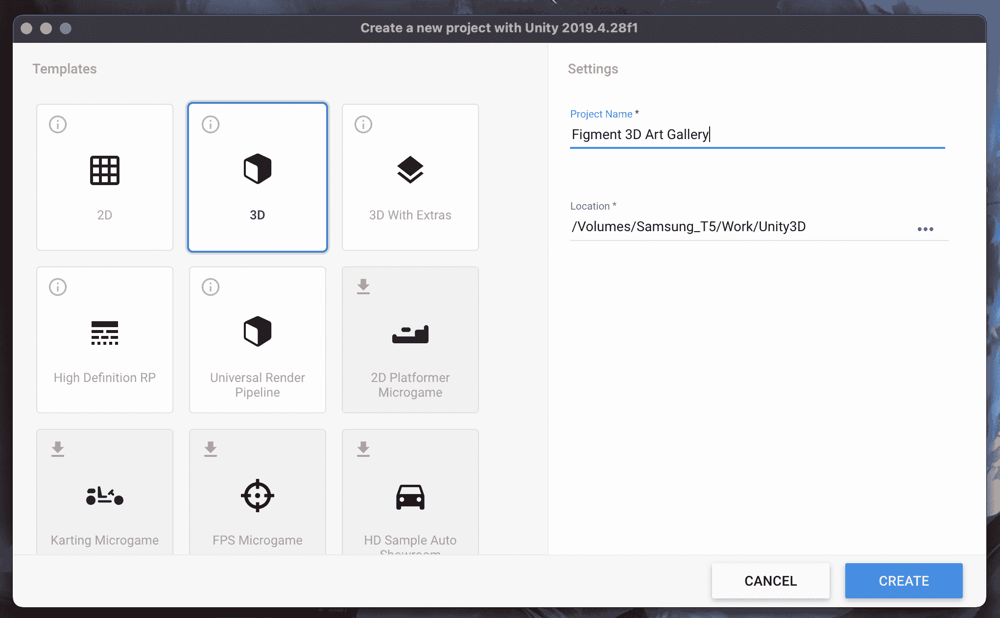](https://github.com/figment-networks/learn-tutorials/raw/master/assets/unity1.png)

这将首先创建一个空的 Unity3D 项目

[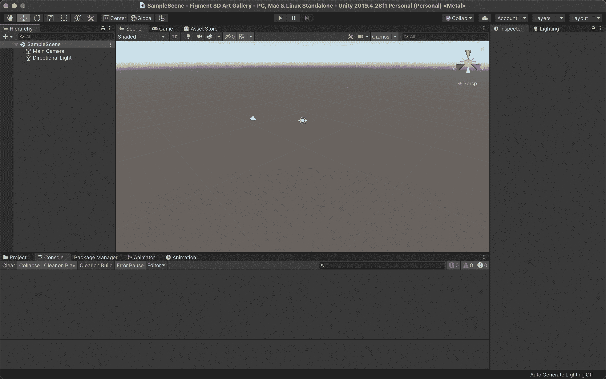](https://github.com/figment-networks/learn-tutorials/raw/master/assets/unity2.png)

Unity3D 的界面分为不同的**窗口、**窗口，每个窗口都有其独特的用途。这些窗口可以由开发者自由安排，因此它们是通过它们的名字而不是位置来指代的。你可以在这里详细浏览 Unity 的用户界面[。](https://docs.unity3d.com/2019.4/Documentation/Manual/UsingTheEditor.html)

# 项目启动

重要的是要想象我们的最终项目应该是什么样子，我们希望在我们的项目中有什么特点。我们希望我们项目中的 kew 特性是:

*   一个 3D 虚拟世界，代表一个艺术画廊，玩家可以自由模式。
*   各种各样的艺术作品必须在这个美术馆里展出。
    *   这件艺术品将代表 NFT 在区块链展出。
    *   将只显示市场智能合同中列出的 NFT。
*   当用户靠近 NFT 时，他们应该能够查看关于 NFT 的信息。

[用 Unity 创建个人 3D 画廊项目](https://learn.unity.com/project/create-a-personal-3d-gallery-project-with-unity?uv=2019.4)是一个官方的 Unity 教程，教我们如何创建一个艺术画廊。在构建我们的项目时，我们将从本教程中获得灵感，并使用这里的一些可用资源。

**注意:**在您的游戏中使用任何资产之前，请确保这些资产的创造者所使用的许可形式以及您合法地有权使用这些资产。

## 营造环境

为了本教程的简单，我们不打算自己设计三维艺术画廊。相反，我们将在这里使用已经可用的。解压缩下载的`.zip`文件，并将它们导入我们的 Unity 项目。为此，将提取的文件夹拖放到`The Project Window`中。

[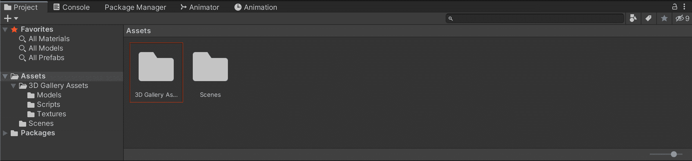](https://github.com/figment-networks/learn-tutorials/raw/master/assets/unity3.png)

成功导入后，您将看到该文件夹出现。但是，该名称可能会有所不同，这取决于所提取文件夹的名称。这个文件夹里面会有另外一个文件夹叫做`Models`，打开这个文件夹。这里你会注意到我们有一个名为`museum`的预置。

[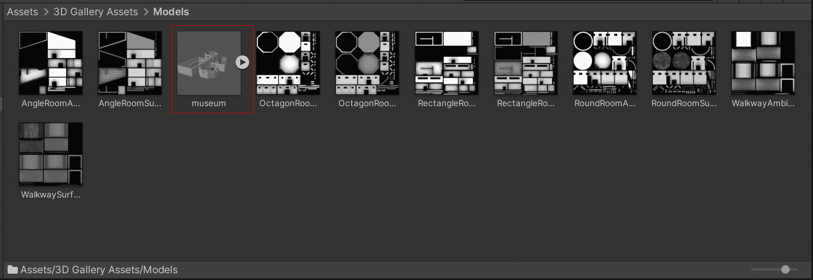](https://github.com/figment-networks/learn-tutorials/raw/master/assets/unity4.png)

将此拖至`The Hierarchy Window`。在检查器窗口中，确保资产的坐标为`X:0, Y:0, Z:0`并缩放至`X:10, Y: 10, Z:10`。所以最后看起来应该是这样的:

[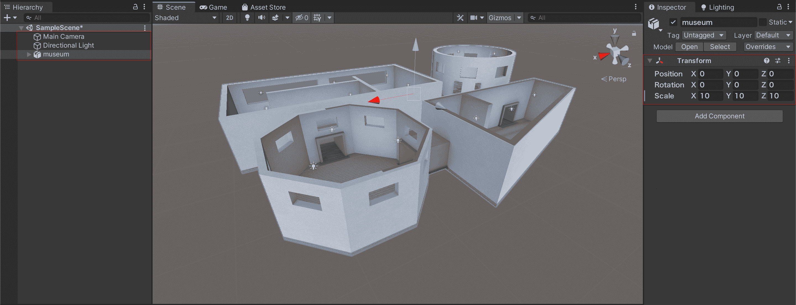](https://github.com/figment-networks/learn-tutorials/raw/master/assets/unity5.png)

## 添加网格碰撞器

碰撞器是 Unity 用来检测碰撞的一种特殊类型的组件。你可以把对撞机想象成一层皮肤。你可以在这里阅读更多关于对撞机的信息。我们将在我们的博物馆模型中添加一个网格碰撞器，这样一旦我们添加了玩家游戏对象，我们就可以检测到碰撞。

展开`museum`游戏对象并选择所有子组件。然后从`Inspector Window`点击**添加组件**按钮并选择`Mesh Collider`。

[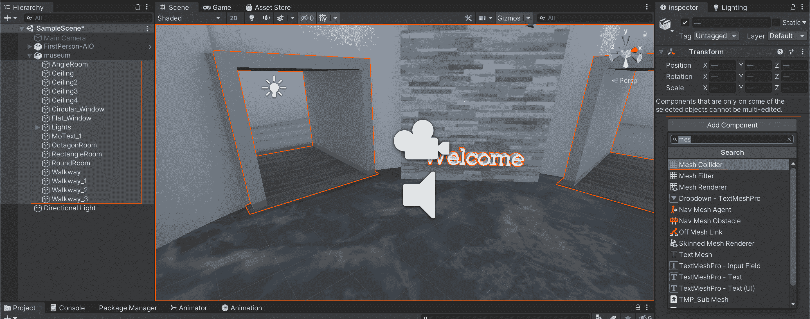](https://github.com/figment-networks/learn-tutorials/raw/master/assets/unity6.png)

## 创建基本播放器

现在我们已经准备好了我们的游戏世界，让我们创建一个角色来代表游戏世界中的玩家。在本教程中，我们将把游戏创建为 FPS(第一人称射击游戏)，这意味着玩家将以第一人称视角与游戏世界互动。

使用键盘和鼠标，我们应该能够让我们的角色跑，走，跳和环顾四周。我们为此需要的模块通常被称为“**第一人称控制器**”。我们将使用的控制器在`Unity Asset Store`可用。

打开资产存储窗口。如果不可见，从顶部菜单的`Window`选项中选择`Asset Store`。搜索“[第一人称 All In One](https://assetstore.unity.com/packages/tools/input-management/first-person-all-in-one-135316) ”。点击**添加到我的资产**，然后点击**接受**以接受条款和条件。现在点击**导入**按钮。这将打开`Import Unity Package`窗口。默认情况下一切都会被选中，如果没有点击**全部**按钮，然后点击**导入**。

[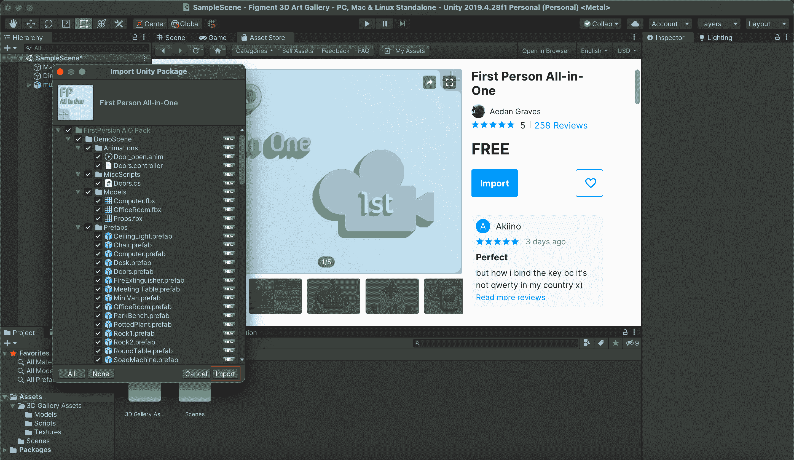](https://github.com/figment-networks/learn-tutorials/raw/master/assets/unity7.png)

这将把整个包导入到我们的项目中，您可以在`The Project Window`中看到它。如果您看到任何黄色警告消息，请忽略。

点击`FirstPersionAIO → FirstPersonAIO`选择`FirstPerson-AIO`预设。将预设(蓝色盒子)拖放到`Hierarchy Window`中。确保控制器不是另一个游戏对象的子对象。当游戏开始时，你可以把你的角色放在博物馆内任何你想让你的角色产卵的地方。我把我的放在有欢迎标志的`RoundRoom`里。

[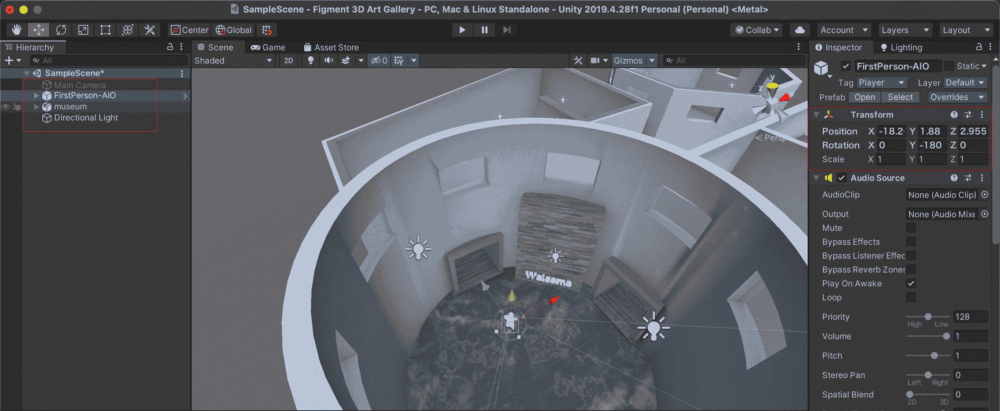](https://github.com/figment-networks/learn-tutorials/raw/master/assets/unity8.png)

这个`FirstPerson-AIO`已经连接了一个摄像头，它将作为我们的主摄像头。删除或取消激活`MainCamera`组件，因为我们创建了一个空白的 unity 项目。

点击播放按钮。你可以在游戏中自由活动。

# 展示艺术品

在我们开始展示来自区块链的 NFT 之前，让我们创建一个要展示的演示艺术品。

我们将使用资产商店的[经典相框](https://assetstore.unity.com/packages/3d/props/furniture/classic-picture-frame-59038)资产包来制作我们的相框。像导入`First Persion AIO`包一样导入包。如果包被正确导入，您可以在`Project Window`中看到一个`Classic Picture Frame`文件夹。

在`Classic Picture Frame`目录中选择`picture`预设，并将其拖动到`Hierarchy Window`中的`museum`对象上，使其成为`museum`游戏对象的子对象。你可以把相框放在你选择的任何地方。在本教程中，它在进入`Rectangle Room`时被放置在前墙，并缩放至`X: 0.2, Y: 0.2, Z: 0.1`。

[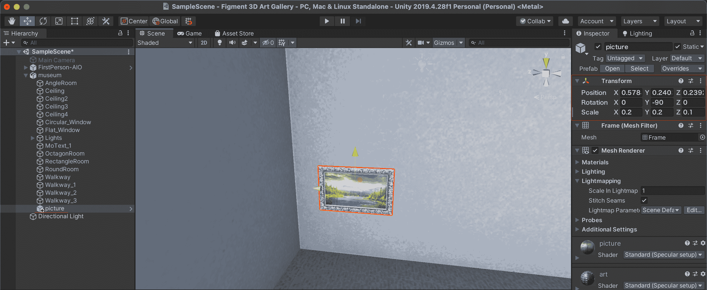](https://github.com/figment-networks/learn-tutorials/raw/master/assets/unity9.png)

我们将把这个游戏对象转换成一个预置，然后当从智能契约中获取 NFT 时，用它来产生新的艺术品。你可以在 Unity 的官方文档[这里](https://docs.unity3d.com/2019.4/Documentation/Manual/Prefabs.html)了解 Prefab 是什么。

在创建预置之前，在根资源目录中创建一个名为`Prefabs`的文件夹并打开它。将`picture`资产从`Hierarchy Window`拖到`Project Window`中。会出现一个弹出窗口，选择`Original Prefab`。这将创建一个新的艺术作品的预制。

## 显示图像细节

现在我们已经有了艺术品，我们想在玩家靠近艺术品时在屏幕上显示与图像相关的各种信息。这些信息将显示为 UI 元素，我们需要一个`Canvas`游戏组件。你可以在官方文件[中阅读更多关于`Canvas`的信息。](https://docs.unity3d.com/Packages/com.unity.ugui@1.0/manual/class-Canvas.html)

在`Hierarchy Window`中点击右键，选择`UI`，选择`Canvas`。这将创建一个新的`Canvas`组件。要正确查看`Canvas`，请将编辑器切换到 2D。

[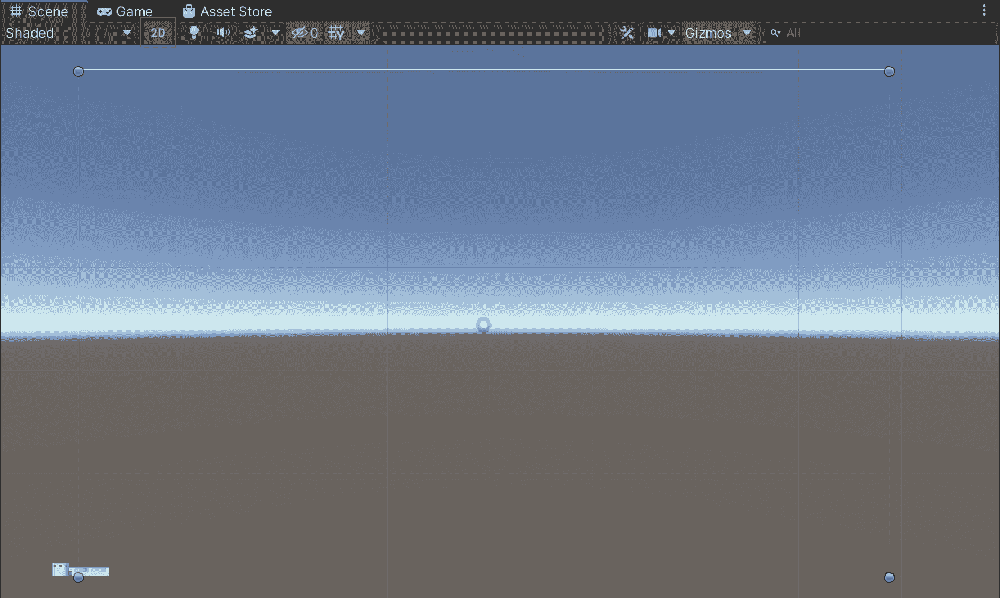](https://github.com/figment-networks/learn-tutorials/raw/master/assets/unity10.png)

现在，我们准备设计如何显示各种细节。为了本教程的简单，我们将在屏幕上以简单文本的形式显示细节。

右击`Canvas`并从`UI`部分选择`Text - TextMeshPro`。

[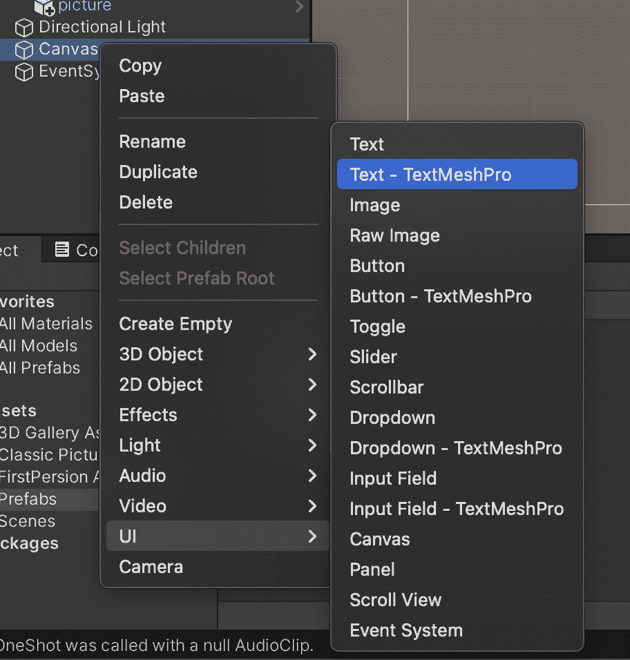](https://github.com/figment-networks/learn-tutorials/raw/master/assets/unity11.png)

这会弹出一个菜单，要求导入 TMP Essentials。点击**导入 TMP Essentials** 按钮。然后点击**导入 TMP 示例&附加功能**。现在，您可以关闭弹出对话框。

屏幕上将出现一个新的文本区域。将游戏对象的名称从`Hierarchy Window`更改为`Title`。在检查器窗口中，将文本字段的内容更改为**“标题”**，并将`Vertex Color`更改为绿色。此外，将文本区域放在屏幕顶部，并确保文本区域占据了大部分可用的水平区域。

[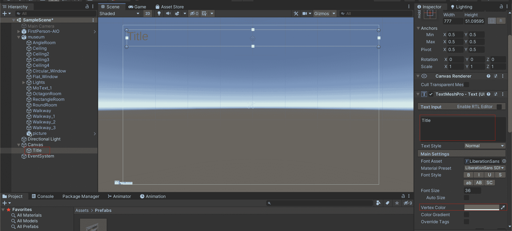](https://github.com/figment-networks/learn-tutorials/raw/master/assets/unity12.png)

NFT 的标题将显示在此区域。文本区域表示要显示的文本可以占据的空间量。文本区域根据我们想要的标题外观放置在画布上。您还可以对文本进行各种更改，如更改字体大小、字体样式等。从`Inspector Window`开始。

我们复制了这个文本区域，并为要显示的各种信息创建了一些附加字段。最终结果应该是这样的:

[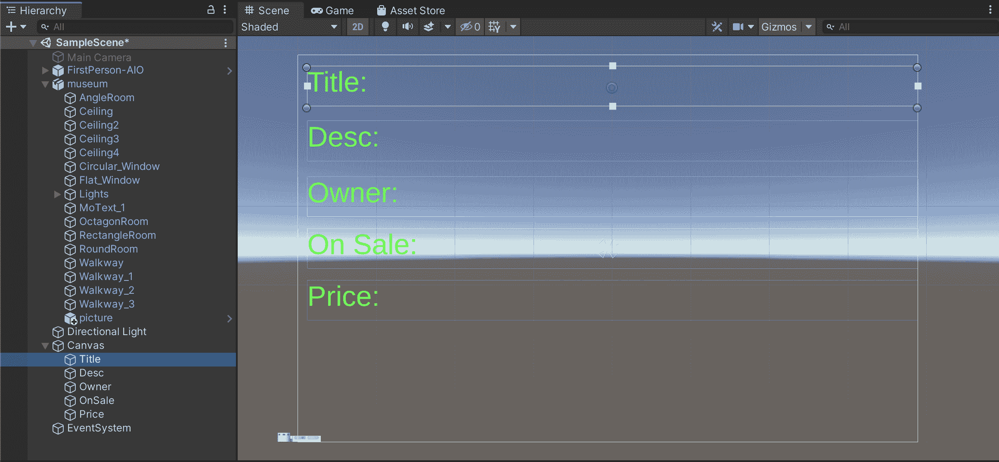](https://github.com/figment-networks/learn-tutorials/raw/master/assets/unity13.png)

所有这些细节将从 NFT ( **标题**和 **Desc** )的元数据中获取，而其他细节(所有者、销售和价格)将从市场智能合同中获取。

现在，您可以切换回 3D 视图。快速点击`Game Window`,预览这些文本字段将如何出现在屏幕上。

[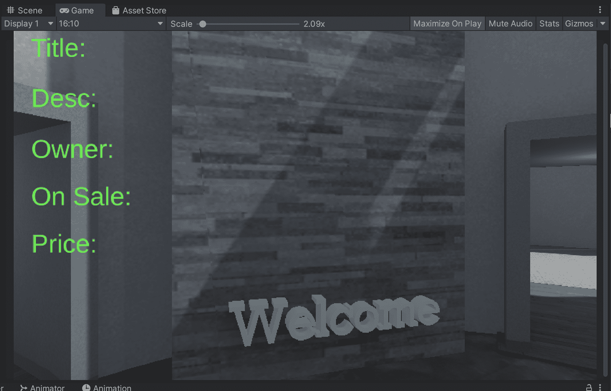](https://github.com/figment-networks/learn-tutorials/raw/master/assets/unity14.png)

## 编写显示信息的脚本

如果现在我们试着玩我们的游戏，你会注意到文本不断出现在屏幕上。我们希望只有当我们靠近一些艺术品时，文本才会出现。为了做到这一点，我们将不得不借助脚本(Uinty3D 使用 C#编写脚本)。在我们开始写脚本之前，我们做了两个小调整:

*   添加标签:使用标签是为了让游戏中使用的任何脚本都可以识别属于特定类型的游戏对象。你可以在这里详细了解[。从`Hierarchy Window`中选择`FirstPerson - AIO`，检查`Inspector Window`的顶部是否贴有`Player`的标签。如果没有，点击下拉菜单并选择`Player`标签。](https://docs.unity3d.com/2019.4/Documentation/Manual/Tags.html)

[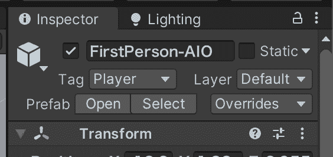](https://github.com/figment-networks/learn-tutorials/raw/master/assets/unity15.png)

*   向 UI 元素添加标签:我们还必须向添加的文本区域添加标签，以便我们的脚本可以轻松地检测到它。为此，从`Hierarchy Window`中选择文本区域(例如标题)，在`Inspector Window,`中点击`Tag`字段旁边的下拉菜单，然后点击`Add Tag...`。点击加号( **+** )图标，创建一个名为 **`Title`** 的新标签，点击**保存**。重复这个过程，创建名为`Desc`、`Owner`、`OnSale`和`Price`的标签。现在从`Hierarchy Window`中选择文本字段，并给它们分配各自的标签。

[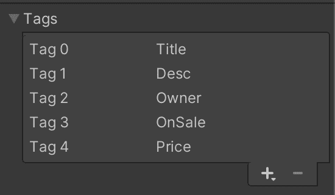](https://github.com/figment-networks/learn-tutorials/raw/master/assets/unity16.png)

现在我们已经准备好开始写脚本了。在`Project Window`的根目录下创建一个名为`Scripts`的新文件夹。在里面创建一个名为`GameScripts`的新目录。因为即使是一个小游戏也可以有多个脚本，所以确保这些脚本组织得当是非常重要的。在`GameScripts`目录中创建一个名为`ProximityScript`的新的 **C#脚本**。

[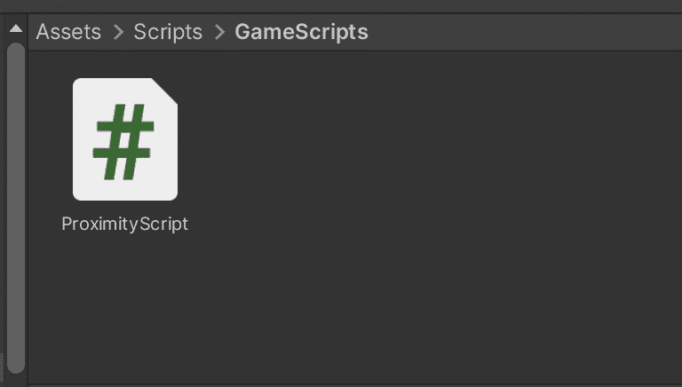](https://github.com/figment-networks/learn-tutorials/raw/master/assets/unity17.png)

在您选择的任何代码编辑器中打开该脚本。我将使用 Visual Studio 编写和编辑 C#脚本。打开`ProximityScript`并粘贴以下代码:

```
using System.Collections;
using System.Collections.Generic;
using UnityEngine;
using TMPro;

public class ProximityScript : MonoBehaviour
{
    public string newTitle;
    public string newDesc;
    public string newOwner;
    public string newIsForSale;
    public string newPrice;

    private Transform other;

    private TMP_Text myTitle;
    private TMP_Text myDesc;
    private TMP_Text artOwner;
    private TMP_Text artIsForSale;
    private TMP_Text artprice;

    private float dist;

    private GameObject player;
    private GameObject artTitle;
    private GameObject desc;
    private GameObject owner;
    private GameObject isForSale;
    private GameObject price;

    private bool check;

    // Start is called before the first frame update
    void Start()
    {
        player = GameObject.FindWithTag("Player");
        other = player.GetComponent<Transform>();

        artTitle = GameObject.FindWithTag("Title");
        desc = GameObject.FindWithTag("Desc");
        owner = GameObject.FindWithTag("Owner");
        isForSale = GameObject.FindWithTag("OnSale");
        price = GameObject.FindWithTag("Price");

        myTitle = artTitle.GetComponent<TMP_Text>();
        myTitle.text = "";

        myDesc = desc.GetComponent<TMP_Text>();
        myDesc.text = "";

        artOwner = owner.GetComponent<TMP_Text>();
        artOwner.text = "";

        artIsForSale = isForSale.GetComponent<TMP_Text>();
        artIsForSale.text = "";

        artprice = price.GetComponent<TMP_Text>();
        artprice.text = "";

        check = false;
    }

    // Update is called once per frame
    void Update()
    {
        if (other)
        {
            dist = Vector3.Distance(transform.position, other.position);
            if (dist < 4)
            {
                myTitle.text = newTitle;
                myDesc.text = newDesc;
                artOwner.text = newOwner;
                artIsForSale.text = newIsForSale;
                artprice.text = newPrice;

                check = true;
            }
            if (dist > 4 && check == true)
            {
                Start();
            }
        }
    }
}
```

让我们来理解代码:

*   默认情况下，`Start`函数仅在游戏对象被加载时被调用一次，而只要游戏对象存在于游戏中，`Update`函数每帧被调用一次。你可以在这里阅读 Unity3D [的脚本基础。](https://docs.unity3d.com/2019.4/Documentation/Manual/ScriptingSection.html)

*   我们借助`using`关键字导入某些库。unity 项目中的大多数脚本都需要前 3 个导入的库，它们帮助脚本与游戏引擎进行交互。`TMPro`库用于与 UI 元素和文本框交互。

*   然后我们定义名为`ProximityScript`的类并继承`MonoBehaviour`类。类名应该总是相同的。`MonoBehaviour`是每个 Unity 脚本的基类。在[文档](https://docs.unity3d.com/2019.4/Documentation/Manual/class-MonoBehaviour.html)中了解更多信息。

*   我们定义了一些公共变量来存储将在屏幕上显示的各种数据。稍后，这个变量将由另一个脚本设置，该脚本将从我们的 Marketplace 智能合约加载艺术品。

*   类型为`Transform`的变量用于存储游戏对象的坐标，变量`other`将存储玩家的当前坐标。

*   我们创建的文本框是类型`Text Mesh Pro`的，因此我们创建类型`TMP_Text`的变量来引用这些文本框。

*   `dist`变量将用于计算玩家和作品之间的距离。

*   游戏世界中存在的一切(3D 对象或 2D UI 元素)都属于`GameObject`类。我们创建类型为`GameObject`的变量来存储对各种游戏对象的引用。

*   在`Start()`函数中，我们使用`GameObject.FindWithTag()`函数来查找持有特定标签的游戏对象。因为我们已经为各种游戏对象(玩家和 UI 元素)分配了特定的标签，所以这一行帮助我们为这些游戏对象创建实例。

*   `GetComponent<>()`函数用于获取游戏对象中的特定组件。我们传递我们想要实例的组件类型。对于玩家，我们需要一个对`Transform`组件的引用，这样我们就可以得到玩家的位置。同样，对于文本区域，它将是类型`TMP_Text`。

*   文本字段的值初始为空白。这将确保游戏加载时屏幕上不显示任何文本。

*   每一帧都会调用`Update()`函数。在这个函数中，我们将首先计算玩家和艺术品之间的距离。如果距离小于阈值，我们修改文本字段以显示与艺术品相关的数据。

    我们使用将两个位置作为参数的`Vector3.Distance()`函数来计算距离。`tranform.position`返回脚本附加到的游戏对象的位置(我们将把这个脚本附加到作品上)，而`other.position`返回玩家的位置，因为我们已经使用了`other`变量来存储带有`Player`标签的游戏对象的`Transform`组件。

*   如果作品和播放器之间的距离小于`4`个单位，我们将修改要显示的文本，以存储与作品相关的数据。

现在我们的脚本已经准备好了，我们把它附加到我们的`picture`游戏对象上。这可以通过以下方式实现:

*   将脚本从`Project Window`拖到`Hierarchy Window`中的`picture`游戏对象中。
*   从`Hierarchy Window`中选择`picture`游戏对象，点击`Inspector Window`中的**添加组件**按钮，搜索添加`ProximityScript`。

一旦附加了脚本，在`Inspector Window`中为`New Title`、`New Desc`、`New Owner`、`New Is For Sale`和`New Price`输入一些测试值。稍后将从一个单独的脚本中设置这些值，但是现在我们设置随机值用于测试。

[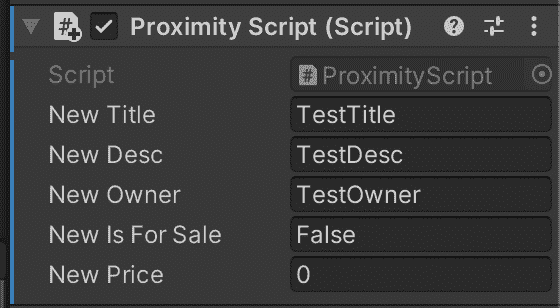](https://github.com/figment-networks/learn-tutorials/raw/master/assets/unity18.png)

现在点击播放按钮。如果一切都做得很好，当你靠近艺术品时，你会看到细节出现在屏幕上，当你远离艺术品时，细节就会消失。

[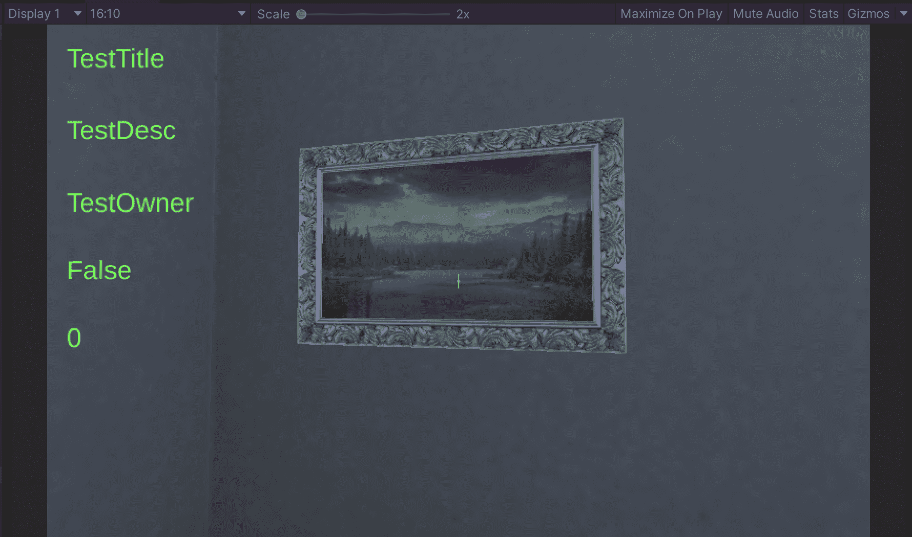](https://github.com/figment-networks/learn-tutorials/raw/master/assets/unity19.png)

否则，一些可能的错误可能是:

*   C#脚本中有一些错误。
*   标签没有正确地与各种游戏对象相关联。

# 导入库

为了与区块链交互，我们需要进行 RPC 调用。在使用 Javascript 构建传统前端应用程序的情况下，我们会使用像`web3.js`这样的库。在 Unity3D 的情况下，没有简单易行的方法来使用 Javascript 库，而是我们必须依赖于用于与以太坊区块链交互的 C#库`Nethereum`。这也可以用来与多边形链交互，在这个例子中是与 Mumbai Testnet 交互。我们还需要单独的库，这样我们就可以从我们的游戏中进行异步调用。

大多数`.Net`项目使用`nuget`作为包管理器，但是在 Unity3D 项目中使用`nuget`很难导入包。这主要是因为 Unity 管理其各种依赖关系的方式。任何要使用的插件，但存储在一个名为`Plugins`的文件夹中，而任何其他依赖项必须作为资产与编译后的`.dll`文件一起导入。

为了简单起见，这两个文件夹的内容都上传到[这里](https://drive.google.com/drive/folders/12bhKyGKBxQQgnIXZD5w_AT2sjVOWyK-Y?usp=sharing)。下载`NEther`和`Plugins`文件夹，将它们拖放到`Project Window`中，直接导入到您的 Unity 项目中。确保两个文件夹都被导入到根`Assets`文件夹中。

[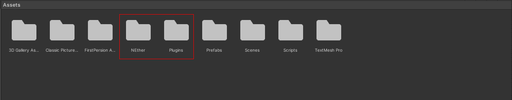](https://github.com/figment-networks/learn-tutorials/raw/master/assets/unity20.png)

`NEther`包含使用`Nethereum`库所需的所有文件和脚本，而`Plugins`文件夹包含将用于进行异步调用的`AsyncAwaitUtil`插件。尽管有许多其他的库可以用于异步调用，但是这个特殊的库似乎可以和`Nethereum`一起顺利工作，而其他的库则会遇到各种各样的错误。

# 编写脚本与区块链互动

现在是我们等待的时候了。现在，我们已经准备好编写与区块链交互的脚本了。首先，我们在`Scripts`文件夹中创建一个名为`HelperScripts`的新文件夹。这个文件夹将存储所有那些不被我们的游戏直接使用，而是充当“助手”的脚本。在这个文件夹中创建一个名为`Constants`的新 C#脚本，并在你最喜欢的 ide 中打开它。这个脚本将存储我们将要使用的所有不同的常量。粘贴以下代码:

```
public class BlockchainConstants
{
    public const string CHAIN = "polygon";
    public const string NETWORK_NAME = "mumbai";
    public const string INFURA_GATEWAY = "https://matic-testnet-archive-rpc.bwarelabs.com";
    public const string MARKETPLACE_ADDRESS = <YOUR MARKETPLACE CONTRACT ADDRESS>;
}

public class ContractConstants
{
    public const string MARKETPLACE_ABI = "[{\"inputs\":[],\"stateMutability\":\"nonpayable\",\"type\":\"constructor\"},{\"anonymous\":false,\"inputs\":[{\"indexed\":true,\"internalType\":\"uint256\",\"name\":\"itemId\",\"type\":\"uint256\"},{\"indexed\":true,\"internalType\":\"address\",\"name\":\"nftContractAddress\",\"type\":\"address\"},{\"indexed\":true,\"internalType\":\"uint256\",\"name\":\"tokenId\",\"type\":\"uint256\"},{\"indexed\":false,\"internalType\":\"address\",\"name\":\"seller\",\"type\":\"address\"},{\"indexed\":false,\"internalType\":\"address\",\"name\":\"owner\",\"type\":\"address\"},{\"indexed\":false,\"internalType\":\"uint256\",\"name\":\"price\",\"type\":\"uint256\"}],\"name\":\"MarketItemListed\",\"type\":\"event\"},{\"inputs\":[{\"internalType\":\"uint256\",\"name\":\"itemId\",\"type\":\"uint256\"}],\"name\":\"buyMarketItem\",\"outputs\":[],\"stateMutability\":\"payable\",\"type\":\"function\"},{\"inputs\":[{\"internalType\":\"uint256\",\"name\":\"newPrice\",\"type\":\"uint256\"}],\"name\":\"changeListingPrice\",\"outputs\":[],\"stateMutability\":\"nonpayable\",\"type\":\"function\"},{\"inputs\":[{\"internalType\":\"uint256\",\"name\":\"itemId\",\"type\":\"uint256\"}],\"name\":\"getMarketItem\",\"outputs\":[{\"components\":[{\"internalType\":\"uint256\",\"name\":\"itemId\",\"type\":\"uint256\"},{\"internalType\":\"address\",\"name\":\"nftContractAddress\",\"type\":\"address\"},{\"internalType\":\"uint256\",\"name\":\"tokenId\",\"type\":\"uint256\"},{\"internalType\":\"address payable\",\"name\":\"seller\",\"type\":\"address\"},{\"internalType\":\"address\",\"name\":\"owner\",\"type\":\"address\"},{\"internalType\":\"uint256\",\"name\":\"price\",\"type\":\"uint256\"},{\"internalType\":\"bool\",\"name\":\"isSold\",\"type\":\"bool\"},{\"internalType\":\"bool\",\"name\":\"isPresent\",\"type\":\"bool\"}],\"internalType\":\"struct Marketplace.MarketItem\",\"name\":\"items\",\"type\":\"tuple\"}],\"stateMutability\":\"view\",\"type\":\"function\"},{\"inputs\":[],\"name\":\"itemCounter\",\"outputs\":[{\"internalType\":\"uint256\",\"name\":\"\",\"type\":\"uint256\"}],\"stateMutability\":\"view\",\"type\":\"function\"},{\"inputs\":[{\"internalType\":\"address\",\"name\":\"nftContractAddress\",\"type\":\"address\"},{\"internalType\":\"uint256\",\"name\":\"tokenId\",\"type\":\"uint256\"},{\"internalType\":\"uint256\",\"name\":\"price\",\"type\":\"uint256\"}],\"name\":\"listMarketItem\",\"outputs\":[],\"stateMutability\":\"payable\",\"type\":\"function\"},{\"inputs\":[],\"name\":\"listingPrice\",\"outputs\":[{\"internalType\":\"uint256\",\"name\":\"\",\"type\":\"uint256\"}],\"stateMutability\":\"view\",\"type\":\"function\"}]";
}
```

市场智能合同的合同地址将存储在`MARKETPLACE_ADDRESS`变量中。这对你来说会有所不同。粘贴您部署的合同的合同地址。如果合同相同，则`ABI`应该相同。如果智能合同通过验证，您可以从块浏览器的**代码**部分复制其 ABI。记得把 ABI 里的`"`换成`\"`。

因为这个脚本不会被用来控制任何游戏对象，我们不会导入任何库，也不会继承`MonoBehaviour`类。

## 查询市场智能合同

在`HelperScripts`文件夹中，创建另一个 C#脚本，命名为`QueryMarketplace`。让我们从导入一些库开始:

```
using System.Collections.Generic;
using System.Numerics;
using System.Threading.Tasks;
using Nethereum.Web3;
using Nethereum.ABI.FunctionEncoding.Attributes;
using Nethereum.Contracts;
```

*   `System.Collections.Generic`使我们能够使用`List<>`数据类型，这有助于存储相同类型的多个值。
*   `System.Numberics`使我们能够使用名为`BigInteger`的新数据类型，它复制了智能合约中使用的类型`uint256`。
*   `System.Threading.Tasks`用于定义用于进行`async`函数调用的`Tasks`，因为异步函数是由 Unity 使用线程概念处理的。
*   `Nethereum`用来与区块链互动。

现在我们定义类。类名应该与文件名相同

```
using System.Collections.Generic;
using System.Numerics;
using System.Threading.Tasks;
using Nethereum.Web3;
using Nethereum.ABI.FunctionEncoding.Attributes;
using Nethereum.Contracts;

public class QueryMarketplace
{
}
```

首先，我们使用关键字`new`创建一个类`Web3`的对象。这个对象将帮助我们对区块链进行 RPC 调用。我们通过传递存储在`BlockchainConstants`类中名为`GATEWAY`的变量中的 RPC Url 来初始化对象。

```
private Web3 web3 = new Web3(BlockchainConstants.GATEWAY);
```

为了在我们的智能契约中调用任何公共函数，我们首先必须定义一个 *FunctionMessage* ，它告诉编译器我们将要调用什么类型的函数、函数接受的参数以及返回值的数据类型。市场智能合约中有两个我们感兴趣的函数，它们是`itemCounter`和`getMarketItem`。对于`itemCounter`，我们将函数消息定义如下:

```
// Function Message for itemCounter
[Function("itemCounter", "uint256")]
public class ItemCounterFunctionMessage : FunctionMessage
{
}
```

在关键字`Function`之后，我们传递两个值作为参数。第一个是我们要调用的函数名，即`itemCounter`，第二个是该函数返回值的数据类型，即`uint256`。然后我们定义一个继承了`FunctionMessage`类的类。如果函数接受任何参数，这些参数将在函数内部定义。因为`itemCounter`函数不接受任何参数，所以这个类是空的。

对于`getMarketItem`函数，我们将函数消息定义为:

```
// Function Message for marketItems
[Function("getMarketItem")]
public class MarketItemsFunctionMessage : FunctionMessage
{
    [Parameter("uint256", "itemId", 1)]
    public BigInteger itemId { get; set; }
}
```

因为`getMarketItem`函数返回一个复合数据类型的 struct，所以我们不在`Function`关键字后传递返回类型。该函数接受一个名为`itemId`的参数，其类型为`uint256`。这是通过在`Parameter`关键字后传递这些值来定义的。`1`表示这是第一个参数。在这个函数的情况下，第一个参数也是这个函数采用的唯一参数。我们定义了一个全局变量`itemId`以及一个 Getter ( `get`)和 Setter。(`set`)，它将包含要传递给函数的值。当使用 FunctionMessage 调用该函数时，存储在该全局变量中的值将作为参数传递给该函数。为了表示类型`uint256`，我们使用了`BigInteger`数据类型。

由于`getMarketItem`返回一个复合数据类型，我们必须定义一个*输出 DTO* ，它将定义函数调用后接收到的值的类型。我们将*去序列化*基于这个输出 DTO 的返回值。输出 DTO 定义为:

```
// Function Output for marketItems (Non-Premitive Type)
[FunctionOutput]
public class MarketItemDTO : IFunctionOutputDTO
{
    [Parameter("uint256", "itemId", 1)]
    public BigInteger itemId { get; set; }

    [Parameter("address", "nftContractAddress", 2)]
    public string nftContractAddress { get; set; }

    [Parameter("uint256", "tokenId", 3)]
    public BigInteger tokenId { get; set; }

    [Parameter("address", "seller", 4)]
    public string seller { get; set; }

    [Parameter("address", "owner", 5)]
    public string owner { get; set; }

    [Parameter("uint256", "price", 6)]
    public BigInteger price { get; set; }

    [Parameter("bool", "isSold", 7)]
    public bool isSold { get; set; }
}
```

在结构上，它与我们定义函数消息的方式非常相似。唯一的关键区别是，我们使用了`FunctionOutput`关键字，继承了`IFunctionOutputDTO`类，在定义`Parameter`时，我们首先传递数据类型，然后传递变量名，后面是索引号。返回值被反序列化并存储在公共变量中，可以使用定义的 setters 来访问这些变量。

现在我们已经定义了`FunctionMessage`和`FunctionOutput`，我们可以编写将用于调用智能契约的函数。

```
// Function to get itemCounter
public async Task<BigInteger> GetItemCounter()
{
    var itemCounterMessage = new ItemCounterFunctionMessage();
    var queryHandler = web3.Eth.GetContractQueryHandler<ItemCounterFunctionMessage>();
    var itemCounter = await queryHandler
        .QueryAsync<BigInteger>(BlockchainConstants.MARKETPLACE_ADDRESS, itemCounterMessage)
        .ConfigureAwait(false);

    return itemCounter;
}
```

我们使用`Task`关键字，因为`async`函数调用是使用多线程的概念进行的。我们定义的第一个函数用于调用`itemCounter`函数，它返回一个由 C#中的`BigInterger`数据类型定义的`uint256`值。

我们首先使用`new`关键字创建一个`ItemCounterFunctionMessage`类的实例，并将其存储在`itemCounterMessage`变量中。然后，我们使用`GetContractQueryHandler`函数创建一个查询处理程序，并在锚括号(< >)内传递`ItemCounterFunctionMessage`类型，以定义要调用的函数的类型。

使用`QueryAsync`函数进行调用，我们在锚括号内传递类型`BigInteger`来表示要返回的数据类型。我们传递存储在`BlockchainConstants`类的变量`MARKETPLACE_ADDRESS`和变量`itemCounterMessage`中的市场智能契约的契约地址。

从函数调用返回的值存储在我们随后返回的`itemCounter`变量中。

以类似的方式，我们定义了调用`getMarketItem`函数的函数。

```
// Function to get all present Market Items
public async Task<MarketItemDTO> GetMarketItem(BigInteger itemId)
{
    var marketItemsMessage = new MarketItemsFunctionMessage() { itemId = itemId };
    var queryHandler = web3.Eth.GetContractQueryHandler<MarketItemsFunctionMessage>();
    var marketItem = await queryHandler
        .QueryDeserializingToObjectAsync<MarketItemDTO>(marketItemsMessage, BlockchainConstants.MARKETPLACE_ADDRESS)
        .ConfigureAwait(false);

    return marketItem;
}
```

这里注意到的主要区别是:

*   在创建 FunctionMessage 的实例时，我们用传递给函数的值来设置变量`itemId`的值。这个存储的值将作为参数传递给函数。
*   在查询处理程序中，我们传递类型为`MarketItemsFunctionMessage`。
*   在进行查询时，我们不使用`QueryAsync`而是使用`QueryDeserializingToObjectAsync`函数，因为返回值将被去序列化为在定位括号内传递的类型，即`MarketItemDTO`。
*   在进行查询时，我们首先传递 FunctionMessage( `marketItemsMessage`)的实例，然后传递 Marketplace 智能合同的合同地址。

最后，我们创建一个结合上述两者的函数，该函数将返回市场智能合约中列出的所有 NFT:

```
public async Task<List<MarketItemDTO>> GetAllMarketItems()
{
    List<MarketItemDTO> allMarketItems = new List<MarketItemDTO>();

    var itemCounter = await GetItemCounter();
    for(int i=0; i<itemCounter; i++)
    {
        var marketItem = await GetMarketItem(i);
        allMarketItems.Add(marketItem);
    }

    return allMarketItems;
}
```

首先我们创建一个`MarketItemDTO`类型的`List`来存储所有返回的 NFT 的细节。首先，我们调用`GetItemCounter`函数来获得智能合约上列出的 NFT 的总数。然后我们遍历可能的 itemIds 并调用`GetMarketItem`函数来获取 NFT 的细节，并使用`Add`关键字将其存储在`List`中。最后我们返回列表。

因此，将所有这些放在一起，`QueryMarketplace`脚本的内容将是:

```
using System.Collections.Generic;
using System.Numerics;
using System.Threading.Tasks;
using Nethereum.Web3;
using Nethereum.ABI.FunctionEncoding.Attributes;
using Nethereum.Contracts;

public class QueryMarketplace
{
    private Web3 web3 = new Web3(BlockchainConstants.GATEWAY);

    // Function Message for itemCounter
    [Function("itemCounter", "uint256")]
    public class ItemCounterFunctionMessage : FunctionMessage
    {
    }

    // Function Message for marketItems
    [Function("getMarketItem")]
    public class MarketItemsFunctionMessage : FunctionMessage
    {
        [Parameter("uint256", "itemId", 1)]
        public BigInteger itemId { get; set; }
    }

    // Function Output for marketItems (Non-Premitive Type)
    [FunctionOutput]
    public class MarketItemDTO : IFunctionOutputDTO
    {
        [Parameter("uint256", "itemId", 1)]
        public BigInteger itemId { get; set; }

        [Parameter("address", "nftContractAddress", 2)]
        public string nftContractAddress { get; set; }

        [Parameter("uint256", "tokenId", 3)]
        public BigInteger tokenId { get; set; }

        [Parameter("address", "seller", 4)]
        public string seller { get; set; }

        [Parameter("address", "owner", 5)]
        public string owner { get; set; }

        [Parameter("uint256", "price", 6)]
        public BigInteger price { get; set; }

        [Parameter("bool", "isSold", 7)]
        public bool isSold { get; set; }
    }

    // #################################### Public Callable Functions ####################################

    // Function to get itemCounter
    public async Task<BigInteger> GetItemCounter()
    {
        var itemCounterMessage = new ItemCounterFunctionMessage();
        var queryHandler = web3.Eth.GetContractQueryHandler<ItemCounterFunctionMessage>();
        var itemCounter = await queryHandler
            .QueryAsync<BigInteger>(BlockchainConstants.MARKETPLACE_ADDRESS, itemCounterMessage)
            .ConfigureAwait(false);

        return itemCounter;
    }

    // Function to get all present Market Items
    public async Task<MarketItemDTO> GetMarketItem(BigInteger itemId)
    {
        var marketItemsMessage = new MarketItemsFunctionMessage() { itemId = itemId };
        var queryHandler = web3.Eth.GetContractQueryHandler<MarketItemsFunctionMessage>();
        var marketItem = await queryHandler
            .QueryDeserializingToObjectAsync<MarketItemDTO>(marketItemsMessage, BlockchainConstants.MARKETPLACE_ADDRESS)
            .ConfigureAwait(false);

        return marketItem;
    }

    public async Task<List<MarketItemDTO>> GetAllMarketItems()
    {
        List<MarketItemDTO> allMarketItems = new List<MarketItemDTO>();

        var itemCounter = await GetItemCounter();
        for(int i=0; i<itemCounter; i++)
        {
            var marketItem = await GetMarketItem(i);
            allMarketItems.Add(marketItem);
        }

        return allMarketItems;
    }

}
```

还有一个错误。如果你使用 Visual Studio 作为编辑器，那么在关键字`BigInteger`下面会有一条红色的曲线。如果您将鼠标悬停在它上面，您将会看到类似以下内容的错误消息:

[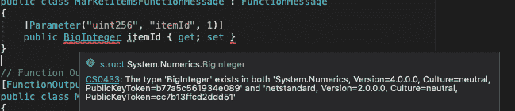](https://github.com/figment-networks/learn-tutorials/raw/master/assets/unity21.png)

要解决这个问题，从`Build Settings`窗口打开`Player Settings`，选择 **API 兼容级别**为`.NET 4.x`

[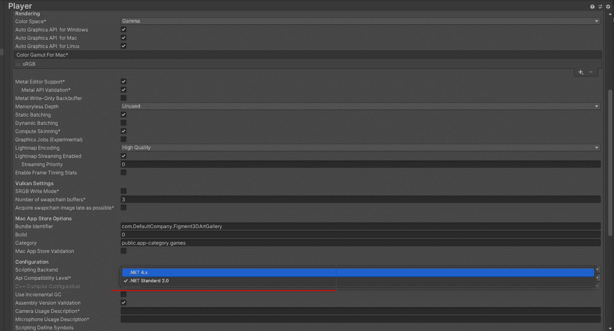](https://github.com/figment-networks/learn-tutorials/raw/master/assets/unity22.png)

## 查询 NFT

类似于`QueryMarketplace`脚本，我们在`HelperScripts`目录中创建一个名为`QueryNFT`的新脚本。这将用于查询 NFT 智能合约，以获取市场智能合约中列出的 NFT 的`tokenURI`。

```
using System.Numerics;
using System.Threading.Tasks;
using Nethereum.Web3;
using Nethereum.ABI.FunctionEncoding.Attributes;
using Nethereum.Contracts;

public class QueryNFT
{
    private Web3 web3 = new Web3(BlockchainConstants.GATEWAY);

    // Function Message for tokenURI
    [Function("tokenURI", "string")]
    public class TokenURIFunctionMessage : FunctionMessage
    {
        [Parameter("uint256","tokenId")]
        public BigInteger tokenId { get; set; }
    }

    // Function to get tokenURI
    public async Task<string> GetTokenURI(BigInteger tokenId, string contractAddress)
    {
        var tokenURIMessage = new TokenURIFunctionMessage() { tokenId = tokenId };
        var queryHandler = web3.Eth.GetContractQueryHandler<TokenURIFunctionMessage>();
        var tokenURI = await queryHandler
            .QueryAsync<string>(contractAddress, tokenURIMessage)
            .ConfigureAwait(false);

        return tokenURI;
    }
}
```

与 QueryMarketplace 的情况一样，我们首先创建一个函数消息，用于调用函数并定义将传递给函数的参数。我们想通过传递类型为`uint256`的`tokenId`来获取`tokenURI`。

我们定义了带两个参数的`GetTokenURI`函数，`tokenId`表示我们想要查询的 NFT 的 tokenId，`contractAddress`包含 NFT 的地址。

## 附加助手脚本

除了这两个助手脚本之外，我们还需要另外两个助手脚本，`ArtworkDetails`和`MetadataFormat`，这两个脚本将帮助我们创建一个表示要显示的所有细节的对象，并分别创建一个存储在 tokenURI 中的元数据的对象。

在`HelperScripts`目录中创建一个名为`ArtworkDetails`的新脚本。这将是一个简单的类，公共变量代表将显示在屏幕上的值，并从市场智能合同中提取。这个变量将是`owner`、`isForSale`和`price`。剩下的变量是艺术品的标题和描述，将从市场合同中获取。`ArtworkDetails`的代码是:

```
public class ArtworkDetails
{
    public string owner;
    public bool isForSale;
    public string price;

    public ArtworkDetails(string owner, bool isForSale, string price)
    {
        this.owner = owner;
        this.isForSale = isForSale;
        this.price = price;
    }
}
```

现在我们将创建一个名为`MetadataFormat`的脚本，用于创建一个包含表示元数据的变量的对象。对于我们的 NFTs，我们将遵循 [OpenSea 元数据标准](https://docs.opensea.io/docs/metadata-standards)。你可以在这里找到这个标准的样本[。它具有以下重要字段:](https://opensea-creatures-api.herokuapp.com/api/creature/3)

*   `attributes`:与 NFT 相关的各种特征形式的属性、它们的值和显示类型的列表。
*   `description`:NFT 的一个小描述。
*   `external_url`:指向与 NFT 相关联的不同网站的 URL。
*   `image`:包含将与 NFT 相关联的图像的链接。
*   `name`:包含 NFT 的名称。

我们在我们的`MetadataFormat`脚本中表示如下:

```
using System.Collections.Generic;

public class Attribute
{
    public string trait_type { get; set; }
    public string value { get; set; }
    public string display_type { get; set; }
}

public class OpenSeaMetadata
{
    public List<Attribute> attributes { get; set; }
    public string description { get; set; }
    public string external_url { get; set; }
    public string image { get; set; }
    public string name { get; set; }
}
```

至此，我们已经准备好了所有的助手脚本。在进入下一节之前，确保在`HelperScripts`目录中有以下脚本

[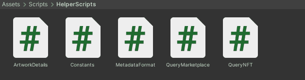](https://github.com/figment-networks/learn-tutorials/raw/master/assets/unity23.png)

## 得到艺术品

我们已经准备好了查询市场智能合同和 NFT 智能合同的脚本，以及其他一些助手脚本。获取和展示艺术品的步骤如下:

1.  获取市场智能合同中列出的所有 NFT。
2.  在游戏世界中孕育艺术作品。
3.  获取 NFT 的 tokenURI 和协定地址。
4.  从`image`字段的元数据中的图像 url 中，获取图像并显示。

步骤 2 的脚本将在后面编写。现在，让我们尝试编写一个脚本，它可以从作为参数传递的 URL 中获取图像，并将其显示为艺术品。这个脚本将被附加到每一个作品。

我们首先在`GameScripts`文件夹中创建一个新脚本，命名为`GetArtwork`。我们从通常的导入语句和定义类开始脚本。由于这个脚本将直接附加到一个游戏对象，并将控制游戏如何工作，我们将继承`MonoBehaviour`类。

```
using System.Collections;
using System.Collections.Generic;
using UnityEngine;
using UnityEngine.Networking;
using Newtonsoft.Json;

public class GetArtwork : MonoBehaviour
{
}
```

现在让我们添加一些全局变量:

```
public Renderer imageRenderer;
public string url;
private ProximityScript proximity;
```

*   `imageRenderer`是一个类型为`Renderer`的对象。我们将使用这个`Renderer`对象来显示我们的图像。
*   `url`是一个变量，它将保存从中获取图像的 url。
*   `proximity`是脚本`ProximityScript`的对象，帮助我们在屏幕上显示细节。

Unity 使用协程管理异步调用。我们将首先定义一个从 url 获取图像的协程。我们将使用`UnityWebRequest`来调用一个 API，并以可以附加到游戏对象的`Textue`的形式获取图像。

```
private IEnumerator GetAndSetTexture(string imageURL)
{ 
    UnityWebRequest www = UnityWebRequestTexture.GetTexture(imageURL);
    yield return www.SendWebRequest();
    while(!www.isDone)
    {
        Debug.Log("Fetching Image Under Progress");
    }
    Texture myTexture = ((DownloadHandlerTexture)www.downloadHandler).texture;   
    imageRenderer.materials[1].SetTexture("_MainTex", myTexture);
}
```

我们使用`UnityWebRequestTexture`类中的`GetTexture`函数来调用传递的`imageURL`，并以纹理的形式重试返回的图像文件。使用`SendWebRequest()`函数发送请求，我们使用`www.isDone`检查是否收到回复。

一旦我们接收到图像，我们使用`downloadHandler`方法获取纹理并将其存储在一个变量中。接下来，我们使用`SetTexture`函数将所需的图像设置为纹理。如果仔细观察，我们游戏中的`picture`有两个相关的材质，第一个是框架，第二个是显示的图像。

[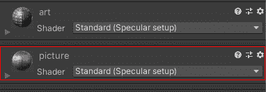](https://github.com/figment-networks/learn-tutorials/raw/master/assets/unity24.png)

我们使用`materials[1]`选择第二个纹理，并将“主纹理”设置为我们想要的纹理。在这里参考官方文档[，了解`SetTexture`功能的更多细节。](https://docs.unity3d.com/2019.4/Documentation/ScriptReference/Material.SetTexture.html)

我们的下一个协程将是用于从 tokenURI 获取元数据的协程。为此，我们将使用来自`UnityWebRequest`类的`Get`函数进行 API 调用。我们还使用来自`JsonConvert`类的`DeserializeObject`函数将返回值转换成我们之前定义的`OpenSeaMetadata`类的对象。最后，我们设置提取标题和描述，并使用`proximity`变量设置值。最后，我们获取 imageURL 并调用`GetAndSetTexture`协程。我们使用`StartCoroutine`来调用一个协程。

```
private IEnumerator GetRequestCoroutine(string uri)
{
    UnityWebRequest www = UnityWebRequest.Get(uri);
    yield return www.SendWebRequest();

    while(!www.isDone)
    {
        Debug.Log("Fetching Metadata Under process");
    }

    if(!string.IsNullOrEmpty(www.error))
    {
        Debug.Log("Error occured while fetching metadata");
    }

    var result = www.downloadHandler.text;

    var metadata = JsonConvert.DeserializeObject<OpenSeaMetadata>(result);

    proximity.newTitle = "Title: " + metadata.name;
    proximity.newDesc = "Desc: " + metadata.description;

    var imageUrl = metadata.image;
    StartCoroutine(GetAndSetTexture(imageUrl));
}
```

接下来我们定义一个`SetArtworkDetails`函数，它接受一个类型为`ArtworkDetails`的参数，并设置要显示的值。

```
private void SetArtworkDetails(ArtworkDetails details)
{
    proximity.newOwner = details.owner;
    if(details.isForSale)
    {
        proximity.newIsForSale = "For Sale";
        proximity.newPrice = details.price;
    }
}
```

最后，我们定义一个名为`GetArtworkDetails`的协程，它将接受 tokenURI 和一个对象`ArtworkDetails`，并调用`GetRequestCoroutine`和`SetArtworkDetails`。

```
public IEnumerator GetArtworkDetails(string URI, ArtworkDetails details)
{
    proximity = gameObject.GetComponent<ProximityScript>();
    StartCoroutine(GetRequestCoroutine(URI));
    SetArtworkDetails(details);
    yield return 0;
}
```

下图总结了调用`GetArtworkDetails`协程后协程的流程。

[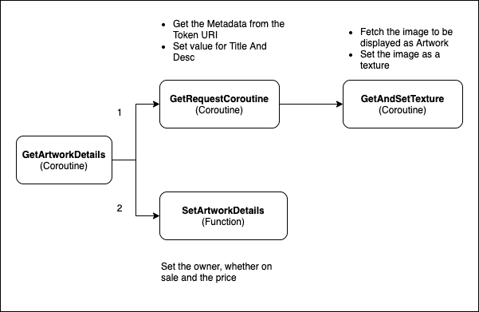](https://github.com/figment-networks/learn-tutorials/raw/master/assets/unity25.png)

综上所述，`GetArtwork`的完整代码是:

```
using System.Collections;
using System.Collections.Generic;
using UnityEngine;
using UnityEngine.Networking;
using Newtonsoft.Json;

public class GetArtwork : MonoBehaviour
{
    public Renderer imageRenderer;
    public string url;
    private ProximityScript proximity;

    private IEnumerator GetAndSetTexture(string imageURL)
    { 
        UnityWebRequest www = UnityWebRequestTexture.GetTexture(imageURL);
        yield return www.SendWebRequest();

        while(!www.isDone)
        {
            Debug.Log("Fetching Image Under Progress");
        }

        Texture myTexture = ((DownloadHandlerTexture)www.downloadHandler).texture;

        imageRenderer.materials[1].SetTexture("_MainTex", myTexture);
    }

    private IEnumerator GetRequestCoroutine(string uri)
    {
        UnityWebRequest www = UnityWebRequest.Get(uri);
        yield return www.SendWebRequest();

        while(!www.isDone)
        {
            Debug.Log("Fetching Metadata Under process");
        }

        if(!string.IsNullOrEmpty(www.error))
        {
            Debug.Log("Error occured while fetching metadata");
        }

        var result = www.downloadHandler.text;

        var metadata = JsonConvert.DeserializeObject<OpenSeaMetadata>(result);

        proximity.newTitle = "Title: " + metadata.name;
        proximity.newDesc = "Desc: " + metadata.description;

        var imageUrl = metadata.image;
        StartCoroutine(GetAndSetTexture(imageUrl));
    }

    private void SetArtworkDetails(ArtworkDetails details)
    {
        proximity.newOwner = details.owner;
        if(details.isForSale)
        {
            proximity.newIsForSale = "For Sale";
            proximity.newPrice = details.price;
        }
    }

    public IEnumerator GetArtworkDetails(string URI, ArtworkDetails details)
    {
        proximity = gameObject.GetComponent<ProximityScript>();
        StartCoroutine(GetRequestCoroutine(URI));
        SetArtworkDetails(details);
        yield return 0;
    }

}
```

在进入下一部分之前，将`GetArtwork`脚本附加到`picture`游戏对象上。这可以通过将脚本拖放到游戏对象上来完成，或者选择游戏对象，点击添加组件按钮，然后搜索并添加`GetArtwork`脚本。

在`Hierarchy Window`中选中`picture`对象，点击`Inspector Window`上的`Overrides`按钮，点击**应用全部**按钮。这将把所有对游戏对象的修改添加到预设中。

# 催生艺术品

现在，我们几乎准备好展示市场智能合同中列出的艺术品。然而，在这样做之前，我们应该能够根据所列的非功能性艺术作品的数量，将这些作品放入我们的博物馆。由于我们的博物馆是固定尺寸的，所以可以列出的艺术品数量是最大的。

因为艺术品必须以一种有组织的方式产生，首先我们必须决定我们想要展示我们的艺术品的地方。我们将这个点称为“种子点”。使用你的设计师技能在整个画廊创造一些产卵点。创建产卵点的步骤是:

1.  决定产卵点的坐标(可以拖动`picture`游戏对象决定自己喜欢的位置，复制`Transform`组件的值)。
2.  创建一个新的**空游戏对象**，并为`Transform`组件设置正确的值。
3.  重复这个过程，直到你已经创建了所有你想要的种子点。

为了简单起见，我定义了 5 个种子点:

[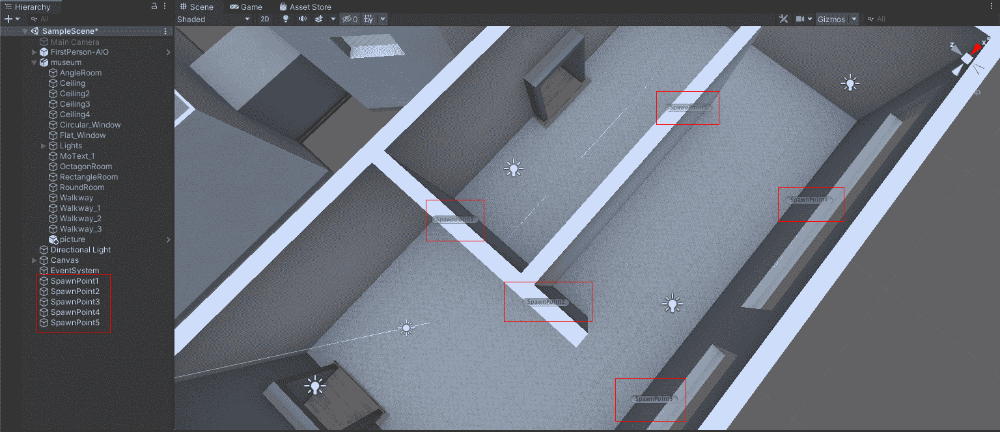](https://github.com/figment-networks/learn-tutorials/raw/master/assets/unity26.png)

为了保持我们的项目有组织，在`Hierarchy Window`中创建一个新的**空游戏对象**，命名为`ArtworkSpawner`并拖动产卵点，使它们成为`ArtworkSpawner`的子对象。

[](https://github.com/figment-networks/learn-tutorials/raw/master/assets/unity27.png)

终于可以放心删除`picture`游戏对象了。

## 写剧本来产生艺术作品

在`GameScripts`目录中，我们将创建另一个脚本来帮助我们生成艺术品。创建一个名为`ArtworkSpawner`的新 C#脚本。

像往常一样，我们从导入依赖项和定义类开始:

```
using System.Collections;
using System.Collections.Generic;
using System.Numerics;
using UnityEngine;

public class ArtworkSpawner : MonoBehaviour
{
}
```

接下来，我们将创建两个全局变量。首先是类型为`GameObject`的`artwork`。这将存储一个预置，我们将在指定的产卵点产卵。接下来是一个名为 spawnPoints 的`Transform`类型列表。这个列表存储了我们在上一步中创建的所有种子点。

接下来我们要写一个函数，这个函数将产生我们的作品。首先，我们将查询 marketplace 智能合同以获得列出的 NFT 总数。由于我们的繁殖点数有限，我们将计算列出的 NFT 数和可用的繁殖点数。如果可用的种子点数少于列出的 NFTs，我们可以只显示我们拥有的种子点数。最后，我们对每个可用的种子点运行一个循环:

*   使用`Instantiate`函数创建一个新的游戏对象，类似于存储在`artwork`变量中的对象。我们将种子点的位置和旋转作为参数传入。
*   我们使用`GetComponent`函数获取一个对附加到游戏对象的`GetArtwork`脚本的引用。
*   接下来，我们获取要显示的 NFT 的合同地址，并使用我们创建的`GetTokenURI`函数获取它的令牌 URI。
*   接下来，我们调用我们在`GetArtwork`脚本中设计的`GetArtworkDetails`协程来显示我们的作品并设置要显示的细节。

脚本将是:

```
using System.Collections;
using System.Collections.Generic;
using System.Numerics;
using UnityEngine;

public class ArtworkSpawner : MonoBehaviour
{
    public GameObject artwork;
    public List<Transform> spawnPoints;

    // Start is called before the first frame update
    void Start()
    {
        spawnArtworks();
    }

    async void spawnArtworks()
    {
        QueryMarketplace queryMarketplace = new QueryMarketplace();
        QueryNFT queryNFT = new QueryNFT();

        // Get a list of all the listed Artworks
        var itemCount = await queryMarketplace.GetItemCounter();
        var allListedArtworks = await queryMarketplace.GetAllMarketItems();

        // Calculate the number of artworks to spawn
        var count = (itemCount <= spawnPoints.Count) ? itemCount : spawnPoints.Count;

        // Spawn the artworks
        for(int i=0; i<count; i++)
        {
            GameObject spawnedObj = Instantiate(artwork, spawnPoints[i].position, spawnPoints[i].rotation);
            var scriptRef = spawnedObj.GetComponent<GetArtwork>();

            string contractAddress = allListedArtworks[i].nftContractAddress;
            string tokenURI = await queryNFT.GetTokenURI(allListedArtworks[i].tokenId, contractAddress);

            ArtworkDetails details = new ArtworkDetails(
                "Owner: " + allListedArtworks[i].owner,
                !allListedArtworks[i].isSold,
                "Price: " + allListedArtworks[i].price + "Wei"
            );

            StartCoroutine(scriptRef.GetArtworkDetails(tokenURI, details));
        }
    }
}
```

现在我们已经准备好了脚本，我们将这个脚本附加到我们创建的`ArtworkSpawner`游戏对象上。现在在`Hierarchy Window`中选择了`ArtworkSpawner`，我们从`Inspector Window`开始设置脚本的公共变量。我们将`Prefabs`文件夹中的`picture`预设拖到`Artwork`字段中。在“繁殖点”字段中，我们输入创建的繁殖点的数量(在本例中为`5`)，然后在相应的字段中逐个拖动每个繁殖点。它应该是这样的:

[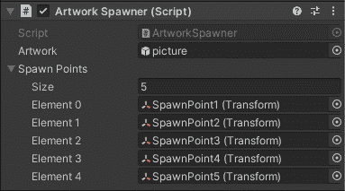](https://github.com/figment-networks/learn-tutorials/raw/master/assets/unity29.png)

现在我们终于准备好测试我们的产品了。

# 运行我们的游戏

创建新的 NFT，并将其列在市场智能合同中。我正在使用[这](https://mumbai.polygonscan.com/address/0x12Fc3C44b4092aD55cf0212fa3A84a1210fCED5f#writeContract)合同创建 NFT 和[这](https://mumbai.polygonscan.com/address/0x9a606932f7F0d07EAd02693D71768268FECc9c88#writeContract)是我的市场合同。现在点击播放按钮。艺术品将在列出的第一个产卵点产卵。当你靠近艺术品时，细节就会出现在屏幕上。

[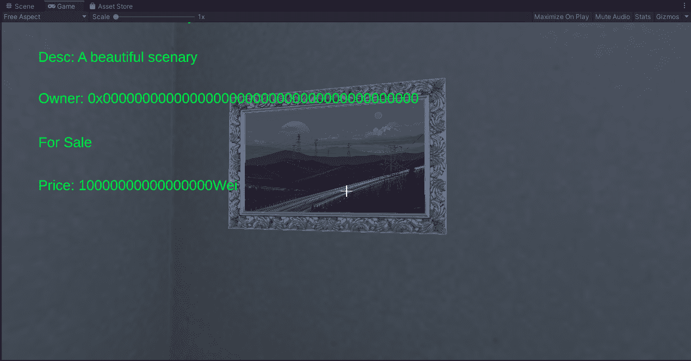](https://github.com/figment-networks/learn-tutorials/raw/master/assets/unity28.png)

恭喜<g-emoji class="g-emoji" alias="tada" fallback-src="https://github.githubassets.cimg/icons/emoji/unicode/1f389.png">🎉</g-emoji> <g-emoji class="g-emoji" alias="tada" fallback-src="https://github.githubassets.cimg/icons/emoji/unicode/1f389.png">🎉</g-emoji> <g-emoji class="g-emoji" alias="tada" fallback-src="https://github.githubassets.cimg/icons/emoji/unicode/1f389.png">🎉</g-emoji>，你的游戏准备好了。

## 构建游戏

在我们结束之前，还有最后一步，即构建我们的游戏，以便它可以在浏览器上运行。请遵循以下步骤:

1.  从文件菜单中打开构建设置。
2.  确保`Target Platform`设置为您选择的操作系统。
3.  点击**构建并运行**按钮。
4.  选择保存构建文件的位置，然后单击 save。

这将启动构建过程，一旦完成，它将运行游戏。你可以玩游戏，也可以和你的朋友分享。

# 结论

祝贺你一路完成了本教程！我们已经从 Unity3D 游戏中学习了如何与智能契约交互。我们已经学习了如何从区块链读取数据并向用户显示信息。我们还学习了尼日琴的基础知识，这是一个 C#库，用于与基于以太琴的区块链进行交互。

# 后续步骤

为了简单起见，我们将本教程限制为只阅读区块链。还可以连接钱包并向区块链提交交易。作为下一步，你也可以尝试建立一个虚拟现实版本的游戏，这将创造一个更加身临其境的体验。

# 关于作者

嗨，我的名字是 Bhaskar Dutta，我是一名区块链开发者，研究员和自由职业者。我总是期待着学习新的东西和讨论关于情景喜剧。想更好的了解我，可以去看看我的 [Github](https://github.com/BhaskarDutta2209) 。

# 参考

*   了解 Unity3D 各个方面的最好地方是他们的官方文档。
*   要了解尼瑟姆，参考他们的[官方文档](http://docs.nethereum.com/en/latest/#:~:text=Nethereum%20is%20the%20.,private%2C%20like%20Quorum%20and%20Besu.)。
*   Nethereum [discord](https://discord.gg/yNHbmSmz) 频道也非常有助于消除疑虑，并了解不同的开发人员如何处理特定的问题。