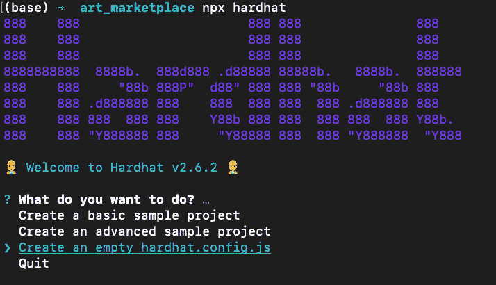
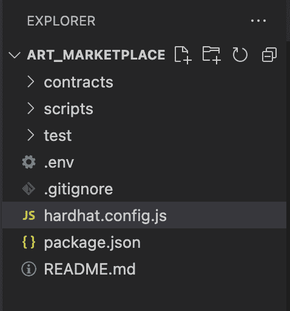
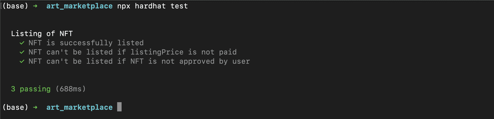
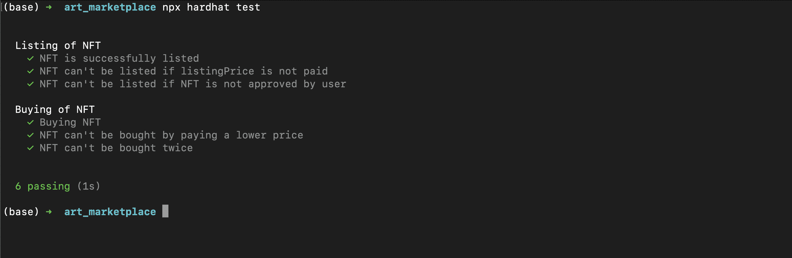
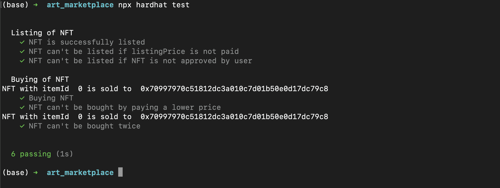
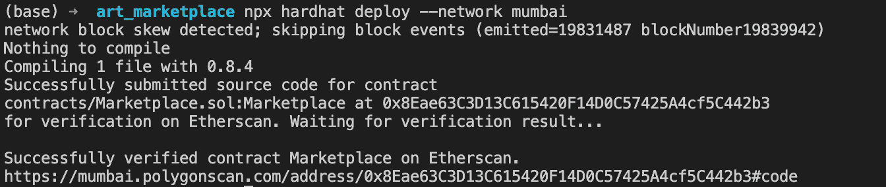

# polygon/Build-a-NFT-Marketplace-using-HardHat

> 原文：<https://github.com/figment-networks/learn-tutorials/blob/master/polygon/Build-a-NFT-Marketplace-using-HardHat.md>

# 介绍

在本教程中，我们将学习如何建立一个 NFT 市场智能合同。我们的市场智能合同将使其用户支付少量费用就可以在合同上列出他们的 NFT。这个 NFT 市场是一个媒介，人们可以在这里买卖他们的非功能性食物。我们将学习如何编写单元测试，如何使用 HardHat 将我们的合同部署到 Polygon Mumbai testnet，以及如何在 Polygonscan 上验证合同源代码，以便它是公开可用的。

# 先决条件

本教程假设您已经完成了[与 HardHat 创建 NFT 智能合同](https://learn.figment.io/tutorials/create-nft-smart-contract-with-hardhat)教程。我们使用该项目构建作为本教程的起点。虽然没有必要完成该教程，但它将让您更好地了解环境设置以及如何使用 HardHat 构建智能合约。

# 要求

*   [Node.js](https://nodejs.org/en/) v14.17.6 LTS 或更高版本，用于安装包。
*   [HardHat](https://hardhat.org/) 是我们将用于开发智能合同的框架。
*   [元掩码](https://metamask.io/)用于与区块链交互。
    *   一旦你安装了 MetaMask，添加一个与 [Polygon Mumbai Testnet](https://docs.matic.network/docs/develop/metamask/config-polygon-on-metamask) 的连接。
    *   记得使用[多边形龙头](https://faucet.polygon.technology/)向您的账户注入 testnet MATIC 代币。
*   一个 [Polygonscan API 密钥](https://polygonscan.com/login?cmd=last)，它将用于使用一个 HardHat 插件在 Polygonscan 上自动验证我们的智能合同源代码。

# 环境设置

我们将首先创建一个空的 HardHat 项目。

创建一个名为`art_marketplace`的新目录，用`cd`命令切换到这个目录，然后运行`npx hardhat`来初始化 HardHat 项目。

`npx hardhat`命令会给你一个菜单，在这里你可以选择如何初始化你的项目

[](https://github.com/figment-networks/learn-tutorials/raw/master/assets/npx_hardhat_basic.png)

我们将从零开始。使用键盘上的箭头键，选择`Create an empty hardhat.config.js`选项并按 Enter 键。

这将创建一个空的`hardhat.config.js`文件和一个`package.json`文件。我们已经在之前的教程[中详细讨论了这个文件的使用，创建一个带有安全帽的 NFT 智能合同](https://learn.figment.io/tutorials/create-nft-smart-contract-with-hardhat)。`package.json`包含了我们安装的所有`npm`包。在继续之前，我们将创建一些文件夹来组织我们的工作。在终端中键入以下内容:

```js
mkdir contracts    # This directory will contain all the smart contract code
mkdir scripts      # This directory will store the scripts we write
mkdir test         # This directory will store all the test scripts we write
touch .env         # This file will store all our private keys
touch .gitignore   # This file will list all the files that are to ignore by the version control system
touch README.md    # The README file for our project which contains descriptive information about it
```

[](https://github.com/figment-networks/learn-tutorials/raw/master/assets/FolderStructure_hh.png)

现在，如果你在你最喜欢的代码编辑器中打开工作目录(我用的是 VSCode)，文件结构应该看起来像这样

现在我们必须安装项目所需的依赖项。将以下内容复制到 package.json 文件中:

```js
{
  "name": "hardhat-project",
  "devDependencies": {
    "@nomiclabs/hardhat-ethers": "^2.0.2",
    "@nomiclabs/hardhat-waffle": "^2.0.1",
    "chai": "^4.3.4",
    "ethereum-waffle": "^3.4.0",
    "ethers": "^5.4.6",
    "hardhat": "^2.6.4"
  },
  "dependencies": {
    "@nomiclabs/hardhat-etherscan": "^2.1.6",
    "@openzeppelin/contracts": "^4.3.2",
    "dotenv": "^10.0.0"
  }
}
```

现在运行以下命令:

```js
npm install 
```

此命令将安装项目所需的所有代码库。所有安装的模块都可以在名为`node_modules`的文件夹中找到。

恭喜<g-emoji class="g-emoji" alias="tada" fallback-src="https://github.githubassets.cimg/icons/emoji/unicode/1f389.png">🎉</g-emoji> <g-emoji class="g-emoji" alias="tada" fallback-src="https://github.githubassets.cimg/icons/emoji/unicode/1f389.png">🎉</g-emoji> <g-emoji class="g-emoji" alias="tada" fallback-src="https://github.githubassets.cimg/icons/emoji/unicode/1f389.png">🎉</g-emoji>，你现在已经准备好开始撰写智能合同了。

# 开发智能合同

在`contracts`文件夹中创建一个名为`Marketplace.sol`的新文件。我们的智能契约的文件名应该以某种方式表明它的功能，尽管文件名完全是您自己选择的。

```js
// SPDX-License-Identifier: Unlicensed

pragma solidity 0.8.4;

contract Marketplace {
}
```

我们首先定义智能合约的许可证。出于本教程的目的，我们将保持我们的合同为`Unlicensed`。接下来，我们用关键字`pragma`定义我们正在使用的实度版本。我们将使用固体版本`0.8.4`。我们还使用`contract`关键字定义了智能合约的名称。请确保定义的合同名称与您创建的文件名称相匹配。

## 导入库

将以下导入语句添加到代码中:

```js
// SPDX-License-Identifier: Unlicensed

pragma solidity 0.8.4;

import "@openzeppelin/contracts/token/ERC721/IERC721.sol";

contract Marketplace {
}
```

`import`关键字用于从作为依赖项安装的 OpenZeppelin 合同中导入`IERC721`智能合同。IERC721 读作 ***接口——ERC 721***。智能合约的接口提供了该智能合约中存在的所有公共功能和事件的高级概述。一个接口只包含函数签名和函数的事件声明。它帮助我们的智能合约调用区块链上的其他智能合约。我们正在导入`IERC721`,因为它是 ERC721 智能合约的接口，ERC 721 智能合约是区块链上许多 NFT 的基础。

## 定义全局变量

对智能合同进行以下更改:

```js
// SPDX-License-Identifier: Unlicensed

pragma solidity 0.8.4;

import "@openzeppelin/contracts/token/ERC721/IERC721.sol";

contract Marketplace {
    uint256 public itemCounter;
    address payable owner;
    uint256 public listingPrice;

    struct MarketItem {
        uint256 itemId;
        address nftContractAddress;
        uint256 tokenId;
        address payable seller;
        address payable owner;
        uint256 price;
        bool isSold;
        bool isPresent;
    }

    mapping(uint256 => MarketItem) private marketItems;

    event MarketItemListed(
        uint256 indexed itemId,
        address indexed nftContractAddress,
        uint256 indexed tokenId,
        address seller,
        address owner,
        uint256 price
    );

    constructor() {
  		itemCounter = 0;
  		owner = payable(msg.sender);
  		listingPrice = 0.01 ether;
		}
}
```

这里我们定义了以下内容:

*   itemCounter:一个公共变量，用于唯一标识智能合约中列出的每个 NFT。

*   owner:该变量存储智能合约所有者的地址。我们使用关键字`payable`表示存储在这个变量中的地址可以直接从智能契约接收付款(在我们的例子中是 MATIC)。这是必要的，因为智能合约的所有者将从智能合约中列出的所有非功能性交易中获得一小笔佣金。

*   listingPrice:该变量用于定义 NFT 上市智能合约所有者收取的佣金金额。

*   MarketItem:我们使用了关键字`struct`来定义一个复合数据类型，称为*结构。*一个结构是一个由多个主要数据类型组成的数据类型。在这种情况下，MarketItem 是一个数据类型，用于表示合同中列出的 NFT。它由以下主要数据类型组成:

    *   itemId:智能合约中列出的每个 NFT 都被分配了一个唯一的 itemId。
    *   nftContractAddress:该变量存储列出的 NFT 所属的智能合约的合约地址。相反，我们也可以说，该变量用于存储智能合约的合约地址，该智能合约用于铸造列出的 NFT。
    *   tokenId:该变量存储平台上列出的 NFT 的 tokenId。
    *   卖家:这是出售 NFT 的账户地址。该地址也被定义为应付款地址，因为卖方将收到买方支付的金额。
    *   owner:一旦从我们的 Marketplace 智能合约中购买了 NFT，此变量将存储拥有该 NFT 的帐户。
    *   价格:这个存储了 NFT 的价格。这个价格是由刊登出售 NFT 的账户设定的。
    *   isSold:该变量存储 NFT 是否出售。
    *   isPresent:因为我们将使用映射将 itemId 映射到单独列出的 NFT，这个变量将有助于检查传递的 itemId 是否有 NFT。
*   marketItems:这是一个用于将`uint256`数据类型映射到`MarketItem`数据类型的`mapping`。该变量用于存储列出的 NFT 的 itemId 与存储在结构 MarketItem 中的该 NFT 的详细信息之间的映射。

*   event MarketItemListed:在智能合约中，无法向控制台写入/输出内容，也无法在日志文件中记录数据。因此，为了维护智能合约执行的重要操作的记录，我们使用了`event`。

    一个事件可以有各种参数来提供关于该事件的附加细节。`indexed`关键字用于引用事件中的某个参数，可以作为查询参数。

最后，我们在构造函数中初始化以下变量:

*   item counter:item counter 变量被初始化为 0。
*   owner:默认情况下，部署智能合约的帐户(部署帐户的地址由`msg.sender`关键字返回)被设置为智能合约的所有者。我们使用关键字`payable`赋值，将`msg.sender`返回的地址类型转换为可以从智能合约接收付款的地址类型。
*   listingPrice:在智能合约上列出每个 NFT 都要收费。我们在`listingPrice`变量中指定这个价格。默认值设置为`0.01 ether`，这意味着列出一个 NFT 需要支付 0.01 Matic。`ether`是在实度中定义的一种特殊类型的单位。你可以在官方文件[这里](https://docs.soliditylang.org/en/v0.8.9/units-and-global-variables.html?highlight=ether#ether-units)阅读更多关于单位`ether`的信息。

## 创建 listMarketItem 函数

添加以下功能:

```js
function listMarketItem(
    address nftContractAddress,
    uint256 tokenId,
    uint256 price
) public payable {
    require(msg.value == listingPrice, "Must pay the listing price");
    require(price > 0, "Price must be greater than 0");

    marketItems[itemCounter] = MarketItem(
        itemCounter,
        nftContractAddress,
        tokenId,
        payable(msg.sender),
        address(0),
        price,
        false,
        true
    );

    IERC721(nftContractAddress).transferFrom(
        msg.sender,
        address(this),
        tokenId
    );

    payable(owner).transfer(listingPrice);

    emit MarketItemListed(
        itemCounter,
        nftContractAddress,
        tokenId,
        msg.sender,
        address(0),
        price
    );

    itemCounter += 1;
}
```

现在让我们理解代码:

*   该函数接受 3 个参数:`nftContractAddress`、`tokenId`和`price`，分别代表 NFT 的合同地址、NFT 的 tokenId 和卖家希望出售的价格。这是一个公共函数，意味着任何人都可以调用这个函数。使用 payable 关键字是因为为了使用该功能，用户必须支付上市费用。
*   `msg.value`返回调用函数时发送的付款金额。发送的金额必须等于智能合约所有者设置的列表价格。`require(msg.value == listingPrice, "Must pay the listing price");`对此进行检查，如果发送的令牌数量(在我们的例子中是 MATIC)不等于指定的列表价格，则返回一个错误。
*   下一个 require 语句确保为合同设置的销售价格不为 0。

```js
marketItems[itemCounter] = MarketItem(
    itemCounter,
    nftContractAddress,
    tokenId,
    payable(msg.sender),
    address(0),
    price,
    false,
    true
);
```

*   这里我们创建了一个类型为`MarketItem`的新对象，并使用我们之前定义的`marketItems`映射将它映射到`itemCounter`的值。`itemCounter`的现值成为我们 NFT 的`itemId`。调用此函数的账户(由`msg.sender`返回)被设置为 NFT 的卖家。我们设置一个空地址(用`address(0)`表示)作为 NFT 的所有者。当有人购买 NFT 时，这种情况将会改变。

```js
IERC721(nftContractAddress).transferFrom(
    msg.sender,
    address(this),
    tokenId
);
```

*   这里，我们首先使用导入的 IERC721 接口创建一个 ERC721 类型的对象。该接口需要 ERC721 合同的地址。`IERC721(nftContractAddress)`返回对部署在`nftContractAddress`变量中存储的地址的 ERC721 契约的引用。ERC721 契约的`transferFrom`函数用于将 NFT 从用户(`msg.sender`返回的地址)转移到智能契约(`address(this)`返回的地址)。

    > 注:为了我们的智能合约能够将 NFT 从用户转移到自身，用户必须首先批准我们的智能合约代表用户花费 NFT。**

*   `payable(owner).transfer(listingPrice)`用于将 MATIC 转移给智能合约的所有者。这一行将为上市支付的费用转移给所有者。

*   在这之后，`emit`关键字被用来创建一个新的事件类型 **MarketItemListed** 。

*   我们将`itemCounter`的值增加 1，这样列出的下一个 NFT 将有一个新的`itemId`。

## 创建 buyMarketItem 函数

添加以下功能:

```js
function buyMarketItem(uint256 itemId) public payable {
    require(marketItems[itemId].isPresent, "Item is not present");
    require(marketItems[itemId].isSold == false, "Item is already sold");
    require(
        marketItems[itemId].price == msg.value,
        "Must pay the correct price"
    );

    marketItems[itemId].isSold = true;
    marketItems[itemId].owner = payable(msg.sender);

    IERC721(marketItems[itemId].nftContractAddress).transferFrom(
        address(this),
        msg.sender,
        marketItems[itemId].tokenId
    );
}
```

现在让我们理解代码:

*   该函数只接受一个参数，即`itemId`。它的类型是 **public** 和 **payable** ，因为任何人都可以调用这个函数来购买 NFT，而为了购买 NFT，在调用这个函数时必须发送价格。
*   该函数检查以下内容:
    *   存在传递了 itemId 的项目。
    *   该物品尚未售出。
    *   发送的金额(用`msg.value`返回)等于为 NFT 支付的价格。
*   此后，商品被标记为已售，NFT 的所有者从空白变为调用该函数的帐户的地址。
*   我们再次使用 IERC721 接口为 ERC721 契约创建一个接口，并将 NFT 从契约本身(由`address(this)`表示)转移到调用该函数的帐户(由`msg.sender`表示)。

## 创建 getMarketItem 函数

编写以下函数:

```js
function getMarketItem(uint256 itemId)
    public
    view
    returns (MarketItem memory items)
{
    items = marketItems[itemId];
}
```

此函数用于返回智能合同中列出的项目的详细信息。我们使用关键字`view`是因为这个函数不改变区块链的状态，只返回一个值。正因为如此，在调用这个功能的同时，不需要支付任何燃气费。

这里我们看到了关键字`returns`的新语法，我们可以传递要返回的变量名。在 solidity 0.8.0 及更高版本中，该语法和传统语法都有效。使用这种语法的一个主要优点是，不需要在函数末尾返回值。该函数返回存储在`items`变量中的值。在函数执行之后，存储在`items`变量中的任何值都将被返回。

## 创建 changeListingPrice 函数

添加以下功能:

```js
function changeListingPrice(uint256 newPrice) public {
    require(newPrice > 0, "Listing Price must be greater than 0");
    require(
        msg.sender == owner,
        "Only the owner can change the listing price"
    );

    listingPrice = newPrice;
}
```

该函数将只接受一个参数`newPrice`，它表示将收取的新的列表价格。契约首先确保新的挂牌价格大于 0。由于只有合同的所有者可以修改标价，接下来我们必须检查调用该函数的帐户是否是所有者帐户。检查通过后，`listingPrice`变量被更新以保存通过`newPrice`参数传递的新值。

## 把所有的放在一起

最终的智能合同应该是:

```js
// SPDX-License-Identifier: Unlicensed

pragma solidity 0.8.4;

import "@openzeppelin/contracts/token/ERC721/IERC721.sol";

contract Marketplace {
    uint256 public itemCounter;
    address payable owner;
    uint256 public listingPrice;

    struct MarketItem {
        uint256 itemId;
        address nftContractAddress;
        uint256 tokenId;
        address payable seller;
        address owner;
        uint256 price;
        bool isSold;
        bool isPresent;
    }

    mapping(uint256 => MarketItem) private marketItems;

    event MarketItemListed(
        uint256 indexed itemId,
        address indexed nftContractAddress,
        uint256 indexed tokenId,
        address seller,
        address owner,
        uint256 price
    );

    constructor() {
        itemCounter = 0;
        owner = payable(msg.sender);
        listingPrice = 0.01 ether;
    }

    function listMarketItem(
        address nftContractAddress,
        uint256 tokenId,
        uint256 price
    ) public payable {
        require(msg.value == listingPrice, "Must pay the listing price");
        require(price > 0, "Price must be greater than 0");

        marketItems[itemCounter] = MarketItem(
            itemCounter,
            nftContractAddress,
            tokenId,
            payable(msg.sender),
            address(0),
            price,
            false,
            true
        );

        IERC721(nftContractAddress).transferFrom(
            msg.sender,
            address(this),
            tokenId
        );

        payable(owner).transfer(listingPrice);

        emit MarketItemListed(
            itemCounter,
            nftContractAddress,
            tokenId,
            msg.sender,
            address(0),
            price
        );

        itemCounter += 1;
    }

    function buyMarketItem(uint256 itemId) public payable {
        require(marketItems[itemId].isPresent, "Item is not present");
        require(marketItems[itemId].isSold == false, "Item is already sold");
        require(
            marketItems[itemId].price == msg.value,
            "Must pay the correct price"
        );

        marketItems[itemId].isSold = true;
        marketItems[itemId].owner = payable(msg.sender);

        IERC721(marketItems[itemId].nftContractAddress).transferFrom(
            address(this),
            msg.sender,
            marketItems[itemId].tokenId
        );
    }

    function getMarketItem(uint256 itemId)
        public
        view
        returns (MarketItem memory items)
    {
        items = marketItems[itemId];
    }

    function changeListingPrice(uint256 newPrice) public {
        require(newPrice > 0, "Listing Price must be greater than 0");
        require(
            msg.sender == owner,
            "Only the owner can change the listing price"
        );

        listingPrice = newPrice;
    }
}
```

恭喜<g-emoji class="g-emoji" alias="tada" fallback-src="https://github.githubassets.cimg/icons/emoji/unicode/1f389.png">🎉</g-emoji> <g-emoji class="g-emoji" alias="tada" fallback-src="https://github.githubassets.cimg/icons/emoji/unicode/1f389.png">🎉</g-emoji> <g-emoji class="g-emoji" alias="tada" fallback-src="https://github.githubassets.cimg/icons/emoji/unicode/1f389.png">🎉</g-emoji>！您的智能合约已准备好接受测试。

# 测试我们的智能合约

既然我们的智能合同已经完成，测试它的功能以避免任何明显的错误进入生产环境是很重要的。我们将针对以下内容测试我们的智能合约:

*   NFT 上市:
    *   NFT 成功上市
    *   如果不支付上市价格，NFT 就不能上市
    *   如果 NFT 未经用户批准，则 NFT 不能上市
*   购买 NFT:
    *   购买 NFT
    *   NFT 是不能用更低的价格买到的
    *   NFT 买不了两次

## 测试设置

尽管我们已经安装了编写测试用例所需的节点包，但是编写测试用例还有最后一个先决条件。也就是说，我们需要一个 ERC721 契约，我们可以用它在测试时创建 NFT。为此，我们将复制我们在[使用安全帽创建 NFT 智能合同](https://learn.figment.io/tutorials/create-nft-smart-contract-with-hardhat#testing-the-smart-contract)教程中开发的合同。

在`contracts`目录中创建一个名为`Artwork.sol`的新文件，并粘贴以下代码:

```js
//SPDX-License-Identifier: Unlicense
pragma solidity 0.8.4;

import "@openzeppelin/contracts/token/ERC721/ERC721.sol";

contract Artwork is ERC721 {
    uint256 public tokenCounter;
    mapping(uint256 => string) private _tokenURIs;

    constructor(string memory name, string memory symbol) ERC721(name, symbol) {
        tokenCounter = 0;
    }

    function mint(string memory _tokenURI) public {
        _safeMint(msg.sender, tokenCounter);
        _setTokenURI(tokenCounter, _tokenURI);

        tokenCounter++;
    }

    function _setTokenURI(uint256 _tokenId, string memory _tokenURI)
        internal
        virtual
    {
        require(
            _exists(_tokenId),
            "ERC721Metadata: URI set of nonexistent token"
        ); // Checks if the tokenId exists
        _tokenURIs[_tokenId] = _tokenURI;
    }

    function tokenURI(uint256 _tokenId)
        public
        view
        virtual
        override
        returns (string memory)
    {
        require(
            _exists(_tokenId),
            "ERC721Metadata: URI set of nonexistent token"
        );
        return _tokenURIs[_tokenId];
    }
}
```

现在在`test`目录下创建一个名为`market-test.js`的文件。这个文件将包含我们所有的单元测试。使用以下代码导入所需的测试库:

```js
const { expect } = require("chai");
const { ethers } = require("hardhat");
```

## 写作测试

现在我们已经准备好编写测试用例了。让我们从以下内容开始:

```js
describe("Listing of NFT", function () {
  this.beforeEach(async function () {
    const Artwork = await ethers.getContractFactory("Artwork");
    const Marketplace = await ethers.getContractFactory("Marketplace");

    nftContract1 = await Artwork.deploy("Artwork Contract", "ART");
    marketplace = await Marketplace.deploy();

    [account1] = await ethers.getSigners();
    const tokenURI1 =
      "https://opensea-creatures-api.herokuapp.com/api/creature/1";
    const tokenURI2 =
      "https://opensea-creatures-api.herokuapp.com/api/creature/2";

    await nftContract1.connect(account1).mint(tokenURI1);
    await nftContract1.connect(account1).mint(tokenURI2);

    // Approving marketplace to spend NFTs
    await nftContract1.connect(account1).approve(marketplace.address, 0);
  });

  it("NFT is successfully listed", async function () {
    // Listing NFT
    await marketplace
      .connect(account1)
      .listMarketItem(nftContract1.address, 0, ethers.utils.parseEther("0.1"), {
        value: ethers.utils.parseEther("0.01"),
      });

    // Checking if NFT is listed
    const listedNFT = await marketplace.getMarketItem(0);
    expect(listedNFT.nftContractAddress).to.equal(nftContract1.address);
    expect(listedNFT.price).to.equal(ethers.utils.parseEther("0.1"));
  });

  it("NFT can't be listed if listingPrice is not paid", async function () {
    await expect(
      marketplace
        .connect(account1)
        .listMarketItem(
          nftContract1.address,
          0,
          ethers.utils.parseEther("0.1"),
          { value: ethers.utils.parseEther("0") }
        )
    ).to.be.revertedWith("Must pay the listing price");
  });

  it("NFT can't be listed if NFT is not approved by user", async function () {
    await expect(
      marketplace
        .connect(account1)
        .listMarketItem(
          nftContract1.address,
          1,
          ethers.utils.parseEther("0.1"),
          {
            value: ethers.utils.parseEther("0.01"),
          }
        )
    ).to.revertedWith("ERC721: transfer caller is not owner nor approved");
  });
});
```

这里我们正在处理第一种类型的测试用例。

*   `this.beforeEach()`用于定义将在每个测试用例之前执行的代码。在本节中，我们

    *   首先部署用于创建 NFTs 和市场智能合约的 ERC721 智能合约。
    *   然后，我们使用 ERC721 合同制造两个新的 NFT。
    *   我们批准 marketplace 合同，代表拥有 NFT 的帐户使用第一个 NFT(用 tokenId 0 表示),而不批准第二个。
*   `it`用于定义每个单元测试。我们使用定义的`listMarketItem`来列出我们的 NFT。使用`value`参数定义要发送的以太网数量。`ethers.utils.parseEther()`用于将传递的值转换成可以传递给智能合约的等价整数。这意味着如果我们传递 1，它将代表 1 MATIC 或 1 * 10^18.购买上市 NFT 的价格定为 *0.1 MATIC* 。

    然后我们使用`getMarketItem()`函数。因为这是合同中列出的第一个项目，所以 itemId 将为 0。我们确保 NFT 的合同地址与我们用来铸造它的 ERC721 合同地址相匹配。我们还检查价格设置是否正确。

*   在下一个测试用例中，我们在调用函数时传递 0 MATIC。这将返回错误消息“必须支付标价”，使用`to.be.revertedWith()`函数进行检查。该函数检查返回的错误信息。

*   在第三个测试案例中，我们试图列出第二个没有被批准的 NFT。当我们的智能合约试图将 NFT 从所有者转移到自身时，这将产生一个错误。错误信息将为`ERC721: transfer caller is not owner nor approved`。我们再次使用`to.be.revertedWith()`函数来检查这个错误消息。

为了运行测试用例，在控制台中键入以下命令:

```js
npx hardhat test 
```

输出应该是这样的

[](https://github.com/figment-networks/learn-tutorials/raw/master/assets/testingCont1.png)

现在让我们编写第二组测试用例:

```js
describe("Buying of NFT", function () {
  this.beforeEach(async function () {
    const Artwork = await ethers.getContractFactory("Artwork");
    const Marketplace = await ethers.getContractFactory("Marketplace");

    nftContract1 = await Artwork.deploy("Artwork Contract", "ART");
    marketplace = await Marketplace.deploy();

    [account1, account2] = await ethers.getSigners();
    const tokenURI =
      "https://opensea-creatures-api.herokuapp.com/api/creature/1";

    await nftContract1.connect(account1).mint(tokenURI);
    await nftContract1.connect(account1).approve(marketplace.address, 0);
    await marketplace
      .connect(account1)
      .listMarketItem(nftContract1.address, 0, ethers.utils.parseEther("0.1"), {
        value: ethers.utils.parseEther("0.01"),
      });
  });

  it("Buying NFT", async function () {
    prevBalance = await nftContract1.balanceOf(account2.address);
    await marketplace
      .connect(account2)
      .buyMarketItem(0, { value: ethers.utils.parseEther("0.1") });
    presentBalance = await nftContract1.balanceOf(account2.address);

    expect(prevBalance).to.equal(0);
    expect(presentBalance).to.equal(1);
  });

  it("NFT can't be bought by paying a lower price", async function () {
    await expect(
      marketplace
        .connect(account2)
        .buyMarketItem(0, { value: ethers.utils.parseEther("0.01") })
    ).to.be.revertedWith("Must pay the correct price");
  });

  it("NFT can't be bought twice", async function () {
    await marketplace
      .connect(account2)
      .buyMarketItem(0, { value: ethers.utils.parseEther("0.1") });
    await expect(
      marketplace
        .connect(account2)
        .buyMarketItem(0, { value: ethers.utils.parseEther("0.1") })
    ).to.be.revertedWith("Item is already sold");
  });
});
```

*   在运行测试用例之前，我们确保部署了 ERC721 和我们的 Marketplace 合同，并且在我们的合同中列出了 NFT。NFT 以 0.1 MATIC 的售价上市。
*   为了检查`buyMarketItem()`函数是否正常工作，我们首先连接一个新帐户(这里是`account2`)并调用该函数，将 itemId (itemId 将是合同中列出的第一个商品的`0`)作为参数传递，然后使用`value`参数发送 NFT 的价格。我们使用 ERC721 智能合约中的`balanceOf`函数，在交易前后找到账户余额。购买前的余额应该是 0，交易后应该是 1。这将证明 NFT 是成功购买的。
*   为了检查是否有可能以比列出的价格更低的价格购买 NFT，我们尝试在`value`参数中传递一个更低的值。这应该会返回我们定义的错误消息，即“必须付出正确的代价”。
*   为了检查是否可能两次购买相同的 NFT，我们尝试用相同的`itemId`调用`buyMarketItem()`两次。第一次，它将按预期工作，并将 NFT 转移到购买 NFT 的帐户，但是第二次，它将返回一个错误消息“项目已经售出”，这表明它是不可能购买 NFT 一旦已经售出。

综上所述，测试文件的最终内容将是:

```js
const { expect } = require("chai");
const { ethers } = require("hardhat");

describe("Listing of NFT", function () {
  this.beforeEach(async function () {
    const Artwork = await ethers.getContractFactory("Artwork");
    const Marketplace = await ethers.getContractFactory("Marketplace");

    nftContract1 = await Artwork.deploy("Artwork Contract", "ART");
    marketplace = await Marketplace.deploy();

    [account1] = await ethers.getSigners();
    const tokenURI1 =
      "https://opensea-creatures-api.herokuapp.com/api/creature/1";
    const tokenURI2 =
      "https://opensea-creatures-api.herokuapp.com/api/creature/2";

    await nftContract1.connect(account1).mint(tokenURI1);
    await nftContract1.connect(account1).mint(tokenURI2);

    // Approving marketplace to spend NFTs
    await nftContract1.connect(account1).approve(marketplace.address, 0);
  });

  it("NFT is successfully listed", async function () {
    // Listing NFT
    await marketplace
      .connect(account1)
      .listMarketItem(nftContract1.address, 0, ethers.utils.parseEther("0.1"), {
        value: ethers.utils.parseEther("0.01"),
      });

    // Checking if NFT is listed
    const listedNFT = await marketplace.getMarketItem(0);
    expect(listedNFT.nftContractAddress).to.equal(nftContract1.address);
    expect(listedNFT.price).to.equal(ethers.utils.parseEther("0.1"));
  });

  it("NFT can't be listed if listingPrice is not paid", async function () {
    await expect(
      marketplace
        .connect(account1)
        .listMarketItem(
          nftContract1.address,
          0,
          ethers.utils.parseEther("0.1"),
          { value: ethers.utils.parseEther("0") }
        )
    ).to.be.revertedWith("Must pay the listing price");
  });

  it("NFT can't be listed if NFT is not approved by user", async function () {
    await expect(
      marketplace
        .connect(account1)
        .listMarketItem(
          nftContract1.address,
          1,
          ethers.utils.parseEther("0.1"),
          {
            value: ethers.utils.parseEther("0.01"),
          }
        )
    ).to.revertedWith("ERC721: transfer caller is not owner nor approved");
  });
});

describe("Buying of NFT", function () {
  this.beforeEach(async function () {
    const Artwork = await ethers.getContractFactory("Artwork");
    const Marketplace = await ethers.getContractFactory("Marketplace");

    nftContract1 = await Artwork.deploy("Artwork Contract", "ART");
    marketplace = await Marketplace.deploy();

    [account1, account2] = await ethers.getSigners();
    const tokenURI =
      "https://opensea-creatures-api.herokuapp.com/api/creature/1";

    await nftContract1.connect(account1).mint(tokenURI);
    await nftContract1.connect(account1).approve(marketplace.address, 0);
    await marketplace
      .connect(account1)
      .listMarketItem(nftContract1.address, 0, ethers.utils.parseEther("0.1"), {
        value: ethers.utils.parseEther("0.01"),
      });
  });

  it("Buying NFT", async function () {
    prevBalance = await nftContract1.balanceOf(account2.address);
    await marketplace
      .connect(account2)
      .buyMarketItem(0, { value: ethers.utils.parseEther("0.1") });
    presentBalance = await nftContract1.balanceOf(account2.address);

    expect(prevBalance).to.equal(0);
    expect(presentBalance).to.equal(1);
  });

  it("NFT can't be bought by paying a lower price", async function () {
    await expect(
      marketplace
        .connect(account2)
        .buyMarketItem(0, { value: ethers.utils.parseEther("0.01") })
    ).to.be.revertedWith("Must pay the correct price");
  });

  it("NFT can't be bought twice", async function () {
    await marketplace
      .connect(account2)
      .buyMarketItem(0, { value: ethers.utils.parseEther("0.1") });
    await expect(
      marketplace
        .connect(account2)
        .buyMarketItem(0, { value: ethers.utils.parseEther("0.1") })
    ).to.be.revertedWith("Item is already sold");
  });
});
```

我们可以通过在控制台中键入以下命令来运行测试:

```js
npx hardhat test
```

预期的输出将是:

[](https://github.com/figment-networks/learn-tutorials/raw/master/assets/testingCont2.png)

# Console.log() in solidity

hardhat 展示的一个很酷的功能是能够将数据记录到控制台上。HardHat 使得在我们的智能契约中使用`console.log()`语句成为可能。这使得将任何东西打印到控制台/终端成为可能，这在测试和调试期间非常方便。让我们快速了解一下。

我们从使用`import`关键字导入`console.sol`库开始。

```js
import "hardhat/console.sol";
```

我们将使用`console.log()`函数来打印账户购买 NFT 时的详细信息。在`buyMarketItem()`功能中进行以下更改:

```js
function buyMarketItem(uint256 itemId) public payable {
	  // Code has been removed for display purposes
    console.log("NFT with itemId ", itemId, "is sold to ", msg.sender);
}
```

现在让我们用`npx hardhat test`命令再次运行测试。输出将是:

[](https://github.com/figment-networks/learn-tutorials/raw/master/assets/testingCont3.png)

在我们运行测试时,`console.log()`语句打印该值。

请注意，当合同部署到任何区块链时，`console.log()`声明没有用，仅用于测试。因此，在我们着手部署合同之前，移除这条线是很重要的，否则它将消耗更多的天然气。

# 部署合同

在我们将智能合约部署到 Polygon Mumbai testnet 之前，我们需要设置一些环境变量。在我们项目的根目录下创建一个名为`.env`的新文件，并存储 Polygonscan 的 API 密钥和您想要用来部署智能契约的帐户的私钥。

```js
POLYGONSCAN_KEY=Paste the API key here
PRIVATE_KEY=Paste the private key here 
```

现在修改`harhat.config.js`的内容如下:

```js
require("@nomiclabs/hardhat-waffle");
require("@nomiclabs/hardhat-etherscan")
require("dotenv").config();

task("deploy", "Deploy the smart contracts", async(taskArgs, hre) => {

  const Marketplace = await hre.ethers.getContractFactory("Marketplace");
  const marketplace = await Marketplace.deploy();

  await marketplace.deployed();

  await hre.run("verify:verify", {
    address: marketplace.address,
    constructorArguments: []
  })

})

/**
 * @type import('hardhat/config').HardhatUserConfig
 */
module.exports = {
  solidity: "0.8.4",
  networks: {
    mumbai: {
      url: "https://matic-testnet-archive-rpc.bwarelabs.com",
      accounts: [
        process.env.PRIVATE_KEY
      ]
    }
  },
  etherscan: {
    apiKey: process.env.POLYGONSCAN_KEY
  }
};
```

你可以参考[这里的](https://learn.figment.io/tutorials/create-nft-smart-contract-with-hardhat#modifying-the-config-file)来更详细的了解这个文件的内容。需要注意的要点是:

*   坚固的版本。我们已经使用版本`0.8.4`来编写我们的智能合同，因此这里指定的版本应该与用于编写合同的版本相匹配。
*   在`networks`部分，我们可以定义想要部署的各种网络。
*   在`etherscan`部分，我们定义了 Polygonscan 需要的`apiKey`,以便验证我们的智能契约并在 blockexplorer 中显示其代码。
*   我们还定义了一个名为`deploy`的任务，它将使我们能够部署我们的智能合约，并通过一个命令对其进行验证。

要部署智能合约，请键入以下命令:

```js
npx hardhat deploy --network mumbai 
```

输出如下所示:

[](https://github.com/figment-networks/learn-tutorials/raw/master/assets/deployingandverifying.png)

在您的情况下，合同地址会有所不同。你可以在这里查看我部署的。

## 与智能合同交互

我们现在将与我们的智能合约进行交互，并在我们的市场智能合约中列出上一教程中创建的 NFT。

首先，我们必须批准 MarketPlace smart 合同，以使用我们的 NFT。为此:

1.  复制我们刚刚部署的市场智能合同的合同地址。
2.  去 Polygonscan 打开用于创建 NFT 的合同。
3.  在`Contract`部分，转到`Write Contract`选项卡并连接您的 Metamask 钱包。仔细检查您是否连接到 Mumbai testnet，并选择了用于在 Metamask 中创建 NFT 的相同帐户。
4.  现在，在`approve`函数中，将 NFT 的市场合同地址和令牌 Id 分别粘贴到`to`和`tokenId`字段中，并单击写入按钮。
5.  签署交易并等待交易得到验证。

现在我们在 Polygonscan 中打开市场合同:

1.  在`Contract`部分，转到`Write Contract`选项卡并连接您的 Metamask 钱包。
2.  在`listMarketItem`功能中填写要列出的 NFT 的详细信息。
    *   第一个字段是刊登物品的费用。我们已经将它设置为`0.01 MATIC`
    *   `nftContractAddress`和`tokenId`将取决于你上市的 NFT。
    *   你也可以把你喜欢的任何价格。这将是有人从你这里买下 NFT 的代价。
3.  点击写入按钮。在元掩码弹出窗口中签署事务，并等待事务完成。

恭喜<g-emoji class="g-emoji" alias="tada" fallback-src="https://github.githubassets.cimg/icons/emoji/unicode/1f389.png">🎉</g-emoji> <g-emoji class="g-emoji" alias="tada" fallback-src="https://github.githubassets.cimg/icons/emoji/unicode/1f389.png">🎉</g-emoji> <g-emoji class="g-emoji" alias="tada" fallback-src="https://github.githubassets.cimg/icons/emoji/unicode/1f389.png">🎉</g-emoji>。你已成功将你的 NFT 刊登在市场上，现在可以交易了。

# 结论

在本教程中，我们学习了如何创建一个可用于买卖 NFT 的市场智能合约。我们为市场编写了底层智能合同，对其进行了单元测试以确保其按预期工作，将其部署到孟买测试网并验证了源代码，因此它在 Polygonscan 上是可见的。我们还学习了如何使用 HardHat 的`console.log()`功能将智能合约中的值打印到控制台。我们介绍了一个智能合约如何在同一区块链上调用另一个智能合约，以及我们可以允许其他帐户/智能合约代表我们使用 token。

# 后续步骤

学习之旅永不停息！接下来，我们将学习如何使用像 Unity3D 这样的 3D 游戏引擎来创建一个交互式艺术画廊，玩家可以在这里自由移动，并查看我们的市场智能合同中列出的各种 NFT 艺术品。

# 关于作者

嗨，我的名字是 Bhaskar Dutta，我是一名区块链开发者，研究员和自由职业者。我总是期待着学习新的东西和讨论关于情景喜剧。想更好的了解我，可以去看看我的 [Github](https://github.com/BhaskarDutta2209) 。

# 参考

以下资源对我很有帮助:

1.  [安全帽官方文档](https://hardhat.org/)
2.  [多边形官方文档](https://docs.polygon.technology/)