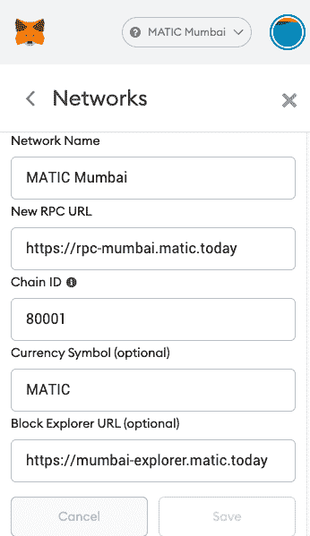

# polygon/Deploying-and-Debugging-the-Smart-Contracts-on-Polygon

> 原文：<https://github.com/figment-networks/learn-tutorials/blob/master/polygon/Deploying-and-Debugging-the-Smart-Contracts-on-Polygon.md>

在本教程中，您将学习如何将智能合约部署到 Polygon (Matic) Mumbai 测试网络。我们还将讨论在部署过程中可能出现的一些错误，以及如何修复它们。所以，拿起一杯咖啡 <g-emoji class="g-emoji" alias="coffee" fallback-src="https://github.githubassets.cimg/icons/emoji/unicode/2615.png">☕️</g-emoji> 跟着一起去吧！

# 先决条件

本教程假设你有一些编程的初级经验和区块链理解。

# 要求

*   [松露](https://www.trufflesuite.com/)
*   [MetaMask](https://metamask.io)

# 入门指南

为了能够通过 MetaMask 与 Mumbai testnet 交互，您首先必须向您的 MetaMask wallet 添加一个 RPC 端点。这将允许您查看您的 MATIC 余额，也可以发送和接收 MATIC 令牌。在浏览器中点击 Fox 图标打开扩展，然后点击扩展窗口右上角的图标，再点击`Settings -> Networks -> Add network`。如下图所示输入信息后，点击**保存**完成该过程。

[](https://github.com/figment-networks/learn-tutorials/raw/master/assets/deploy-&-debug-on-polygon-1.png)

要获得孟买 Matic 令牌，以便您可以支付智能合同部署和测试的汽油费，请访问 MATIC 水龙头，网址为[https://水龙头. matic.network](https://faucet.matic.network) 。选择孟买网络，将你的账户地址粘贴到文本输入中，点击**提交**。

当你完成后，打开 MetaMask 并检查你的钱包-你会看到那里的自动令牌。请记住，孟买测试网上的 MATIC 令牌没有价值，不能与 Mainnet MATIC 交换。


# 块菌配置

truffle-config 文件是一个需要理解的重要文件。在这个文件中，我们必须配置到 Solidity 文件(`contracts_directory`)和合同应用二进制接口(`contracts_build_directory`)的路径。我们还需要定义可用的**网络**。

```js
const HDWalletProvider = require("@truffle/hdwallet-provider")
require('dotenv').config(); // Load .env file

module.exports = {
  networks: {
   // For Ganache, your personal blockchain
   development: {
      host: "127.0.0.1",     // Localhost (default: none)
      port: 8545,            // Standard Ethereum port 
      network_id: "*",       // Any network (default: none)
    },
  },
  contracts_directory: './src/contracts/', // Path to smart contracts
  contracts_build_directory: './src/abis/', // Path to ABIs
  compilers: {
    solc: {
      optimizer: {
        enabled: true,
        runs: 200
      }
    }
  }
}
```

确保您在项目根目录下创建了一个`.env`文件，并将您的变量名称为`MNEMONIC`的(*最好是新生成的且仅用于 testnet 的*)元掩码钱包的 12 个字的秘密恢复短语粘贴到该文件中。这将由 truffle 在运行时加载，然后可以用`process.env.MNEMONIC`访问环境变量。

```js
MNEMONIC=for example put your twelve word BIP39 secret recovery phrase here 
```

现在，让我们将`matic`网络添加到`truffle-config.js`文件中，该文件将包含我们的环境变量助记符和我们想要使用的 RPC 端点 URL。孟买的网络 ID 是`80001`。在这里，您还可以为更快的交易设置气体限制和气体价格。

```js
    matic: {
      provider: () => new HDWalletProvider(process.env.MNEMONIC, 
      `https://rpc-mumbai.matic.today`),
      network_id: 80001,
      confirmations: 2,
      timeoutBlocks: 200,
      skipDryRun: true,
      gas: 6000000,
      gasPrice: 10000000000,
    },
```

# 使用 Truffle 部署智能合约

*   命令:`truffle migrate --network matic`

如果您多次部署一个契约，那么使用`--reset`标志进行部署，以避免 JSON 错误。

*   命令:`truffle migrate --network matic --reset`

如果一切正常，您将看到如下内容:

```js
2_deploy_contracts.js
=====================

   Replacing 'MyContract'
   ------------------
   > transaction hash:    0x1c94d095a2f629521344885910e6a01076188fa815a310765679b05abc09a250
   > Blocks: 5            Seconds: 5
   > contract address:    0xbFa33D565Fcb81a9CE8e7a35B61b12B04220A8EB
   > block number:        2371252
   > block timestamp:     1578238698
   > account:             0x9fB29AAc15b9A4B7F17c3385939b007540f4d791
   > balance:             79.409358061899298312
   > gas used:            1896986
   > gas price:           0 gwei
   > value sent:          0 ETH
   > total cost:          0 ETH

   Pausing for 2 confirmations...
   ------------------------------
   > confirmation number: 5 (block: 2371262) initialized!

   > Saving migration to chain.
   > Saving artifacts
   -------------------------------------
   > Total cost:                   0 ETH

Summary
=======
> Total deployments:   2
> Final cost:          0 ETH 
```

# 部署错误和解决方案

如果您遇到任何这些错误，请按照说明解决它们:

**错误:**

```js
Error: PollingBlockTracker - encountered an error while attempting to update latest block: 
```

**解决方案:**

将`truffle-config`中的 RPC 端点 URL 从“[https://RPC-Mumbai . matic . today](https://rpc-mumbai.matic.today)”更改为 [DataHub RPC 端点](https://datahub.figment.io/services/Polygon)。这将需要您注册一个数据中心帐户，并获得一个多边形 API 密钥。如果您已经有了一个 DataHub 帐户，将您的 API 密匙作为描述性的东西添加到`.env`文件中，比如`DATAHUB_POLYGON_API_KEY`。

```js
    matic: {
      provider: () => new HDWalletProvider(process.env.MNEMONIC, 
      `https://matic-mumbai--jsonrpc.datahub.figment.io/apikey/${process.env.DATAHUB_POLYGON_API_KEY}`),
      network_id: 80001,
      confirmations: 2,
      timeoutBlocks: 200,
      skipDryRun: true,
    },
```

**错误:**

```js
*** Deployment Failed ***

"Migrations" -- only replay-protected (EIP-155) transactions allowed over RPC. 
```

**解决方案:**

Truffle 的`hdwallet-provider`1 . 4 . 0 版本会修复这个错误。

您需要运行`npm install @truffle/hdwallet-provider@1.4.0`(或者`yarn add @truffle/hdwallet-provider@1.4.0`，如果您的项目使用`yarn`而不是`npm`)

**错误:**

```js
Error:  *** Deployment Failed ***

"Migrations" -- Transaction was not mined within 750 seconds, please make sure your transaction was properly sent. Be aware that it might still be mined! 
```

**解决方案:**

只需添加`networkCheckTimeout: 100000`:

```js
    matic: {
      provider: () => new HDWalletProvider(process.env.MNEMONIC, 
      `https://matic-mumbai--jsonrpc.datahub.figment.io/apikey/${process.env.DATAHUB_POLYGON_API_KEY}`),
      network_id: 80001,
      confirmations: 2,
      timeoutBlocks: 200,
      skipDryRun: true,
      networkCheckTimeout: 100000,
    },
```

如果你发现了任何新的错误，并且你知道它的解决方案，那么请随意制作一个 PR，我们将在这里添加你的错误修复。

# 结论

学完本教程后，您将能够:

*   使用 Truffle 在 Polygon (Matic) Mumbai testnet 上部署智能合约。
*   解决部署智能合同时出现的任何错误。

# 关于作者

Akhilesh Thite 是一名印度技术爱好者，热衷于软件开发、开源和去中心化。你可以在 [GitHub](https://github.com/AkhileshThite) 上和他联系。

# 参考

*   块菌文件:[https://www.trufflesuite.com/docs/truffle/overview](https://www.trufflesuite.com/docs/truffle/overview)
*   多边形(Matic)文档:[https://docs . Matic . network/docs/develop/getting-started](https://docs.matic.network/docs/develop/getting-started)