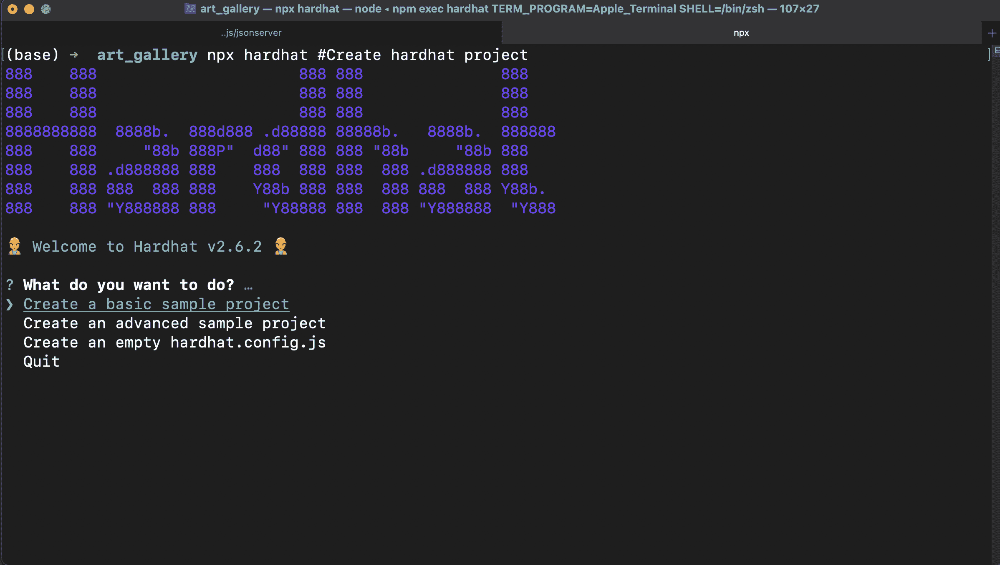
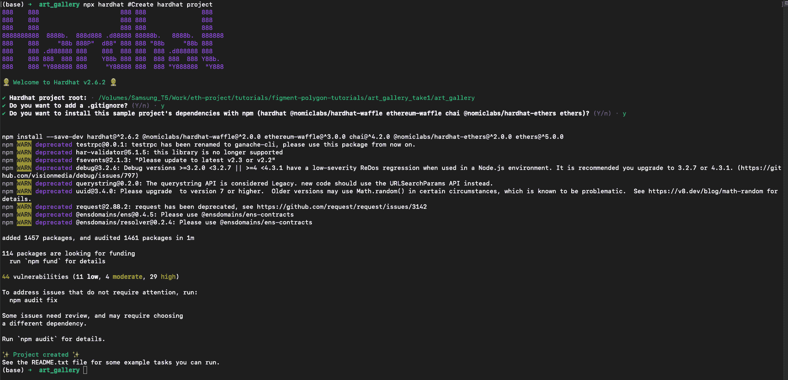
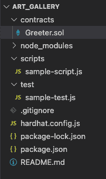
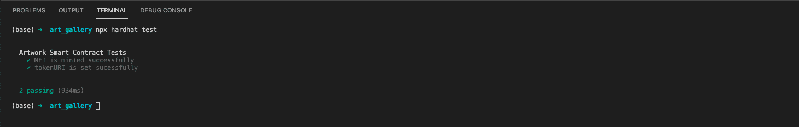
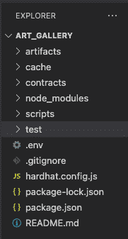
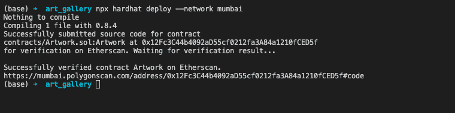
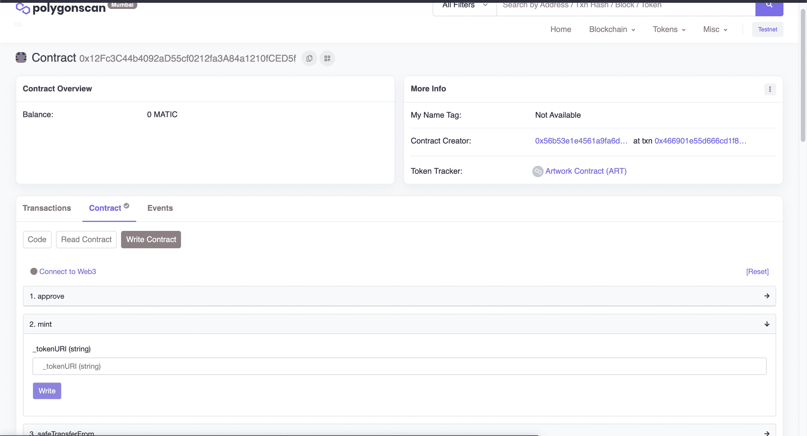
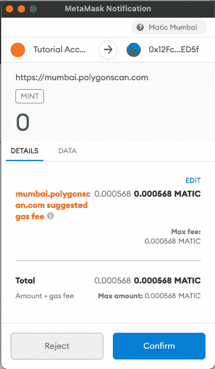
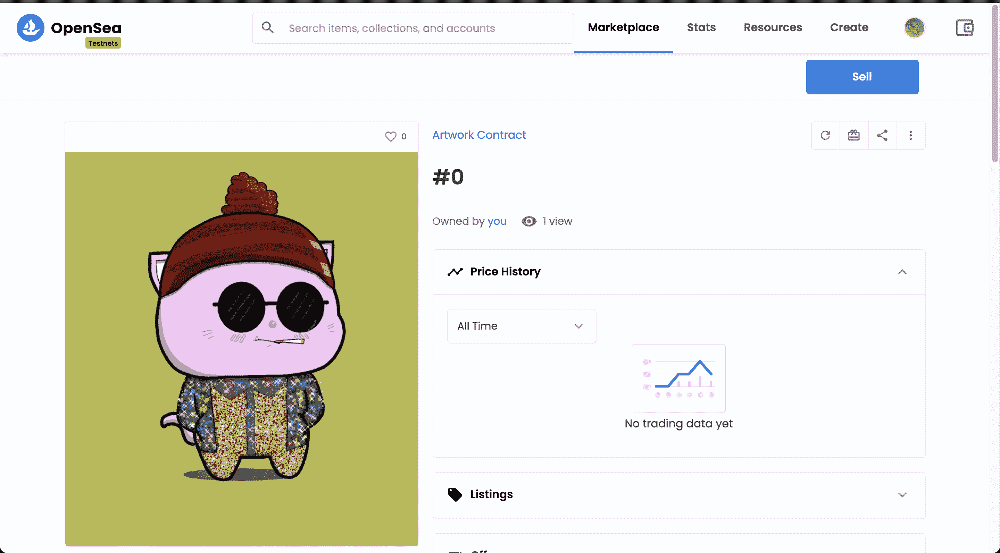

# 介绍

> 原文：<https://github.com/figment-networks/learn-tutorials/blob/master/polygon/NFT-Tutorial-Using-hardhat.md>

在本教程中，我们将学习如何使用 HardHat，这是一个用于智能合约开发的流行框架。它是一个类似 Truffle 的基于 JavaScript 的框架，但是比 Truffle 有一些优势，我们将在教程中介绍。本教程的目标是建立一个了不起的 NFT 项目，我们可以将任何东西转换成 NFT。我们还将学习如何使用 Hardhat 框架编写、测试和部署智能合约。

# 先决条件

本教程假设您对什么是智能合约以及如何使用它们构建 dApp 项目有一个基本的了解。理想情况下，您还知道并使用过元掩码，并且熟悉公钥和私钥的概念。熟悉 Solidity 和 Javascript 以及 Node.js 也会很有帮助。

# 要求

请确保您安装了以下软件:

*   [Node.js](https://nodejs.org/en/) v14.17.6 LTS 或更高版本，用于安装 HardHat 等节点包。
*   [元掩码](https://metamask.io/)用于与区块链交互。
    *   一旦安装了 MetaMask，添加一个与 [Polygon Mumbai testnet](https://docs.matic.network/docs/develop/metamask/config-polygon-on-metamask) 的连接。
*   记得使用[多边形龙头](https://faucet.polygon.technology/)向您的账户注入 testnet MATIC 代币。

# 创建多边形扫描 API 键

当我们将我们的契约部署到区块链(mainnet 或 testnet)时，在部署之后验证我们的智能契约的代码是一个好的实践。如果我们的智能合同通过了**验证**，那么智能合同代码将在块浏览器上可见，用户将能够直接从块浏览器(如 Polygonscan)与智能合同进行交互。非常鼓励验证源代码，因为它使我们的项目更加透明，用户也更有可能与之互动。

使用 HardHat 插件，智能合同可以在部署过程中自动验证。为此，我们需要一个 Polygonscan API 密钥。按照以下步骤获取您自己的 API 密钥:

1.  打开[多边形扫描](https://polygonscan.com/)。
2.  点击页面右上角的**登录**。
3.  如果您已经有一个帐户，请输入您的用户名和密码登录，或者通过访问[https://polygonscan.com/register](https://polygonscan.com/register)创建您的新帐户。
4.  登录后，转到左侧边栏的 API-KEYs 部分。
5.  点击“添加”按钮，给它一个名字，然后点击继续。

你现在有一个 API 密匙，它将允许你访问 Polygonscan API 特性，比如合同验证。这个密钥对于 mainnet 和 testnet 都是相同的。

# 创建安全帽项目

要安装 HardHat，请运行以下命令:

```js
npm install -g hardhat
```

这将在全局范围内安装 HardHat，以便以后我们可以使用`npx`命令来创建 HardHat 项目。

现在，为了创建我们的项目，我们将使用以下代码

```js
mkdir art_gallery # I am naming my project folder as art_gallery but any other name works
cd art_gallery    # move into the directory
npx hardhat
```

在键入最后一个命令时，屏幕上会出现类似下面的内容:

[](https://github.com/figment-networks/learn-tutorials/raw/master/assets/HardHatInitializing.png)

我们可以从一个基本的示例项目开始，这样更容易理解项目布局，所以我们只需按 Enter 键。在这之后，我们将被要求设置我们的项目根——按回车键保持默认值。接下来它会问我们是否需要一个. gitignore 文件。再次按 Enter 键保留默认值“yes”或键入 n 表示“no”。然后它会询问我们是否想要为我们的示例项目安装依赖项。按 Enter 键接受默认值 yes。现在，HardHat 将为我们创建一个示例项目并安装依赖项。一旦完成，它将看起来像这样:

[](https://github.com/figment-networks/learn-tutorials/raw/master/assets/HardhatInstalled.png)

**恭喜** <g-emoji class="g-emoji" alias="confetti_ball" fallback-src="https://github.githubassets.cimg/icons/emoji/unicode/1f38a.png">🎊</g-emoji> <g-emoji class="g-emoji" alias="confetti_ball" fallback-src="https://github.githubassets.cimg/icons/emoji/unicode/1f38a.png">🎊</g-emoji> <g-emoji class="g-emoji" alias="confetti_ball" fallback-src="https://github.githubassets.cimg/icons/emoji/unicode/1f38a.png">🎊你已经创建了你的第一个安全帽项目！</g-emoji>

# 理解代码

现在让我们打开我们的项目，看看它包含了什么。我将使用 VSCode 作为我的编辑器选择，但也可以随意使用您觉得舒服的任何其他代码编辑器。

[](https://github.com/figment-networks/learn-tutorials/raw/master/assets/InitialFileStructure.png)

我们得到的是一个非常简单的项目脚手架。目录名是不言自明的。我们所有的智能合同、脚本文件和测试脚本都将保存在各自的目录(文件夹)中。

`hardhat.config.js`是包含所有特定于 HardHat 的配置细节的文件。

在我们开始编写我们的智能合同之前，让我们看一下作为我们的 HardHat 项目核心的`hardhat.config.js`文件。默认情况下，该文件的内容是:

```js
require("@nomiclabs/hardhat-waffle");

// This is a sample Hardhat task. To learn how to create your own go to
// https://hardhat.org/guides/create-task.html
task("accounts", "Prints the list of accounts", async (taskArgs, hre) => {
  const accounts = await hre.ethers.getSigners();

  for (const account of accounts) {
    console.log(account.address);
  }
});

// You need to export an object to set up your config
// Go to https://hardhat.org/config/ to learn more

/**
 * @type import('hardhat/config').HardhatUserConfig
 */
module.exports = {
  solidity: "0.8.4",
};
```

我们从导入`@nomiclabs/hardhat-waffle`包开始，这将使我们能够访问`hre`类。HRE 是 Hardhat 运行时环境的缩写，它是一个包含 HardHat 公开的所有功能的对象。你可以把它想成“安全帽*是* hre”。

NNext 是我们定义各种任务的地方，可以通过键入`npx hardhat <TASK_NAME>`来运行这些任务

在开发项目的同时，我们也在编写自己的定制任务。

文件的末尾是`module.export`，这里我们将列出各种参数，如编译器版本、要使用的网络、API 密钥等。请注意，这里我们已经定义了实度版本为`0.8.4`。

# 安装 OpenZeppelin 库

在编写任何程序时，我们总是更喜欢使用各种库，这样我们就不必从头开始编写所有的程序。因为我们要建立一个基于 NFT 的项目，我们将遵循 [EIP-721](https://eips.ethereum.org/EIPS/eip-721) 定义的标准。最好的方法是导入 OpenZeppelin 契约库中的 ERC721 契约，只对我们的项目进行必要的修改。要安装此软件包，请打开终端并运行命令:

```js
npm install @openzeppelin/contracts 
```

# 开始我们的智能合同

让我们在`contracts`目录中创建一个名为`Artwork.sol`的新文件。这将是我们的第一份智能合同，有助于我们创建 NFT。

```js
//SPDX-License-Identifier: Unlicense
pragma solidity 0.8.4; 

contract Artwork {}
```

我们首先定义智能合约的许可。对于本教程，我们保持它未经许可。如果我们不定义许可证，它将在编译时引起警告。`pragma`关键字用于定义编译代码的可靠性版本。确保使用与`hardhat.config.js`文件中定义的相同的实体版本。

接下来，我们将从刚刚安装的 OpenZeppelin 库中导入 ERC721 智能合约。在定义实体版本的行之后，定义合同之前，导入 ERC721 合同:

```js
import "@openzeppelin/contracts/token/ERC721/ERC721.sol";
```

## 继承 ERC721 和构造函数初始化

对代码进行以下修改:

```js
//SPDX-License-Identifier: Unlicense
pragma solidity 0.8.4; 

import "@openzeppelin/contracts/token/ERC721/ERC721.sol";

contract Artwork is ERC721 {

    constructor(
        string memory name,
        string memory symbol
    ) ERC721(name, symbol) {}

}
```

在这里，我们正在做以下事情:

*   使用`is`关键字将 OpenZeppelin ERC721 智能合约继承到我们的`Artwork.sol`智能合约中。
*   构造函数始终是部署智能协定时调用的第一个函数。因为我们继承了另一个智能协定，所以在定义构造函数时，我们必须为该智能协定的构造函数传入值。这里，我们将一个名称和符号作为构造函数参数，并将它们传递给 ERC721 的构造函数。
*   `name`和`symbol`将分别成为我们 NFT 的名称和标志。

## 定义令牌计数器

NFT 被称为不可替换的令牌，因为每个都是唯一的。它们的独特之处在于分配给它们的令牌 id。我们将定义一个名为 tokenCounter 的全局变量，并使用它来计算令牌 id。它将从零开始，每创建(或“铸造”)一个新的 NFT 就递增 1。tokenCounter 的值在构造函数中设置为 0。

```js
//SPDX-License-Identifier: Unlicense
pragma solidity 0.8.4; 

import "@openzeppelin/contracts/token/ERC721/ERC721.sol";

contract Artwork is ERC721 {

    uint256 public tokenCounter;

    constructor(
        string memory name,
        string memory symbol
    ) ERC721(name, symbol) {
        tokenCounter = 0;
    }

}
```

## 创造造币功能

现在我们要定义一个 mint 函数，任何用户都可以调用它来创建新的 NFT。每个 NFT 都有一些相关的数据。在我们的例子中，我们使用图像或其他收藏品作为 NFT 的基础，因此图像应该以某种方式存储在智能合约中。由于将数据直接存储在区块链上会产生相关成本，因此如果存储整个影像和其他相关数据(元数据),在经济上是不可行的。因此，我们需要单独存放图像和一个包含 NFT 所有细节的 JSON 文件。图像和 JSON 文件可以分开托管，既可以分散托管(使用 IPFS)，也可以使用传统方法集中托管。JSON 文件也包含到图像的链接。一旦托管了 JSON 文件，指向该 JSON 文件的链接将作为 tokenURI 存储在区块链中。URI 代表“通用资源标识符”。[这个](https://opensea-creatures-api.herokuapp.com/api/creature/2)是集中托管的 tokenURI 的一个例子。

记住这一点，mint 函数就是我们如何创建与智能合约相关联的每个 NFT:

```js
function mint(string memory _tokenURI) public {
    _safeMint(msg.sender, tokenCounter);
    _setTokenURI(tokenCounter, _tokenURI);

    tokenCounter++;
}
```

`_safeMint`是 OpenZeppelin ERC721 合同中的另一个功能，用于创建新的 NFT。它需要两个参数:

*   to:第一个参数是一个帐户的地址，该帐户将在 NFT 铸造后拥有它。
*   tokenId:第二个参数是新生成的 NFT 的 tokenId。

`msg.sender`是一个特殊的关键字，它返回调用智能合约的帐户的地址。在这种情况下，它将返回当前调用 mint 函数的帐户。因此，调用 mint 函数的帐户将作为第一个参数传递，因此，铸造的 NFT 将归该帐户所有。

函数`_setTokenURI()`还没有定义，所以暂时忽略它。该函数将用于为生成的 NFT 设置 tokenURI。该函数在 ERC721 库中存在，但在 Solidity 版本 0.8.0 后已停止使用，因此我们需要自己实现它。

一旦令牌生成并设置了其 tokenURI，我们就将 tokenCounter 递增 1，这样下一个生成的令牌就有了新的令牌 id。

## 创建 _setTokenURI()函数

我们的 NFT 智能合约必须存储所有有效的令牌 id 及其各自的令牌 URI。为此，我们可以在 Solidity 中使用`mapping`数据类型。映射的工作方式类似于 Java 等其他编程语言中的 hashmaps。我们可以定义从一个`uint256`号到一个`string`号的映射，这将表示每个令牌 id 被映射到其各自的令牌 URI。在声明 tokenCounter 变量之后，定义映射:

```js
mapping (uint256 => string) private _tokenURIs;
```

现在让我们编写 _setTokenURI 函数:

```js
function _setTokenURI(uint256 _tokenId, string memory _tokenURI) internal virtual {
    require(
        _exists(_tokenId),
        "ERC721Metadata: URI set of nonexistent token"
    );  // Checks if the tokenId exists
    _tokenURIs[_tokenId] = _tokenURI;
}
```

这里定义了许多新术语，所以让我们一个一个地处理它们:

*   **内部:**用内部关键字定义函数。这意味着此函数只能由该智能合约中的其他函数或继承该智能合约的其他智能合约调用。外部用户不能调用此功能。
*   **virtual:** 该关键字表示该函数可以被继承该智能协定的任何协定覆盖。
*   **要求:**函数体内第一件事就是`require`关键字。它接受一个条件语句。如果该语句返回 true，则执行函数体的其余部分。如果条件语句返回 false，那么它将生成一个错误。第二个参数是生成的错误消息，它是可选的。
*   **_exists():** 如果存在用传递的 tokenId 铸造的令牌，该函数返回**真**，否则返回**假**。

**总之**:这个函数首先确保我们试图为其设置 tokenURI 的 tokenId 已经生成。如果是，它会将 tokenURI 和相应的 tokenId 一起添加到映射中。

## 创建 tokenURI()函数

我们必须创建的最后一个函数是`tokenURI()`函数。这将是一个可公开调用的函数，它将 tokenId 作为参数，并返回其各自的 tokenURI。这是一个标准函数，由各种基于 NFT 的平台调用，如 [OpenSea](https://opensea.io/) 。类似这样的平台使用从该函数返回的 tokenURI 来显示关于 NFT 的各种信息，如其属性和显示图像。

让我们编写 tokenURI 函数:

```js
function tokenURI(uint256 _tokenId) public view virtual override returns(string memory) {
    require(
        _exists(_tokenId),
        "ERC721Metadata: URI set of nonexistent token"
    );
    return _tokenURIs[_tokenId];
}
```

*   **public:** 这个函数是公共的，这意味着任何外部用户都可以调用它。
*   **视图:**由于此功能不会改变区块链的状态，即不会改变智能合约中的任何值，因此执行此功能将不需要任何 Gas。由于没有状态变化发生，该功能被定义为**视图**。
*   **override:** 在我们继承的 ERC721 契约中已经有一个 tokenURI()函数，它使用“baseURI + tokenId”的概念来返回 tokenURI。因为我们需要一个不同的逻辑，我们需要通过使用这个关键字来覆盖继承的函数。
*   **返回(字符串内存):**因为这个函数将返回一个字符串值，所以我们必须在声明函数时定义它。memory 关键字定义了信息存储的位置。

该函数首先检查传递的 tokenId 是否实际上是伪造的。如果令牌是伪造的，它将从映射中返回 tokenURI。

## 把所有的放在一起

将所有功能放在一起，最终的智能合约将如下所示:

```js
//SPDX-License-Identifier: Unlicense
pragma solidity 0.8.4; 

import "@openzeppelin/contracts/token/ERC721/ERC721.sol";

contract Artwork is ERC721 {

    uint256 public tokenCounter;
    mapping (uint256 => string) private _tokenURIs;

    constructor(
        string memory name,
        string memory symbol
    ) ERC721(name, symbol) {
        tokenCounter = 0;
    }

    function mint(string memory _tokenURI) public {
        _safeMint(msg.sender, tokenCounter);
        _setTokenURI(tokenCounter, _tokenURI);

        tokenCounter++;
    }

    function _setTokenURI(uint256 _tokenId, string memory _tokenURI) internal virtual {
        require(
            _exists(_tokenId),
            "ERC721Metadata: URI set of nonexistent token"
        );  // Checks if the tokenId exists
        _tokenURIs[_tokenId] = _tokenURI;
    }

    function tokenURI(uint256 _tokenId) public view virtual override returns(string memory) {
        require(
            _exists(_tokenId),
            "ERC721Metadata: URI set of nonexistent token"
        );
        return _tokenURIs[_tokenId];
    }

}
```

# 编译智能合同

既然我们的智能合约已经准备好了，我们必须编译它。要使用 HardHat 编译智能合同，请运行以下命令:

```js
npx hardhat compile 
```

如果一切按预期进行，您将得到消息“编译成功完成”。如果契约没有编译成功或者有错误，试着再读一遍教程，看看哪里出错了。一些可能的错误是:

*   未提供`SPDX-License-Identifier`
*   用**杂注**关键字定义的 Solidity 编译器版本与在`hardhat.config.js`中定义的版本不匹配。
*   导入的 smart contract 的 Solidity 版本与用于编写我们的 smart contract 的版本不匹配。要解决这个问题，请仔细检查您正在使用 npm 安装的 OpenZeppelin 契约的版本。在我的例子中，npm 包是版本 **4.3.2** ，智能合同是用 solidity 版本 **0.8.0** 编写的。

# 测试智能合约

至此，我们已经编写了智能契约并对其进行了编译。但是，成功编制的智能合约并不代表它就是正确的！编写测试用例以确保它通过所有的预期用例以及一些边缘用例是非常重要的。测试智能合约变得更加重要，因为智能合约一旦部署到区块链，就无法修改。

我们将使用`chai`库来编写测试。在创建我们的项目时应该已经安装了这个库，如果没有，您可以使用命令`npm install --save-dev chai`。

我们将在以下方面测试我们的智能合约:

*   **NFT 铸造成功:**账户调用铸造功能后，为该账户铸造一个 NFT，其余额增加。
*   **tokenURI 设置成功:**对于用不同 tokenURI 生成的两个令牌，两个令牌都有各自的 token uri，可以正常检索数据。

## 编写测试用例

在`test`文件夹中会有一个名为`sample-test.js`的脚本。我们将删除这个文件，并在同一个`test`目录下创建一个名为`artwork-test.js`的新文件。文件名并不重要，但是为了保持它的组织性，测试文件应该以某种方式与被测试的合同相关。在这个新文件中，添加以下代码:

```js
const { expect } = require('chai');
const { ethers } = require("hardhat")

describe("Artwork Smart Contract Tests", function() {

    this.beforeEach(async function() {
        // This is executed before each test
    })

    it("NFT is minted successfully", async function() {

    })

    it("tokenURI is set sucessfully", async function() {

    })

})
```

*   **描述:**这个关键字用于给我们将要执行的一组测试命名。
*   **before each:**`beforeEach`中定义的函数将在每个测试用例之前执行。我们将在这里部署 NFT 契约，因为契约必须在每个测试运行之前部署。
*   **it:** 这是用来编写每个测试用例的。`it`函数接受一个测试标题和一个运行测试用例的函数。

**注意:与 Truffle 不同，HardHat 不需要单独运行`ganache-cli`进行测试。Hardhat 有自己的本地测试网，我们可以使用。**

## 部署契约和编写测试

为了部署智能契约，我们必须首先使用`ethers.getContractFactory()`获得对编译后的智能契约的引用，然后我们可以使用`deploy()`方法来部署智能契约并传入参数。我们在`beforeEach()`部分做这个。

```js
let artwork;

this.beforeEach(async function() {
    // This is executed before each test
    // Deploying the smart contract
    const Artwork = await ethers.getContractFactory("Artwork");
    artwork = await Artwork.deploy("Artwork Contract", "ART");
})
```

为了检查 NFT 是否被正确创建，我们首先获取一个由 HardHat 创建的默认帐户。然后我们用一个随机的 tokenURI 调用智能契约中的 mint 函数。我们检查了铸造前后的账户余额，它应该分别为 0 和 1。如果合同通过了测试，这意味着非功能性交易是正确的。

```js
it("NFT is minted successfully", async function() {
    [account1] = await ethers.getSigners();

    expect(await artwork.balanceOf(account1.address)).to.equal(0);

    const tokenURI = "https://opensea-creatures-api.herokuapp.com/api/creature/1"
    const tx = await artwork.connect(account1).mint(tokenURI);

    expect(await artwork.balanceOf(account1.address)).to.equal(1);
})
```

为了检查 tokenURI 的设置是否正确，我们随机选取两个 token uri，并从不同的帐户设置它们。然后，我们调用 tokenURI()函数来获取各个令牌的 tokenURI，然后将它们与传递的参数进行匹配，以确保正确设置了 token uri。

```js
it("tokenURI is set sucessfully", async function() {
    [account1, account2] = await ethers.getSigners();

    const tokenURI_1 = "https://opensea-creatures-api.herokuapp.com/api/creature/1"
    const tokenURI_2 = "https://opensea-creatures-api.herokuapp.com/api/creature/2"

    const tx1 = await artwork.connect(account1).mint(tokenURI_1);
    const tx2 = await artwork.connect(account2).mint(tokenURI_2);

    expect(await artwork.tokenURI(0)).to.equal(tokenURI_1);
    expect(await artwork.tokenURI(1)).to.equal(tokenURI_2);

})
```

## 把所有的放在一起

所以最后，在把所有的测试用例放在一起之后，`artwork-test.js`文件的内容将会是:

```js
const { expect } = require('chai');
const { ethers } = require("hardhat")

describe("Artwork Smart Contract Tests", function() {

    let artwork;

    this.beforeEach(async function() {
        // This is executed before each test
        // Deploying the smart contract
        const Artwork = await ethers.getContractFactory("Artwork");
        artwork = await Artwork.deploy("Artwork Contract", "ART");
    })

    it("NFT is minted successfully", async function() {
        [account1] = await ethers.getSigners();

        expect(await artwork.balanceOf(account1.address)).to.equal(0);

        const tokenURI = "https://opensea-creatures-api.herokuapp.com/api/creature/1"
        const tx = await artwork.connect(account1).mint(tokenURI);

        expect(await artwork.balanceOf(account1.address)).to.equal(1);
    })

    it("tokenURI is set sucessfully", async function() {
        [account1, account2] = await ethers.getSigners();

        const tokenURI_1 = "https://opensea-creatures-api.herokuapp.com/api/creature/1"
        const tokenURI_2 = "https://opensea-creatures-api.herokuapp.com/api/creature/2"

        const tx1 = await artwork.connect(account1).mint(tokenURI_1);
        const tx2 = await artwork.connect(account2).mint(tokenURI_2);

        expect(await artwork.tokenURI(0)).to.equal(tokenURI_1);
        expect(await artwork.tokenURI(1)).to.equal(tokenURI_2);

    })

})
```

您可以使用以下命令运行测试:

```js
npx hardhat test 
```

这应该会输出:

[](https://github.com/figment-networks/learn-tutorials/raw/master/assets/ranTest.png)

# 部署智能合同

至此，我们已经学会了如何编写和测试智能合约。现在是时候我们最终将智能合同部署到孟买测试网上了，这样我们就可以向我们的朋友展示我们新学到的技能了😎。

在我们继续部署智能合同之前，我们需要另外两个 npm 包:

*   **dotenv:** 型`npm install dotenv`。这将用于管理环境变量，这些变量用于设置对我们的 Polygonscan API 键的访问。
*   **@ nomic labs/hard hat-ethers can:**类型`npm install @nomiclabs/hardhat-etherscan`。该库用于在将智能合约部署到网络时验证智能合约。在 Etherscan 和 Polygonscan 上验证智能合同的过程是相同的。

## 设置环境变量

[](https://github.com/figment-networks/learn-tutorials/raw/master/assets/WithENV.png)

在项目根目录下创建一个名为`.env`的新文件

在`.env`文件中创建一个名为`POLYGONSCAN_KEY`的新条目，并将其设置为等于本教程开始时创建的 API 键。还要添加另一个条目`PRIVATE_KEY`，并将其设置为包含 MATIC 的 Mumbai testnet 帐户的私钥。

```js
POLYGONSCAN_KEY=Paste the API key here
PRIVATE_KEY=Paste the private key here 
```

## 修改配置文件

为了将经过验证的智能合约部署到 Mumbai testnet，我们必须对`hardhat.config.js`文件进行某些更改。首先，复制&将整个代码粘贴到文件中，然后我们将一步一步地了解发生了什么:

```js
require("@nomiclabs/hardhat-waffle");
require("@nomiclabs/hardhat-etherscan")
require("dotenv").config();

task("accounts", "Prints the list of accounts", async (taskArgs, hre) => {
  const accounts = await hre.ethers.getSigners();

  for (const account of accounts) {
    console.log(account.address);
  }
});

task("deploy", "Deploy the smart contracts", async(taskArgs, hre) => {

  const Artwork = await hre.ethers.getContractFactory("Artwork");
  const artwork = await Artwork.deploy("Artwork Contract", "ART");

  await artwork.deployed();

  await hre.run("verify:verify", {
    address: artwork.address,
    constructorArguments: [
      "Artwork Contract",
      "ART"
    ]
  })

})

module.exports = {
  solidity: "0.8.4",
  networks: {
    mumbai: {
      url: "https://matic-testnet-archive-rpc.bwarelabs.com",
      accounts: [
        process.env.PRIVATE_KEY,
      ]
    }
  },
  etherscan: {
    apiKey: process.env.POLYGONSCAN_KEY,
  }
};
```

现在让我们理解我们在这里做什么:

*   我们已经导入了`@nomiclabs/hardhat-etherscan`包，这是一个安全帽插件，使我们能够在将智能合同部署到网络后对其进行验证。
*   为了验证智能契约，我们将需要我们在本教程开始时创建的 Polygonscan API 密钥。该 API 键通过`module.export`传递。请注意，对象名为“etherscan”，术语“apiKey”用于指代我们创建的密钥。
*   我们还创建了一个部署智能合同的新任务。为了创建任务，我们使用 task 关键字，并向它传递一个名称和描述。在此任务中，我们编写了部署智能合约的代码。部署合同后，我们调用 verify:verify 任务，这个任务由 hardhat-etherscan 插件提供。在部署协定时，我们传递了协定地址以及传递给构造函数的参数。
*   最后，由于我们要将我们的合同部署到 Mumbai testnet，我们在 network 部分创建了一个新条目，并将 RPC url 添加到 Mumbai testnet，同时添加了将用于部署智能合同的帐户的私钥。

## 部署智能合同

我们现在准备将我们的合同部署到 testnet。运行以下命令:

```js
npx hardhat deploy --network mumbai 
```

现在，我们必须等待几分钟，因为合同已经部署并得到验证。<g-emoji class="g-emoji" alias="crossed_fingers" fallback-src="https://github.githubassets.cimg/icons/emoji/unicode/1f91e.png">🤞</g-emoji> <g-emoji class="g-emoji" alias="crossed_fingers" fallback-src="https://github.githubassets.cimg/icons/emoji/unicode/1f91e.png">🤞</g-emoji> <g-emoji class="g-emoji" alias="crossed_fingers" fallback-src="https://github.githubassets.cimg/icons/emoji/unicode/1f91e.png">🤞</g-emoji>

如果一切都是正确的，您应该得到类似如下的输出:

[](https://github.com/figment-networks/learn-tutorials/raw/master/assets/DeployingContract.png)

现在，您可以通过输出中提供的链接查看您的合同。你可以在这里查看我的已部署契约[的例子。](https://mumbai.polygonscan.com/address/0x12Fc3C44b4092aD55cf0212fa3A84a1210fCED5f)

## 部署时的潜在错误

**资金不足**

如果您传递的私钥属于一个没有足够的自动令牌来部署协定的帐户，您将得到以下错误:

```js
Error: insufficient funds for intrinsic transaction cost (error={"name":"ProviderError","code":-32000,"_isProviderError":true}, method="sendTransaction", transaction=undefined, code=INSUFFICIENT_FUNDS, version=providers/5.4.5)
...
reason: 'insufficient funds for intrinsic transaction cost',
code: 'INSUFFICIENT_FUNDS',
error: ProviderError: insufficient funds for gas * price + value
...
method: 'sendTransaction',
transaction: undefined 
```

在这种情况下，请记住使用[水龙头](https://faucet.polygon.technology/)为您的部署帐户提供资金。

**无效的 API 密钥**

如果您输入的 Polygonscan API 键丢失或无效，您将得到以下错误消息:

```js
Nothing to compile
Compiling 1 file with 0.8.4
Error in plugin @nomiclabs/hardhat-etherscan: Invalid API Key

For more info run Hardhat with --show-stack-traces 
```

在这种情况下，请确保您输入了正确的 API 密钥。

# 与智能合同交互

如果我们在 Polygonscan 上查看我们的智能合同，你可以看到我们的合同是经过验证的。这由“合同”标签中的绿色复选标记表示。在合同选项卡中，点击`Write Contract`。现在点击“连接到 Web3”并连接您的 Metamask 帐户。

[](https://github.com/figment-networks/learn-tutorials/raw/master/assets/ContractVerified.png)

现在选择`mint`动作并放入您的 tokenURI。我使用 https://gambakitties-metadata.herokuapp.com/metadata/1 T2 作为我的令牌 URI。如果您愿意，可以通过使用 IPFS 托管它来创建自己的 tokenURI。输入令牌 URI 后，单击“写入”按钮。这将显示一个元掩码弹出窗口。确认交易，等待确认。

[](https://github.com/figment-networks/learn-tutorials/raw/master/assets/MetaMaskSign.png)

恭喜<g-emoji class="g-emoji" alias="partying_face" fallback-src="https://github.githubassets.cimg/icons/emoji/unicode/1f973.png">🥳</g-emoji>T2】🥳T4】🥳，你的 NFT 铸造成功。您可以访问 [Opensea Testnet](https://testnets.opensea.io/) 页面，在“我的个人资料”部分，您现在可以查看您的 NFT。点击查看示例[。](https://testnets.opensea.io/assets/mumbai/0x12fc3c44b4092ad55cf0212fa3a84a1210fced5f/0)

[](https://github.com/figment-networks/learn-tutorials/raw/master/assets/NFTMinted.png)

# 结论

在本教程中，我们学习了一些基本的安全帽。我们编写了一个可用于创建 NFT 的智能契约，为我们的智能契约编写了测试，并最终将其部署到孟买测试网。我们还使用一个 HardHat 插件和一个 Polygonscan API 密匙验证了我们的合同。使用类似的程序，我们可以构建任意数量的 DeFi 项目，并部署到任何 EVM 兼容网络(以太坊、多边形、币安智能链、雪崩等)。).

# 后续步骤

为什么停在这里？展望未来，你还可以学习如何建立一个 NFT 市场合同，在这里各种非功能性交易可以上市、买卖。你也可以深入挖掘非功能性测试的其他方面，学习新的东西😎！

# 关于作者

嗨，我的名字是 Bhaskar Dutta，我是一名区块链开发者，研究员和自由职业者。我总是期待着学习新的东西，我喜欢讨论情景喜剧。为了更好地了解我，你可以查看我的 [Github](https://github.com/BhaskarDutta2209) 简介。

# 参考

我发现以下几点对学习很有帮助:

*   [安全帽官方文档](https://hardhat.org/)
*   [Matic 官方文档](https://docs.matic.network/docs/develop/getting-started)
*   [打开齐柏林论坛页面](https://forum.openzeppelin.com/t/function-settokenuri-in-erc721-is-gone-with-pragma-0-8-0/5978/3)关于 setTokenURI 在 Solidity 0.8.0 的变化。