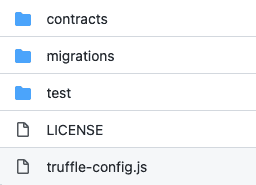
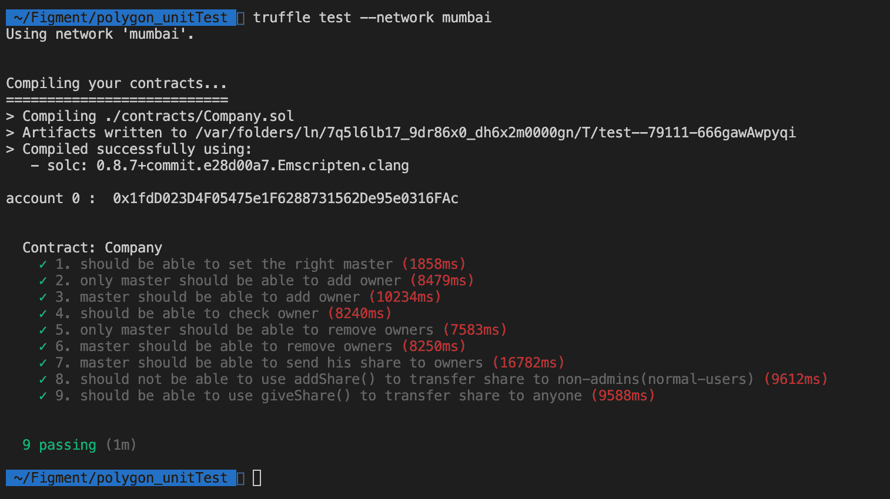

# 介绍

> 原文：<https://github.com/figment-networks/learn-tutorials/blob/master/polygon/Unit-Testing-on-Polygon.md>

在本教程中，您将学习如何使用 Truffle 在 solidity 中部署和单元测试智能合约。在进入单元测试之前，我们将实现一个智能测试契约。喝杯茶，回顾 Smart-Contract 并对其进行单元测试！

# 先决条件

本教程假设你对固体、块菌和区块链有基本的了解。

# 要求

*   [松露](https://www.trufflesuite.com/)
*   [Solidity](https://docs.soliditylang.org/en/v0.8.9/) 编译器(由 Truffle 自动安装)
*   [Metamask](https://metamask.io/)
*   数据中心账户——去[https://datahub.figment.io/sign_up](https://datahub.figment.io/sign_up)创建一个账户

本教程中使用的完整代码可从 Github 上的[获得](https://github.com/PowerStream3604/Polygon-unit-testing)

# 用 Truffle 对智能合约进行单元测试

什么是单元测试？单元测试是**测试单元**的一种方式——在系统中可以逻辑隔离的最小代码片段。这些单元大多是函数、子程序、方法或属性。

在测试智能合约之前，我们需要实现一个智能合约。

我们将实现的智能合约是一个代表**公司**的智能合约。类似于公司的运作方式，我们的智能合同分配**角色:** **所有者:**访问受限的公司股东。**主:**拥有完全访问权限的公司总裁/CEO。**管理员:**两个**的主人**和**的主人**一起组成一个组。

**特点**:

1.  **主人**有权**用 **addOwner()** 添加**主人，**用 **removeOwner()** 删除**主人。
2.  **管理员**(所有者&主人)有权使用 **giveShare()** 功能将自己的份额转让给任何人。
3.  **管理员**(所有者&主人)有权使用 **addShare()** 功能将他们的份额转让给其中一个所有者(非主人)。
4.  **检查所有者()**返回给定的地址是否是所有者。
5.  **getMaster()** 返回**主人**的地址。
6.  **getOwners()** 返回**所有者**地址列表。
7.  **不在**管理员**范围内的用户**不能转让他们的份额，但**仍然可以接收**。

**事件**:

1.  当**主机**被设置时，发出**主机设置**

```js
event MasterSetup(address indexed master);
```

2.  **OwnerAddition** 在**主**添加**所有者**时发出

```js
event OwnerAddition(address indexed owner);
```

3.  当**主人**被**主人**移除时**发出 Owner remove**

```js
event OwnerRemoval(address indexed owner);
```

4.  **Transfer** 在管理员的份额通过这些函数 **addShare()** ， **giveShare()** 获得转移时发出

```js
event Transfer(address indexed receiver, uint256 amount);
```

## 定义智能合同

*注:我们将此智能合同命名为**公司**，使用 solidity 版本**0 . 8 . 7**T5】*

在定义事件和函数之前，让我们首先定义要在智能合约中使用的变量。

```js
contract Company {

    // Company contract.
    // owners of the contract are the share holders of the company.

    address public master;
    // List to keep track of all owner's address
    address[] public owners;
    // Mapping to keep track of all owners of the company
    mapping(address => bool) isOwner;
    // Mapping to keep track of all balance of share holders of the company
    mapping(address => uint256) share;

}
```

定义变量后，我们应该定义要在公司智能合同中使用的事件。

```js
// Events
event MasterSetup(address indexed master);
event OwnerAddition(address indexed owner);
event Transfer(address indexed receiver, uint256 amount);
event OwnerRemoval(address indexed owner);
```

既然我们定义了事件，我们应该定义修饰符来限制来自匿名用户或未授权用户的访问。

```js
modifier onlyMaster() {
    require(msg.sender == address(master));
    _;
}
modifier onlyOwners() {
    require(isOwner[msg.sender], "Only owners have the right to call");
    _;
}
modifier onlyAdmins() {
    require(isOwner[msg.sender] || msg.sender == address(master), "Only master or owners have the right to call");
    _;
}
```

我们应该定义构造函数来设置**主机**的地址。

```js
/// @dev Constructor sets the master address of Company contract.
/// @param _master address to setup master 
constructor(address _master) {
    require(_master != address(0), "Master address cannot be a zero address");
    master = _master;
    share[master] = 10000000;
    emit MasterSetup(master);
}
```

此外，我们应该定义函数来获取关于**主人**和**所有者**的信息。

```js
/// @dev Returns the address of the master
function getMaster()
    public
    view
    returns (address)
{
    return master;
}

/// @dev Returns the owner list of this Company contract.
function getOwners()
    public
    view
    returns (address[] memory)
{
    return owners;
}
```

我们需要一个函数来检查给定的地址是否是所有者。

```js
/// @dev Returns whether the given address is owner or not.
/// @param owner Address to check if is owner.
function checkIfOwner(address owner)
    public
    view
    returns (bool)
{
    return isOwner[owner];
}
```

我们还需要函数来**添加**和**删除**所有者。

```js
/// @dev Adds owner if the msg.sender is master. Will revert otherwise.
/// @param owner Owner address to be added as owner.
function addOwner(address owner) 
    onlyMaster 
    public
{
    isOwner[owner] = true;
    owners.push(owner);
    share[owner] = 5000000;

    emit OwnerAddition(owner);
}

/// @dev Removes an owner from the owner list. Can only be called by master. Will Revert otherwise
/// @param owner Address of the owner to be removed
function removeOwner(address owner)
    public
    onlyMaster
{
    require(isOwner[owner], "Only owners can be removed from owner list");
    isOwner[owner] = false;
    for (uint i = 0; i < owners.length - 1; i++)
        if (owners[i] == owner) {
            owners[i] = owners[owners.length - 1];
            break;
        }
    owners.pop();

    emit OwnerRemoval(owner);
}
```

最重要的是，我们需要功能来转移份额。

```js
/// @dev Transfers owner's or master's share to any address given.
///     Note: can only be called by one of the owners or master
/// @param receiver Address of the receiver who'll receive the share
/// @param _share Uint256 of the amount the admin wants to transfer
function giveShare(address receiver, uint256 _share)
    public
    onlyAdmins
{
    require(share[msg.sender] >= _share, "Share exceeds the sender allowance");
    share[msg.sender] = share[msg.sender] - _share;
    share[receiver] += _share;

    emit Transfer(receiver, _share);
}

/// @dev Transfers owner's or master's stake(share) to an address in the owner list or master.
///     Note: the recipient can only be one of the admins(owner or master)
/// @param receiver Address of the receipient
/// @param _share Uint256 amount of the stake(share) to transfer
function addShare(address receiver, uint256 _share)
    public
    onlyAdmins
{
    require(share[msg.sender] >= _share, "Share exceeds the sender allowance");
    require(isOwner[receiver], "The receipient should only be one of the owners");
    share[msg.sender] -= _share;
    share[receiver] += _share;

    emit Transfer(receiver, _share);
}
```

下面是完整的**实现**:

```js
// SPDX-License-Identifier: MIT
pragma solidity ^0.8.9;

contract Company {

    // Company contract.
    // owners of the contract are the share holders of the company.

    address public master;
    // List to keep track of all owner's address
    address[] public owners;
    // Mapping to keep track of all owners of the company
    mapping(address => bool) isOwner;
    // Mapping to keep track of all balance of share holders of the company
    mapping(address => uint256) share;

    // Events
    event MasterSetup(address indexed master);
    event OwnerAddition(address indexed owner);
    event Transfer(address indexed receiver, uint256 amount);
    event OwnerRemoval(address indexed owner);

    modifier onlyMaster() {
        require(msg.sender == address(master));
        _;
    }
    modifier onlyOwners() {
        require(isOwner[msg.sender], "Only owner can be added");
        _;
    }
    modifier onlyAdmins() {
        require(isOwner[msg.sender] || msg.sender == address(master), "Only master or owners");
        _;
    }

    /// @dev Constructor sets the master address of Company contract.
    /// @param _master address to setup master 
    constructor(address _master) {
        require(_master != address(0), "Master address cannot be a zero address");
        master = _master;
        share[master] = 10000000;
        emit MasterSetup(master);
    }

    /// @dev Returns the address of the master
    function getMaster()
        public
        view
        returns (address)
    {
        return master;
    }

    /// @dev Adds owner if the msg.sender is master. Will revert otherwise.
    /// @param owner Owner address to be added as owner.
    function addOwner(address owner) 
        onlyMaster 
        public
    {
        isOwner[owner] = true;
        owners.push(owner);
        share[owner] = 5000000;

        emit OwnerAddition(owner);
    }

    /// @dev Returns the owner list of this Company contract.
    function getOwners()
        public
        view
        returns (address[] memory)
    {
        return owners;
    }

    /// @dev Returns whether the given address is owner or not.
    /// @param owner Address to check if is owner.
    function checkIfOwner(address owner)
        public
        view
        returns (bool)
    {
        return isOwner[owner];
    }

    /// @dev Transfers owner's or master's share to any address given.
    ///     Note: can only be called by one of the owners or master
    /// @param receiver Address of the receiver who'll receive the share
    /// @param _share Uint256 of the amount the admin wants to transfer
    function giveShare(address receiver, uint256 _share)
        public
        onlyAdmins
    {
        require(share[msg.sender] >= _share, "Stake exceeds the sender allowance");
        share[msg.sender] = share[msg.sender] - _share;
        share[receiver] += _share;

        emit Transfer(receiver, _share);
    }

    /// @dev Transfers owner's or master's stake(share) to an address in the owner list or master.
    ///     Note: the recipient can only be one of the admins(owner or master)
    /// @param receiver Address of the receipient
    /// @param _share Uint256 amount of the stake(share) to transfer
    function addShare(address receiver, uint256 _share)
        public
        onlyAdmins
    {
        require(share[msg.sender] >= _share, "Share exceeds the sender allowance");
        require(isOwner[receiver], "The receipient should only be one of the owners");
        share[msg.sender] = share[msg.sender] - _share;
        share[receiver] += _share;

        emit Transfer(receiver, _share);
    }

    /// @dev Removes an owner from the owner list. Can only be called by master. Will Revert otherwise
    /// @param owner Address of the owner to be removed
    function removeOwner(address owner)
        public
        onlyMaster
    {
        require(isOwner[owner], "Only owners can be removed from owner list");
        isOwner[owner] = false;
        for (uint i = 0; i < owners.length - 1; i++)
            if (owners[i] == owner) {
                owners[i] = owners[owners.length - 1];
                break;
            }
        owners.pop();

        emit OwnerRemoval(owner);
    }
}
```

万岁！！我们执行了整个合同！！

让我们接着用松露去单元测试上面的契约。

正如我上面提到的，单元测试是测试最小的单元，可以是函数、子程序、方法等等。Truffle 提供了一个方便的库来测试智能合约，通过使用 **truffle-assert** 库，我们将检查所有场景是否符合我们的预期。

## 初始化 Truffle 项目

要初始化一个新的 Truffle 项目，在您想要使用的目录中运行命令`truffle init`，例如`polygon-unit-testing`。您可以随意命名该目录，但是我们建议您按照教程使用这个示例:

```js
mkdir polygon-unit-testing
cd polygon-unit-testing
truffle init 
```

然后，您将看到如下所示的项目目录:

[](https://github.com/figment-networks/learn-tutorials/raw/master/assets/truffle-initial-directory.png)

## 将您的智能合同粘贴到合同文件夹中

在`/contracts`下创建一个名为`Company.sol`的新文件

**然后**，将前面章节中的智能合约**实现**粘贴到`Company.sol`中。

## 配置网络设置

**编辑**松露配置文件，`truffle-config.js`。

在**网络**对象内粘贴如下所示的网络配置:

```js
mumbai: {
      provider: () => new HDWalletProvider(["<Private Key 1>", "<Private Key 2>", "<Private Key 3>"],
      `https://matic-mumbai--rpc.datahub.figment.io/apikey/${process.env.DATAHUB_POLYGON_API_KEY}`),
      network_id: 80001,
      confirmations: 2,
      timeoutBlocks: 200,
      skipDryRun: true,
      networkCheckTimeout: 100000,
}
```

该配置设置提供者 URL 以将 Truffle 与**孟买测试网**的数据中心节点连接，并提供私钥给**签署**并在**孟买**支付**的燃气费**。记得更换<私钥 1 >等..使用您将使用的实际私钥。

**溺爱和。环境**:

如果您不熟悉如何使用`.env`文件，请参考[本指南](https://docs.figment.io/network-documentation/extra-guides/dotenv-and-.env)。

您必须将您的 DataHub API 密匙添加到与`truffle-config.js`位于同一目录的名为`.env`的文件中，作为环境变量`DATAHUB_POLYGON_API_KEY`的值:

```js
DATAHUB_POLYGON_API_KEY=<paste your API key here> 
```

您还需要在`truffle-config.js`的顶部添加使用 dotenv 的代码:

```js
require('dotenv').config(); // Load .env file
```

对于这个测试，您将需要 **3 个不同的私有密钥**。可以参考本手册从 Metamask 导出私钥:[https://meta mask . zendesk . com/HC/en-us/articles/360015289632-How-to-Export-a-Account-Private-Key](https://metamask.zendesk.com/hc/en-us/articles/360015289632-How-to-Export-an-Account-Private-Key)。

**注**:该账户应通过孟买的测试**自动**进行融资。使用[多边形水龙头](https://faucet.polygon.technology/)。

## 在测试文件夹中创建 company.js 文件

为了在 Truffle 项目中创建测试，在`test`文件夹下创建一个测试文件。

```js
cd test
touch company.js 
```

## 创建部署文件以部署公司合同

```js
cd migrations
touch 2_deploy_contract.js 
```

为了部署一个契约，我们将使用一个迁移脚本(迁移是 Truffle 对部署的说法)。将以下代码添加到`2_deploy_contract.js`:

```js
const Company = artifacts.require("Company");

module.exports = function (deployer, networks, accounts) {
    deployer.deploy(Company, account);
};
```

## 单元测试前智能协定

我们将使用 Truffle 的 JavaScript 库来测试这些功能。进去之前，我们先导入要测试的契约和松露库进行测试。将此代码添加到测试文件中:

```js
// polygon-unit-testing/test/company.js

const Company = artifacts.require("Company");
const truffleAssert = require('truffle-assertions');
```

此外，我们将定义用户变量来更好地区分我们在 **truffle-config.js** 文件中指定的测试帐户:

```js
// polygon-unit-testing/test/company.js

const user1 = accounts[0];
const user2 = accounts[1];
const user3 = accounts[2];
```

## 编写单元测试

1.  测试主地址是否被构造函数正确设置。

```js
// polygon-unit-testing/test/company.js

it("1\. should be able to set the right master", async () => {
    // Get deployed contract
    const company = await Company.deployed();
    // Check if the master address equals to user1
    assert.deepEqual(await company.getMaster(), user1);
});
```

2.  检查是否只有主服务器能够添加所有者

```js
// polygon-unit-testing/test/company.js

it("2\. only master should be able to add owner", async () => {
    // Get deployed contract
    const company = await Company.deployed();
    // Check if the user2 (is not master) gets reverted when attempting to add owner
    await truffleAssert.reverts(
        company.addOwner(user1, {from: user2}),
    );
});
```

3.  检查主服务器是否能够添加所有者。

```js
// polygon-unit-testing/test/company.js

it("3\. master should be able to add owner", async() => {
    // Get deployed contract
    const company = await Company.deployed();
    // call addOwner(); {from: accounts[0]} is added as default (who is master)
    const tx = await company.addOwner(user1);
    // Check if OwnerAddition is getting emitted
    truffleAssert.eventEmitted(tx, "OwnerAddition", (ev) => {
        return ev.owner == user1;
    })
    // Check if getOwners() returns the ownerList with user1 as owner inside
    assert.deepEqual(await company.getOwners(), [user1]);
});
```

4.  检查地址是否是所有者

```js
// polygon-unit-testing/test/company.js

it("4\. should be able to check owner", async () => {
    const company = await Company.deployed();
    await company.addOwner(user1);

    // checkIfOwner() should true since user1 is in the ownerList 
    assert.equal(await company.checkIfOwner(user1), true);
});
```

5.  检查主帐户是否是唯一要删除所有者的帐户

```js
// polygon-unit-testing/test/company.js

it("5\. only master should be able to remove owners", async () => {
    const company = await Company.deployed();

    await truffleAssert.reverts(
        company.removeOwner(user1, {from: user2}),
    );
});
```

6.  检查主服务器是否能够添加所有者

```js
// polygon-unit-testing/test/company.js

it("6\. master should be able to remove owners", async () => {
    const company = await Company.deployed();

    const tx = await company.removeOwner(user1);
    // check if OwnerRemoval event is emitted
    truffleAssert.eventEmitted(tx, "OwnerRemoval", (ev) => {
        return ev.owner == user1;
    });
    // ownerList should be empty
    assert.deepEqual(await company.getOwners(), []);
});
```

7.  检查主人是否能够将他的份额发送给所有者

```js
// polygon-unit-testing/test/company.js

it("7\. master should be able to send his share to owners", async() => {
    const company = await Company.deployed();
    // add user2 as owner
    await company.addOwner(user2);

    // the initial share is 5000000
    assert.equal(await company.getShare(user2), 5000000);

    // add the share of master to user2
    const tx1 = await company.addShare(user2, 1000);

    // check if Transfer event is getting emitted
    truffleAssert.eventEmitted(tx1, "Transfer", (ev) => {
        return ev.receiver == user2 && ev.amount == 1000
    });
    // get the share of user2
    const user2Share = await company.getShare(user2);

    // user2 share should be 5000000 + 1000 : 5001000
    assert.equal(user2Share.toString(), 5001000);
});
```

8.  检查用户`addShare()`是否可以将份额转让给普通用户

```js
// polygon-unit-testing/test/company.js

it("8\. should not be able to use addShare() to transfer share to non-admins(normal-users)", async() => {
    const company = await Company.deployed();

    await truffleAssert.reverts(
        company.addShare(user3, 1000),
    );
});
```

9.  检查是否可以使用`giveShare()`将份额转移给普通用户

```js
// polygon-unit-testing/test/company.js

it("9\. should be able to use giveShare() to transfer share to anyone", async () => {
    const company = await Company.deployed();

    const tx = await company.giveShare(user3,  1500);
    truffleAssert.eventEmitted(tx, "Transfer", (ev) => {
        return ev.receiver == user3 && ev.amount == 1500;
    });

    assert.equal(await company.getShare(user3), 1500);
});
```

完整的测试文件应该如下所示:

```js
// polygon-unit-testing/test/company.js

const Company = artifacts.require("Company");
const truffleAssert = require("truffle-assertions");
contract("Company", (accounts) => {
  const user1 = accounts[0];
  const user2 = accounts[1];
  const user3 = accounts[2];
  console.log(accounts);

  it("1\. should be able to set the right master", async () => {
    const company = await Company.deployed();
    assert.deepEqual(await company.getMaster(), user1);
  });

  it("2\. only master should be able to add owner", async () => {
    const company = await Company.deployed();
    await truffleAssert.reverts(company.addOwner(user1, { from: user2 }));
  });

  it("3\. master should be able to add owner", async () => {
    const company = await Company.deployed();
    const tx = await company.addOwner(user1);
    truffleAssert.eventEmitted(tx, "OwnerAddition", (ev) => {
      return ev.owner == user1;
    });

    assert.deepEqual(await company.getOwners(), [user1]);
  });

  it("4\. should be able to check owner", async () => {
    const company = await Company.deployed();
    await company.addOwner(user1);

    assert.equal(await company.checkIfOwner(user1), true);
  });

  it("5\. only master should be able to remove owners", async () => {
    const company = await Company.deployed();

    await truffleAssert.reverts(company.removeOwner(user1, { from: user2 }));
  });

  it("6\. master should be able to remove owners", async () => {
    const company = await Company.deployed();

    const tx = await company.removeOwner(user1);
    truffleAssert.eventEmitted(tx, "OwnerRemoval", (ev) => {
      return ev.owner == user1;
    });
    assert.deepEqual(await company.getOwners(), []);
  });

  it("7\. master should be able to send his share to owners", async () => {
    const company = await Company.deployed();

    await company.addOwner(user2);

    assert.equal(await company.getShare(user2), 5000000);

    const tx1 = await company.addShare(user2, 1000);
    truffleAssert.eventEmitted(tx1, "Transfer", (ev) => {
      return ev.receiver == user2 && ev.amount == 1000;
    });

    const user2Share = await company.getShare(user2);

    assert.equal(user2Share.toString(), 5001000);
  });

  it("8\. should not be able to use addShare() to transfer share to non-admins(normal-users)", async () => {
    const company = await Company.deployed();

    await truffleAssert.reverts(company.addShare(user3, 1000));
  });

  it("9\. should be able to use giveShare() to transfer share to anyone", async () => {
    const company = await Company.deployed();

    const tx = await company.giveShare(user3, 1500);
    truffleAssert.eventEmitted(tx, "Transfer", (ev) => {
      return ev.receiver == user3 && ev.amount == 1500;
    });

    assert.equal(await company.getShare(user3), 1500);
  });
});
```

## 运行测试

```js
truffle test --network mumbai 
```

测试的结果应该类似:

[](https://github.com/figment-networks/learn-tutorials/raw/master/assets/Polygon-unit-testing-result.png)

# 结论

恭喜你，你已经完成了这个关于用 Truffle 进行单元测试的教程。完成本教程后，你将能够用 Solidity 编写一个基本的智能契约，并使用 Truffle 库对其进行单元测试。

# 关于作者

David Kim 是一名对 NFTs 和 DeFi 感兴趣的区块链开发者。在 [GitHub](https://github.com/PowerStream3604) 上联系他。

# 参考

*   [松露](https://www.trufflesuite.com/)
*   [坚固度](https://docs.soliditylang.org/en/v0.8.9/)
*   [多边形文件](https://docs.matic.network/docs/develop/getting-started)