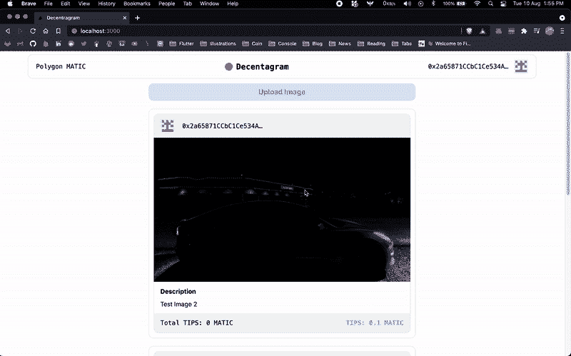
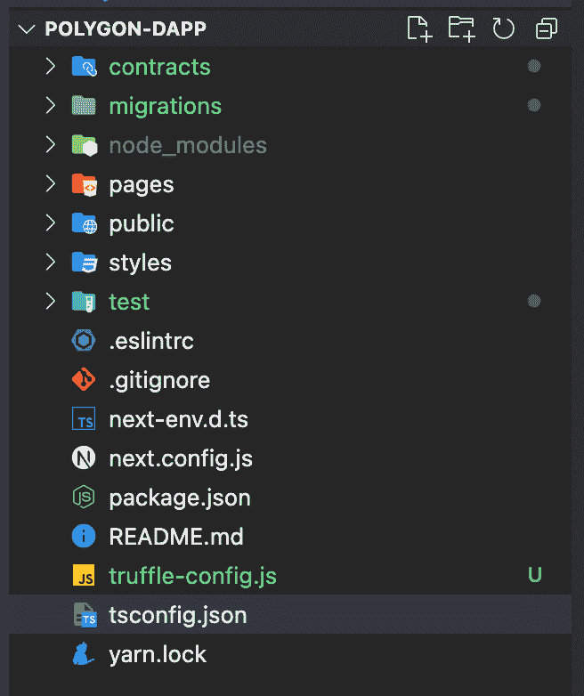
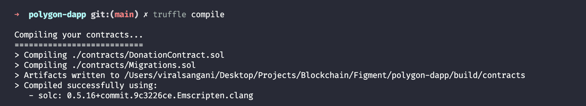
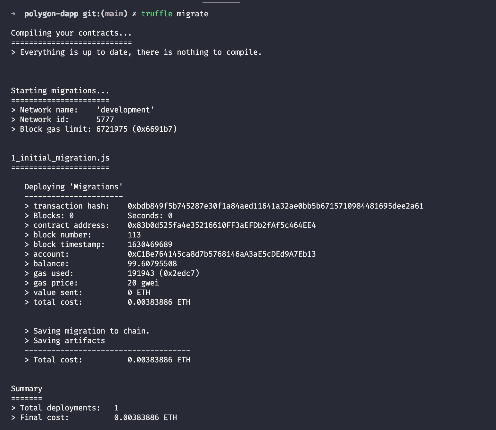
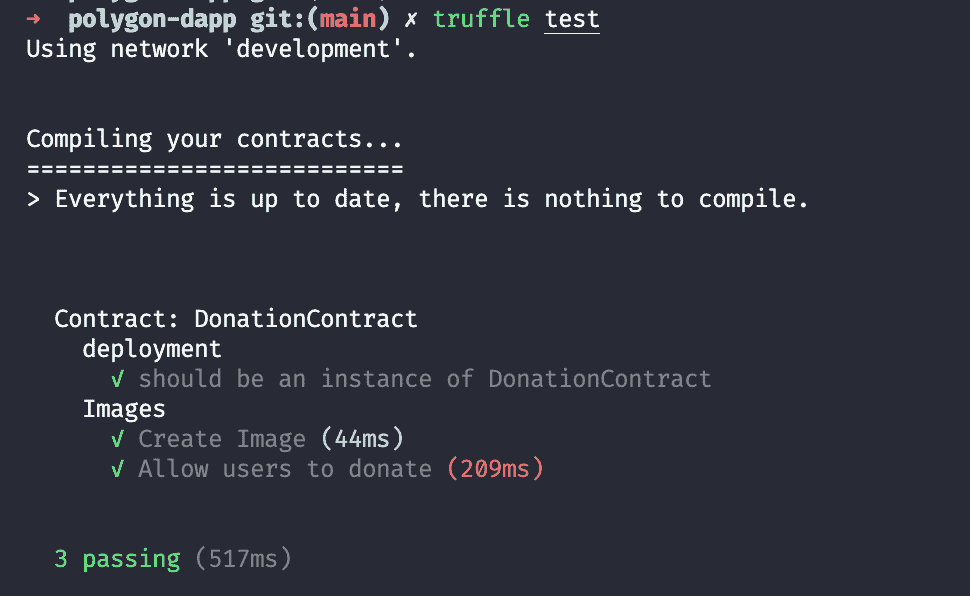
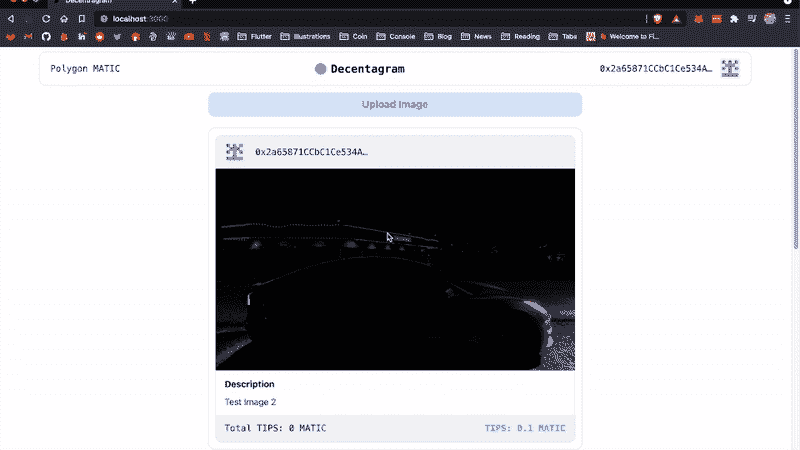

# 介绍

> 原文：<https://github.com/figment-networks/learn-tutorials/blob/master/polygon/build-a-donation-dapp-on-polygon-to-award-your-favourite-content-creator.md>

在本教程中，您将了解如何在 Polygon 上创建一个捐赠 dApp，用 MATIC 令牌奖励您最喜爱的内容创建者，以及如何在 Polygon 网络上部署您的智能合同。

这是我们将创建的 dApp 的外观:

[](https://github.com/figment-networks/learn-tutorials/raw/master/assets/dapp-demo.gif)

# 先决条件

为了成功地学习本教程，你需要对区块链、Solidity smart contracts 和 React 有一个基本的了解和认识。

# 要求

*   您需要从官方网站 [https://metamask.io](https://metamask.io) 在您的浏览器中安装 Metamask。
*   您必须安装 Node.js 的最新版本。为了兼容，我们建议使用 v14.17.6 LTS。

**本教程使用的其他技术:**

*   [可靠性](https://docs.soliditylang.org/en/v0.8.7/) -用于撰写智能合同
*   块菌为本地开发区块链应用程序提供了开发环境
*   为我们的 Dapp 创建前端
*   web 3 . js-Javascript library 将我们的前端连接到智能合约
*   [多边形网络](https://polygon.technology/) -用于部署我们的智能合同
*   [IPFS](https://ipfs.io/) -存储内容创作者上传的图片和视频

**本教程涵盖的主题:**

*   为 Solidity 和 NextJs 设置开发
*   使用 Solidity 创建智能合同
*   使用 truffle 编译和迁移智能合约
*   为我们的智能合约编写测试
*   使用 web3js 将智能合同链接到前端
*   在 NextJs 中使用 TailwindCSS 创建 UI
*   “使用 IPFS 上传图片”
*   将智能合同发布到 Polygon Testnet

# 项目设置

要设置项目文件，我们必须使用节点包管理器 npm 安装几个包。该软件捆绑了 Node.js 的最新版本，但是您仍然需要确保它是用命令`npm -v`安装的。运行以下命令以安装软件包并创建项目目录:

```
npm install -g truffle # Install truffle globally so that you can use truffle from any directory

npx create-next-app --typescript # Install nextjs and setup typescript for your project

cd polygon-dapp
truffle init # Create truffle-config.js test/ and contracts/ directory
```

当在`create-next-app`设置过程中被询问时，使用“polygon-dapp”作为项目名称，这样你就可以很容易地跟随本教程。这是初始设置后的文件夹结构:

[](https://github.com/figment-networks/learn-tutorials/raw/master/assets/folder-structure.png)

`truffle init`命令创建以下目录:

*   所有的智能合约都存放在这个目录下。
*   Truffle 用来部署智能合约的所有脚本都存储在这个目录中。
*   所有智能合约的测试脚本都存储在这个目录下。
*   `truffle-config.js`:包含松露的配置设置。

# 创建可靠智能合同

在`contracts`目录中创建一个名为`DonationContract.sol`的新文件，并添加以下代码:

```
// SPDX-License-Identifier: GPL-3.0
pragma solidity ^0.5.16;

contract DonationContract {
  // Keep track of total number of images in contract
  uint256 public imageCount =  0;

  // Data structure to store images data
  struct Image {
    uint256 id;
    string hash;
    string description;
    uint256 donationAmount;
    address payable author;
  }

  mapping(uint256 => Image) public images;

  // Event emitted when image is created
  event ImageCreated(
    uint256 id,
    string hash,
    string description,
    uint256 donationAmount,
    address payable author
  );

  // Event emitted when an there is a donation
  event DonateImage(
    uint256 id,
    string hash,
    string description,
    uint256 donationAmount,
    address payable author
  );
}
```

*   `imageCount`是一个无符号的公共整数，存储智能合约中图像的总数。
*   `struct Image`是存储关于每个图像的信息(元数据)的数据结构。这包括图像的 id、该图像的 IPFS 哈希、内容创建者添加的描述、该图像收到的总捐赠金额以及捐赠将被发送到的作者地址。
*   `mapping(uint256 => Image) public images`是存储所有图像的映射，其中键是`id`，值是`Image`结构。
*   `ImageCreated`和`DonateImage`是区块链上发出的事件，我们的 dApp 可以监听这些事件，并相应地运行。

```
// Create an Image
function uploadImage(string memory _imgHash, string memory _description) public {
  require(bytes(_imgHash).length > 0);
  require(bytes(_description).length > 0);
  require(msg.sender != address(0x0));
  imageCount++;
  images[imageCount] = Image(
    imageCount,
    _imgHash,
    _description,
    0,
    msg.sender
  );
  emit ImageCreated(imageCount, _imgHash, _description, 0, msg.sender);
}
```

*   `uploadImage`接受图像散列和描述作为参数。在该函数中，我们确保`imageHash`和`description`不为空，并且发送者地址不为空。然后我们将`imageCount`加 1，创建一个新的 Image struct 对象，并以`imageCount`为关键字将其存储在`images`映射中。
*   `msg`是一个全局变量，包含调用函数的人的地址，在我们的例子中是内容的作者。所以要存储`author`的地址，我们可以直接使用`msg.sender`
*   一旦对象存储在地图中，我们就可以发出带有相关数据的`ImageCreated`事件。

```
function donateImageOwner(uint256 _id) public payable {
  require(_id > 0 && _id <= imageCount);

  Image memory _image = images[_id];
  address payable _author = _image.author;
  address(_author).transfer(msg.value);
  _image.donationAmount = _image.donationAmount + msg.value;
  images[_id] = _image;

  emit DonateImage(
    _id,
    _image.hash,
    _image.description,
    _image.donationAmount,
    _author
  );
}
```

*   `donateImageOwner`是一个接受图片 id 的公共付费函数。由于函数是`payable`，全局变量`msg`包含一个名为`value`的字段，该字段包含为捐赠而发送的硬币数量。
*   在函数体中，我们检查`id`参数以确保它不为零，或者不在当前`imageCount`的边界之外。然后，我们通过`_id`(这是作为函数参数传入的)从`images`地图中提取图像，并将其存储在`_image`变量中，因此我们从`_image`变量中提取作者的地址——我们将把捐赠金额发送到该地址。
*   然后我们在`_author`的地址上调用`transfer`函数，并传入`msg.value`，它将把 MATIC 捐赠的金额转移到作者的账户上。
*   `images[_id] = _image` -在捐赠被转移到作者的账户后，我们可以增加`_image`结构中的`donationAmount`并将`_image`保存回`images`地图以更新数据。
*   一旦一切都完成了，我们必须发出`DonateImage`事件。

智能合约到此结束，现在我们可以继续编译和迁移过程了。

# 用 Truffle 编译和部署

既然我们已经写好了智能合同，那么是时候编译它了。打开您的终端并运行以下命令:

```
truffle compile 
```

*   Truffle 将编译 Solidity 文件，您应该会看到类似如下的输出:

[](https://github.com/figment-networks/learn-tutorials/raw/master/assets/truffle-compile.png)

*   为了将我们的联系人迁移到区块链，请转到`migrations`目录，创建一个名为`2_donation_contract_migration.js`的新文件，并添加以下代码:

```
const DonationContract = artifacts.require("DonationContract");

module.exports = function (deployer) {
  deployer.deploy(DonationContract);
};
```

*   如果您注意到在`migrations`目录中，有一个名为`1_initial_migration.js`的文件，它处理`Migrations.sol`合同的迁移。这是我们初始化 truffle 时默认创建的。每个合同都需要一个迁移文件来将其迁移(部署)到区块链。
*   在部署智能合约之前，出于测试目的，您需要设置一些东西。在你的系统上安装 [Ganache](https://www.trufflesuite.com/ganache) 。Ganache 是一个 GUI 应用程序，为您提供本地区块链。如果你不想为此使用 GUI 应用程序，那么你可以安装 [Ganache CLI](https://www.npmjs.com/package/ganache-cli) 来代替。安装后，在您的系统上启动 Ganache。您还需要修改项目根目录中的`truffle-config.js`文件。可以删除`truffle-config.js`现有的所有内容，替换成下面的代码。

```
module.exports = {
  networks: {
    development: {
      host: "localhost",
      port: 7545,
      network_id: "*",
    },
  },
  contracts_directory: "./contracts",
  contracts_build_directory: "./abis",
  compilers: {
    solc: {
      optimizer: {
        enabled: true,
        runs: 200,
      },
    },
  },

  db: {
    enabled: false,
  },
};
```

*   在这里，我们定义了 truffle 将用来部署/迁移我们的智能合约的基本配置。目前，我们将被部署到`localhost:7545`我们的加纳切区块链正在运行的地方。
*   要部署到开发网络(Ganache)，请从项目的根目录运行以下命令:。

```
truffle migrate 
```

该命令会将您的契约部署到 Ganache，并给出类似于以下内容的输出:

[](https://github.com/figment-networks/learn-tutorials/raw/master/assets/truffle-migrate.png)

# 为智能合约编写测试

为您的智能合约编写测试是一项非常重要的任务。一旦智能合约被添加到区块链中，它就不能被修改，因此如果因为代码中的错误而出现任何问题，那么与该合约的所有后续交互都将出现问题。这使得在将代码部署到 mainnet 之前彻底测试它变得非常重要。

当我们运行`truffle init`时，truffle 在我们项目的根目录下创建了一个`test`子目录。在`test`目录中，你可以用你喜欢的任何名字创建一个文件，让我们用`donation-contract-tests.js`开始吧。

> 注意，truffle 使用 [chai](https://www.npmjs.com/package/chai) 库来编写测试。

在开始测试之前，您需要安装几个包。

```
npm install chai chai-as-promised 
```

现在在`test/donation-contract-tests.js`文件中添加以下代码，

```
const { assert } = require("chai");
const DonationContract = artifacts.require("./DonationContract.sol");
require("chai").use(require("chai-as-promised")).should();

contract("DonationContract", ([deployer, author, donator]) => {
  let donationContract;
  before(async () => {
    donationContract = await DonationContract.deployed();
  });

  describe("deployment", () => {
    it("should be an instance of DonationContract", async () => {
      const address = await donationContract.address;
      assert.notEqual(address, null);
      assert.notEqual(address, 0x0);
      assert.notEqual(address, "");
      assert.notEqual(address, undefined);
    });
  });

  describe("Images", () => {
    let result;
    const hash = "abcd1234";
    const description = "This is a test image";
    let imageCount;
    before(async () => {
      result = await donationContract.uploadImage(hash, description, {
        from: author,
      });
      imageCount = await donationContract.imageCount();
    });

    it("Check Image", async () => {
      let image = await donationContract.images(1);
      assert.equal(imageCount, 1);
      const event = result.logs[0].args;
      assert.equal(event.hash, hash);
      assert.equal(event.description, description);
    });

    it("Allow users to donate", async () => {
      let oldAuthorBalance;
      oldAuthorBalance = await web3.eth.getBalance(author);
      oldAuthorBalance = new web3.utils.BN(oldAuthorBalance);
      result = await donationContract.donateImageOwner(imageCount, {
        from: donator,
        value: web3.utils.toWei("1", "Ether"),
      });

      const event = result.logs[0].args;
      let newAuthorBalance;
      newAuthorBalance = await web3.eth.getBalance(author);
      newAuthorBalance = new web3.utils.BN(newAuthorBalance);

      let donateImageOwner;
      donateImageOwner = web3.utils.toWei("1", "Ether");
      donateImageOwner = new web3.utils.BN(donateImageOwner);

      const expectedBalance = oldAuthorBalance.add(donateImageOwner);
      assert.equal(newAuthorBalance.toString(), expectedBalance.toString());
    });
  });
});
```

*   Chai 测试通常被编写成通过 describe 函数是自解释的。这里我们描述两种不同的测试，“部署”和“映像”。
*   在“部署”测试中，我们检查契约是否被正确部署，以及契约的地址是否有效。
*   在“图像”测试中，首先我们创建一个带有作者的样本图像。然后在“检查图像”测试用例中，我们通过将`id`作为 1 传递给`donationContract.images`函数来获取图像。然后，我们可以断言事件接收到的值，以检查该值是否正确。
*   在“允许用户捐赠”测试用例中，我们获取用户的账户余额，然后捐赠给图像的作者。捐赠发出后，我们再次获取该用户的更新余额。现在，我们可以检查旧余额和新余额是否只相差捐给作者的金额。
*   您会注意到在测试脚本的顶部，我们添加了一个工件- `const DonationContract = artifacts.require("DonationContract.sol");`。这些工件由 truffle 在运行时创建，包括与合同相关的重要信息，如应用程序二进制接口(ABI)，因此使用 truffle 运行我们的测试非常重要。要运行测试，请执行以下命令:

```
truffle test 
```

该命令的输出应该类似于以下内容:-

[](https://github.com/figment-networks/learn-tutorials/raw/master/assets/truffle-test.png)

# 使用 web3js 连接到前端

现在智能合约和测试已经处理完毕，是时候将智能合约与前端应用程序集成在一起了。

对于契约调用，我们将创建一个上下文，并通过它提供所有的数据和函数。在项目的根目录中创建一个文件夹`context`，并在该文件夹中创建一个名为`DataContext.tsx`的文件。

`context/DataContext.tsx`

```
declare let window: any;
import { createContext, useContext, useEffect, useState } from "react";
import Web3 from "web3";
import DonationContract from "../abis/DonationContract.json";

interface DataContextProps {
  account: string;
  contract: any;
  loading: boolean;
  images: any[];
  imageCount: number;
  updateImages: () => Promise<void>;
  donateImageOwner: (id: string, donateAmout: any) => Promise<void>;
}

const DataContext = createContext<DataContextProps | null>(null);

export const DataProvider: React.FC = ({ children }) => {
  const data = useProviderData();
  return <DataContext.Provider value={data}>{children}</DataContext.Provider>;
};

export const useData = () => useContext<DataContextProps | null>(DataContext);
```

*   在顶部，我们将`window`对象的类型设置为 null，这样 TypeScript 将允许我们使用像`window.web3`和`window.ethereum`这样的函数。

*   之后，我们进行必要的进口。如果没有安装`web3`包，可以通过运行- `npm install web3`来安装。

*   在第 4 行中，我们获取了`DonationContract`，这是一个 JSON 对象，包含了我们契约的 ABI。这个 ABI 和 JSON 文件是在我们运行`truffle compile`命令时由 truffle 创建的。ABI 包含所有信息，如您在区块链上的合同地址、合同中有哪些函数以及这些函数的参数和返回类型。

*   接下来，我们为 DataContext 声明了一个接口，它包含 DataContext 将提供的所有变量和函数类型。

*   然后我们要创建`DataContext`和`DataProvider`。我们还可以创建一个名为`useData`的定制钩子，稍后我们可以在组件中使用它来轻松地从上下文中访问值。

*   如果你想了解 React 上下文及其工作原理，你可以遵循 React 官方文档中的本指南。

```
export const useProviderData = () => {
  const [loading, setLoading] = useState(true);
  const [images, setImages] = useState<any[]>([]);
  const [imageCount, setImageCount] = useState(0);
  const [account, setAccount] = useState("0x0");
  const [contract, setContract] = useState<any>();

  useEffect(() => {
    loadWeb3();
    loadBlockchainData();
  }, []);

  const loadWeb3 = async () => {
    if (window.ethereum) {
      window.web3 = new Web3(window.ethereum);
      window.ethereum.request({ method: 'eth_requestAccounts', [] })
    } else if (window.web3) {
      window.web3 = new Web3(window.web3.currentProvider);
    } else {
      window.alert(
        "No compatible wallet detected. Please install the Metamask browser extension to continue."
      );
    }
  };

  const loadBlockchainData = async () => {
    const web3 = window.web3;
    var allAccounts = await web3.eth.getAccounts();
    setAccount(allAccounts[0]);
    const networkData = DonationContract.networks["5777"];
    if (networkData) {
      var tempContract = new web3.eth.Contract(
        DonationContract.abi,
        networkData.address
      );
      setContract(tempContract);
      var count = await tempContract.methods.imageCount().call();
      setImageCount(count);
      var tempImageList = [];
      for (var i = 1; i <= count; i++) {
        const image = await tempContract.methods.images(i).call();
        tempImageList.push(image);
      }
      tempImageList.reverse();
      setImages(tempImageList);
    } else {
      window.alert("TestNet not found");
    }
    setLoading(false);
  };
};
```

*   在同一`DataContext.tsx`文件中创建一个名为`useProviderData`的函数。`useProviderData`在`DataProvider`中被调用，因此每次页面加载时`useProviderData`都被调用。
*   在这个函数中，我们声明了我们需要的所有状态变量，然后在`useEffect`中我们进行了两个函数调用，`loadWeb3`和`loadBlockchainData`。
*   在`loadWeb3`中，我们首先检查`window.ethereum`是否存在，它通常由元掩码钱包扩展注入。如果 window.ethereum 存在，那么我们将`window.web3`设置为`Web3(window.ethereum)`的对象，其中`window.ethereum`是 web3 的提供者。
*   如果`window.ethereum`不存在，那么我们检查`window.web3`是否存在，如果存在，那么将`window.web3`设置为`Web3(window.web3)`的对象，其中`window.web3`是 web3 的提供者。
*   如果这些都不存在，那么这意味着用户没有在他们的浏览器中安装钱包，在这种情况下，我们可以显示一个警告。
*   在`loadBlockchainData`函数中，我们正在获取我们需要的所有必要数据，比如用户账号，一个使用来自`DonationContract.json`的 ABI 的契约对象。一旦我们有了契约对象，我们就可以调用契约。在这个函数中，我们从合同中获取图像总数和所有图像。

在`useProviderData`功能中，增加以下功能:

```
const updateImages = async () => {
  setLoading(true);
  if (contract !== undefined) {
    var count = await contract.methods.imageCount().call();
    setImageCount(count);
    var tempImageList = [];
    for (var i = 1; i <= count; i++) {
      const image = await contract.methods.images(i).call();
      tempImageList.push(image);
    }
    tempImageList.reverse();
    setImages(tempImageList);
  }
  setLoading(false);
};

const donateImageOwner = async (id: string, donateAmout: any) => {
  await contract.methods
    .donateImageOwner(id)
    .send({ from: account, value: donateAmout });
};

return {
  account,
  contract,
  loading,
  images,
  imageCount,
  updateImages,
  donateImageOwner,
};
```

*   `updateImages`函数仅获取最新的图像计数和图像，并设置变量。
*   `donateImageOwner`接受图像 id 并捐赠一笔金额，然后调用智能合约的`donateImageOwner`函数并传入参数以及将成为当前用户账号的`from`变量。
*   最后，从`useProviderData`函数返回所有的变量和函数。

现在我们已经在`_app.tsx`文件中添加了`DataProvider`。前往`pages/_app.tsx`，用`<DataProvider>`组件包裹`<Component {...pageProps} />`组件。

```
import "tailwindcss/tailwind.css";
import { DataProvider } from "../contexts/DataContext";

function MyApp({ Component, pageProps }) {
  return (
    <>
      <DataProvider>
        <Component {...pageProps} />
      </DataProvider>
    </>
  );
}

export default MyApp;
```

现在，我们可以访问任何组件中的所有上下文变量。

# 在 Next.js 中使用 TailwindCSS 创建 UI

对于用户界面(UI)，我们将使用 [TailwindCSS](https://tailwindcss.com/) 和 [HeadlessUI](https://headlessui.dev/) 。要安装这些软件包，请运行以下命令:

```
npm install tailwindcss @headlessui/react 
```

当这些包成功安装后，打开文件`pages/index.tsx`删除所有代码，替换为:

```
import Head from "next/head";
import { useState } from "react";
import Body from "../components/Body";
import Header from "../components/Layout/Header";
import { UploadImage } from "../components/UploadImage";
import { useData } from "../contexts/DataContext";

export default function Home() {
  let [isOpen, setIsOpen] = useState(false);
  const { loading } = useData();

  function closeModal() {
    setIsOpen(false);
  }

  function openModal() {
    setIsOpen(true);
  }

  return (
    <div className="flex flex-col items-center justify-start min-h-screen py-2">
      <Head>
        <title>Decentragram</title> <link rel="icon" href="/favicon.ico" />
      </Head>
      <UploadImage isOpen={isOpen} closeModal={closeModal} />
      <Header />
      <div
        className="max-w-2xl w-full bg-blue-100 rounded-xl flex justify-center items-center py-2 mt-3 hover:bg-blue-200 cursor-pointer"
        onClick={openModal}
      >
        <span className="text-blue-500 font-bold text-lg">Upload Image</span>
 </div>
      {loading ? (
        <div className="font-bold text-gray-400 mt-36 text-4xl">Loading...</div>
      ) : (
        <Body />
      )}
    </div>
  );
}
```

*   这里我们从`useData`钩子中取出`loading`变量并检查加载状态:如果加载为真，则显示`Loading...`文本，否则显示`<Body />`。组件。
*   现在我们必须创建三个`components`，因此创建一个名为 components 的新文件夹，并在其中创建三个文件:`Body.tsx`、`UploadImage.tsx`和`Header.tsx`。

将以下代码粘贴到`Body.tsx`中:

```
declare let window: any;
import Identicon from "identicon.js";
import React from "react";
import { useData } from "../contexts/DataContext";

const Body = () => {
  const { images } = useData();
  return (
    <>
      {images.length > 0 &&
        images.map((image, index) => (
          <BodyItem
            key={index}
            totalDonationss={image.donationAmount}
            address={image.author}
            description={image.description}
            hash={image.hash}
            id={image.id}
          />
        ))}
    </>
  );
};

export default Body;

const BodyItem = ({ address, description, totalDonationss, hash, id }) => {
  const { donateImageOwner, updateImages } = useData();
  var data = new Identicon(address, 200).toString();
  return (
    <div className="w-full md:mx-0 md:max-w-2xl mt-5 p-3 border rounded-xl flex flex-col">
      <div className="flex flex-row space-x-5 bg-gray-100 rounded-t-xl py-3 px-4 border-t border-l border-r font-mono items-center">
        
        <div className="overflow-ellipsis w-52 overflow-hidden">{address}</div>
 </div>
      
      <div className="py-3 px-4 flex flex-col border-l border-r">
        <span className="font-sans font-bold">Description</span>
        <span className="font-sans pt-2">{description}</span>
      </div>
      <div className="bg-gray-100 rounded-b-xl py-3 px-4 border-b border-l border-r font-mono flex flex-row justify-between">
        <span>
          Total DONATIONS: {window.web3.utils.fromWei(totalDonations, "Ether")}{" "}
          MATIC
        </span>
        <div
          onClick={async () => {
            let donationAmount = window.web3.utils.toWei("0.1", "Ether");
            await donationImageOwner(id, donationAmount);
            await updateImages();
          }}
        >
          <span className="cursor-pointer font-bold text-blue-400">
            DONATE: 0.1 MATIC
          </span>
 </div>
      </div>
    </div>
  );
};
```

*   在这里，我们从`useData`钩子中获取所有的图像，循环每个图像并显示它们
*   每张图片都有一个向作者或内容捐赠 0.1 MATIC 的选项。点击`DONATE: 0.1 MATIC`，我们从`useData`钩子调用`donationImageOwner`函数，这将最终调用我们的智能契约的`donationImageOwner`函数。

将以下代码粘贴到`Header.tsx`中:

```
import Identicon from "identicon.js";
import React, { useEffect } from "react";
import { useData } from "../../contexts/DataContext";

function Header() {
  const { account } = useData();
  const [data, setData] = React.useState();
  useEffect(() => {
    if (account !== "0x0") {
      setData(new Identicon(account, 200).toString());
    }
  }, [account]);
  return (
    <div className="container items-center">
      <div className="flex flex-col md:flex-row items-center md:justify-between border py-3 px-5 rounded-xl">
        <span className="font-mono">Polygon MATIC</span> <div className="flex flex-row space-x-2 items-center">
          <div className="h-5 w-5 rounded-full bg-blue-500"></div>
          <span className="font-mono text-xl font-bold">Decentagram</span>
 </div>
        <div className="flex flex-row space-x-2 items-center">
          <span className="font-mono overflow-ellipsis w-52 overflow-hidden">
            {account}
          </span>
          {account && data && (
            
          )}
        </div>
      </div>
    </div>
  );
}

export default Header;
```

*   在标题中，我们显示了当前用户的账号，我们可以从`useData`中获得。
*   为了改进 UI，我们还展示了一个基于用户账号的[标识](https://github.com/stewartlord/identicon.js/tree/master)。

对于上传图像，我们有一个模态对话框，作者可以从他们的系统中选择图像并上传到 IPFS。

将以下代码粘贴到`UploadImage.tsx`中:

```
import { Dialog, Transition } from "@headlessui/react";
import { create } from "ipfs-http-client";
import { Fragment, useState } from "react";
import { useData } from "../contexts/DataContext";

interface Props {
  isOpen: boolean;
  closeModal: () => void;
}

export const UploadImage: React.FC<Props> = ({ isOpen, closeModal }) => {
  const [buttonTxt, setButtonTxt] = useState<string>("Upload");
  const [file, setFile] = useState<File | null>(null);
  const { contract, account, updateImages } = useData();
  const client = create({ url: "https://ipfs.infura.io:5001/api/v0" });
  const [description, setDescription] = useState<string>("");

  const uploadImage = async () => {
    setButtonTxt("Uploading to IPFS...");
    const added = await client.add(file);
    setButtonTxt("Creating smart contract...");
    contract.methods
      .uploadImage(added.path, description)
      .send({ from: account })
      .then(async () => {
        await updateImages();
        setFile(null);
        setDescription("");
        setButtonTxt("Upload");
        closeModal();
      })
      .catch(() => {
        closeModal();
      });
  };

  return (
    <>
      <Transition appear show={isOpen} as={Fragment}>
        <Dialog
          as="div"
          className="fixed inset-0 z-10 overflow-y-auto"
          onClose={closeModal}
        >
          <Dialog.Overlay className="fixed inset-0 bg-black opacity-40" />

          <div className="min-h-screen px-4 text-center ">
            <Transition.Child
              as={Fragment}
              enter="ease-out duration-300"
              enterFrom="opacity-0"
              enterTo="opacity-100"
              leave="ease-in duration-200"
              leaveFrom="opacity-100"
              leaveTo="opacity-0"
            >
              <Dialog.Overlay className="fixed inset-0" />
            </Transition.Child>

            {/* This element is to trick the browser into centering the modal contents. */}
            <span
              className="inline-block h-screen align-middle"
              aria-hidden="true"
            >
              &#8203;
            </span> <Transition.Child
              as={Fragment}
              enter="ease-out duration-300"
              enterFrom="opacity-0 scale-95"
              enterTo="opacity-100 scale-100"
              leave="ease-in duration-200"
              leaveFrom="opacity-100 scale-100"
              leaveTo="opacity-0 scale-95"
            >
              <div className="inline-block w-full p-6 my-8 overflow-hidden text-left align-middle transition-all transform bg-white shadow-xl rounded-2xl max-w-xl">
                <Dialog.Title
                  as="h3"
                  className="text-lg font-medium leading-6 text-gray-900"
                >
                  Upload Image to IPFS
                </Dialog.Title> <div className="mt-2">
                  <input
                    onChange={(e) => setFile(e.target.files[0])}
                    className="my-3"
                    type="file"
                  />
                </div>

                {file && (
                  <div className="mt-2">
                    
                  </div>
                )}

                <div className="mt-4">
                  <textarea
                    onChange={(e) => {
                      setDescription(e.target.value);
                    }}
                    value={description}
                    placeholder="Description"
                    className="px-3 py-1 font-sourceSansPro text-lg bg-gray-100 hover:bg-white focus:bg-white rounded-lg border-4 hover:border-4 border-transparent hover:border-green-200 focus:border-green-200 outline-none focus:outline-none focus:ring w-full pr-10 transition-all duration-500 ring-transparent"
                  />
                </div>
                <div className="mt-4">
                  <button
                    type="button"
                    disabled={buttonTxt !== "Upload"}
                    className="inline-flex justify-center px-4 py-2 text-sm font-medium text-blue-900 bg-blue-100 border border-transparent rounded-md hover:bg-blue-200 focus:outline-none focus-visible:ring-2 focus-visible:ring-offset-2 focus-visible:ring-blue-500"
                    onClick={() => {
                      if (file) uploadImage();
                    }}
                  >
                    {buttonTxt}
                  </button>
                </div>
              </div>
            </Transition.Child>
          </div>
        </Dialog>
      </Transition>
    </>
  );
};
```

# 使用 IPFS 上传图片

在`UploadImage.tsx`中，我们使用 IPFS 作为分散的文件存储来上传用户图像。为此，我们必须安装另一个包。

```
npm install ipfs-http-client
```

在使用 IPFS 上传图像之前，我们必须创建一个 IPFS 客户端。在这个例子中，我们使用的是 Infura IPFS 服务，但也有其他可用的服务。

```
const client = create({ url: "https://ipfs.infura.io:5001/api/v0" });
```

```
const added = await client.add(file);
```

要上传文件，调用客户端对象上的`add`函数。`add`函数将返回一个包含上传图像散列的对象。一旦我们有了哈希值(也称为 CID-**C**content**ID**identifier)，我们就可以将该哈希值存储在我们的智能契约中。

通过将散列值附加到有效 IPFS 节点的 URL 上，这个散列值可以在以后用于访问 IPFS 上的图像。例如:

```
https://ipfs.infura.io/ipfs/${hash} 
```

# 将智能合同发布到孟买测试网

发布您的智能合约相对简单。您必须在您的`truffle-config.js`中添加 Matic testnet 的提供者详细信息。

*   首先，你必须将你的 Metamask 钱包连接到 Matic Mumbai testnet。你可以按照[这些指令](https://docs.matic.network/docs/develop/metamask/config-polygon-on-metamask/)去连接。一旦您将 Metamask 连接到 Mumbai testnet，您将需要从 Metamask 获取您在创建 Metamask 帐户时收到的机密恢复短语。如果你不确定如何做到这一点，按照[这些指示](https://metamask.zendesk.com/hc/en-us/articles/360015290032-How-to-reveal-your-Secret-Recovery-Phrase)得到秘密恢复短语(通常也被称为助记符)。
*   现在，在项目目录的根目录下创建一个名为`.secret`的文件，并将助记符粘贴到该文件中。这是必须为合同部署支付汽油费的帐户的秘密恢复短语。
*   **注意**:由于我们正在部署到一个测试网，我们不需要支付实际的 Matic 令牌，我们可以使用 [Matic 水龙头](https://faucet.matic.network/)在孟买测试网的你的账户中收到 1 个 MATIC。
*   **确保你已经在你的`.gitignore`中添加了`.secret`文件，并且不要与任何人分享你的秘密恢复短语(助记符)！**
*   现在我们将不得不在部署时安装`hdwallet-provider`来支付油费。

```
npm install @truffle/hdwallet-provider 
```

一旦这些都准备好了，修改`truffle-config`。你的`truffle-config.js`应该是这样的。

```
const HDWalletProvider = require("@truffle/hdwallet-provider");
const fs = require("fs");
const mnemonic = fs.readFileSync(".secret").toString().trim();

module.exports = {
  networks: {
    development: {
      host: "localhost",
      port: 7545,
      network_id: "*",
    },
    matic: {
      provider: () =>
        new HDWalletProvider({
          mnemonic: {
            phrase: mnemonic,
          },
          providerOrUrl: `https://matic-mumbai--rpc.datahub.figment.io/apikey/{DATAHUB_API_KEY}}/health`,
          chainId: 80001,
        }),
      network_id: 80001,
      confirmations: 2,
      timeoutBlocks: 200,
      skipDryRun: true,
      chainId: 80001,
    },
  },
  contracts_directory: "./contracts",
  contracts_build_directory: "./abis",
  compilers: {
    solc: {
      optimizer: {
        enabled: true,
        runs: 200,
      },
    },
  },
  db: {
    enabled: false,
  },
};
```

这里，我们添加了另一个网络 matic，并添加了 Polygon 的 Mumbai testnet 的 providerOrUrl、chainId 和 network_id。你可以在[多边形文档](https://docs.matic.network/docs/develop/network-details/network/)中找到这些信息。

编辑完`truffle-config.js`后，您只需运行以下命令，将您的合同部署到 polygon testnet。

```
truffle migrate --network matic 
```

Truffle 将合同部署到孟买，您应该会看到类似于以下内容的输出:

```
Compiling your contracts...
===========================
> Everything is up to date, there is nothing to compile.

Starting migrations...
======================
> Network name:    'matic'
> Network id:      80001
> Block gas limit: 20000000 (0x1312d00)

1_initial_migration.js
======================

   Replacing 'Migrations'
   ----------------------
   > transaction hash:    0x8cbc2616e3bf70965c32afded6ae6ece70038df1e39ee2ae4b832383964c7de1
   > Blocks: 2            Seconds: 4
   > contract address:    0x2F082Dd688b1B3c9a8A5310fda680A03873e7fA0
   > block number:        18368623
   > block timestamp:     1630486877
   > account:             0x2a65871CCbC1Ce534A388Bdf83aA28127c5d7c8a
   > balance:             1.851879295
   > gas used:            193243 (0x2f2db)
   > gas price:           1 gwei
   > value sent:          0 ETH
   > total cost:          0.000193243 ETH

   Pausing for 2 confirmations...
   ------------------------------
   > confirmation number: 2 (block: 18368627)

   > Saving migration to the chain.
   > Saving artifacts
   -------------------------------------
   > Total cost:         0.000193243 ETH

2_deploy_contracts.js
=====================

   Replacing 'DonationContract'
   ------------------------
   > transaction hash:    0x24169d6f55478fbae26dc4a89d2b51da75af51ecddb7011ca0d3cd61f06225bc
   > Blocks: 2            Seconds: 4
   > contract address:    0x42c27d00217a7F5AE1cDAd9e71C2342373e13ADE
   > block number:        18368634
   > block timestamp:     1630486899
   > account:             0x2a65871CCbC1Ce534A388Bdf83aA28127c5d7c8a
   > balance:             1.850963627
   > gas used:            869930 (0xd462a)
   > gas price:           1 gwei
   > value sent:          0 ETH
   > total cost:          0.00086993 ETH

   Pausing for 2 confirmations...
   ------------------------------
   > confirmation number: 3 (block: 18368638)

   > Saving migration to the chain.
   > Saving artifacts
   -------------------------------------
   > Total cost:          0.00086993 ETH

Summary
=======
> Total deployments:   2
> Final cost:          0.001063173 ETH 
```

这是我们的 Dapp 最终的样子:

[](https://github.com/figment-networks/learn-tutorials/raw/master/assets/donation-demo-dapp.gif)

# 结论

恭喜你完成教程！感谢您抽出时间来完成它。在本教程中，您学习了如何在 Solidity 中创建智能合同，如何使用 IPFS 上传图像，如何使用 web3js 在前端应用程序中与智能合同交互，以及如何将智能合同发布到 Polygon testnet。这个捐赠 dApp 是 Web 3 开发的无限可能之一。

# 关于作者

我是 Viral Sangani，一个致力于区块链项目和 love Web3 社区的技术爱好者。请随时在 [GitHub](https://github.com/viral-sangani) 上与我联系。