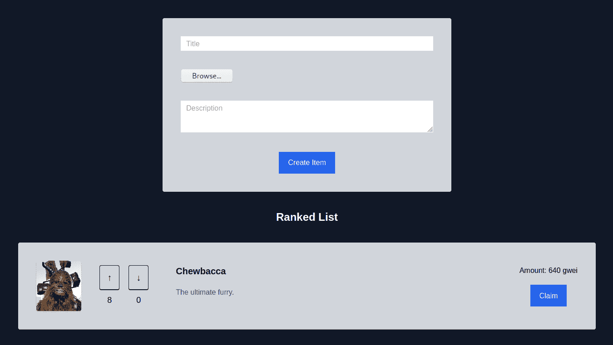
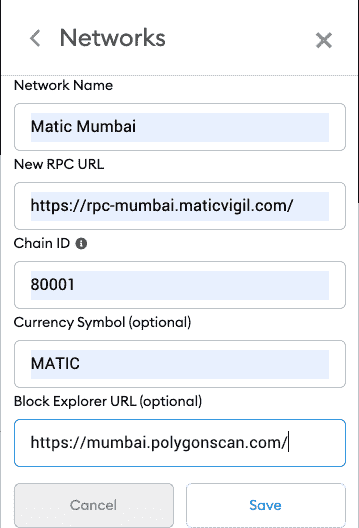
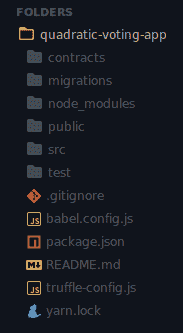
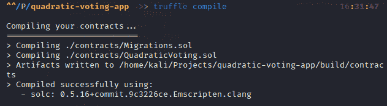
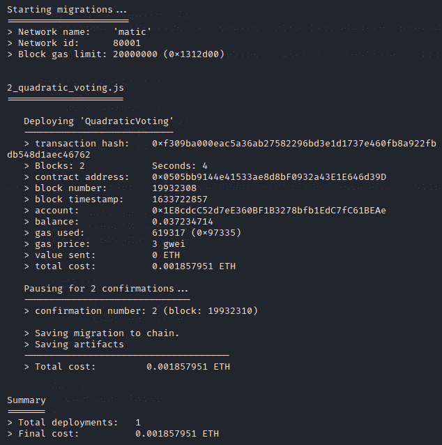
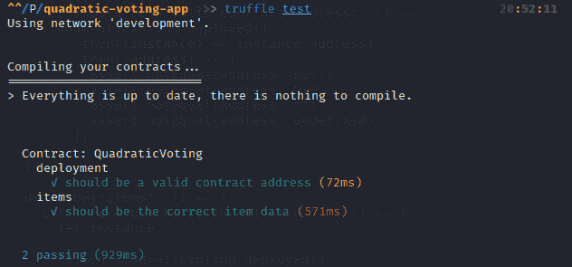
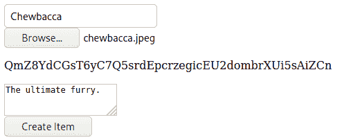
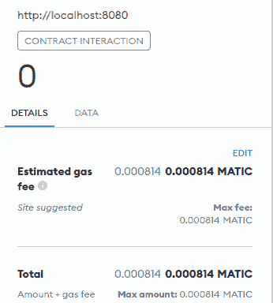
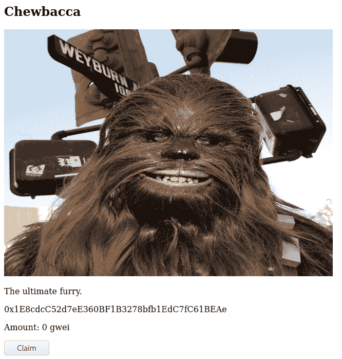
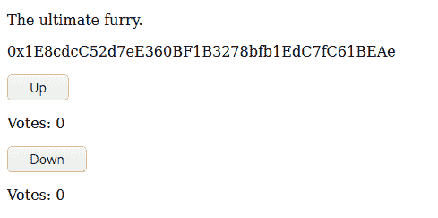

# 介绍

> 原文:[https://github . com/fig ment-networks/learn-tutorials/blob/master/polygon/build-a-quadratic-voting-ranked-list-dapp . MD](https://github.com/figment-networks/learn-tutorials/blob/master/polygon/build-a-quadratic-voting-ranked-list-dapp.md)

在本教程中，我们将学习如何创建一个二次投票应用程序与协作管理的排名列表。这是一个相当复杂的应用程序，也是严肃的 dApp 开发中的一个很好的练习。我们将在 Solidity 中编写一个智能契约，在 Vue.js 中编写一个前端，然后在 Polygon testnet 上部署我们的 dApp。

以下是我们将构建的预览:

[](https://github.com/figment-networks/learn-tutorials/raw/master/assets/quadratic-voting-complete.png)

# 先决条件

本教程假设区块链，坚实度和 Vue.js 的基本知识

本教程结束时，您将能够:

*   在以太坊区块链建立一个全栈 dApp
*   创建可靠的智能合同
*   为智能合约编写测试
*   使用 Truffle 编译和迁移智能合同
*   用 Vue.js 和 Tailwind CSS 构建前端
*   使用 Web3 调用智能合同功能
*   与 IPFS 一起提供图像
*   将智能合约部署到 Polygon Mumbai testnet

# 要求

## 节点、NPM 和纱线

Node.js 是一个运行时环境，允许我们在 web 浏览器之外执行 JavaScript。

NPM 和纱是包装经理。你用哪个是个人喜好的问题。我们将在本教程中使用纱线。

1.  在这里安装 Node.js [。](https://nodejs.org)
2.  检查 NPM 安装:`npm -v`
3.  安装纱线:`npm i -g yarn`

## 松露

Truffle 是一个以太坊的开发环境，我们将使用它来编译和部署我们的智能合约。

`npm i -g truffle`

## 加纳切

Ganache 是一个个人以太坊区块链，你可以将其部署在你的计算机上用于开发目的。

这大部分是可选的，但是建议安装它，这样我们以后可以用它来运行我们的测试。

## MetaMask

MetaMask 是一个浏览器扩展，允许您访问您的以太坊钱包并与 dApps 进行交互。

在这里安装[。](https://metamask.io/)

使用以下配置添加多边形 Mumbai testnet。

[](https://github.com/figment-networks/learn-tutorials/raw/master/assets/metamask-settings-mumbai.webp)

## 试映

这些是我们稍后将使用的附加技术。

*   [坚固度](https://soliditylang.org/)
*   [多边形(Matic)](https://polygon.technology/)
*   [Web3.js](https://web3js.readthedocs.io/)
*   [IPFS](https://ipfs.io/)
*   vista . js
*   [顺风 CSS](https://tailwindcss.com/)

# 项目设置

为了生成初始项目文件，我们将使用 Truffle 和 Vue CLI 工具。

```
npm i -g truffle @vue/cli

vue create quadratic-voting-app

cd quadratic-voting-app
truffle init 
```

创建 Vue app 时，选择“默认(Vue 3)”和“使用纱线”。

您的项目应该是这样的。

[](https://github.com/figment-networks/learn-tutorials/raw/master/assets/quadratic-voting-folder-structure.png)

# 在可靠性中创建智能合同

在`contracts`文件夹中创建一个名为`QuadraticVoting.sol`的新文件。

```
// SPDX-License-Identifier: MIT
pragma solidity >=0.4.0 <0.9.0;

contract QuadraticVoting {
  struct Item {
    address payable owner;
    uint amount;
    bytes32 title;
    string imageHash; // IPFS cid
    string description;
    mapping(address => uint) positiveVotes; // user => weight
    mapping(address => uint) negativeVotes; // user => weight
    uint totalPositiveWeight;
    uint totalNegativeWeight;
  }
```

我们应用程序中的主要数据结构将是项目。用户将对项目投赞成票或反对票，以控制他们的排名，并根据他们的投票权重支付费用。投票是二次方资助的，这意味着任何人都可以添加他们喜欢的权重，但是，提交投票的价格将是权重的平方。

投赞成票所支付的任何费用都将奖励给该项目的创造者，从而创造了一种经济，在这种经济中，最佳建议，即那些被其他人评为最高的建议，将获得最高的收入。这激励了高质量、诚实的建议。反对票费用重新分配到其他项目。

```
  uint constant public voteCost = 10_000_000_000; // wei

  mapping(uint => Item) public items; // itemId => id
  uint public itemCount = 0; // also next itemId
```

`voteCost`常数是就 wei 而言权重为 1 的投票的价格。一个 MATIC(等价于 ETH 的多边形)由 1，000，000，000，000，000 个卫组成，一个 gwei 由 1，000，000，000 个卫组成。因此，`voteCost`设置为 10 gwei，即 0.00000001 MATIC。您可以随意更改该值。

作为二次投票如何工作的一个例子，让我们说这份合同是关于最受欢迎的《星球大战》角色的排名。一个人可能建议汉·索罗，而另一个人可能建议丘巴卡。如果有人给韩 Solo 投+2，那就要花掉他们`10 gwei * 2 * 2 =` 40 gwei。如果有人投+3 给丘巴卡，会让他们付出`10 gwei * 3 * 3 =` 90 gwei。这导致了一个生态系统，其中一个人可能比另一个人投票更多次，如果他们更关心这个话题的话，但每次投票的成本都会成倍增加，从而确保公平的民主。

```
  event ItemCreated(uint itemId);
  event Voted(uint itemId, uint weight, bool positive);

  function currentWeight(uint itemId, address addr, bool isPositive) public view returns(uint) {
    if (isPositive) {
      return items[itemId].positiveVotes[addr];
    } else {
      return items[itemId].negativeVotes[addr];
    }
  }

  function calcCost(uint currWeight, uint weight) public pure returns(uint) {
    if (currWeight > weight) {
      return weight * weight * voteCost; // cost is always quadratic
    } else if (currWeight < weight) {
      // this allows users to save on costs if they are increasing their vote
      // example: current weight is 3, they want to change it to 5
      // this would cost 16x (5 * 5 - 3 * 3) instead of 25x the vote cost
      return (weight * weight - currWeight * currWeight) * voteCost;
    } else {
      return 0;
    }
  }

  function createItem(bytes32 title, string memory imageHash, string memory description) public {
    uint itemId = itemCount++;
    Item storage item = items[itemId];
    item.owner = msg.sender;
    item.title = title;
    item.imageHash = imageHash;
    item.description = description;
    emit ItemCreated(itemId);
  }
```

`currentWeight`和`calcCost`是我们稍后会用到的帮助函数。

函数`createItem`用于向排序列表发布新的项目对象。在创建对象之前，该项目需要设置标题、IPFS 图像哈希和文本描述。当前发件人被视为该项目的所有者。

```
  function positiveVote(uint itemId, uint weight) public payable {
    Item storage item = items[itemId];
    require(msg.sender != item.owner); // owners cannot vote on their own items

    uint currWeight = item.positiveVotes[msg.sender];
    if (currWeight == weight) {
      return; // no need to process further if vote has not changed
    }

    uint cost = calcCost(currWeight, weight);
    require(msg.value >= cost); // msg.value must be enough to cover the cost

    item.positiveVotes[msg.sender] = weight;
    item.totalPositiveWeight += weight - currWeight;

    // weight cannot be both positive and negative simultaneously
    item.totalNegativeWeight -= item.negativeVotes[msg.sender];
    item.negativeVotes[msg.sender] = 0;

    item.amount += msg.value; // reward creator of item for their contribution

    emit Voted(itemId, weight, true);
  }
```

用户不能为他们自己的项目投票，因为这将允许他们申报他们花了多少钱，并使用它再次投票，这基本上意味着他们可以无限地对他们自己的项目投票。因此，我们需要确保发件人不是物品所有者。限制所有者钱包的投票有助于这一点，尽管从技术上讲，他们可以创建一个不同的地址，所以这不是这个问题的完整解决方案。交易的价值也必须足以支付投票的费用。

```
  function negativeVote(uint itemId, uint weight) public payable {
    Item storage item = items[itemId];
    require(msg.sender != item.owner);

    uint currWeight = item.negativeVotes[msg.sender];
    if (currWeight == weight) {
      return; // no need to process further if vote has not changed
    }

    uint cost = calcCost(currWeight, weight);
    require(msg.value >= cost); // msg.value must be enough to cover the cost

    item.negativeVotes[msg.sender] = weight;
    item.totalNegativeWeight += weight - currWeight;

    // weight cannot be both positive and negative simultaneously
    item.totalPositiveWeight -= item.positiveVotes[msg.sender];
    item.positiveVotes[msg.sender] = 0;

    // distribute voting cost to every item except for this one
    uint reward = msg.value / (itemCount - 1);
    for (uint i = 0; i < itemCount; i++) {
      if (i != itemId) items[i].amount += reward;
    }

    emit Voted(itemId, weight, false);
  }
```

反对票的分布略有不同。除了被投票的那一个，资金被分配给每一个项目，而不是奖励主人在列表中添加了一个糟糕的项目。这是所有参与者的一种基本收入。

请注意，这将奖励总投票权重为负数而不是正数的项目，这实质上意味着即使是最差的建议也将从该机制中获得部分收入。您可能希望对这个代码进行创新，通过只允许净积极建议有基本收入来解决这个问题。为了简单起见，我们不会在本教程中深入讨论这个话题。

```
  function claim(uint itemId) public {
    Item storage item = items[itemId];
    require(msg.sender == item.owner);
    item.owner.transfer(item.amount);
    item.amount = 0;
  }
}
```

这允许物品的所有者将任何奖励转移到他们的钱包中。

我们走吧！我们的聪明合同结束了。现在让我们学习如何部署它。

# 用 Truffle 编译和部署

在使用合同之前，我们需要对其进行编辑。我们可以使用之前安装的 Truffle CLI 工具来完成这项工作。

```
truffle compile 
```

您应该得到类似的输出。

[](https://github.com/figment-networks/learn-tutorials/raw/master/assets/quadratic-voting-truffle-compile.png)

您可以在`build/contracts`目录中找到已编译的合同。

现在我们需要将我们的合同迁移(部署)到 Matic Mumbai 测试网络。在`migrations`文件夹中创建一个名为`2_quadratic_voting.js`的新文件。

```
const QuadraticVoting = artifacts.require("QuadraticVoting")

module.exports = function (deployer) {
  deployer.deploy(QuadraticVoting)
}
```

Truffle CLI 稍后将使用这个文件来部署我们的`QuadraticVoting`契约。

编辑`truffle-config.js`文件以添加网络。

```
const fs = require("fs")
const HDWalletProvider = require("@truffle/hdwallet-provider")

const mnemonic = fs.readFileSync(".secret").toString().trim()

module.exports = {
  networks: {
    development: {
      host: "localhost",
      port: 7545,
      network_id: "*",
    },
    // Matic Mumbai testnet RPC (requires API key)
    matic: {
      provider: () =>
        new HDWalletProvider(
          mnemonic,
          "https://rpc-mumbai.maticvigil.com/v1/{APP_ID}",
        ),
      network_id: 80001,
      confirmations: 2,
      timeoutBlocks: 200,
      skipDryRun: true,
    },
  },
  compilers: {
    solc: {
      optimizer: {
        enabled: true,
        runs: 200,
      },
    },
  },
  db: {
    enabled: false,
  },
}
```

我们需要在这里创建一个账户[，为 RPC 设置一个配额。创建一个应用程序，并用应用程序 Id 替换配置中的`{APP_ID}`。你也可以使用](https://rpc.maticvigil.com/)[数据中枢](https://datahub.figment.io)。

确保安装来自 Truffle 的 HD wallet provider 类，这样我们就可以提供一个助记符来签署部署事务。

```
yarn add -D @truffle/hdwallet-provider 
```

为了向区块链发布合同，我们需要支付天然气费用。通过输入你的钱包地址，从孟买的水龙头获取 testnet MATIC。小警告-由于水龙头的问题，您可能会在尝试确认交易的前几次遇到错误。

从 MetaMask 导出您的私钥，并将其粘贴到一个`.secret`文件中。这将被用作配置中的`mnemonic`变量。

现在，我们可以将合同部署到 Polygon。

```
truffle migrate --network matic 
```

您应该会看到类似的输出。

[](https://github.com/figment-networks/learn-tutorials/raw/master/assets/quadratic-voting-truffle-migrate.png)

# 为智能合约编写测试

接下来，我们将为我们的合同编写测试。测试允许我们确保我们的契约代码以编程的方式按预期工作。

在`test`目录下创建一个名为`quadratic-voting-test.js`的文件。

```
const QuadraticVoting = artifacts.require("QuadraticVoting")

contract("QuadraticVoting", (accounts) => {
  describe("deployment", () => {
    it("should be a valid contract address", () =>
      QuadraticVoting.deployed()
        .then((instance) => instance.address)
        .then((address) => {
          assert.notEqual(address, null)
          assert.notEqual(address, 0x0)
          assert.notEqual(address, "")
          assert.notEqual(address, undefined)
        }))
  })

  describe("items", () => {
    it("should be the correct item data", () => {
      let instance

      QuadraticVoting.deployed()
        .then((i) => (instance = i))
        .then(() =>
          instance.createItem(
            web3.utils.utf8ToHex("Chewbacca"), // title
            "ipfs_hash", // imageHash
            "The ultimate furry.", // description
          ),
        )
        .then(() => instance.itemCount())
        .then((count) => assert.equal(count, 1)) // should be 1 item in the registry
        .then(() => instance.items(0))
        .then((item) => {
          assert.equal(web3.utils.hexToUtf8(item.title), "Chewbacca")
          assert.equal(item.imageHash, "ipfs_hash")
          assert.equal(item.description, "The ultimate furry.")
        })
    })
  })
})
```

Truffle 测试套件使用 [Chai](https://www.chaijs.com/) 作为编写测试的库。它已经为我们安装好了。

测试分为两组:`deployment`和`items`。`deployment`测试用于确保成功的部署和有效的合同地址。`items`测试用于确保向区块链发布正确的物品数据。

我们需要使用`utf8ToHex`和`hexToUtf8`，因为`title`在我们的合同中被定义为`bytes32`类型。

如果愿意，您可以为剩余的智能合约函数编写额外的测试。

启动 Ganache，在本地开发的区块链上运行我们的测试。

```
truffle test 
```

您应该会看到类似的输出。

[](https://github.com/figment-networks/learn-tutorials/raw/master/assets/quadratic-voting-truffle-test.png)

# 使用 Web3 与智能合同通信

现在，我们将使用 web3.js 通过 JavaScript 与我们的智能合约进行通信。

安装 web3 包。

```
yarn add web3 
```

在`src/lib/quadratic-voting.js`创建文件。

```
import Web3 from "web3"
import QuadraticVoting from "../../build/contracts/QuadraticVoting.json"

let web3
let contract
let accounts
let loaded = false

// This semicolon is needed or the above statement will cause this to be read as "loaded = false(..)()"
;(async () => {
  if (window.ethereum) {
    web3 = new Web3(window.ethereum)
    await window.ethereum.request({ method: "eth_requestAccounts" })
  } else if (window.web3) {
    web3 = new Web3(window.web3.currentProvider)
  } else {
    window.alert(
      "No compatible wallet detected. Please install the Metamask browser extension to continue.",
    )
  }

  const networkData = QuadraticVoting.networks["80001"] // Matic network data
  contract = new web3.eth.Contract(QuadraticVoting.abi, networkData.address) // address of contract we deployed earlier

  accounts = await web3.eth.getAccounts()

  loaded = true
})()
```

匿名函数允许我们在加载 web 应用程序时异步定义以下变量:

*   `web3`:导入的`Web3`类的一个实例，它允许我们与以太坊区块链交互。
*   `contract`:我们的`QuadraticVoting`契约的一个实例，它允许我们使用它的方法和事件。
*   `accounts`:我们客户的以太坊账户地址列表。
*   `loaded`:告诉我们的前端调用契约函数是安全的。

接下来我们将为`quadratic-voting.js`添加一些辅助函数。

```
export function isReady() {
  return loaded
}

export function address() {
  return accounts[0]
}

export async function voteCost() {
  return await contract.methods.voteCost().call()
}

export async function items(itemId) {
  const item = await contract.methods.items(itemId).call()

  if (item) {
    return {
      id: itemId,
      owner: item.owner,
      amount: item.amount,
      title: web3.utils.hexToUtf8(item.title), // bytes32 => string
      imageHash: item.imageHash,
      description: item.description,
      positiveWeight: item.totalPositiveWeight,
      negativeWeight: item.totalNegativeWeight,
    }
  } else {
    return null
  }
}

export async function itemCount() {
  return await contract.methods.itemCount().call()
}

export async function currentWeight(itemId, isPositive) {
  return await contract.methods
    .currentWeight(itemId, address(), isPositive)
    .call()
}

export async function calcCost(currWeight, weight) {
  return await contract.methods.calcCost(currWeight, weight).call()
}

export async function createItem(title, imageHash, description) {
  return await contract.methods
    .createItem(
      web3.utils.utf8ToHex(title), // string => bytes32
      imageHash,
      description,
    )
    .send({ from: address() })
}

export async function positiveVote(itemId, weight, cost) {
  return await contract.methods
    .positiveVote(itemId, weight)
    .send({ from: address(), value: cost })
}

export async function negativeVote(itemId, weight, cost) {
  return await contract.methods
    .negativeVote(itemId, weight)
    .send({ from: address(), value: cost })
}

export async function claim(itemId) {
  return await contract.methods.claim(itemId).send({ from: address() })
}

export async function rankedItems() {
  const count = await itemCount()
  let itemsArr = []

  for (let i = 0; i < count; i++) {
    const item = await items(i)
    if (item) itemsArr.push(item)
  }

  return itemsArr.sort((a, b) => {
    const netWeightB = b.positiveWeight - b.negativeWeight
    const netWeightA = a.positiveWeight - a.negativeWeight
    return netWeightB - netWeightA // sort from greatest to least
  })
}
```

这些导出的函数允许我们将数据序列化/反序列化到我们的智能契约中，或者从我们的智能契约中反序列化数据。通过对 Web3 进行抽象，它们将有助于简化我们的 UI 代码。

`contract.methods`是我们访问之前在智能合同中定义的功能的方式。`.call()`允许我们离线调用某些功能，而`.send()`将创建一个需要用我们的钱包签名的交易。

创建一个所有已发布项目的列表，并根据投票结果进行排序，从最积极的到最消极的。

我们稍后将从我们的 Vue 组件中使用这些。

# 用 IPFS 上传图像文件

我们需要在我们的`quadratic-voting.js`文件中添加一些东西来增加对图片上传的支持。

首先，添加 IPFS 包。

```
yarn add ipfs-core 
```

现在我们将编辑文件的顶部来导入包。

```
import Web3 from "web3"
import * as IPFS from "ipfs-core"
import QuadraticVoting from "../../build/contracts/QuadraticVoting.json"

let web3
let contract
let accounts
let ipfs
let loaded = false
```

我们需要在加载函数中创建我们的 IPFS 节点。

```
  accounts = await web3.eth.getAccounts()

  ipfs = await IPFS.create()

  loaded = true
})()
```

然后我们将定义一个新的导出的`uploadFile`函数。

```
export async function uploadFile(file) {
  const { cid } = await ipfs.add(file)
  return cid // will be used as the imageHash
}
```

暂时就这样吧！

# 使用 Vue.js 创建前端

终于到了创建我们的 Vue 组件和构建我们的应用程序 UI 的时候了。

## 应用

编辑`src/App.vue`文件。

```
<template>
  <main>
    <CreateItem />
    <RankedList />
  </main>
</template>

<script>
import CreateItem from "@/components/CreateItem.vue"
import RankedList from "@/components/RankedList.vue"
 export default {
 name: "App",
 components: {
 CreateItem,
 RankedList,
 },
}
</script>
```

这是一个简单的组件，包含项目创建表单和我们稍后将创建的项目排序列表。这是我们应用程序的根组件。

## CreateItem

`CreateItem`组件是一个表单，它允许我们为项目创建填充数据。

在`src/components/CreateItem.vue`创建文件。

```
<template>
  <!-- .prevent will prevent the page from redirecting -->
  <form @submit.prevent="submit">
    <input type="text" v-model="title" placeholder="Title" required />
    <br />
    <input
      type="file"
      placeholder="Upload image"
      @input="uploadImage"
      required
    />
    <br />
    <p v-if="imageHash">{{ imageHash }}</p>
    <textarea v-model="description" placeholder="Description" required />
    <br />
    <input type="submit" value="Create Item" />
  </form>
</template>

<script>
import { uploadFile, createItem } from "@/lib/quadratic-voting"
 export default {
 name: "CreateItem",
 methods: {
 async uploadImage(e) {
 const file = e.target.files[0] // get file from oninput event
 this.imageHash = await uploadFile(file) // upload to IPFS network
 },
 async submit() {
 await createItem(this.title, this.imageHash, this.description)
 },
 },
 data() {
 return {
 title: "",
 imageHash: null,
 description: "",
 }
 },
}
</script>
```

该组件将如下所示。我们稍后将设计它。

[](https://github.com/figment-networks/learn-tutorials/raw/master/assets/quadratic-voting-create-item.png)

当您单击“创建项目”按钮时，您应该会看到 MetaMask 提示您确认交易。

[](https://github.com/figment-networks/learn-tutorials/raw/master/assets/quadratic-voting-create-item-metamask.png)

## 排名列表

`RankedList`组件显示以前发布到合同的所有项目的排序列表。

在`src/components/RankedList.vue`创建文件。

```
<template>
  <section>
    <h1>Ranked List</h1>
    <Item v-for="item in items" :key="item.id" :item="item" />
  </section>
</template>

<script>
import Item from "@/components/Item.vue"
import { isReady, rankedItems } from "@/lib/quadratic-voting"
 export default {
 name: "RankedList",
 components: {
 Item,
 },
 data() {
 return {
 items: [],
 }
 },
 created() {
 // make sure app is started before attempting to retrieve items
 const wait = async () => {
 if (isReady()) {
 this.items = await rankedItems()
 } else {
 setTimeout(wait, 100)
 }
 }
 wait()
 },
}
</script>
```

在`created`函数中，我们等待直到合同和 IPFS 节点被定义，每 100ms 检查一次，然后用列表项填充页面。

## 项目

接下来我们需要创建`Item`组件，这样我们的`RankedList`代码就可以编译了。

在`src/components/Item.vue`创建文件。

```
<template>
  <div>
    <h2>{{ item.title }}</h2>
    <!-- ipfs.io is the gateway we will be using to serve our image files -->
    
    <p>{{ item.description }}</p>
    <p>{{ item.owner }}</p>
    <!-- the "Claim" button is only displayed to the item owner -->
    <template v-if="address() === item.owner">
      <!-- item.amount is in wei but must be translated to gwei -->
      <p>Amount: {{ item.amount / 1_000_000_000 }} gwei</p>
      <button @click="claimGwei">Claim</button>
    </template>
    <!-- non-owners are shown voting controls -->
    <template v-else>
      <button @click="upvote">Up</button>
      <p>Votes: {{ item.positiveWeight }}</p>
      <button @click="downvote">Down</button>
      <p>Votes: {{ item.negativeWeight }}</p>
      <!-- submit section is only displayed if a user changes their weight -->
      <div v-if="weight !== startWeight">
        <p>Weight: {{ weight }}</p>
        <p>Cost: {{ cost / 1_000_000_000 }} gwei</p>
        <button @click="submitVote">Submit Vote</button>
      </div>
    </template>
  </div>
</template>

<script>
import {
 address,
 currentWeight,
 calcCost,
 positiveVote,
 negativeVote,
 claim,
} from "@/lib/quadratic-voting"
 export default {
 name: "Item",
 props: ["item"],
 methods: {
 address,
 upvote() {
 this.weight += 1
 this.setCost()
 },
 downvote() {
 this.weight -= 1
 this.setCost()
 },
 async setCost() {
 if (this.weight === 0) {
 this.cost = 0
 } else {
 const isPositive = this.weight > 0
 const currWeight = await currentWeight(this.item.id, isPositive)
 this.cost = await calcCost(currWeight, Math.abs(this.weight))
 }
 },
 async submitVote() {
 if (this.weight >= 0) {
 // submit positive vote if weight is positive
 await positiveVote(this.item.id, this.weight, this.cost)
 } else if (this.weight < 0) {
 // submit negative vote if weight is negative
 await negativeVote(this.item.id, -this.weight, this.cost)
 }
 },
 async claimGwei() {
 await claim(this.item.id) // transfers rewards to owner wallet
 },
 },
 data() {
 return {
 weight: 0,
 startWeight: 0,
 cost: 0,
 }
 },
 created() {
 const getWeight = async () => {
 // calculate the net weight to be used with voting controls
 const posWeight = await currentWeight(this.item.id, true)
 const negWeight = await currentWeight(this.item.id, false)
 this.weight = posWeight - negWeight
 // keep track of the weight we started with
 this.startWeight = this.weight
 }
 getWeight()
 },
}
</script>
```

这将是迄今为止我们最大和最复杂的组件。实现代码时，请仔细阅读代码。

根据您发布的数据，我们的`RankedList`组件现在应该看起来像这样。

[](https://github.com/figment-networks/learn-tutorials/raw/master/assets/quadratic-voting-ranked-items-claim.png)

如果您将元掩码钱包切换到不同的帐户并重新加载页面，您应该会看到投票控件，而不是“声明”按钮。赞成票和反对票都会显示出来。

[](https://github.com/figment-networks/learn-tutorials/raw/master/assets/quadratic-voting-ranked-items-voting.png)

与“向上”/“向下”按钮交互将显示一个提交部分，允许您对项目进行二次投票。

[](https://github.com/figment-networks/learn-tutorials/raw/master/assets/quadratic-voting-submit-vote.png)

请注意`640 gwei`费用，它是从`8 * 8 * 10 gwei`开始计算的，其中`10 gwei`是我们在合同中定义的`voteCost`。

点击“提交投票”按钮，您可以确认交易。

[](https://github.com/figment-networks/learn-tutorials/raw/master/assets/quadratic-voting-submit-vote-metamask.png)

# 用顺风 CSS 设计组件的样式

我们的最后一步将是我们的 Vue 组件的样式，使应用程序看起来更漂亮。

## 配置

我们将需要下面的包来使用 Tailwind CSS 样式化我们的组件。

```
yarn add -D tailwindcss@npm:@tailwindcss/postcss7-compat postcss@^7 autoprefixer@^9 postcss-loader 
```

创建一个名为`postcss.config.js`的文件。这允许我们使用`tailwindcss`作为 PostCSS 插件。

```
module.exports = {
  plugins: {
    tailwindcss: {},
    autoprefixer: {},
  },
}
```

创建一个名为`tailwind.config.js`的文件。在生产中构建时，purge 选项从我们编译的 CSS 输出中删除任何未使用的样式。

```
module.exports = {
  purge: ["./src/**/*.vue"],
  darkMode: false,
  theme: {
    extend: {},
  },
  variants: {},
  plugins: [],
}
```

然后在`src/App.vue`加上以下内容。请注意，这是一个全局样式表。

```
<style lang="postcss" global>
@tailwind base;
@tailwind components;
@tailwind utilities;
</style>
```

## 成分

现在终于到了让我们的组件看起来像真正的应用程序的一部分的时候了。

编辑`App.vue`为我们的应用添加深色背景。

```
<template>
  <main class="p-10 min-h-screen bg-gray-900">
    <CreateItem />
    <RankedList />
  </main>
</template>
```

编辑`CreateItem.vue`使我们的表单更加突出。请注意对`imageHash`段落所做的更改。

```
<template>
  <form @submit.prevent="submit" class="bg-gray-300 p-10 w-1/2 mx-auto rounded">
    <input
      type="text"
      v-model="title"
      placeholder="Title"
      required
      class="px-3 py-1 w-full mb-10"
    />
    <br />
    <input
      type="file"
      placeholder="Upload image"
      @input="uploadImage"
      required
      class="text-gray-300"
    />
    <br />
    <!-- top margin will separate displayed hash from file input when imageHash is defined -->
    <p class="mb-10 text-gray-300" :class="imageHash ? 'mt-3' : ''">
      {{ imageHash || "" }}
    </p>
    <textarea
      v-model="description"
      placeholder="Description"
      required
      class="px-3 py-1 w-full mb-10"
    />
    <br />
    <input
      type="submit"
      value="Create Item"
      class="
 block
 mx-auto
 px-5
 py-3
 bg-blue-600
 hover:bg-blue-500
 text-white
 cursor-pointer
 "
    />
  </form>
</template>
```

编辑`RankedList.vue`来增加项目之间的间距和样式我们的标题。

```
<template>
  <section class="flex flex-col items-center gap-10">
    <h1 class="text-2xl text-center text-white font-bold mt-10">Ranked List</h1>
    <Item v-for="item in items" :key="item.id" :item="item" />
  </section>
</template>
```

最后，编辑`Item.vue`。这个组件的布局会有很大的变化，但是功能是一样的。

```
<template>
  <div class="bg-gray-300 p-10 rounded flex items-center">
    
    <div class="mr-5">
      <button
        @click="upvote"
        class="
 text-xl
 px-4
 py-3
 border border-b-2 border-black
 rounded
 hover:bg-black hover:text-white
 "
      >
        &uarr;
      </button>
      <p class="text-lg text-center mt-2">{{ item.positiveWeight }}</p>
    </div>
    <div class="mr-10">
      <button
        @click="downvote"
        class="
 text-xl
 px-4
 py-3
 border border-b-2 border-black
 rounded
 hover:bg-black hover:text-white
 "
      >
        &darr;
      </button>
      <p class="text-lg text-center mt-2">{{ item.negativeWeight }}</p>
    </div>
    <div>
      <h2 class="text-xl font-bold mb-5">{{ item.title }}</h2>
      <p class="text-gray-600 mb-5">{{ item.description }}</p>
    </div>
    <div v-if="address() === item.owner" class="ml-auto">
      <p class="mb-5 text-center">
        Amount: {{ item.amount / 1_000_000_000 }} gwei
      </p>
      <button
        @click="claimGwei"
        class="block mx-auto px-5 py-3 bg-blue-600 hover:bg-blue-500 text-white"
      >
        Claim
      </button>
    </div>
    <div v-else-if="weight !== startWeight" class="ml-auto">
      <p class="mb-5 text-center">Weight: {{ weight }}</p>
      <p class="mb-5 text-center">Cost: {{ cost / 1_000_000_000 }} gwei</p>
      <button
        @click="submitVote"
        class="block mx-auto px-5 py-3 bg-blue-600 hover:bg-blue-500 text-white"
      >
        Submit Vote
      </button>
    </div>
  </div>
</template>
```

我们完了！我们的应用程序现在应该有一个更好的外观。

[](https://github.com/figment-networks/learn-tutorials/raw/master/assets/quadratic-voting-complete.png)

# 结论

恭喜你！完成本教程后，您现在应该知道如何在 Solidity 中创建智能合约，使用 Web3 与智能合约交互，将合约部署到多边形 testnet，以及使用 Vue/Tailwind 构建前端。现在，您正在成为一名全栈 dApp 开发人员。

# 关于作者

我是 giraffekey，一个对去中心化技术感兴趣的自由软件开发者。请随时在 [GitHub](https://github.com/giraffekey) 上与我联系。

# 参考

*   块菌文件:[https://www.trufflesuite.com/docs/truffle/overview](https://www.trufflesuite.com/docs/truffle/overview)
*   polygon(Matic)docs:[https://docs . polygon . technology/docs/develop/getting-started](https://docs.polygon.technology/docs/develop/getting-started)
*   MetaMask docs: [https://docs.metamask.io/guide/](https://docs.metamask.io/guide/)
*   Web3 docs: [https://web3js.readthedocs.io/en/v1.5.2/](https://web3js.readthedocs.io/en/v1.5.2/)
*   https://docs.ipfs.io/concepts/what-is-ipfs/的 IPFS 医生