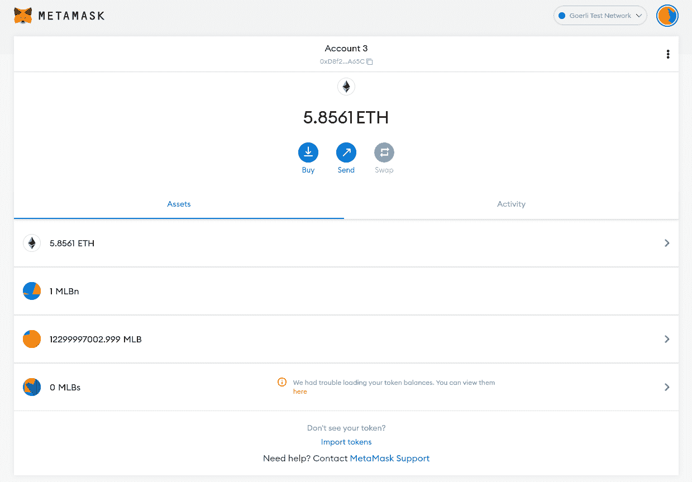
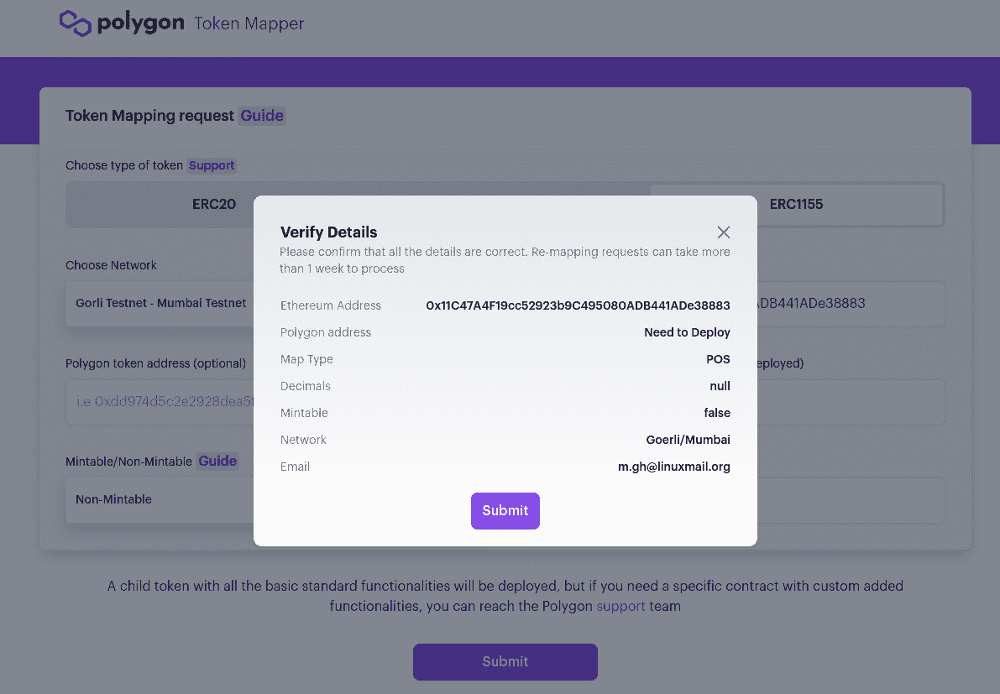
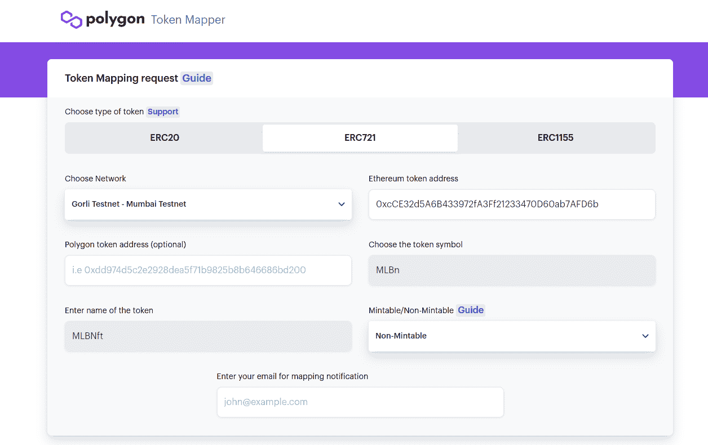
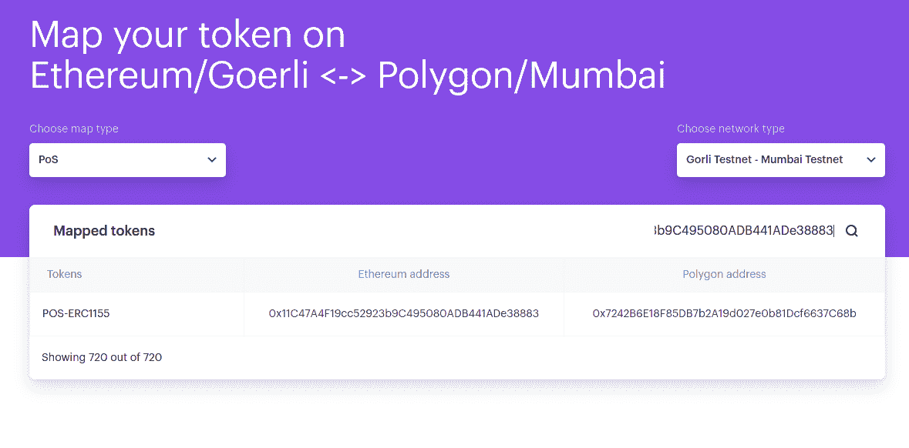
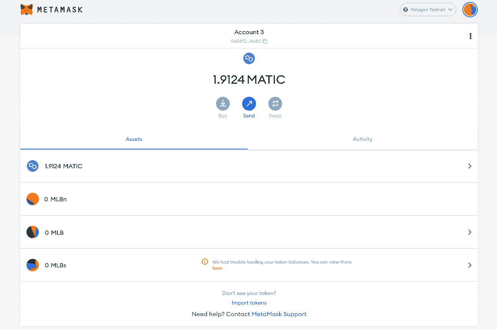
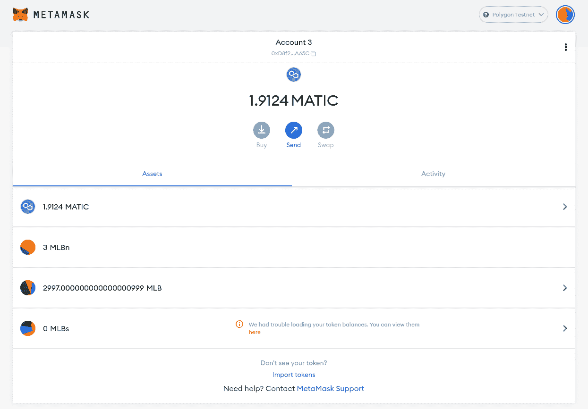
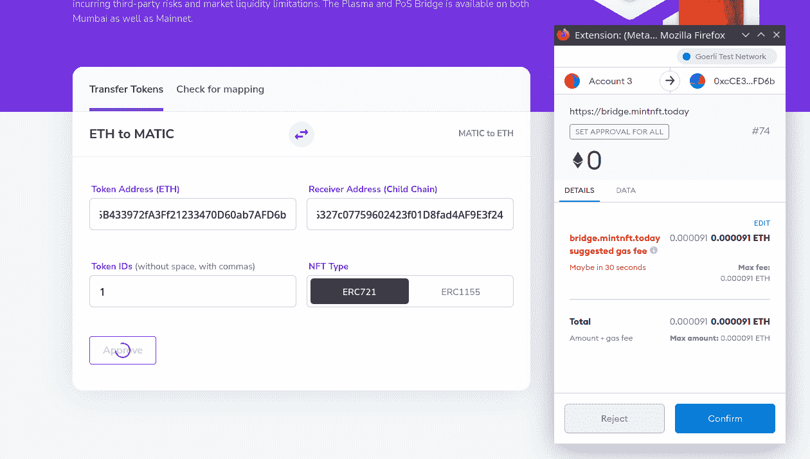
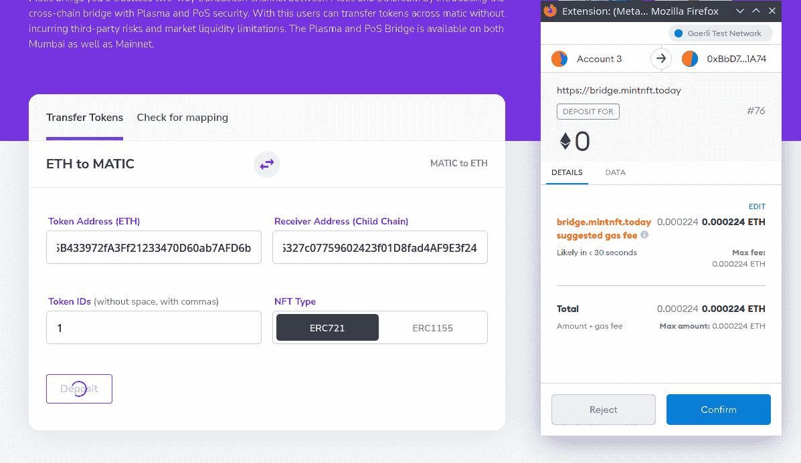
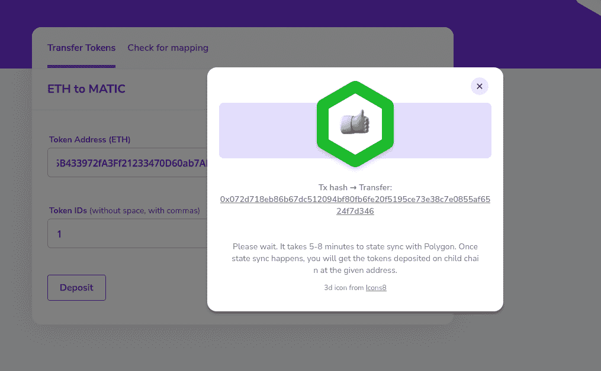

# 介绍

> 原文:[https://github . com/fig ment-networks/learn-tutorials/blob/master/polygon/ERC 1155-721-pos-bridge-SDK . MD](https://github.com/figment-networks/learn-tutorials/blob/master/polygon/erc1155-721-pos-bridge-sdk.md)

在本教程中，我们将介绍将 ERC-1155 和 ERC-721 令牌传输到 Polygon (Matic)链，以及使用 Polygon PoS SDK 从 Polygon 传输到以太坊的过程。
我们将使用**以太坊 Goerli** 测试网和**多边形孟买**测试网，并且已经部署的 ERC 令牌及其源代码已经在以太网扫描上得到验证。Polygon Proof of Stake (PoS)桥是以太坊和 Polygon 上的一种机制和一组合同，将帮助我们在根链和子链之间移动资产。与[等离子桥](https://docs.matic.network/docs/develop/ethereum-matic/plasma/getting-started/)相比，Polygon PoS 桥要快得多，这使得它成为寻求更快撤回的 dApps 的更好选择。

# 先决条件

在本教程中，我们将使用元掩码作为我们的钱包。如果你不熟悉或者不知道怎么用，可以在 YouTube 上查看[这个视频。](https://www.youtube.com/watch?v=Af_lQ1zUnoM)

当您创建元掩码钱包时，它会为您提供一个秘密恢复短语。有了这个短语，你可以在 Metamask 中恢复**你的所有**账户。我们将在本教程的后面使用它。这里有一篇关于[如何揭示你的秘密恢复短语](https://metamask.zendesk.com/hc/en-us/articles/360015290032-How-to-reveal-your-Secret-Recovery-Phrase)的文章。

# 要求

*   [**Metamask**](https://metamask.io/)
*   [**Nodejs**](https://nodejs.org/en/download/)v 14 . 17 . 6 LTS 或更高版本安装
*   [**Geth**](https://geth.ethereum.org/docs/install-and-build/installing-geth):1 . 10 . 8 版本

# 设置元掩码

在我们进入移动代币的细节之前，让我们设置**元掩码**，以便我们可以检查我们的 **ETH** 、 **MATIC** 和 ERC 代币余额。

> 注意:在写这篇教程的时候，Metamask 桌面版还不太支持 ERC-1155。它不显示余额，但提供了到余额的链接。所以我们将使用`web3js`来检查余额。

## 格里

Goerli 测试网络是在 Metamask 的可用网络列表中预先配置的。您可以从元掩码界面顶部的下拉列表中选择它。

只要你愿意在一个有效的 Twitter 或脸书账户上发帖，你就可以从 Goerli 认证的水龙头上用 testnet Ether 为你的账户注资。如果这不是你想做的事情，在 [goerli 有一个替代的水龙头](https://goerli-faucet.slock.it/)

[](https://github.com/figment-networks/learn-tutorials/raw/master/assets/pos-bridge-sdk-balance-metamask.png)

## 孟买

您可以打开[mumbai.polygonscan.com](https://mumbai.polygonscan.com/)并点击*页面底部页脚处的“添加孟买网络”,或者*使用以下信息手动添加:

*   **网络名称:**多边形孟买测试网
*   **RPC 网址:**【https://rpc-mumbai.maticvigil.com/ T2】
*   **链号:** 80001
*   **货币符号:** MATIC
*   **屏蔽浏览器网址:**【https://mumbai.polygonscan.com/ T2】

[](https://github.com/figment-networks/learn-tutorials/raw/master/assets/erc1155-pos-mumbai.png)

你可以在这里用 MATIC [为你的**孟买**账户注资](https://faucet.polygon.technology)

# 大联盟 ERC-1155 合同

> 你可以在这里找到创建你自己的 ERC-1155 令牌的分步指南[。](https://github.com/mlibre/blockchain/tree/master/Ethereum/ERC1155)

ERC-1155 是一种令牌标准，您可以在一个**智能合约中拥有多个可替换和不可替换的令牌。是我们已经在 Goerli 测试网上部署的合同。这是一架标准的开放式齐柏林 ERC-1155 飞机。
本合同仅包含两个令牌:**

*   哪一个是 id 为 0 的可替换令牌。
*   `MLBNFun`哪个是 id 为 1 的不可替换令牌。

我们将映射下面的契约并转移一些令牌。这是合同信息:

```
Name: MLBs
Tokens: MLBFun, MLBNFun
Owner: 0xD8f24D419153E5D03d614C5155f900f4B5C8A65C
Contract Address: 0x11C47A4F19cc52923b9C495080ADB441ADe38883
Goerli etherscan: https://goerli.etherscan.io/address/0x11C47A4F19cc52923b9C495080ADB441ADe38883 
```

为您打算映射的合同收集此信息。

## 使用 Web3js 的 ERC-1155 天平

ERC-1155 合约有一个`balanceOf`功能。它需要两个参数:

*   钱包地址:地址，例如合同所有者(`0xD8f24D419153E5D03d614C5155f900f4B5C8A65C`)。
*   TokenID:令牌 ID。例如， **0** 指的是我们的 ERC-1155 合约中的`MLBFun`令牌。

如果您已经配置了提供者和 Truffle hdwallet 提供者，您可以使用此功能来检查您的 ERC-1155 令牌:

```
async function getTokenBalance(web3, address, contractABI, contractAddress) {
  let contractInstance = new web3.eth.Contract(contractABI, contractAddress);
  let result = await contractInstance.methods.balanceOf(address, 0).call() // 0 is a tokenID
  console.log(`TokenID ${0}:`, result);

  result = await contractInstance.methods.balanceOf(address, 1).call() // 1 is a tokenID
  console.log(`TokenID ${1}:`, result);
}
```

我们在 Goerli 的合同的`balanceOf`输出如下:

```
TokenID 0: 7000000000000000000
TokenID 1: 1 
```

对孟买来说:

```
TokenID 0: 0
TokenID 1: 0 
```

完整的源代码是:

```
const Web3 = require("web3");
const HDWalletProvider = require("@truffle/hdwallet-provider")
const secrets = require('./secrets.json')

let address = "0xD8f24D419153E5D03d614C5155f900f4B5C8A65C"; // The address to check balance of

let contractAddressInMumbai = "0x7242B6E18F85DB7b2A19d027e0b81Dcf6637C68b"; // Mumbai Contract Address
let contractABIMumbai = [{
  "inputs": [{
    "internalType": "uint256",
    "name": "MLBF......."
  }]
}]

let contractAddressGoerli = "0x11C47A4F19cc52923b9C495080ADB441ADe38883"; // Goerli Contract Address
let contractABIGoerli = [{
  "inputs": [{
    "internalType": "uint256",
    "name": "MLBF......."
  }]
}]

// Mumbai Provider
const provider = new HDWalletProvider(secrets.privateKey, secrets.mumbai);

// Goerli Provider
// const provider = new HDWalletProvider(secrets.privateKey, secrets.localGeth);

const web3 = new Web3(provider);

(async () => {
  try {
    await getBalance()
  } catch (e) {
    console.log(e)
  }
})()

async function getBalance() {
  let contractInstance = new web3.eth.Contract(contractABIMumbai, contractAddressInMumbai);
  let result = await contractInstance.methods.balanceOf(address, 0).call()
  console.log(`TokenID ${0}:`, result);

  result = await contractInstance.methods.balanceOf(address, 1).call()
  console.log(`TokenID ${1}:`, result);
}
```

`secrets.json`:包含地址(0xd8f2)的**种子**、**私钥**。以及**孟买 API URL** 。例如:

```
{
  "privateKey": "This should be the private key of an account specifically made for use on the Goerli testnet",
  "seed": "This should be a Secret Recovery Phrase from Metamask and ONLY used on Ethereum testnets",
  "mumbai": "https://matic-mumbai--jsonrpc.datahub.figment.io/apikey/YOUR_API_KEY/",
  "localGeth": "http://127.0.0.1:8545"
}
```

# MLBn ERC-721 合同

> 你可以在这里找到创建你自己的 ERC-721 令牌[的分步指南。](https://github.com/mlibre/blockchain/tree/master/Ethereum/ERC721)

**ERC-721** 是代表不可替代令牌所有权的标准。不可替换的令牌可以代表存储在某个地方的一段数据，可以是区块链、分散式存储，也可以是...
`MLBNft`是我们已经部署在 Goerli testnet 上的合同。这是一架标准的开放式齐柏林 ERC 721 飞机。
此合同有一个`MLBn` NFT，它只铸造了一次，TokenID 为 1。

我们将绘制以下合同，并转移 NFT。这是合同信息:

```
Name: MLBNft
Token: MLBn
Balance: 1
TokenID: 1
Owner: 0xD8f24D419153E5D03d614C5155f900f4B5C8A65C
Contract Address: 0xcCE32d5A6B433972fA3Ff21233470D60ab7AFD6b
goerli etherscan https://goerli.etherscan.io/address/0xcCE32d5A6B433972fA3Ff21233470D60ab7AFD6b 
```

为您打算映射的合同收集此信息。

## 使用 Web3js 的 ERC-721 天平

ERC-721 合同有一个`balanceOf`功能。它将**钱包地址**作为参数，并返回余额。

如果您已经配置了一个提供商和 truffle-hdwallet-provider，您可以使用此功能来检查您的 ERC-721 令牌信息和余额。

```
async function getBalance(web3, contract, contractAddress)
{
  let contractInstanse = new web3.eth.Contract(ABI, contractAddress);
  let result = await contractInstanse.methods.balanceOf(address).call()
  console.log(`Balance:` , result);
}
```

我们在 Goerli 的合同的`balanceOf`输出如下:

```
Balance: 1 
```

对孟买来说:

```
Balance: 0 
```

完整的源代码是:

```
const Web3 = require("web3");
const HDWalletProvider = require("@truffle/hdwallet-provider")
const secrets = require('./secrets.json')

let address = "0xD8f24D419153E5D03d614C5155f900f4B5C8A65C"; // The address to check balance of

let contractAddressGoerli = "0xcCE32d5A6B433972fA3Ff21233470D60ab7AFD6b"; // Goerli Contract Address
let contractAddressInMumbai = "0xf6320326327c07759602423f01D8fad4AF9E3f24"; // Mumbai Contract Address
let ABI = [{"inputs":[],"s..."}]

// const provider = new HDWalletProvider(secrets.privateKey, secrets.localGeth); // Goerli Provider
const provider = new HDWalletProvider(secrets.privateKey, secrets.mumbai); // mumbai Provider

const web3 = new Web3(provider);

(async () => {
  try
  {
    await getBalance()
  }
  catch (e)
  {
    console.log(e)
  }
})()

async function getBalance() {
  let contractInstanse = new web3.eth.Contract(ABI, contractAddressInMumbai);
  let result = await contractInstanse.methods.balanceOf(address).call()
  console.log(`Balance` , result);
}
```

`secrets.json`:包含地址(0xd8f2)的**种子**、**私钥**。以及**孟买 API URL** 。例如:

```
{
  "privateKey": "This should be the private key of an account specifically made for use on the Goerli testnet",
  "seed": "This should be a Secret Recovery Phrase from Metamask and ONLY used on Ethereum testnets",
  "mumbai": "https://matic-mumbai--jsonrpc.datahub.figment.io/apikey/YOUR_API_KEY/",
  "localGeth": "http://127.0.0.1:8545"
}
```

# 入门指南

1.  为了在**根**(以太坊)和**子**(多边形)契约之间转移资产，应该首先映射它们。这是一个在根链和子链之间镜像现有令牌契约的过程。
    如果您想要转移的令牌已经存在于**多边形**上，这意味着您不需要执行**映射**。
    查看[官方文档](https://docs.polygon.technology/docs/develop/ethereum-matic/submit-mapping-request/)了解映射过程。
2.  在我们制定了合同之后，是时候转移资产了。我们使用 [Polygon SDK](https://polygon.technology/polygon-sdk/) 来传递令牌。此外，我们将用 [Mintnft](https://bridge.mintnft.today/) 转让 ERC-721 和 ERC-1155 代币。

# 绘图

既然一切准备就绪。让我们映射我们的合同。

*   转到 [mapper.matic.today](https://mapper.matic.today/map/) 并完成表格

*   确保您要映射的令牌已经在以太网扫描上验证了其[合同](https://etherscan.io/verifyContract)

*   选择**戈利测试网- >孟买测试网**

    *   ERC-1155

        [](https://github.com/figment-networks/learn-tutorials/raw/master/assets/erc1155-pos-map.png)

    *   ERC-721

        [](https://github.com/figment-networks/learn-tutorials/raw/master/assets/erc721-pos-map.png)

*   此时，映射过程不是立即的。可能需要 3 天才能得到确认。

然后打开 [mapper.matic.today](https://mapper.matic.today/) ，输入合同地址，看是否已经添加。

[](https://github.com/figment-networks/learn-tutorials/raw/master/assets/erc1155-pos-mapped.png)

你可能注意到了，格利和孟买的合同地址是不同的。让我们记住将它添加到 Metamask，这样当我们连接到孟买时它也会显示出来。

1.  Open Metamask.
2.  从可用网络列表中选择 Mumbai testnet。
3.  添加令牌。
4.  将合同地址粘贴在那里
    *   ERC-1155: `0x7242B6E18F85DB7b2A19d027e0b81Dcf6637C68b`
    *   ERC-721: `0xf6320326327c07759602423f01D8fad4AF9E3f24`

现在应该是这样的:

[](https://github.com/figment-networks/learn-tutorials/raw/master/assets/pos-bridge-sdk-metamask-mumbai.png)

我们在孟买还没有任何代币。我们可以转移一些到桥那边，然后再检查我们的余额。

# 使用 SDK 传输

让我们来看看使用 SDK 传输令牌的工作流:

1.  **批准:**代币的所有者必须批准**以太坊谓词合同**，该合同将**锁定**他们想要转移到 Polygon 的代币数量。
2.  **存款:**然后必须在**root chain manager**合同上调用一个函数，这将在孟买测试网上触发 **ChildChainManager** 合同。然后， **ChildChainManager** 契约将调用**子令牌**契约的**存款**函数。
    子**契约是 **Goerli** testnet 令牌契约在 **Mumbai** testnet 中的副本。**

## 提供者

为了与 Goerli 和 Mumbai 进行交互，我们可以运行一个本地节点(这稍微有点困难)或者使用基础设施提供商的 RPC 端点，比如 DataHub 或 Infura(这简单得多)。

对于 **Goerli** ，我们将运行一个本地 Geth 节点。你也可以使用 [Infura](https://infura.io) 。
对于**孟买**，我们将使用[数据中枢](https://datahub.figment.io/)。

戈利:

[安装 Geth 客户端](https://geth.ethereum.org/docs/install-and-build/installing-geth)，如果尚未安装，则运行:

```
geth --goerli --http --syncmode=light --http.api="eth,net,web3,personal,txpool" --allow-insecure-unlock  --http.corsdomain "*" 
```

默认端点是`127.0.0.1:8545`。
可以贴上看看是否一切正常:

```
geth attach http://127.0.0.1:8545
eth.getBalance("0xD8f24D419153E5D03d614C5155f900f4B5C8A65C") 
```

**孟买**:

*   注册一个[数据中心账户](https://datahub.figment.io/)
*   从[数据中心服务仪表板](https://datahub.figment.io/services/Polygon/)中选择多边形服务
*   向下滚动以查看多边形端点 URL
*   像这样形成 URL，用从 DataHub 获得的 API 密钥替换文本 YOUR _ API _ KEY:`https://matic-mumbai--jsonrpc.datahub.figment.io/apikey/YOUR_API_KEY/`

## 安装助手

现在我们已经有了需要的信息和其他重要的部分，我们可以使用 maticjs 客户端库和 Truffle 的 HDWalletProvider 类编写一些有用的代码。
我们需要用节点包管理器在命令行上安装这两个包。使用以下命令安装软件包，并将它们保存在项目清单中，`package.json`:

```
npm install @maticnetwork/maticjs --save
npm install @truffle/hdwallet-provider --save 
```

## 转移 ERC-1155

为了传输 ERC-1155 令牌，我们分别调用了`approveERC1155ForDeposit`和`depositSingleERC1155ForUser`函数。

## 赞同

为了**批准****以太坊谓词合同**，我们只需要调用`approveERC1155ForDeposit`函数。代码很简单:

```
let result = await maticPOSClient.approveERC1155ForDeposit(rootToken, {
  from: user,
  gasPrice: "10000000000"
});
```

## 存款

接下来，我们将调用**以太坊谓词契约**的`depositSingleERC1155ForUser`函数:

```
let result_2 = await maticPOSClient.depositSingleERC1155ForUser(
  rootToken,
  user,
  tokenId.toString(),
  amount,
  data, {
    from: user,
    gasPrice: "10000000000"
  }
)
```

为了将所有这些都放在可以在 web 浏览器或命令行上执行的 JavaScript 中，我们可以添加一些常量，并使用一个外部文件来保存敏感的 API 键和 wallet 种子短语。这是一个如何使用 maticjs 和 HDWalletProvider 类与 Polygon 上部署的智能合约进行通信的完整示例。使用以下代码作为构建您自己的解决方案的指南！

```
// main.js
const HDWalletProvider = require("@truffle/hdwallet-provider")
const {
  MaticPOSClient
} = require("@maticnetwork/maticjs")
const secrets = require("./secrets.json")

let user = "0xD8f24D419153E5D03d614C5155f900f4B5C8A65C"
let rootToken = "0x11C47A4F19cc52923b9C495080ADB441ADe38883" // Goerli Contract Address
let amount = 999 // Amount of token we want to transfer
let tokenId = 0 // Token ID
let data = "0x0" // Additional data

const parentProvider = new HDWalletProvider(secrets.seed, "http://127.0.0.1:8545") // // Local Geth client address
const maticProvider = new HDWalletProvider(secrets.seed, secrets.mumbai) // DataHub Mumbai Testnet JSONRPC URL

const maticPOSClient = new MaticPOSClient({
  network: "testnet",
  version: "mumbai",
  parentProvider,
  maticProvider
});

(async () => {
  try {
    let result = await maticPOSClient.approveERC1155ForDeposit(rootToken, {
      from: user,
      gasPrice: "10000000000"
    })
    let result_2 = await maticPOSClient.depositSingleERC1155ForUser(
      rootToken,
      user,
      tokenId.toString(),
      amount,
      data, {
        from: user,
        gasPrice: "10000000000"
      }
    )
    console.log(result)
    console.log(result_2)
  } catch (error) {
    console.log(error)
  }
})()
```

**approveERC1155ForDeposit** 的预期输出如下所示:

```
{
  blockHash: '0xc6b7b5a0ace622ca73abb20923fd1995976f8fbff0ea2b92111f72924288c204',
  blockNumber: 5571533,
  contractAddress: null,
  cumulativeGasUsed: 26780,
  effectiveGasPrice: '0x2540be400',
  from: '0xd8f24d419153e5d03d614c5155f900f4b5c8a65c',
  gasUsed: 26780,
  logsBloom: '0x00000000000000000000000000000000000000000000000000000000000000000000000000000000000000000000000000000000000000000000008000000',
  status: true,
  to: '0x11c47a4f19cc52923b9c495080adb441ade38883',
  transactionHash: '0x2627a28ff17a57565445bb4222b5ccf99389e325c3b388ba21c8293288bea1e7',
  transactionIndex: 0,
  type: '0x0',
  events: {
    ApprovalForAll: {
      address: '0x11C47A4F19cc52923b9C495080ADB441ADe38883',
      blockNumber: 5571533,
      transactionHash: '0x2627a28ff17a57565445bb4222b5ccf99389e325c3b388ba21c8293288bea1e7',
      transactionIndex: 0,
      blockHash: '0xc6b7b5a0ace622ca73abb20923fd1995976f8fbff0ea2b92111f72924288c204',
      logIndex: 0,
      removed: false,
      id: 'log_c2ae5ce3',
      returnValues: [Result],
      event: 'ApprovalForAll',
      signature: '0x17307eab39ab6107e8899845ad3d59bd9653f200f220920489ca2b5937696c31'
    }
  }
}
```

并且对于**用户**的存款单 ERC 1155:

```
{
  blockHash: '0x1a95b0e2633ea2691841c358ad87811ad0413e6e60d3c1a1dd0b738fbf4bb0e0',
  blockNumber: 5571535,
  contractAddress: null,
  cumulativeGasUsed: 497826,
  effectiveGasPrice: '0x2540be400',
  from: '0xd8f24d419153e5d03d614c5155f900f4b5c8a65c',
  gasUsed: 125838,
  logsBloom: '0x0000000000000210000000000000000000000000000000000020000000080000000000000000000000040008000000000000008000000000000000000',
  status: true,
  to: '0xbbd7cbfa79faee899eaf900f13c9065bf03b1a74',
  transactionHash: '0xfd107f2ce76b183153eaff4bccaff6873386ef89e6e5937bf30aa153612757ee',
  transactionIndex: 1,
  type: '0x0',
  events: {
    '0': {
      address: '0xB19a86ba1b50f0A395BfdC3557608789ee184dC8',
      blockNumber: 5571535,
      transactionHash: '0xfd107f2ce76b183153eaff4bccaff6873386ef89e6e5937bf30aa153612757ee',
      transactionIndex: 1,
      blockHash: '0x1a95b0e2633ea2691841c358ad87811ad0413e6e60d3c1a1dd0b738fbf4bb0e0',
      logIndex: 1,
      removed: false,
      id: 'log_6fa41672',
      returnValues: Result {},
      event: undefined,
      signature: null
    },
    '1': {
      address: '0x11C47A4F19cc52923b9C495080ADB441ADe38883',
     .
     .
     .
  }
}
```

仅提及几件事:

*   `secrets.json`:包含地址(0xd8f2)的**种子**、**私钥**。以及**孟买 API URL** 。例如:

```
{
  "privateKey": "This should be the private key of an account specifically made for use on the Goerli testnet",
  "seed": "This should be a Secret Recovery Phrase from Metamask and ONLY used on Ethereum testnets",
  "mumbai": "https://matic-mumbai--jsonrpc.datahub.figment.io/apikey/YOUR_API_KEY/",
  "localGeth": "http://127.0.0.1:8545"
}
```

*   `@truffle/hdwallet-provider`:处理交易签名的过程。
*   Goerli 地址，我们持有令牌并希望通过它发送交易。
*   Goerli 测试网上的 ERC-1155 合同地址。
*   `amount`:我们要转移的**令牌**的数量。

## 转移 ERC-721

为了传输 ERC-1155 令牌，我们分别调用了`approveERC721ForDeposit`和`depositERC721ForUser`函数。

### 赞同

为了**批准****以太坊谓词合同**，我们只需要调用`approveERC721ForDeposit`函数。代码很简单:

```
await maticPOSClient.approveERC721ForDeposit(rootToken, tokenId, {
  from: user
})
```

### 存款

接下来，我们将调用**以太坊谓词契约**的`depositERC721ForUser`函数:

```
await maticPOSClient.depositERC721ForUser(
  rootToken,
  user,
  tokenId.toString(),
  { from: user }
)
```

这是一个如何使用 maticjs 和 HDWalletProvider 类与 Polygon 上部署的智能合约进行通信的完整示例。使用以下代码作为构建您自己的解决方案的指南！

```
// main.js
const HDWalletProvider = require("@truffle/hdwallet-provider")
const { MaticPOSClient } = require("@maticnetwork/maticjs")
const secrets = require("./secrets.json")

let user = "0xD8f24D419153E5D03d614C5155f900f4B5C8A65C"
let rootToken = "0xcCE32d5A6B433972fA3Ff21233470D60ab7AFD6b" // Goerli Contract Address
let childToken = "0xf6320326327c07759602423f01D8fad4AF9E3f24" // Goerli Contract Address
let tokenId = 3 // Token ID

const parentProvider = new HDWalletProvider(secrets.seed, "http://127.0.0.1:8545") // // Local Geth client address
const maticProvider = new HDWalletProvider(secrets.seed, secrets.mumbai) // DataHub Mumbai Testnet JSONRPC URL

const maticPOSClient = new MaticPOSClient({
  network: "testnet",
  version: "mumbai",
  parentProvider,
  maticProvider
});

(async () =>
{
  try
  {
    let result = await maticPOSClient.approveERC721ForDeposit(rootToken, tokenId, {
      from: user,
      gasPrice: "10000000000"
    })
    console.log(result)
    let result_2 = await maticPOSClient.depositERC721ForUser(
      rootToken,
      user,
      tokenId.toString(),
      { 
        from: user,
        gasPrice: "10000000000"
      }
    )
    console.log(result_2)
  }
  catch (error)
  {
    console.log(error)
  }
})()
```

**approveERC721ForDeposit** 的预期输出如下所示:

```
{
  blockHash: '0xc20d22a31da707a97930a0277dfdc64c4d1fdabe619ee8d5c30e8ec4429de8a7',
  blockNumber: 5611016,
  contractAddress: null,
  cumulativeGasUsed: 29345,
  effectiveGasPrice: '0x87ffb64b',
  from: '0xd8f24d419153e5d03d614c5155f900f4b5c8a65c',
  gasUsed: 29345,
  logsBloom: '0x00000000000000000000000000000000000000000000000000000000000000000000000000000000000000000100000000000000000000000000000000000',
  status: true,
  to: '0xcce32d5a6b433972fa3ff21233470d60ab7afd6b',
  transactionHash: '0xe397fe030e14402ecfd4920a2e4dc32f3adb7b2cd8baa6df2cb7fa22decd4b8c',
  transactionIndex: 0,
  type: '0x0',
  events: {
    Approval: {
      address: '0xcCE32d5A6B433972fA3Ff21233470D60ab7AFD6b',
      blockNumber: 5611016,
      transactionHash: '0xe397fe030e14402ecfd4920a2e4dc32f3adb7b2cd8baa6df2cb7fa22decd4b8c',
      transactionIndex: 0,
      blockHash: '0xc20d22a31da707a97930a0277dfdc64c4d1fdabe619ee8d5c30e8ec4429de8a7',
      logIndex: 0,
      removed: false,
      id: 'log_3c37d4f8',
      returnValues: [Result],
      event: 'Approval',
      signature: '0x8c5be1e5ebec7d5bd14f71427d1e84f3dd0314c0f7b2291e5b200ac8c7c3b925'
    }
  }
}
```

对于**用户**的存款人 721:

```
{
  blockHash: '0xb353ae7b47953a6bec8c2a0d01852dbb917d4b018cf3d8243d1fd69cdde3ee56',
  blockNumber: 5611018,
  contractAddress: null,
  cumulativeGasUsed: 268430,
  effectiveGasPrice: '0x87ffb64b',
  from: '0xd8f24d419153e5d03d614c5155f900f4b5c8a65c',
  gasUsed: 111868,
  logsBloom: '0x000000000000000000000000000000000',
  status: true,
  to: '0xbbd7cbfa79faee899eaf900f13c9065bf03b1a74',
  transactionHash: '0x5167f0d875aeeb0b9a695be6acbcfe568039f7e43084d58f6211dbf14ec8336f',
  transactionIndex: 2,
  type: '0x0',
  events: {
    '0': {
      address: '0x74D83801586E9D3C4dc45FfCD30B54eA9C88cf9b',
      blockNumber: 5611018,
      transactionHash: '0x5167f0d875aeeb0b9a695be6acbcfe568039f7e43084d58f6211dbf14ec8336f',
      transactionIndex: 2,
      blockHash: '0xb353ae7b47953a6bec8c2a0d01852dbb917d4b018cf3d8243d1fd69cdde3ee56',
      logIndex: 2,
      removed: false,
      id: 'log_bed4a03e',
      returnValues: Result {},
      event: undefined,
      signature: null
    },
    '1': {
      address: '0xcCE32d5A6B433972fA3Ff21233470D60ab7AFD6b',
      blockNumber: 5611018,
      transactionHash: '0x5167f0d875aeeb0b9a695be6acbcfe568039f7e43084d58f6211dbf14ec8336f',
      transactionIndex: 2,
      blockHash: '0xb353ae7b47953a6bec8c2a0d01852dbb917d4b018cf3d8243d1fd69cdde3ee56',
      .
      .
```

# 潜在错误和解决方案

**无法运行 main.js**

如果您遇到类似以下的错误消息

```
Error: execution reverted: RootChainManager: TOKEN_NOT_MAPPED 
```

合同尚未映射。

**Geth 不运行**

如果您的本地 Geth 节点没有运行，您将得到如下错误:

```
Error: PollingBlockTracker - encountered an error while attempting to update latest block:
Error: connect ECONNREFUSED 127.0.0.1:8545 
```

**没有对等机可用**

如果您得到这样的错误

```
{
  code: -32000,
  message: 'getDeleteStateObject (0000000000000000000000000000000000000000) error: no suitable peers available'
} 
```

稍等片刻，再试一次

# 同步和确认

Mumbai 从 Goerli 链读取数据并自行同步最多需要 5 分钟。一旦同步完成，我们就可以通过`web3js`检查代币余额。

我们在格利的 ERC-1155 合同的产量平衡如下:

```
TokenID 0: 6999999999999998935
TokenID 1: 1 
```

对孟买来说:

```
TokenID 0: 999
TokenID 1: 0 
```

元掩码类似于:

[](https://github.com/figment-networks/learn-tutorials/raw/master/assets/pos-bridge-sdk-metamask-mumbai-after.png)

# 使用 Web 用户界面传输

通过 **Web UI** 转移资产非常简单。就像 SDK 一样，有**批准**和**存放**的步骤:

1.  打开 [MintNFT 桥](https://bridge.mintnft.today/)
2.  确保在 Metamask 中选择了 Goerli Testnet

[](https://github.com/figment-networks/learn-tutorials/raw/master/assets/erc721-pos-metamask-eth-goerli.png)

3.  输入 Goerli 和 Mumbai 的合同地址，以及您要转移的令牌 ID。

4.  点击**批准**

[](https://github.com/figment-networks/learn-tutorials/raw/master/assets/erc721-pos-ui.png)

5.  然后查看交易细节，如汽油费和你发送代币的智能合同，然后点击**确认**
6.  现在，等到你收到确认。元掩码和网站都会发送通知。
7.  现在点击**存款**

[](https://github.com/figment-networks/learn-tutorials/raw/master/assets/erc721-pos-ui-deposit.png)

8.  一旦交易被挖掘，过程就完成了！完成转移大约需要 7 分钟。如前所述，多边形需要大约 5 分钟来同步。

[](https://github.com/figment-networks/learn-tutorials/raw/master/assets/erc721-pos-ui-done.png)

# 使用 SDK 撤回 ERC-721

现在，如果我们想将令牌从 Mumbai 转移到 Goerli，与之前类似，我们可以依次调用`burnERC721`和`exitERC721`函数。
让我们来看看使用 SDK 撤销代币的工作流程:

1.  我们将调用**子令牌**契约的 **burn** 函数，该函数将烧毁令牌。
2.  我们将调用 **RootChainManager** 契约的 **exit** 函数，该函数提交烧录证明并转移令牌。

## 烧伤

为了让**烧掉**代币，我们只需要调用`burnERC721`函数。代码很简单:

```
let result = await maticPOSClient.burnERC721(childToken, tokenId, {
  from: user
})
```

预期的输出是这样的:

```
{
  blockHash: '0x5e259cb402d7537b3d030e511865ab5e0aeb13416c72a52846fcceb2785788d8',
  blockNumber: 19748463,
  contractAddress: null,
  cumulativeGasUsed: 1088161,
  effectiveGasPrice: '0xb2d05e00',
  from: '0xd8f24d419153e5d03d614c5155f900f4b5c8a65c',
  gasUsed: 35319,
  logsBloom: '0x00000000000000001000',
  status: true,
  to: '0xf6320326327c07759602423f01d8fad4af9e3f24',
  transactionHash: '0x09400584a1eabdf85fc491bbbfbc9d5283905478e76fd6a5d7d22bb63e0510fa',
  transactionIndex: 4,
  type: '0x0',
  events: {
    '0': {
      address: '0x0000000000000000000000000000000000001010',
      blockNumber: 19748463,
      transactionHash: '0x09400584a1eabdf85fc491bbbfbc9d5283905478e76fd6a5d7d22bb63e0510fa',
      transactionIndex: 4,
      blockHash: '0x5e259cb402d7537b3d030e511865ab5e0aeb13416c72a52846fcceb2785788d8',
      removed: false,
      id: 'log_8aa0a436',
      returnValues: Result {},
      event: undefined,
      signature: null
    },
    Approval: {
      address: '0xf6320326327c07759602423f01D8fad4AF9E3f24',
      blockNumber: 19748463,
      transactionHash: '0x09400584a1eabdf85fc491bbbfbc9d5283905478e76fd6a5d7d22bb63e0510fa',
      transactionIndex: 4,
      blockHash: '0x5e259cb402d7537b3d030e511865ab5e0aeb13416c72a52846fcceb2785788d8',
      id: 'log_a24d5618',
      returnValues: [Result],
      event: 'Approval',
      signature: '0x8c5be1e5ebec7d5bd14f71427d1e84f3dd0314c0f7b2291e5b200ac8c7c3b925'
    },
    Transfer: {
      address: '0xf6320326327c07759602423f01D8fad4AF9E3f24',
      blockNumber: 19748463,
      transactionHash: '0x09400584a1eabdf85fc491bbbfbc9d5283905478e76fd6a5d7d22bb63e0510fa',
      transactionIndex: 4,
      blockHash: '0x5e259cb402d7537b3d030e511865ab5e0aeb13416c72a52846fcceb2785788d8',
      id: 'log_eb4348bf',
      returnValues: [Result],
      event: 'Transfer',
      signature: '0xddf252ad1be2c89b69c2b068fc378daa952ba7f163c4a11628f55a4df523b3ef'
    }
  }
}
```

保持`transactionHash`值。我们应该把它传递给`exit`函数。

## 出口

一旦提交了**检查点**，我们就可以使用通过调用`burnERC721`获得的事务散列来调用`exitERC721`函数:

> 请注意，提交和包含检查点可能需要一些时间。你可以通过向这个 API 发送块号来检查它是否包含:[https://APIs . matic . network/API/v1/Mumbai/BLOCK-included/THE _ BLOCK _ NUMBER](https://apis.matic.network/api/v1/mumbai/block-included/THE_BLOCK_NUMBER)

```
await maticPOSClient.exitERC721(
  burnTxHash, // transactionHash: 0x09400584a1eabdf85fc491bbbfbc9d5283905478e76fd6a5d7d22bb63e0510fa
  { from: user }
)
```

预期的输出是这样的:

```
{
  from: '0xD8f24D419153E5D03d614C5155f900f4B5C8A65C',
  gas: 285406,
  gasLimit: 285406,
  gasPrice: '10000000000',
  nonce: 74,
  chainId: 5,
  value: 0,
  to: '0xBbD7cBFA79faee899Eaf900F13C9065bF03B1A74',
  data: '0x3805550f0d0b901a037f448de982f4a254613497c08d7cb1f8e445d73e51ba1b6d9045
  .
  .
}
```

完整的源代码是:

```
// main.js
const HDWalletProvider = require("@truffle/hdwallet-provider")
const { MaticPOSClient } = require("@maticnetwork/maticjs")
const secrets = require("./secrets.json")

let user = "0xD8f24D419153E5D03d614C5155f900f4B5C8A65C"
let rootToken = "0xcCE32d5A6B433972fA3Ff21233470D60ab7AFD6b" // Goerli Contract Address
let childToken = "0xf6320326327c07759602423f01D8fad4AF9E3f24" // Mumbai Contract Address
let tokenId = 4 // Token ID

const parentProvider = new HDWalletProvider(secrets.seed, secrets.goerli) // Goerli provider address
const maticProvider = new HDWalletProvider(secrets.seed, secrets.mumbai) // DataHub Mumbai Testnet JSONRPC URL

const maticPOSClient = new MaticPOSClient({
  network: "testnet",
  version: "mumbai",
  parentProvider,
  maticProvider
});

(async () =>
{
  try
  {
    // let result = await maticPOSClient.burnERC721(childToken, tokenId, {
    // 	from: user
    // })
    // console.log(result)
    let burnTxHash = "0x09400584a1eabdf85fc491bbbfbc9d5283905478e76fd6a5d7d22bb63e0510fa" // result.transactionHash
    let result_2 = await maticPOSClient.exitERC721(
      burnTxHash,
      { from: user,
        encodeAbi: true,
        gasPrice: "10000000000"
      }
    )
    console.log(result_2)
  }
  catch (error)
  {
    console.log(error)
  }
})()
```

# 结论

恭喜你！通过完成本教程，你学会了如何使用**多边形位置桥**。我们已经配置了 **Metamask** 和 **Geth** ，与 **Goerli** 测试网和 **Mumbai** 测试网进行通信。然后**我们在网络之间映射** **ERC** 契约，这样它就可以通过网桥传输。最后，我们调用 PoS 桥契约上的函数，并将我们的资产从以太坊移动到多边形。

# 关于作者

我是 mlibre，一个来自太阳系的陌生人。我对区块链理工感兴趣，发现它对很多事情都很有用。请随意检查我的 Github