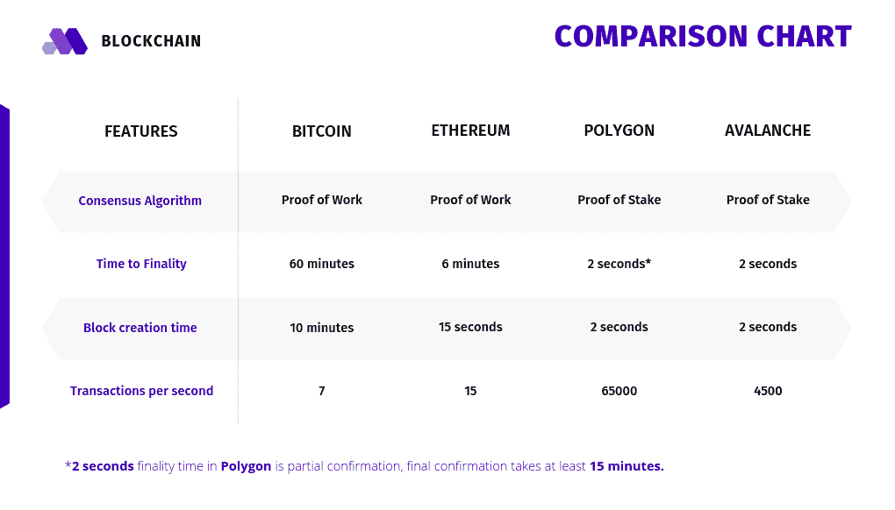
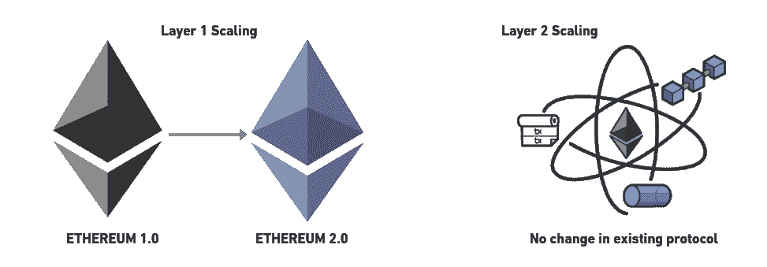
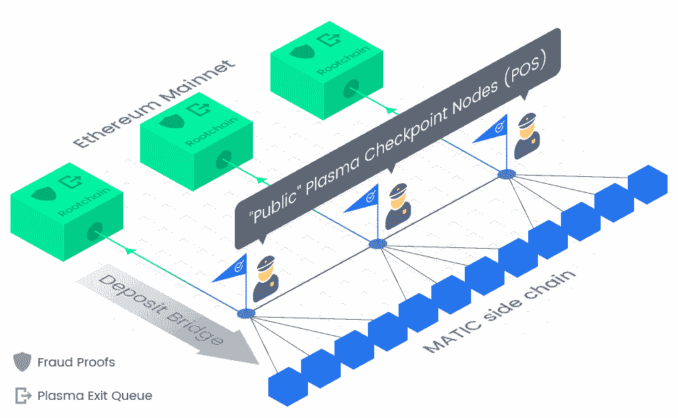
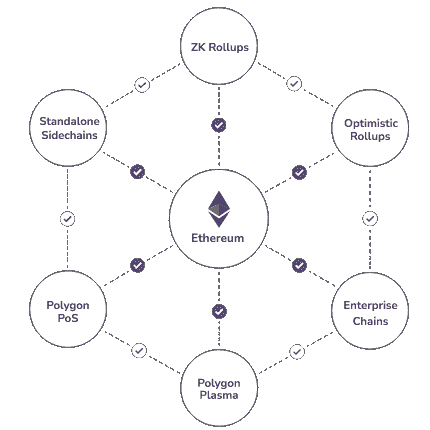

# 介绍

> 原文：<https://github.com/figment-networks/learn-tutorials/blob/master/polygon/explaining-polygon-and-blockchain.md>

在我们进入解释区块链和多边形的讨论之前，让我们先吃个披萨吧。我敢打赌，在比萨饼送到你家门口之前，你会了解这个话题的全部内容。

为了理解 **Polygon (Matic)** 和它解决的问题，让我们首先通过订购我们最喜欢的比萨饼来快速了解区块链，并了解什么是**事务、验证器、阻塞、共识、工作证明、利益证明**等。

## 访问 bizza.com-国家和事务

让我们访问一家位于区块链的披萨网站( **bizza** )并挑选一些我们喜欢的披萨。有许多比萨饼可供选择。目前，您的购物车中有 0 个披萨。这是你的**初始状态**。

这种在线状态由社区的计算机(称为节点)在区块链上维护，他们将为维护状态收取额外的**费用**。

一旦您在购物车中选择了披萨，您需要提交一个**交易**来确认您的**最终状态**(披萨的类型和数量)。除了比萨饼的费用，这笔交易还附有您的签名，以证明这笔交易是由您发起的，以及处理您订单的小额服务费。

通过提交交易，您试图改变状态。

## 处理您的订单验证器或节点

你不是唯一一个订披萨的人。你周围的人可能会点自己的披萨，所以会有很多交易。

但是谁来确保这些交易是有效的，即顾客已经订购了有效的比萨饼，他们的地址是真实的，并且他们有足够的钱来购买比萨饼？这些任务由**验证器**或**节点**完成。他们这样做是为了收取额外的服务费，这笔费用已经包含在你的交易中了。这些通常被称为**奖励**。

## 接受订单-共识和权力与职位

每个人都想成为赢家并获得回报。因此验证器相互竞争来验证交易并改变区块链的状态。

在这么多的验证者中，怎么能所有人都断定某个特定的验证者完成了任务，应该得到奖励呢？这是个好问题！它是通过共识实现的，在这个过程中，验证者都同意谁是对的。有各种各样的共识模型，许多研究仍在进行中，以提高区块链使用的共识机制的效率。

争取每一笔交易都要花很多时间。因此，他们转而竞争一笔交易。赢得比赛的人将获得该区块的交易费和奖励，他们的区块将被添加到之前验证的区块链中。

有许多共识机制来决定获胜者。其中最著名的两个是**工作证明**和**股权证明**。

来自不同验证器的竞争块可能有重叠的事务。如果一个验证器提升了一个事务，但是不成功，他们将不得不从他们自己的块中移除已经包含的事务。

每个块还包含前一个块的内容标识符，称为哈希。因此，事务不能改变先前块的内容，因为这将改变它们的散列，这也需要改变每个先前块中的散列——但是这不会发生，因为验证器保持原始散列是真实的，在网络上共享。这一概念使得区块链不可改变，因为一旦交易得到确认，它就成为区块链永久历史的一部分。

# 工作证明与利益证明

在**工作证明**机制中，节点在寻求提升事务块时解决密码难题。谁先解决了这个难题，谁就能把自己的有效积木加入到链条中，并获得当前积木奖励。

在**利益证明**机制中，验证者需要将一些资产(区块链上的加密货币代币)作为赌注。赌注的数量和赌注的持续时间增加了验证者被选择加入他们的区块的概率。一些 PoS 协议为验证者提供了一个强有力的理由来诚信行事，不包括不良或欺诈性交易，因为这样做会导致他们丧失他们的股份——这就是通常所说的“被削减”。除了他们的股份的数量和持续时间之外，可能有其他因素支配验证者的选择，这取决于如何为给定的协议建立共识模型。

> PoS 比 **PoW** 快得多，每秒可以处理更多的交易。 **PoW** 使用蛮力来解决一个密码难题，其复杂性随着添加到链中的块数而增加。

## 为什么我的披萨延迟了——可伸缩性问题？

是因为路上的交通还是披萨烤箱坏了？不，不，一切正常。您的订单延迟了，主要有两个原因:

*   高**完成交易的时间**-在以太坊网络上，大约需要 1 - 6 分钟才能完成交易。这是一个组合，包括每个块需要多长时间来确认，以及提供多个块确认，以增加交易不会因任何原因被恢复的信心。在**多边形**网络上，我们得到了一个快得惊人的大约 2 秒的终结。

*   较低的每秒潜在事务数(tps)。我们的比萨站点使用以太坊网络，该网络目前使用工作共识机制的证明。事实上，以太坊不能扩展到超过 15-20 tps。因此，如果成千上万的人使用以太坊网络，他们必须等待更长时间，直到他们的交易被一个节点接收。而**多边形**可以达到 65000 tps 左右。

这些被称为**以太坊**网络的**可扩展性问题**。

## 谁能快速处理我点的披萨？

**以太坊**是最流行、最安全的区块链网络之一，能够运行多用途任意交易，由**智能合约**(业务逻辑)定义。**但是以太坊是不可扩展的。**

一般来说，区块链有两种缩放方式:**第一层缩放**和**第二层缩放**。在第 1 层扩展中，通过升级主区块链协议来进行更改或改进。对于第 2 层扩展，我们试图在不改变主协议的情况下绕过可扩展性障碍。Polygon 是第 2 层扩展解决方案的一个例子，因为它结合了几种不同的技术来实现每秒更高的事务数量，所有这些都是与主要的以太坊或 Matic 网络分开实现的。

把区块链主干道想象成一条拥挤的道路，一次只能有 20 辆车行驶。显然，这将导致长时间的交通堵塞，每当更多的车辆接近，并试图在同一时间使用道路。

有两个明显的解决方案来克服这个问题。我们可以拓宽道路，使更多的车辆可以同时通过(第 1 层解决方案)，或者我们可以建造另一条绕过道路的宽阔高速公路，这样可以将一些交通分流到高速公路上(第 2 层解决方案)。

**Polygon Matic** 关注第二层缩放。一些第 2 层扩展机制-

*   [状态通道](https://education.district0x.io/general-topics/understanding-ethereum/basics-state-channels/)
*   [等离子链](https://education.district0x.io/general-topics/understanding-ethereum/understanding-plasma/)
*   [ZK(零知识)汇总](https://finematics.com/rollups-explained/)
*   [乐观汇总](https://finematics.com/rollups-explained/)

# 什么是 MATIC？

2017 年， **Matic** 被创建为以太坊网络的第二层扩展解决方案。Matic 不是为了更快的交易和更低的费用从零开始建立一个新的区块链，而是为了扩展以太坊网络本身。新项目可以轻松连接到 Matic 网络，并且仍然可以享受以太坊的安全性和去中心化。

Matic 最初的重点是**等离子链**框架。这些是主链的小分支链，有助于避免主网络上的拥塞。

在等离子体链中，共识是通过**利害关系证明**实现的。**验证者**在单个血浆链上标记他们的 MATIC 令牌，并在链外验证交易。这增加了交易吞吐量并降低了费用。它定期用 Matic 网络上发生的交易的定期快照更新以太坊网络，以享受以太坊的安全性和去中心化。

## 潜入 MATIC

等离子链可用于支付和资产交换等特定应用。Polygon 混合使用 Plasma 和 PoS，以可扩展的方式在区块链上运行任意应用程序。

它有一个三层架构

*   以太坊上的桩和智能合同层(基链)
*   PoS 验证器层(包含智能合同层上的节点)
*   块生产者层(包含 PoS 层选择的几个节点)

在 Polygon 中，块生产者层是 EVM(以太坊虚拟机)兼容的，这意味着它能够运行用 Solidity 编程语言编写的智能合约。

**块生产者层**通用应用或智能合约部署在这一层。所有事务都发生在这一层，并被放入新创建的块中。多边形的块创建时间为 1 秒。块由 PoS 层选择的几个节点创建。

**PoS 验证器层**该层负责在主链上提交常规交易报告。这对于利用以太坊链提供的安全性和去中心化是必要的。这一层以规则的间隔将块聚集成一个 Merkle 根。这个 Merkle 根包含该时间间隔内所有块的事务报告。该 Merkle 根然后由该层中的所有节点验证。一旦被验证，在该层中选择的节点将 Merkle 根发布到主链上的智能契约层。这被称为**检查点**。有了这个检查点机制，多边形链上的所有事务都受益于以太坊的安全性。

**Staking 和智能合约层**主链上的智能合约负责维护 PoS 层发布的检查点。它还涉及到各个节点作为 PoS 层验证者的参与。用户可以将他们的 ETH 绑定到智能合约，并可以参与 PoS 层验证。

## 将 Matic 更名为多边形

2021 年 2 月，Matic 改版为**多边形**，代表多个第 2 层缩放解决方案的集成。除了只有等离子体链作为解决方案，它现在将提供-

*   [状态通道](https://education.district0x.io/general-topics/understanding-ethereum/basics-state-channels/)
*   [等离子链](https://education.district0x.io/general-topics/understanding-ethereum/understanding-plasma/)
*   [ZK(零知识)汇总](https://finematics.com/rollups-explained/)
*   [乐观汇总](https://finematics.com/rollups-explained/)

多边形通常被称为**以太坊的区块链互联网**。这是因为 Polygon 旨在连接和扩展所有以太坊兼容的区块链网络，就像互联网连接人一样。它致力于建立一个兼容以太坊和可扩展区块链的生态系统，这样每个网络都可以同时享受可扩展性、安全性和去中心化。

> 如果一个区块链可以运行为以太坊编写的智能合约，它就被认为是以太坊兼容的，这就是通常所说的 EVM 兼容性。

## 多边形平面图

其中一个计划显然是将每个以太坊兼容的区块链连接到一个可扩展的生态系统。其他计划是集成其他可伸缩性解决方案，如平台上的 ZK 汇总、乐观汇总。

Polygon 正在通过**汇总**集成最有趣的缩放解决方案之一。

以我们的披萨店为例。我们的订单延迟可能是因为交易处理缓慢。我们可以将他们的算法升级到更高效的算法，但商店经理不愿意这么做。我们现在只能选择第 2 层解决方案。

为了提高披萨订单的速度，我们可以创建另一个只处理订单或交易的商店。新商店将使用有效的算法来处理交易。我们定期对这些交易进行批处理，并将它们作为单一订单发布到主披萨店。这构成了**汇总**的基础。

整个流程本质上是执行事务、获取数据、压缩数据，并以单个批处理的形式将其汇总到主链，因此得名——汇总。~精细

因为这些汇总的事务不是在主链上执行的，所以应该有一些欺诈证据来防止任何类型的无效提交。可能有多种算法来证明这一点。其中最著名的两个是- **乐观**和**零知识(ZK)累积**。

在**乐观**汇总中，事务被认为是有效的(这就是为什么这种算法被称为乐观)，但是每一批都有一个挑战期。在此期间，任何网络参与者都可以针对任何欺诈交易提交欺诈证据。这些可疑交易在主链上再次执行。批量提交交易的双方以及引发争议的双方都需要在主链上锁定一个债券(加密货币令牌)。如果进行了欺诈交易或提供了不正确的欺诈证据，他们的部分甚至全部债券都可能被削减。

在**Zero knowledge(ZK)**roll ups 中，每个事务都有一个充分的证据来证明其有效性。这些被称为零知识证明，因为我们没有任何关于交易有效性的知识，但可以很容易地通过这些证明进行验证。主链上的智能契约使用这种零知识证明来识别有效和无效的一批交易。

乐观的方法更容易实现，但在争议解决期间资金被长期锁定。ZK 汇总速度很快，但对于通用智能合同来说，实施与 EVM 兼容的 ZK 汇总非常复杂。

有很多关于汇总的内容，您可以随时了解更多。我会建议你浏览一下 [Finematics](https://finematics.com/rollups-explained/) 关于上卷的解释。

# 结论

本文介绍了 Polygon 的一些技术以及工作证明和利害关系证明之间的区别。由于 Polygon 试图解决当代区块链面临的问题，所以首先理解这些问题是很重要的。这对于那些想投资区块链技术，但不了解高度技术性白皮书的投资者也很有用，因为这些白皮书通常需要大量的研究。

有一些好消息:)我们位于区块链的比萨店在 Polygon 上看到了这个令人惊叹的解释，并决定扩展他们的系统。他们的送货员一定拿着你最喜欢的披萨在外面等着。

# 关于作者

本教程由 [Raj Ranjan](https://www.linkedin.com/in/iamrajranjan) 创作，你可以在 [GitHub](https://github.com/rajranjan0608) 上与作者取得联系

# 参考

[以太坊第 2 层缩放由 Finematics](https://finematics.com/ethereum-layer-2-scaling-explained/) [解释](https://docs.polygon.technology/docs/develop/ethereum-matic/getting-started)Polygon 的 POS 和 Polygon [总结的等离子体](https://finematics.com/rollups-explained/)最终以太坊缩放解决方案由 Finematics [按地区 0x](https://education.district0x.io/general-topics/understanding-ethereum/basics-state-channels/) [了解状态通道](https://education.district0x.io/general-topics/understanding-ethereum/understanding-plasma/)按地区 0x