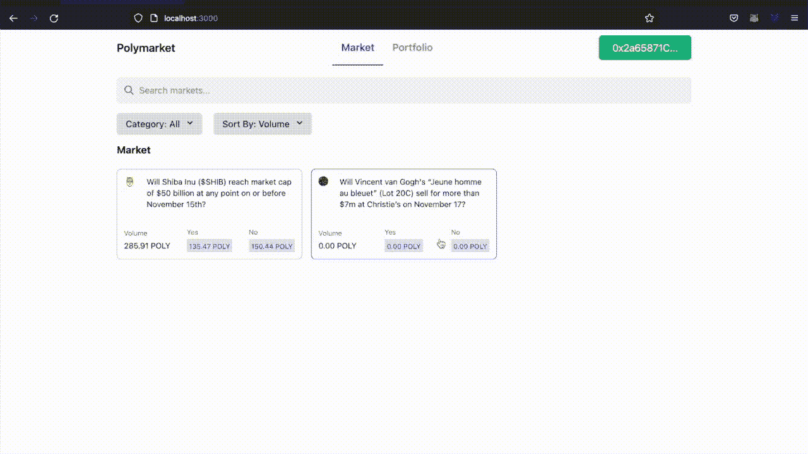
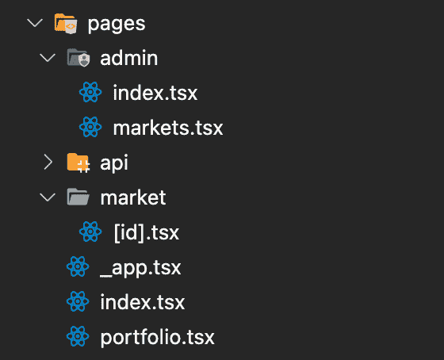
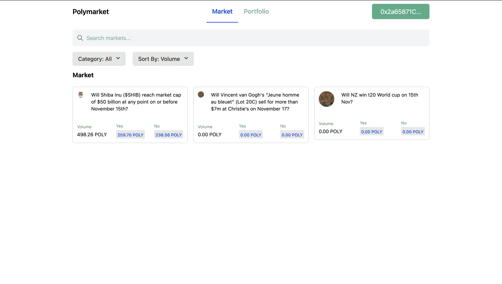
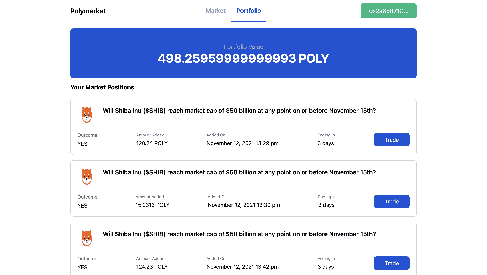
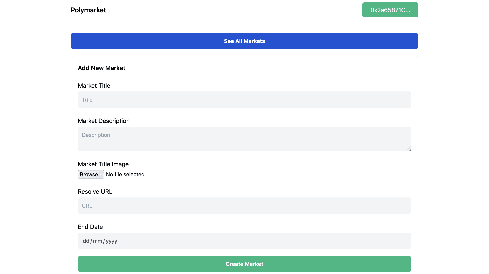
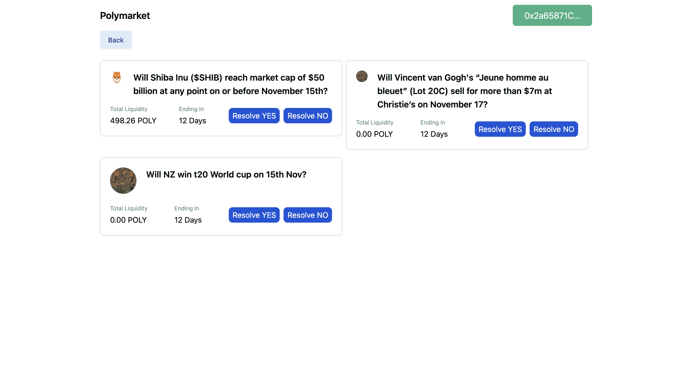
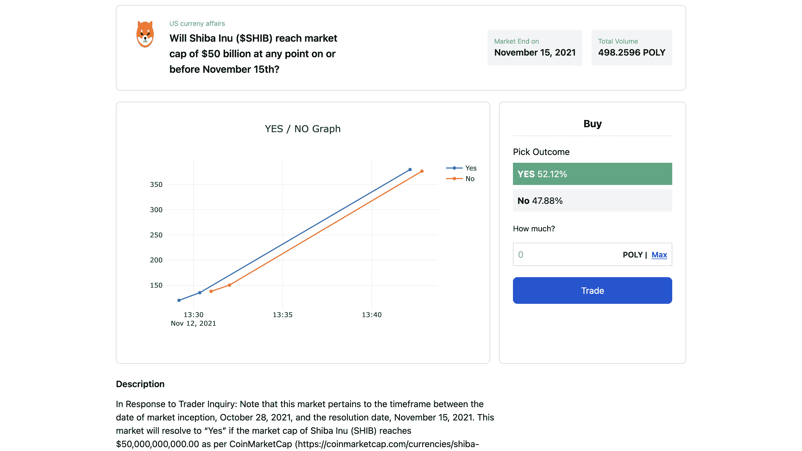
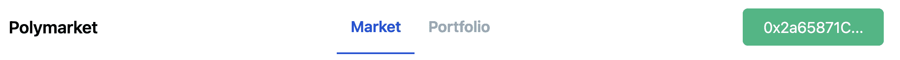
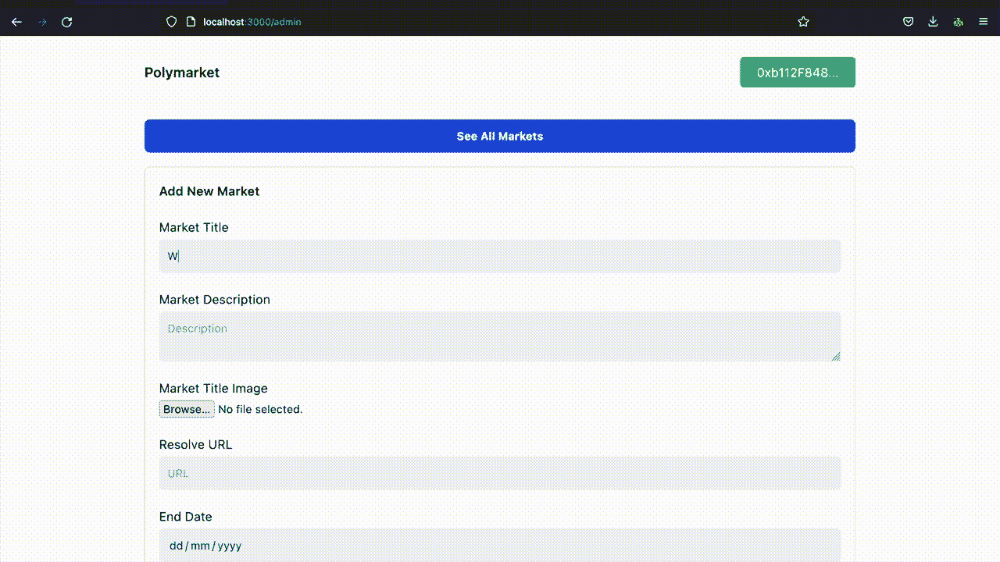
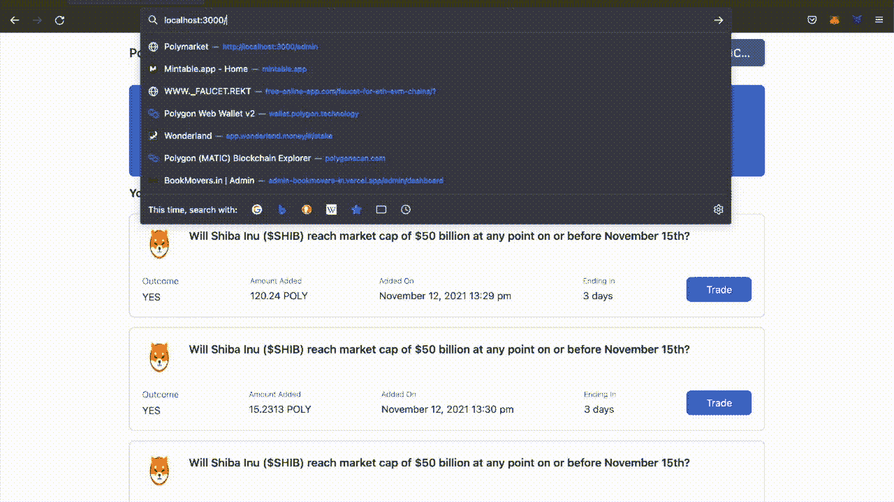

# 介绍

> 原文：<https://github.com/figment-networks/learn-tutorials/blob/master/polygon/how-to-create-polymarket-clone.md>

在本教程中，我们将学习如何创建一个 [Polymarket](https://polymarket.com/) 克隆。Polymarket 是一个去中心化的信息市场，利用自由市场的力量去揭开最重要的现实世界事件的神秘面纱。

我们将创建一个全栈式 dApp，其中有一个创建事件/市场的管理面板，以及一个用户可以在网站上预测结果的 UI。在本教程中，我们将创建两个智能合约，一个用于我们网站上使用的 ERC20 令牌，以将金额委托给特定事件，另一个用于 Polymarket 本身。

这是我们将创建的 dApp 的外观:

[](https://github.com/figment-networks/learn-tutorials/raw/master/assets/polymarket-app-demo.gif)

# 先决条件

要成功地学习本教程，您需要很好地理解智能合约、Solidity 编程语言、Truffle 和 Next.js 框架以及 TailwindCSS。我们将使用 web3.js Javascript 库连接到 Polygon 网络和 Next.js 框架，用于 dApp 的前端和后端逻辑。

# 要求

*   块菌为创建和测试区块链应用程序提供了一个本地开发环境。
*   [元掩码](https://metamask.io/) -你需要在浏览器中安装一个元掩码钱包。
*   [NodeJs](https://nodejs.org/en/)——你必须安装 Node.js。我们建议使用 v16.13.0 LTS。
*   [IPFS](https://ipfs.io/) -我们将为 IPFS 的一个市场存储缩略图。

# 项目设置

在终端中运行以下命令来创建项目目录并安装所需的包。

```js
npm install -g truffle
npx create-next-app --typescript polymarket
cd polymarket
truffle init
yarn add @openzeppelin/contracts @truffle/hdwallet-provider web3 dotenv tailwindcss @heroicons/react plotly.js plotly.js-dist-min @types/plotly.js-dist-min ipfs-http-client moment 
```

`npm install -g truffle`命令将在系统中安装松露框架。`npx create-next-app --typescript polymarket`将创建一个支持 typescript 的 Next.js 项目，`truffle init`将搭建一个 Truffle 项目。

# 配置 truffle-config.js

我们必须配置`truffle-config.js`来将我们的智能合约部署到 Matic testnet。打开`truffle-config.js`并用以下代码替换内容:

```js
const HDWalletProvider = require("@truffle/hdwallet-provider");
const fs = require("fs");
const mnemonic = fs.readFileSync(".secret").toString().trim();

module.exports = {
  networks: {
    development: {
      host: "localhost",
      port: 8545,
      network_id: "*",
    },
    matic: {
      provider: () =>
        new HDWalletProvider(
          mnemonic,
          `https://matic-mumbai.chainstacklabs.com`
        ),
      network_id: 80001,
      confirmations: 2,
      timeoutBlocks: 200,
      skipDryRun: true,
      chainId: 80001,
    },
  },
  contracts_directory: "./contracts",
  contracts_build_directory: "./abis",
  compilers: {
    solc: {
      version: "^0.8.6",
      optimizer: {
        enabled: true,
        runs: 200,
      },
    },
  },

  db: {
    enabled: false,
  },
};
```

我们必须获得元掩码帐户的秘密恢复短语(助记符)来部署智能合约。[按照这个教程](https://metamask.zendesk.com/hc/en-us/articles/360015290032-How-to-reveal-your-Secret-Recovery-Phrase)获得助记符。一旦你有了助记符，在我们项目的根目录下创建一个名为`.secret`的文件并粘贴助记符。确保您将`.secret`添加到您的`.gitignore`文件中，这样您的助记符就不会添加到您的 git 历史中。

如果你在 Polygon Mumbai testnet 上没有任何 MATIC token，那么使用 [Polygon 水龙头](https://faucet.polygon.technology/)获得 1 个 MATIC token 来支付汽油费。

# 创建多托肯智能合同

在`contracts`目录中创建一个名为`PolyToken.sol`的新文件，并添加以下代码:

```js
// SPDX-License-Identifier: GPL-3.0
pragma solidity ^0.8.6;
import "@openzeppelin/contracts/token/ERC20/ERC20.sol";

contract PolyToken is ERC20 {
    address public owner;

    constructor() ERC20("Poly Token", "POLY") {
        owner = msg.sender;
        _mint(msg.sender, 100000 * 10**18);
    }

    function mint(address to, uint256 amount) external {
        require(msg.sender == owner, "Only owner can mint");
        _mint(to, amount);
    }
}

```

我们使用 OpenZeppelin ERC20 契约创建一个名为 PolyToken 的新 ERC20 令牌。这是我们将在 Polymarket 克隆中使用的令牌。我们可以使用任何稳定的拍摄像 USDT 或 USDC，但为了简化本教程，我们将只创建我们的测试令牌。在我们的令牌契约的构造器中，我们铸造并发送 100，000 个 POLY 令牌给契约的所有者(部署契约的帐户)。

# 创建多市场智能合同

在`contracts`目录中创建一个名为`Polymarket.sol`的新文件，并添加以下代码:

```js
// SPDX-License-Identifier: MIT
pragma solidity ^0.8.6;
import "@openzeppelin/contracts/token/ERC20/ERC20.sol";

contract Polymarket {
    address public owner;
    address public polyToken;

    uint256 public totalMarkets = 0;
    constructor(address _polyToken) {
        owner = msg.sender;
        polyToken = _polyToken;
    }
}
```

在 Polymarket 契约中，我们有所有者的地址和在构造函数中设置的 polyToken ERC20 令牌的地址。

在构造函数下方的`Polymarket`契约中添加以下代码:

```js
    mapping(uint256 => Markets) public markets;

    struct Markets {
        uint256 id;
        string  market;
        uint256 timestamp;
        uint256 endTimestamp;
        address createdBy;
        string creatorImageHash;
        AmountAdded[] yesCount;
        AmountAdded[] noCount;
        uint256 totalAmount;
        uint256 totalYesAmount;
        uint256 totalNoAmount;
        bool eventCompleted;
        string description;
        string resolverUrl;
    }

    struct AmountAdded {
        address user;
        uint256 amount;
        uint256 timestamp;
    }

    mapping(address => uint256) public winningAmount;
    address[] public winningAddresses;

    event MarketCreated(
        uint256 id,
        string market,
        uint256 timestamp,
        address createdBy,
        string creatorImageHash,
        uint256 totalAmount,
        uint256 totalYesAmount,
        uint256 totalNoAmount
    );
```

这里，我们为市场创建了一个结构和一个映射来存储所有的市场。在`Markets`结构中，我们有`yesCount`和`noCount`，它们将分别存储所有的**是**预测和**否**预测。

```js
    function createMarket(
        string memory _market,
        string memory _creatorImageHash,
        string memory _description,
        string memory _resolverUrl,
        uint256 _endTimestamp
    ) public {
        require(msg.sender == owner, "Unauthorized");
        uint256 timestamp = block.timestamp;

        Markets storage market = markets[totalMarkets];
        market.id = totalMarkets++;
        market.market = _market;
        market.timestamp = timestamp;
        market.createdBy = msg.sender;
        market.creatorImageHash = _creatorImageHash;
        market.totalAmount = 0;
        market.totalYesAmount = 0;
        market.totalNoAmount = 0;
        market.description = _description;
        market.resolverUrl = _resolverUrl;
        market.endTimestamp = _endTimestamp;

        emit MarketCreated(
            totalMarkets,
            _market,
            timestamp,
            msg.sender,
            _creatorImageHash,
            0,
            0,
            0
        );
    }
```

我们有`createMarket`方法，它接受与市场相关的数据，创建一个市场结构，将其存储在映射中，并发出`MarketCreated`事件。此方法只能由合同的所有者调用。

```js
    function addYesBet(uint256 _marketId, uint256 _value) public payable {
        require(_value <= ERC20(polyToken).allowance(msg.sender, address(this)), "Not allowed to spend this amount.");
        Markets storage market = markets[_marketId];
        ERC20(polyToken).transferFrom(msg.sender, address(this), _value);
        AmountAdded memory amountAdded = AmountAdded(
            msg.sender,
            _value,
            block.timestamp
        );

        market.totalYesAmount += _value;
        market.totalAmount += _value;
        market.yesCount.push(amountAdded);
    }

    function addNoBet(uint256 _marketId, uint256 _value) public payable {
        require(_value <= ERC20(polyToken).allowance(msg.sender, address(this)), "Not allowed to spend this amount.");
        Markets storage market = markets[_marketId];
        ERC20(polyToken).transferFrom(msg.sender, address(this), _value);
        AmountAdded memory amountAdded = AmountAdded(
            msg.sender,
            _value,
            block.timestamp
        );

        market.totalNoAmount += _value;
        market.totalAmount += _value;
        market.noCount.push(amountAdded);
    }
```

*   `addYesBet`接受市场 ID 和要添加到该市场的代币数量。
*   我们在`polyToken`上调用 ERC20 的`allowance`方法来检查我们的契约是否被允许代表用户转移令牌的`_value`。为了传递令牌，我们必须从我们的前端调用`polyToken`上的`approve`方法。
*   在 approve 方法中，用户实际上允许我们的`Polymarket`合同花费固定数量的`POLY`令牌。
*   我们在`polyToken`上调用 ERC20 的`transferFrom`方法，将一定数量的令牌从`msg.sender`的账户转移到契约的地址。
*   在这些步骤之后，我们可以用`msg.sender`、`_value`和块的当前时间戳创建一个`AmountAdded`对象。
*   更新市场的`totalAmount`。
*   在`addYesBet`中，我们通过添加`_value`来更新`totalYesAmount`，在`addNoBet`中，我们更新`totalNoAmount`。
*   然后我们可以相对于`addNoBet`的`addYesBet`在`yesCount`或`noCount`中添加`amountAdded`对象。

```js
    function getGraphData(uint256 _marketId)
        public
        view
        returns (AmountAdded[] memory, AmountAdded[] memory)
    {
        Markets storage market = markets[_marketId];
        return (market.yesCount, market.noCount);
    }
```

`getGraphData`方法接受`marketId`并返回该市场的`yesCount`和`noCount`以在前端生成图形。

```js
function distributeWinningAmount(uint256 _marketId, bool eventOutcome)
        public
        payable
    {
        require(msg.sender == owner, "Unauthorized");

        Markets storage market = markets[_marketId];
        if (eventOutcome) {
            for (uint256 i = 0; i < market.yesCount.length; i++) {
                uint256 amount = (market.totalNoAmount *
                    market.yesCount[i].amount) / market.totalYesAmount;
                winningAmount[market.yesCount[i].user] += (amount +
                    market.yesCount[i].amount);
                winningAddresses.push(market.yesCount[i].user);
            }

            for (uint256 i = 0; i < winningAddresses.length; i++) {
                address payable _address = payable(winningAddresses[i]);
                ERC20(polyToken).transfer(_address, winningAmount[_address]);
                delete winningAmount[_address];
            }
            delete winningAddresses;
        } else {
            for (uint256 i = 0; i < market.noCount.length; i++) {
                uint256 amount = (market.totalYesAmount *
                    market.noCount[i].amount) / market.totalNoAmount;
                winningAmount[market.noCount[i].user] += (amount +
                    market.noCount[i].amount);
                winningAddresses.push(market.noCount[i].user);
            }

            for (uint256 i = 0; i < winningAddresses.length; i++) {
                address payable _address = payable(winningAddresses[i]);
                ERC20(polyToken).transfer(_address, winningAmount[_address]);
                delete winningAmount[_address];
            }
            delete winningAddresses;
        }
        market.eventCompleted = true;
    }
```

*   当事件完成时，`owner`调用`distributeWinningAmount`。`distributeWinningAmount`接受`marketId`和`eventOutcome`分配中奖金额。
*   循环所有市场上的`yesCount` / `noCount`，使用以下公式计算中奖金额。

对于是事件- `amount = (totalNoAmount * amount) / totalYesAmount;`对于非事件- `amount = (totalYesAmount * amount) / totalNoAmount;`

*   可能会出现这样的情况，用户为相同的结果多次添加代币，为了处理这种情况，我们将为每个用户的地址创建一个地图，并增加该用户的中奖金额。
*   然后，我们使用`winningAddresses`数组来推送用户的地址，稍后我们将使用它来循环并支付中奖金额。
*   一旦我们有了`winningAddresses`数组和`winningAmount`地图，循环遍历`winningAddresses`并用用户的地址和该用户的中奖金额调用 ERC20 令牌的`transfer`方法。
*   最后，我们删除了`winningAddresses`和`winningAmount`以清除合同中的空白，这将减少天然气费用，并将该特定市场的`eventCompleted`设置为`true`。

我们已经完成了`PolyToken.sol`和`Polymarket.sol`，让我们在 Polygon Testnet 上部署这些智能合约。

# 用 Truffle 编译和部署

转到`migrations`目录，创建一个新文件`2_polytoken_polymarket.js`并添加以下代码:

```js
const PolyToken = artifacts.require("PolyToken");
const Polymarket = artifacts.require("Polymarket");

module.exports = async function (deployer) {
  await deployer.deploy(PolyToken);
  const polyToken = await PolyToken.deployed();

  await deployer.deploy(Polymarket, polyToken.address);
};
```

我们首先部署`PolyToken`，一旦它被部署，我们就可以获得 PolyToken 的已部署的`address`并发送这个`address`作为参数来部署`Polymarket`契约，因为`Polymarket`的构造器需要`PolyToken`的契约地址。

运行以下命令在 Polygon testnet 上编译和部署协定。

```js
truffle compile
truffle deploy --network matic 
```

# 创建前端

在我们的 dApp 中，我们将创建五个页面:

[](https://github.com/figment-networks/learn-tutorials/raw/master/assets/pages-folder-structure.png)

`index.tsx`包含用户主页，其中列出了所有市场。

[](https://github.com/figment-networks/learn-tutorials/raw/master/assets/index-page.png)

`portfolio.tsx`包含登录用户下的所有市场赌注。

[](https://github.com/figment-networks/learn-tutorials/raw/master/assets/portfolio-view.png)

被管理者用来创造新的市场。

[](https://github.com/figment-networks/learn-tutorials/raw/master/assets/admin-form-view.png)

管理员可以使用`admin/markets.tsx`来解析市场并决定退出，这将调用多市场契约的`distributeWinningAmount`方法。

[](https://github.com/figment-networks/learn-tutorials/raw/master/assets/admin-markets-list.png)

`markets/[id].tsx`包含特定市场的详细信息，包括描述、是/否图表以及用户可以对该市场结果进行预测的部分。

[](https://github.com/figment-networks/learn-tutorials/raw/master/assets/market-details.png)

我们将从创建处理智能合同实例的`context.tsx`开始。在`context`目录下创建一个文件`DataContext.tsx`，并粘贴以下代码:

```js
// contexts/DataContext.tsx
declare let window: any;
import { createContext, useContext, useState } from "react";
import Web3 from "web3";
import Polymarket from "../abis/Polymarket.json";
import PolyToken from "../abis/PolyToken.json";

interface DataContextProps {
  account: string;
  loading: boolean;
  loadWeb3: () => Promise<void>;
  polymarket: any;
  polyToken: any;
}

const DataContext = createContext<DataContextProps>({
  account: "",
  loading: true,
  loadWeb3: async () => {},
  polymarket: null,
  polyToken: null,
});

export const DataProvider: React.FC = ({ children }) => {
  const data = useProviderData();

  return <DataContext.Provider value={data}>{children}</DataContext.Provider>;
};

export const useData = () => useContext<DataContextProps>(DataContext);

export const useProviderData = () => {
  const [loading, setLoading] = useState(true);
  const [account, setAccount] = useState("");
  const [polymarket, setPolymarket] = useState<any>();
  const [polyToken, setPolyToken] = useState<any>();

  const loadWeb3 = async () => {
    if (window.ethereum) {
      window.web3 = new Web3(window.ethereum);
      ethereum.request({ method: 'eth_requestAccounts' })
    } else if (window.web3) {
      window.web3 = new Web3(window.web3.currentProvider);
    } else {
      window.alert("Non-Eth browser detected. Please consider using MetaMask.");
      return;
    }
    var allAccounts = await window.web3.eth.getAccounts();
    setAccount(allAccounts[0]);
    await loadBlockchainData();
  };

  const loadBlockchainData = async () => {
    const web3 = window.web3;

    const polymarketData = Polymarket.networks["80001"];
    const polyTokenData = PolyToken.networks["80001"];

    if (polymarketData && polyTokenData) {
      var tempContract = await new web3.eth.Contract(
        Polymarket.abi,
        polymarketData.address
      );
      setPolymarket(tempContract);
      var tempTokenContract = await new web3.eth.Contract(
        PolyToken.abi,
        polyTokenData.address
      );

      setPolyToken(tempTokenContract);
    } else {
      window.alert("TestNet not found");
    }
    setTimeout(() => {
      setLoading(false);
    }, 500);
  };

  return {
    account,
    polymarket,
    polyToken,
    loading,
    loadWeb3,
  };
};
```

在`useProviderData`函数中，我们有`loadWeb3`和`loadBlockchainData`。`loadWeb3`将我们的应用程序与 Metamask 连接，并设置帐户地址。在`loadBlockchainData`中，我们创建了`PolyToken`和`Polymarket`契约的实例，并设置了有状态实例。

我们从`index.tsx`开始。打开`pages/index.tsx`并粘贴以下代码:

```js
// pages/index.tsx
import Head from "next/head";
import { useCallback, useEffect, useState } from "react";
import { MarketCard } from "../components/MarketCard";
import Navbar from "../components/Navbar";
import { useData } from "../contexts/DataContext";
import styles from "../styles/Home.module.css";

export interface MarketProps {
  id: string;
  title: string;
  imageHash: string;
  totalAmount: string;
  totalYes: string;
  totalNo: string;
}

export default function Home() {
  const { polymarket, account, loadWeb3, loading } = useData();
  const [markets, setMarkets] = useState<MarketProps[]>([]);

  const getMarkets = useCallback(async () => {
    var totalMarkets = await polymarket.methods
      .totalMarkets()
      .call({ from: account });

    var dataArray: MarketProps[] = [];
    for (var i = 0; i < totalMarkets; i++) {
      var data = await polymarket.methods.markets(i).call({ from: account });
      dataArray.push({
        id: data.id,
        title: data.market,
        imageHash: data.creatorImageHash,
        totalAmount: data.totalAmount,
        totalYes: data.totalYesAmount,
        totalNo: data.totalNoAmount,
      });
    }
    setMarkets(dataArray);
  }, [account, polymarket]);

  useEffect(() => {
    loadWeb3().then(() => {
      if (!loading) getMarkets();
    });
  }, [loading]);

  return (
    <div className={styles.container}>
      <Head>
        <title>Polymarket</title>
        <meta name="description" content="Generated by create next app" />
        <link rel="icon" href="/favicon.ico" />
      </Head>
      <Navbar />
      <main className="w-full flex flex-col sm:flex-row flex-wrap sm:flex-nowrap py-4 flex-grow max-w-5xl">
        <div className="w-full flex flex-col flex-grow pt-1">
          <div className="relative text-gray-500 focus-within:text-gray-400 w-full">
            <span className="absolute inset-y-0 left-0 flex items-center px-3">
              <svg
                fill="none"
                stroke="currentColor"
                strokeLinecap="round"
                strokeLinejoin="round"
                strokeWidth="2"
                viewBox="0 0 24 24"
                className="w-5 h-5"
              >
                <path d="M21 21l-6-6m2-5a7 7 0 11-14 0 7 7 0 0114 0z"></path>
              </svg>
            </span>
            <input
              type="search"
              name="q"
              className="w-full py-3 px-3 text-base text-gray-700 bg-gray-100 rounded-md pl-10 focus:outline-none"
              placeholder="Search markets..."
              autoComplete="off"
            />
          </div>
          <span className="font-bold my-3 text-lg">Market</span>
          <div className="flex flex-wrap overflow-hidden sm:-mx-1 md:-mx-2">
            {markets.map((market) => {
              return (
                <MarketCard
                  id={market.id}
                  key={market.id}
                  title={market.title}
                  totalAmount={market.totalAmount}
                  totalYes={market.totalYes}
                  totalNo={market.totalNo}
                  imageHash={market.imageHash}
                />
              );
            })}
          </div>
        </div>
      </main>
    </div>
  );
}
```

我们已经创建了一个`MarketProps`接口，稍后我们将使用它作为存储市场对象的类型。接下来，我们将创建一个函数`getMarkets`，它将从`polymarket`合约中获取`totalMarkets`，循环遍历`totalMarkets`计数，并从智能合约中获取每个市场。一旦我们有了所有的市场，我们将设置`markets`状态变量。

在这个页面上，我们有两个主要组件，`Navbar`和`MarketCard`。

```js
// components/Navbar.tsx
import Link from "next/link";
import { useRouter } from "next/router";
import React from "react";
import { useData } from "../contexts/DataContext";

function Navbar() {
  const router = useRouter();
  const { account, loadWeb3 } = useData();

  return (
    <>
      <nav className="w-full h-16 mt-auto max-w-5xl">
        <div className="flex flex-row justify-between items-center h-full">
          <Link href="/" passHref>
            <span className="font-semibold text-xl cursor-pointer">
              Polymarket
            </span>
          </Link>
          {!router.asPath.includes("/market") &&
            !router.asPath.includes("/admin") && (
              <div className="flex flex-row items-center justify-center h-full">
                <TabButton
                  title="Market"
                  isActive={router.asPath === "/"}
                  url={"/"}
                />
                <TabButton
                  title="Portfolio"
                  isActive={router.asPath === "/portfolio"}
                  url={"/portfolio"}
                />
              </div>
            )}
          {account ? (
            <div className="bg-green-500 px-6 py-2 rounded-md cursor-pointer">
              <span className="text-lg text-white">
                {account.substr(0, 10)}...
              </span>
            </div>
          ) : (
            <div
              className="bg-green-500 px-6 py-2 rounded-md cursor-pointer"
              onClick={() => {
                loadWeb3();
              }}
            >
              <span className="text-lg text-white">Connect</span>
            </div>
          )}
        </div>
      </nav>
    </>
  );
}

export default Navbar;

const TabButton = ({
  title,
  isActive,
  url,
}: {
  title: string;
  isActive: boolean;
  url: string;
}) => {
  return (
    <Link href={url} passHref>
      <div
        className={`h-full px-4 flex items-center border-b-2 font-semibold hover:border-blue-700 hover:text-blue-700 cursor-pointer ${
 isActive
 ? "border-blue-700 text-blue-700 text-lg font-semibold"
 : "border-white text-gray-400 text-lg"
 }`}
      >
        <span>{title}</span>
      </div>
    </Link>
  );
};
```

[](https://github.com/figment-networks/learn-tutorials/raw/master/assets/polymarket-navbar.png)

navbar 有两个基本功能，将我们的 dApp 与 Metamask 连接起来，并显示选项卡栏，供用户在市场和投资组合之间切换。如果用户不在管理页面上，我们只显示标签栏。

为了从我们的 dApp 连接到 Metamask，我们将使用 out `DataContact.tsx`中的`loadWeb3`函数，如上所示。

```js
// components/MarketCard.tsx
import Img from "next/image";
import Link from "next/link";
import React from "react";
import Web3 from "web3";
import { MarketProps } from "../pages";

export const MarketCard: React.FC<MarketProps> = ({
  id,
  title,
  totalAmount,
  totalYes,
  totalNo,
  imageHash,
}) => {
  return (
    <div className="w-full overflow-hidden sm:my-1 sm:px-1 sm:w-1/3 md:my-2 md:px-2 md:w-1/3 lg:w-1/3 xl:w-1/3 my-2">
      <Link href={`/market/${id}`} passHref>
        <div className="flex flex-col border border-gray-300 rounded-lg p-3 hover:border-blue-700 cursor-pointer">
          <div className="flex flex-row space-x-5 pb-8">
            <div className="w-12  h-w-12 ">
              
            </div>
            <span className="text-sm">{title}</span>
          </div>
          <div className="flex flex-row flex-nowrap justify-between items-center">
            <div className="flex flex-col space-y-1">
              <span className="text-xs text-gray-500 font-light">Volume</span>
              <span className="text-sm">
                {parseFloat(Web3.utils.fromWei(totalAmount, "ether")).toFixed(
                  2
                )}{" "}
                POLY
              </span>
            </div>
            <div className="flex flex-col space-y-1">
              <span className="text-xs text-gray-500 font-light">Yes</span>
              <div className="px-1 bg-gray-200 text-center rounded-sm">
                <span className="text-xs font-medium text-blue-700">
                  {parseFloat(Web3.utils.fromWei(totalYes, "ether")).toFixed(2)}{" "}
                  POLY
                </span>
              </div>
            </div>
            <div className="flex flex-col space-y-1">
              <span className="text-xs text-gray-500 font-light">No</span>
              <div className="px-1 bg-gray-200 text-center rounded-sm">
                <span className="text-xs font-medium text-blue-700">
                  {parseFloat(Web3.utils.fromWei(totalNo, "ether")).toFixed(2)}{" "}
                  POLY
                </span>
              </div>
            </div>
          </div>
        </div>
      </Link>
    </div>
  );
};
```

[](https://github.com/figment-networks/learn-tutorials/raw/master/assets/polymarket-card.png)

`MarketCard`接受`MarketProps`作为参数，并显示该市场的图像、标题、市场总值、是/否总值。单击每个市场会将用户重定向到市场详细信息页面。

接下来，我们将从`admin/index.tsx`页面开始，这将允许我们创建市场，这样当我们创建其他页面时，我们将有一些市场可以使用。

```js
// admin/index.tsx
import { create } from "ipfs-http-client";
import Head from "next/head";
import Link from "next/link";
import { useRouter } from "next/router";
import React, { useEffect } from "react";
import Navbar from "../../components/Navbar";
import { useData } from "../../contexts/DataContext";

const Admin = () => {
  const router = useRouter();
  const { polymarket, loadWeb3, account } = useData!();
  const [loading, setLoading] = React.useState(false);
  const client = create({ url: "https://ipfs.infura.io:5001/api/v0" });

  const [title, setTitle] = React.useState("");
  const [description, setDescription] = React.useState("");
  const [imageHash, setImageHash] = React.useState("");
  const [resolverUrl, setResolverUrl] = React.useState("");
  const [timestamp, setTimestamp] = React.useState<
    string | number | readonly string[] | undefined
  >(Date());

  const uploadImage = async (e: any) => {
    const file = e.target.files[0];
    const added = await client.add(file);
    setImageHash(added.path);
  };

  useEffect(() => {
    loadWeb3();
  }, [loading]);

  const handleSubmit = async () => {
    setLoading(true);
    await polymarket.methods
      .createMarket(title, imageHash, description, resolverUrl, timestamp)
      .send({
        from: account,
      });
    setLoading(false);
    setTitle("");
    setDescription("");
    setImageHash("");
    setResolverUrl("");
    setTimestamp(undefined);
    router.push("/");
  };

  return (
    <>
      <div className="flex flex-col justify-center items-center h-full p-5">
        <Head>
          <title>Polymarket</title>
          <meta name="description" content="Generated by create next app" />
          <link rel="icon" href="/favicon.ico" />
        </Head>
        <Navbar />
        <main className="w-full flex flex-col py-4 max-w-5xl pb-6">
          <Link href="/admin/markets">
            <a className="mt-5 rounded-lg py-3 text-center w-full bg-blue-700 text-white font-bold mb-5">
              See All Markets
            </a>
          </Link>
          <div className="w-full flex flex-col pt-1 border border-gray-300 p-5 rounded-lg ">
            <span className="text-lg font-semibold mt-4">Add New Market</span>
            <span className="text-lg font mt-6 mb-1">Market Title</span>
            <input
              type="input"
              name="title"
              value={title}
              onChange={(e) => setTitle(e.target.value)}
              className="w-full py-3 px-3 text-base text-gray-700 bg-gray-100 rounded-md focus:outline-none"
              placeholder="Title"
              autoComplete="off"
            />
            <span className="text-lg font mt-6 mb-1">Market Description</span>
            <textarea
              name="description"
              value={description}
              onChange={(e) => setDescription(e.target.value)}
              className="w-full py-3 px-3 text-base text-gray-700 bg-gray-100 rounded-md focus:outline-none"
              placeholder="Description"
              autoComplete="off"
            ></textarea>
            <span className="text-lg font mt-6 mb-1">Market Title Image</span>
            <input type="file" onChange={uploadImage} />
            <span className="text-lg font mt-6 mb-1">Resolve URL</span>
            <input
              type="input"
              name="resolverUrl"
              value={resolverUrl}
              onChange={(e) => setResolverUrl(e.target.value)}
              className="w-full py-3 px-3 text-base text-gray-700 bg-gray-100 rounded-md focus:outline-none"
              placeholder="URL"
              autoComplete="off"
            />
            <span className="text-lg font mt-6 mb-1">End Date</span>
            <input
              type="date"
              name="timestamp"
              onChange={(e) => {
                setTimestamp(e.target.valueAsDate?.getTime());
              }}
              className="w-full py-3 px-3 text-base text-gray-700 bg-gray-100 rounded-md focus:outline-none"
              autoComplete="off"
            />
            {loading ? (
              <span className="text-center pt-5 pb-3 text-xl font-bold">
                Loading...
              </span>
            ) : (
              <button
                className="mt-5 rounded-lg py-3 text-center w-full bg-green-500 text-white font-bold"
                onClick={() => {
                  handleSubmit();
                }}
              >
                Create Market
              </button>
            )}
          </div>
        </main>
      </div>
    </>
  );
};

export default Admin;
```

[](https://github.com/figment-networks/learn-tutorials/raw/master/assets/admin-index.gif)

在这个页面上，我们正在创建一个表单，管理员可以通过它创建一个新的市场。创建新市场时，管理员必须为市场添加标题、描述、标题图像、解析 URL 和结束日期。在这里，解决网址是将被管理员引用的网址，以决定市场的结果。我们有两个函数，一个将图像上传到 IPFS，另一个调用`Polymarket`契约的`createMarket`方法。

完成此页面后，我们可以创建一个新的市场，并前往主页查看新列出的市场。

接下来，我们将创建市场详情页面。创建一个文件`pages/market/[id].tsx`并粘贴以下代码:

```js
// pages/market/[id].tsx
import moment from "moment";
import Head from "next/head";
import Img from "next/image";
import { useRouter } from "next/router";
import React, { useCallback, useEffect, useState } from "react";
import Web3 from "web3";
import ChartContainer from "../../components/Chart/ChartContainer";
import Navbar from "../../components/Navbar";
import { useData } from "../../contexts/DataContext";

export interface MarketProps {
  id: string;
  title: string;
  imageHash: string;
  totalAmount: number;
  totalYes: number;
  totalNo: number;
  description: string;
  endTimestamp: number;
  resolverUrl: string;
}

const Details = () => {
  const router = useRouter();
  const { id } = router.query;
  const { polymarket, account, loadWeb3, loading, polyToken } = useData();
  const [market, setMarket] = useState<MarketProps>();
  const [selected, setSelected] = useState<string>("YES");
  const [dataLoading, setDataLoading] = useState(true);
  const [button, setButton] = useState<string>("Trade");

  const [input, setInput] = useState("");

  const getMarketData = useCallback(async () => {
    var data = await polymarket.methods.markets(id).call({ from: account });
    setMarket({
      id: data.id,
      title: data.market,
      imageHash: data.creatorImageHash,
      totalAmount: parseInt(data.totalAmount),
      totalYes: parseInt(data.totalYesAmount),
      totalNo: parseInt(data.totalNoAmount),
      description: data.description,
      endTimestamp: parseInt(data.endTimestamp),
      resolverUrl: data.resolverUrl,
    });
    setDataLoading(false);
  }, [account, id, polymarket]);

  useEffect(() => {
    loadWeb3().then(() => {
      if (!loading) getMarketData();
    });
  }, [loading]);

  return (
    <div className="flex flex-col justify-center items-center h-full">
      <Head>
        <title>Polymarket</title>
        <meta name="description" content="Generated by create next app" />
        <link rel="icon" href="/favicon.ico" />
      </Head>
      <Navbar />
      <main className="w-full flex flex-col sm:flex-row py-4 max-w-5xl">
        {dataLoading ? (
          <div className="flex flex-col justify-center items-center h-full w-full pt-10">
            <div className="text-center">
              <div className="text-3xl font-bold">Loading...</div>
            </div>
          </div>
        ) : (
          <div className="w-full flex flex-col pt-1">
            <div className="p-6 rounded-lg flex flex-row justify-start border border-gray-300">
              <div className="flex flex-row">
                <div className="h-w-15 pr-4">
                  
                </div>
                <div className="flex flex-col justify-start w-1/2 space-y-1">
                  <span className="text-xs font-light text-gray-500 whitespace-nowrap">
                    US curreny affairs
                  </span>
                  <span className="text-lg font-semibold whitespace-nowrap">
                    {market?.title}
                  </span>
                </div>
              </div>
              <div className="flex flex-row items-center space-x-4 ml-3">
                <div className="flex flex-col justify-start bg-gray-100 p-3">
                  <span className="text-xs font-light text-gray-500 whitespace-nowrap">
                    Market End on
                  </span>
                  <span className="text-base font-semibold text-black whitespace-nowrap">
                    {market?.endTimestamp
                      ? moment(
                          parseInt((market?.endTimestamp).toFixed(0))
                        ).format("MMMM D, YYYY")
                      : "N/A"}
                  </span>
                </div>
                <div className="flex flex-col justify-start bg-gray-100 p-3">
                  <span className="text-xs font-light text-gray-500 whitespace-nowrap">
                    Total Volume
                  </span>
                  <span className="text-base font-semibold text-black whitespace-nowrap">
                    {Web3.utils.fromWei(
                      market?.totalAmount.toString() ?? "0",
                      "ether"
                    ) ?? 0}{" "}
                    POLY
                  </span>
                </div>
              </div>
            </div>
            <div className="flex flex-col space-y-3">
              <div className="w-full flex flex-row mt-5">
                <div className="w-2/3 border rounded-lg p-1 pb-4 border-gray-300 mr-2">
                  <ChartContainer marketId={market?.id ?? "0"} />
                </div>
                <div className="w-1/3 rounded-lg border border-gray-300 ml-2">
                  <div className="flex flex-col items-start p-6">
                    <span className="text-lg font-bold m-auto pb-2">Buy</span>
                    <hr className="text-black w-full py-2" />
                    <span className="text-base">Pick Outcome</span>
                    <div
                      className={`w-full py-2 px-2 ${
 selected == "YES"
 ? "bg-green-500 text-white"
 : "bg-gray-100"
 } mt-2 cursor-pointer`}
                      onClick={() => setSelected("YES")}
                    >
                      <span className="font-bold">YES</span>{" "}
                      {!market?.totalAmount
                        ? `0`
                        : (
                            (market?.totalYes * 100) /
                            market?.totalAmount
                          ).toFixed(2)}
                      %
                    </div>
                    <div
                      className={`w-full py-2 px-2 ${
 selected == "NO"
 ? "bg-green-500 text-white"
 : "bg-gray-100"
 } mt-2 cursor-pointer`}
                      onClick={() => setSelected("NO")}
                    >
                      <span className="font-bold">No</span>{" "}
                      {!market?.totalAmount
                        ? `0`
                        : (
                            (market?.totalNo * 100) /
                            market?.totalAmount
                          ).toFixed(2)}
                      %
                    </div>
                    <span className="text-sm mt-5 mb-4">How much?</span>
                    <div className="w-full border border-gray-300 flex flex-row items-center">
                      <input
                        type="search"
                        name="q"
                        value={input}
                        onChange={(e) => setInput(e.target.value)}
                        className="w-full py-2 px-2 text-base text-gray-700 border-gray-300 rounded-md focus:outline-none"
                        placeholder="0"
                        autoComplete="off"
                      />
                      <span className="whitespace-nowrap text-sm font-semibold">
                        POLY |{" "}
                      </span>
                      <span className="text-sm font-semibold text-blue-700 mx-2 underline cursor-pointer">
                        Max
                      </span>
                    </div>
                    <button
                      className="mt-5 rounded-lg py-3 text-center w-full bg-blue-700 text-white"
                      onClick={handleTrade}
                      disabled={button !== "Trade"}
                    >
                      {button}
                    </button>
                  </div>
                </div>
              </div>
              <div className="w-2/3 flex flex-col">
                <span className="text-base font-semibold py-3">
                  Description
                </span>
                <span>{market?.description}</span>
                <span className="text-base my-3 py-2 bg-gray-100 rounded-xl px-3">
                  Resolution Source :{" "}
                  <a className="text-blue-700" href={market?.resolverUrl}>
                    {market?.resolverUrl}
                  </a>
                </span>
              </div>
            </div>
          </div>
        )}
      </main>
    </div>
  );
};

export default Details;
```

[](https://github.com/figment-networks/learn-tutorials/raw/master/assets/market-market-details.gif)

市场详情页面有四个部分:

*   顶部显示元数据，如市场名称、TVL(锁定的总价值)和市场到期时间。
*   中间部分显示了通过在“是/否”事件中激活 POLY token 进行预测的图表和工具。
*   最后，底部是信息部分，显示描述和解析 URL，管理员将使用它们来决定事件的结果。

在`useEffect`钩子中，我们调用了`getMarketData`函数，该函数将从特定市场的 URL 中获取 ID，并从`Polymarket`合同中获取所需的数据。

顶部和底部几乎不言自明，所以我们将重点放在 POLY token 委托部分和图形部分。

在多代币委托中，用户可以选择他们希望委托代币的结果，即“是”或“否”。一旦他们选择了结果，用户可以添加他们希望委托的代币数量，然后单击“交易”按钮。

在`Details`组件中增加以下功能:

```js
const handleTrade = async () => {
    var bal = await polyToken.methods.balanceOf(account).call();
    setButton("Please wait");

    if (input && selected === "YES") {
      if (parseInt(input) < parseInt(Web3.utils.fromWei(bal, "ether"))) {
        await polyToken.methods
          .approve(polymarket._address, Web3.utils.toWei(input, "ether"))
          .send({ from: account });
        await polymarket.methods
          .addYesBet(id, Web3.utils.toWei(input, "ether"))
          .send({ from: account });
      }
    } else if (input && selected === "NO") {
      if (parseInt(input) < parseInt(Web3.utils.fromWei(bal, "ether"))) {
        await polyToken.methods
          .approve(polymarket._address, Web3.utils.toWei(input, "ether"))
          .send({ from: account });
        await polymarket.methods
          .addNoBet(id, Web3.utils.toWei(input, "ether"))
          .send({ from: account });
      }
    }
    await getMarketData();
    setButton("Trade");
  };
```

*   在`handleTrade`方法中，我们使用`polyToken`合约的`balanceOf`方法并根据用户选择的预测(是或否)获取用户的当前余额。
*   我们首先必须检查用户是否有足够的余额，然后调用 approve 方法`polyToken`并传递`Polymarket`合同地址和多代理用户希望委托的金额。
*   这样做之后,`Polytoken` contract 可以调用`transferFrom`方法将 Polytoken 从用户的帐户转移到智能合约。请注意，我们只能转移用户批准的金额。

在`approve`调用之后，我们根据用户的选择和传入的市场`id`以及用户在 Wei 中输入的聚币数量，对`addYesBet` / `addNoBet`进行约定调用。一旦所有对智能合约的调用完成，我们可以再次调用`getMarketData`来获取最新的市场数据，这些数据应该反映刚刚完成的交易。

对于图形部分，在`components/Chart`目录中创建一个名为`ChartContainer.tsx`的新文件，并粘贴以下代码:

```js
// components/Chart/ChartContainer.tsx
import "chartjs-adapter-moment";
import Plotly from "plotly.js-dist-min";
import React, { useEffect } from "react";
import Web3 from "web3";
import { useData } from "../../contexts/DataContext";

interface Props {
  marketId: string;
}

interface ChartData {
  time: Date[];
  amount: number[];
}

const ChartContainer: React.FC<Props> = ({ marketId }) => {
  const { polymarket } = useData();

  const fetchGraphData = async () => {
    var data = await polymarket.methods.getGraphData(marketId).call();
    var yesData: ChartData = {
      time: [],
      amount: [],
    };
    var noData: ChartData = {
      time: [],
      amount: [],
    };
    data["0"].forEach((item: any) => {
      var sum = yesData.amount.reduce((a, b) => a + b, 0);
      yesData.amount.push(
        sum + parseFloat(Web3.utils.fromWei(item[1], "ether"))
      );
      yesData.time.push(new Date(parseInt(item[2] + "000")));
    });
    data["1"].forEach((item: any) => {
      var sum = noData.amount.reduce((a, b) => a + b, 0);
      noData.amount.push(
        sum + parseFloat(Web3.utils.fromWei(item[1], "ether"))
      );
      noData.time.push(new Date(parseInt(item[2] + "000")));
    });

    var yes = {
      x: [...yesData.time],
      y: [...yesData.amount],
      mode: "lines+markers",
      name: "Yes",
    };

    var no = {
      x: [...noData.time],
      y: [...noData.amount],
      mode: "lines+markers",
      name: "No",
    };
    var chartData = [yes, no];

    var layout = {
      title: "YES / NO Graph",
    };

    Plotly.newPlot("myDiv", chartData, layout, { displayModeBar: false });
  };

  useEffect(() => {
    fetchGraphData();
  });

  return (
    <>
      <div id="myDiv"></div>
    </>
  );
};

export default ChartContainer;
```

在`ChartContainer`中，我们需要两个列表，一个是`YesData`的，一个是`NoData`的，每个列表都有一个时间戳列表和一个当时添加的金额列表。向`getGraphData`发出`Polymarket`合同调用，并传入`marketId`。`getGraphData`返回有数据和无数据的数组。

对两个数组进行循环，并为图形创建所需的数据结构。为了绘制图表，我们将使用`plotly.js`并在 x 轴上传递时间戳，在 y 轴上传递令牌数量。最后，我们调用`Plotly.newPlot()`并传入 chartData 和 layout 来绘制图表。

现在让我们创建一个 Portfolio 部分，用户可以在这里看到他们委托的所有市场价值。

```js
// pages/portfolio.tsx
import Head from "next/head";
import React, { useCallback, useEffect, useState } from "react";
import Web3 from "web3";
import Navbar from "../components/Navbar";
import { PortfolioMarketCard } from "../components/PortfolioMarketCard";
import { useData } from "../contexts/DataContext";
import styles from "../styles/Home.module.css";

export interface MarketProps {
  id: string;
  title?: string;
  imageHash?: string;
  totalAmount?: string;
  totalYes?: string;
  totalNo?: string;
  userYes?: string;
  hasResolved?: boolean;
  userNo?: string;
  timestamp?: string;
  endTimestamp?: string;
}

export interface MarketsProps {
  id: string;
  title?: string;
  imageHash?: string;
  totalAmount?: string;
  totalYes?: string;
  totalNo?: string;
  hasResolved?: boolean;
  endTimestamp?: string;
}

const Portfolio = () => {
  const { polymarket, account, loadWeb3, loading } = useData();
  const [markets, setMarkets] = useState<MarketProps[]>([]);
  const [portfolioValue, setPortfolioValue] = useState<number>(0);
  const [allMarkets, setAllMarkets] = useState<MarketsProps[]>([]);
  const [openPositions, setOpenPositions] = useState<number>(0);

  useEffect(() => {
    loadWeb3().then(() => {
      if (!loading) {
        getMarkets();
      }
    });
  }, [loading]);

  return (
    <div className={styles.container}>
      <Head>
        <title>Polymarket</title>
        <meta name="description" content="Generated by create next app" />
        <link rel="icon" href="/favicon.ico" />
      </Head>
      <Navbar />
      <main className="w-full flex flex-col sm:flex-row flex-wrap sm:flex-nowrap py-4 flex-grow max-w-5xl">
        <div className="w-full flex flex-col pt-1">
          <div className="p-10 bg-blue-700 rounded-lg flex flex-row justify-evenly">
            <div className="flex flex-col items-center">
              <h1 className="text-white opacity-50 text-lg">Portfolio Value</h1>
              <h1 className="text-white text-4xl font-bold">
                {Web3.utils.fromWei(portfolioValue.toString())} POLY
              </h1>
            </div>
          </div>
          <span className="font-bold my-3 text-lg">Your Market Positions</span>
          {markets.map((market) => (
            <PortfolioMarketCard
              id={market.id}
              title={market.title!}
              imageHash={market.imageHash!}
              totalAmount={market.totalAmount!}
              totalYes={market.totalYes!}
              totalNo={market.totalNo!}
              userYes={market.userYes!}
              userNo={market.userNo!}
              key={market.id!}
              hasResolved={market.hasResolved!}
              timestamp={market.timestamp!}
              endTimestamp={market.endTimestamp!}
            />
          ))}
        </div>
      </main>
    </div>
  );
};

export default Portfolio;
```

在投资组合中，我们有 Navbar、市场列表和投资组合总价值。要获得市场列表，请在 return 语句前的`Portfolio`组件中粘贴以下代码。

```js
// pages/portfolio.tsx

const getMarkets = useCallback(async () => {
    var totalMarkets = await polymarket.methods
      .totalMarkets()
      .call({ from: account });
    for (var i = 0; i < totalMarkets; i++) {
      var markets = await polymarket.methods
        .markets(i)
        .call({ from: account });
      allMarkets.push({
        id: markets.id,
        title: markets.market,
        imageHash: markets.creatorImageHash,
        totalAmount: markets.totalAmount,
        totalYes: markets.totalYesAmount,
        totalNo: markets.totalNoAmount,
        hasResolved: markets.eventCompleted,
        endTimestamp: markets.endTimestamp,
      });
    }

    var dataArray: MarketProps[] = [];
    var totalPortValue = 0;
    for (var i = 0; i < totalMarkets; i++) {
      var data = await polymarket.methods
        .getGraphData(i)
        .call({ from: account });
      data["0"].forEach((item: any) => {
        if (item[0] == account) {
          dataArray.push({
            id: i.toString(),
            userYes: item[1].toString(),
            timestamp: item[2].toString(),
          });
          totalPortValue += parseInt(item[1]);
        }
      });
      data["1"].forEach((item: any) => {
        if (item[0] == account) {
          dataArray.push({
            id: i.toString(),
            userNo: item[1].toString(),
            timestamp: item[2].toString(),
          });
          totalPortValue += parseInt(item[1]);
        }
      });
    }
    setPortfolioValue(totalPortValue);
    for (var i = 0; i < dataArray.length; i++) {
      var market = allMarkets.find((item) => item.id == dataArray[i].id);
      dataArray[i].title = market!.title;
      dataArray[i].imageHash = market!.imageHash;
      dataArray[i].totalAmount = market!.totalAmount;
      dataArray[i].totalYes = market!.totalYes;
      dataArray[i].totalNo = market!.totalNo!;
      dataArray[i].hasResolved = market!.hasResolved;
      dataArray[i].endTimestamp = market!.endTimestamp;
    }
    setMarkets(dataArray);
  }, [account, polymarket]);
```

在`getMarkets`中，我们必须像在主页上一样从`Polymarket`中获取所有市场。接下来，我们遍历市场计数，并通过调用`getGraphData`方法获取图表数据。

一旦我们有了所有的图表数据，我们必须检查当前用户是否在这个特定的市场中出价，如果他们出价了，我们就把这个市场添加到一个有状态变量`markets`中。

在这个屏幕中，我们有`PortfolioMarketCard`来显示用户添加的所有出价。如果用户在同一个市场中添加了不止一个出价，那么我们会为每个出价创建一张新卡。

创建一个新文件`components/PortfolioMarketCard.tsx`并粘贴以下代码:

```js
// components/PortfolioMarketCard.tsx
import moment from "moment";
import Img from "next/image";
import React from "react";
import Web3 from "web3";

export interface MarketProps {
  id: string;
  title: string;
  imageHash: string;
  totalAmount: string;
  totalYes: string;
  totalNo: string;
  userYes: string;
  userNo: string;
  hasResolved?: boolean;
  timestamp: string;
  endTimestamp: string;
}

export const PortfolioMarketCard: React.FC<MarketProps> = ({
  title,
  userYes,
  userNo,
  id,
  imageHash,
  totalYes,
  totalNo,
  totalAmount,
  hasResolved,
  timestamp,
  endTimestamp,
}) => {
  var endingOn = moment(parseInt(endTimestamp));
  var now = moment(new Date()); //todays date
  var daysLeft = moment.duration(endingOn.diff(now)).asDays().toFixed(0);
  return (
    <div className="w-full overflow-hidden my-2">
      <div className="flex flex-col border border-gray-300 rounded-lg p-5 hover:border-blue-700 cursor-pointer">
        <div className="flex flex-row space-x-5 pb-4">
          <div className="h-w-15">
            
          </div>
          <span className="text-lg font-semibold">{title}</span>
        </div>
        <div className="flex flex-row flex-nowrap justify-between items-center">
          <div className="flex flex-col space-y-1">
            <span className="text-sm text-gray-500 font-light">Outcome</span>
            <span className="text-base">{userYes ? "YES" : "NO"}</span>
          </div>
          <div className="flex flex-col space-y-1">
            <span className="text-xs text-gray-500 font-light">
              Amount Added
            </span>
            <span className="text-base">
              {Web3.utils.fromWei(userYes ?? userNo)} POLY
            </span>
          </div>
          <div className="flex flex-col space-y-1">
            <span className="text-xs text-gray-500 font-light">Added On</span>
            <span className="text-base">
              {timestamp
                ? moment(parseInt(timestamp) * 1000).format(
                    "MMMM D, YYYY HH:mm a"
                  )
                : "N/A"}
            </span>
          </div>
          <div className="flex flex-col space-y-1">
            <span className="text-xs text-gray-500 font-light">Ending In</span>
            <span className="text-base">
              {parseInt(daysLeft) > 0 ? `${daysLeft} days` : "Ended"}
            </span>
          </div>
          <div className="flex flex-col space-y-1 items-end">
            <div className="py-2 px-8 rounded-lg bg-blue-700 text-white">
              Trade
            </div>
          </div>
        </div>
      </div>
    </div>
  );
};
```

在`PortfolioMarketCard`中，我们接受所需的数据并将其显示在 UI 中。为了格式化时间戳并以人类可读的形式显示，我们使用了[时刻](https://momentjs.com/)。

转到最后一页，即决定市场结果的管理页面，创建一个文件`pages/admin/markets.tsx`并粘贴以下代码:

```js
// pages/admin/markets.tsx
import Head from "next/head";
import Link from "next/link";
import React, { useCallback, useEffect, useState } from "react";
import { MarketProps } from "..";
import { AdminMarketCard } from "../../components/AdminMarketCard";
import Navbar from "../../components/Navbar";
import { useData } from "../../contexts/DataContext";

const Markets: React.FC = () => {
  const { polymarket, account, loadWeb3, loading } = useData();
  const [markets, setMarkets] = useState<MarketProps[]>([]);

  const getMarkets = useCallback(async () => {
    var totalMarkets = await polymarket.methods
      .totalMarkets()
      .call({ from: account });
    var dataArray: MarketProps[] = [];
    for (var i = 0; i < totalMarkets; i++) {
      var data = await polymarket.methods.markets(i).call({ from: account });
      dataArray.push({
        id: data.id,
        title: data.market,
        imageHash: data.creatorImageHash,
        totalAmount: data.totalAmount,
        totalYes: data.totalYesAmount,
        totalNo: data.totalNoAmount,
      });
    }
    setMarkets(dataArray);
  }, [account, polymarket]);

  useEffect(() => {
    loadWeb3().then(() => {
      if (!loading) getMarkets();
    });
  }, [loading]);

  return (
    <>
      <div className="flex flex-col justify-center items-center h-full">
        <Head>
          <title>Polymarket</title>
          <meta name="description" content="Generated by create next app" />
          <link rel="icon" href="/favicon.ico" />
        </Head>
        <Navbar />
        <div className="w-full max-w-5xl m-auto">
          <Link href="/admin">
            <a
              type="button"
              className="inline-flex justify-center px-4 py-2 text-sm font-medium text-blue-900 bg-blue-100 border border-transparent rounded-md hover:bg-blue-200 focus:outline-none focus-visible:ring-2 focus-visible:ring-offset-2 focus-visible:ring-blue-500"
              onClick={() => {}}
            >
              Back
            </a>
          </Link>
        </div>

        <main className="w-full flex flex-row flex-wrap py-4 max-w-5xl pb-6">
          {markets &&
            markets.map((market) => (
              <div key={market.id} className="w-1/2 pr-2">
                <AdminMarketCard
                  id={market.id}
                  imageHash={market.imageHash}
                  title={market.title}
                  totalAmount={market.totalAmount}
                  onYes={async () => {
                    await polymarket.methods
                      .distributeWinningAmount(market.id, true)
                      .send({ from: account });
                  }}
                  onNo={async () => {
                    await polymarket.methods
                      .distributeWinningAmount(market.id, false)
                      .send({ from: account });
                  }}
                />
              </div>
            ))}
        </main>
      </div>
    </>
  );
};

export default Markets;
```

[](https://github.com/figment-networks/learn-tutorials/raw/master/assets/admin-market-resolve.gif)

在这个页面上，我们只是从`Polymarket`获取所有的市场，并把它们显示在一张卡片上。对于卡，我们必须创建一个名为`AdminMarketCard`的新组件。

创建一个文件`components/AdminMarketCard.tsx`并粘贴以下代码:

```js
// components/AdminMarketCard.tsx
import Img from "next/image";
import React from "react";
import Web3 from "web3";

interface Props {
  id: string;
  title: string;
  imageHash: string;
  totalAmount: string;
  onYes: () => void;
  onNo: () => void;
}

export const AdminMarketCard: React.FC<Props> = ({
  title,
  totalAmount,
  onYes,
  onNo,
  imageHash,
}) => {
  return (
    <div className="w-full overflow-hidden my-2">
      <div className="flex flex-col border border-gray-300 rounded-lg p-5 hover:border-blue-700 cursor-pointer">
        <div className="flex flex-row space-x-5 pb-4">
          <div className="h-w-15">
            
          </div>
          <span className="text-lg font-semibold">{title}</span>
        </div>
        <div className="flex flex-row flex-nowrap justify-between items-center">
          <div className="flex flex-col space-y-1">
            <span className="text-xs text-gray-500 font-light">
              Total Liquidity
            </span>
            <span className="text-base">
              {parseFloat(Web3.utils.fromWei(totalAmount, "ether")).toFixed(2)}{" "}
              POLY
            </span>
          </div>
          <div className="flex flex-col space-y-1">
            <span className="text-xs text-gray-500 font-light">Ending In</span>
            <span className="text-base">12 Days</span>
          </div>
          <div className="flex flex-row space-x-2 items-end">
            <button
              className="py-1 px-2 rounded-lg bg-blue-700 text-white"
              onClick={onYes}
            >
              Resolve YES
            </button>
            <button
              className="py-1 px-2 rounded-lg bg-blue-700 text-white"
              onClick={onNo}
            >
              Resolve NO
            </button>
          </div>
        </div>
      </div>
    </div>
  );
};
```

在`AdminMarketCard`中，我们有两个按钮，是和否，如果按下是按钮，将调用`Polymarket`契约的`distributeWinningAmount`方法并传入`true`，如果没有按下按钮，则传入`false`。`distributeWinningAmount`方法计算中奖金额，并将代币直接发送到中奖者的钱包地址。

我们已经介绍了制作 Polymarket 克隆所需的所有前端代码。这篇教程的源代码可以在[这里](https://github.com/viral-sangani/Polymarket-clone)找到。

这是最终的 Polymarket 克隆的样子:

[演示视频](https://vimeo.com/645127735)

# 结论

祝贺你完成本教程。感谢您抽出时间来完成它。在本教程中，我们学习了如何制作一个 ERC20 令牌，以及如何创建一个类似于 Polymarket 的信息市场。要扩展此 dApp，您可以创建一个身份验证系统，并为用户添加内置钱包，以增强用户体验。

继续在 Web3 上构建。

# 关于作者

我是 Viral Sangani，一个致力于区块链项目的技术爱好者&热爱 Web3 社区。请随时在 [Github](https://github.com/viral-sangani) 上与我联系。