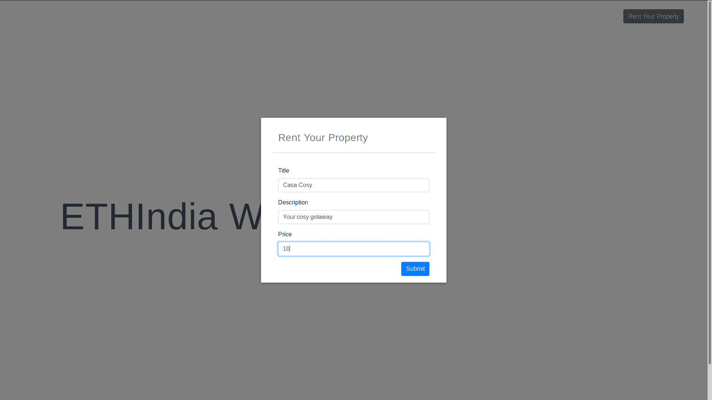
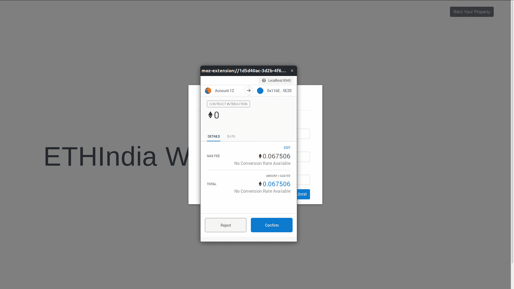
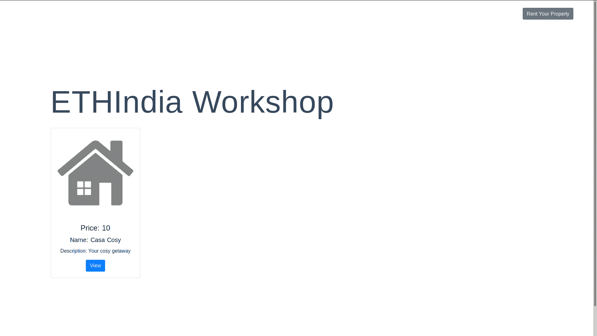

# 介绍

> 原文：<https://github.com/figment-networks/learn-tutorials/blob/master/polygon/launch-a-full-stack-dapp.md>

[**原文教程可以在 Polygon (Matic)的官方文档这里找到。**T3】](https://docs.matic.network/docs/develop/full-stack-dapp-with-pos)

本教程简要介绍了部署在 Polygon (Matic)上的全栈 DApp，并提供了 Stake 安全性证明。作为一名 DApp 开发人员，要构建 PoS 安全性，过程非常简单，只需将智能合约部署到 Polygon (Matic)上。这是可能的，因为基于帐户的架构使 EVM 兼容侧链。

# 先决条件

*   NodeJS v8.10+版

```
node -v
v12.16.0 
```

如果需要更新节点:

```
curl -o- https://raw.githubusercontent.com/creationix/nvm/v0.33.11/install.sh | bash nvm install --ltsnvm use lts 
```

*   Metamask:可以从官网下载 Metamask 扩展:[https://metamask.io/](https://metamask.io/)

# 我们在建造什么？

我们计划建立一个分散的 AirBnB，包含三个主要功能:

*   出租你的空间
*   查看可用空间
*   向某人租用空间

继续克隆[库](https://github.com/maticnetwork/ethindia-workshop)，安装依赖项，然后运行`npm install`。

# 设置

## 设置数据结构

我们想租一处有名称、描述、所有者和价格的房产。

因此，我们想要一个名为“property”的结构，它将包括名称、描述、价格、所有者、表示其活动与否的布尔标志，以及表示该物业预订天数的布尔数组。

```
struct Property { 
  string name;
  string description;
  bool isActive;      // is property active
  uint256 price;      // per day price in wei (1 ether = 10^18 wei)
  address owner;      // Owner of the property
  bool[] isBooked;
  // Is the property booked on a particular day,
  // For the sake of simplicity, we assign 0 to Jan 1, 1 to Jan 2 and so on
  // so isBooked[31] will denote whether the property is booked for Feb 1
}
```

我们还希望通过将唯一的属性 id 映射到每个新的属性对象来跟踪我们刚刚创建的属性对象。

为此，我们首先声明一个变量 propertyId，然后是 propertyId 到 property 的映射，称为 properties。

```
uint256 public propertyId;
// mapping of propertyId to Property object
mapping(uint256 => Property) public properties;
```

如果我们有酒店，我们还想记录到目前为止的所有预订。

我们可以通过为一个预订创建另一个结构来做到这一点，该结构的属性有:propertyId、check in 和 check out 日期以及预订的用户。

```
struct Booking {
  uint256 propertyId;
  uint256 checkInDate;
  uint256 checkoutDate;
  address user;
}
```

类似于我们跟踪每个属性，我们可以跟踪每个预订——通过将每个预订 id 映射到一个特定的预订对象。

```
uint256 public bookingId;
// mapping of bookingId to Booking object
mapping(uint256 => Booking)
public bookings;
```

## 定义事件

接下来，我们希望为数据流和智能合约的工作添加一些逻辑。为此，我们添加了函数。

总的来说，我们需要三个基本功能:

*   在 Airbnb 市场上出租房产- `rentOutproperty`
*   预订- `rentProperty`
*   从市场上拿走一项财产

## 定义函数

**T2`rentOutProperty`**

```
function rentOutproperty(string memory name, string memory description, uint256 price) public {
Property memory property = Property(name, description, true /* isActive */, price, msg.sender /* owner */, new bool[](365));

// Persist `property` object to the "permanent" storage
properties[propertyId] = property;

// Emit an event to notify the clients
emit NewProperty(propertyId++);
```

**T2`rentProperty`**

```
function rentProperty(uint256 _propertyId, uint256 checkInDate, uint256 checkoutDate) public payable {
// Retrieve `property` object from the storage
Property storage property = properties[_propertyId];

// Assert that property is active
require(
  property.isActive == true,
  "property with this ID is not active"
);

// Assert that property is available for the dates
for (uint256 i = checkInDate; i < checkoutDate; i++) {
  if (property.isBooked[i] == true) {
    // if property is booked on a day, revert the transaction
    revert("property is not available for the selected dates");
  }
}
```

**T2`markPropertyAsInactive`**

```
function markPropertyAsInactive(uint256 _propertyId) public {
require(
  properties[_propertyId].owner == msg.sender,
  "THIS IS NOT YOUR PROPERTY"
);
properties[_propertyId].isActive = false;
}
```

我们在`rentProperty`函数中使用了两个函数`_sendFunds`和`_createBooking`。这两个函数是内部函数，按照 Solidity 中的命名约定，它们以下划线为前缀。我们要求这些是内部的，因为我们不希望任何人能够发送资金到自己的帐户或创建一个非活动的财产预订。

这两个功能定义为:

**T2`_sendFunds`**

你可以在这里阅读更多关于我们使用的[特定传递函数的信息。](https://solidity.readthedocs.io/en/v0.5.10/050-breaking-changes.html?highlight=address%20payable#explicitness-requirements)

```
function _sendFunds (address beneficiary, uint256 value) internal {
  address(uint160(beneficiary)).transfer(value);
}
```

**T2`_createBooking`**

```
function _createBooking(uint256 _propertyId, uint256 checkInDate, uint256 checkoutDate) internal {
// Create a new booking object
bookings[bookingId] = Booking(_propertyId, checkInDate, checkoutDate, msg.sender);

// Retrieve `property` object from the storage
Property storage property = properties[_propertyId];

// Mark the property booked on the requested dates
for (uint256 i = checkInDate; i < checkoutDate; i++) {
  property.isBooked[i] = true;
}

// Emit an event to notify clients
emit NewBooking(_propertyId, bookingId++);

}
```

你可以在这里查看整个代码[。](https://github.com/maticnetwork/ethindia-workshop/blob/master/contracts/Airbnb.sol)

一旦您准备好了契约代码，接下来的步骤将是在 testnet 上部署代码并测试它的工作情况。

# 部署和测试

为此，我们使用 Remix IDE——一个在线 IDE 来开发智能合约。

*   前往[https://remix.ethereum.org](https://remix.ethereum.org/)如果你是 Remix 新手，你首先需要激活两个模块:Solidity 编译器和部署并运行事务。


如果尚未激活，您将需要激活插件，如**部署&运行事务**和**可靠性编译器**

您的左侧菜单应该如下所示:


*   创建一个新文件，`Airbnb.sol`
*   复制整个智能合同代码，并将其粘贴到编辑器中:

```
pragma solidity ^0.5.7;

contract Airbnb {

  // Property to be rented out on Airbnb
  struct Property {
    string name;
    string description;
    bool isActive; // is property active
    uint256 price; // per day price in wei (1 ether = 10^18 wei)
    address owner; // Owner of the property
    bool[] isBooked;
    // Is the property booked on a particular day,
    // For the sake of simplicity, we assign 0 to Jan 1, 1 to Jan 2 and so on
    // so isBooked[31] will denote whether the property is booked for Feb 1
  }

  uint256 public propertyId;

  // mapping of propertyId to Property object
  mapping(uint256 => Property) public properties;

  // Details of a particular booking
  struct Booking {
    uint256 propertyId;
    uint256 checkInDate;
    uint256 checkoutDate;
    address user;
  }

  uint256 public bookingId;

  // mapping of bookingId to Booking object
  mapping(uint256 => Booking) public bookings;

  // This event is emitted when a new property is put up for sale
  event NewProperty (
    uint256 indexed propertyId
  );

  // This event is emitted when a NewBooking is made
  event NewBooking (
    uint256 indexed propertyId,
    uint256 indexed bookingId
  );

  /**
 * @dev Put up an Airbnb property in the market
 * @param name Name of the property
 * @param description Short description of your property
 * @param price Price per day in wei (1 ether = 10^18 wei)
 */
  function rentOutproperty(string memory name, string memory description, uint256 price) public {
    Property memory property = Property(name, description, true /* isActive */, price, msg.sender /* owner */, new bool[](365));

    // Persist `property` object to the "permanent" storage
    properties[propertyId] = property;

    // emit an event to notify the clients
    emit NewProperty(propertyId++);
  }

  /**
 * @dev Make an Airbnb booking
 * @param _propertyId id of the property to rent out
 * @param checkInDate Check-in date
 * @param checkoutDate Check-out date
 */
  function rentProperty(uint256 _propertyId, uint256 checkInDate, uint256 checkoutDate) public payable {
    // Retrieve `property` object from the storage
    Property storage property = properties[_propertyId];

    // Assert that property is active
    require(
      property.isActive == true,
      "property with this ID is not active"
    );

    // Assert that property is available for the dates
    for (uint256 i = checkInDate; i < checkoutDate; i++) {
      if (property.isBooked[i] == true) {
        // if property is booked on a day, revert the transaction
        revert("property is not available for the selected dates");
      }
    }

    // Check the customer has sent an amount equal to (pricePerDay * numberOfDays)
    require(
      msg.value == property.price * (checkoutDate - checkInDate),
      "Sent insufficient funds"
    );

    // send funds to the owner of the property
    _sendFunds(property.owner, msg.value);

    // conditions for a booking are satisfied, so make the booking
    _createBooking(_propertyId, checkInDate, checkoutDate);
  }

  function _createBooking(uint256 _propertyId, uint256 checkInDate, uint256 checkoutDate) internal {
    // Create a new booking object
    bookings[bookingId] = Booking(_propertyId, checkInDate, checkoutDate, msg.sender);

    // Retrieve `property` object from the storage
    Property storage property = properties[_propertyId];

    // Mark the property booked on the requested dates
    for (uint256 i = checkInDate; i < checkoutDate; i++) {
      property.isBooked[i] = true;
    }

    // Emit an event to notify clients
    emit NewBooking(_propertyId, bookingId++);
  }

  function _sendFunds (address beneficiary, uint256 value) internal {
    // address(uint160()) is a weird solidity quirk
    // Read more here: https://solidity.readthedocs.io/en/v0.5.10/050-breaking-changes.html?highlight=address%20payable#explicitness-requirements
    address(uint160(beneficiary)).transfer(value);
  }

  /**
 * @dev Take down the property from the market
 * @param _propertyId Property ID
 */
  function markPropertyAsInactive(uint256 _propertyId) public {
    require(
      properties[_propertyId].owner == msg.sender,
      "THIS IS NOT YOUR PROPERTY"
    );
    properties[_propertyId].isActive = false;
  }
}
```

*   选择`0.5.7+commit.6da8b019`作为编译器，编译智能合同
*   一旦编译完成，智能合同就可以部署到 testnet/mainnet 上了。
*   复制生成的 ABI——我们将在接下来的步骤中需要它


*   在下拉列表中选择 Javascript VM 作为环境——这将通过您的浏览器将 remix 连接到一个简单的区块链环境——我们将在下一篇教程中了解更多关于在 Polygon (Matic)的测试网络上部署的信息[链接]


一旦元掩码连接到 Remix,“Deploy”事务将生成另一个要求事务确认的元掩码弹出窗口。


*   点击**部署**
*   一旦部署了契约，您就可以测试功能了

# 建立我们的 DApp

在克隆的存储库中，导航到`dapp-ui`中的`plugins`目录

将上一步复制的合同地址粘贴到`utils.js`中的`airbnbContractAddress`变量中。

从上一步复制 ABI

*   导航至`dapp-ui/plugins/airbnbABI.json`并添加以下内容:

```
{"abi":}
```

*   粘贴 abi 作为刚刚定义的“ABI”键的值
*   它应该是这样的:

```
{"abi": [{"constant": true,"inputs": [],"name": "bookingId","outputs": [{"name": "","type": "uint256"}],"payable": false,"stateMutability": "view","type": "function"},.................................]}
```

## 将用户界面连接到元掩码

接下来，我们希望 UI 与 Metamask 相连接。为此，我们遵循以下两个步骤:

首先，在`dapp-ui/pages/index.vue`中的`mounted()`方法中添加`setProvider()`方法

> 注意:粘贴后您可能会遇到缩进问题。使用更漂亮的来保持代码的整洁。

```
// init Metamask
await setProvider();
// fetch all properties
const properties = await fetchAllProperties()this.posts = properties;
```

接下来我们想要注入元掩码实例——为此我们在`dapp-ui/plugins/utils.js`中定义了`setProvider()`方法

```
if (window.ethereum)
{
  metamaskWeb3 = new Web3(ethereum);
  try{
  // Request account access if needed
  await ethereum.enable();
  }
  catch (error){
  // User denied account access...
  }
}
else if (window.web3){
    metamaskWeb3 = new Web3(web3.currentProvider);
}
account = await metamaskWeb3.eth.getAccounts()
```

## 定义组件和功能

一旦我们连接了元掩码，我们接下来希望能够与部署的契约进行通信。为此，我们将创建一个新的契约对象——代表我们的 AirBnB 智能契约。

在`dapp-ui/plugins/utils.js`内部创建以下函数，该函数实例化并返回`airbnbContract`:

```
function getAirbnbContract(){
  airbnbContract = airbnbContract || new metamaskWeb3.eth.Contract(AirbnbABI.abi, airbnbContractAddress)
  return airbnbContract
}
```

连接元掩码并启动合同后，我们可以继续与合同进行交互。

`dapp-ui`文件夹结构看起来像这样:


在`dapp-ui/components`目录中，我们有组成应用程序界面的独立组件。

我们希望我们的应用支持的三个主要功能是:

*   张贴一个新的属性-或出租空间
*   查看所有可用属性
*   从所有可用空间中租赁新的物业

我们将首先设置我们的房产表单——用于出租房产——在后端，它与 Airbnb 智能合同的`rentOutProperty`功能进行交互

导航到`dapp-ui/components/propertyForm.vue`并在`postAd()`方法中添加以下代码。`postAd()`方法应该是这样的:

```
// convert price from ETH to Wei
const weiValue = web3().utils.toWei(this.price, 'ether');
// call utils.postProperty
postProperty(this.title, this.description, weiValue);
```

`postProperty`函数将在`dapp-ui/plugins/utils.js`内部定义。应该是这样的:

```
const prop = await getAirbnbContract().methods.rentOutproperty(name, description, price).send(
  {from: account[0]
})
alert('Property Posted Successfully')
```

接下来，为了合并新酒店的预订，我们将在`dapp-ui/components/detailsModal.vue`中定义`book()`函数。复制`book()`里面的代码片段

```
// get Start date
const startDay = this.getDayOfYear(this.startDate)
// get End date
const endDay = this.getDayOfYear(this.endDate)
// price calculation
const totalPrice = web3().utils.toWei(this.propData.price, 'ether') * (endDay - startDay)
// call utils.bookProperty
bookProperty(this.propData.id, startDay, endDay, totalPrice)
```

`bookProperty()`函数将在`utils.js`中定义，应该如下所示:

```
const prop = await getAirbnbContract().methods.rentProperty(spaceId, checkInDate, checkOutDate).send(
  {from: account[0],value: totalPrice,})
  alert('Property Booked Successfully')
```

复制`bookProperty()`中的代码片段

下一个也是最后一个要添加的功能是获取和显示所有可用空间。`fetchAllProperties()`函数在`index.vue`内部被调用，在`utils.js`内部被定义

导航到`dapp-ui/plugins/utils.js`并将以下代码添加到`fetchAllProperties()`方法中:

```
const propertyId = await getAirbnbContract().methods.propertyId().call()
// iterate till property Id
const properties = []for (let i = 0; i < propertyId; i++){
  const p = await airbnbContract.methods.properties(i).call()
  properties.push(
    {id: i,name: p.name,description: p.description,price: metamaskWeb3.utils.fromWei(p.price)}
  )}
  return properties
```

# 运行和测试

这标志着我们的 DApp 教程结束了！我们知道这是一个漫长的过程。

执行`npm run dev`查看您的分散式应用程序并与之交互。



点击右上角的“租赁您的物业”按钮，会显示一个对话框，要求输入标题、描述和价格。“提交”按钮以事务的形式将这些值发送到智能合约上的函数“rentOutProperty”。因为它与区块链“交易”,所以它会创建一个元掩码弹出窗口，要求您签署交易，如下所示。



Metamask 弹出窗口显示交易的天然气价格。




交易被确认后，该资产位于区块链上，因为它可以被预订，所以它显示在主页上。

如果您在学习本教程时有任何困难，或者只是想与我们讨论多边形(Matic)和数据中枢技术，您可以今天就[加入我们的社区](https://figment.io/devchat)！