# 介绍

> 原文：<https://github.com/figment-networks/learn-tutorials/blob/master/polygon/petgram.md>

在本教程中，您将学习如何构建一个类似于 Instagram 的社交媒体 dApp(去中心化应用程序),以及如何将其部署在 Polygon (Matic)孟买测试网络上。所以拿起你最喜欢的饮料，让我们开始吧 <g-emoji class="g-emoji" alias="coffee" fallback-src="https://github.githubassets.cimg/icons/emoji/unicode/2615.png">☕️</g-emoji> ！

PetGram 是 Instagram 平台的一个分散版本，用户可以浏览自己喜欢的宠物的可爱照片，查看特定宠物的详细信息，创建帖子并赚取 NFT。

# 先决条件

对于本教程，建议完成[多边形路径](https://learn.figment.io/protocols/polygon)。以及对 Solidity 的基本理解、React 和 JavaScript 的工作知识。

# 要求

您需要在计算机上安装以下软件来构建此 dApp:

*   [Node.js](https://nodejs.org/en/download/) v14.17.6 LTS 或更高版本已安装
*   [松露](https://www.trufflesuite.com/truffle)最新版本安装完毕
*   [Ganache](https://www.trufflesuite.com/ganache) 安装最新版本
*   安装在浏览器中的[元掩码](https://metamask.io/)
*   你还需要一个 GitHub 账户

强烈建议创建一个新的元掩码帐户进行测试。您会希望将这个新帐户的秘密恢复短语放在手边，因为部署智能合约需要它。

要通过元掩码与多边形交互，首先必须添加一个新的 RPC 端点。通过点击浏览器工具栏中的 Fox 图标打开 Metamask 扩展，然后选择设置->网络->添加网络->保存。填写下图中给出的信息:


现在，您会注意到您的钱包中余额为零(0 MATIC)，要获得用于部署和测试的 test Matic，请转到 MATIC 水龙头[链接](https://faucet.matic.network) - >选择孟买- >粘贴您的钱包地址- >单击“提交”。

当这个完成时，检查你的元掩码&你会在那里看到一些 MATIC 标记。我们只需要少量的 MATIC(大约 5-10 个)来部署和测试我们的 dApp。


# 项目设置

为了避免潜在的版本相关错误&我们不是一个接一个地安装支持代码库(依赖项)，而是通过克隆包含项目文件的 GitHub 存储库并安装所有必要的依赖项来开始构建 Petgram dApp。

*   分叉位于[https://github.com/electrone901/tutorial-petgram](https://github.com/electrone901/tutorial-petgram)的库，这将在你自己的 GitHub 账户中复制这个项目。

*   使用以下命令克隆 GitHub 存储库(这将把项目文件从 GitHub 复制到您的计算机上):

```
git clone https://github.com/<YourGitHubUsername>/tutorial-petgram.git 
```

现在可以用自己喜欢的代码编辑器或者 IDE 打开项目了，比如 [Visual Studio 代码](https://code.visualstudio.com)。如果你浏览项目目录，你会注意到一个来自 [Create React app](https://github.com/facebook/create-react-app) 的基本 React App 项目结构。这包含我们的前端 React 代码，一旦我们的智能合约部署完毕，我们将需要对其进行更改。

在运行 React 前端之前，让我们用命令`npm install`安装依赖项。

现在我们的项目已经拥有了所有的依赖项，我们可以使用命令`npm start`来运行它。您的浏览器应该会自动打开并显示主页(见下图)。如果您的浏览器没有打开，请确保您的项目正在运行，转到您的浏览器，并键入`http://localhost:3000/`。

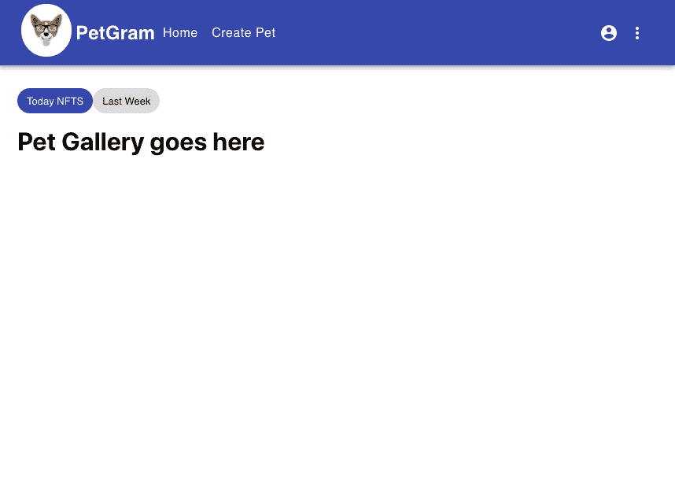

> 注意:随着本教程的进行，确保你的项目在给定的点上反映了相似的结果。几乎每一步都有截图作为检查点。

# 可靠的智能合同

现在，让我们开始设置编码智能契约的环境。我们将使用 Truffle，它是以太坊和其他 EVM 兼容区块链如 Polygon 的开发环境、测试框架和资产管道。

如果你还没有安装它，用命令`npm install -g truffle`安装 truffle。

对于一组默认的契约和测试，在项目根目录中运行`truffle init`。

松露初始化过程创建了三个目录:`contracts`、`migrations`和`test`，以及三个文件`Migrations.sol`、`1_initial_migrations.js`和`truffle-config.js`。

*   存储我们的 Solidity 智能合同代码的地方。您会注意到这里已经有一个名为`Migrations.sol`的智能契约，它在迁移过程中使用。

*   `migrations/`将存储 Truffle 的“部署者”Javascript 文件。每次你想部署一个契约，你都需要告诉 Truffle 是哪一个，以及你可能需要什么构造函数参数。`1_initial_migration.js`是部署我们的迁移合同的脚本。这是最基本的部署类型，因为它不需要库链接或构造函数参数。

*   我们可以在这里为我们的 dApp 编写测试用例。它可以包含。`js`或`.sol`文件，这取决于你选择的测试语言。

*   `truffle-config.js`是 Truffle 项目的主要配置文件。这是我们定义使用哪些网络，使用多少天然气，部署地址和其他一些变量的地方。

**truffle-config.js**

在我们可以在`truffle-config.js`中设置一些配置细节之前，让我们从删除文件的现有内容开始，这样我们就有了一个空白的石板。我们还需要安装 npm 包 dotenv 和 hdwallet-provider。使用命令`npm install dotenv @truffle/hdwallet-provider`。

dotenv 是一个将环境变量从一个`.env`文件加载到 JavaScript 的 process.env 中的模块。我们将使用 dotenv 来存储来自 Metamask 的秘密恢复短语(助记符)。这用于生成在 Ganache 上开发期间可用的地址，以及从这些地址发送的签名事务。

Truffle 的 HDWalletProvider 类支持 Web3 provider，用于为从 12 或 24 个字的秘密恢复短语(助记符)派生的地址签署交易。

让我们将它们导入到我们的`truffle-config.js`:

```
require('dotenv').config()
const HDWalletProvider = require('@truffle/hdwallet-provider')
```

我们还需要一个`.env`文件来存储助记符——十二个单词的短语。要创建它，请遵循本指南。

你的文件应该类似于这个: 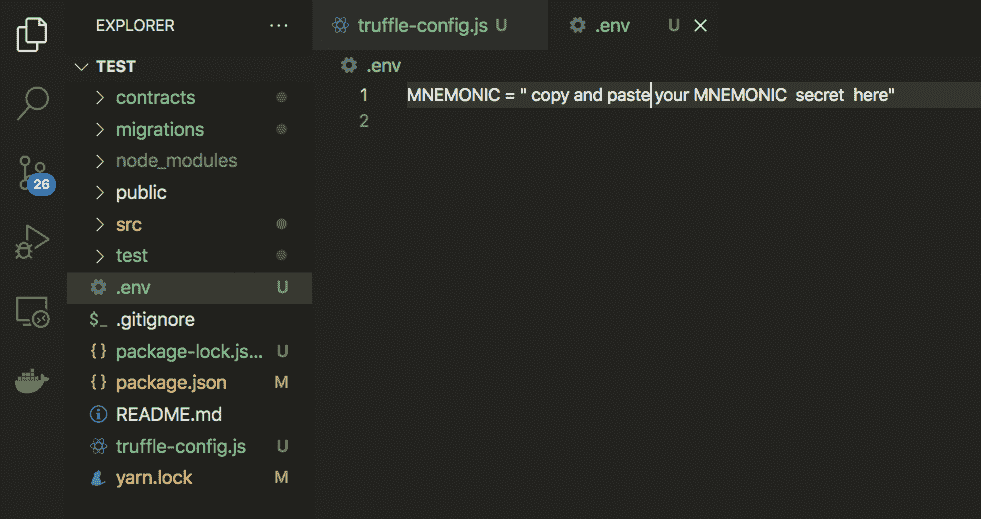

我们可以使用`dotenv`将助记符初始化为一个变量，这允许我们通过`process.env`从`.env`文件中访问环境变量:

```
const mnemonic = process.env.MNEMONIC.toString().trim()
```

现在我们需要定义我们想要使用的网络。网络指定了我们如何将 Truffle 连接到我们的以太坊客户端，并让我们为用于发送交易的 web3 设置默认值。对于这个项目，我们将使用开发和 matic 网络。

开发网络是 Truffle 默认使用的特殊网络，一般用于测试。基本设置需要主机、端口号和网络 id。关于配置的更多信息可以在 [Truffle 文档](https://www.trufflesuite.com/docs/truffle/reference/configuration)中找到。

将以下代码添加到您的`truffle-config.js`中:

```
require('dotenv').config()
const HDWalletProvider = require('@truffle/hdwallet-provider')
const mnemonic = process.env.MNEMONIC.toString().trim()

module.exports = {
  networks: {
    development: {
      host: '127.0.0.1',
      port: 7545,
      network_id: '*', // Match any network id
    },
    matic: {
      provider: () =>
        new HDWalletProvider(
          mnemonic,
          `https://matic-mumbai.chainstacklabs.com`,
        ),
      network_id: 80001,
      confirmations: 2,
      timeoutBlocks: 200,
      skipDryRun: true,
    },
  },
}
```

我们还需要指定合同构建目录、Solidity 版本和 Solidity 编译器(solc)缺省值。

合同生成目录是已编译合同的默认输出目录路径。在我们的例子中，我们希望输出在项目的前端。我们可以使用 Solidity 编译器版本 0.6.0 和默认设置。运行次数将影响契约创建 gas 成本和后续函数调用 gas 成本之间的权衡。如果你不介意大量的前期成本，你应该多运行几次编译器。查看 Solidity 文档了解更多信息[https://docs . soliditylang . org/en/develop/using-the-compiler . html # using-the-compiler](https://docs.soliditylang.org/en/develop/using-the-compiler.html#using-the-compiler)。

将这些 solc 默认值添加到您的`truffle-config.js`文件中，在网络下面:

```
module.exports = {
  networks: {
    development: {
      host: '127.0.0.1',
      port: 7545,
      network_id: '*', // Match any network id
    },
    matic: {
      provider: () =>
        new HDWalletProvider(
          mnemonic,
          `https://matic-mumbai.chainstacklabs.com`,
        ),
      network_id: 80001,
      confirmations: 2,
      timeoutBlocks: 200,
      skipDryRun: true,
    },
  },
 contracts_build_directory: './src/abis/',
 compilers: {
   solc: {
     version: '^0.6.0',
     optimizer: {
       enabled: true,
       runs: 200,
     },
   },
 },
}
```

# 彼得·索尔

现在让我们开始编写智能合约。在 contracts 文件夹中创建一个新文件，您可以在新的终端中打开您的项目，并在 Linux/macOS 上使用命令`touch ./contracts/Pet.sol`或在 Windows 上使用命令`type nul > contracts\Pet.sol`。

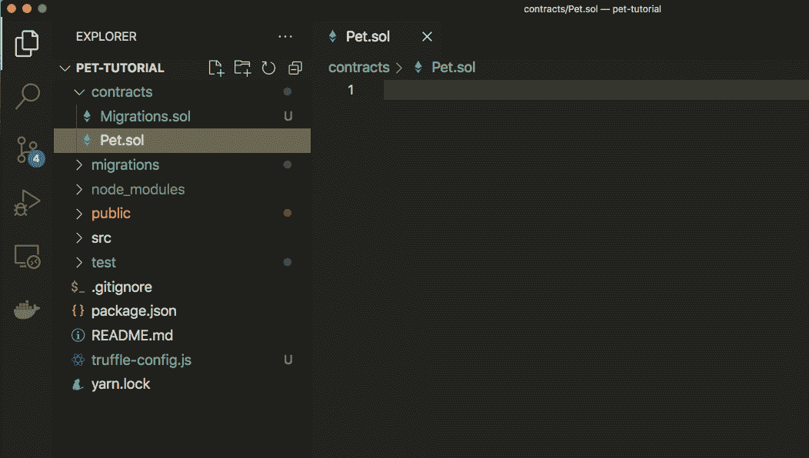

这是我们用 Solidity 编程语言编写所有宠物令牌源代码的文件。我们将设计我们的智能合同，使用 IPFS 存储数据来存储离线照片。NFT 元数据通常使用分散存储，如 IPFS 或 Filecoin。使用 NFT 元数据允许我们上传数据并接收内容的 IPFS 散列(CID 或内容标识符),该散列可以作为指向内容的指针在链上被引用。

让我们像这样创建智能合约的基本结构:

```
pragma solidity ^0.6.0;
import "@openzeppelin/contracts/token/ERC721/ERC721.sol";

contract Pet is ERC721 {
   constructor() ERC721("Pet", "PET") public  {}
}
```

首先，我们从声明 Solidity 编程语言的版本开始，我们将用它来编码智能契约，在本例中，版本是 0.6.0。

然后，我们导入 OpenZeppelin Solidity 库。在继续之前，我们需要将它安装到我们的项目中。使用终端命令:

*   `npm i @openzeppelin/contracts@3.4.1`

我们创建了名为 Pet 的智能合约。注意，我们的契约继承了 OpenZeppelin ERC721 库中的函数和行为:

```
contract Pet is ERC721 {}
```

我们契约的剩余代码将放在花括号内。我们可以自定义我们的令牌，给它一个名称和一个符号，如下所示:

```
contract Pet is ERC721 {
  constructor() ERC721("Pet", "PET") public  {}
}
```

在这一步中，我们添加了一个构造函数来定制令牌。构造函数是一个函数，它接受像名字“宠物”和符号“宠物”这样的参数。当部署协定时，构造函数只运行一次。每当创建智能契约时，我们将能够在 ABI ( [应用二进制接口](https://docs.soliditylang.org/en/latest/abi-spec.html))的帮助下通过名称“Pet”来引用该契约。

请注意，我们使用 OpenZeppelin ERC-721 标准来创建令牌。ERC-721 标准是一套规则，规定了智能合约应该具有的功能和行为。要了解更多信息，请阅读 [OpenZeppelin 文档](https://docs.openzeppelin.com/contracts/4.x/erc721)。

现在我们可以添加 mintPetNFT 函数，它将允许我们创建新的宠物令牌，如下所示:

```
pragma solidity ^0.6.0;
import "@openzeppelin/contracts/token/ERC721/ERC721.sol";

contract Pet is ERC721 {
  constructor() ERC721("Pet", "PET") public  {}

   function mintPetNFT(string memory _tokenURI) external {
       uint _tokenId = totalSupply().add(1);
       _safeMint(msg.sender, _tokenId);
       _setTokenURI(_tokenId, _tokenURI);
       emit PetNFTCreated(_tokenId, _tokenURI, now, msg.sender);
    }

 }
```

这是函数的基本结构。它将接受一个字符串数据类型的参数，这将是 IPFS 图像的路径(图像所在的位置)。tokenId 变量被声明为 uint 数据类型，这意味着无符号整数(只能是 0 或以上的数字，不能是负数)。这个变量为每个宠物令牌保存一个唯一的标识符号码。

`_safeMint`函数获取用户的钱包地址和令牌 Id 来创建和设置 NFT 的所有权。`_setTokenURI`函数获取 tokenId 和 tokenURI(图像的位置)并将它们链接在一起。我们这样做是为了让每个令牌都有一个标识符、一个所有者和一个图像路径。然后，我们通过调用`emit`函数并将其命名为“PetNFTCreated”，发出一个带有 tokenId、tokenURI、时间戳和用户钱包地址的事件。

最后，我们需要定义 PetNFTCreated 事件。该事件对于交易确认非常有用，每次我们创建 NFT 时，它都会返回 NFT 令牌 Id、图像路径、时间和用户钱包地址。

```
// SPDX-License-Identifier: MIT
pragma solidity ^0.6.0;
import "@openzeppelin/contracts/token/ERC721/ERC721.sol";

contract Pet is ERC721 {

  constructor() ERC721("Pet", "PET") public  {}
  event PetNFTCreated (

    uint tokenId,
    string imageURL,
    uint date,
    address payable from
  );

  function mintPetNFT(string memory _tokenURI) external {
    uint _tokenId = totalSupply().add(1);
    _safeMint(msg.sender, _tokenId);
    _setTokenURI(_tokenId, _tokenURI);
    emit PetNFTCreated(_tokenId, _tokenURI, now, msg.sender);
  }
}
```

在我们继续之前，让我们确保一切工作正常。在您的终端中，确保您在项目根目录中并运行命令`truffle compile`。

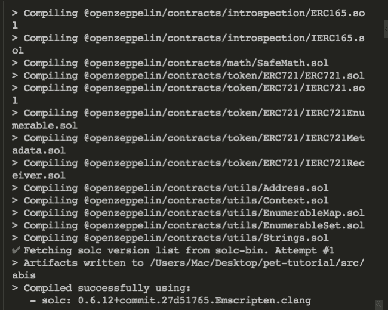

现在，让我们将我们的智能合同部署到开发本地区块链。首先，确保 Ganache 正在运行(在它自己的终端窗口/标签中)。然后，在`migrations`目录中创建一个名为`2_deploy_contracts.js`的新迁移文件。

将以下代码添加到这个新文件中:

```
const MyPet = artifacts.require('Pet')
module.exports = function (deployer) {
  deployer.deploy(MyPet)
}
```

这个简单的 JavaScript 文件负责将智能合约部署到区块链。我们可以执行该文件，并通过运行 Truffle 迁移将智能合约放在本地区块链上，如下所示:

```
truffle migrate 
```

您应该会看到类似的结果。

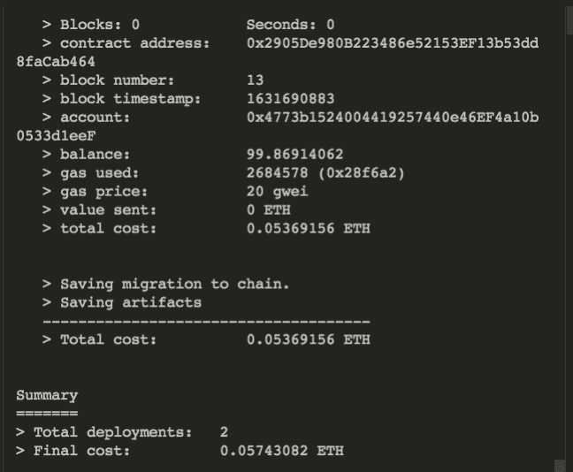

# 将智能合同部署到 Polygon Mumbai Testnet

要在 Polygon Mumbai testnet 上部署智能合约，您需要为您的帐户提供资金。如果你需要这方面的帮助，请查看本[指南](https://learn.figment.io/tutorials/fund-a-polygon-account)。

让我们使用以下命令部署智能合约:

```
truffle migrate --network matic
```

如果您是第二次或者更多次部署它，使用`--reset`标志来避免 JSON 错误:`truffle migrate --network matic --reset`。

只要部署成功，输出应该差不多: 

# 构建 React 前端

路径:`/src/components/`

React 应用程序由各种组件组成，例如，导航栏、主页、页脚等。

React 加载一个单独的 HTML 页面(`/public/index.html`)，然后用项目中定义的所有组件填充这个页面。如果打开 components 文件夹，您将看到我们项目的一般结构，其中包含以下文件夹:

*   `commons/`:包含每当页面加载时都会呈现的 CircularProgress 组件。
*   这个目录是我们添加创建新帖子的功能的地方
*   `home-container/`:有三个子文件夹
    *   这个目录是图库(PetGallery)的容器，它包含了标签和按钮的 HTML。
    *   这个目录是我们保存代码的地方，这些代码与从 nft.storage 中获取所有宠物并显示它们的基本信息有关。
    *   这个目录包含了我们将用来显示宠物所有信息的组件，以及 mint NFTs。

# App.js

让我们处理 React UI 的主文件:`App.js`将包含组成 React 应用程序的所有组件(navbar、main、footer、home 等)。

当您打开`App.js`文件时，您会注意到我们正在使用 React Router DOM 模块在 web 应用程序中实现动态路由。与传统的路由架构不同，在传统的路由架构中，路由是在运行的应用程序之外的配置中处理的，React Router DOM 根据应用程序和平台的需求促进了基于组件的路由。

到目前为止，我们已经初始化了一些函数，稍后我们将实现这些函数。我们还定义了我们的路由，我们用包含组件(称为子组件)的路由器元素包装了它们。子组件可以接受任何属性(稍后将详细介绍)。

请注意，switch 语句之外的任何内容都将显示在主页上，React router 的主要目的是为每条路径提供不同的组件。

```
import React from 'react'
import { BrowserRouter as Router, Switch, Route } from 'react-router-dom'
import './App.css'
import { Navbar } from './components/layout/navbar/Navbar'
import Footer from './components/layout/footer/Footer'
import Home from './components/home-container/home/Home'
import PetDetails from './components/home-container/pet-details/PetDetails'
import CreatePet from './components/create-post/CreatePet'

function App() {
  // Add variables

  const loadWeb3 = async () => {}

  const getContract = async () => {}

  const connectWallet = async () => {}

  return (
    <Router>
      <div className="cl">
        <Navbar />
        <Route exact path="/" component={Home} />
        <Switch>
          <Route exact path="/create-pet" component={CreatePet} />
          <Route path="/pet-details/:petId">
            <PetDetails />
          </Route>
        </Switch>
        <Footer />
      </div>
    </Router>
  )
}

export default App
```

我们需要将我们的 React 前端连接到区块链网络，以便它可以与智能合约进行交互。让我们从使用命令`npm install web3`安装 web3 开始。然后导入 web3、useState 和智能合约的 ABI(在。json 格式):

```
import Web3 from 'web3'
import MyPet from './abis/Pet.json'
import { useState } from 'react'
```

Web3 是一个库集合，允许我们使用 HTTP、IPC 或 WebSockets 与本地或远程以太坊节点进行交互。

我们还需要一些变量来跟踪应用程序的状态。在函数应用程序中，在注释“添加变量”下添加这些变量:

```
const [account, setAccount] = useState('')
const [contractData, setContractData] = useState('')
```

我们使用 React useState 钩子来跟踪应用程序的状态。在功能组件中使用这个钩子，您可以创建一个状态，而不用切换到具有内置状态对象的类组件。

让我们来看看这个变量声明:

```
const [account, setAccount] = useState('')
```

该语句的第一部分(account)是一个初始化为空字符串的变量。setAccount 是一个为 Account 变量设置新值的函数。

现在我们需要实现`loadWeb3`函数，这个函数将把 web3 加载到我们的应用程序中。编辑`loadWeb3`函数，如下所示:

```
const loadWeb3 = async () => {
  if (window.ethereum) {
    window.web3 = new Web3(window.ethereum)
    await window.ethereum.request({ method: 'eth_requestAccounts' })
  } else if (window.web3) {
    window.web3 = new Web3(window.web3.currentProvider)
  } else {
    window.alert(
      'Non-Ethereum browser detected. You should consider trying Metamask!',
    )
  }
}
```

这段代码是如何使用`request`并指定`eth_requestAccounts`方法正确加载 web3 的例子。它从 Metamask 获取以太坊提供程序并将其注入到您的 dApp 中，如果您的浏览器没有安装 Metamask，它将显示一条弹出消息:“检测到非以太坊浏览器。你应该考虑试试 Metamask！”

让我们继续讨论`getContract`函数，该函数将把我们的应用程序连接到智能合约。编辑`getContract`函数，如下所示:

```
const getContract = async () => {
  const web3 = window.web3
  const accounts = await web3.eth.getAccounts()
  setAccount(accounts[0])
  const networkId = await web3.eth.net.getId()
  const networkData = MyPet.networks[networkId]

  if (networkData) {
    const abi = MyPet.abi
    const address = MyPet.networks[networkId].address
    const myContract = new web3.eth.Contract(abi, address)
    setContractData(myContract)
  } else {
    window.alert(
      'Contract is not deployed to the detected network. Connect to the correct network!',
    )
  }
}
```

在`getContract`函数中，我们将加载连接的帐户&并将其与网络 ID 连接。如果智能合约未部署到相应的网络，则会显示一个弹出窗口“合约未部署到检测到的网络。连接到正确的网络！”

既然我们已经有了连接到 web3 和我们的契约的方法，我们就可以使用这些函数了。让我们在`connectWallet`函数内部调用这些函数。编辑`connectWallet`函数，应该是这样的:

```
const connectWallet = async () => {
  await loadWeb3()
  await getContract()
}
```

现在我们有了`account`变量和`connectWallet`函数，我们需要将它们传递给我们的`Navbar`组件。该组件将使用它们来连接到我们的钱包，为此我们需要在 Navbar.js 文件中添加一个“连接钱包”按钮。我们将在移动到导航条时处理这个问题。现在，我们只需要将`account`变量和`connectWallet`函数作为属性传递给导航条。编辑`Navbar`路线，如下所示:

```
<Navbar account={account} connectWallet={connectWallet} />
```

类似地，`PetDetails`组件需要`account`和`contractData`变量来生成 NFT，因此编辑`PetDetails`路由，如下所示:

```
<PetDetails account={account} contractData={contractData} />
```

耶！！我们完成了 App.js 文件，现在我们的前端连接到区块链。

你有没有注意到我们正在使用异步/等待？这里有一个关于异步/等待概念的简短解释。

*   异步:它只是允许我们编写基于承诺的代码，就像它是同步的一样，并且它检查我们没有破坏执行线程。它通过事件循环异步运行。​​
*   **Await** :可以放在任何基于异步承诺的函数前面，暂停代码直到承诺实现，然后返回结果值。您可以在调用任何返回承诺的函数时使用 await，包括 web API 函数。

你可以在这里找到 Async/Await 函数[的简单解释。](https://www.geeksforgeeks.org/async-await-function-in-javascript/)

# navbar.js

*   路径:`src/components/layout/navbar/navbar.js`

在 Navbar 组件中，我们显示品牌标志、品牌名称和创建新帖子的链接。我们使用[材质 UI](https://material-ui.com/) 来创建导航栏和页脚组件的基本结构。

让我们转移到重要的东西，记得我们正在传递一些属性(帐户，连接钱包)到我们的 navbar 组件？

让我们用 withRouter 包装整个 Navbar 组件，这应该包括所有的函数、变量和 HTML。这应该是一个很长的组件，但为了简单起见，我只显示了我们的 Navbar 组件的开始和结束。你可以做的是编辑第 22 行的开始部分，并通过添加右花括号和圆括号来编辑结尾部分。

让我们编辑我们的 Navbar 组件，使它看起来像这样:

```
export const Navbar = withRouter(({ account, connectWallet }) => {
  const [anchorEl, setAnchorEl] = useState(null)
  const [mobileMoreAnchorEl, setMobileMoreAnchorEl] = useState(null)
  // Remember to include all the existing code inside the withRouter
})
```

我们正在使用已经从文件顶部的`react-router-dom`导入的 withRouter。withRouter 是一个高阶组件，它接受`account`和`connectWallet`属性。每当包装的组件呈现时，withRouter 负责将最近路线的匹配、当前位置和历史属性传递给包装的组件。简单地说，它将我们的组件连接到路由器，并将属性传递给这个文件。

现在我们有了钱包帐户，我们可以在注释“添加帐户”下添加以下代码:

```
{
  account ? (
    <>
      <Button className="whiteLink">
        {account.substring(0, 8)}...{account.substring(32, 24)}
      </Button>
      <Button
        variant="contained"
        className="connected-btn"
        endIcon={<VerifiedUserSharpIcon />}
      >
        Connected
      </Button>
    </>
  ) : (
    <Button
      variant="contained"
      className="connect-wallet-btn"
      onClick={() => {
        connectWallet()
      }}
    >
      Connect Wallet
    </Button>
  )
}
```

在这段代码中，我们检查帐户是否存在，然后显示钱包地址。否则，我们显示标签为`Connect Wallet`的按钮。此时，每当您单击`Connect Wallet`按钮时，它都会提示您连接元掩码，并且 UI 会发生变化以反映连接的钱包。

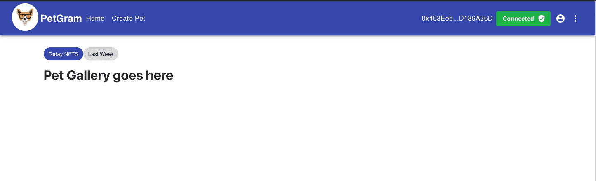

# CreatePet.js 文件

*   路径:`src/components/create-post/CreatePet.js`

为了让这个文件工作，我们需要安装 nft.storage。

然后导入以下代码:

```
import { NFTStorage, File } from 'nft.storage'
import { createRef } from 'react'
import { apiKey } from '../../APIKEYS'
```

如您所见，我们在这里导入了一些东西:

*   `NFTStorage`:是一个客户端库，它提供了一个方便的接口，用于从 web 浏览器或 Node.js 使用原始 HTTP API。

*   `File`:允许我们用图像名称和类型创建新的文件对象。

*   `createRef`:接收底层 DOM 元素作为其当前属性。换句话说，通过 ref 属性从 React 元素创建引用。

*   这是我们的 apiKey 凭证，以便我们的 dApp 可以与 nft.storage API 对话。

要获取 API 密钥，请访问 [nft.storage](https://nft.storage) ，注册一个帐户，创建一个新的 API 密钥，然后将其添加到 APIKEYS.js 文件中。

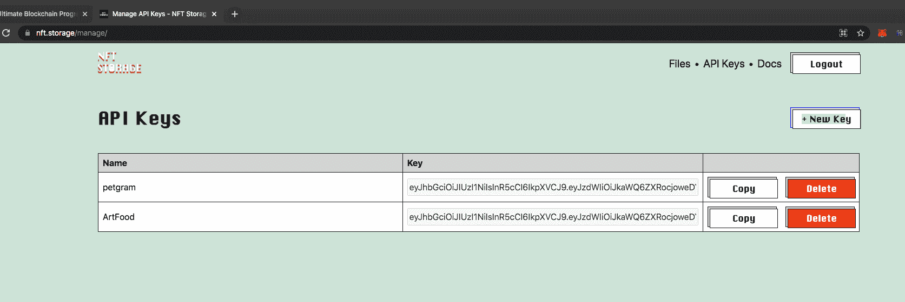

不要忘记在 src 中创建 APIKEYS.js，它应该是这样的:

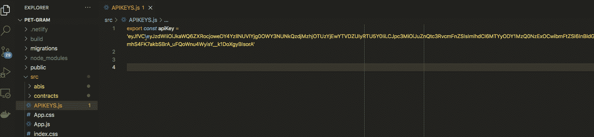

为了创建一个新的宠物，我们需要一些变量和函数。让我们添加所有收集用户输入的函数，如宠物名称、主人姓名、图像类型等。

在注释“添加变量”下添加以下代码。它应该是这样的:

```
function CreatePet() {
  // Add variables
  const history = useHistory()
  const [image, setImage] = useState('')
  const petTypeRef = createRef()
  const [petName, setPetName] = useState('')
  const [loading, setLoading] = useState(false)
  const [ownerName, setOwnerName] = useState('')
  const [imageName, setImageName] = useState('')
  const [imageType, setImageType] = useState('')
  const [petType, setPetType] = useState('')
  ...
}
```

注意，几乎每个变量都是以空字符串开始的。当用户输入时，我们将把它保存到组件状态中。然后，我们将把它们传递给我们的 API 调用，以将它们存储在 IPFS。记住，为了跟踪状态，我们使用了 useState React 钩子。

我们还需要两个函数:

*   `handleImage`函数将负责用用户输入更新变量。添加以下代码，使`handleImage`看起来像这样:

```
const handleImage = (event) => {
  setImage(event.target.files[0])
  setImageName(event.target.files[0].name)
  setImageType(event.target.files[0].type)
}
```

如您所见，`handleImage`函数接收一个事件，并将信息保存到状态中。

*   负责通过 nft.storage 将数据上传到 IPFS 的`handleSubmit`函数。编辑`handleSubmit`函数，如下所示:

```
const handleSubmit = async (event) => {
  event.preventDefault()
  try {
    setLoading(true)
    const client = new NFTStorage({ token: apiKey })
    const metadata = await client.store({
      name: petName,
      description: `${ownerName}, ${petType}`,
      image: new File([image], imageName, { type: imageType }),
    })
    if (metadata) {
      history.push('/')
    }
  } catch (error) {
    console.log(error)
    setLoading(false)
  }
}
```

在`handleSubmit`函数中，我们使用 NFTStorage 客户端库上传我们的数据。这个客户端库接受我们的 API 键，它要求我们将数据格式化成一个带有名称、描述和图像的对象。然后我们检查我们的数据是否被成功保存，它将用户重定向到主页面。否则，会引发错误消息。

现在，我们需要一个表单来创建新帖子，让我们将此表单添加到评论“添加表单”下:

```
{
  image ? (
    
  ) : (
    ''
  )
}
<div className="form-container">
  <form className="form" noValidate autoComplete="off">
    <input
      accept="image/*"
      className="input"
      id="icon-button-photo"
      defaultValue={image}
      onChange={handleImage}
      type="file"
    />
    <label htmlFor="icon-button-photo">
      <IconButton color="primary" component="span">
        <PhotoCamera />
      </IconButton>
    </label>
    <TextField
      fullWidth
      id="outlined-basic"
      label="Pet's name"
      variant="outlined"
      className="text-field"
      defaultValue={petName}
      onChange={(e) => setPetName(e.target.value)}
    />
    <TextField
      fullWidth
      id="outlined-basic"
      label="Owner's name"
      variant="outlined"
      className="text-field"
      defaultValue={ownerName}
      onChange={(e) => setOwnerName(e.target.value)}
    />
    <TextField
      fullWidth
      name="petType"
      select
      label="Choose one option"
      variant="outlined"
      className="text-field"
      onChange={(e) => setPetType(e.target.value)}
      defaultValue=""
      ref={petTypeRef}
    >
      <MenuItem value="Cat">Cat</MenuItem>
      <MenuItem value="Dog">Dog</MenuItem>
      <MenuItem value="Bird">Bird</MenuItem>
      <MenuItem value="Fish">Fish</MenuItem>
      <MenuItem value="Other">Other</MenuItem>
    </TextField>
    <Button
      size="large"
      variant="contained"
      color="primary"
      onClick={handleSubmit}
    >
      Submit
    </Button>
  </form>
</div>
```

为了获得良好的用户体验，我们正在添加上传图像的预览。在这一部分，我们说如果图像存在，那么创建一个图像并渲染它，否则显示一个空白。

然后，我们添加了一个简单的表单，其中包含一个图像字段、两个文本字段，分别表示主人姓名和宠物名称。以及宠物类型的下拉菜单。它们都绑定到一个变量和 onChange 函数。最后，我们将提交按钮绑定到 handleSubmit 函数，将数据发送到 nft.storage API。

现在，进入[http://localhost:3000/create-pet](http://localhost:3000/create-pet)并尝试创建一个新帖子。应该是这样的: 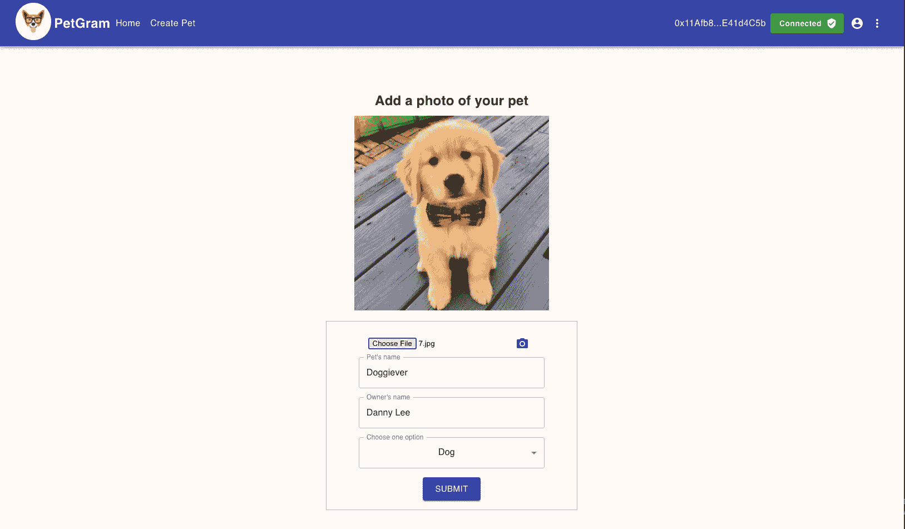

此外，它应该发送信息到 nft.storage。要检查，去[https://nft.storage/files/](https://nft.storage/files/)它应该有一个文件: 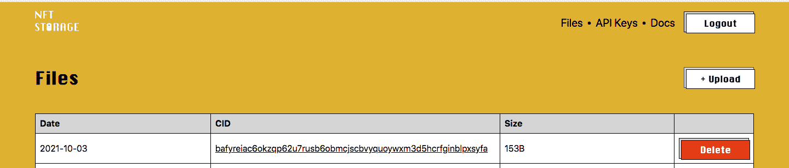

耶！！既然我们能够创建新帖子，让我们移动到宠物画廊。此时，可以随意添加一些帖子，以便我们可以在`PetGallery.js`组件中显示它们。

# 宠物画廊. js

*   路径:`src/components/home-container/gallery/PetGallery.js`

在这个组件中，我们将渲染一个包含所有 NFT 的图库。让我们从导入我们的`apiKey`文件和来自`react-router-dom`的`Link`开始。

```
import { apiKey } from '../../../APIKEYS'
import { Link } from 'react-router-dom'
```

React Router 提供了一个`Link`组件，用于在我们的应用程序中创建链接。

目前，我们的导入应该是这样的:

```
import React, { useEffect, useState } from 'react'
import CircularStatic from '../../commons/CircularProgressWithLabel'
import ImageListItem from '@material-ui/core/ImageListItem'
import IconButton from '@material-ui/core/IconButton'
import Button from '@material-ui/core/Button'
import ImageListItemBar from '@material-ui/core/ImageListItemBar'
import { Grid } from '@material-ui/core'
import './PetGallery.css'
import { apiKey } from '../../../APIKEYS'
import { Link } from 'react-router-dom'
```

如你所见，我们有一个组件和一些来自 material-ui 的元素，但最重要的是`CircularStatic`组件。这个组件是一个循环的进度条，每当我们的页面加载时都会呈现。其余的元素只是 HTML 标签，可以帮助我们创建图库。

现在，我们需要从 IPFS 获取宠物的数据，并将它们显示到我们的应用程序中。编辑`useEffect` React 钩子函数，如下所示:

```
useEffect(() => {
  const loadPets = async () => {
    try {
      setLoading(true)
      let cids = await fetch('https://api.nft.storage', {
        headers: {
          Authorization: `Bearer ${apiKey}`,
          'Content-Type': 'application/json',
        },
      })
      cids = await cids.json()
      const temp = []
      for (let cid of cids.value) {
        if (cid?.cid) {
          let data = await fetch(
            `https://ipfs.io/ipfs/${cid.cid}/metadata.json`,
          )
          data = await data.json()

          const getImage = (ipfsURL) => {
            if (!ipfsURL) return
            ipfsURL = ipfsURL.split('://')
            return 'https://ipfs.io/ipfs/' + ipfsURL[1]
          }

          data.image = await getImage(data.image)
          data.cid = cid.cid
          data.created = cid.created
          temp.push(data)
        }
      }
      setPetsData(temp)
      setLoading(false)
    } catch (error) {
      console.log(error)
      setLoading(false)
    }
  }
  loadPets()
}, [])
```

我们声明 petsData 变量，它被初始化为一个空数组，以及`setPetsData`函数。我们用 useEffect React 钩子来做这件事，它告诉 React 我们的组件在渲染后需要做一些事情。

注意，我们在 useEffect 的末尾调用了`loadPets`函数。`loadPets`函数获取 API 密钥，从 IPFS 存储器中获取宠物的信息，然后返回包含 NFT 信息的内容标识符。我们遍历 cids 数组，找到它的 id 并创建保存 NFT 元数据的数据变量，然后我们调用`getImage`函数。

最后，我们需要将图像、内容标识符(CID)和时间戳附加到数据变量上。然后，我们把它放入一个临时数组，最后我们把它设置为状态变量 petsData。

函数`getImage`获取 URL 路径，并用字符“://”将其拆分。Split 是一个 JavaScript 函数，它返回一个元素数组。然后，`getImage`通过添加数组的第二个元素返回正确的路径。我们需要这样做，因为 IPFS URL 不保留原始路径，而是需要一个到/从 URI 表示的转换步骤。要了解更多信息，请查看 [IPFS 文档](https://docs.ipfs.io/how-to/address-ipfs-on-web/#native-urls)。

注意:CIDs 引用不可变的内容，因此您可以确保您访问的内容是 NFT 中引用的内容。

现在，让我们渲染这些数据。在注释“添加宠物的数据”下添加以下代码:

```
{
  loading ? (
    <CircularStatic />
  ) : (
    <div style={{ flexGrow: 1 }}>
      <Grid container spacing={1}>
        {petsData.length ? (
          petsData.map((pet, index) => (
            <Grid item xs={6} sm={3} key={index}>
              <ImageListItem style={{ height: '450px', listStyle: 'none' }}>
                
                <ImageListItemBar
                  title={pet.name}
                  subtitle={<span>by: {pet.description}</span>}
                  actionIcon={
                    <IconButton
                      aria-label={`info about ${pet.name}`}
                      className="icon"
                    >
                      <Button
                        variant="contained"
                        size="small"
                        component={Link}
                        to={`/pet-details/${pet.cid}`}
                        className="view-btn"
                      >
                        View
                      </Button>
                    </IconButton>
                  }
                />
              </ImageListItem>
            </Grid>
          ))
        ) : (
          <h2>No Pets Yet...</h2>
        )}
      </Grid>
    </div>
  )
}
```

在这段代码中，我们检查 loading 是否为真，然后我们将显示 loading 组件。如果 loading 为 false，这意味着我们拥有 petsData 数组，因此我们可以循环遍历 petsData 并返回一个包含宠物图像、名称和按钮的项目列表，以查看更多详细信息。

如果`petsData`数组为空，它将显示“还没有宠物……”。

在我们的例子中，我们应该在 petsData 数组中至少有一个宠物。随意添加更多，这样你就可以看到一个类似的画廊。

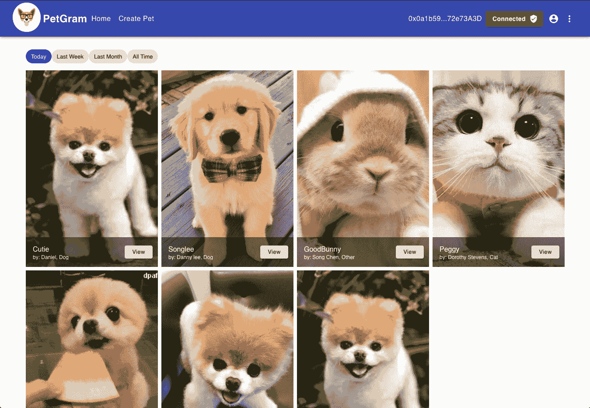

# PetDetails.js

*   路径:`src/components/home-container/pet-details/PetDetails.js`

在这个文件中，我们将添加宠物详细信息、创建 NFT 的功能、创建令牌的交易确认，以及添加评论的简单 React 表单。就本教程的范围而言，我们不打算保存评论或实现 likes 功能，但可以随意扩展。

要实现这一点，我们需要一些东西。让我们通过添加下面一行来导入我们的`apiKey`:

```
import { apiKey } from '../../../APIKEYS'
```

目前，我们的导入应该是这样的:

```
import React, { useState, useEffect } from 'react'
import { useParams } from 'react-router'
import FavoriteIcon from '@material-ui/icons/Favorite'
import ShareIcon from '@material-ui/icons/Share'
import {
  TextField,
  List,
  ListItem,
  ListItemAvatar,
  ListItemText,
  Avatar,
  IconButton,
  Grid,
  Container,
  Typography,
  Button,
  Card,
  StylesProvider,
} from '@material-ui/core'
import './PetDetails.css'
import { apiKey } from '../../../APIKEYS'
...
```

正如你所看到的，我们仍然使用 useState 和 useEffect - React 钩子来帮助我们管理应用程序的状态。

useState 允许我们的功能组件变得有状态，useEffect 允许我们的功能组件利用组件生命周期挂钩，这在过去只支持类组件。简单来说，useEffect 就像 componentDidMount、componentDidUpdate 和 componentWillUnmount 的组合。要了解更多信息，请查看关于 [React 钩子](https://reactjs.org/docs/hooks-effect.html)的文档。

我们使用`useParams`来访问当前路线的参数。在这种情况下，我们需要宠物 id 来从 IPFS 获取宠物的数据。

`StylesProvider`是一个 Material-UI 组件，它帮助我们改变样式应用于组件的方式。其余的导入只是 Material-UI 中的常规元素

我们需要一些变量来保存宠物的信息。在注释“添加状态变量”下添加以下代码:

```
const [image, setPetImage] = useState('')
const [petName, setPetName] = useState('')
const [petOwner, setOwnerName] = useState('')
const [petCategory, setPetCategory] = useState('')
const [input, setInput] = useState('')
const [comment, setComment] = useState('')
const [codeHash, setCodeHash] = useState('')
```

到目前为止，我们的状态变量应该是这样的:

```
const { petId } = useParams()
// Add state variables
const [image, setPetImage] = useState('')
const [petName, setPetName] = useState('')
const [petOwner, setOwnerName] = useState('')
const [petCategory, setPetCategory] = useState('')
const [input, setInput] = useState('')
const [comment, setComment] = useState('')
const [codeHash, setCodeHash] = useState('')
```

`{ petId }`正在从 useParams 对象中提取 petId 值。至于其余的变量，它们都被初始化为一个空字符串。稍后，我们将更新它们。

现在，让我们继续讨论 useEffect 函数。目前我们的情况是这样的:

```
useEffect(() => {
  if (petId) {
    getMetadata()
    getImage()
  }
}, [petId, contractData])
```

如你所见，`useEffect`函数正在调用`getImage`和`getMetadata`函数。让我们首先实现`getImage`函数，编辑这个函数，使它看起来像这样:

```
const getImage = (ipfsURL) => {
  if (!ipfsURL) return
  ipfsURL = ipfsURL.split('://')
  return 'https://ipfs.io/ipfs/' + ipfsURL[1]
}
```

如果您记得我们在`PetGallery`组件中使用了这个函数，我们可以为这个函数创建一段代码并导入它，但是为了清楚起见，让我们保持简单。

让我们继续使用`getMetadata`函数。编辑该函数，使其看起来像这样:

```
const getMetadata = async () => {
  let data = await fetch(`https://ipfs.io/ipfs/${petId}/metadata.json`)
  data = await data.json()
  const [petOwner, petCategory] = data.description.split(',')
  const imageFormated = getImage(data.image)
  setPetImage(imageFormated)
  setPetName(data.name)
  setOwnerName(petOwner)
  setPetCategory(petCategory)
}
```

`getMetadata`函数负责从 IPFS 获取特定宠物的元数据。它通过提供 petId 来做到这一点，然后进行 API 调用，并返回宠物的数据。在保存`petOwner`和`petCategory`变量之前，它通过用逗号分割数据从`data.description`中提取它们。然后调用`getImage`函数来正确格式化图像路径，最后将它们保存到相应的变量中。

在这一点上，我们可以显示宠物的细节，但我们将需要`mintNFT`功能。让我们现在添加它，编辑这个函数，使它看起来像这样:

```
const mintNFT = async (petId) => {
  try {
    const data = await contractData.methods
      .mintPetNFT(`https://${petId}`)
      .send({ from: account })

    setCodeHash(data)
  } catch (err) {
    console.error(err)
  }
}
```

如您所见，PetDetails 组件正在为 account 和 contractData 获取一些属性，我们可以使用它们与智能合同进行交互。我们需要做的就是调用`mintPetNFT`契约方法。这个函数接收 petId，用 pet id 和用户帐户调用契约的`mintPetNFT`方法，然后使用 setCodeHash 函数将返回的数据保存到组件状态。

厉害！现在我们只需要显示这些信息。让我们将此代码添加到“添加宠物详细信息”部分:

```
<div className="flex-container">
  <h2>{`${petName} the ${petCategory}`}</h2>
  <Button
    variant="contained"
    className="wallet-btn"
    color="primary"
    onClick={mintNFT}
  >
    Mint NFT
  </Button>
</div>


<div className="flex-container">
  <div>
    <IconButton aria-label="add to favorites">
      <FavoriteIcon />
    </IconButton>

    <IconButton aria-label="share">
      <ShareIcon />
    </IconButton>
  </div>

  <Typography variant="body1" color="primary">
    0 Likes
  </Typography>
</div>

<Typography gutterBottom variant="subtitle1" className="details-text">
  Pet's Details
</Typography>

<Typography variant="body2" gutterBottom className="details-text">
  Full rights and credits to the owner @{petOwner}...
</Typography>
```

在这段代码中，我们只是简单地插入了从 IPFS 那里得到的宠物细节。注意“薄荷 NFT”按钮连接到`mintNFT`功能。这个函数将为我们创建 NFT。

此时，我们的组件应该显示类似如下的内容:

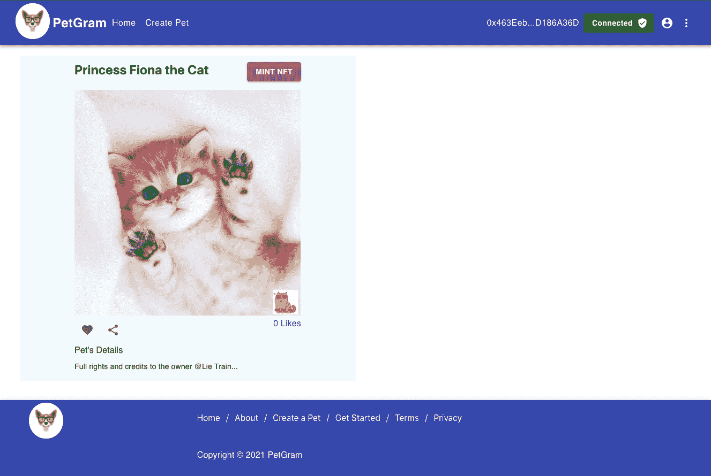

我们仍然缺少铸造令牌的事务确认，即添加注释的 React 表单。让我们从添加交易确认开始。每当我们铸造 NFTS，我们需要一个确认，通知我们，如果我们的交易成功与否。让我们在“添加交易确认”部分添加以下代码:

```
{
  codeHash ? (
    <Card className="code-hash">
      <Typography gutterBottom variant="subtitle1">
        Confirmation Transaction:
      </Typography>
      <p>
        TransactionHash: <span>{codeHash.transactionHash}</span>{' '}
      </p>
      <a
        target="_blank"
        rel="noopener noreferrer"
        href={'https://mumbai.polygonscan.com/tx/' + codeHash.transactionHash}
      >
        <Button variant="contained" color="primary" className="wallet-btn">
          See transaction
        </Button>
      </a>
    </Card>
  ) : (
    ''
  )
}
```

还记得我们的`mintPetNFT`函数吗？这个函数返回一个对象数据，这个对象里面是事务哈希。事务哈希是一个唯一的字符串，它被赋予每个经过验证并添加到区块链的事务。要查看这个事务，我们需要做的就是添加 Polygonscan 链接和`transactionHash`。

现在，点击“铸造 NFT”按钮，尝试铸造 NFT。点击之前，请确保您的钱包已连接。一旦你点击“薄荷 NFT”按钮 metamask 应该提示，继续并确认交易。

此交易可能需要几分钟时间，过程如下:

1.  确认交易
2.  事务进入队列
3.  交易待定
4.  交易完成了

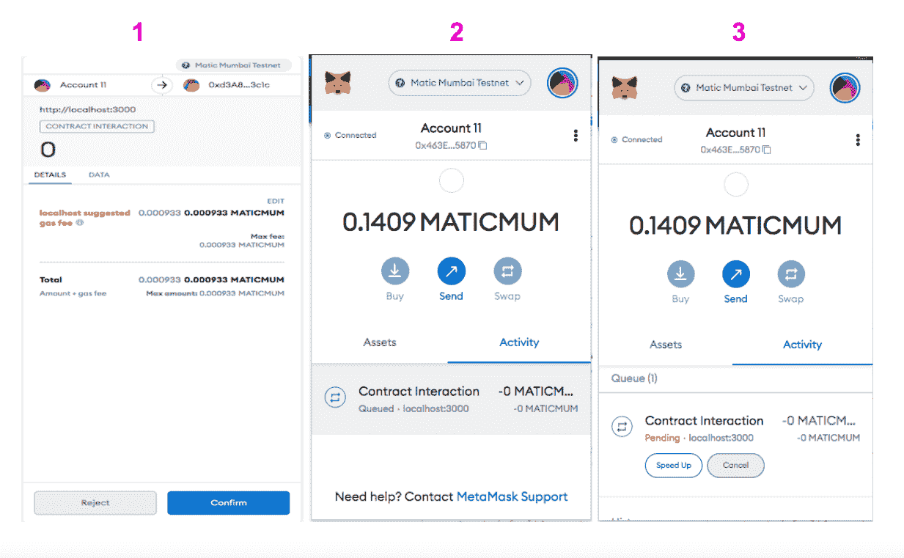

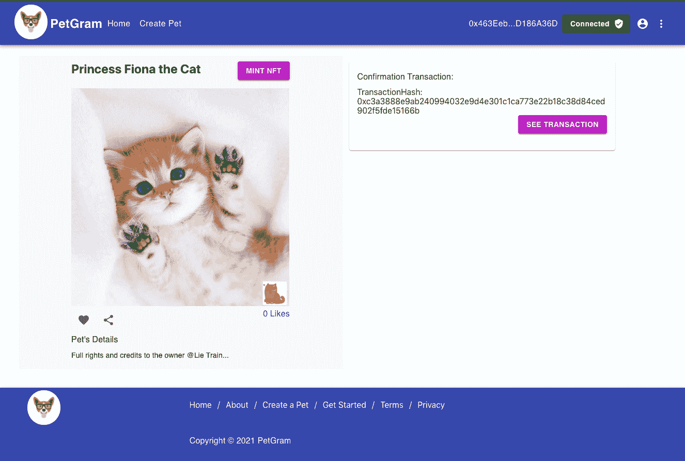

现在，每当我们铸造一枚 NFT 币时，我们都会得到这一确认，我们将能够在 Polygonscan 上查看交易细节。

太棒了，我们到最后一部分了！这是一个很长的教程，但我们学到了很多。让我们添加最后一部分，即反应形式。在注释“添加表单”下添加以下代码:

```
<form noValidate autoComplete="off">
  <TextField
    id="outlined-basic"
    label="Comment"
    variant="outlined"
    value={input}
    onChange={handleChange}
    className="text-field"
  />
</form>
<Button type="submit" variant="contained" onClick={handleSubmit}>
  Add comment
</Button>
```

这是一个简单的添加评论的表单。注意，文本字段需要`handleChange`函数，提交按钮需要`handleSubmit`函数，所以让我们也添加它们。编辑这些函数，使其如下所示:

```
const handleChange = (event) => {
  setInput(event.target.value)
}

const handleSubmit = (event) => {
  event.preventDefault()
  setComment(input)
  setInput('')
}
```

`handleChange`功能将用户输入设置到`input variable`。然后`handleSubmit`函数将`comment variable`设置为等于`input variable`，然后将输入变量重置为空字符串。我们使用`input variable`作为临时变量，这样我们可以重置表单文本字段。

现在，我们需要在页面上显示评论。为此，在“显示注释”部分下添加以下代码:

```
{
  comment ? (
    <ListItem style={{ paddingLeft: '0px' }}>
      <ListItemAvatar>
        <Avatar alt="Remy Sharp" />
      </ListItemAvatar>
      <ListItemText
        secondary={
          <React.Fragment>
            <Typography
              component="span"
              variant="body2"
              className="inline"
              color="textPrimary"
            >
              {account}:
            </Typography>
            {` ${comment}`}
          </React.Fragment>
        }
      />
    </ListItem>
  ) : (
    <h2>No comments</h2>
  )
}
```

我们将用户的帐户和评论添加到 UI 中。尝试发布一条评论，结果应该类似于以下内容:

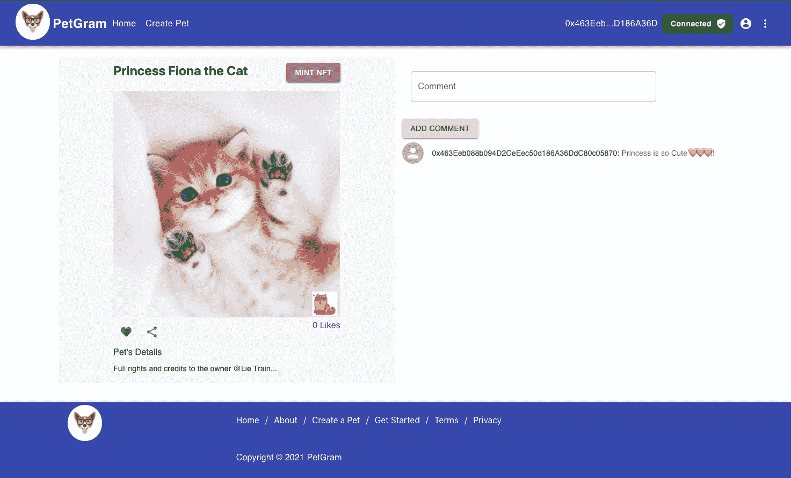

请记住，我们不会保存评论，所以只要您刷新页面，评论就会消失。

# 结论

恭喜你！您已经创建了自己的 fullstack dApp <g-emoji class="g-emoji" alias="sunglasses" fallback-src="https://github.githubassets.cimg/icons/emoji/unicode/1f60e.png">😎</g-emoji> <g-emoji class="g-emoji" alias="unicorn" fallback-src="https://github.githubassets.cimg/icons/emoji/unicode/1f984.png">🦄</g-emoji>！！完成本教程后，您应该对如何创建用于创建和管理 NFT 的 dApp 有了很好的理解。

# 关于作者

艾伯特·卡巴贾尔是一名 web 开发人员，区块链的狂热爱好者，对软件开发和去中心化充满热情。请随时在 [GitHub](https://github.com/electrone901) 上与我联系。

# 参考

*   块菌文件:[https://www.trufflesuite.com/docs/truffle/overview](https://www.trufflesuite.com/docs/truffle/overview)
*   多边形(Matic)文档:[https://docs . Matic . network/docs/develop/getting-started](https://docs.matic.network/docs/develop/getting-started)
*   元掩模文件:[https://docs.metamask.io/guide/#why-metamask](https://docs.metamask.io/guide/#why-metamask)
*   Web3 docs: [https://web3js.readthedocs.io/en/v1.4.0/](https://web3js.readthedocs.io/en/v1.4.0/)
*   反应文件:[https://reactjs.org/docs/getting-started.html](https://reactjs.org/docs/getting-started.html)
*   IPFS 文档:[https://docs . ipfs . io/concepts/what-is-ipfs/#去中心化](https://docs.ipfs.io/concepts/what-is-ipfs/#decentralization)
*   async/Await:[https://www . geeks forgeeks . org/async-Await-function-in-JavaScript](https://www.geeksforgeeks.org/async-await-function-in-javascript)
*   材质-ui 组件:[https://material-ui.com](https://material-ui.com)
*   反应钩子:[https://reactjs.org/docs/hooks-effect.html](https://reactjs.org/docs/hooks-effect.html)