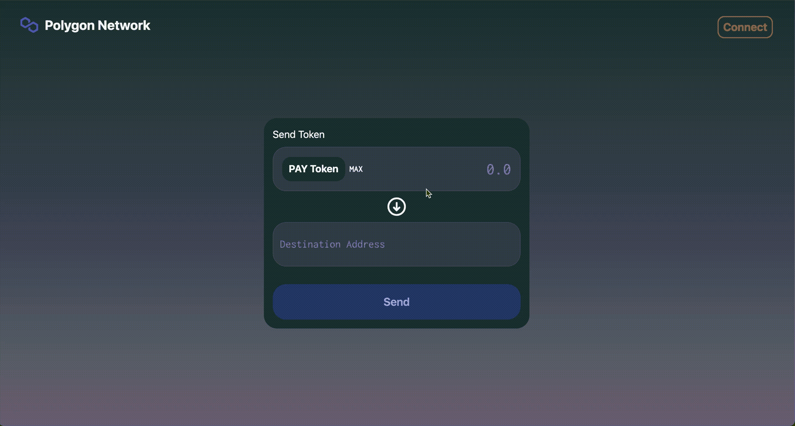
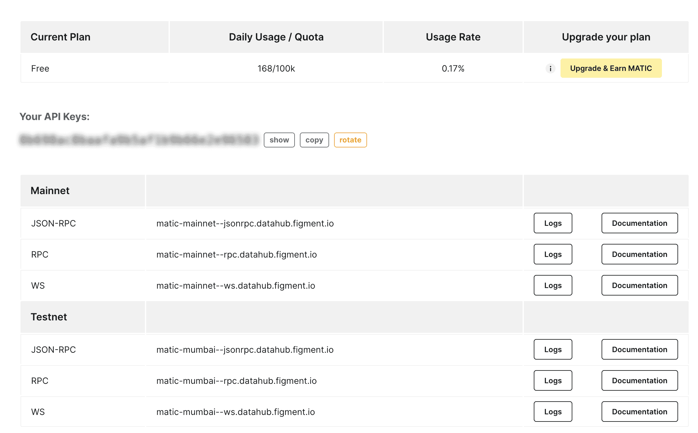
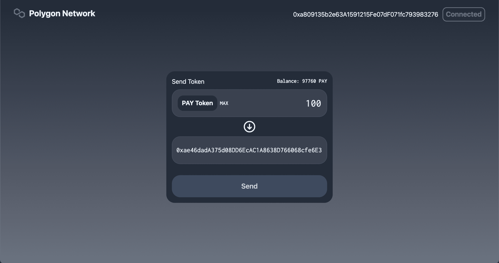

# 介绍

> 原文：<https://github.com/figment-networks/learn-tutorials/blob/master/polygon/polygon-peer-to-peer-payment-dapp-part-1.md>

本教程将学习如何创建一个点对点支付 dApp 和部署我们的多边形网络智能合同。我们将首先创建一个 ERC20 令牌智能合约，并在我们的支付 dApp 中使用该令牌发送到其他地址。

这是两部分教程的第一部分。在这一部分，我们将学习如何使用单个令牌进行支付。第二部分将介绍如何向我们的支付 dApp 添加其他令牌。

这是我们将创建的 dApp 的外观:

[](https://github.com/figment-networks/learn-tutorials/raw/master/assets/payment-dApp-demo.gif)

# 先决条件

要成功完成本教程，您需要了解区块链技术、Solidity 编程语言和 ERC20 令牌的基础知识。

我们将使用 [web3.js](https://web3js.readthedocs.io/en/v1.5.2/) 连接到 Polygon 和前端的 [Next.js](https://nextjs.org/) 框架。建议先学习 Next.js 的基础知识再继续。

# 要求

块菌为创建和测试区块链应用程序提供了一个本地开发环境。 [Metamask](https://metamask.io) -你需要在浏览器中安装 Metamask 钱包。[NodeJs](https://nodejs.org/en/)——你必须安装 Node.js 的最新版本。我们建议使用 v14.17.6 LTS。 [Figment DataHub](https://figment.io/datahub/) 帐户——我们将使用 DataHub 的 Polygon RPC URL 来部署智能合同。

本教程涵盖的主题:

*   为 Solidity 和 NextJs 设置开发。
*   创建 ERC20 令牌智能合约。
*   将智能合约部署到 Polygon Testnet。
*   使用 web3js 将智能合同链接到前端
*   使用 TailwindCSS 创建 UI。

# 项目设置

在终端中运行以下命令来安装所需的包并创建项目目录。

```js
npm install -g truffle
npx create-next-app --typescript payment-dapp
cd payment-dapp
truffle init
yarn add @openzeppelin/contracts @truffle/hdwallet-provider web3 dotenv tailwindcss 
```

命令`npx create-next-app`将创建一个支持 typescript 的基本 Next.js 项目，而`truffle init`将搭建一个 Truffle 项目。

代码库`@openzeppelin/contracts`、`@truffle/hdwallet-provider`和`web3`将用于创建、部署和集成我们的智能合同。`dotenv`用于处理环境变量，`tailwindcss`用于 UI 样式。

# 创建智能合同

在`contracts`目录中创建一个名为`PaymentToken.sol`的新文件，并添加以下代码:

```js
// SPDX-License-Identifier: GPL-3.0
pragma solidity ^0.8.6;
import "@openzeppelin/contracts/token/ERC20/ERC20.sol";

contract PaymentToken is ERC20 {
    address public owner;

    constructor() ERC20("Payment Token", "PAY") {
        owner = msg.sender;
        _mint(msg.sender, 100000 * 10**18);
    }

    function mint(address to, uint256 amount) external {
        require(msg.sender == owner, "Only owner can mint");
        _mint(to, amount);
    }
}
```

我们使用名为**支付令牌**的 OpenZeppelin ERC20 合约创建一个新的 ERC20 令牌。这是我们将用于在点对点支付 dApp 中进行支付的令牌。

在我们合同的构造者中，我们铸造并发送 **100，000** 支付令牌给合同的**所有者**，部署合同的账户。

由于`PaymentToken`是一个 ERC20 令牌，我们使用的是 OpenZeppelin 的 ERC20 合约，我们有一些现成的函数，如`transfer`、`approve`、`allowance`等。我们将在我们的 dApp 中研究`transfer`函数，当我们开始我们的前端时再回来讨论这个问题。

# 用 Truffle 编译和部署

既然我们已经准备好了 ERC20 令牌，我们必须做一些修改来编译和部署我们的令牌。

转到`migrations`目录，创建一个新文件`2_payment_token_migration.js`并添加以下代码:

```js
const PaymentToken = artifacts.require("PaymentToken");

module.exports = function (deployer) {
  deployer.deploy(PaymentToken);
};
```

在运行部署命令之前，我们需要从 DataHub 获取一个 Polygon RPC URL 和 API 键。在 [DataHub](https://datahub.figment.io/) 上创建一个账户，前往多边形部分，复制你的 API 密匙。

[](https://github.com/figment-networks/learn-tutorials/raw/master/assets/polygon-datahub-api.png)

在项目的根目录(`/payment-dapp/`)中创建一个`.env`文件，并将密钥粘贴在环境变量的名称之后，如下所示:

```js
DATAHUB_POLYGON_API=paste your API key here 
```

现在，我们需要获得将用于部署智能合约的帐户的秘密恢复短语(助记符)。转到您的元掩码扩展并获取您帐户的助记符；如果你不知道如何获得你的记忆法，[遵循这个教程](https://metamask.zendesk.com/hc/en-us/articles/360015290032-How-to-reveal-your-Secret-Recovery-Phrase)。

一旦你有了助记符，在项目根目录(`/payment-dapp/.secret`)下创建一个名为`.secret`的文件，并将你的助记符粘贴到那里。确保你将`.secret`添加到你的`.gitignore`文件中，这样你的助记符就不会被添加到你的`git`历史中或者被意外上传到 GitHub。

为了将我们的合同部署到 Polygon testnet，我们需要在我们的帐户中有一些自动令牌来支付汽油费。要获得一些 testnet MATIC 令牌，请前往 [Polygon 水龙头](https://faucet.polygon.technology/)在您的帐户中获得 0.1 MATIC，这足以部署合同，因为在 Polygon 网络上汽油费非常便宜。

接下来，打开`truffle-config.js`，删除现有内容，然后添加以下代码:

```js
const HDWalletProvider = require("@truffle/hdwallet-provider");
const fs = require("fs");
const mnemonic = fs.readFileSync(".secret").toString().trim();
require('dotenv').config()

module.exports = {
  networks: {
    development: {
      host: "localhost",
      port: 7545,
      network_id: "*",
    },
    matic: {
      provider: () =>
        new HDWalletProvider(
          mnemonic,
          `https://matic-mumbai--rpc.datahub.figment.io/apikey/${process.env.DATAHUB_POLYGON_API}}/`
        ),
      network_id: 80001,
      confirmations: 2,
      timeoutBlocks: 200,
      skipDryRun: true,
      chainId: 80001,
    },
  },
  contracts_directory: "./contracts",
  contracts_build_directory: "./abis",
  compilers: {
    solc: {
      version: "^0.8.6",
      optimizer: {
        enabled: true,
        runs: 200,
      },
    },
  },

  db: {
    enabled: false,
  },
};
```

我们使用`@truffle/hdwallet-provider`和`mnemonic`来使用我们资助的 testnet 账户并支付汽油费。Truffle 的钱包提供程序允许我们使用我们的元掩码中的相同帐户，使用私钥或助记符。

接下来，我们将使用 RPC URL、链 ID 和 Truffle 提供程序创建一个提供程序。链 ID 和其他与多边形网络相关的信息可以在这里找到[。](https://docs.polygon.technology/docs/develop/metamask/config-polygon-on-metamask)

要编译和部署智能合约，请运行以下命令，

```js
truffle compile

truffle deploy --network matic 
```

# 创建前端并集成智能合同

既然我们已经完成了智能契约并创建了令牌，那么是时候开发前端并使用 web3js 集成我们的契约了。

我们将为契约调用创建一个上下文，并通过它提供所有的数据和功能。在`context`目录下创建一个名为`DataContext.tsx`的文件。

`context/DataContext.tsx`

```js
declare let window: any;
import { createContext, useContext, useState } from "react";
import Web3 from "web3";
import PaymentToken from "../abis/PaymentToken.json";

interface DataContextProps {
  account: string;
  loading: boolean;
  loadWallet: () => Promise<void>;
  sendPayment: ({
    amount,
    toAddress,
  }: {
    amount: any;
    toAddress: any;
  }) => Promise<any>;
  balance: number;
}

const DataContext = createContext<DataContextProps | null>(null);

export const DataProvider: React.FC = ({ children }) => {
  const data = useProviderData();

  return <DataContext.Provider value={data}>{children}</DataContext.Provider>;
};

export const useData = () => useContext<DataContextProps | null>(DataContext);
```

这里，我们为上下文创建了一个接口和一个`useData`函数，以便在组件中轻松使用上下文。

```js
export const useProviderData = () => {
  const [loading, setLoading] = useState(true);
  const [account, setAccount] = useState<string>();
  const [paymentToken, setPaymentToken] = useState<any>();
  const [balance, setBalance] = useState<number>();

  const loadWallet = async () => {
    if (window.ethereum) {
      window.web3 = new Web3(window.ethereum);
      await window.ethereum.enable();
      const web3 = window.web3;
      var allAccounts = await web3.eth.getAccounts();
      setAccount(allAccounts[0]);

      const paymentTokenData = PaymentToken.networks["80001"];
      if (paymentTokenData) {
        var paymentTokenInstance = new web3.eth.Contract(
          PaymentToken.abi,
          paymentTokenData.address
        );
        setPaymentToken(paymentTokenInstance);
        var bal = await paymentTokenInstance.methods
          .balanceOf(allAccounts[0])
          .call();
        setBalance(bal);
      } else {
        window.alert("TestNet not found");
      }
      setLoading(false);
    } else {
      window.alert("Non-Eth browser detected. Please consider using MetaMask.");
    }
  };

  const sendPayment = async ({ amount, toAddress }) => {
    try {
      const amountInWei = window.web3.utils.toWei(amount, "ether");
      var bal = await paymentToken.methods.balanceOf(account).call();
      if (bal < amountInWei) {
        return "You don't have enough balance";
      }
      const txHash = await paymentToken.methods
        .transfer(toAddress, amountInWei)
        .send({
          from: account,
        });
      var bal = await paymentToken.methods.balanceOf(account).call();
      setBalance(bal);
      return "Payment success";
    } catch (e) {
      return e.message;
    }
  };

  return {
    account,
    loading,
    loadWallet,
    sendPayment,
    balance,
  };
};
```

在`useProviderData`中，我们创建了两个函数- `loadWallet`和`sendPayment`。在`loadWallet`中，我们获取 web3 提供者中的所有账户(在我们的例子中是元掩码)。使用来自`abis`目录的 ABI 创建一个`PaymentToken`合同实例的实例。然后，我们将使用 ERC20 令牌中可用的`balanceOf`函数获取登录帐户的余额。

> 您还可以在元掩码中看到令牌余额。点击`Add Token`按钮，输入`PaymentToken`合同地址。部署合同时，您可以从合同 ABI 或终端获取已部署合同的地址。

在`sendPayment`中，我们接受 tokens 的数量和接收者地址作为参数，并将数量转换为 Wei。获取用户的当前余额，并检查余额是否大于请求转移的金额。如果余额大于请求的金额，我们调用智能合同实例上的`transfer`函数，并在 Wei 中传递接收方地址和金额。由于这是一个交易，我们需要在`transfer`调用上调用`send`函数，并传入`from`参数来支付交易的汽油费。

# 使用 TailwindCSS 创建用户界面

首先，我们将创建 Navbar，它将包含一个连接到 Metamask wallet 的按钮，并显示 Metamask 中的当前地址。在`components`目录下创建一个名为`Navbar.tsx`的文件。

```js
import React from "react";
import { useData } from "../contexts/DataContext";

function Navbar() {
  const { account, loadWallet } = useData();
  return (
    <>
      <header className="flex md:flex-row flex-col px-3 lg:px-10 justify-between items-center pt-5 space-y-2">
        <div className="flex flex-row items-center">
          
          <span className="text-2xl font-bold text-white">Polygon Network</span>
        </div>
        {account ? (
          <div className="flex flex-row space-x-3 items-center text-white text-lg">
            <span>{account}</span>
            <div className="px-2 py-1 border-2 border-green-500 rounded-xl cursor-pointer text-center">
              <span className="text-xl font-bold text-green-500">
                Connected
              </span>
            </div>
          </div>
        ) : (
          <div
            className="px-2 py-1 border-2 border-red-500 rounded-xl cursor-pointer text-center"
            onClick={() => {
              loadWallet();
            }}
          >
            <span className="text-xl font-bold text-red-500">Connect</span>
          </div>
        )}
      </header>
    </>
  );
}

export default Navbar;
```

在这里，我们检查是否有帐户地址，然后显示地址；否则，我们提供连接按钮来连接元掩码。

要创建主 UI，打开`pages/index.tsx`并添加以下代码。

```js
import Head from "next/head";
import { useState } from "react";
import Web3 from "web3";
import Navbar from "../components/Navbar";
import { useData } from "../contexts/DataContext";

export default function Home() {
  const { account, loadWallet, sendPayment, balance } = useData();

  const [toAddress, setToAddress] = useState("");
  const [amount, setAmount] = useState("");
  const [error, setError] = useState("");
  const [button, setButton] = useState("Send");

  return (
    <div className="flex flex-col min-h-screen justify-start bg-gradient-to-b from-gray-800  to-gray-500">
      <Head>
        <title>Peer-to-Peer Payment dApp</title>
        <link rel="icon" href="/favicon.ico" />
      </Head>
      <Navbar />

      <main className="mt-36 flex justify-center items-start">
        <div className="w-full md:w-2/6 bg-gray-800 rounded-3xl p-4 mx-3">
          <div className="flex flex-col items-center space-y-2">
            <div className="w-full flex flex-row justify-between">
              <span className="text-white text-lg text-start">Send Token</span>
              <span className="text-white text-base text-start font-bold font-inconsolata">
                {balance &&
                  `Balance: ${Web3.utils.fromWei(
 balance.toString(),
 "ether"
 )} PAY`}
              </span>
            </div>
            <div className="bg-gray-700 h-20 w-full my-1 border border-gray-600 rounded-3xl flex flex-row justify-between items-center px-4">
              <div className="flex flex-row items-center space-x-2">
                <div className="px-3 py-2 bg-gray-800 rounded-2xl flex flex-row items-center">
                  <span className="text-white text-lg font-bold">
                    PAY Token
                  </span>
                </div>
                <span
                  className="text-white text-base font-bold font-inconsolata cursor-pointer"
                  onClick={() => {
                    setAmount(
                      Web3.utils.fromWei(balance.toString(), "ether").toString()
                    );
                  }}
                >
                  MAX
                </span>
              </div>
              <input
                className="font-inconsolata text-3xl text-white bg-transparent w-2/4 text-right outline-none"
                placeholder="0.0"
                value={amount}
                onChange={(e) => {
                  setAmount(e.target.value);
                }}
              />
            </div>
            <svg
              xmlns="http://www.w3.org/2000/svg"
              className="h-10 w-10"
              fill="none"
              viewBox="0 0 24 24"
              stroke="#fff"
            >
              <path
                strokeLinecap="round"
                strokeLinejoin="round"
                strokeWidth={2}
                d="M15 13l-3 3m0 0l-3-3m3 3V8m0 13a9 9 0 110-18 9 9 0 010 18z"
              />
            </svg>
            <div className="bg-gray-700 h-20 w-full my-1 border border-gray-600 rounded-3xl flex flex-row justify-between items-center px-3">
              <input
                className="w-full font-inconsolata text-xl text-white bg-transparent outline-none"
                placeholder="Destination Address"
                value={toAddress}
                onChange={(e) => {
                  setToAddress(e.target.value);
                }}
              />
            </div>
            <div className="h-4" />
            <div
              className="h-16 w-full rounded-3xl flex justify-center items-center cursor-pointer"
              style={{ backgroundColor: "#214770" }}
              onClick={async () => {
                setError("");
                if (!account) {
                  setError("Please connect your wallet");
                } else if (amount === "") {
                  setError("Please set amount");
                } else if (toAddress === "") {
                  setError("Please set destination address");
                } else {
                  setButton("Sending...");
                  var msg = await sendPayment({ amount, toAddress });
                  if ((await msg) === "Payment success") {
                    setAmount("");
                    setToAddress("");
                    setButton("Payment Success");
                    setTimeout(() => {
                      setButton("Send");
                    }, 1000);
                    setError("");
                  } else {
                    setError(msg);
                  }
                }
              }}
            >
              <span className="font-semibold text-xl text-blue-300">
                {button}
              </span>
            </div>
            {error && <span className="text-red-600 font-bold">*{error}</span>}
          </div>
        </div>
      </main>
    </div>
  );
}
```

这里我们创建了两个文本字段和一个按钮。一个文本字段接受要传输的令牌数，另一个文本字段接受接收者的地址。我们还在文本字段上方显示帐户的当前余额，并显示一个按钮来选择钱包中可用的最大令牌量。

当用户点击**发送**按钮时，我们从上下文中调用`sendPayment`函数，它将令牌发送到接收者的地址，并在 UI 中更新当前帐户的新余额。

我们现在已经完成了用户界面，这是支付网关的外观:

[](https://github.com/figment-networks/learn-tutorials/raw/master/assets/peer-to-peer-payment-ui.png)

# 结论

恭喜你完成教程！感谢您抽出时间来完成它。在本教程中，我们学习了如何创建一个 ERC20 令牌，将其部署到 Polygon testnet 并为支付网关制作一个前端 dApp。在本教程的下一部分，我们将看到如何扩展这个 dApp 的功能，并向我们的支付 dApp 添加更多的多边形网络上现有的令牌。

# 关于作者

我是 Viral Sangani，一个致力于区块链项目的技术爱好者&热爱 Web3 社区。请随时在 [GitHub](https://github.com/viral-sangani) 上与我联系。